# Caelius Interview Preparation

## Section 01 - Project Deep Dive and Architecture

This section prepares the highest-value project questions for a Caelius GET technical panel. The answers use:

- **Project method:** Problem -> Tech choice -> Your role -> Result -> Learning
- **Concept method:** Define -> Example -> Real project use
- **Behavioral method:** Situation -> Task -> Action -> Result -> Learning
- **Technical honesty:** clearly separate what is implemented from what should be improved

The material is grounded in the real local repositories:

- Nodeflowz: `C:\Users\Slim-5\Desktop\nodebase`
- CommentPulse: `C:\Users\Slim-5\Desktop\youtube-sentiment-mlops-pipeline`
- AcadAI: `C:\Users\Slim-5\OneDrive\Desktop\AcadAI`

---

# 1. Tell Me About Your Projects

## Interview-ready answer

> I have built three projects that demonstrate different parts of software engineering.
>
> **Nodeflowz** is a full-stack workflow automation platform. Users visually connect trigger and action nodes, save the graph, and execute it asynchronously. I used Next.js, React Flow, tRPC, Prisma, PostgreSQL, and Inngest. The most important engineering work was representing workflows as graphs, sorting nodes in dependency order, securely managing integration credentials, and making execution observable.
>
> **CommentPulse** is a production-style YouTube comment sentiment and analytics platform. A Chrome extension extracts comments, a Flask API performs sentiment inference, and heavy analytics can run through a Redis-backed worker queue with retries and dead-letter handling. Its ML lifecycle is managed through DVC, and the service exposes readiness and Prometheus-compatible metrics.
>
> **AcadAI** is a multi-agent academic tutor grounded in a student's own notes. It combines Mistral, FAISS, BGE embeddings, hybrid retrieval, a reasoning and tutor pipeline, critic refinement, grounding checks, viva practice, and learning memory.
>
> Together, these projects taught me full-stack system design, asynchronous integrations, production ML, RAG, evaluation, and the importance of communicating tradeoffs honestly.

## Portfolio map

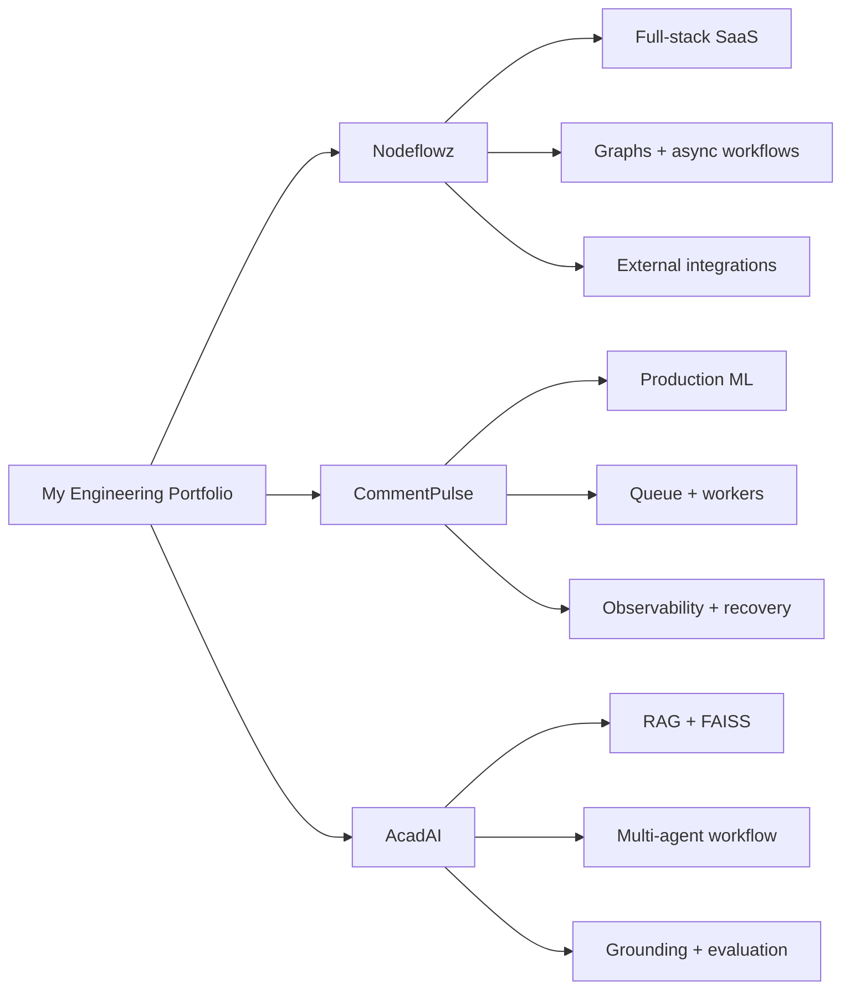

## Why this answer works for Caelius

Caelius works heavily with integrations, APIs, data, automation, and enterprise platforms. This answer immediately connects your experience to those themes without claiming that you already know every Salesforce or MuleSoft feature.

---

# 2. Walk Me Through Nodeflowz

## Problem

Many business processes require people to manually move data between services, call AI providers, send messages, or update spreadsheets. That creates repetitive work, inconsistent execution, and poor visibility when something fails.

Nodeflowz solves this by letting users visually define an automation as connected nodes.

## Interview-ready answer

> Nodeflowz is a visual workflow automation platform. A user creates a workflow on a drag-and-drop React Flow canvas, where every node represents either a trigger or an action. Examples include manual and webhook triggers, OpenAI or Gemini processing, HTTP requests, Slack or Discord messages, and Google Sheets updates.
>
> The frontend sends the graph through tRPC. The backend validates ownership and saves nodes and connections transactionally using Prisma and PostgreSQL. When the user executes a workflow, the request sends an Inngest event instead of waiting for every node to finish synchronously.
>
> The Inngest function loads the graph, performs a topological sort to determine dependency order, selects the correct executor for each node type, passes a shared context between nodes, records the execution result, and publishes real-time status updates.
>
> I chose this architecture because workflow execution can be slow and failure-prone when it calls external providers. Separating request handling from background execution makes the platform more reliable and easier to scale.

## Architecture

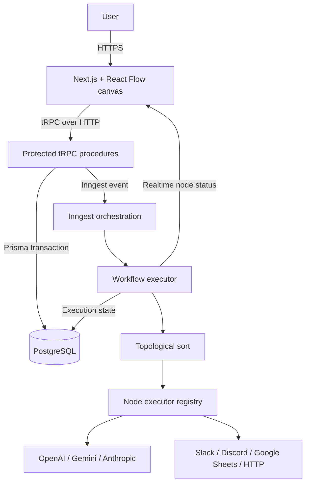

## Real execution code

This excerpt reflects the implemented execution path:

```ts
const sortedNodes = await step.run("prepare-workflow", async () => {
  const workflow = await prisma.workflow.findUniqueOrThrow({
    where: { id: workflowId },
    include: { nodes: true, connections: true },
  });

  return topologicalSort(workflow.nodes, workflow.connections);
});

let context = event.data.initialData || {};

for (const node of sortedNodes) {
  const executor = getExecutor(node.type as NodeType);
  context = await executor({
    data: node.data as Record<string, unknown>,
    nodeId: node.id,
    userId,
    context,
    step,
    publish,
  });
}
```

## Result and honest measurable outcome

- Supports multiple trigger, AI, messaging, HTTP, and spreadsheet node types.
- Persists workflows, graph connections, credentials, and execution records.
- Uses production retries in Inngest and records failed execution details.
- Enforces free-tier limits of 10 workflows and 5 credentials.

Do **not** invent active-user or revenue numbers. A strong honest result is:

> "The measurable result is functional breadth and reliability behavior: the platform supports multiple integration categories, persistent execution history, production retries, encrypted credentials, and transactional workflow updates."

## Learning

> My biggest learning was that a workflow builder is not mainly a canvas problem. The harder engineering problems are graph correctness, failure recovery, credential security, idempotency, and visibility into asynchronous execution.

---

# 3. Explain the Nodeflowz Data Flow

## Clarifying question to ask first

> "Would you like the flow for creating and saving a workflow, or the runtime execution flow?"

If the interviewer says both, explain them separately.

## Save flow

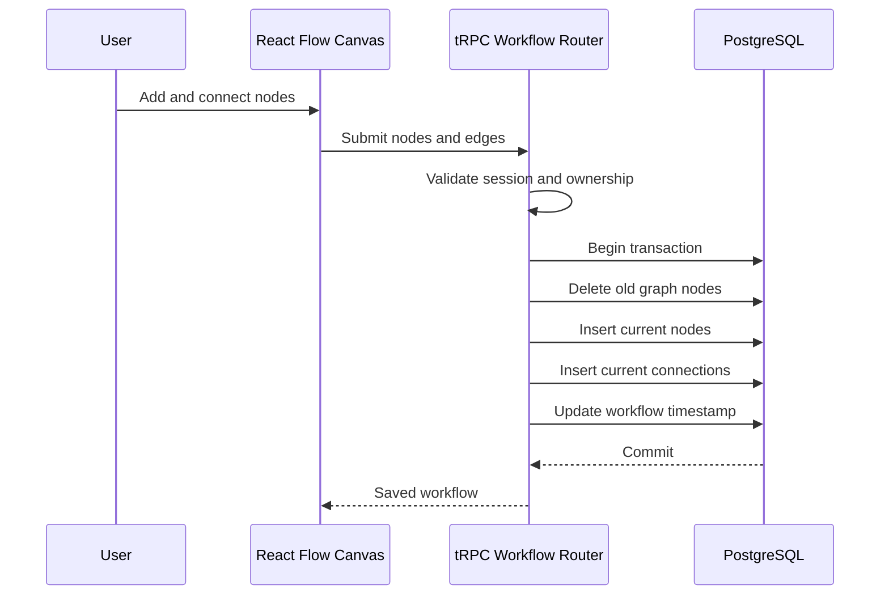

## Execution flow

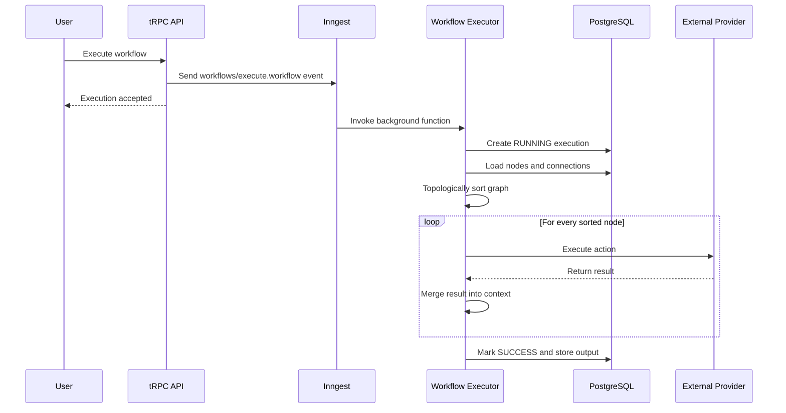

## Important tradeoff

The current executor runs sorted nodes sequentially. That is deterministic and simple, but independent branches cannot yet execute in parallel.

> "To improve it, I would calculate dependency levels and execute nodes at the same level with controlled concurrency. I would namespace outputs by node ID to avoid write conflicts between parallel branches."

---

# 4. Why Did You Use a Queue or Background Orchestrator?

## One-line definition

> A message queue or background orchestrator decouples request acceptance from slow or failure-prone processing.

## Simple example

A user triggers a workflow containing an AI call and a Google Sheets update. If the HTTP request waits for both, it may time out. With asynchronous execution, the API accepts the request quickly and the worker processes it reliably.

## Nodeflowz use case


## CommentPulse use case

Heavy analytics such as topic extraction, word clouds, and trend graphs run as jobs. The Redis worker:

1. Blocks until a job arrives.
2. Marks the job as running.
3. Executes the matching handler.
4. Retries failures.
5. Sends permanently failed jobs to a dead-letter queue.

```python
if attempts < max_job_attempts:
    client.rpush(queue_name, json.dumps(message))
else:
    client.rpush(dead_letter_queue_name, json.dumps(message))
```

## Interview-ready comparison

> In Nodeflowz, I use Inngest because workflow steps need durable orchestration, retries, and per-step behavior. In CommentPulse, I use a simpler Redis queue and worker because analytics jobs have straightforward submit, process, poll, and retry lifecycles. The underlying principle is the same: keep slow work outside the user-facing request.

## Caelius connection

> "This is similar to enterprise integration scenarios where one application should not fail or block only because a downstream system is slow. A queue improves decoupling and resilience."

---

# 5. Walk Me Through CommentPulse

## Problem

YouTube creators and teams receive large volumes of comments, but manually understanding sentiment, recurring topics, and audience concerns is slow and inconsistent.

## Interview-ready answer

> CommentPulse is a production-style YouTube comment sentiment and analytics platform. A Chrome extension extracts visible comments from a YouTube page and sends them to a Flask API. The API preprocesses the comments, transforms them using a saved TF-IDF vectorizer, and predicts sentiment with the selected trained classifier.
>
> The same service generates local insights, topics, topic-level sentiment, keyword charts, word clouds, and sentiment trends. Lightweight requests can run synchronously, while heavy analytics can be submitted as background jobs. In scaled mode, Redis stores job state and a separate worker executes jobs with retries and dead-letter handling.
>
> The ML training lifecycle is defined as a DVC pipeline: ingestion, preprocessing, model building, evaluation, and registration. The runtime also exposes health, readiness, model-card, and Prometheus-compatible metrics endpoints.
>
> My main learning was that a useful ML project is not only the model. It also needs reproducible data workflows, APIs, validation, monitoring, recovery behavior, and honest model-quality reporting.

## Architecture

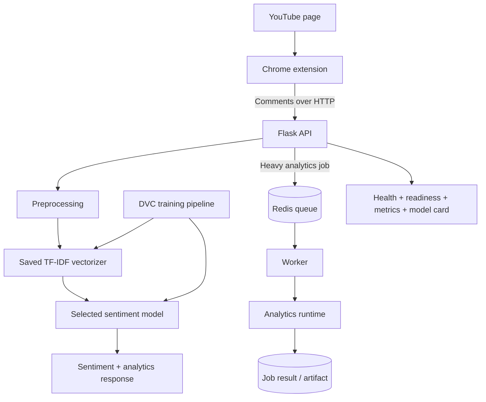

## Real inference code

```python
def predict_sentiments(self, texts: list[str]) -> list[int]:
    processed = [self.preprocess_comment(text) for text in texts]
    matrix = self.vectorizer.transform(processed)
    predictions = self.model.predict(matrix)
    return [int(prediction) for prediction in predictions]
```

## Real model-selection approach

The training code compares:

- Logistic Regression
- Linear SVC
- LightGBM

It selects the candidate using macro F1 first, then weighted F1, then accuracy.

```python
best_model_name = max(
    results,
    key=lambda name: (
        results[name]["validation_metrics"]["macro_f1"],
        results[name]["validation_metrics"]["weighted_f1"],
        results[name]["validation_metrics"]["accuracy"],
    ),
)
```

## Honest result

The currently persisted offline evaluation set contains only four test rows and reports:

- Accuracy: `0.25`
- Macro F1: `0.133333`

Do not hide this if asked deeply.

> "The system architecture is production-oriented, but the current model-quality result is prototype-grade because the labeled evaluation dataset is extremely small. I documented that limitation and built dataset curation, evaluation, and promotion workflows so the next improvement is measurable rather than cosmetic."

That answer demonstrates ownership better than bluffing about model accuracy.

---

# 6. What Was the Hardest Problem in CommentPulse?

## STAR answer

### Situation

The initial project behaved more like an ML demo: model artifacts existed, but long-running analytics, failure recovery, and operational visibility were limited.

### Task

Make the runtime behave more like a reliable service while keeping local development easy.

### Action

- Separated shared analytics logic into `analytics_runtime.py`.
- Added asynchronous job endpoints.
- Added a Redis-backed queue and separate worker.
- Kept an in-process fallback for development without Redis.
- Added bounded retries and dead-letter handling.
- Added health, readiness, metrics, and model-card endpoints.
- Added tests for retries, permanent failures, and admin behavior.

### Result

The same product can now run in:

- Simple local mode without Redis.
- Scaled mode with separate API, Redis, and worker services.
- A failure-aware mode where permanent job failures can be inspected and replayed.

### Learning

> I learned that reliability should be designed as explicit states and transitions. A failed job should not simply disappear; the system must record attempts, expose the failure, and provide a recovery path.

## Failure flow

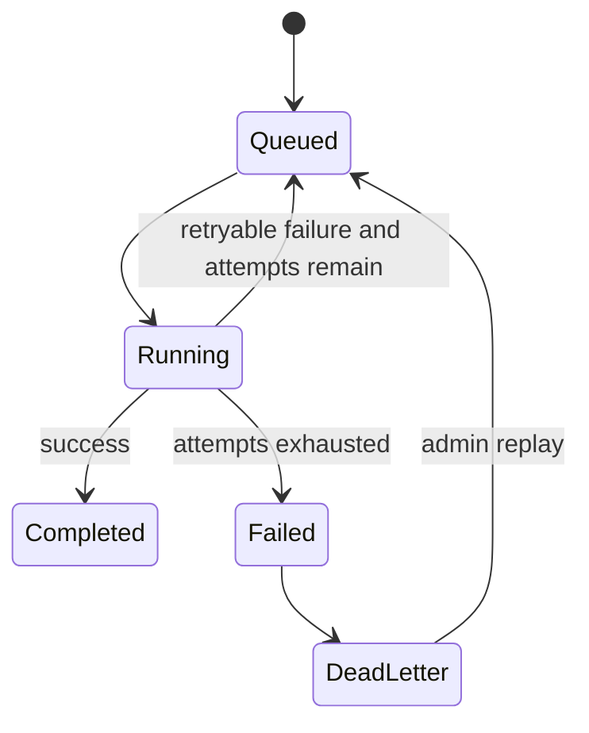

---

# 7. Walk Me Through AcadAI

## Problem

General-purpose chatbots may provide fluent answers, but they are not automatically aligned with a student's exact notes, syllabus, terminology, or exam expectations. They can also produce unsupported claims.

## Interview-ready answer

> AcadAI is an evidence-grounded academic tutor that helps students learn from their own notes. It uses a persisted FAISS store containing 12,263 chunks from 323 source paths, embedded with the 1,024-dimensional `BAAI/bge-large-en-v1.5` model.
>
> When a student asks a question, AcadAI expands and classifies the query, retrieves candidate chunks, and reranks them using dense similarity, TF-IDF lexical similarity, keyword overlap, and source or subject boosts. A Reasoning Agent builds an answer plan, a Tutor Agent generates an exam-oriented explanation, a Critic evaluates relevance, completeness, accuracy, and clarity, and a grounding layer estimates whether claims are supported by evidence.
>
> The same evidence layer powers viva practice, revision notes, flashcards, roadmaps, weak-topic tracking, and conversation memory. I chose this architecture because retrieving information is only one part of tutoring; the system also needs explanation, feedback, verification, and personalization.

## Architecture

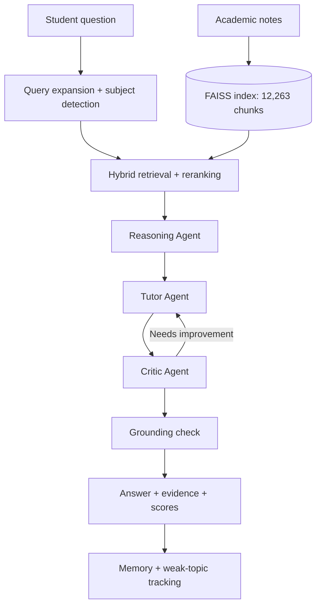

## Hybrid retrieval score

The documented retrieval design combines:

```text
0.45 x dense semantic similarity
+ 0.40 x lexical similarity
+ 0.15 x keyword overlap
+ subject/source boosts when applicable
```

## Result

Verified project facts include:

- 12,263 indexed chunks.
- 323 distinct source paths.
- 1,024-dimensional embeddings.
- Documented experiment metrics: Precision@1 `1.00`, Recall@4 `1.00`, MRR `1.00`, nDCG@4 `0.9277`, and F1@4 `0.7937`.

Honesty note:

> These ranking metrics are documented experiment results. The current live dashboard computes a subject-level hit rate, not all five metrics continuously.

## Learning

> The biggest learning was that RAG does not automatically guarantee correctness. Retrieval quality, evidence selection, prompt constraints, critique, grounding checks, and evaluation all affect the final answer.

---

# 8. Why Use RAG Instead of Only an LLM?

## Definition

> Retrieval-Augmented Generation retrieves relevant external evidence before generating an answer.

## Simple example

Without RAG:

```text
Question -> LLM memory -> Answer
```

With RAG:

```text
Question -> Search course notes -> Relevant evidence -> LLM -> Grounded answer
```

## AcadAI use case

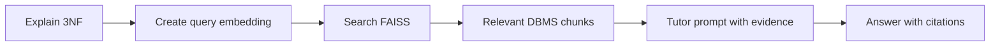

## Interview-ready answer

> I used RAG because AcadAI must answer according to the student's material, not only the LLM's general knowledge. Fine-tuning could influence style or domain behavior, but it would be slower to update and would not naturally provide source-level evidence. RAG lets the knowledge base change without retraining the model and makes the answer more traceable.
>
> The tradeoff is that the final answer is only as good as retrieval. If the wrong chunks are retrieved, generation can still fail. That is why AcadAI adds hybrid reranking, evidence display, critique, and grounding checks.

---

# 9. Compare the Three Architectures

| Concern | Nodeflowz | CommentPulse | AcadAI |
|---|---|---|---|
| Main problem | Automate cross-service workflows | Analyze large comment sets | Ground academic learning in notes |
| Primary user flow | Build graph and execute | Extract comments and analyze | Ask, retrieve, explain, verify |
| Main backend style | Next.js/tRPC + Inngest | Flask API + Redis worker | Streamlit orchestration |
| Persistent data | PostgreSQL through Prisma | Job state, artifacts, ML reports | FAISS store and session learning state |
| Asynchronous work | Workflow execution | Heavy analytics jobs | Mostly sequential in-process pipeline |
| Reliability mechanism | Inngest retries and execution records | Retries, dead-letter queue, replay | Fallback retrieval and generation paths |
| Core algorithm | Topological sort | TF-IDF, model selection, KMeans | Vector search and hybrid reranking |
| Biggest current limitation | Sequential branch execution and webhook dedupe gaps | Very small labeled evaluation dataset | Monolithic app and heuristic grounding |

## Strong comparison answer

> The projects use different architectures because their workloads differ. Nodeflowz is event-driven because workflows call external providers and need durable step execution. CommentPulse separates API and worker processes because analytics can be computationally heavier and should support retries and recovery. AcadAI currently uses a single interactive Streamlit process because it was optimized for rapid AI experimentation, though a production version should separate ingestion, retrieval, generation, and persistence services.

---

# 10. How Do Your Projects Relate to APIs and Integration?

## Interview-ready answer

> APIs and integrations are central across all three projects.
>
> In Nodeflowz, the product itself is an integration platform. The app receives webhooks, calls AI and SaaS providers, stores encrypted credentials, and passes outputs from one node into later nodes.
>
> In CommentPulse, the Chrome extension communicates with a Flask API, and the API exposes synchronous prediction endpoints, asynchronous job endpoints, health checks, metrics, and admin replay endpoints.
>
> In AcadAI, the application calls Mistral's chat-completions API and integrates local embedding and FAISS retrieval components into one learning workflow.
>
> These projects taught me that integration design is not just about successfully making an HTTP request. It also requires authentication, validation, timeouts, retries, idempotency, versioning, monitoring, and graceful failure handling.

## Enterprise integration checklist

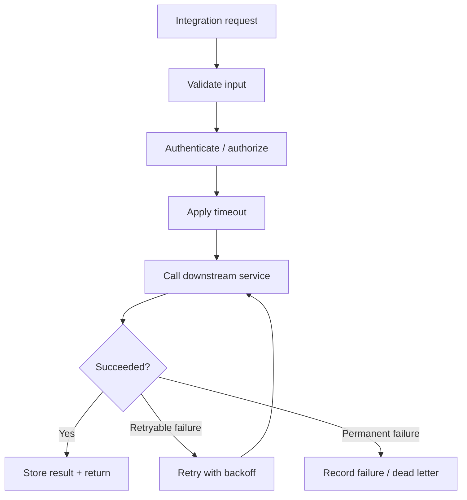

---

# 11. Tell Me About a Technical Tradeoff You Made

## Best answer: CommentPulse local fallback vs Redis worker

> One tradeoff I made in CommentPulse was supporting both an in-process asynchronous fallback and a Redis-backed worker architecture.
>
> A Redis-only design is closer to production because API and worker workloads are separated, job state is shared, and failures can be recovered. However, it increases setup complexity for contributors and tests.
>
> The in-process fallback makes the project easy to run locally without Redis, but it does not provide the same durability or horizontal scalability.
>
> I kept both behind a common job interface. That made local development simple while preserving a production-oriented deployment path. The learning was that the best architecture is sometimes not one implementation but a stable contract with environment-specific implementations.

## Diagram

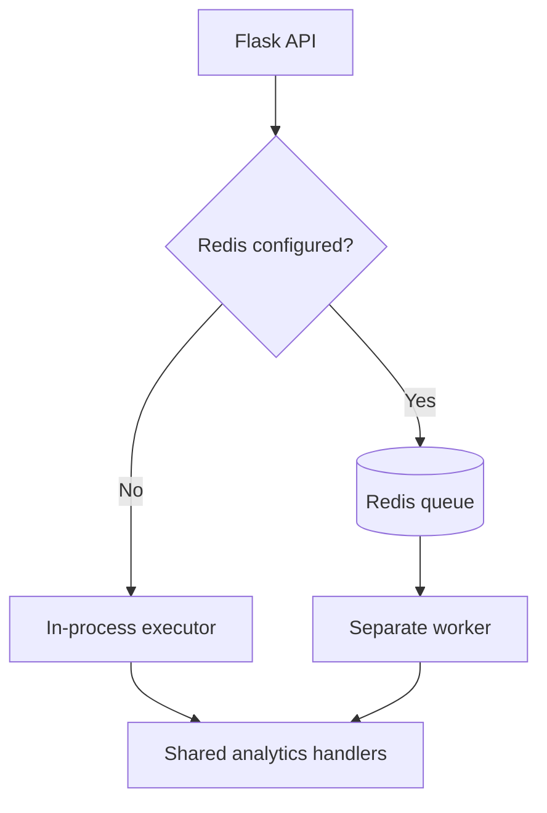

---

# 12. Tell Me About a Failure or Weakness in a Project

## Strong honest answer: CommentPulse model quality

> A weakness in CommentPulse is that the current offline evaluation dataset is too small to support a strong model-quality claim. The persisted report has only four test examples, and the current model achieves 25 percent accuracy and a macro F1 of about 0.13.
>
> Instead of hiding that, I treated it as an engineering problem. I added a dataset curation workflow, labeling queues, quality reports, candidate-model comparison, evaluation reports, and promotion checks. The next improvement is to expand and review the YouTube-specific labeled dataset, retrain through DVC, and promote a model only when it improves macro F1 without unacceptable per-class recall regression.
>
> I learned that production readiness includes honest evaluation. A polished API cannot compensate for weak or unrepresentative data.

## Why this answer is strong

- It is specific.
- It shows ownership.
- It explains corrective action.
- It does not blame tools or teammates.
- It ends with learning.

---

# 13. What Would You Improve Next?

## Nodeflowz

1. Add idempotency and provider-signature validation for webhook triggers.
2. Execute independent graph branches concurrently with controlled limits.
3. Add workflow versioning and rollback.
4. Add provider-level circuit breakers and rate-limit-aware scheduling.
5. Improve secret management beyond application-level encryption.

## CommentPulse

1. Expand the labeled YouTube dataset and improve model metrics.
2. Add data and concept drift monitoring.
3. Add stronger Redis integration and load tests.
4. Add queue dashboards and UI-based dead-letter replay.
5. Add authentication and tenant isolation.

## AcadAI

1. Replace heuristic grounding with claim-evidence verification.
2. Add persistent multi-user profiles and authentication.
3. Move upload ingestion to background jobs.
4. Split the monolithic Streamlit file into tested services.
5. Build a reproducible benchmark that calculates retrieval and answer metrics in CI.

## Interview closing

> Across all three projects, my next priority would be measurable reliability. I would improve not only features, but also evaluation datasets, idempotency, security, observability, and recovery paths.

---

# 14. Which Project Best Matches Caelius?

## Interview-ready answer

> Nodeflowz is the closest direct match because it is built around integrations, APIs, workflows, asynchronous processing, and connecting external systems. Those ideas map naturally to enterprise integration and automation work.
>
> CommentPulse adds experience with reliable background processing, monitoring, and data pipelines. AcadAI demonstrates that I can learn and apply emerging AI patterns while still thinking about evidence and evaluation.
>
> I have not yet worked directly with MuleSoft or Salesforce in production. However, Nodeflowz gave me the underlying mental model: systems expose APIs and events, integration flows transform and route data, credentials must be secured, failures require retries and visibility, and asynchronous messaging reduces coupling. I would use that foundation to learn Caelius's platform stack quickly.

## Mapping

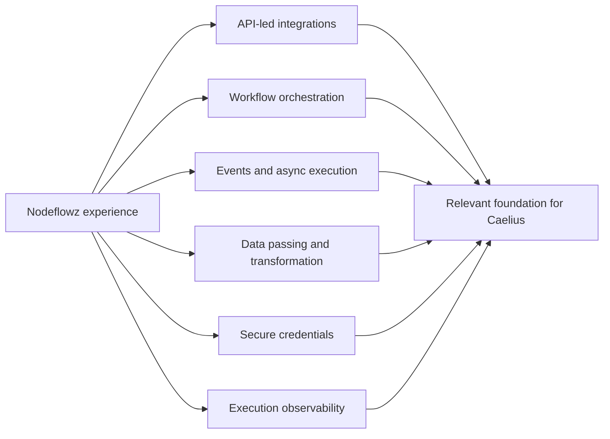

---

# 15. Rapid Follow-Up Questions

## Why topological sort in Nodeflowz?

> A workflow graph expresses dependencies. Topological sort creates an order where every node runs after its prerequisites. Its time complexity is `O(V + E)`, where `V` is nodes and `E` is connections.

## What happens if a Nodeflowz graph has a cycle?

> The sort throws an error stating that the workflow contains a cycle. A production UI should detect and reject cycles before saving or executing.

## Why store workflow updates in a transaction?

> The update replaces nodes and connections. Without a transaction, failure between deletion and insertion could leave a partially saved graph. A transaction makes the replacement atomic.

## Why use macro F1 in CommentPulse?

> Macro F1 gives equal importance to each sentiment class, which is useful when classes are imbalanced. Accuracy alone could look acceptable while minority-class performance is poor.

## Why a dead-letter queue?

> It isolates jobs that exhausted retries so they are visible, inspectable, and replayable instead of being lost or retried forever.

## Why hybrid retrieval in AcadAI?

> Dense search captures semantic meaning, while TF-IDF and keyword overlap capture exact technical terms. Combining them improves retrieval for academic questions containing both conceptual language and precise terminology.

## Is AcadAI truly autonomous?

> It is a multi-agent workflow with specialized responsibilities and a refinement loop, but it is not a fully autonomous agent system. The stages execute in a controlled sequence inside one application.

## What would you say when you do not know a technology?

> "I have not worked with that technology yet, so I would not claim implementation experience. From what I understand, it solves ___. I used a related idea in ___, and I would learn it by first building a small end-to-end integration, then testing failure and deployment behavior."

---

# Final 90-Second Project Answer

> I would highlight Nodeflowz as my most relevant project for Caelius. It is a visual workflow automation platform built with Next.js, React Flow, tRPC, Prisma, PostgreSQL, and Inngest. Users connect triggers and actions such as webhooks, AI providers, HTTP requests, Slack, Discord, and Google Sheets. The graph is saved transactionally, and execution happens asynchronously. The worker loads the graph, topologically sorts the nodes, selects each executor, passes shared context, and records execution status.
>
> I also built CommentPulse, a production-style sentiment analytics system with a Flask API, DVC ML pipeline, Redis workers, retries, dead-letter handling, readiness checks, and metrics. My third project, AcadAI, uses FAISS, hybrid retrieval, Mistral, critic refinement, and grounding checks to answer from academic notes.
>
> These projects taught me that integrations require more than connecting APIs. They require secure credentials, validation, asynchronous design, retries, observability, honest evaluation, and clear communication. That is why the integration-focused work at Caelius is especially relevant to me.

---

# Practice Instructions

For each question:

1. Speak the short interview answer without reading.
2. Draw the relevant diagram from memory.
3. Explain one real code excerpt.
4. State one current limitation honestly.
5. End with what you learned.

Do not memorize every sentence. Memorize the structure, verified facts, and engineering decisions.
