# Caelius Interview Preparation

## Java Core - Basics (Q001-Q020)

Use this answer pattern during the interview:

1. Give the crisp definition.
2. Explain why the concept exists.
3. Show a small example.
4. Connect it to real development.
5. Handle the likely follow-up.

Do not force a Java connection to projects written in TypeScript or Python. When useful, explain the equivalent engineering principle and clearly label it as an analogy.

---

# Q001. What Is Java and Why Is It Called Platform Independent?

## Interview answer

> Java is a strongly typed, object-oriented programming language designed to compile source code into platform-neutral bytecode. It is called platform independent because the same compiled `.class` bytecode can run on any operating system that has a compatible Java Virtual Machine.

## How it works

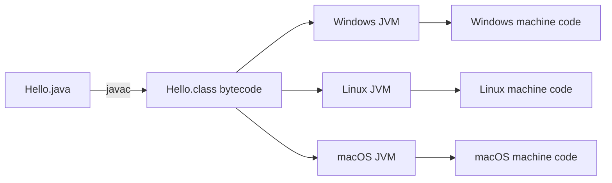

Java source is platform independent after compilation, but the JVM itself is platform specific. Oracle or another JVM vendor provides a different JVM implementation for each supported operating system and processor architecture.

## Example

```java
public class Hello {
    public static void main(String[] args) {
        System.out.println("Hello, Caelius");
    }
}
```

```text
javac Hello.java  -> creates Hello.class
java Hello        -> JVM executes the bytecode
```

## Important nuance

Java is often described as:

```text
Write Once, Run Anywhere
```

That does not mean every Java program is automatically portable. A program can still depend on platform-specific file paths, native libraries, operating-system commands, or environment configuration.

## Project analogy

Nodeflowz and CommentPulse use Docker to package applications consistently across environments. Docker and Java solve portability at different layers:

- Java bytecode targets the JVM.
- Docker packages the application with its runtime and operating-system dependencies.

## Likely follow-up

**Is Java compiled or interpreted?**

> Java uses both. `javac` compiles source into bytecode. The JVM interprets bytecode initially and can use Just-In-Time compilation to convert frequently executed code into native machine code.

---

# Q002. Explain the Difference Between JDK, JRE, and JVM

## Interview answer

> The JVM executes Java bytecode. The JRE contains the JVM and libraries required to run Java applications. The JDK contains the JRE plus development tools such as the Java compiler, debugger, and documentation generator.

## Relationship

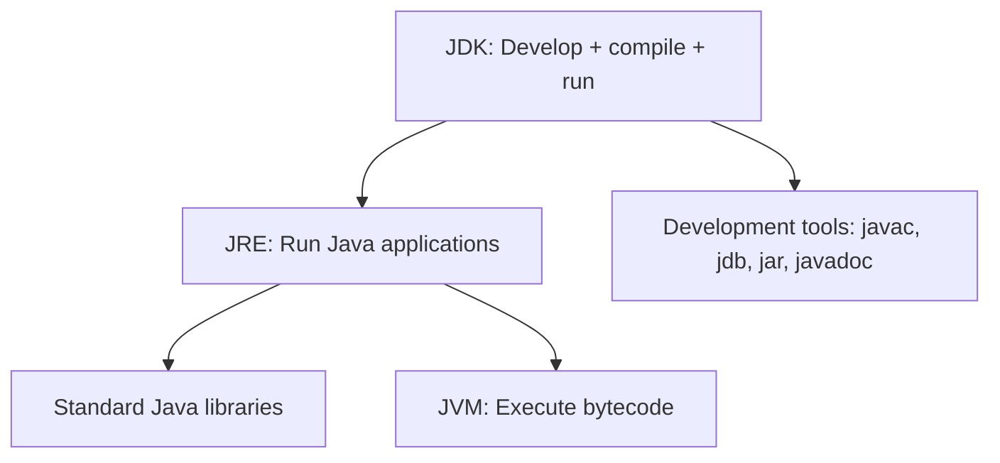

| Component | Main purpose | Includes |
|---|---|---|
| JVM | Executes bytecode | Class loading, verification, execution, memory management, GC |
| JRE | Runs Java applications | JVM and runtime libraries |
| JDK | Develops Java applications | JRE and tools such as `javac`, `jar`, and `javadoc` |

## Practical example

To compile:

```text
javac PaymentService.java
```

You need the JDK because `javac` is a development tool.

To run:

```text
java PaymentService
```

You need a Java runtime capable of launching the JVM and loading required libraries.

## Modern Java nuance

Since Java 9, the classic separately distributed JRE is less prominent. Developers often install a JDK, and production applications may use `jlink` to create a smaller custom runtime containing only required modules.

## Likely follow-up

**Can Java code run without a JVM?**

> Standard Java bytecode requires a JVM. However, tools such as GraalVM Native Image can compile Java applications ahead of time into native executables, with different runtime tradeoffs.

---

# Q003. What Is Bytecode and How Does the JVM Execute It?

## Interview answer

> Bytecode is the platform-neutral intermediate instruction set generated by the Java compiler. The JVM loads it, verifies that it is structurally and type safe, interprets it, and JIT-compiles frequently executed sections into native machine code.

## Execution pipeline

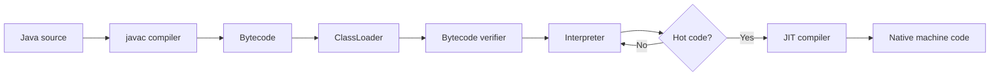

## Example bytecode idea

For:

```java
int result = 1 + 2;
```

The compiled bytecode contains JVM instructions rather than x86 or ARM-specific machine instructions.

You can inspect bytecode using:

```text
javap -c ClassName
```

## Why verification matters

Before execution, the JVM verifies properties such as:

- Instructions have valid structure.
- Stack operations are type safe.
- Branches point to valid instructions.
- Access rules are respected.

This prevents many malformed or unsafe bytecode operations from executing.

## JIT optimization

Interpreting every instruction is portable but slower. The Just-In-Time compiler observes runtime behavior and compiles hot methods into optimized native code.

> This allows Java to combine portability with strong long-running performance.

## Likely follow-up

**What is the difference between JIT and AOT?**

> JIT compiles during execution and can optimize using real runtime behavior. Ahead-Of-Time compilation happens before execution, usually improving startup time but having less runtime profiling information.

---

# Q004. What Is the Java ClassLoader?

## Interview answer

> The ClassLoader is the JVM subsystem responsible for finding and loading class bytecode into memory when it is needed. Java uses parent delegation so trusted platform classes are loaded before application-defined classes.

## Class-loading lifecycle

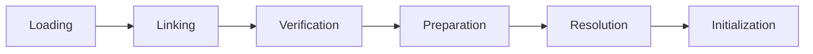

1. **Loading:** Find bytecode and create a `Class` object.
2. **Verification:** Check bytecode validity.
3. **Preparation:** Allocate memory for static fields and assign default values.
4. **Resolution:** Convert symbolic references into direct references.
5. **Initialization:** Execute static initializers and assign explicit static values.

## Main class loaders

| Loader | Responsibility |
|---|---|
| Bootstrap ClassLoader | Core Java platform classes |
| Platform ClassLoader | Platform modules and libraries |
| Application ClassLoader | Application classpath classes |

## Parent delegation

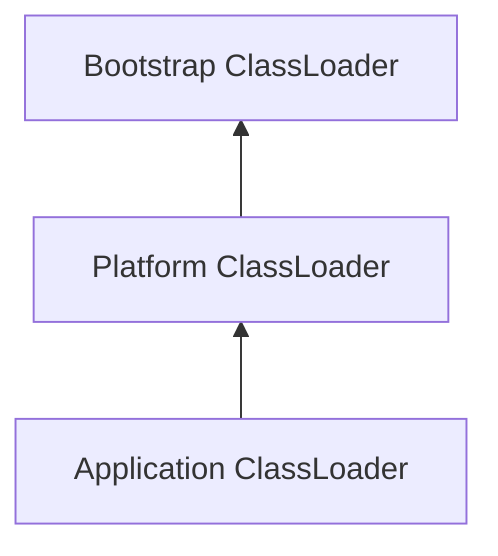

When asked to load a class, a loader first asks its parent. This helps prevent an application from replacing trusted core classes such as `java.lang.String`.

## Real use case

Plugin systems, application servers, testing frameworks, and hot-reloading tools may use custom class loaders to isolate or dynamically load code.

## Likely follow-up

**When is a class initialized?**

> Usually on its first active use, such as creating an instance, calling a static method, or accessing a non-constant static field.

---

# Q005. What Are Primitive Data Types in Java?

## Interview answer

> Primitive types are Java's built-in value types. Java has eight primitives: `byte`, `short`, `int`, `long`, `float`, `double`, `char`, and `boolean`.

## Primitive summary

| Type | Typical size | Example | Purpose |
|---|---:|---|---|
| `byte` | 8-bit | `byte level = 10;` | Small integer |
| `short` | 16-bit | `short port = 8080;` | Small integer |
| `int` | 32-bit | `int count = 100;` | Default integer |
| `long` | 64-bit | `long views = 5_000_000L;` | Large integer |
| `float` | 32-bit | `float score = 8.5F;` | Single-precision decimal |
| `double` | 64-bit | `double price = 99.99;` | Default decimal |
| `char` | 16-bit UTF-16 code unit | `char grade = 'A';` | Character/code unit |
| `boolean` | JVM-dependent storage | `boolean active = true;` | Logical value |

## Example

```java
int retryCount = 3;
long executionId = 9_000_000_000L;
double confidence = 0.92;
boolean successful = true;
char grade = 'A';
```

## Primitive vs reference type

```java
int count = 10;          // stores a primitive value
Integer boxedCount = 10; // stores a reference to an Integer object
```

Primitives:

- Cannot be `null`.
- Do not have instance methods.
- Usually have lower memory and runtime overhead.

Reference types:

- Can be `null`.
- Refer to objects.
- Can participate in generics and collections.

## Likely follow-up

**Is `String` primitive?**

> No. `String` is a final class in `java.lang`, even though Java gives string literals special language support.

---

# Q006. Difference Between `int` and `Integer` in Java

## Interview answer

> `int` is a primitive 32-bit signed integer. `Integer` is its wrapper class, so it is an object, can be `null`, provides utility methods, and can be used with generics and collections.

## Comparison

| Concern | `int` | `Integer` |
|---|---|---|
| Kind | Primitive | Wrapper object |
| Can be `null` | No | Yes |
| Methods | No instance methods | Utility and instance methods |
| Generics | Cannot use directly | Can use |
| Overhead | Lower | Higher |
| Default field value | `0` | `null` |

## Example

```java
int retryCount = 3;
Integer optionalRetryCount = null;

List<Integer> retryHistory = List.of(1, 2, 3);
int parsed = Integer.parseInt("42");
```

## Dangerous null unboxing

```java
Integer count = null;
int value = count; // NullPointerException during unboxing
```

## Integer cache trap

```java
Integer a = 100;
Integer b = 100;
System.out.println(a == b); // usually true due to Integer cache

Integer x = 1000;
Integer y = 1000;
System.out.println(x == y); // usually false
```

Never use `==` to compare wrapper values. Use:

```java
Objects.equals(x, y);
```

## Real use case

Use `int` for required numeric calculations. Use `Integer` when absence must be represented with `null` or when an object type is required, such as `List<Integer>`.

---

# Q007. What Are Autoboxing and Unboxing?

## Interview answer

> Autoboxing is the compiler-assisted conversion from a primitive to its wrapper object. Unboxing is the conversion from a wrapper object back to its primitive value.

## Example

```java
Integer boxed = 10; // autoboxing: Integer.valueOf(10)
int value = boxed;  // unboxing: boxed.intValue()
```

Conceptually, the compiler translates it to:

```java
Integer boxed = Integer.valueOf(10);
int value = boxed.intValue();
```

## Why it exists

Java collections and generics operate on reference types:

```java
List<Integer> numbers = new ArrayList<>();
numbers.add(10);      // autoboxing
int first = numbers.get(0); // unboxing
```

## Risks

### Null unboxing

```java
Integer count = null;
int total = count; // NullPointerException
```

### Performance overhead

Repeated boxing can create objects and add memory pressure:

```java
long total = 0;
for (Integer number : numbers) {
    total += number;
}
```

For very performance-sensitive numerical workloads, primitive arrays or specialized libraries can reduce boxing overhead.

## Likely follow-up

**Can every primitive be boxed?**

> Yes. Each primitive has a corresponding wrapper: `byte` to `Byte`, `int` to `Integer`, `char` to `Character`, and so on.

---

# Q008. What Are Wrapper Classes and Why Are They Needed?

## Interview answer

> Wrapper classes represent primitive values as objects. They are needed when Java APIs require reference types, especially generics, collections, nullable values, utility methods, and reflection.

## Primitive-wrapper mapping

| Primitive | Wrapper |
|---|---|
| `byte` | `Byte` |
| `short` | `Short` |
| `int` | `Integer` |
| `long` | `Long` |
| `float` | `Float` |
| `double` | `Double` |
| `char` | `Character` |
| `boolean` | `Boolean` |

## Examples

```java
List<Double> scores = List.of(8.5, 9.1, 7.8);

int count = Integer.parseInt("120");
String binary = Integer.toBinaryString(10);
boolean enabled = Boolean.parseBoolean("true");
```

## Why generics require wrappers

This is invalid:

```java
// List<int> values; // compilation error
```

This is valid:

```java
List<Integer> values = new ArrayList<>();
```

Generics operate on reference types because of Java's object type system and type-erasure design.

## Design advice

Do not use a wrapper only because it looks more object oriented. Prefer primitives for required values and wrappers where object behavior or nullable state is genuinely needed.

---

# Q009. What Is the Difference Between `==` and `.equals()`?

## Interview answer

> For primitives, `==` compares values. For object references, `==` checks whether both references point to the same object. `.equals()` checks logical equality according to the class's implementation.

## Example

```java
String a = new String("Nodeflowz");
String b = new String("Nodeflowz");

System.out.println(a == b);      // false: different objects
System.out.println(a.equals(b)); // true: same text
```

## Diagram

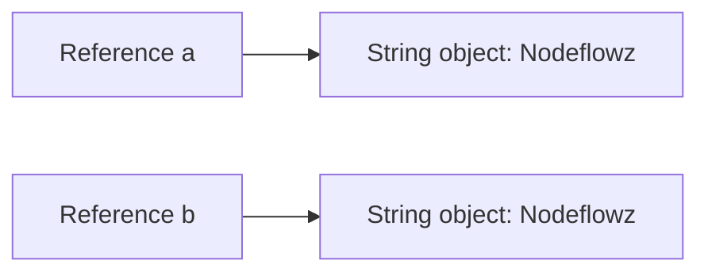

The contents are equal, but the references point to different objects.

## Custom class example

```java
import java.util.Objects;

public final class Workflow {
    private final String id;

    public Workflow(String id) {
        this.id = id;
    }

    @Override
    public boolean equals(Object other) {
        if (this == other) return true;
        if (!(other instanceof Workflow workflow)) return false;
        return Objects.equals(id, workflow.id);
    }

    @Override
    public int hashCode() {
        return Objects.hash(id);
    }
}
```

## Important rule

If you override `equals()`, also override `hashCode()`. Hash-based collections assume equal objects have equal hash codes.

## Project analogy

In Nodeflowz, two separate node objects may represent the same persisted node ID. Logical identity should be based on the ID, not whether both variables reference the exact same in-memory object.

---

# Q010. Why Is `String` Immutable in Java?

## Interview answer

> `String` is immutable, meaning its value cannot change after creation. Immutability improves security, thread safety, string-pool reuse, and stable hash codes.

## Example

```java
String name = "AcadAI";
name.concat(" Tutor");

System.out.println(name); // AcadAI
```

`concat()` creates a new string; it does not modify the original:

```java
name = name.concat(" Tutor");
```

## Why immutability matters

### Security

Strings represent sensitive or important values such as:

- Class names
- File paths
- URLs
- Database connection strings
- Authentication tokens

If a shared string could change unexpectedly after validation, security checks could be bypassed.

### String pool

String literals can safely share one object because no caller can mutate it.

### Thread safety

Immutable objects can be shared across threads without synchronization for mutation.

### Stable hash code

Strings are commonly used as `HashMap` keys. If their content changed after insertion, lookup could break.

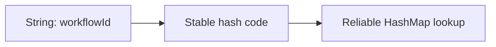

## Likely follow-up

**How can you create your own immutable class?**

> Make the class final, fields private and final, initialize them through the constructor, provide no setters, and defensively copy mutable inputs and outputs.

---

# Q011. What Is the String Pool?

## Interview answer

> The string pool is a JVM-managed collection of canonical string objects. Identical string literals usually reuse the same pooled object to reduce memory usage.

## Example

```java
String a = "Caelius";
String b = "Caelius";

System.out.println(a == b); // true: same pooled literal

String c = new String("Caelius");
System.out.println(a == c); // false: explicitly created object
System.out.println(a.equals(c)); // true
```

## Diagram

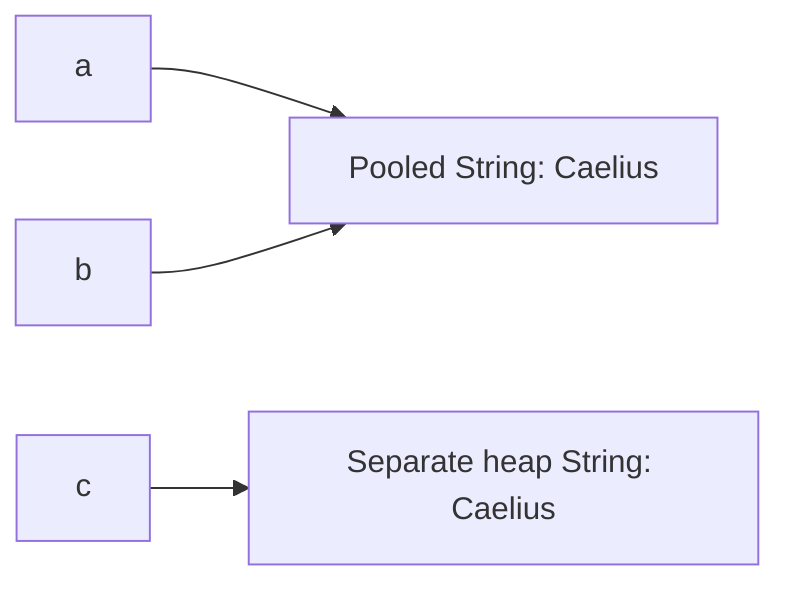

## `intern()`

```java
String c = new String("Caelius");
String pooled = c.intern();

System.out.println(pooled == "Caelius"); // true
```

`intern()` returns the canonical pooled representation.

## Why pooling is safe

Pooling depends on string immutability. If one caller could modify the pooled object, every reference sharing it would observe the mutation.

## Interview warning

Do not use `==` for business-level string comparison even if literals sometimes make it appear to work. Always use `.equals()` or `Objects.equals()`.

---

# Q012. Difference Between `String`, `StringBuilder`, and `StringBuffer`

## Interview answer

> `String` is immutable. `StringBuilder` is mutable and designed for efficient string construction in a single thread. `StringBuffer` is mutable and synchronized, making it thread safe but usually slower.

## Comparison

| Type | Mutable | Thread safe | Typical use |
|---|---|---|---|
| `String` | No | Safe through immutability | Fixed text and values |
| `StringBuilder` | Yes | No | Local string construction |
| `StringBuffer` | Yes | Yes through synchronization | Shared mutable string buffer |

## Inefficient concatenation

```java
String result = "";
for (int i = 0; i < 10_000; i++) {
    result += i;
}
```

Because `String` is immutable, repeated concatenation can create many intermediate objects.

## Better approach

```java
StringBuilder builder = new StringBuilder();
for (int i = 0; i < 10_000; i++) {
    builder.append(i);
}
String result = builder.toString();
```

## Complexity intuition

Repeated immutable concatenation in a loop can approach `O(n^2)` character copying. `StringBuilder` usually provides amortized linear construction because it grows an internal buffer.

## Real use case

Use `StringBuilder` when building:

- Logs
- CSV output
- Generated SQL fragments
- Large formatted responses

Do not use `StringBuffer` automatically for multithreaded applications. A local `StringBuilder` used by one thread remains the better default.

---

# Q013. What Are `final`, `finally`, and `finalize`?

## Interview answer

> `final` is a language keyword used to restrict reassignment, overriding, or inheritance. `finally` is an exception-handling block intended for cleanup. `finalize()` was an unreliable garbage-collection callback and is deprecated for removal.

## `final`

```java
final int maxRetries = 3;
// maxRetries = 4; // compilation error
```

```java
final class SecurityToken {
}
```

```java
class BaseExecutor {
    final void validate() {
    }
}
```

Important nuance:

```java
final List<String> names = new ArrayList<>();
names.add("Deepa"); // allowed
// names = new ArrayList<>(); // not allowed
```

`final` prevents reference reassignment; it does not automatically make the referenced object immutable.

## `finally`

```java
try {
    processWorkflow();
} catch (RuntimeException error) {
    log(error);
} finally {
    releaseResource();
}
```

Prefer try-with-resources for `AutoCloseable` resources:

```java
try (var reader = Files.newBufferedReader(path)) {
    return reader.readLine();
}
```

## `finalize()`

`finalize()` should not be used for cleanup because:

- Its execution timing is unpredictable.
- It may never run before process termination.
- It hurts performance and complicates GC.
- It creates security and reliability risks.

Use try-with-resources, explicit cleanup, or modern cleaner mechanisms where appropriate.

---

# Q014. What Is a Static Block and When Does It Execute?

## Interview answer

> A static initialization block runs once when the JVM initializes the class. It is used for class-level setup that cannot be expressed as a simple field initializer.

## Example

```java
public class ProviderRegistry {
    private static final Map<String, String> PROVIDERS = new HashMap<>();

    static {
        PROVIDERS.put("openai", "OpenAI Executor");
        PROVIDERS.put("gemini", "Gemini Executor");
    }
}
```

## Execution order

Static fields and static blocks execute in their source-code order during class initialization.

```java
public class Demo {
    static String first = initialize("field");

    static {
        System.out.println("static block");
    }

    private static String initialize(String value) {
        System.out.println(value);
        return value;
    }
}
```

Output:

```text
field
static block
```

## When initialization happens

Common triggers include:

- Creating the first instance.
- Calling a static method.
- Accessing a non-constant static field.

## Design advice

Avoid slow network calls or fragile external dependencies in static blocks. A failure can cause `ExceptionInInitializerError` and make the class unusable.

## Project analogy

Nodeflowz has an executor registry that maps node types to executor implementations. A Java version could initialize a similar class-level registry through static initialization, although dependency injection is usually more flexible for large applications.

---

# Q015. Difference Between Static and Instance Variables

## Interview answer

> A static variable belongs to the class and is shared across all instances. An instance variable belongs to each individual object, so every object can have its own value.

## Example

```java
public class WorkflowExecution {
    private static int totalExecutions;
    private final String workflowId;

    public WorkflowExecution(String workflowId) {
        this.workflowId = workflowId;
        totalExecutions++;
    }
}
```

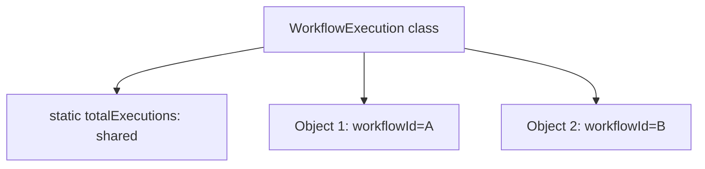

## Comparison

| Concern | Static variable | Instance variable |
|---|---|---|
| Ownership | Class | Object |
| Copies | One per class loader | One per instance |
| Access | `ClassName.field` preferred | Through an object |
| Can use `this` | No | Yes |
| Common use | Constants, shared counters, stateless helpers | Object state |

## Concurrency warning

A mutable static variable is shared state and can create race conditions:

```java
private static int requestCount;

public static void increment() {
    requestCount++; // not atomic
}
```

For concurrent updates, use synchronization, atomic types, or an external metrics system depending on the requirement.

## Better constant

```java
private static final int MAX_RETRIES = 3;
```

---

# Q016. What Is the `this` Keyword in Java?

## Interview answer

> `this` refers to the current object whose instance method or constructor is executing.

## Common uses

### Distinguish fields from parameters

```java
public class Workflow {
    private final String name;

    public Workflow(String name) {
        this.name = name;
    }
}
```

### Call another constructor

```java
public Workflow() {
    this("untitled-workflow");
}
```

The `this(...)` constructor call must be the first statement.

### Pass or return the current object

```java
public Workflow rename(String name) {
    this.name = name;
    return this;
}
```

## What `this` cannot do

`this` cannot be used in a static context because a static method belongs to the class and may execute without any object instance.

```java
public static void printName() {
    // System.out.println(this.name); // compilation error
}
```

## Likely follow-up

**Can `this` be reassigned?**

> No. `this` is an implicit final reference to the current object.

---

# Q017. What Is the `super` Keyword in Java?

## Interview answer

> `super` refers to the immediate parent-class portion of the current object. It is used to invoke a parent constructor, access a hidden parent field, or call an overridden parent method.

## Parent constructor

```java
class BaseNode {
    protected final String id;

    BaseNode(String id) {
        this.id = id;
    }
}

class OpenAiNode extends BaseNode {
    OpenAiNode(String id) {
        super(id);
    }
}
```

`super(...)` must be the first constructor statement.

## Parent method

```java
class BaseNode {
    void validate() {
        System.out.println("Validate common fields");
    }
}

class OpenAiNode extends BaseNode {
    @Override
    void validate() {
        super.validate();
        System.out.println("Validate OpenAI credential");
    }
}
```

## Parent field

```java
class Parent {
    String name = "parent";
}

class Child extends Parent {
    String name = "child";

    void printNames() {
        System.out.println(this.name);
        System.out.println(super.name);
    }
}
```

## Design note

Deep inheritance hierarchies can create tight coupling. Prefer composition when objects should reuse behavior without forming a genuine "is-a" relationship.

---

# Q018. Can We Override a Static Method in Java?

## Interview answer

> No. Static methods are resolved using the reference type at compile time, so they are hidden rather than overridden. Runtime polymorphism applies to instance methods.

## Example

```java
class Parent {
    static void describe() {
        System.out.println("Parent");
    }
}

class Child extends Parent {
    static void describe() {
        System.out.println("Child");
    }
}

Parent value = new Child();
value.describe(); // Parent
```

## Why

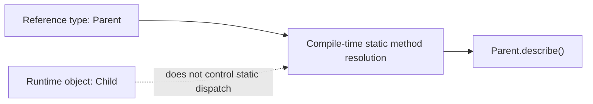

For an instance method, dynamic dispatch would select the child's overridden method based on the runtime object. Static methods belong to classes, not instances.

## Good practice

Call static methods through the class name:

```java
Parent.describe();
Child.describe();
```

This makes method hiding explicit and avoids misleading code.

---

# Q019. Can We Override a Private Method in Java?

## Interview answer

> No. A private method is not visible or inherited by the subclass, so the subclass cannot override it. A same-named method in the subclass is a separate method.

## Example

```java
class Parent {
    private void validateSecret() {
        System.out.println("Parent validation");
    }

    public void execute() {
        validateSecret();
    }
}

class Child extends Parent {
    private void validateSecret() {
        System.out.println("Child validation");
    }
}
```

```java
Parent value = new Child();
value.execute(); // Parent validation
```

The call inside `Parent.execute()` resolves to `Parent`'s private method.

## Proof using `@Override`

```java
class Child extends Parent {
    @Override
    private void validateSecret() {
    }
}
```

This fails to compile because there is no visible inherited method to override.

## Design implication

Use:

- `private` when behavior is strictly an implementation detail.
- `protected` cautiously when subclasses are intentionally allowed to customize behavior.
- A strategy/interface when extension should be explicit and loosely coupled.

---

# Q020. What Is Method Hiding in Java?

## Interview answer

> Method hiding occurs when a subclass declares a static method with the same signature as a static method in its parent. The selected method depends on the compile-time reference type, not the runtime object.

## Example

```java
class Parent {
    static void identify() {
        System.out.println("Parent");
    }
}

class Child extends Parent {
    static void identify() {
        System.out.println("Child");
    }
}

Parent parentReference = new Child();
Child childReference = new Child();

parentReference.identify(); // Parent
childReference.identify();  // Child
```

## Hiding vs overriding

| Concern | Method hiding | Method overriding |
|---|---|---|
| Method type | Static | Instance |
| Resolution | Compile time | Runtime |
| Depends on | Reference/class type | Runtime object type |
| Polymorphism | No dynamic dispatch | Dynamic dispatch |

## Diagram

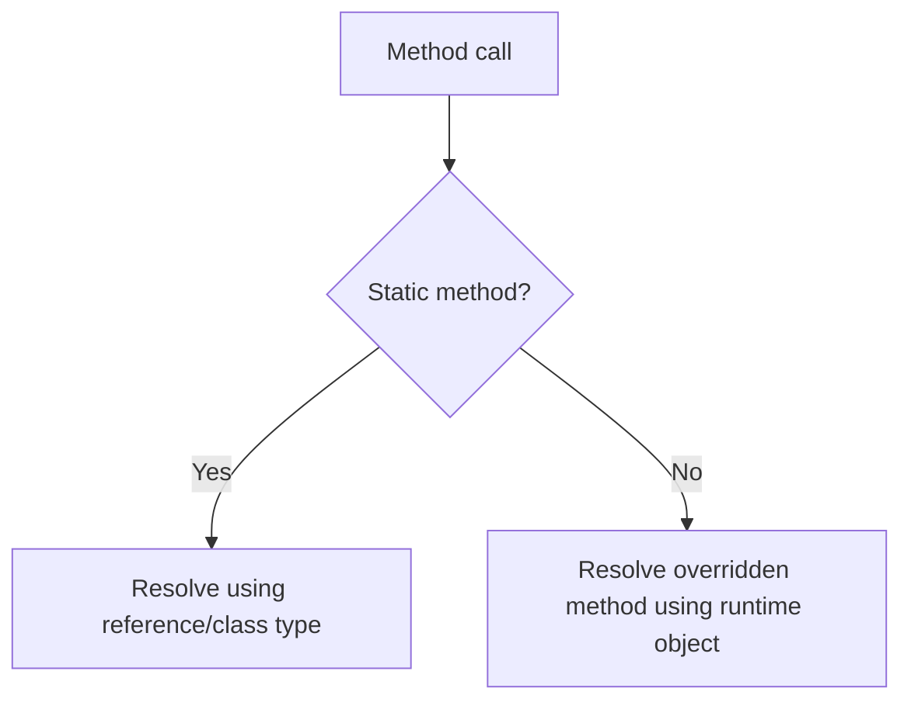

## Interview closing

> Static methods should normally be called through the declaring class. If behavior must vary by object type at runtime, use an instance method and overriding rather than method hiding.

---

# Java Basics Revision Sheet

## Twenty-second summaries

| Question | Memory line |
|---|---|
| Java | Source compiles to platform-neutral bytecode executed by a platform-specific JVM |
| JDK/JRE/JVM | JDK develops, JRE runs, JVM executes |
| Bytecode | Intermediate JVM instructions verified and interpreted/JIT-compiled |
| ClassLoader | Loads classes using parent delegation |
| Primitives | Eight built-in value types |
| `int` vs `Integer` | Primitive value vs nullable wrapper object |
| Boxing | Primitive-wrapper conversion |
| Wrappers | Let primitive values participate in object-based APIs |
| `==` vs `.equals()` | Reference identity vs logical equality for objects |
| Immutable String | Safe sharing, pooling, security, stable hashing |
| String pool | Reuses canonical immutable strings |
| StringBuilder | Efficient mutable string construction |
| final/finally/finalize | Restriction, cleanup block, obsolete GC callback |
| Static block | Runs once at class initialization |
| Static vs instance | Shared class state vs per-object state |
| `this` | Current object |
| `super` | Immediate parent portion |
| Static override | Impossible; static methods are hidden |
| Private override | Impossible; private methods are not inherited visibly |
| Method hiding | Compile-time selection of same-signature static method |

## Common mistakes to avoid

- Saying Java is platform independent without explaining that the JVM is platform specific.
- Saying Java is only compiled or only interpreted.
- Comparing strings using `==`.
- Assuming `final` makes a mutable object immutable.
- Calling static method hiding runtime polymorphism.
- Claiming private methods are overridden.
- Using `StringBuffer` by default merely because an application has multiple threads.
- Using `finalize()` for resource cleanup.

## Practice drill

For each question, answer in this order:

```text
Definition -> Why it matters -> Tiny example -> One caveat
```

Keep the first answer under 40 seconds. Give the deeper explanation only when the interviewer asks a follow-up.
