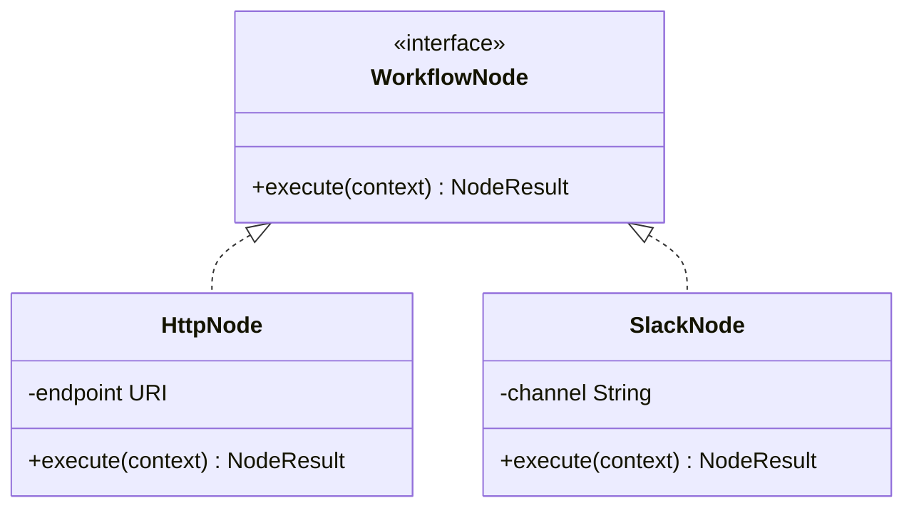
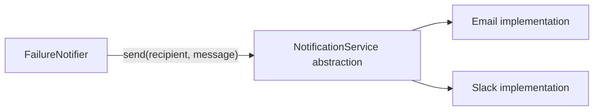
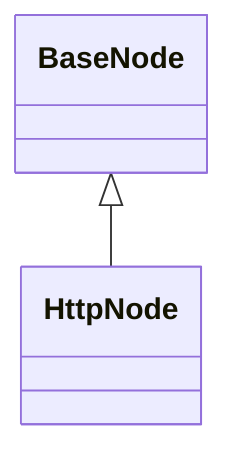
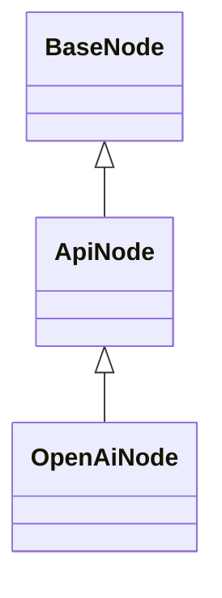
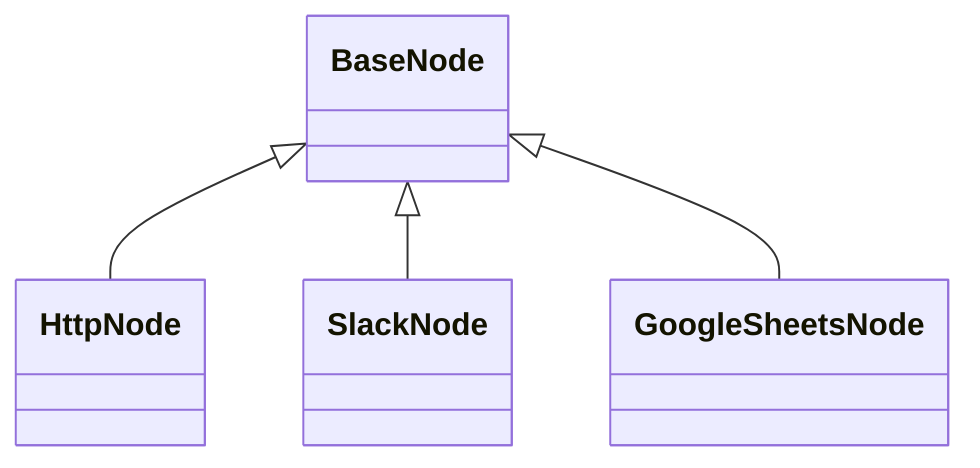
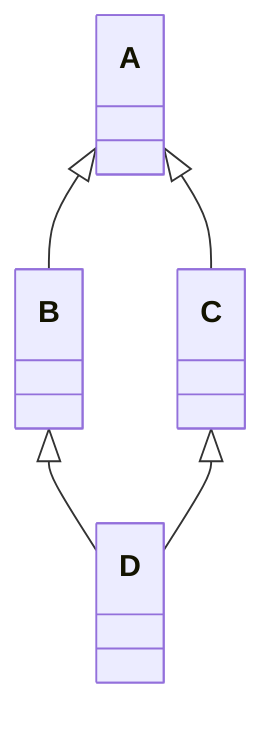
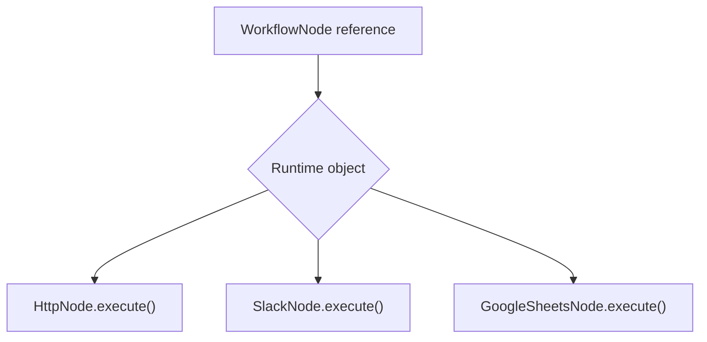
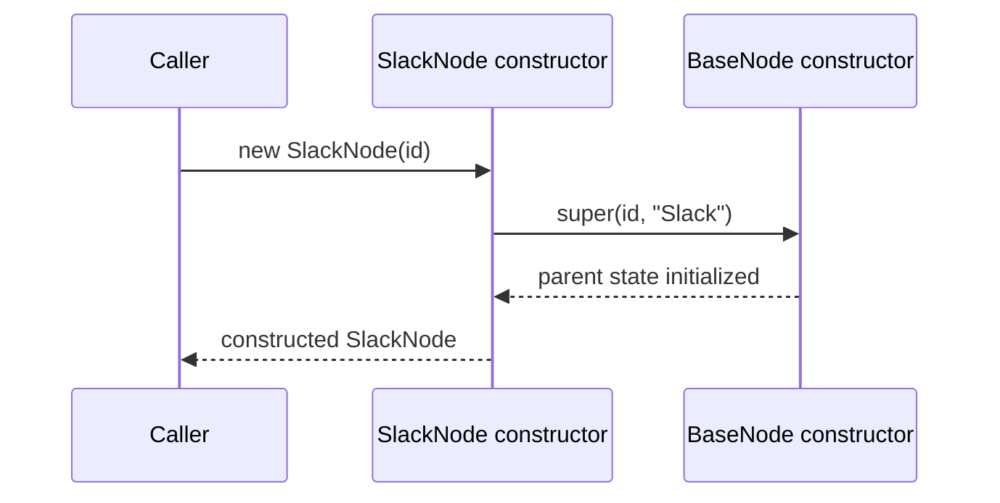
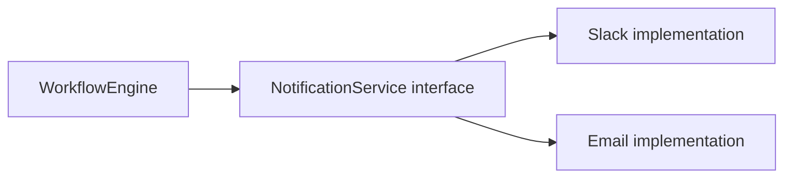
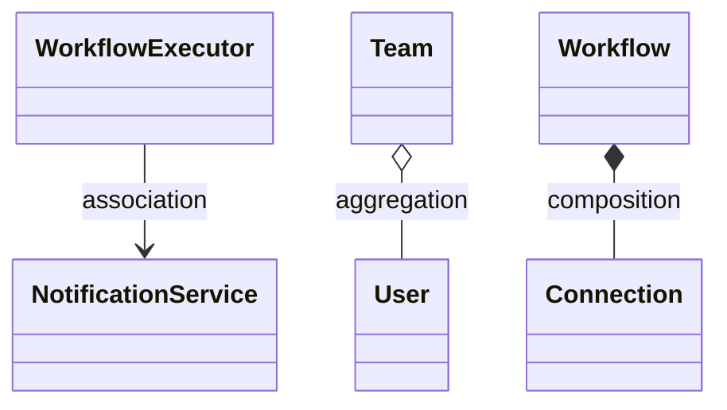

# Caelius Interview Preparation

## Java Core - OOPs (Q021-Q040)

Use this speaking structure:

```text
Define -> Simple example -> Real use case -> Important tradeoff
```

The examples below use a Java version of a workflow automation system inspired by Nodeflowz. This gives you one consistent project story while explaining OOP concepts.

---

# Q021. What Are the Four Pillars of OOP?

## Interview answer

> The four pillars of object-oriented programming are encapsulation, abstraction, inheritance, and polymorphism. Encapsulation protects an object's state, abstraction exposes only essential behavior, inheritance lets a specialized class reuse or extend a parent, and polymorphism lets the same interface produce different runtime behavior.

## One-line definitions

| Pillar | Meaning |
|---|---|
| Encapsulation | Keep state and related behavior together while controlling access |
| Abstraction | Expose what an object does while hiding implementation details |
| Inheritance | Create a specialized class from an existing class |
| Polymorphism | Use one common type to invoke different implementations |

## Workflow-engine example

```java
public interface WorkflowNode {
    NodeResult execute(ExecutionContext context);
}

public final class HttpNode implements WorkflowNode {
    private final URI endpoint;

    public HttpNode(URI endpoint) {
        this.endpoint = endpoint;
    }

    @Override
    public NodeResult execute(ExecutionContext context) {
        return callEndpoint(endpoint, context);
    }
}

public final class SlackNode implements WorkflowNode {
    private final String channel;

    public SlackNode(String channel) {
        this.channel = channel;
    }

    @Override
    public NodeResult execute(ExecutionContext context) {
        return sendSlackMessage(channel, context);
    }
}
```

How the pillars appear:

- `private final` fields encapsulate configuration.
- `WorkflowNode.execute()` abstracts node execution.
- Both classes implement a shared contract.
- Calling `execute()` through `WorkflowNode` demonstrates runtime polymorphism.



## Project connection

Nodeflowz uses an executor registry to select different behavior for OpenAI, Gemini, Slack, HTTP, and other node types. Although its implementation is TypeScript, the design principle is polymorphism: the orchestration layer uses a common executor contract while each node implements provider-specific behavior.

---

# Q022. Explain Encapsulation With a Real-World Example

## Interview answer

> Encapsulation means keeping an object's data and the operations that maintain it together, while preventing uncontrolled external access to its internal state.

## Simple example

A bank account should not allow callers to directly assign any balance:

```java
public final class BankAccount {
    private BigDecimal balance = BigDecimal.ZERO;

    public void deposit(BigDecimal amount) {
        if (amount.signum() <= 0) {
            throw new IllegalArgumentException("Amount must be positive");
        }
        balance = balance.add(amount);
    }

    public BigDecimal getBalance() {
        return balance;
    }
}
```

External code cannot do:

```java
// account.balance = new BigDecimal("-5000"); // inaccessible
```

It must use a method that protects the object's rules.

## Workflow example

```java
public final class Workflow {
    private final List<WorkflowNode> nodes = new ArrayList<>();
    private WorkflowStatus status = WorkflowStatus.DRAFT;

    public void addNode(WorkflowNode node) {
        if (status != WorkflowStatus.DRAFT) {
            throw new IllegalStateException("Published workflow cannot be edited");
        }
        nodes.add(Objects.requireNonNull(node));
    }

    public List<WorkflowNode> getNodes() {
        return List.copyOf(nodes);
    }
}
```

The class:

- Prevents node changes after publication.
- Rejects `null`.
- Returns an immutable copy so callers cannot mutate the internal list.

## Encapsulation is not just getters and setters

This is weak encapsulation:

```java
public void setBalance(BigDecimal balance) {
    this.balance = balance;
}
```

It exposes storage without protecting business rules. Good encapsulation exposes meaningful operations such as `deposit()`, `publish()`, or `retry()`.

## Project connection

Nodeflowz protects credentials by keeping raw values behind credential-management procedures and encrypting them before database storage. That is an application-level example of controlling access to sensitive state.

---

# Q023. Explain Abstraction With a Real-World Example

## Interview answer

> Abstraction exposes essential behavior while hiding unnecessary implementation details. The caller depends on a clear contract instead of knowing how the work is performed internally.

## Real-world analogy

A user drives a car using the steering wheel, accelerator, and brake. The user does not need to control fuel injection or engine timing directly.

## Java example

```java
public interface NotificationService {
    void send(String recipient, String message);
}

public final class EmailNotificationService implements NotificationService {
    @Override
    public void send(String recipient, String message) {
        // SMTP-specific implementation hidden here
    }
}

public final class SlackNotificationService implements NotificationService {
    @Override
    public void send(String recipient, String message) {
        // Slack API-specific implementation hidden here
    }
}
```

Caller:

```java
public final class FailureNotifier {
    private final NotificationService notifications;

    public FailureNotifier(NotificationService notifications) {
        this.notifications = notifications;
    }

    public void notifyFailure(String user, String error) {
        notifications.send(user, "Workflow failed: " + error);
    }
}
```

`FailureNotifier` knows what notification behavior it needs, but not SMTP or Slack API details.



## Project connection

CommentPulse uses shared analytics handlers behind job backends. The Flask API can submit work without needing to know whether the job runs through the in-process executor or Redis worker. That is abstraction at an architectural level.

---

# Q024. Difference Between Abstraction and Encapsulation

## Interview answer

> Abstraction reduces visible complexity by exposing only essential operations. Encapsulation protects an object's internal state and rules by controlling access. Abstraction asks, "What should callers see?" Encapsulation asks, "How do I prevent callers from breaking this object?"

## Comparison

| Concern | Abstraction | Encapsulation |
|---|---|---|
| Main goal | Hide complexity | Protect state and invariants |
| Focus | What behavior is exposed | How data and behavior are controlled |
| Common Java tools | Interfaces, abstract classes | Private fields, controlled methods, immutable objects |
| Example | `PaymentGateway.charge()` | Prevent direct modification of payment status |

## Combined example

```java
public interface CredentialStore {
    String retrieve(String credentialId);
}

public final class EncryptedCredentialStore implements CredentialStore {
    private final Map<String, String> encryptedValues = new HashMap<>();
    private final CipherService cipher;

    public EncryptedCredentialStore(CipherService cipher) {
        this.cipher = cipher;
    }

    @Override
    public String retrieve(String credentialId) {
        String encrypted = encryptedValues.get(credentialId);
        return cipher.decrypt(encrypted);
    }
}
```

- `CredentialStore` provides abstraction.
- The private map and controlled decryption provide encapsulation.

## Memory line

```text
Abstraction hides complexity.
Encapsulation protects correctness.
```

---

# Q025. What Is Inheritance? What Types Exist in Java?

## Interview answer

> Inheritance allows a child class to acquire and extend accessible behavior from a parent class, representing an "is-a" relationship. Java supports single, multilevel, and hierarchical class inheritance. Multiple inheritance of type is supported through interfaces, but a class cannot extend multiple classes.

## Types

### Single inheritance



### Multilevel inheritance



### Hierarchical inheritance



### Multiple inheritance through interfaces

```java
interface Executable {
    NodeResult execute();
}

interface Retryable {
    void retry();
}

final class HttpNode implements Executable, Retryable {
    // Implements both contracts
}
```

## Example

```java
public abstract class BaseNode {
    private final String id;

    protected BaseNode(String id) {
        this.id = id;
    }

    public String id() {
        return id;
    }

    public abstract NodeResult execute(ExecutionContext context);
}
```

## Tradeoff

Inheritance can reuse behavior but tightly couples child classes to parent design. Use it only for a genuine and stable "is-a" relationship. Prefer composition when behavior may vary independently.

---

# Q026. Why Does Java Not Support Multiple Inheritance Through Classes?

## Interview answer

> Java avoids multiple class inheritance mainly to prevent ambiguity and complexity when parent classes provide conflicting state or implementations. The classic example is the diamond problem. Java instead supports multiple inheritance of type through interfaces.

## Diamond problem



Suppose both `B` and `C` override `execute()`. If `D` inherited from both, Java would need rules to decide which implementation and parent state `D` receives.

## Why interfaces are safer

```java
interface Auditable {
    void audit();
}

interface Retryable {
    void retry();
}

final class WorkflowExecutor implements Auditable, Retryable {
    @Override
    public void audit() {
    }

    @Override
    public void retry() {
    }
}
```

Interfaces define capabilities without inheriting conflicting object state.

## Default-method conflict

If two interfaces provide the same default method, Java forces the implementing class to resolve it:

```java
interface A {
    default void run() {
        System.out.println("A");
    }
}

interface B {
    default void run() {
        System.out.println("B");
    }
}

class C implements A, B {
    @Override
    public void run() {
        A.super.run();
    }
}
```

> Java chooses explicit conflict resolution rather than silently selecting a parent implementation.

---

# Q027. What Is Polymorphism? What Are Its Types?

## Interview answer

> Polymorphism means one common interface can represent multiple concrete forms. Java mainly demonstrates compile-time polymorphism through method overloading and runtime polymorphism through method overriding.

## Compile-time polymorphism

```java
public void execute(String workflowId) {
}

public void execute(String workflowId, Map<String, Object> input) {
}
```

The compiler chooses the method based on arguments.

## Runtime polymorphism

```java
WorkflowNode node = new SlackNode("#alerts");
node.execute(context);
```

The reference type is `WorkflowNode`, but the runtime object determines that `SlackNode.execute()` runs.



## Why it matters

Without polymorphism:

```java
if (type == HTTP) {
    executeHttp();
} else if (type == SLACK) {
    executeSlack();
}
```

With polymorphism:

```java
node.execute(context);
```

The orchestration code remains stable as new node implementations are added.

## Project connection

Nodeflowz's executor registry applies this principle. Each node type has specialized behavior, while the workflow engine invokes executors through a shared expected contract.

---

# Q028. Difference Between Compile-Time and Runtime Polymorphism

## Interview answer

> Compile-time polymorphism is method overloading, where the compiler selects a method using the declared argument types. Runtime polymorphism is method overriding, where the JVM selects an instance method using the actual runtime object.

## Comparison

| Concern | Compile-time polymorphism | Runtime polymorphism |
|---|---|---|
| Mechanism | Overloading | Overriding |
| Decision time | Compilation | Runtime |
| Depends on | Method name and parameter list | Runtime object type |
| Inheritance required | No | Yes, or interface implementation |
| Dynamic dispatch | No | Yes |

## Example

```java
class Executor {
    void execute(String workflowId) {
        System.out.println("Execute without input");
    }

    void execute(String workflowId, Map<String, Object> input) {
        System.out.println("Execute with input");
    }
}
```

The compiler selects the overloaded method.

```java
interface Node {
    void execute();
}

class SlackNode implements Node {
    @Override
    public void execute() {
        System.out.println("Send Slack message");
    }
}

Node node = new SlackNode();
node.execute();
```

The runtime selects `SlackNode.execute()`.

## Important trap

Static methods are hidden, not runtime-polymorphic. Fields are also resolved by the reference type, not dynamically dispatched like overridden instance methods.

---

# Q029. What Is Method Overloading vs Method Overriding?

## Interview answer

> Overloading means declaring multiple methods with the same name but different parameter lists, usually in the same class. Overriding means a subclass or implementing class provides a new implementation of an inherited instance method with the same signature.

## Comparison

| Rule | Overloading | Overriding |
|---|---|---|
| Parameters | Must differ | Must match |
| Return type | May differ, but not by itself | Same or covariant |
| Binding | Compile time | Runtime |
| Inheritance required | No | Yes |
| Static methods | Can overload | Cannot override |
| Access | Any valid overload | Cannot reduce visibility |
| Checked exceptions | Independent | Cannot broaden checked exceptions |

## Overloading example

```java
public void schedule(String workflowId) {
}

public void schedule(String workflowId, Instant runAt) {
}
```

This is invalid:

```java
// Return type alone cannot overload a method.
// public int schedule(String workflowId) { return 1; }
```

## Overriding example

```java
abstract class Node {
    abstract NodeResult execute();
}

class HttpNode extends Node {
    @Override
    NodeResult execute() {
        return callApi();
    }
}
```

## Interview tip

Use `@Override`. It lets the compiler catch signature mistakes instead of accidentally creating a new overloaded method.

---

# Q030. What Is an Abstract Class? Can It Have Constructors?

## Interview answer

> An abstract class is a class that cannot be instantiated directly and may contain both abstract methods and implemented behavior. Yes, it can have constructors, which initialize the inherited parent state when a concrete subclass is created.

## Example

```java
public abstract class BaseNode {
    private final String id;
    private final String name;

    protected BaseNode(String id, String name) {
        this.id = Objects.requireNonNull(id);
        this.name = Objects.requireNonNull(name);
    }

    public final String id() {
        return id;
    }

    public final String name() {
        return name;
    }

    public abstract NodeResult execute(ExecutionContext context);
}

public final class SlackNode extends BaseNode {
    public SlackNode(String id) {
        super(id, "Slack");
    }

    @Override
    public NodeResult execute(ExecutionContext context) {
        return sendMessage(context);
    }
}
```

Creating `SlackNode` invokes `BaseNode`'s constructor first.



## Why use an abstract class?

Use it when related implementations:

- Share state.
- Share implemented behavior.
- Need protected extension hooks.
- Have a stable "is-a" relationship.

## Important nuance

An abstract class can have:

- Constructors
- Static methods
- Final methods
- Concrete methods
- Abstract methods
- Fields

---

# Q031. What Is an Interface in Java?

## Interview answer

> An interface defines a contract that implementing classes agree to fulfill. It is useful for abstraction, loose coupling, multiple capability inheritance, and substituting implementations.

## Example

```java
public interface NodeExecutor {
    NodeResult execute(ExecutionContext context);
}

public final class HttpExecutor implements NodeExecutor {
    @Override
    public NodeResult execute(ExecutionContext context) {
        return callHttpEndpoint(context);
    }
}
```

## Interface capabilities

Modern Java interfaces can contain:

- Abstract methods
- `default` methods
- `static` methods
- Private helper methods
- Constants, implicitly `public static final`

```java
public interface RetryPolicy {
    int MAX_RETRIES = 3;

    boolean shouldRetry(Throwable error);

    default Duration delayForAttempt(int attempt) {
        return Duration.ofSeconds(1L << attempt);
    }
}
```

## Why interfaces matter

```java
public final class WorkflowEngine {
    private final Map<NodeType, NodeExecutor> executors;

    public WorkflowEngine(Map<NodeType, NodeExecutor> executors) {
        this.executors = Map.copyOf(executors);
    }
}
```

The engine depends on `NodeExecutor`, not concrete providers. This makes implementations replaceable and testable.

## Project connection

CommentPulse keeps job execution behind common backend behavior, allowing local and Redis-backed execution modes. A Java implementation would naturally express that replaceable contract as an interface.

---

# Q032. Difference Between Abstract Class and Interface

## Interview answer

> Use an abstract class when closely related classes share state or implementation. Use an interface to define a capability or contract that potentially unrelated classes can implement. A class can extend only one class but implement multiple interfaces.

## Comparison

| Concern | Abstract class | Interface |
|---|---|---|
| Purpose | Shared base implementation | Contract/capability |
| Instance state | Yes | No normal instance fields |
| Constructor | Yes | No |
| Methods | Abstract and concrete | Abstract, default, static, private |
| Inheritance | Extend one class | Implement multiple interfaces |
| Access modifiers | Flexible | Interface methods are generally public contracts |

## Example design

```java
abstract class BaseNode {
    private final String id;

    protected BaseNode(String id) {
        this.id = id;
    }

    protected void logStart() {
        System.out.println("Starting " + id);
    }
}

interface Retryable {
    boolean shouldRetry(Throwable error);
}

final class HttpNode extends BaseNode implements Retryable {
    HttpNode(String id) {
        super(id);
    }

    @Override
    public boolean shouldRetry(Throwable error) {
        return error instanceof TimeoutException;
    }
}
```

`BaseNode` shares identity and implementation. `Retryable` expresses an optional capability.

## Decision rule

```text
Shared identity and state? Consider an abstract class.
Shared capability across different types? Prefer an interface.
```

## Modern guidance

Prefer interfaces for public contracts and composition for behavior reuse. Introduce an abstract class only when shared state or protected implementation genuinely reduces complexity.

---

# Q033. Can an Interface Have Constructors in Java?

## Interview answer

> No. An interface cannot have a constructor because it cannot be instantiated and does not own per-instance initialization state. Constructors belong to classes.

## Invalid example

```java
interface WorkflowNode {
    // WorkflowNode() { } // compilation error
}
```

## Why

An interface says:

```text
"Any implementing object must support these operations."
```

It does not define how a concrete object's state must be constructed.

## Alternatives

### Concrete implementation constructor

```java
interface WorkflowNode {
    NodeResult execute();
}

final class HttpNode implements WorkflowNode {
    private final URI endpoint;

    HttpNode(URI endpoint) {
        this.endpoint = endpoint;
    }
}
```

### Static factory method

```java
interface WorkflowNode {
    static WorkflowNode http(URI endpoint) {
        return new HttpNode(endpoint);
    }

    NodeResult execute();
}
```

The interface still has no constructor; its static method delegates creation to a concrete class.

## Likely follow-up

**Can an interface have fields?**

> It can declare constants. Interface fields are implicitly `public static final`; interfaces do not have ordinary per-object instance fields.

---

# Q034. What Is a Default Method in an Interface?

## Interview answer

> A default method is an interface method with an implementation, introduced in Java 8. It allows an interface to add behavior without forcing every existing implementation to immediately implement the new method.

## Example

```java
public interface NodeExecutor {
    NodeResult execute(ExecutionContext context);

    default boolean supportsRetry() {
        return false;
    }
}

public final class HttpExecutor implements NodeExecutor {
    @Override
    public NodeResult execute(ExecutionContext context) {
        return callApi(context);
    }

    @Override
    public boolean supportsRetry() {
        return true;
    }
}
```

## Why Java added default methods

Imagine a widely used interface:

```java
interface Collection<E> {
    // Existing methods
}
```

Adding a new abstract method would break every implementation. Default methods allow interfaces to evolve more compatibly.

## Conflict rules

If two interfaces provide conflicting defaults, the class must resolve the conflict:

```java
interface A {
    default void log() {
        System.out.println("A");
    }
}

interface B {
    default void log() {
        System.out.println("B");
    }
}

class C implements A, B {
    @Override
    public void log() {
        A.super.log();
    }
}
```

## Design caution

Use default methods for behavior naturally associated with the interface contract. Do not turn interfaces into state-less utility dumping grounds.

---

# Q035. What Is a Functional Interface?

## Interview answer

> A functional interface has exactly one abstract method and can be represented by a lambda expression or method reference. It may still contain default, static, or inherited `Object` methods.

## Example

```java
@FunctionalInterface
public interface NodeHandler {
    NodeResult handle(ExecutionContext context);
}
```

Lambda:

```java
NodeHandler handler = context -> NodeResult.success("Completed");
```

## Built-in functional interfaces

| Interface | Abstract operation |
|---|---|
| `Predicate<T>` | `T -> boolean` |
| `Function<T, R>` | `T -> R` |
| `Consumer<T>` | `T -> void` |
| `Supplier<T>` | `() -> T` |
| `Runnable` | `() -> void` |
| `Callable<V>` | `() -> V` |

## Workflow example

```java
Map<NodeType, NodeHandler> registry = Map.of(
    NodeType.HTTP, context -> executeHttp(context),
    NodeType.SLACK, context -> executeSlack(context)
);
```

This resembles Nodeflowz's executor registry: a node type maps to executable behavior.

## Why `@FunctionalInterface`?

The annotation is optional but recommended. The compiler reports an error if someone accidentally adds a second abstract method and breaks lambda compatibility.

---

# Q036. What Is a Marker Interface? Give Examples

## Interview answer

> A marker interface has no methods and marks a class as having a special property that a framework, library, or JVM mechanism can detect. Common examples include `Serializable`, `Cloneable`, and `Remote`.

## Example

```java
public interface Audited {
}

public final class PaymentWorkflow implements Audited {
}

public void save(Object value) {
    if (value instanceof Audited) {
        writeAuditEntry(value);
    }
}
```

## Standard examples

| Marker interface | Meaning |
|---|---|
| `Serializable` | Object supports Java serialization |
| `Cloneable` | Signals support for `Object.clone()` behavior |
| `Remote` | Used for remote-method interfaces in Java RMI |

## Marker interface vs annotation

Annotations are often preferred for metadata:

```java
@Audited
public final class PaymentWorkflow {
}
```

Marker interfaces still have one important advantage: they participate in the type system.

```java
public void audit(Audited value) {
}
```

The compiler ensures only marked types are passed.

## Interview nuance

> Use a marker interface when the marker represents a meaningful type capability. Use an annotation when it is mainly metadata consumed by tooling or frameworks.

---

# Q037. What Is the `Object` Class? What Methods Does It Have?

## Interview answer

> `java.lang.Object` is the root class of Java's class hierarchy. Every Java class directly or indirectly inherits its public and protected behavior.

## Important methods

| Method | Purpose |
|---|---|
| `equals(Object)` | Logical equality |
| `hashCode()` | Hash value used by hash-based collections |
| `toString()` | Text representation |
| `getClass()` | Runtime class metadata |
| `clone()` | Shallow field-copy mechanism with restrictions |
| `wait()` | Release monitor and wait |
| `notify()` | Wake one waiting thread |
| `notifyAll()` | Wake all waiting threads |
| `finalize()` | Deprecated cleanup callback; do not use |

## Example overrides

```java
public final class Workflow {
    private final String id;
    private final String name;

    public Workflow(String id, String name) {
        this.id = id;
        this.name = name;
    }

    @Override
    public boolean equals(Object other) {
        if (this == other) return true;
        if (!(other instanceof Workflow workflow)) return false;
        return Objects.equals(id, workflow.id);
    }

    @Override
    public int hashCode() {
        return Objects.hash(id);
    }

    @Override
    public String toString() {
        return "Workflow{id='%s', name='%s'}".formatted(id, name);
    }
}
```

## Important distinction

Interfaces do not extend `Object`, but every concrete implementing class is still an `Object`.

## Interview follow-up

**Why are `wait()` and `notify()` on `Object`?**

> Every object can act as a monitor lock in Java, so monitor coordination methods are defined on `Object`.

---

# Q038. What Is the `instanceof` Operator?

## Interview answer

> `instanceof` checks whether a non-null object is compatible with a specified class, subclass, or interface type at runtime.

## Example

```java
WorkflowNode node = new HttpNode();

if (node instanceof HttpNode) {
    System.out.println("HTTP node");
}
```

For `null`:

```java
Object value = null;
System.out.println(value instanceof String); // false
```

## Pattern matching

Modern Java supports pattern matching:

```java
if (node instanceof HttpNode httpNode) {
    httpNode.validateEndpoint();
}
```

This combines the type check and safe cast.

## Poor design warning

Repeated type checks may indicate missing polymorphism:

```java
if (node instanceof HttpNode) {
    executeHttp();
} else if (node instanceof SlackNode) {
    executeSlack();
}
```

Usually prefer:

```java
node.execute(context);
```

## Appropriate uses

`instanceof` is reasonable when:

- Parsing heterogeneous external data.
- Implementing `equals()`.
- Handling genuinely type-specific behavior at system boundaries.

It should not replace a clean polymorphic design inside the domain model.

---

# Q039. What Are Coupling and Cohesion?

## Interview answer

> Coupling describes how strongly one module depends on other modules. Cohesion describes how closely the responsibilities inside one module belong together. Good design aims for low coupling and high cohesion.

## Definitions

```text
Low coupling: changing one component causes minimal changes elsewhere.
High cohesion: one component has a focused, related responsibility.
```

## Poor design

```java
public class WorkflowService {
    void saveWorkflow() { }
    void executeWorkflow() { }
    void sendEmail() { }
    void calculateInvoice() { }
    void renderDashboard() { }
}
```

This class has low cohesion because it mixes unrelated responsibilities.

## Better design

```java
public final class WorkflowRepository {
    void save(Workflow workflow) {
    }
}

public final class WorkflowEngine {
    void execute(Workflow workflow) {
    }
}

public interface NotificationService {
    void send(String recipient, String message);
}
```

Dependency on an interface lowers coupling:

```java
public final class WorkflowEngine {
    private final NotificationService notifications;

    public WorkflowEngine(NotificationService notifications) {
        this.notifications = notifications;
    }
}
```

## Diagram



The engine does not change when the notification provider changes.

## Project connection

CommentPulse improved cohesion by moving shared analytics into `analytics_runtime.py` and worker responsibilities into `worker.py`. Both the Flask API and worker depend on shared analytics handlers, reducing duplicated behavior and coupling.

---

# Q040. What Is Composition vs Aggregation vs Association?

## Interview answer

> Association is a general relationship between objects. Aggregation is a weak whole-part association where the part can exist independently. Composition is a strong whole-part relationship where the part's lifecycle belongs to the whole.

## Relationship strength

```text
Association < Aggregation < Composition
```

## Association

A workflow executor uses a notification service:

```java
public final class WorkflowExecutor {
    private final NotificationService notifications;
}
```

They collaborate, but neither owns the other's lifecycle.

## Aggregation

A team contains users, but users can exist independently of that team:

```java
public final class Team {
    private final List<User> members;

    public Team(List<User> members) {
        this.members = List.copyOf(members);
    }
}
```

Deleting the team does not necessarily delete the users.

## Composition

A workflow owns its connections. A connection has no meaningful lifecycle without its workflow:

```java
public final class Workflow {
    private final List<Connection> connections = new ArrayList<>();

    public void connect(Node from, Node to) {
        connections.add(new Connection(from.id(), to.id()));
    }
}
```



## Database/project connection

Nodeflowz's Prisma schema uses cascade deletion for workflow nodes and connections:

```text
Workflow deleted -> owned nodes and connections deleted
```

That reflects a composition-like lifecycle. A user and workflow also have ownership, but the exact relationship should be explained according to business lifecycle rules.

## Composition vs inheritance

```text
Inheritance: HttpNode is a BaseNode.
Composition: WorkflowEngine has a RetryPolicy.
```

Prefer composition when behavior should be replaceable or combined without creating rigid class hierarchies.

---

# Complete Workflow OOP Example

The following compact design connects the concepts from Q021-Q040:

```java
public interface NodeExecutor {
    NodeResult execute(ExecutionContext context);

    default boolean supportsRetry() {
        return false;
    }
}

public abstract class BaseExecutor implements NodeExecutor {
    private final String nodeId;

    protected BaseExecutor(String nodeId) {
        this.nodeId = Objects.requireNonNull(nodeId);
    }

    protected final void logStart() {
        System.out.println("Starting node " + nodeId);
    }
}

public final class HttpExecutor extends BaseExecutor {
    private final HttpClient client;
    private final URI endpoint;

    public HttpExecutor(String nodeId, HttpClient client, URI endpoint) {
        super(nodeId);
        this.client = Objects.requireNonNull(client);
        this.endpoint = Objects.requireNonNull(endpoint);
    }

    @Override
    public NodeResult execute(ExecutionContext context) {
        logStart();
        return callEndpoint(client, endpoint, context);
    }

    @Override
    public boolean supportsRetry() {
        return true;
    }
}

public final class WorkflowEngine {
    private final Map<NodeType, NodeExecutor> executors;

    public WorkflowEngine(Map<NodeType, NodeExecutor> executors) {
        this.executors = Map.copyOf(executors);
    }

    public NodeResult execute(NodeType type, ExecutionContext context) {
        NodeExecutor executor = executors.get(type);
        if (executor == null) {
            throw new IllegalArgumentException("Unsupported node type: " + type);
        }
        return executor.execute(context);
    }
}
```

## What to explain

- **Encapsulation:** private fields and validated constructors.
- **Abstraction:** `NodeExecutor` contract.
- **Inheritance:** `HttpExecutor` extends `BaseExecutor`.
- **Polymorphism:** engine invokes `executor.execute()` through the interface.
- **Default method:** `supportsRetry()`.
- **Composition:** engine contains a map of executors.
- **Low coupling:** engine depends on `NodeExecutor`, not provider details.
- **High cohesion:** each executor handles one integration type.

---

# Java OOP Revision Sheet

## Memory lines

| Question | Memory line |
|---|---|
| Four pillars | Encapsulation, abstraction, inheritance, polymorphism |
| Encapsulation | Protect state and invariants through meaningful operations |
| Abstraction | Expose what, hide how |
| Abstraction vs encapsulation | Hide complexity vs protect correctness |
| Inheritance | Model a genuine "is-a" relationship |
| No multiple class inheritance | Avoid state and implementation ambiguity |
| Polymorphism | One contract, multiple forms |
| Compile vs runtime polymorphism | Overloading vs overriding |
| Overload vs override | Different parameters vs new inherited implementation |
| Abstract class | Non-instantiable shared base with constructors and state |
| Interface | Replaceable capability contract |
| Abstract class vs interface | Shared implementation/state vs shared capability |
| Interface constructor | Impossible because interfaces are not instantiated |
| Default method | Interface implementation for compatible evolution |
| Functional interface | Exactly one abstract method; lambda-compatible |
| Marker interface | Empty interface representing a type property |
| Object class | Root of the Java class hierarchy |
| `instanceof` | Runtime type compatibility check |
| Coupling/cohesion | Minimize dependencies; focus responsibilities |
| Object relationships | Association, aggregation, composition |

## Common interview mistakes

- Saying encapsulation means only using getters and setters.
- Saying abstraction and encapsulation are identical.
- Using inheritance only for code reuse without an "is-a" relationship.
- Saying Java supports multiple class inheritance.
- Saying default methods allow interface instance state.
- Saying interfaces can have constructors.
- Saying functional interfaces can contain only one method total.
- Using `instanceof` chains where polymorphism should be used.
- Confusing aggregation with composition lifecycle ownership.

## Forty-second answer template

```text
"X means ___. It solves ___. A simple example is ___. In a workflow platform,
I would use it when ___. The main tradeoff or mistake to avoid is ___."
```
