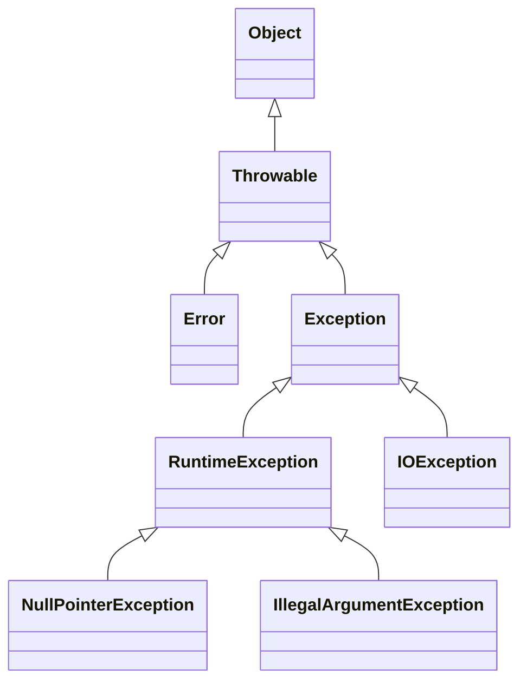
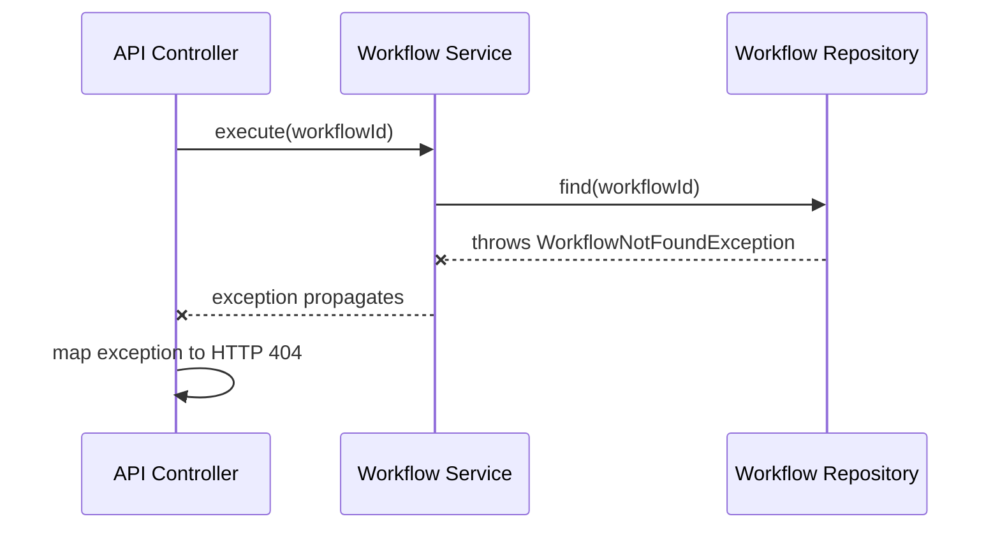
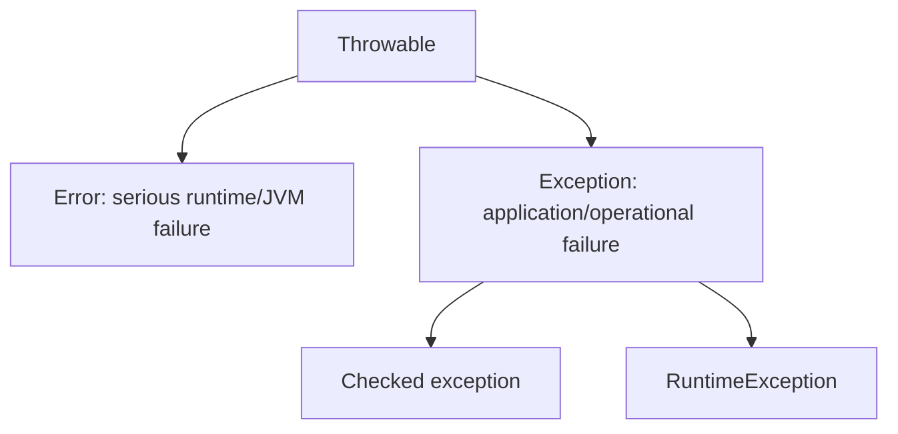
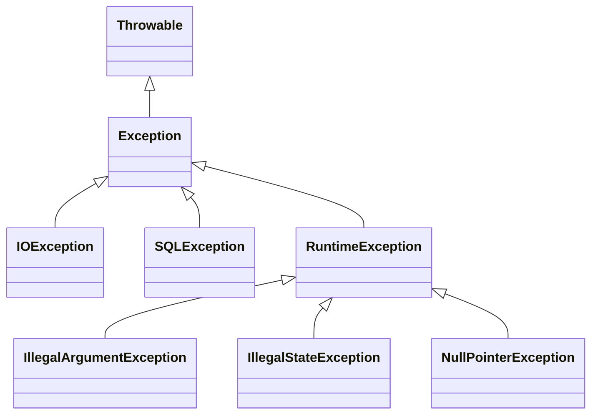
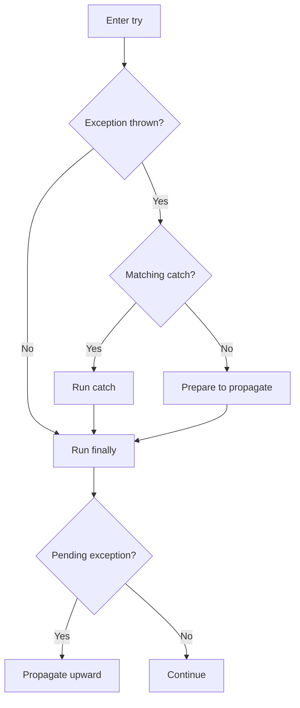
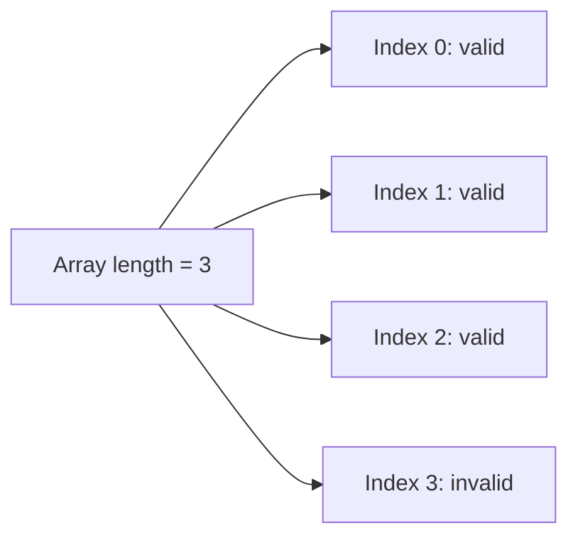
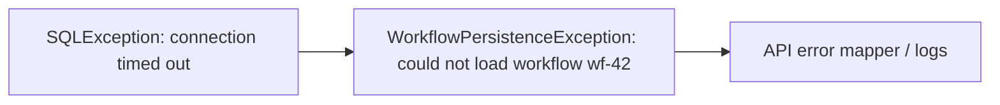
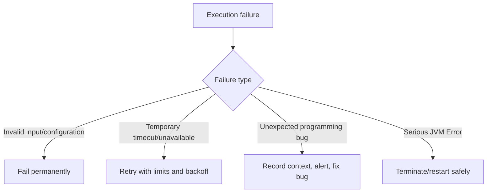

# Caelius Interview Preparation

## Java Exception Handling (Q041-Q050)

Use this speaking structure:

```text
Define -> Distinguish failure type -> Show handling -> Explain production decision
```

The examples use workflow execution and external API integrations because they make exception-handling decisions concrete:

- Invalid workflow configuration is usually non-retryable.
- A temporary provider timeout may be retryable.
- A programming bug should be fixed, not silently swallowed.
- Every failure should preserve enough context for debugging.

---

# Q041. What Is an Exception in Java?

## Interview answer

> An exception is an object representing an abnormal condition that interrupts the normal flow of a program. Java propagates the exception up the call stack until a matching handler catches it or the thread terminates.

## Basic example

```java
public NodeResult executeWorkflow(String workflowId) {
    if (workflowId == null || workflowId.isBlank()) {
        throw new IllegalArgumentException("Workflow ID is required");
    }

    return loadAndExecute(workflowId);
}
```

When the exception is thrown, statements after it in the current flow do not execute unless handling resumes elsewhere.

## Exception hierarchy



Only objects derived from `Throwable` can be thrown or caught.

## Propagation flow



## Why exceptions exist

Exceptions separate normal business logic from failure-handling logic:

```java
try {
    NodeResult result = executor.execute(context);
    saveSuccess(result);
} catch (ProviderTimeoutException error) {
    scheduleRetry(error);
}
```

## Production advice

Do not use exceptions for normal expected branching:

```java
// Poor: exception controls an ordinary condition.
try {
    return users.get(index);
} catch (IndexOutOfBoundsException error) {
    return defaultUser;
}
```

Validate expected conditions explicitly. Use exceptions for exceptional failure paths.

## Project connection

Nodeflowz distinguishes invalid events using `NonRetriableError`, while execution failures are recorded with an error message and stack. The same principle applies in Java: classify failures so the system knows whether to reject, retry, or record them.

---

# Q042. Difference Between Error and Exception

## Interview answer

> Both `Error` and `Exception` extend `Throwable`. Exceptions represent conditions an application may reasonably handle or report. Errors generally represent serious JVM or environment failures that applications should not normally try to recover from.

## Comparison

| Concern | `Exception` | `Error` |
|---|---|---|
| Meaning | Application or operational failure | Serious JVM/environment problem |
| Typical recovery | Often possible | Usually not safe or meaningful |
| Examples | `IOException`, `SQLException`, `IllegalArgumentException` | `OutOfMemoryError`, `StackOverflowError`, `LinkageError` |
| Usually catch? | Catch specific exceptions where useful | Generally no |

## Example exception

```java
try {
    providerClient.call();
} catch (SocketTimeoutException error) {
    retryLater(error);
}
```

A timeout may be temporary and recoverable.

## Example error

```java
// Recursive bug can eventually cause StackOverflowError.
void recurse() {
    recurse();
}
```

Continuing normal processing after serious memory or JVM failure may leave the process unreliable.

## Hierarchy



## Can you catch an `Error`?

Technically yes:

```java
try {
    riskyOperation();
} catch (StackOverflowError error) {
    // Technically valid, generally poor recovery strategy.
}
```

But usually do not catch `Error` for recovery. Infrastructure may catch `Throwable` at a top-level boundary only to log and terminate safely, not to pretend execution can continue normally.

## Interview closing

> I handle specific exceptions when I can take a meaningful action. I do not broadly catch serious JVM errors and continue as if the system is healthy.

---

# Q043. What Is a Checked vs Unchecked Exception?

## Interview answer

> A checked exception must be caught or declared with `throws` at compile time. An unchecked exception extends `RuntimeException` and does not require compile-time handling. Checked exceptions commonly represent recoverable external failures, while unchecked exceptions often represent programming errors or invalid state.

## Hierarchy



## Checked exception example

```java
public String readTemplate(Path path) throws IOException {
    return Files.readString(path);
}
```

The caller must catch or declare it:

```java
try {
    String template = readTemplate(path);
} catch (IOException error) {
    logTemplateFailure(path, error);
}
```

## Unchecked exception example

```java
public void setRetryCount(int retries) {
    if (retries < 0) {
        throw new IllegalArgumentException("Retries cannot be negative");
    }
}
```

The compiler does not force the caller to catch it.

## Comparison

| Concern | Checked | Unchecked |
|---|---|---|
| Extends | `Exception`, excluding `RuntimeException` | `RuntimeException` |
| Compiler requires handling | Yes | No |
| Typical meaning | External/recoverable condition | Programming error, invalid input/state |
| Examples | `IOException`, `SQLException` | `NullPointerException`, `IllegalArgumentException` |

## Design tradeoff

Checked exceptions make failure contracts visible, but excessive checked exceptions can create noisy signatures and wrapper code. Choose based on whether callers can reasonably recover.

## Workflow example

```java
public NodeResult callProvider() throws ProviderUnavailableException {
    // Caller can retry or route to a fallback.
}
```

```java
public void execute(Node node) {
    if (node == null) {
        throw new IllegalArgumentException("Node is required");
    }
}
```

## Interview nuance

> Whether an exception should be checked is a design decision, not a universal rule. The important question is whether the caller is expected to handle the condition meaningfully.

---

# Q044. Explain `try`, `catch`, and `finally`

## Interview answer

> The `try` block contains code that may fail. A matching `catch` block handles a thrown exception. The `finally` block runs after the try/catch flow for cleanup in almost all circumstances.

## Example

```java
Connection connection = null;

try {
    connection = dataSource.getConnection();
    executeWorkflowUpdate(connection);
} catch (SQLException error) {
    recordDatabaseFailure(error);
} finally {
    if (connection != null) {
        try {
            connection.close();
        } catch (SQLException closeError) {
            recordCloseFailure(closeError);
        }
    }
}
```

## Control flow



## Multiple catch blocks

Catch specific exceptions before general exceptions:

```java
try {
    executeNode();
} catch (ProviderTimeoutException error) {
    scheduleRetry(error);
} catch (InvalidNodeConfigurationException error) {
    markNonRetryableFailure(error);
} catch (Exception error) {
    recordUnexpectedFailure(error);
}
```

This ordering is invalid:

```java
try {
    executeNode();
} catch (Exception error) {
} 
// catch (IOException error) { } // unreachable
```

## Prefer try-with-resources

For resources implementing `AutoCloseable`:

```java
try (BufferedReader reader = Files.newBufferedReader(path)) {
    return reader.readLine();
}
```

This is cleaner and handles suppressed cleanup exceptions better than manual closing.

## Production rule

Never leave a catch block empty:

```java
try {
    executeNode();
} catch (Exception ignored) {
    // Failure disappears. Debugging becomes painful.
}
```

Catch only when you can recover, translate, add useful context, or log at a system boundary.

---

# Q045. Can a `finally` Block Be Skipped?

## Interview answer

> A `finally` block runs in almost all normal control flows, including returns and thrown exceptions. It can be skipped if the JVM or process terminates before it executes, such as `System.exit()`, a fatal crash, forced process termination, or machine failure.

## Runs despite return

```java
public int calculate() {
    try {
        return 10;
    } finally {
        System.out.println("Cleanup still runs");
    }
}
```

Output:

```text
Cleanup still runs
```

Then the method returns `10`.

## Can be skipped

```java
try {
    System.exit(0);
} finally {
    System.out.println("May not execute");
}
```

Other examples:

- The process is forcibly killed.
- The operating system crashes.
- The machine loses power.
- The JVM crashes.
- Execution never leaves the `try` block because a thread hangs forever.

## Dangerous return in `finally`

```java
public int value() {
    try {
        return 1;
    } finally {
        return 2;
    }
}
```

This returns `2`. The `finally` return overrides the `try` return.

Even worse, a `finally` return can suppress an exception:

```java
public int value() {
    try {
        throw new IllegalStateException("Failure");
    } finally {
        return 2; // hides the exception
    }
}
```

## Rule

> Never return from `finally`. Use it only for necessary cleanup, and prefer try-with-resources where possible.

## Reliability implication

Do not rely only on `finally` for critical distributed-state guarantees. If a worker process dies, cleanup code may not run. Use durable job state, leases, timeouts, and recovery mechanisms.

---

# Q046. What Is `throw` vs `throws`?

## Interview answer

> `throw` actually raises one exception object at a specific point in code. `throws` appears in a method declaration to state that the method may propagate one or more exceptions to its caller.

## `throw`

```java
public void validateWorkflowId(String workflowId) {
    if (workflowId == null || workflowId.isBlank()) {
        throw new IllegalArgumentException("Workflow ID is required");
    }
}
```

## `throws`

```java
public NodeResult executeHttpNode() throws IOException {
    return callExternalProvider();
}
```

## Together

```java
public Workflow loadWorkflow(String id) throws WorkflowNotFoundException {
    return repository.findById(id)
        .orElseThrow(() -> new WorkflowNotFoundException(id));
}
```

`orElseThrow()` uses `throw` behavior internally, while the method declaration uses `throws`.

## Comparison

| Concern | `throw` | `throws` |
|---|---|---|
| Location | Method body | Method signature |
| Purpose | Raise an exception | Declare possible propagation |
| Followed by | Throwable object | Exception type names |
| Count | One object at a time | Multiple types can be declared |

## Example with multiple declared failures

```java
public String loadRemoteTemplate(URI uri)
        throws IOException, TemplateValidationException {
    // ...
}
```

## Important nuance

Unchecked exceptions may be declared with `throws`, but Java does not require it:

```java
public void validate() throws IllegalArgumentException {
}
```

Usually declare unchecked exceptions in documentation when useful rather than adding noisy signatures.

---

# Q047. How Do You Create a Custom Exception?

## Interview answer

> Create a custom exception by extending `Exception` for a checked exception or `RuntimeException` for an unchecked exception. Give it a meaningful domain name, useful context, and constructors that preserve the original cause.

## Checked custom exception

```java
public final class ProviderUnavailableException extends Exception {
    private final String provider;

    public ProviderUnavailableException(String provider, Throwable cause) {
        super("Provider unavailable: " + provider, cause);
        this.provider = provider;
    }

    public String provider() {
        return provider;
    }
}
```

## Unchecked custom exception

```java
public final class InvalidWorkflowException extends RuntimeException {
    public InvalidWorkflowException(String message) {
        super(message);
    }
}
```

## Usage

```java
public NodeResult callProvider(String provider)
        throws ProviderUnavailableException {
    try {
        return client.call(provider);
    } catch (SocketTimeoutException error) {
        throw new ProviderUnavailableException(provider, error);
    }
}
```

## Good custom exception design

- Use a meaningful domain-specific name.
- Include safe diagnostic context.
- Preserve the cause.
- Avoid exposing credentials, tokens, or personal data.
- Distinguish retryable from non-retryable failures.
- Do not create a custom exception when a standard exception clearly fits.

## Retry classification example

```java
public sealed interface ExecutionFailure
        permits RetryableFailure, PermanentFailure {
}
```

Or use exception types:

```java
catch (ProviderUnavailableException error) {
    retry(error);
} catch (InvalidWorkflowException error) {
    failPermanently(error);
}
```

## Project connection

Nodeflowz uses `NonRetriableError` when required execution identifiers are missing. A Java workflow engine could model the same intent with custom exceptions such as `InvalidWorkflowException` and `ProviderUnavailableException`.

---

# Q048. What Is `NullPointerException`?

## Interview answer

> `NullPointerException`, or NPE, is an unchecked exception thrown when code tries to use `null` as though it referenced an object, such as calling a method, accessing a field, or unboxing a null wrapper.

## Common examples

### Calling a method on `null`

```java
String workflowId = null;
workflowId.trim(); // NullPointerException
```

### Null unboxing

```java
Integer retryCount = null;
int retries = retryCount; // NullPointerException
```

### Accessing a field through `null`

```java
Workflow workflow = null;
System.out.println(workflow.name()); // NullPointerException
```

## Prevention

### Validate required arguments

```java
public Workflow(String id) {
    this.id = Objects.requireNonNull(id, "Workflow ID is required");
}
```

### Return empty collections instead of `null`

```java
public List<Node> nodes() {
    return List.copyOf(nodes);
}
```

### Use `Optional` for meaningful optional return values

```java
public Optional<Workflow> findById(String id) {
    return repository.find(id);
}
```

Avoid using `Optional` everywhere, especially for fields or every method parameter. Its strongest use is making optional return values explicit.

## Poor handling

```java
try {
    workflow.execute();
} catch (NullPointerException error) {
    // Hides the actual programming bug.
}
```

Usually, fix the cause instead of catching NPE.

## Helpful NPE messages

Modern JVMs can provide more detailed NPE diagnostics identifying which reference was null. Still, explicit validation at boundaries produces clearer domain errors.

## Interview closing

> I prevent NPEs through clear nullability contracts, constructor validation, empty collections, and tests. I do not broadly catch NPE and continue.

---

# Q049. What Is `ArrayIndexOutOfBoundsException`?

## Interview answer

> `ArrayIndexOutOfBoundsException` is an unchecked exception thrown when code accesses an array using an index below zero or greater than or equal to the array length.

## Example

```java
int[] retries = {1, 2, 3};
System.out.println(retries[3]); // invalid; last valid index is 2
```

## Valid index range

For an array of length `n`:

```text
0 <= index < n
```



## Common off-by-one bug

Incorrect:

```java
for (int i = 0; i <= values.length; i++) {
    System.out.println(values[i]);
}
```

Correct:

```java
for (int i = 0; i < values.length; i++) {
    System.out.println(values[i]);
}
```

Or:

```java
for (int value : values) {
    System.out.println(value);
}
```

## Prevention

- Use correct loop boundaries.
- Validate external indexes.
- Prefer enhanced loops when the index is unnecessary.
- Test empty arrays and boundary positions.

```java
public int valueAt(int[] values, int index) {
    Objects.checkIndex(index, values.length);
    return values[index];
}
```

## Related exception

`IndexOutOfBoundsException` is the broader superclass also used by collections such as `List`.

## DSA connection

Boundary mistakes frequently break binary search, sliding windows, and two-pointer solutions. State the invariant before coding:

```text
The valid search interval is [left, right].
```

---

# Q050. What Is Exception Chaining?

## Interview answer

> Exception chaining means wrapping a lower-level exception inside a higher-level exception while preserving the original cause. It adds domain context without losing the root stack trace.

## Example

```java
public Workflow loadWorkflow(String workflowId) {
    try {
        return repository.load(workflowId);
    } catch (SQLException error) {
        throw new WorkflowPersistenceException(
            "Could not load workflow " + workflowId,
            error
        );
    }
}
```

Custom wrapper:

```java
public final class WorkflowPersistenceException extends RuntimeException {
    public WorkflowPersistenceException(String message, Throwable cause) {
        super(message, cause);
    }
}
```

## Why it matters

The repository layer knows a SQL operation failed. The service layer knows the business operation was loading a workflow. Chaining preserves both:



## Bad wrapping

```java
catch (SQLException error) {
    throw new RuntimeException("Database failed");
}
```

This discards the cause and root stack trace.

## Better wrapping

```java
catch (SQLException error) {
    throw new WorkflowPersistenceException(
        "Could not load workflow " + workflowId,
        error
    );
}
```

## Avoid sensitive context

Do not include:

- Database passwords
- API tokens
- Full credentials
- Sensitive user data

Log safe identifiers and correlation IDs instead.

## Suppressed exceptions

Try-with-resources may preserve cleanup failures as suppressed exceptions when another exception is already being thrown:

```java
try (Resource resource = openResource()) {
    use(resource);
}
```

You can inspect them using:

```java
error.getSuppressed();
```

## Project connection

Nodeflowz records both an execution error message and error stack. CommentPulse records job error state and attempts. Exception chaining complements those practices by retaining the original technical cause while adding operation-specific context.

---

# Complete Workflow Failure-Handling Example

```java
public final class WorkflowExecutionService {
    private final WorkflowRepository repository;
    private final ProviderClient provider;

    public WorkflowExecutionService(
            WorkflowRepository repository,
            ProviderClient provider) {
        this.repository = Objects.requireNonNull(repository);
        this.provider = Objects.requireNonNull(provider);
    }

    public NodeResult execute(String workflowId)
            throws ProviderUnavailableException {
        validateWorkflowId(workflowId);

        Workflow workflow = loadWorkflow(workflowId);

        try {
            return provider.execute(workflow);
        } catch (SocketTimeoutException error) {
            throw new ProviderUnavailableException(
                workflow.providerName(),
                error
            );
        }
    }

    private void validateWorkflowId(String workflowId) {
        if (workflowId == null || workflowId.isBlank()) {
            throw new IllegalArgumentException(
                "Workflow ID is required"
            );
        }
    }

    private Workflow loadWorkflow(String workflowId) {
        try {
            return repository.findById(workflowId)
                .orElseThrow(() ->
                    new WorkflowNotFoundException(workflowId)
                );
        } catch (SQLException error) {
            throw new WorkflowPersistenceException(
                "Could not load workflow " + workflowId,
                error
            );
        }
    }
}
```

## Failure classification



## What to explain

- Invalid IDs use an unchecked argument exception.
- Missing workflow uses a domain exception.
- SQL failure is chained into a persistence exception.
- Provider timeout becomes a checked, recoverable domain failure.
- The caller can retry only the failure category that may recover.

---

# Production Exception-Handling Rules

## Do

- Catch the most specific useful exception.
- Preserve causes when translating exceptions.
- Add safe domain context.
- Classify retryable and permanent failures.
- Use try-with-resources for closeable resources.
- Log once at the correct system boundary.
- Return stable, safe errors to API clients.
- Include correlation or execution IDs.

## Do not

- Swallow exceptions with empty catch blocks.
- Catch `Exception` everywhere.
- Catch `NullPointerException` to hide a bug.
- Retry invalid requests or permanent failures.
- Expose stack traces or secrets to clients.
- Return from `finally`.
- use `finalize()` for cleanup.

## API error mapping example

| Exception | Meaning | HTTP response |
|---|---|---:|
| `IllegalArgumentException` | Invalid request input | `400 Bad Request` |
| `WorkflowNotFoundException` | Resource absent | `404 Not Found` |
| `WorkflowConflictException` | Invalid current state | `409 Conflict` |
| `ProviderUnavailableException` | Temporary downstream issue | `503 Service Unavailable` |
| Unexpected exception | Internal bug/failure | `500 Internal Server Error` |

Never return the raw internal exception message automatically. Map it to a safe client-facing response and retain technical details in protected logs.

---

# Java Exception Handling Revision Sheet

## Memory lines

| Question | Memory line |
|---|---|
| Exception | Object representing abnormal flow; propagates until handled |
| Error vs exception | Serious JVM/environment failure vs handleable application failure |
| Checked vs unchecked | Compiler-enforced handling vs runtime exception |
| try/catch/finally | Attempt, handle, cleanup |
| Can finally be skipped? | Yes, if process/JVM terminates or never reaches it |
| `throw` vs `throws` | Raise an object vs declare propagation |
| Custom exception | Domain-specific type with useful context and preserved cause |
| NPE | Using `null` as an object or unboxing it |
| Array bounds | Valid indexes are `0` through `length - 1` |
| Exception chaining | Add domain context while retaining root cause |

## Common interview traps

- Saying every exception must be caught.
- Saying checked exceptions are always better.
- Saying `finally` absolutely always executes.
- Returning from `finally`.
- Confusing `throw` and `throws`.
- Catching broad `Exception` before specific exceptions.
- Losing the original cause while wrapping.
- Logging secrets inside exception messages.
- Retrying programming errors or invalid input.

## Forty-second answer template

```text
"X is ___. In a workflow system, it can happen when ___. I would handle it by
___. I would not ___ because ___. If I translate it, I preserve the original
cause and expose only a safe client-facing error."
```
