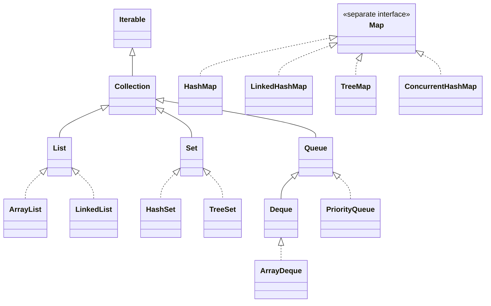
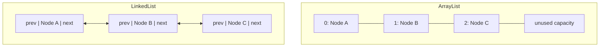
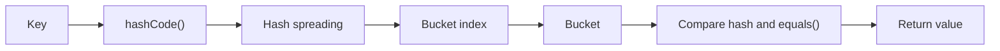
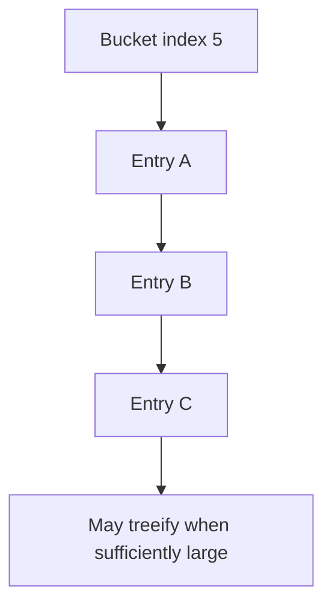
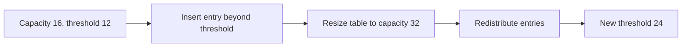
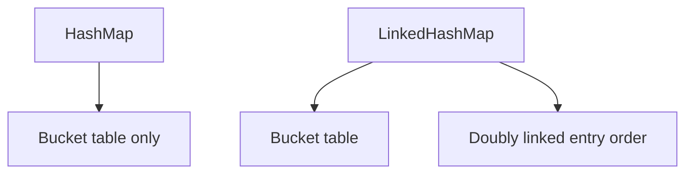
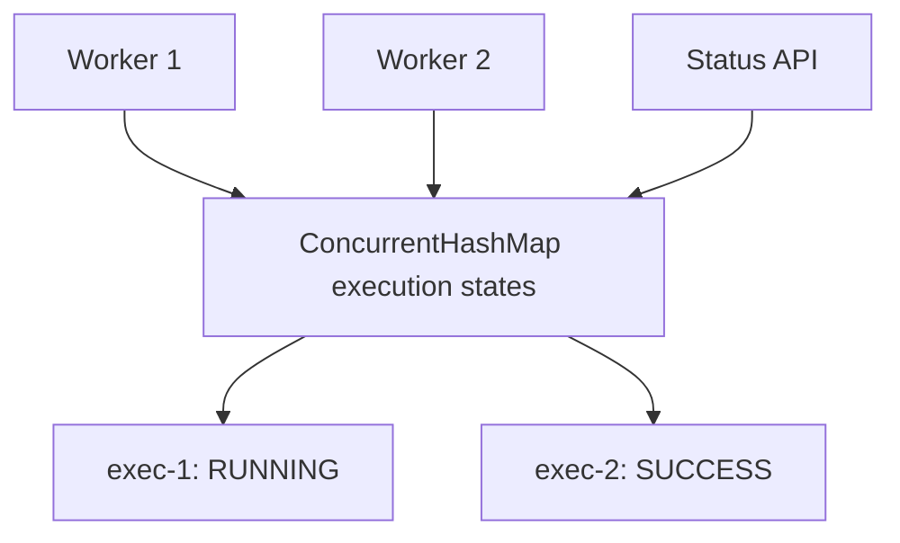
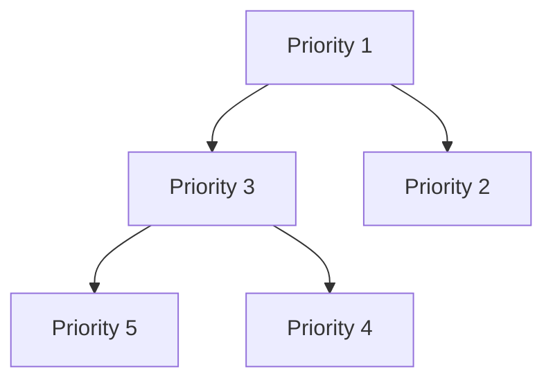
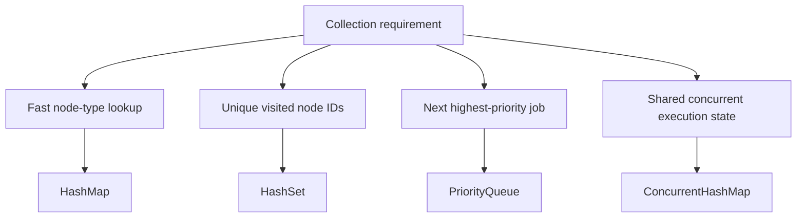

# Caelius Interview Preparation

## Java Collections (Q051-Q065)

Use this speaking structure:

```text
Define -> Internal structure -> Complexity -> When to use -> Important limitation
```

The strongest collection answer does not merely describe a data structure. It explains why that structure fits the required operations.

---

# Q051. What Is the Java Collections Framework?

## Interview answer

> The Java Collections Framework is a unified set of interfaces, implementations, algorithms, and utility methods for storing and manipulating groups of objects. Its main interfaces include `List`, `Set`, `Queue`, `Deque`, and `Map`.

## Main hierarchy



`Map` is part of the framework but does not extend `Collection` because it stores key-value mappings rather than individual elements.

## Core interfaces

| Interface | Main property | Workflow example |
|---|---|---|
| `List` | Ordered, duplicates allowed | Nodes in display order |
| `Set` | Unique elements | Visited node IDs |
| `Queue` | Process elements in an order | Ready-to-execute jobs |
| `Deque` | Add/remove at both ends | BFS queue or stack |
| `Map` | Key-value lookup | Node ID to executor |

## Example

```java
List<String> executionOrder = new ArrayList<>();
Set<String> visitedNodeIds = new HashSet<>();
Queue<WorkflowJob> readyJobs = new ArrayDeque<>();
Map<NodeType, NodeExecutor> executors = new HashMap<>();
```

## Framework benefits

- Common interfaces let implementations be substituted.
- Generic types provide compile-time type safety.
- Utility algorithms are available through `Collections`.
- Iterators provide standard traversal.
- Specialized concurrent and immutable variants support different use cases.

## Program to interfaces

Prefer:

```java
List<Node> nodes = new ArrayList<>();
```

Instead of:

```java
ArrayList<Node> nodes = new ArrayList<>();
```

The interface type keeps the caller less coupled to the implementation.

---

# Q052. Difference Between `ArrayList` and `LinkedList`

## Interview answer

> `ArrayList` uses a resizable array, giving fast indexed access and good cache locality. `LinkedList` uses doubly linked nodes, making indexed access slow but allowing constant-time insertion or removal when the exact node position is already known through an iterator.

## Internal structures



## Complexity

| Operation | `ArrayList` | `LinkedList` |
|---|---:|---:|
| Get by index | `O(1)` | `O(n)` |
| Append | Amortized `O(1)` | `O(1)` |
| Insert/remove at front | `O(n)` | `O(1)` |
| Insert/remove after locating position | `O(n)` shifting/search | `O(1)` link change, but search may be `O(n)` |
| Memory overhead | Lower | Higher per element |

## Example

```java
List<Node> nodes = new ArrayList<>();
nodes.add(httpNode);
nodes.add(slackNode);
Node second = nodes.get(1);
```

For a queue, prefer `ArrayDeque` rather than `LinkedList` in most cases:

```java
Deque<WorkflowJob> jobs = new ArrayDeque<>();
jobs.addLast(job);
WorkflowJob next = jobs.removeFirst();
```

## When to choose

Use `ArrayList` by default when:

- Reads and iteration are common.
- Indexed access matters.
- Appending is common.

Use `LinkedList` only when:

- You genuinely need its list-and-deque behavior.
- Frequent insertion/removal occurs through a known iterator position.
- Its memory and locality costs are acceptable.

## Interview trap

Saying "LinkedList insertion is always `O(1)`" is incomplete. Finding the insertion position may still cost `O(n)`.

---

# Q053. Difference Between `ArrayList` and `Vector`

## Interview answer

> Both are resizable-array implementations. `ArrayList` is not synchronized and is the normal modern choice. `Vector` synchronizes individual methods, is a legacy class, and often adds overhead without making compound operations safely atomic.

## Comparison

| Concern | `ArrayList` | `Vector` |
|---|---|---|
| Thread safety | Not synchronized | Individual methods synchronized |
| Performance | Usually faster | Synchronization overhead |
| Status | Modern standard choice | Legacy |
| Growth behavior | Usually grows by about 50% | Historically doubles unless capacity increment specified |
| Iterator | Fail-fast | Fail-fast iterator; also legacy `Enumeration` |

## Example race with compound actions

Even with `Vector`, this is not safely atomic:

```java
if (!vector.contains(job)) {
    vector.add(job);
}
```

Another thread can insert the job between `contains()` and `add()`.

## Better choices

For an ordinary list:

```java
List<Node> nodes = new ArrayList<>();
```

For a thread-safe snapshot-heavy list:

```java
List<Listener> listeners = new CopyOnWriteArrayList<>();
```

For coordinated access:

```java
List<Job> jobs = Collections.synchronizedList(new ArrayList<>());
```

You must still synchronize compound iteration/actions appropriately.

## Production decision

> I would not choose `Vector` merely because multiple threads exist. I would identify the required concurrency semantics and choose a suitable concurrent collection or synchronization design.

---

# Q054. How Does `HashMap` Work Internally?

## Interview answer

> `HashMap` stores key-value entries in an array of buckets. It computes the key's hash, maps that hash to a bucket index, and then uses `equals()` to find the exact key within that bucket. Colliding entries are stored in a linked structure that may become a balanced tree when collisions are high.

## Lookup flow



## Example

```java
Map<String, NodeExecutor> executors = new HashMap<>();
executors.put("HTTP", new HttpExecutor());
executors.put("SLACK", new SlackExecutor());

NodeExecutor executor = executors.get("HTTP");
```

## Simplified bucket model

```text
table[0] -> null
table[1] -> Entry(key=HTTP, value=HttpExecutor)
table[2] -> Entry(key=SLACK, value=SlackExecutor)
table[3] -> Entry A -> Entry B  // collision
```

## Important internal steps

1. Call the key's `hashCode()`.
2. Spread/mix hash bits.
3. Calculate a bucket index.
4. Search entries in that bucket.
5. Match using hash and `equals()`.

## Null support

`HashMap` permits:

- One `null` key.
- Multiple `null` values.

## Complexity

- Average `put()` and `get()`: `O(1)`.
- Worst case: traditionally `O(n)`.
- With treeified collision buckets: can improve toward `O(log n)` for suitable keys.

## Critical contract

Keys must have consistent `equals()` and `hashCode()` implementations:

```text
If a.equals(b) is true, a.hashCode() must equal b.hashCode().
```

Do not mutate fields used in a key's hash while the key is stored in a map. Lookup may fail because the key effectively moves to a different logical bucket.

---

# Q055. What Is Hashing and a Hash Collision?

## Interview answer

> Hashing converts a key into an integer hash used to locate a bucket efficiently. A collision occurs when different keys map to the same bucket or hash value, so the collection must compare keys and store multiple entries safely.

## Example collision

```java
record BadKey(String value) {
    @Override
    public int hashCode() {
        return 1;
    }
}
```

Every `BadKey` maps to the same initial bucket:

```java
Map<BadKey, String> values = new HashMap<>();
values.put(new BadKey("A"), "first");
values.put(new BadKey("B"), "second");
```

The map still distinguishes keys using `equals()`, but performance degrades.

## Collision handling



## Good hash function qualities

- Equal keys produce equal hashes.
- Hash values distribute keys reasonably across buckets.
- Computing the hash is efficient.
- Hash-relevant fields remain stable while used as keys.

## Collision vs duplicate key

A collision does not mean the keys are equal:

```text
Same bucket/hash + equals false -> two distinct keys
equals true -> same logical key; value is replaced
```

## Project use case

A workflow engine may map execution IDs to execution state. Good key distribution keeps lookup efficient even when many executions are active.

---

# Q056. What Are the Default Capacity and Load Factor of `HashMap`?

## Interview answer

> A default `HashMap` uses an initial effective table capacity of 16 when storage is first needed and a default load factor of 0.75. It resizes when the number of entries exceeds capacity multiplied by load factor.

## Threshold

```text
threshold = capacity x load factor
threshold = 16 x 0.75 = 12
```

The next insertion after reaching the threshold can trigger resizing.

## Why 0.75?

It balances:

- Memory usage.
- Collision probability.
- Lookup performance.

A lower load factor uses more memory but generally reduces collisions. A higher load factor saves table space but can increase collision chains.

## Capacity planning

If you know the approximate size, pre-sizing can reduce resize work:

```java
int expectedExecutors = 100;
Map<String, NodeExecutor> executors =
    new HashMap<>((int) (expectedExecutors / 0.75f) + 1);
```

## Important nuance

Constructing a default `HashMap` does not necessarily allocate the full backing table immediately. The table is generally initialized lazily on the first insertion.

## Interview trap

Capacity is the bucket-array size, not the number of entries currently stored.

---

# Q057. What Happens When `HashMap` Exceeds Its Load Factor?

## Interview answer

> When the entry count exceeds the resize threshold, `HashMap` increases its bucket-array capacity, generally doubling it, and redistributes entries according to the new capacity. This resize is relatively expensive but occurs occasionally, so insertion remains amortized `O(1)`.

## Resize flow



## Why entries move

The bucket index depends on table capacity. Increasing capacity changes where some entries belong.

## Complexity

A resize operation is `O(n)` because existing entries must be processed. But it does not occur on every insertion:

```text
Individual resize: O(n)
Average/amortized insertion: O(1)
```

## Production implication

Large maps can experience latency spikes during resizing. If the approximate number of entries is known, initialize a suitable capacity.

## Concurrency warning

`HashMap` is not thread safe. Concurrent modification during writes or resizing can cause incorrect behavior. Use `ConcurrentHashMap` or explicit synchronization when shared writes are required.

---

# Q058. Difference Between `HashMap` and `Hashtable`

## Interview answer

> `HashMap` is a modern, unsynchronized map that permits one null key and null values. `Hashtable` is a legacy synchronized map that permits neither null keys nor null values. For concurrent code, `ConcurrentHashMap` is generally preferred over `Hashtable`.

## Comparison

| Concern | `HashMap` | `Hashtable` |
|---|---|---|
| Synchronization | No | Yes, methods synchronized |
| Null key | One allowed | Not allowed |
| Null values | Allowed | Not allowed |
| Performance | Usually faster | Locking overhead |
| Status | Standard general-purpose map | Legacy |
| Iteration | Fail-fast iterator | Iterator plus legacy `Enumeration` |

## Example

```java
Map<String, String> map = new HashMap<>();
map.put(null, "default");
map.put("provider", null);
```

Equivalent operations with `Hashtable` throw `NullPointerException`.

## Why `ConcurrentHashMap` is better for concurrency

`Hashtable` broadly synchronizes methods, limiting concurrency. `ConcurrentHashMap` is designed for scalable concurrent access and supports atomic compound operations:

```java
cache.computeIfAbsent(workflowId, this::loadWorkflow);
```

## Interview closing

> I use `HashMap` for single-threaded or externally synchronized access. For shared concurrent access, I normally choose `ConcurrentHashMap`, not legacy `Hashtable`.

---

# Q059. Difference Between `HashMap` and `LinkedHashMap`

## Interview answer

> `HashMap` does not guarantee iteration order. `LinkedHashMap` maintains a linked ordering of entries, usually insertion order, and can optionally maintain access order, making it useful for LRU-style caches.

## Internal difference



## Comparison

| Concern | `HashMap` | `LinkedHashMap` |
|---|---|---|
| Lookup average | `O(1)` | `O(1)` |
| Iteration order | Unspecified | Insertion or access order |
| Memory | Lower | Higher due to linked ordering |
| Typical use | Fast lookup | Predictable order, LRU cache |

## Insertion-order example

```java
Map<String, Integer> steps = new LinkedHashMap<>();
steps.put("validate", 1);
steps.put("execute", 2);
steps.put("persist", 3);

steps.keySet().forEach(System.out::println);
```

Output:

```text
validate
execute
persist
```

## LRU-style cache

```java
public final class LruCache<K, V> extends LinkedHashMap<K, V> {
    private final int capacity;

    public LruCache(int capacity) {
        super(capacity, 0.75f, true);
        this.capacity = capacity;
    }

    @Override
    protected boolean removeEldestEntry(Map.Entry<K, V> eldest) {
        return size() > capacity;
    }
}
```

`true` enables access order.

## Project connection

AcadAI conversation memory or a semantic cache could use an LRU policy to bound memory. In production, a distributed cache may be more appropriate, but `LinkedHashMap` clearly demonstrates the eviction algorithm.

---

# Q060. What Is `ConcurrentHashMap` and Why Is It Used?

## Interview answer

> `ConcurrentHashMap` is a thread-safe map designed for high-concurrency access. It allows concurrent reads and supports scalable updates without locking the entire map for every operation.

## Example

```java
ConcurrentHashMap<String, ExecutionState> states =
    new ConcurrentHashMap<>();

states.put(executionId, ExecutionState.RUNNING);
states.computeIfPresent(executionId, (id, oldState) ->
    ExecutionState.SUCCESS
);
```

## Why not `HashMap`?

Shared concurrent writes to `HashMap` are unsafe:

```java
Map<String, Integer> counts = new HashMap<>();
// Multiple threads updating counts can lose updates or corrupt behavior.
```

## Atomic compound operations

This is racy:

```java
if (!states.containsKey(id)) {
    states.put(id, initialState);
}
```

Use:

```java
states.putIfAbsent(id, initialState);
```

Or:

```java
states.computeIfAbsent(id, this::loadState);
```

## Features

- Thread-safe reads and writes.
- Does not allow `null` keys or values.
- Iterators are weakly consistent rather than fail-fast.
- Atomic methods support compound operations.
- Retrieval operations usually do not block in the same broad way as legacy synchronized maps.

## Workflow example



## Important limitation

Thread-safe collection operations do not automatically make the entire business workflow atomic. If an operation spans the map, database, and external API, you still need a broader consistency design.

---

# Q061. Difference Between `HashSet` and `TreeSet`

## Interview answer

> `HashSet` stores unique elements using hashing and offers average `O(1)` add, remove, and contains operations without sorted order. `TreeSet` stores unique sorted elements using a balanced tree and offers `O(log n)` operations.

## Comparison

| Concern | `HashSet` | `TreeSet` |
|---|---|---|
| Internal structure | Hash table | Balanced search tree |
| Ordering | Unspecified | Sorted |
| Average add/contains/remove | `O(1)` | `O(log n)` |
| Null | Usually one allowed | Generally not with natural ordering |
| Equality basis | `equals()` and `hashCode()` | `compareTo()` or `Comparator` |
| Range operations | No | Yes |

## HashSet example

```java
Set<String> visitedNodeIds = new HashSet<>();

if (!visitedNodeIds.add(nodeId)) {
    throw new IllegalStateException("Node already visited");
}
```

`add()` returns `false` if the element already exists.

## TreeSet example

```java
NavigableSet<Instant> scheduledRuns = new TreeSet<>();
scheduledRuns.add(runAt1);
scheduledRuns.add(runAt2);

Instant next = scheduledRuns.ceiling(Instant.now());
```

## Internal relationship

`HashSet` is backed by a `HashMap`; set elements are stored as map keys with a shared placeholder value.

## Important TreeSet rule

The comparator must be consistent with equality for intuitive set behavior. If `compare(a, b) == 0`, `TreeSet` treats them as duplicates even if `a.equals(b)` is false.

## Selection rule

```text
Need uniqueness only? HashSet.
Need uniqueness plus sorted/range operations? TreeSet.
```

---

# Q062. What Is `PriorityQueue`? How Does It Order Elements?

## Interview answer

> `PriorityQueue` is a heap-based queue where removal returns the highest-priority element according to natural ordering or a provided comparator. Java's default priority queue is a min-heap.

## Example

```java
record WorkflowJob(String id, int priority, Instant createdAt) {
}

PriorityQueue<WorkflowJob> jobs = new PriorityQueue<>(
    Comparator.comparingInt(WorkflowJob::priority)
        .thenComparing(WorkflowJob::createdAt)
);

jobs.add(new WorkflowJob("free-job", 3, Instant.now()));
jobs.add(new WorkflowJob("enterprise-job", 1, Instant.now()));

WorkflowJob next = jobs.poll(); // enterprise-job
```

## Heap idea



The head is the smallest element under the comparator. The entire internal array is not globally sorted.

## Complexity

| Operation | Complexity |
|---|---:|
| `offer()` / `add()` | `O(log n)` |
| `poll()` / remove head | `O(log n)` |
| `peek()` | `O(1)` |
| Remove arbitrary element | `O(n)` |
| Contains | `O(n)` |

## Important limitations

- Does not allow `null`.
- Is not thread safe.
- Iteration order is not priority order.

For concurrent priority processing, use:

```java
PriorityBlockingQueue<WorkflowJob> jobs =
    new PriorityBlockingQueue<>();
```

## System-design nuance

Priority alone can starve low-priority users. A production task queue may need weighted fairness, aging, quotas, or separate queues.

---

# Q063. What Is `Comparable` vs `Comparator`?

## Interview answer

> `Comparable` defines a type's natural ordering inside the class through `compareTo()`. `Comparator` defines an external or alternative ordering and can provide multiple ways to sort the same type.

## Comparable example

```java
public record WorkflowJob(
        String id,
        int priority
) implements Comparable<WorkflowJob> {

    @Override
    public int compareTo(WorkflowJob other) {
        return Integer.compare(priority, other.priority);
    }
}
```

Usage:

```java
Collections.sort(jobs);
```

## Comparator example

```java
Comparator<WorkflowJob> byId =
    Comparator.comparing(WorkflowJob::id);

Comparator<WorkflowJob> byPriorityThenId =
    Comparator.comparingInt(WorkflowJob::priority)
        .thenComparing(WorkflowJob::id);

jobs.sort(byPriorityThenId);
```

## Comparison

| Concern | `Comparable` | `Comparator` |
|---|---|---|
| Method | `compareTo(T)` | `compare(T, T)` |
| Defined | Inside the class | Outside the class |
| Number of orderings | One natural ordering | Many alternative orderings |
| Modify class required | Yes | No |

## Correct comparison

Avoid subtraction:

```java
// Risk of integer overflow:
// return this.priority - other.priority;
```

Use:

```java
return Integer.compare(this.priority, other.priority);
```

## Contract

Comparison should be:

- Antisymmetric.
- Transitive.
- Consistent.

For sorted sets and maps, consistency with `equals()` avoids surprising duplicate behavior.

---

# Q064. What Is a Fail-Fast vs Fail-Safe Iterator?

## Interview answer

> A fail-fast iterator detects structural modification of a collection outside the iterator and usually throws `ConcurrentModificationException`. The term fail-safe commonly refers to iterators that traverse a snapshot or tolerate concurrent changes, though "fail-safe" is not an official Java specification term.

## Fail-fast example

```java
List<String> nodes = new ArrayList<>(
    List.of("HTTP", "SLACK", "OPENAI")
);

for (String node : nodes) {
    if (node.equals("SLACK")) {
        nodes.remove(node); // may throw ConcurrentModificationException
    }
}
```

## Safe removal using iterator

```java
Iterator<String> iterator = nodes.iterator();

while (iterator.hasNext()) {
    if (iterator.next().equals("SLACK")) {
        iterator.remove();
    }
}
```

## Snapshot-style iteration

```java
CopyOnWriteArrayList<String> listeners =
    new CopyOnWriteArrayList<>();

for (String listener : listeners) {
    listeners.add("new-listener");
}
```

The iterator observes a snapshot and does not throw due to that modification.

## Weakly consistent iteration

`ConcurrentHashMap` iterators are weakly consistent:

- They do not throw `ConcurrentModificationException`.
- They may reflect some modifications made during iteration.
- They do not guarantee a fixed snapshot.

## Comparison

| Iterator behavior | Example collections | Tradeoff |
|---|---|---|
| Fail-fast | `ArrayList`, `HashMap` | Detects many accidental structural modifications |
| Snapshot | `CopyOnWriteArrayList` | Safe stable iteration, expensive writes |
| Weakly consistent | `ConcurrentHashMap` | Scalable concurrent traversal, changing view |

## Important nuance

Fail-fast behavior is best-effort bug detection, not a synchronization guarantee. Do not depend on `ConcurrentModificationException` for correctness.

---

# Q065. Difference Between `Iterator` and `ListIterator`

## Interview answer

> `Iterator` traverses a collection forward and can remove the current element. `ListIterator` works only with lists and supports forward and backward traversal, element replacement, insertion, and index information.

## Comparison

| Capability | `Iterator` | `ListIterator` |
|---|---|---|
| Works with | Most collections | Lists only |
| Direction | Forward | Forward and backward |
| Remove | Yes | Yes |
| Add element | No | Yes |
| Replace element | No | Yes |
| Index access | No | `nextIndex()`, `previousIndex()` |

## Iterator example

```java
Set<String> nodeIds = new HashSet<>(
    Set.of("node-1", "node-2")
);

Iterator<String> iterator = nodeIds.iterator();
while (iterator.hasNext()) {
    System.out.println(iterator.next());
}
```

## ListIterator example

```java
List<String> steps = new ArrayList<>(
    List.of("validate", "execute", "persist")
);

ListIterator<String> iterator = steps.listIterator();

while (iterator.hasNext()) {
    String step = iterator.next();
    if (step.equals("execute")) {
        iterator.set("execute-with-retry");
        iterator.add("audit");
    }
}

while (iterator.hasPrevious()) {
    System.out.println(iterator.previous());
}
```

## When to use

Use `Iterator` for generic forward traversal and safe removal.

Use `ListIterator` when a list algorithm genuinely needs:

- Backward movement.
- In-place replacement.
- Insertion during traversal.
- Current traversal index.

## Design advice

Prefer higher-level operations where they express intent clearly:

```java
steps.removeIf(step -> step.isDeprecated());
steps.replaceAll(String::toUpperCase);
```

Use iterators when traversal control or mutation semantics require them.

---

# Complete Workflow Collections Example

```java
public final class WorkflowScheduler {
    private final Map<NodeType, NodeExecutor> executorRegistry =
        new HashMap<>();

    private final Set<String> visitedNodeIds =
        new HashSet<>();

    private final Queue<WorkflowJob> readyJobs =
        new PriorityQueue<>(
            Comparator.comparingInt(WorkflowJob::priority)
                .thenComparing(WorkflowJob::createdAt)
        );

    private final ConcurrentHashMap<String, ExecutionState>
        executionStates = new ConcurrentHashMap<>();

    public void register(NodeType type, NodeExecutor executor) {
        executorRegistry.put(
            Objects.requireNonNull(type),
            Objects.requireNonNull(executor)
        );
    }

    public void enqueue(WorkflowJob job) {
        readyJobs.offer(job);
        executionStates.putIfAbsent(
            job.executionId(),
            ExecutionState.QUEUED
        );
    }

    public Optional<WorkflowJob> nextJob() {
        return Optional.ofNullable(readyJobs.poll());
    }

    public boolean markVisited(String nodeId) {
        return visitedNodeIds.add(nodeId);
    }
}
```

## Why each collection was selected



## Important production correction

The `PriorityQueue` above is not thread safe. If multiple worker threads enqueue and poll concurrently, use external synchronization, a `PriorityBlockingQueue`, or a durable external queue.

---

# Collection Selection Guide

| Requirement | Good starting choice | Reason |
|---|---|---|
| Ordered sequence, indexed reads | `ArrayList` | Fast reads and iteration |
| Unique values, no order needed | `HashSet` | Average `O(1)` membership |
| Unique sorted values | `TreeSet` | Sorted and navigable |
| Key-value lookup | `HashMap` | Average `O(1)` lookup |
| Predictable map iteration | `LinkedHashMap` | Maintains insertion/access order |
| Sorted key-value lookup | `TreeMap` | Sorted and range queries |
| Concurrent key-value state | `ConcurrentHashMap` | Scalable thread-safe access |
| FIFO queue or stack | `ArrayDeque` | Efficient operations at both ends |
| Priority-based processing | `PriorityQueue` | Efficient head by comparator |
| Concurrent blocking jobs | `BlockingQueue` implementation | Coordinates producers and consumers |

---

# Java Collections Revision Sheet

## Memory lines

| Question | Memory line |
|---|---|
| Collections Framework | Shared interfaces and implementations for object groups |
| ArrayList vs LinkedList | Resizable array vs doubly linked nodes |
| ArrayList vs Vector | Unsynchronized modern list vs synchronized legacy list |
| HashMap internals | Hash -> bucket -> equals -> value |
| Collision | Different keys map to the same bucket/hash |
| Capacity/load factor | Default effective capacity 16, load factor 0.75 |
| Resize | Threshold crossed -> capacity grows -> entries redistributed |
| HashMap vs Hashtable | Unsynchronized/null-friendly vs legacy synchronized/no nulls |
| HashMap vs LinkedHashMap | Unspecified order vs insertion/access order |
| ConcurrentHashMap | Scalable thread-safe map with atomic operations |
| HashSet vs TreeSet | Average `O(1)` uniqueness vs sorted `O(log n)` uniqueness |
| PriorityQueue | Heap whose head is highest priority under comparator |
| Comparable vs Comparator | Natural internal order vs external alternative order |
| Fail-fast vs fail-safe | Detect modification vs snapshot/tolerant traversal |
| Iterator vs ListIterator | Forward generic traversal vs bidirectional list mutation |

## Common interview traps

- Saying `Map` extends `Collection`.
- Saying `LinkedList` insertion is always `O(1)` without discussing search.
- Choosing `Vector` simply because code is multithreaded.
- Saying `HashMap` guarantees `O(1)` in every case.
- Confusing a collision with an equal key.
- Forgetting the `equals()` and `hashCode()` contract.
- Saying `LinkedHashMap` is sorted.
- Saying a `PriorityQueue` iterator returns priority order.
- Assuming `ConcurrentHashMap` makes multi-system operations atomic.
- Treating fail-fast behavior as a concurrency guarantee.

## Forty-second answer template

```text
"X uses __ internally. Its main operations cost __. I would choose it when
___. I would avoid it when ___. In a workflow engine, a concrete use would be
___."
```
