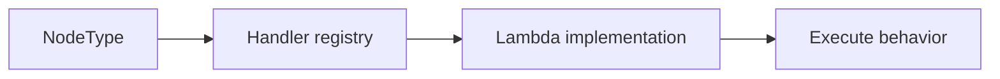
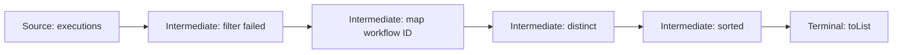
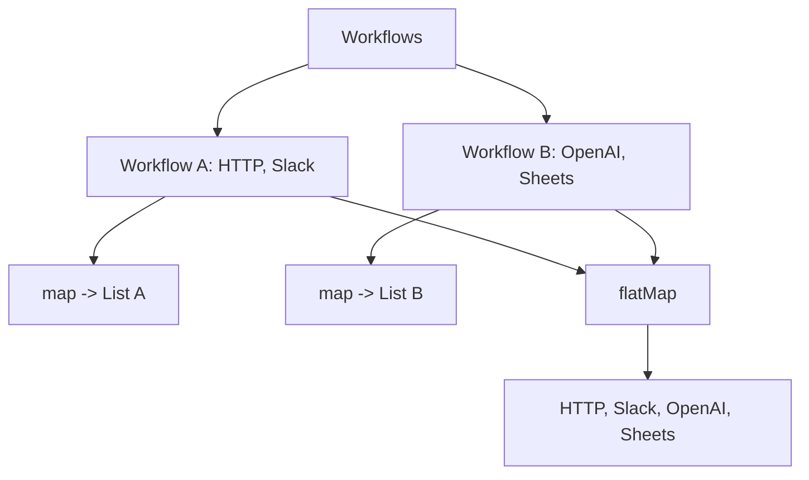
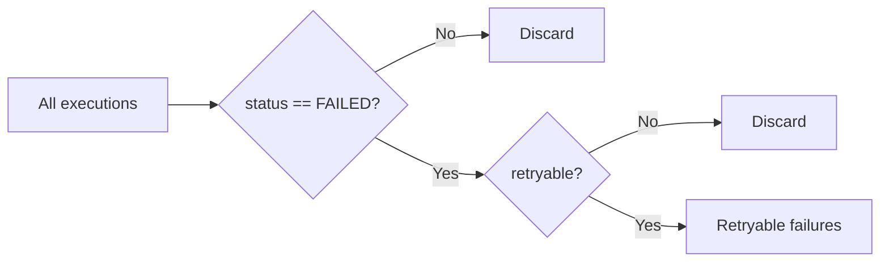
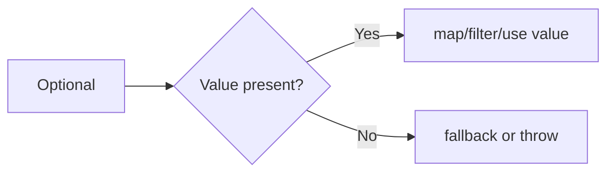
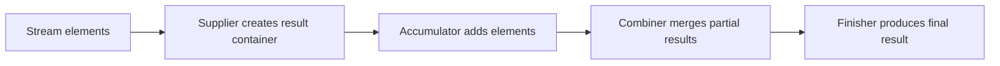
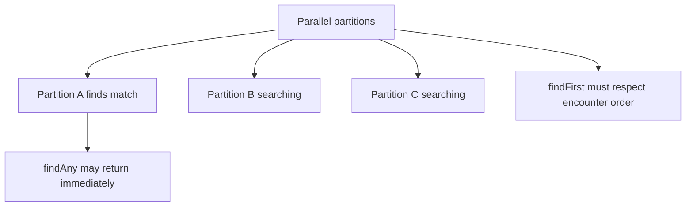
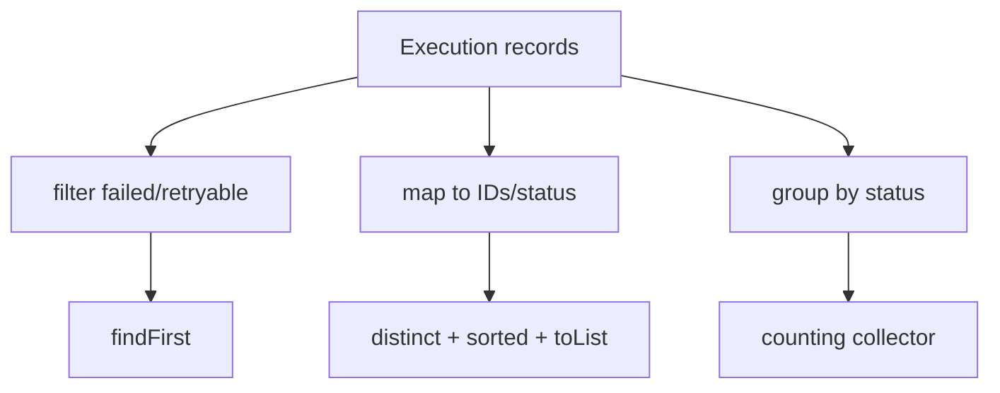

# Caelius Interview Preparation

## Java 8+ Features (Q066-Q075)

Use this speaking structure:

```text
Define -> Show a small pipeline -> Explain laziness/types -> State when not to use it
```

The examples use workflow nodes and execution records so the features connect to real backend engineering.

---

# Q066. What Are Lambda Expressions? Give an Example

## Interview answer

> A lambda expression is a concise implementation of a functional interface. It lets behavior be passed as data without creating a separate anonymous class.

## Basic syntax

```java
(parameters) -> expression
```

Or:

```java
(parameters) -> {
    statements;
}
```

## Example

```java
@FunctionalInterface
public interface NodeHandler {
    NodeResult execute(ExecutionContext context);
}

NodeHandler handler =
    context -> NodeResult.success("Workflow completed");
```

Equivalent anonymous class:

```java
NodeHandler handler = new NodeHandler() {
    @Override
    public NodeResult execute(ExecutionContext context) {
        return NodeResult.success("Workflow completed");
    }
};
```

## Workflow registry example

```java
Map<NodeType, NodeHandler> handlers = Map.of(
    NodeType.HTTP, context -> executeHttp(context),
    NodeType.SLACK, context -> executeSlack(context),
    NodeType.OPENAI, context -> executeOpenAi(context)
);
```



## Important rules

- A lambda needs a target functional-interface type.
- It can capture local variables only if they are final or effectively final.
- `this` inside a lambda refers to the surrounding object, unlike an anonymous class.
- Lambdas should remain small and focused.

## Effectively final example

```java
String prefix = "execution";

Function<String, String> addPrefix =
    id -> prefix + ":" + id;

// prefix = "changed"; // would break effective-final requirement
```

## Project connection

Nodeflowz maps node types to executor behavior. A Java implementation can use lambdas for simple stateless handlers while using full classes for complex providers with dependencies and state.

## Interview closing

> I use lambdas when they make behavior passing clearer. If the lambda grows complex, needs substantial state, or requires independent testing, I extract it into a named method or class.

---

# Q067. What Is the Stream API?

## Interview answer

> The Stream API processes sequences of elements through a declarative pipeline of operations such as filtering, mapping, sorting, and reduction. Streams do not store data; they consume a source and produce a result.

## Example

```java
List<String> failedWorkflowIds = executions.stream()
    .filter(execution -> execution.status() == ExecutionStatus.FAILED)
    .map(Execution::workflowId)
    .distinct()
    .sorted()
    .toList();
```

## Pipeline anatomy



## Operation types

### Intermediate operations

Return another stream and are generally lazy:

```java
filter()
map()
flatMap()
distinct()
sorted()
limit()
```

### Terminal operations

Trigger processing and produce a result or side effect:

```java
toList()
collect()
reduce()
count()
findFirst()
forEach()
```

## Laziness

This does not process elements yet:

```java
Stream<Execution> failed =
    executions.stream()
        .filter(execution -> execution.status() == FAILED);
```

Processing begins when a terminal operation is called:

```java
long count = failed.count();
```

## Streams are single-use

```java
Stream<Execution> stream = executions.stream();
long count = stream.count();
// stream.toList(); // IllegalStateException: stream already consumed
```

## Stream vs collection

```text
Collection stores elements.
Stream describes computation over elements.
```

## When a loop is better

Use a normal loop when:

- Control flow is stateful or complex.
- You need multiple breaks or continues.
- Exception handling dominates the operation.
- The stream pipeline becomes harder to read.

---

# Q068. Difference Between `map()` and `flatMap()`

## Interview answer

> `map()` transforms each input element into exactly one output element. `flatMap()` transforms each input element into a stream or collection of outputs and then flattens all nested results into one stream.

## `map()` example

```java
List<String> workflowNames = workflows.stream()
    .map(Workflow::name)
    .toList();
```

Shape:

```text
Workflow -> String
```

## Nested result using `map()`

```java
List<List<Node>> nestedNodes = workflows.stream()
    .map(Workflow::nodes)
    .toList();
```

Shape:

```text
Workflow -> List<Node>
Result: List<List<Node>>
```

## Flattened result using `flatMap()`

```java
List<Node> allNodes = workflows.stream()
    .flatMap(workflow -> workflow.nodes().stream())
    .toList();
```

Shape:

```text
Workflow -> Stream<Node>
Result: List<Node>
```

## Diagram



## Optional example

```java
Optional<Workflow> workflow = findWorkflow(id);

Optional<String> ownerEmail = workflow
    .flatMap(Workflow::owner)
    .map(User::email);
```

If `owner()` already returns `Optional<User>`, `flatMap()` avoids `Optional<Optional<User>>`.

## Memory line

```text
map transforms.
flatMap transforms and removes one nesting level.
```

---

# Q069. What Is `filter()` in Streams?

## Interview answer

> `filter()` is a lazy intermediate stream operation that retains only elements satisfying a `Predicate`.

## Example

```java
List<Execution> retryableFailures = executions.stream()
    .filter(execution -> execution.status() == ExecutionStatus.FAILED)
    .filter(Execution::isRetryable)
    .toList();
```

`filter()` expects:

```java
Predicate<Execution>
```

Which conceptually means:

```text
Execution -> boolean
```

## Reusable predicate

```java
Predicate<Execution> failed =
    execution -> execution.status() == ExecutionStatus.FAILED;

Predicate<Execution> recent =
    execution -> execution.startedAt().isAfter(cutoff);

List<Execution> recentFailures = executions.stream()
    .filter(failed.and(recent))
    .toList();
```

## Pipeline



## Good predicate design

Prefer pure predicates:

```java
execution -> execution.status() == FAILED
```

Avoid surprising side effects:

```java
execution -> {
    database.save(execution); // confusing side effect
    return execution.status() == FAILED;
}
```

## Project connection

CommentPulse distinguishes failed, completed, queued, and dead-lettered jobs. A Java service could use stream filters for reporting, but actual state transitions should remain explicit business operations.

---

# Q070. What Is the `Optional` Class and Why Is It Used?

## Interview answer

> `Optional<T>` is a container representing either a present value or no value. It makes optional return values explicit and encourages callers to handle absence without directly dereferencing `null`.

## Basic example

```java
public Optional<Workflow> findWorkflow(String id) {
    return repository.findById(id);
}
```

Usage:

```java
Workflow workflow = findWorkflow(id)
    .orElseThrow(() -> new WorkflowNotFoundException(id));
```

## Common operations

```java
optional.isPresent();
optional.isEmpty();
optional.map(...);
optional.flatMap(...);
optional.filter(...);
optional.orElse(...);
optional.orElseGet(...);
optional.orElseThrow(...);
optional.ifPresent(...);
```

## `orElse()` vs `orElseGet()`

```java
Workflow workflow = optional.orElse(loadDefaultWorkflow());
```

`loadDefaultWorkflow()` executes eagerly, even if a value is present.

```java
Workflow workflow = optional.orElseGet(this::loadDefaultWorkflow);
```

The supplier executes only when the optional is empty.

## Flow



## Good uses

- Return type where absence is expected.
- Chaining transformations on an optional value.
- Making "not found" behavior explicit.

## Avoid

- Calling `get()` without checking.
- Using `Optional` for every field.
- Passing `Optional` as every method parameter.
- Returning `null` from a method declared to return `Optional`.
- Using it to hide poor domain modeling.

## Important nuance

`Optional` does not replace all null checks. Constructor arguments and external data still need validation.

---

# Q071. What Are Method References?

## Interview answer

> A method reference is a concise lambda form that refers to an existing method or constructor when the method signature matches the required functional interface.

## Lambda vs method reference

```java
workflows.stream()
    .map(workflow -> workflow.name())
    .toList();
```

Equivalent:

```java
workflows.stream()
    .map(Workflow::name)
    .toList();
```

## Types of method references

### Static method

```java
Function<String, UUID> parser = UUID::fromString;
```

### Instance method of a particular object

```java
Consumer<String> logger = auditLogger::log;
```

### Instance method of an arbitrary object of a type

```java
Function<Workflow, String> getName = Workflow::name;
```

### Constructor reference

```java
Supplier<ArrayList<Node>> listFactory = ArrayList::new;
```

## Workflow example

```java
List<String> failedIds = executions.stream()
    .filter(Execution::isFailed)
    .map(Execution::id)
    .toList();
```

## Selection rule

Use a method reference when it improves readability:

```java
.map(Execution::id)
```

Use a lambda when the operation needs additional logic:

```java
.map(execution -> execution.id() + ":" + execution.status())
```

## Interview nuance

Method references do not execute the method immediately. They create a functional-interface implementation that invokes the referenced method later.

---

# Q072. What Are `Predicate`, `Function`, `Consumer`, and `Supplier`?

## Interview answer

> They are core functional interfaces in `java.util.function`. `Predicate` tests a value, `Function` transforms a value, `Consumer` accepts a value and returns nothing, and `Supplier` produces a value without input.

## Signatures

| Interface | Conceptual signature | Typical use |
|---|---|---|
| `Predicate<T>` | `T -> boolean` | Filtering and validation |
| `Function<T, R>` | `T -> R` | Transformation |
| `Consumer<T>` | `T -> void` | Side effects |
| `Supplier<T>` | `() -> T` | Lazy creation |

## Examples

```java
Predicate<Execution> failed =
    execution -> execution.status() == FAILED;

Function<Execution, String> toWorkflowId =
    Execution::workflowId;

Consumer<Execution> audit =
    execution -> auditLog.write(execution.id());

Supplier<ExecutionContext> contextFactory =
    ExecutionContext::new;
```

## Pipeline

```java
List<String> failedWorkflowIds = executions.stream()
    .filter(failed)
    .peek(audit)
    .map(toWorkflowId)
    .toList();
```

Use `peek()` mainly for debugging or carefully controlled observation. Do not hide critical business side effects inside it.

## Composition

```java
Predicate<Execution> retryableFailed =
    Execution::isFailed;

retryableFailed = retryableFailed.and(Execution::isRetryable);
```

```java
Function<Execution, String> id =
    Execution::workflowId;

Function<String, String> normalize =
    String::toLowerCase;

Function<Execution, String> normalizedId =
    id.andThen(normalize);
```

## Primitive specializations

Interfaces such as `IntPredicate`, `ToIntFunction`, and `IntSupplier` reduce boxing overhead:

```java
ToIntFunction<Workflow> nodeCount =
    workflow -> workflow.nodes().size();
```

---

# Q073. What Is `forEach()` in Java 8?

## Interview answer

> `forEach()` is a terminal operation that performs a `Consumer` action for every element. It is convenient for simple side effects, but it should not be used when ordering, mutation, exception handling, or control flow becomes unclear.

## Collection `forEach`

```java
workflows.forEach(workflow ->
    System.out.println(workflow.name())
);
```

Method reference:

```java
workflows.forEach(System.out::println);
```

## Stream `forEach`

```java
executions.stream()
    .filter(Execution::isFailed)
    .forEach(auditService::recordFailure);
```

## `forEach()` vs `forEachOrdered()`

With parallel streams:

```java
numbers.parallelStream()
    .forEach(System.out::println);
```

Encounter order is not guaranteed.

```java
numbers.parallelStream()
    .forEachOrdered(System.out::println);
```

Preserves encounter order, potentially reducing parallel performance.

## Risks

Avoid mutating non-thread-safe shared state:

```java
List<String> ids = new ArrayList<>();

executions.parallelStream()
    .forEach(execution -> ids.add(execution.id())); // unsafe
```

Prefer a reduction/collector:

```java
List<String> ids = executions.parallelStream()
    .map(Execution::id)
    .toList();
```

## When an ordinary loop is better

```java
for (Execution execution : executions) {
    try {
        process(execution);
    } catch (ProviderException error) {
        recordFailure(execution, error);
        break;
    }
}
```

The loop is clearer when you need checked-exception handling, `break`, or `continue`.

---

# Q074. What Is `collect()` in Streams?

## Interview answer

> `collect()` is a mutable-reduction terminal operation that gathers stream elements into a result such as a list, set, map, grouped structure, joined string, or custom container.

## Common collectors

### List

```java
List<String> ids = executions.stream()
    .map(Execution::id)
    .collect(Collectors.toList());
```

For modern Java, `toList()` is often simpler:

```java
List<String> ids = executions.stream()
    .map(Execution::id)
    .toList();
```

`Stream.toList()` returns an unmodifiable list. `Collectors.toList()` does not guarantee a specific mutability or implementation contract.

### Grouping

```java
Map<ExecutionStatus, List<Execution>> byStatus =
    executions.stream()
        .collect(Collectors.groupingBy(Execution::status));
```

### Counting by status

```java
Map<ExecutionStatus, Long> countByStatus =
    executions.stream()
        .collect(Collectors.groupingBy(
            Execution::status,
            Collectors.counting()
        ));
```

### Joining

```java
String failedIds = executions.stream()
    .filter(Execution::isFailed)
    .map(Execution::id)
    .collect(Collectors.joining(", "));
```

### Map

```java
Map<String, Execution> byId = executions.stream()
    .collect(Collectors.toMap(
        Execution::id,
        Function.identity()
    ));
```

## Duplicate-key trap

If two elements produce the same key, `toMap()` throws unless a merge function is supplied:

```java
Map<String, Execution> latestByWorkflow =
    executions.stream()
        .collect(Collectors.toMap(
            Execution::workflowId,
            Function.identity(),
            BinaryOperator.maxBy(
                Comparator.comparing(Execution::startedAt)
            )
        ));
```

## Collector flow



## `collect()` vs `reduce()`

Use `collect()` for mutable containers such as lists and maps. Use `reduce()` for combining values into one immutable result, such as a sum.

---

# Q075. Difference Between `findFirst()` and `findAny()`

## Interview answer

> Both return an `Optional` element from a stream. `findFirst()` respects encounter order and returns the first matching element. `findAny()` may return any matching element and can allow better optimization in parallel streams.

## Sequential example

```java
Optional<Execution> firstFailure = executions.stream()
    .filter(Execution::isFailed)
    .findFirst();
```

If the source has encounter order, this returns the earliest failed execution in that order.

```java
Optional<Execution> anyFailure = executions.stream()
    .filter(Execution::isFailed)
    .findAny();
```

In a sequential stream, it often behaves like `findFirst()`, but that is not the contract to depend on.

## Parallel behavior

```java
Optional<Execution> anyFailure = executions.parallelStream()
    .filter(Execution::isFailed)
    .findAny();
```

Workers may stop when any matching element is found.



## Selection rule

Use `findFirst()` when:

- Order has business meaning.
- You need the earliest/top-ranked result.

Use `findAny()` when:

- Any match is acceptable.
- You want to allow parallel optimization.

## Important nuance

If the source is unordered, "first" may not have useful business meaning. For example, `HashSet` does not guarantee a predictable encounter order.

## Project example

- Find the earliest failed execution for an audit report: `findFirst()`.
- Check whether any retryable failure exists: `findAny()` or, even clearer, `anyMatch()`.

```java
boolean hasRetryableFailure = executions.stream()
    .anyMatch(execution ->
        execution.isFailed() && execution.isRetryable()
    );
```

---

# Complete Java 8 Workflow Analytics Example

```java
public final class ExecutionAnalytics {
    public Map<ExecutionStatus, Long> countByStatus(
            List<Execution> executions) {
        return executions.stream()
            .collect(Collectors.groupingBy(
                Execution::status,
                Collectors.counting()
            ));
    }

    public List<String> failedWorkflowIds(
            List<Execution> executions) {
        return executions.stream()
            .filter(Execution::isFailed)
            .map(Execution::workflowId)
            .distinct()
            .sorted()
            .toList();
    }

    public List<Node> allNodes(List<Workflow> workflows) {
        return workflows.stream()
            .flatMap(workflow -> workflow.nodes().stream())
            .toList();
    }

    public Optional<Execution> firstRetryableFailure(
            List<Execution> executions) {
        return executions.stream()
            .filter(Execution::isFailed)
            .filter(Execution::isRetryable)
            .findFirst();
    }
}
```

## Pipeline overview



## What to explain

- Streams describe data processing; lists store data.
- Intermediate operations are lazy.
- `filter()` uses a predicate.
- `map()` transforms one-to-one.
- `flatMap()` removes one nesting level.
- `collect()` creates grouped summaries.
- `findFirst()` keeps encounter order.
- The operations avoid hidden shared mutation.

---

# Streams and Parallelism: Important Interview Follow-Up

## Are parallel streams always faster?

> No. Parallel streams add splitting, scheduling, coordination, and merge overhead. They work best for large, CPU-bound, easily partitioned, stateless operations. They may perform worse for small collections, blocking I/O, ordered operations, shared mutable state, or constrained server thread pools.

## Poor backend use

```java
providers.parallelStream()
    .forEach(provider -> provider.callExternalApi());
```

Problems:

- Uncontrolled external API concurrency.
- Provider rate-limit violations.
- Blocking common fork-join pool threads.
- Harder failure handling.

## Better approach

Use explicit bounded concurrency, an executor service, asynchronous client, or job queue when calling external systems.

```text
Parallel stream is a data-parallel tool, not a replacement for production job orchestration.
```

---

# Java 8+ Revision Sheet

## Memory lines

| Question | Memory line |
|---|---|
| Lambda | Concise functional-interface implementation |
| Stream API | Declarative, lazy pipeline over a data source |
| `map` vs `flatMap` | Transform one-to-one vs transform and flatten |
| `filter` | Keep elements matching a predicate |
| `Optional` | Explicit present-or-absent return container |
| Method reference | Lambda shorthand referring to an existing method |
| Core functional interfaces | Test, transform, consume, supply |
| `forEach` | Terminal consumer operation for simple side effects |
| `collect` | Mutable reduction into lists, maps, groups, or custom results |
| `findFirst` vs `findAny` | Ordered first match vs any acceptable match |

## Common interview traps

- Saying lambdas work without a functional-interface target type.
- Saying streams store data.
- Forgetting intermediate operations are lazy.
- Reusing a consumed stream.
- Confusing `map()` and `flatMap()`.
- Calling `Optional.get()` without checking.
- Using `orElse()` when fallback creation is expensive.
- Hiding critical side effects in `filter()`, `map()`, or `peek()`.
- Mutating shared non-thread-safe state inside `forEach()`.
- Forgetting duplicate-key handling in `Collectors.toMap()`.
- Claiming parallel streams are always faster.

## Forty-second answer template

```text
"X is ___. In this pipeline, the source is ___, the intermediate operation
does ___, and the terminal operation produces ___. It is useful when ___.
I would avoid it when the pipeline introduces hidden state, unclear control
flow, or uncontrolled concurrency."
```
