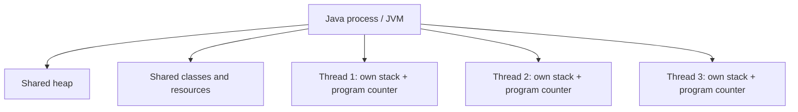
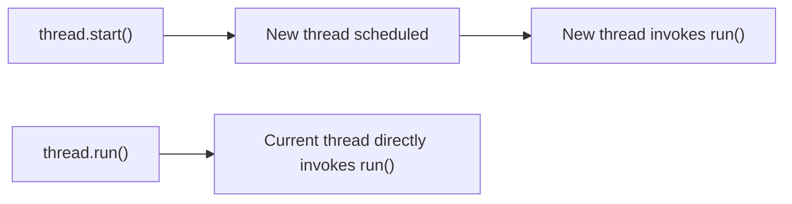
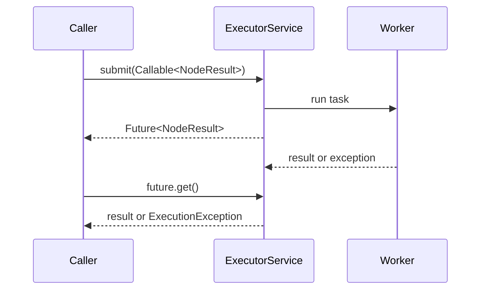
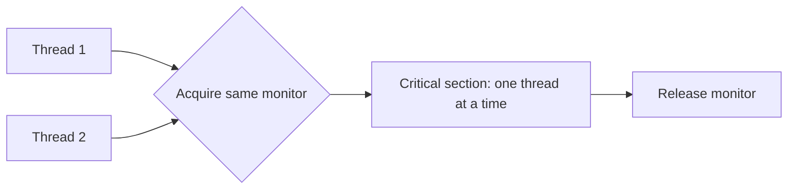
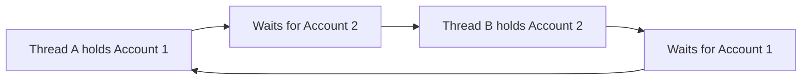
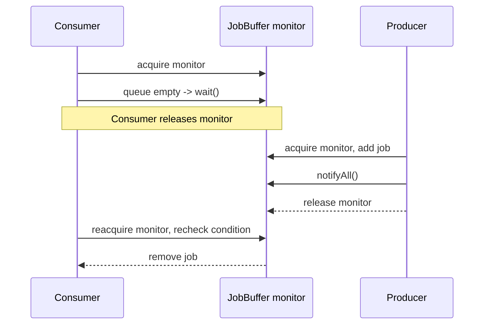
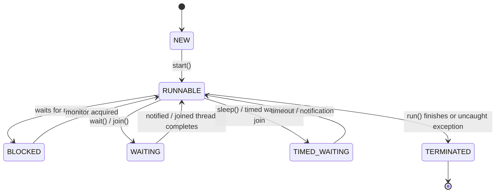
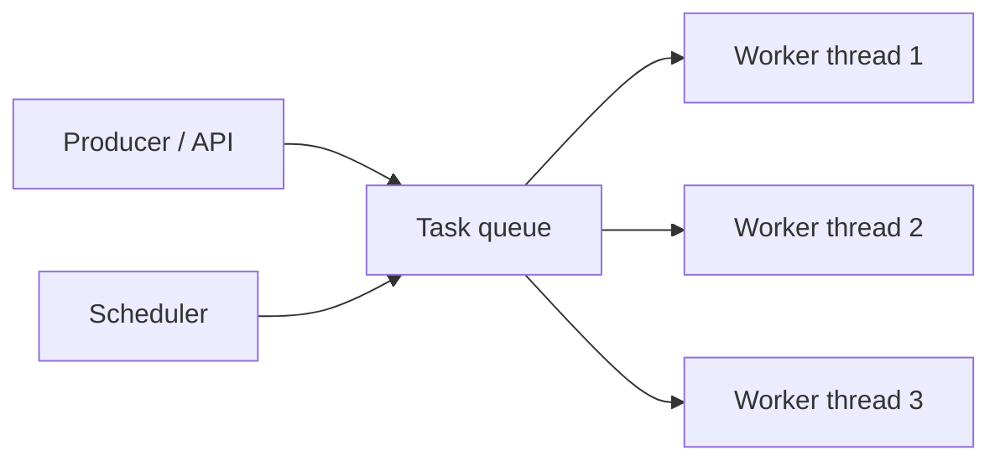
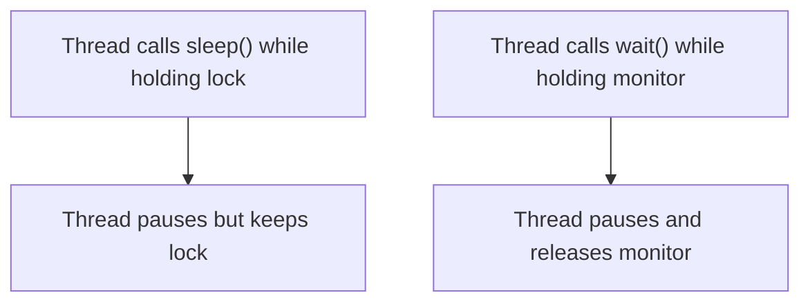
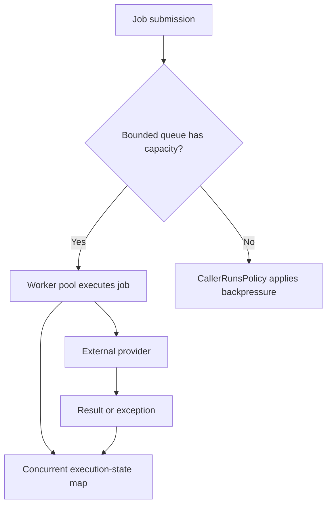

# Caelius Interview Preparation

## Java Multithreading (Q076-Q085)

Use this speaking structure:

```text
Define -> Explain shared-state risk -> Show safe mechanism -> State scalability tradeoff
```

The examples use workflow workers and background jobs because concurrency questions are strongest when connected to real execution behavior.

---

# Q076. What Is a Thread? Difference Between Process and Thread

## Interview answer

> A process is an independently running program with its own memory space and operating-system resources. A thread is a unit of execution inside a process. Threads in the same process share heap memory and resources but have separate stacks and execution state.

## Diagram



## Comparison

| Concern | Process | Thread |
|---|---|---|
| Memory | Separate address space | Shares process heap |
| Isolation | Stronger | Weaker |
| Communication | IPC required | Shared memory possible |
| Creation/context switch | Usually heavier | Usually lighter |
| Failure impact | Often isolated to process | Can affect entire process |
| Stack | Own | Own |

## Workflow example

A workflow service process may have:

- Request-handling threads.
- Worker threads executing jobs.
- Scheduler threads.
- Monitoring threads.

```java
public void executeJobs(List<WorkflowJob> jobs) {
    ExecutorService workers = Executors.newFixedThreadPool(4);

    for (WorkflowJob job : jobs) {
        workers.submit(() -> execute(job));
    }
}
```

## Why threads are useful

Threads allow work to overlap:

- One thread waits for an API response while another handles a request.
- Multiple independent jobs can execute concurrently.
- UI or server responsiveness can improve.

## Important limitation

Shared memory introduces risks:

- Race conditions.
- Visibility bugs.
- Deadlocks.
- Resource contention.

## Concurrency vs parallelism

```text
Concurrency: multiple tasks make progress during overlapping time.
Parallelism: multiple tasks literally execute at the same instant.
```

A single CPU core can run concurrent threads through time slicing. Multiple cores enable true parallel execution.

---

# Q077. How Do You Create a Thread in Java? Two Ways

## Interview answer

> The classic two ways are extending `Thread` and implementing `Runnable`. Implementing `Runnable` is generally preferred because it separates the task from the thread and leaves the class free to extend another class. In production, I normally submit tasks to an `ExecutorService` rather than manually creating threads.

## Extending `Thread`

```java
public final class WorkflowThread extends Thread {
    @Override
    public void run() {
        executeWorkflow();
    }
}

WorkflowThread thread = new WorkflowThread();
thread.start();
```

## Implementing `Runnable`

```java
public final class WorkflowTask implements Runnable {
    @Override
    public void run() {
        executeWorkflow();
    }
}

Thread thread = new Thread(new WorkflowTask());
thread.start();
```

Lambda:

```java
Thread thread = new Thread(() -> executeWorkflow());
thread.start();
```

## `start()` vs `run()`

```java
thread.start(); // asks JVM to create/schedule a new thread
thread.run();   // ordinary method call on current thread
```



## Preferred production approach

```java
ExecutorService executor = Executors.newFixedThreadPool(4);
executor.submit(() -> executeWorkflow());
```

Benefits:

- Reuses threads.
- Bounds concurrency.
- Supports lifecycle management.
- Returns a `Future`.
- Separates submission from execution.

## Modern Java note

Modern Java also supports virtual threads:

```java
try (ExecutorService executor =
         Executors.newVirtualThreadPerTaskExecutor()) {
    executor.submit(() -> callProvider());
}
```

Virtual threads are useful for many blocking I/O tasks, but they do not remove downstream limits such as database connections or provider rate limits.

---

# Q078. What Is `Runnable` vs `Callable`?

## Interview answer

> `Runnable` represents a task that returns no result and cannot declare checked exceptions. `Callable<V>` returns a value of type `V` and can throw checked exceptions. Submitting either to an executor can produce asynchronous execution, while submitting a `Callable` returns a `Future<V>`.

## Comparison

| Concern | `Runnable` | `Callable<V>` |
|---|---|---|
| Method | `run()` | `call()` |
| Return value | `void` | `V` |
| Checked exceptions | Cannot declare | Can declare |
| Typical use | Fire-and-observe task | Task producing a result |

## Runnable example

```java
Runnable auditTask = () ->
    auditService.record("workflow-started");
```

## Callable example

```java
Callable<NodeResult> nodeTask = () ->
    providerClient.execute(node);
```

## Executor usage

```java
ExecutorService executor = Executors.newFixedThreadPool(4);

Future<NodeResult> future = executor.submit(nodeTask);

try {
    NodeResult result = future.get(5, TimeUnit.SECONDS);
} catch (TimeoutException error) {
    future.cancel(true);
}
```

## Flow



## Exception behavior

An exception from a submitted `Callable` is captured and later exposed through `Future.get()` as `ExecutionException`. Inspect its cause:

```java
catch (ExecutionException error) {
    Throwable cause = error.getCause();
}
```

## Production caution

`Future.get()` without a timeout can block indefinitely. Use timeouts, cancellation, and bounded resources.

---

# Q079. What Is the `synchronized` Keyword?

## Interview answer

> `synchronized` provides mutual exclusion and memory visibility using an object's monitor. Only one thread at a time can execute code synchronized on the same monitor, and changes made before releasing the monitor become visible to a thread that later acquires it.

## Race condition

```java
public final class Counter {
    private int value;

    public void increment() {
        value++; // read, add, write: not atomic
    }
}
```

Two threads can read the same old value and lose an increment.

## Synchronized method

```java
public synchronized void increment() {
    value++;
}
```

For an instance method, the monitor is `this`.

## Synchronized block

```java
private final Object lock = new Object();

public void increment() {
    synchronized (lock) {
        value++;
    }
}
```

## Mutual exclusion



## Static synchronized method

```java
public static synchronized void register() {
}
```

The monitor is the class object, such as `Registry.class`.

## Reentrancy

Java intrinsic locks are reentrant. A thread holding a monitor can enter another synchronized section protected by the same monitor.

## Better alternatives for specific tasks

For an atomic counter:

```java
AtomicInteger count = new AtomicInteger();
count.incrementAndGet();
```

For concurrent maps:

```java
ConcurrentHashMap<String, ExecutionState> states =
    new ConcurrentHashMap<>();
```

## Production advice

- Keep synchronized critical sections small.
- Do not perform slow network calls while holding a lock.
- Do not expose lock objects publicly.
- Use higher-level concurrent utilities when they express the requirement better.

---

# Q080. What Is Deadlock and How Do You Prevent It?

## Interview answer

> Deadlock occurs when threads wait indefinitely for resources held by each other, so none can proceed. Prevention strategies include consistent lock ordering, avoiding nested locks, using time-bounded lock acquisition, keeping critical sections small, and reducing shared mutable state.

## Deadlock example

```java
public void transfer(
        Account from,
        Account to,
        BigDecimal amount) {
    synchronized (from) {
        synchronized (to) {
            from.debit(amount);
            to.credit(amount);
        }
    }
}
```

Thread A transfers account 1 to 2 and locks account 1 first.

Thread B transfers account 2 to 1 and locks account 2 first.



## Four necessary conditions

1. **Mutual exclusion:** a resource is held by one thread.
2. **Hold and wait:** a thread holds one resource while waiting for another.
3. **No preemption:** resources cannot be forcibly taken.
4. **Circular wait:** threads form a waiting cycle.

Breaking any one prevents deadlock.

## Consistent lock ordering

```java
public void transfer(
        Account firstAccount,
        Account secondAccount,
        BigDecimal amount) {
    Account lower = firstAccount.id() < secondAccount.id()
        ? firstAccount
        : secondAccount;
    Account higher = lower == firstAccount
        ? secondAccount
        : firstAccount;

    synchronized (lower) {
        synchronized (higher) {
            firstAccount.debit(amount);
            secondAccount.credit(amount);
        }
    }
}
```

All threads acquire locks in the same order, removing circular wait.

## Timed locks

```java
if (lock.tryLock(500, TimeUnit.MILLISECONDS)) {
    try {
        performOperation();
    } finally {
        lock.unlock();
    }
}
```

## Detection

Tools include:

- Thread dumps.
- `jstack`.
- Java Flight Recorder.
- Monitoring blocked-thread counts.

## Workflow example

Avoid holding a database/resource lock while calling a slow provider. Persist a state transition, release the lock, then perform the external call through a durable workflow.

---

# Q081. What Is the `volatile` Keyword?

## Interview answer

> `volatile` guarantees visibility of writes to a variable across threads and restricts certain reordering around that variable. It does not make compound operations such as increment atomic.

## Visibility example

```java
public final class Worker {
    private volatile boolean running = true;

    public void stop() {
        running = false;
    }

    public void runLoop() {
        while (running) {
            processNextJob();
        }
    }
}
```

Without appropriate visibility guarantees, the worker thread may continue seeing a stale cached value.

## What volatile guarantees

```text
Thread A writes volatile variable
        happens-before
Thread B later reads that volatile variable
```


## What volatile does not guarantee

```java
private volatile int count;

public void increment() {
    count++; // still not atomic
}
```

`count++` is read-modify-write. Multiple threads can lose updates.

Use:

```java
AtomicInteger count = new AtomicInteger();
count.incrementAndGet();
```

## Good volatile use cases

- Stop/configuration flags.
- Publishing an immutable object reference.
- State where each update is independent and atomic by itself.

## Not enough for

- Multi-variable invariants.
- Check-then-act operations.
- Counters using increment.
- Transactions across resources.

## Memory line

```text
volatile provides visibility, not general mutual exclusion or compound atomicity.
```

---

# Q082. What Are `wait()`, `notify()`, and `notifyAll()`?

## Interview answer

> `wait()`, `notify()`, and `notifyAll()` coordinate threads using an object's monitor. `wait()` releases the monitor and suspends the current thread. `notify()` wakes one waiting thread, while `notifyAll()` wakes all waiting threads so they can compete to reacquire the monitor.

## Rules

They must be called while holding the same object's monitor:

```java
synchronized (queue) {
    queue.wait();
}
```

Calling `wait()` without owning the monitor throws `IllegalMonitorStateException`.

## Producer-consumer example

```java
public final class JobBuffer {
    private final Queue<WorkflowJob> jobs = new ArrayDeque<>();

    public synchronized void put(WorkflowJob job) {
        jobs.add(job);
        notifyAll();
    }

    public synchronized WorkflowJob take()
            throws InterruptedException {
        while (jobs.isEmpty()) {
            wait();
        }
        return jobs.remove();
    }
}
```

## Why use `while`, not `if`?

```java
while (jobs.isEmpty()) {
    wait();
}
```

Because:

- Spurious wakeups can occur.
- Another awakened thread may consume the job first.
- The condition must be rechecked after reacquiring the monitor.

## Flow



## `notify()` vs `notifyAll()`

`notify()` wakes one arbitrary waiter. It may wake a thread whose condition cannot proceed.

`notifyAll()` is often safer for multiple conditions, though it can wake more threads and create contention.

## Prefer higher-level utilities

For producer-consumer queues:

```java
BlockingQueue<WorkflowJob> jobs =
    new LinkedBlockingQueue<>();

jobs.put(job);
WorkflowJob next = jobs.take();
```

Prefer `BlockingQueue`, locks/conditions, latches, semaphores, and executors over manual monitor coordination when possible.

---

# Q083. What Is the Thread Lifecycle in Java?

## Interview answer

> A Java thread moves through six JVM states: `NEW`, `RUNNABLE`, `BLOCKED`, `WAITING`, `TIMED_WAITING`, and `TERMINATED`.

## States

| State | Meaning |
|---|---|
| `NEW` | Created but not started |
| `RUNNABLE` | Eligible to run or currently running |
| `BLOCKED` | Waiting to acquire an intrinsic monitor lock |
| `WAITING` | Waiting indefinitely for another action |
| `TIMED_WAITING` | Waiting for a bounded time |
| `TERMINATED` | Execution completed or failed |

## Lifecycle



## Important nuance

Java's `RUNNABLE` state includes both actively running and ready-to-run threads. The JVM state does not expose a separate "running" state.

## Inspecting state

```java
Thread worker = new Thread(this::processJobs);
System.out.println(worker.getState()); // NEW

worker.start();
System.out.println(worker.getState()); // often RUNNABLE
```

Thread states can change immediately, so observations are snapshots.

## Interrupted threads

Interruption is a cooperative cancellation signal, not a lifecycle state:

```java
worker.interrupt();
```

Code should respond appropriately:

```java
try {
    queue.take();
} catch (InterruptedException error) {
    Thread.currentThread().interrupt();
    return;
}
```

Restoring the interrupt flag preserves the cancellation signal for callers.

## Production use

Monitoring many `BLOCKED` threads can reveal lock contention. Many `WAITING` threads may be normal for idle pools, so interpret states with system context.

---

# Q084. What Is `ExecutorService`?

## Interview answer

> `ExecutorService` is a high-level concurrency API that separates task submission from thread management. It reuses and manages worker threads, supports task results through `Future`, and provides controlled shutdown.

## Fixed pool example

```java
ExecutorService executor = Executors.newFixedThreadPool(4);

try {
    Future<NodeResult> future =
        executor.submit(() -> executeNode(node));

    NodeResult result = future.get(5, TimeUnit.SECONDS);
} finally {
    executor.shutdown();
}
```

## Architecture



## Common factory methods

| Factory | Behavior | Important concern |
|---|---|---|
| `newFixedThreadPool(n)` | Fixed worker count, unbounded queue | Queue can grow without bound |
| `newCachedThreadPool()` | Creates/reuses threads as needed | Thread count can grow aggressively |
| `newSingleThreadExecutor()` | One worker, ordered tasks | One slow task blocks later tasks |
| `newScheduledThreadPool(n)` | Delayed and periodic tasks | Handle failures and overlap carefully |
| `newVirtualThreadPerTaskExecutor()` | Virtual thread per task | Still requires downstream limits |

## Production-grade bounded pool

```java
ThreadPoolExecutor executor = new ThreadPoolExecutor(
    4,
    8,
    60,
    TimeUnit.SECONDS,
    new ArrayBlockingQueue<>(100),
    new ThreadPoolExecutor.CallerRunsPolicy()
);
```

This explicitly defines:

- Core and maximum threads.
- Queue capacity.
- Idle timeout.
- Rejection/backpressure policy.

## Shutdown

```java
executor.shutdown();

if (!executor.awaitTermination(30, TimeUnit.SECONDS)) {
    executor.shutdownNow();
}
```

- `shutdown()` stops new submissions and lets accepted tasks finish.
- `shutdownNow()` attempts interruption and returns queued tasks.

## CommentPulse connection

CommentPulse uses an in-process async executor as a local fallback and Redis workers for scaled execution. `ExecutorService` is the Java equivalent for controlled in-process task execution, but a durable external queue remains better when jobs must survive process failure.

## Interview closing

> I choose pool size and queue capacity based on whether work is CPU-bound or I/O-bound, and I always consider backpressure, timeout, cancellation, and graceful shutdown.

---

# Q085. Difference Between `sleep()` and `wait()`

## Interview answer

> `Thread.sleep()` pauses the current thread for a time without releasing any monitor locks it holds. `wait()` is called on an object while holding its monitor; it releases that monitor and waits for notification, interruption, or timeout.

## Comparison

| Concern | `sleep()` | `wait()` |
|---|---|---|
| Defined on | `Thread` | `Object` |
| Purpose | Pause current thread | Coordinate on a condition |
| Releases monitor | No | Yes, the monitor used for `wait()` |
| Requires synchronized context | No | Yes |
| Wake-up | Timeout or interruption | Notification, timeout, or interruption |
| Static/instance | Static method | Instance method |

## Sleep example

```java
try {
    Thread.sleep(1_000);
} catch (InterruptedException error) {
    Thread.currentThread().interrupt();
}
```

## Wait example

```java
synchronized (jobQueue) {
    while (jobQueue.isEmpty()) {
        jobQueue.wait();
    }
}
```

## Lock behavior



## Common mistake

Do not use `sleep()` for coordination:

```java
while (queue.isEmpty()) {
    Thread.sleep(100); // polling, latency, wasted wakeups
}
```

Prefer:

```java
BlockingQueue<Job> queue = new LinkedBlockingQueue<>();
Job job = queue.take();
```

## Important interruption handling

Both `sleep()` and `wait()` can throw `InterruptedException`. If the method cannot propagate it, restore the flag:

```java
catch (InterruptedException error) {
    Thread.currentThread().interrupt();
    return;
}
```

## Memory line

```text
sleep pauses without releasing locks.
wait coordinates and releases the object's monitor.
```

---

# Complete Bounded Workflow Worker Example

```java
public final class WorkflowWorkerPool implements AutoCloseable {
    private final ThreadPoolExecutor executor;
    private final ConcurrentHashMap<String, ExecutionState> states =
        new ConcurrentHashMap<>();

    public WorkflowWorkerPool(
            int coreWorkers,
            int maxWorkers,
            int queueCapacity) {
        this.executor = new ThreadPoolExecutor(
            coreWorkers,
            maxWorkers,
            60,
            TimeUnit.SECONDS,
            new ArrayBlockingQueue<>(queueCapacity),
            new ThreadPoolExecutor.CallerRunsPolicy()
        );
    }

    public Future<NodeResult> submit(WorkflowJob job) {
        states.putIfAbsent(
            job.executionId(),
            ExecutionState.QUEUED
        );

        return executor.submit(() -> {
            states.put(
                job.executionId(),
                ExecutionState.RUNNING
            );

            try {
                NodeResult result = execute(job);
                states.put(
                    job.executionId(),
                    ExecutionState.SUCCESS
                );
                return result;
            } catch (Exception error) {
                states.put(
                    job.executionId(),
                    ExecutionState.FAILED
                );
                throw error;
            }
        });
    }

    @Override
    public void close() throws InterruptedException {
        executor.shutdown();

        if (!executor.awaitTermination(30, TimeUnit.SECONDS)) {
            executor.shutdownNow();
        }
    }
}
```

## Architecture



## What to explain

- `ExecutorService` owns and reuses worker threads.
- The bounded queue prevents unlimited memory growth.
- `CallerRunsPolicy` slows producers under overload.
- `Callable` returns a `NodeResult` through `Future`.
- `ConcurrentHashMap` supports shared execution-state updates.
- External provider limits still need separate concurrency controls.
- Durable jobs should use an external queue if process restarts must not lose work.

---

# Concurrency Correctness Checklist

Before adding threads, ask:

1. Is the work independent?
2. What state is shared?
3. Which operations must be atomic?
4. How will writes become visible?
5. Can locks deadlock?
6. What limits the number of tasks and threads?
7. What happens when the queue is full?
8. How are timeouts and cancellation handled?
9. What happens during shutdown?
10. Must jobs survive a process crash?

## CPU-bound vs I/O-bound

```text
CPU-bound work:
Pool size is often near available CPU cores.

I/O-bound work:
More concurrency may help because tasks spend time waiting,
but downstream connection pools and rate limits still bound throughput.
```

## Little's Law intuition

If tasks arrive faster than they complete, queue depth grows:

```text
Queue growth = arrival rate - completion rate
```

Adding threads helps only until another bottleneck is reached, such as:

- CPU
- Memory
- Database connections
- Network bandwidth
- External provider quotas
- Lock contention

---

# Java Multithreading Revision Sheet

## Memory lines

| Question | Memory line |
|---|---|
| Process vs thread | Separate program memory vs shared-process execution unit |
| Create thread | Extend `Thread` or implement `Runnable`; prefer executors |
| Runnable vs Callable | No result/no checked throw vs result/checked throw |
| synchronized | Same-monitor mutual exclusion plus visibility |
| Deadlock | Circular indefinite resource waiting |
| volatile | Visibility and ordering, not compound atomicity |
| wait/notify | Monitor-based condition coordination |
| Thread lifecycle | NEW, RUNNABLE, BLOCKED, WAITING, TIMED_WAITING, TERMINATED |
| ExecutorService | Managed task submission, workers, futures, and shutdown |
| sleep vs wait | Pause while retaining locks vs release monitor and await condition |

## Common interview traps

- Saying every concurrent task runs in parallel.
- Calling `run()` when intending to start a new thread.
- Manually creating unlimited threads.
- Assuming `volatile count++` is atomic.
- Holding a lock during network calls.
- Using inconsistent lock ordering.
- Calling `wait()` without owning the monitor.
- Using `if` rather than `while` around `wait()`.
- Ignoring `InterruptedException`.
- Using unbounded pools or queues without discussing overload.
- Saying virtual threads remove database or API limits.

## Forty-second answer template

```text
"X provides ___. The shared-state risk is ___. I would make it safe using ___.
In a workflow worker, the concrete use is ___. The main limit is ___, so I
would also enforce ___."
```
