# Caelius Interview Preparation

## Advanced Java (Q086-Q100)

Use this speaking structure:

```text
Define -> Explain internal behavior -> Show practical use -> State the risk/tradeoff
```

The examples use a Java workflow automation platform so memory, generics, reflection, serialization, patterns, and dependency injection connect to one coherent system.

---

# Q086. What Is Garbage Collection in Java?

## Interview answer

> Garbage collection is the JVM's automatic memory-management process. It identifies heap objects that are no longer reachable from GC roots and reclaims their memory. It reduces manual memory-management errors, but it does not prevent logical memory leaks or manage external resources such as files and sockets.

## Reachability model

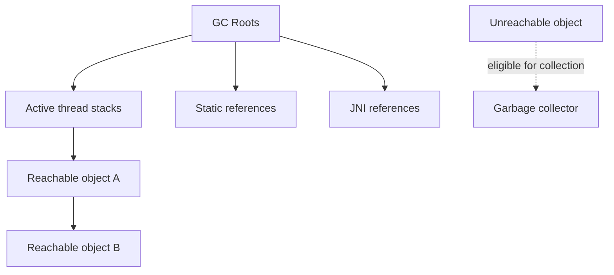

Common GC roots include:

- Local variables in active stack frames.
- Active threads.
- Static fields.
- JNI references.

An object becomes eligible for collection when no reachable path from a GC root leads to it.

## Example

```java
Workflow workflow = new Workflow("wf-1");
workflow = null;
```

The original object may now be eligible for collection if no other live reference points to it. Setting a variable to `null` does not force immediate collection.

## JVM responsibilities

Garbage collection typically involves:

1. Finding reachable objects.
2. Identifying unreachable objects.
3. Reclaiming memory.
4. Sometimes moving/compacting surviving objects.

## What GC does not handle

```java
try (InputStream input = Files.newInputStream(path)) {
    // Use the external resource.
}
```

Files, database connections, sockets, and similar resources must be closed explicitly, normally with try-with-resources.

## Important nuance

```java
System.gc();
```

This is only a request or hint. It does not guarantee immediate collection.

## Project connection

A long-running workflow worker creates many temporary request and response objects. GC reclaims unreachable objects, but unbounded caches, retained execution histories, or forgotten listeners can still exhaust memory.

---

# Q087. What Are Different Garbage-Collection Algorithms?

## Interview answer

> Garbage collectors use algorithms such as mark-sweep, mark-compact, copying, and generational collection. Modern JVM collectors combine these techniques with different goals for throughput, pause time, and heap size.

## Core algorithms

### Mark-sweep

1. Mark reachable objects.
2. Reclaim unmarked objects.

Risk: fragmented free space.

### Mark-compact

1. Mark reachable objects.
2. Move survivors together.
3. Reclaim the compacted free region.

Benefit: reduces fragmentation, but moving objects costs time.

### Copying

Copy live objects from one memory region to another and reclaim the whole old region.

Benefit: efficient when most objects die young.

### Generational collection

Based on the observation that many objects have short lifetimes:

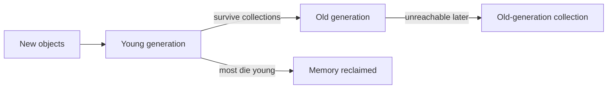

## Common JVM collectors

| Collector | General goal |
|---|---|
| Serial GC | Simple, single-threaded collection for small workloads |
| Parallel GC | High throughput using parallel collection work |
| G1 GC | Balanced pause-time and throughput goals across heap regions |
| ZGC | Very low pause times for large heaps |
| Shenandoah | Low-pause concurrent collection |

Exact defaults and availability depend on the Java version and JVM distribution.

## Tradeoff

```text
Throughput collector:
Maximize application work over time.

Low-latency collector:
Reduce pause duration, sometimes using more CPU/resources.
```

## Production approach

Do not choose a collector only from theory. Measure:

- Allocation rate.
- Heap occupancy.
- Pause duration.
- Throughput.
- Promotion rate.
- Full-GC frequency.
- Application latency requirements.

Use GC logs, Java Flight Recorder, and production-like load testing.

---

# Q088. Difference Between Stack and Heap Memory

## Interview answer

> Each Java thread has its own stack containing method frames, local variables, and call state. The heap is shared across threads and stores objects and arrays managed by the garbage collector.

## Diagram

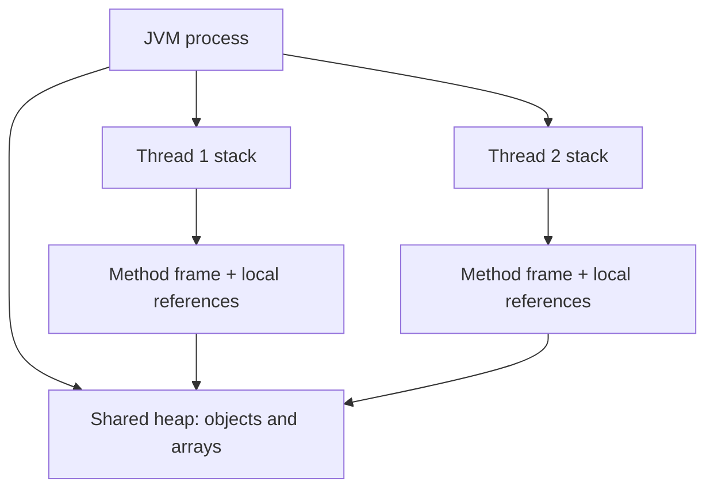

## Example

```java
public void execute() {
    int attempt = 1;
    Workflow workflow = new Workflow("wf-1");
}
```

Conceptually:

- `attempt` is a primitive local in the method frame.
- `workflow` is a local reference in the stack frame.
- The `Workflow` object is on the heap.

Actual JVM optimizations may change physical allocation details, but this is the correct conceptual model for interviews.

## Comparison

| Concern | Stack | Heap |
|---|---|---|
| Ownership | One per thread | Shared by process threads |
| Stores | Frames, local variables, call state | Objects and arrays |
| Lifecycle | Frame removed when method returns | Managed by GC reachability |
| Speed | Generally fast structured allocation | More complex management |
| Common failure | `StackOverflowError` | `OutOfMemoryError` |

## Examples of failure

Infinite recursion:

```java
void recurse() {
    recurse();
}
```

Can cause `StackOverflowError`.

Retaining too many objects:

```java
List<byte[]> retained = new ArrayList<>();
while (true) {
    retained.add(new byte[1_000_000]);
}
```

Can cause `OutOfMemoryError`.

---

# Q089. What Is a Memory Leak in Java?

## Interview answer

> A Java memory leak occurs when objects are no longer useful to the application but remain reachable, so the garbage collector cannot reclaim them. GC prevents forgotten manual deallocation, but it cannot determine whether reachable data is logically unnecessary.

## Leak example

```java
public final class ExecutionCache {
    private static final Map<String, ExecutionResult> RESULTS =
        new HashMap<>();

    public static void store(
            String executionId,
            ExecutionResult result) {
        RESULTS.put(executionId, result);
    }
}
```

If entries are never removed, the static map retains every result indefinitely.

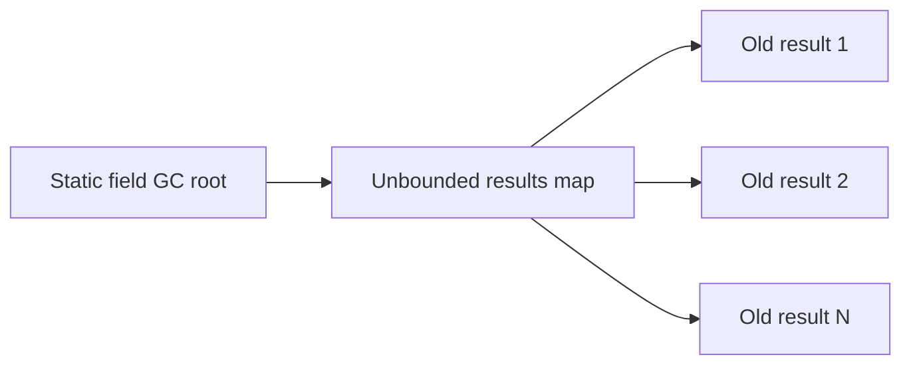

## Common causes

- Unbounded caches and collections.
- Event listeners never deregistered.
- Thread-local values not removed in pooled threads.
- Long-lived tasks retaining large object graphs.
- Static references.
- Incorrect `equals()`/`hashCode()` causing unexpected map growth.
- Open external resources, which are resource leaks even if not heap leaks.

## Bounded cache example

```java
Map<String, ExecutionResult> cache =
    Collections.synchronizedMap(
        new LinkedHashMap<>(100, 0.75f, true) {
            @Override
            protected boolean removeEldestEntry(
                    Map.Entry<String, ExecutionResult> eldest) {
                return size() > 1_000;
            }
        }
    );
```

In production, use a robust cache library or distributed cache with size and expiry policies.

## Diagnosis

- Observe steadily growing heap after full GC.
- Capture a heap dump.
- Inspect dominator trees and retained size.
- Use Java Flight Recorder, VisualVM, Eclipse MAT, or profiler tooling.
- Reproduce under load.

## Project connection

AcadAI limits conversation memory in its current implementation. That is the correct principle: long-lived services must bound histories, caches, and retained results.

---

# Q090. What Is Reflection in Java?

## Interview answer

> Reflection lets Java code inspect and interact with classes, methods, fields, constructors, and annotations at runtime. Frameworks use it for dependency injection, serialization, testing, and plugin discovery, but it reduces compile-time safety and can increase complexity.

## Example

```java
Class<?> type = Class.forName(
    "com.example.workflow.HttpNode"
);

for (Method method : type.getDeclaredMethods()) {
    System.out.println(method.getName());
}
```

Runtime creation:

```java
Constructor<?> constructor =
    type.getDeclaredConstructor(String.class);

Object node = constructor.newInstance("node-1");
```

## Plugin discovery example

```java
@Retention(RetentionPolicy.RUNTIME)
@Target(ElementType.TYPE)
public @interface WorkflowPlugin {
    NodeType value();
}
```

```java
@WorkflowPlugin(NodeType.SLACK)
public final class SlackExecutor implements NodeExecutor {
}
```

A registry can scan classes and register annotated executors.

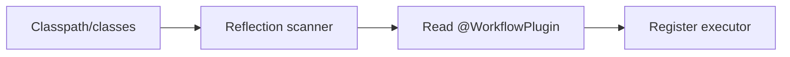

## Benefits

- Runtime framework behavior.
- Generic tooling.
- Plugin architectures.
- Annotation processing at runtime.

## Risks

- Errors shift from compile time to runtime.
- Refactoring becomes less transparent.
- Access-control bypass may be attempted.
- Performance overhead, though often not the main issue.
- Native-image/AOT environments may require explicit reflection configuration.

## Production rule

Prefer normal typed calls when possible. Use reflection at framework boundaries where dynamic behavior provides clear value.

---

# Q091. What Are Generics in Java?

## Interview answer

> Generics let classes, interfaces, and methods operate on parameterized types while preserving compile-time type safety. They reduce casts and allow reusable algorithms and containers.

## Without generics

```java
List values = new ArrayList();
values.add("workflow");

String value = (String) values.get(0);
```

This permits unrelated types and requires casts.

## With generics

```java
List<String> values = new ArrayList<>();
values.add("workflow");

String value = values.get(0);
```

The compiler prevents invalid insertion.

## Generic class

```java
public final class Result<T> {
    private final T value;
    private final String error;

    private Result(T value, String error) {
        this.value = value;
        this.error = error;
    }

    public static <T> Result<T> success(T value) {
        return new Result<>(value, null);
    }

    public static <T> Result<T> failure(String error) {
        return new Result<>(null, error);
    }
}
```

Usage:

```java
Result<ExecutionResult> result =
    Result.success(executionResult);
```

## Generic method

```java
public static <T> T requirePresent(
        Optional<T> optional,
        Supplier<? extends RuntimeException> error) {
    return optional.orElseThrow(error);
}
```

## Type erasure

Java generics are mostly implemented through type erasure:

```text
Generic type information helps at compile time.
Much of it is erased from runtime representation.
```

Consequences:

- Cannot use primitive type arguments such as `List<int>`.
- Cannot directly create `new T()`.
- Cannot create generic arrays such as `new T[10]`.
- `List<String>` and `List<Integer>` have the same raw runtime class.

## Project connection

A workflow engine can use `Result<NodeOutput>`, `Repository<Workflow>`, and typed executor contracts to reuse infrastructure without losing type safety.

---

# Q092. What Is a Wildcard in Generics: `?`, `? extends`, and `? super`?

## Interview answer

> A wildcard represents an unknown generic type. `? extends T` is useful when reading values as `T`, while `? super T` is useful when writing `T` values. The memory rule is PECS: Producer Extends, Consumer Super.

## Unbounded wildcard

```java
public void printAll(List<?> values) {
    for (Object value : values) {
        System.out.println(value);
    }
}
```

The exact element type is unknown. You can safely read as `Object`, but cannot add arbitrary non-null values.

## `? extends T`

```java
public int totalNodeCount(
        List<? extends Workflow> workflows) {
    return workflows.stream()
        .mapToInt(workflow -> workflow.nodes().size())
        .sum();
}
```

It can accept `List<Workflow>` or lists of workflow subtypes.

You generally cannot add a `Workflow` because the actual list might be `List<SpecialWorkflow>`.

## `? super T`

```java
public void addDefaultNode(
        List<? super WorkflowNode> nodes,
        WorkflowNode defaultNode) {
    nodes.add(defaultNode);
}
```

The list can consume `WorkflowNode` values.

## PECS

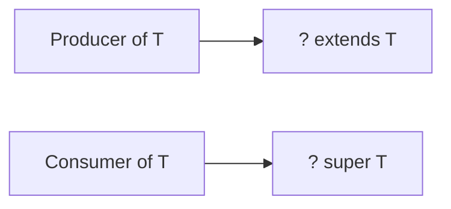

## Invariance

This is invalid:

```java
// List<Object> values = new ArrayList<String>();
```

If it were allowed, callers could insert an `Integer` into a string list.

## Example method

```java
public static <T> void copy(
        List<? extends T> source,
        List<? super T> destination) {
    for (T value : source) {
        destination.add(value);
    }
}
```

Source produces `T`; destination consumes `T`.

---

# Q093. What Are Serialization and Deserialization?

## Interview answer

> Serialization converts an object's state into a transferable or storable representation. Deserialization reconstructs an object or data structure from that representation. Java has native object serialization, but modern applications often prefer explicit formats such as JSON, Avro, or Protocol Buffers.

## Native Java serialization

```java
public final class WorkflowSnapshot implements Serializable {
    private static final long serialVersionUID = 1L;

    private final String id;
    private final List<String> nodeIds;

    public WorkflowSnapshot(String id, List<String> nodeIds) {
        this.id = id;
        this.nodeIds = List.copyOf(nodeIds);
    }
}
```

Serialize:

```java
try (ObjectOutputStream output =
         new ObjectOutputStream(
             Files.newOutputStream(path))) {
    output.writeObject(snapshot);
}
```

Deserialize:

```java
try (ObjectInputStream input =
         new ObjectInputStream(
             Files.newInputStream(path))) {
    WorkflowSnapshot snapshot =
        (WorkflowSnapshot) input.readObject();
}
```

## Flow

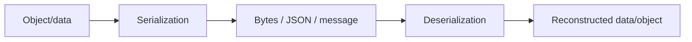

## Uses

- API request/response payloads.
- Queue messages.
- Cache values.
- Persisted snapshots.
- Remote communication.

## Security warning

Never deserialize untrusted native Java serialized data without strong controls. Deserialization can trigger dangerous object behavior and has historically caused severe vulnerabilities.

## Better distributed-system approach

Use explicit DTOs and versioned schemas:

```java
public record ExecuteWorkflowMessage(
    String version,
    String workflowId,
    String executionId
) {
}
```

## Project connection

Nodeflowz sends execution-event data to Inngest, while CommentPulse sends JSON job messages through Redis. These are serialization boundaries, even though they do not use native Java serialization.

---

# Q094. What Is the `transient` Keyword?

## Interview answer

> `transient` marks an instance field so native Java serialization does not include it in the serialized object state. It is commonly used for derived, non-serializable, or sensitive fields, but it is not a complete security mechanism.

## Example

```java
public final class ProviderCredential implements Serializable {
    private static final long serialVersionUID = 1L;

    private final String credentialId;
    private transient String decryptedApiKey;

    public ProviderCredential(
            String credentialId,
            String decryptedApiKey) {
        this.credentialId = credentialId;
        this.decryptedApiKey = decryptedApiKey;
    }
}
```

After native deserialization, `decryptedApiKey` receives its default value, normally `null`.

## Common uses

- Cached/derived data.
- Runtime-only collaborators.
- Non-serializable resources.
- Sensitive values that should not enter native serialized form.

## Important limitations

- `transient` applies to native Java serialization behavior.
- JSON libraries may ignore it or apply different rules.
- It does not encrypt data.
- It does not remove values already logged or copied elsewhere.
- Static fields are not serialized as instance state anyway.

## Better security design

Do not serialize raw secrets in the first place. Store a credential reference and retrieve/decrypt secrets only at the controlled execution boundary.

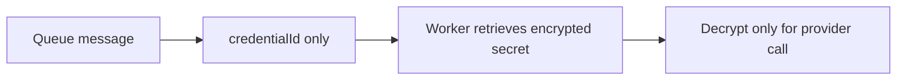

## Project connection

Nodeflowz stores encrypted credentials and passes references through workflow data. That is safer than serializing decrypted API keys into execution events.

---

# Q095. What Is a Design Pattern? Name a Few

## Interview answer

> A design pattern is a reusable, named solution structure for a recurring software-design problem. It is not copy-paste code; it describes roles, relationships, and tradeoffs that can guide an implementation.

## Main categories

| Category | Purpose | Examples |
|---|---|---|
| Creational | Control object creation | Singleton, Factory, Builder, Prototype |
| Structural | Compose classes and objects | Adapter, Decorator, Facade, Proxy |
| Behavioral | Coordinate responsibilities and behavior | Observer, Strategy, Command, State |

## Workflow examples

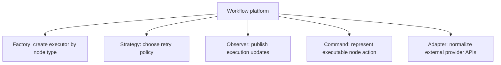

## Why patterns help

- Provide shared vocabulary.
- Capture known tradeoffs.
- Improve replaceability and testability.
- Prevent repeatedly inventing the same structure.

## Pattern misuse

Do not add patterns merely to sound sophisticated:

```text
Problem first -> simplest clear design -> pattern when it genuinely fits
```

Overusing patterns can create unnecessary classes, indirection, and maintenance cost.

---

# Q096. Explain the Singleton Design Pattern

## Interview answer

> Singleton ensures a class has one accessible instance within a class-loader scope. In Java, an enum singleton is simple and safe for serialization and reflection concerns, but dependency injection and explicit lifecycle management are often better for application services.

## Enum singleton

```java
public enum MetricsRegistry {
    INSTANCE;

    private final ConcurrentHashMap<String, LongAdder> counters =
        new ConcurrentHashMap<>();

    public void increment(String name) {
        counters.computeIfAbsent(
            name,
            ignored -> new LongAdder()
        ).increment();
    }
}
```

Usage:

```java
MetricsRegistry.INSTANCE.increment("workflow.success");
```

## Initialization-on-demand holder

```java
public final class ProviderRegistry {
    private ProviderRegistry() {
    }

    private static class Holder {
        private static final ProviderRegistry INSTANCE =
            new ProviderRegistry();
    }

    public static ProviderRegistry getInstance() {
        return Holder.INSTANCE;
    }
}
```

This provides lazy, thread-safe JVM class initialization.

## Risks

- Hidden global state.
- Harder unit testing.
- Tight coupling.
- Lifecycle is difficult to control.
- "One instance" is only per class loader/process, not globally across distributed servers.

## Distributed-system nuance

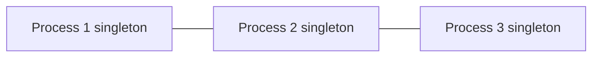

A singleton does not ensure one leader across multiple instances. Distributed coordination requires mechanisms such as database locks, leases, or consensus systems.

## Project connection

A shared Prisma client or metrics registry may behave like a process-level singleton. Still, application services should usually be injected to keep dependencies testable.

---

# Q097. Explain the Factory Design Pattern

## Interview answer

> Factory centralizes object-creation decisions and returns objects through a common abstraction. The caller asks for a capability without knowing the concrete class or construction details.

## Workflow executor factory

```java
public interface NodeExecutor {
    NodeResult execute(ExecutionContext context);
}

public final class NodeExecutorFactory {
    private final HttpClient httpClient;
    private final SlackClient slackClient;

    public NodeExecutorFactory(
            HttpClient httpClient,
            SlackClient slackClient) {
        this.httpClient = httpClient;
        this.slackClient = slackClient;
    }

    public NodeExecutor create(NodeType type) {
        return switch (type) {
            case HTTP -> new HttpExecutor(httpClient);
            case SLACK -> new SlackExecutor(slackClient);
            default -> throw new IllegalArgumentException(
                "Unsupported node type: " + type
            );
        };
    }
}
```

## Flow

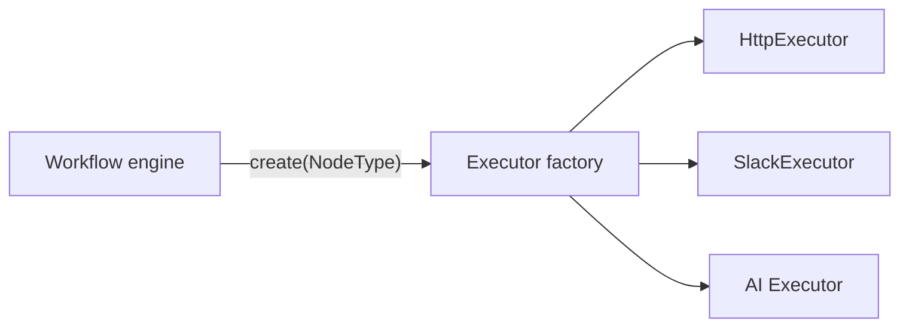

## Benefits

- Centralizes construction.
- Hides implementation details.
- Returns a common type.
- Makes callers less coupled to concrete classes.

## Limitation

A large switch-based factory must change whenever a type is added. A registry-based factory can be more extensible:

```java
Map<NodeType, Supplier<NodeExecutor>> creators =
    Map.of(
        NodeType.HTTP, () -> new HttpExecutor(httpClient),
        NodeType.SLACK, () -> new SlackExecutor(slackClient)
    );
```

## Project connection

Nodeflowz has an executor registry that selects behavior by node type. That serves the same creation/selection purpose as a factory-style design.

---

# Q098. Explain the Observer Design Pattern

## Interview answer

> Observer defines a one-to-many relationship where subscribers are notified when a subject's state changes. It decouples the event producer from the consumers, but requires careful handling of delivery, ordering, failures, and subscriber lifecycle.

## Example

```java
public interface ExecutionObserver {
    void onStatusChanged(
        String executionId,
        ExecutionStatus status
    );
}

public final class ExecutionPublisher {
    private final List<ExecutionObserver> observers =
        new CopyOnWriteArrayList<>();

    public void subscribe(ExecutionObserver observer) {
        observers.add(observer);
    }

    public void unsubscribe(ExecutionObserver observer) {
        observers.remove(observer);
    }

    public void publish(
            String executionId,
            ExecutionStatus status) {
        observers.forEach(observer ->
            observer.onStatusChanged(executionId, status)
        );
    }
}
```

## Diagram

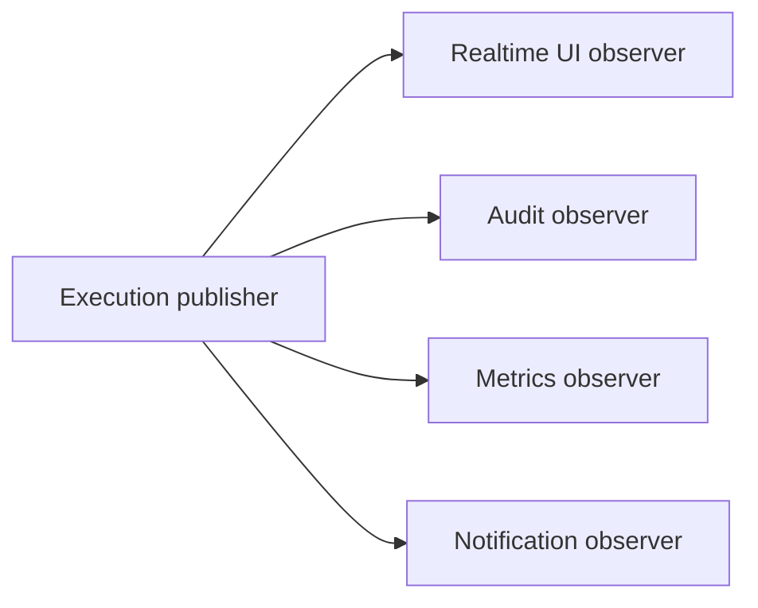

## Benefits

- Publisher does not know concrete subscriber behavior.
- New subscribers can be added independently.
- Suitable for UI updates, events, and monitoring.

## Risks

- Subscriber exceptions can disrupt synchronous publication.
- Forgotten subscriptions can cause memory leaks.
- Ordering may be unclear.
- Slow observers can block the publisher.
- In-memory observers lose events on process failure.

## Production event systems

For durable, distributed events, use a message broker/event bus rather than only in-memory observers.

## Project connection

Nodeflowz publishes real-time node execution status to the UI. That is observer-like behavior: execution changes are produced once and consumed by interested subscribers.

---

# Q099. What Is Dependency Injection?

## Interview answer

> Dependency injection supplies an object's required collaborators from outside instead of letting the object construct them internally. It reduces coupling, makes dependencies explicit, and improves testability and configuration.

## Tightly coupled design

```java
public final class WorkflowService {
    private final SlackClient slackClient = new SlackClient();
}
```

Problems:

- Hard to replace in tests.
- Configuration is hidden.
- Service controls collaborator lifecycle.

## Constructor injection

```java
public final class WorkflowService {
    private final WorkflowRepository repository;
    private final NotificationService notifications;

    public WorkflowService(
            WorkflowRepository repository,
            NotificationService notifications) {
        this.repository = Objects.requireNonNull(repository);
        this.notifications = Objects.requireNonNull(notifications);
    }
}
```

Production wiring:

```java
WorkflowService service = new WorkflowService(
    new PostgresWorkflowRepository(dataSource),
    new SlackNotificationService(slackClient)
);
```

Test wiring:

```java
WorkflowService service = new WorkflowService(
    new InMemoryWorkflowRepository(),
    new RecordingNotificationService()
);
```

## Diagram

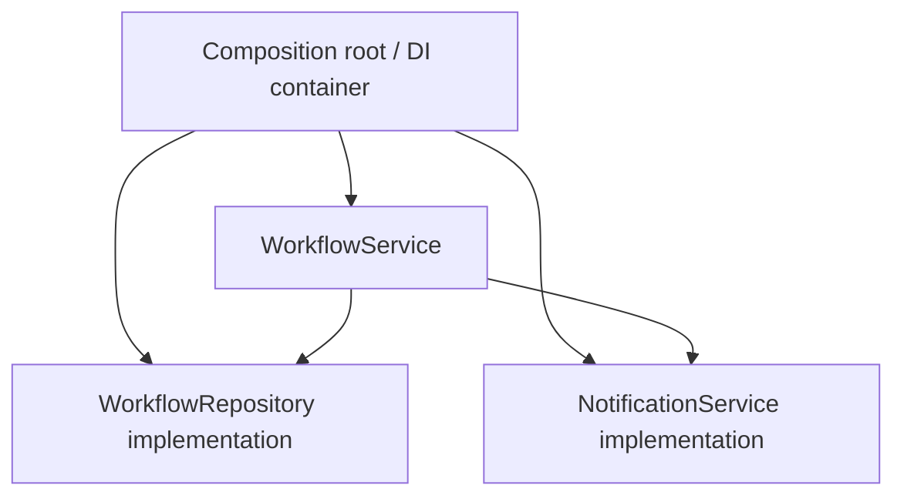

## Injection styles

| Style | Guidance |
|---|---|
| Constructor injection | Preferred for required dependencies |
| Setter injection | Useful for genuinely optional dependencies |
| Field injection | Convenient in frameworks but hides dependencies and complicates testing |

## DI vs dependency inversion

- **Dependency injection** is a technique for supplying dependencies.
- **Dependency Inversion Principle** says high-level code should depend on abstractions rather than low-level details.

They often work together but are not identical.

## Project connection

AcadAI, CommentPulse, and Nodeflowz isolate major services and clients to varying degrees. Explicit injection would make provider clients, repositories, and job backends easier to test and replace.

---

# Q100. Difference Between Shallow Copy and Deep Copy

## Interview answer

> A shallow copy creates a new outer object but shares references to nested mutable objects. A deep copy creates independent copies of the nested mutable object graph, so changes in one copy do not affect the other.

## Example model

```java
public final class Workflow {
    private String name;
    private final List<Node> nodes;

    public Workflow(String name, List<Node> nodes) {
        this.name = name;
        this.nodes = nodes;
    }
}
```

## Shallow copy

```java
Workflow copy = new Workflow(
    original.name(),
    original.nodes()
);
```

Both workflows reference the same mutable node list.

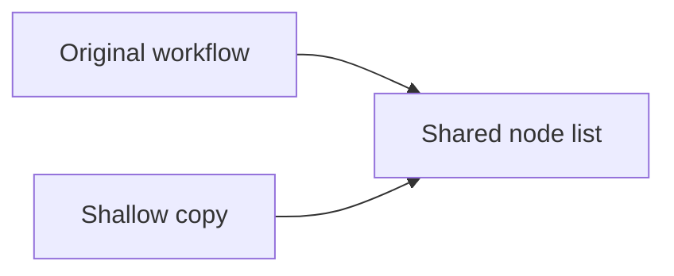

Changing the shared list through one object affects the other.

## Deep copy

```java
List<Node> copiedNodes = original.nodes().stream()
    .map(Node::deepCopy)
    .toList();

Workflow copy = new Workflow(
    original.name(),
    new ArrayList<>(copiedNodes)
);
```

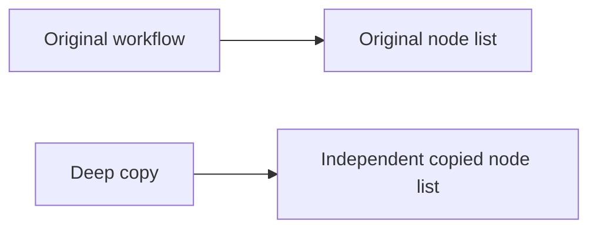

## Copy constructor

```java
public Workflow(Workflow other) {
    this.name = other.name;
    this.nodes = other.nodes.stream()
        .map(Node::new)
        .collect(Collectors.toCollection(ArrayList::new));
}
```

## Immutability simplifies copying

If nested objects are immutable, sharing them can be safe:

```java
public record NodeDefinition(
    String id,
    NodeType type,
    Map<String, String> configuration
) {
    public NodeDefinition {
        configuration = Map.copyOf(configuration);
    }
}
```

## Serialization-based deep copy

Deep copying through serialization is often slow, fragile, and risky. Prefer explicit copy logic, immutable models, or mapping tools.

## Project connection

Workflow versioning requires copy semantics. A shallow copy could let edits to a draft accidentally change the published version. A deep or immutable snapshot prevents that correctness bug.

---

# Complete Advanced Java Workflow Design

```java
public interface NodeExecutor<I, O> {
    O execute(I input);
}

public final class ExecutorFactory {
    private final Map<NodeType, Supplier<NodeExecutor<?, ?>>> creators;

    public ExecutorFactory(
            Map<NodeType, Supplier<NodeExecutor<?, ?>>> creators) {
        this.creators = Map.copyOf(creators);
    }

    public NodeExecutor<?, ?> create(NodeType type) {
        Supplier<NodeExecutor<?, ?>> creator = creators.get(type);

        if (creator == null) {
            throw new IllegalArgumentException(
                "Unsupported node type: " + type
            );
        }

        return creator.get();
    }
}

public final class ExecutionPublisher {
    private final List<ExecutionObserver> observers =
        new CopyOnWriteArrayList<>();

    public void subscribe(ExecutionObserver observer) {
        observers.add(Objects.requireNonNull(observer));
    }

    public void publish(ExecutionEvent event) {
        observers.forEach(observer ->
            observer.onExecutionEvent(event)
        );
    }
}

public final class WorkflowEngine {
    private final ExecutorFactory factory;
    private final ExecutionPublisher publisher;

    public WorkflowEngine(
            ExecutorFactory factory,
            ExecutionPublisher publisher) {
        this.factory = Objects.requireNonNull(factory);
        this.publisher = Objects.requireNonNull(publisher);
    }
}
```

## Pattern relationships

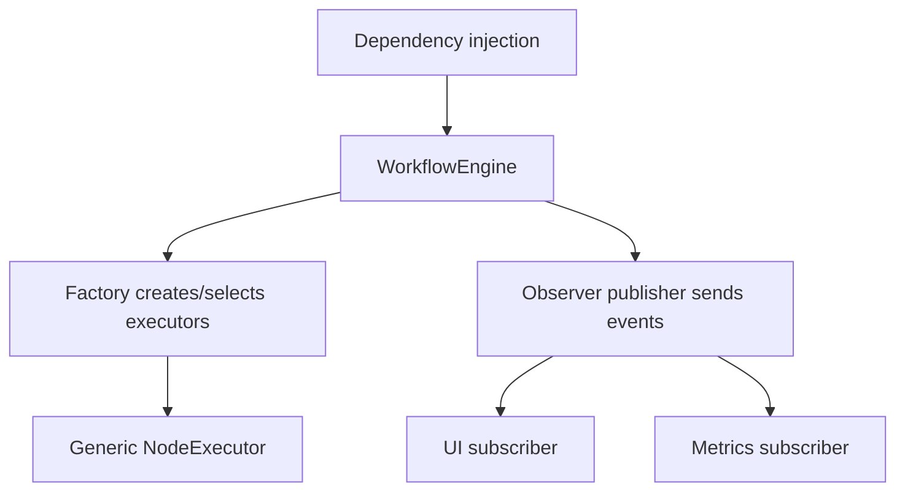

## What to explain

- Generics provide typed executor input/output contracts.
- Wildcards let the registry hold heterogeneous executors.
- Factory centralizes executor creation.
- Observer decouples execution events from subscribers.
- Constructor injection makes the engine testable.
- Bounded event/subscriber state avoids memory leaks.
- Explicit DTO serialization should be used at queue boundaries.

---

# Advanced Java Production Checklist

## Memory

- Bound caches, histories, and queues.
- Remove listeners and thread-local values.
- Close external resources explicitly.
- Profile retained objects rather than guessing.
- Tune GC only after measuring realistic workloads.

## Dynamic behavior

- Prefer typed code before reflection.
- Validate reflection-discovered plugins during startup.
- Keep runtime errors observable.
- Consider AOT/native-image reflection requirements.

## Data boundaries

- Use explicit versioned DTOs.
- Avoid deserializing untrusted native Java objects.
- Never place decrypted secrets in messages.
- Plan backward and forward schema compatibility.

## Patterns

- Apply patterns to solve actual pressure.
- Prefer dependency injection over hidden global state.
- Prefer composition and immutable snapshots.
- Consider distributed behavior, not just one JVM process.

---

# Advanced Java Revision Sheet

## Memory lines

| Question | Memory line |
|---|---|
| Garbage collection | Reclaims unreachable heap objects from GC-root reachability |
| GC algorithms | Mark, sweep, compact, copy, and generational strategies |
| Stack vs heap | Per-thread call frames vs shared GC-managed objects |
| Memory leak | Unneeded but still reachable objects |
| Reflection | Runtime inspection/invocation with flexibility and safety tradeoffs |
| Generics | Reusable compile-time type safety |
| Wildcards | Unknown type; PECS: Producer Extends, Consumer Super |
| Serialization | Convert data/object state to transferable form and back |
| `transient` | Exclude field from native Java serialized instance state |
| Design pattern | Named reusable design structure and tradeoff |
| Singleton | One instance per class-loader scope; beware global state |
| Factory | Centralized creation behind an abstraction |
| Observer | Notify many subscribers of state/events |
| Dependency injection | Supply collaborators externally |
| Shallow vs deep copy | Shared nested references vs independent nested copies |

## Common interview traps

- Saying GC prevents every memory leak.
- Treating `System.gc()` as a guaranteed collection command.
- Saying every local variable is physically always on the stack.
- Using reflection where normal polymorphism is clearer.
- Forgetting Java generic type erasure.
- Confusing `? extends` and `? super`.
- Deserializing untrusted native Java objects.
- Treating `transient` as encryption.
- Calling a per-process singleton globally unique in a distributed system.
- Applying patterns without a real problem.
- Confusing dependency injection with the Dependency Inversion Principle.
- Calling a new outer object with shared nested state a deep copy.

## Forty-second answer template

```text
"X means ___. Internally, Java handles it through ___. In a workflow platform,
I would use it for ___. The main risk is ___, so I would mitigate it by ___."
```
