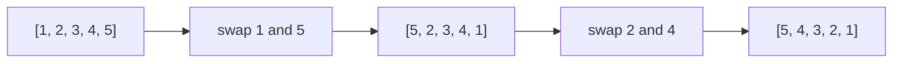
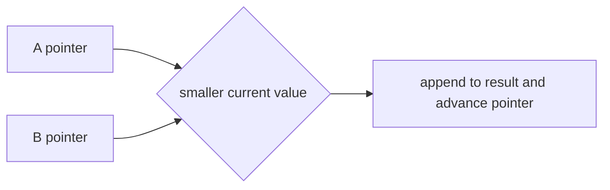
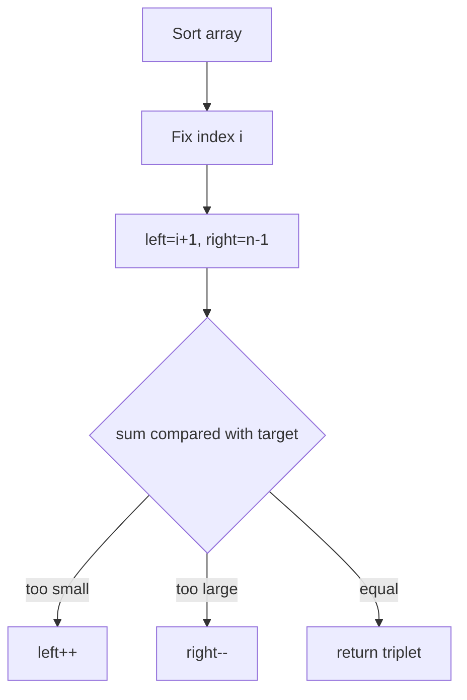
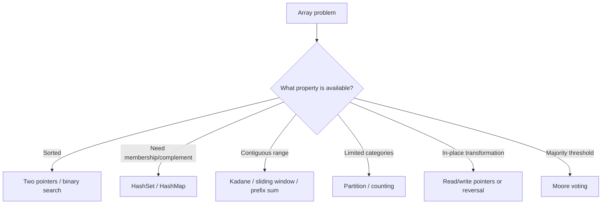

# Caelius Interview Preparation

## DSA Arrays (Q101-Q120)

For every coding problem, speak in this order:

```text
State -> Clarify -> Approach -> Code -> Complexity -> Optimize/Test
```

Before coding, confirm assumptions such as:

- Can the input be empty or `null`?
- May values be negative?
- Are duplicates allowed?
- Must the input be modified in place?
- Is extra space allowed?
- Should the method return indices, values, or a count?
- Can integer arithmetic overflow?

---

# Q101. Reverse an Array In Place

## State

> I understand that I need to reverse the existing array without creating another array. The element at index `0` should swap with the last element, index `1` with the second-last, and so on.

## Clarify

- Should a `null` array be ignored or rejected?
- Empty and single-element arrays are already reversed.

## Approach

Use two pointers:

```text
left starts at 0
right starts at n - 1
swap while left < right
```



## Code

```java
public static void reverse(int[] values) {
    if (values == null) {
        throw new IllegalArgumentException("Array cannot be null");
    }

    int left = 0;
    int right = values.length - 1;

    while (left < right) {
        int temporary = values[left];
        values[left] = values[right];
        values[right] = temporary;

        left++;
        right--;
    }
}
```

## Complexity

- Time: `O(n)`
- Extra space: `O(1)`

## Optimize/Test

This is asymptotically optimal because every element must be considered. Test:

```text
[]
[1]
[1, 2]
[1, 2, 3, 4, 5]
```

---

# Q102. Find the Largest Element in an Array

## State

> I need to return the maximum value in the array. I will scan once while maintaining the largest value seen so far.

## Clarify

- What should happen for an empty array? I will reject it because no maximum exists.
- Values may be negative, so I should not initialize the maximum to zero.

## Approach

Initialize the maximum with the first element, then compare every remaining element.

## Code

```java
public static int largest(int[] values) {
    if (values == null || values.length == 0) {
        throw new IllegalArgumentException(
            "Array must contain at least one value"
        );
    }

    int maximum = values[0];

    for (int index = 1; index < values.length; index++) {
        maximum = Math.max(maximum, values[index]);
    }

    return maximum;
}
```

## Complexity

- Time: `O(n)`
- Extra space: `O(1)`

## Optimize/Test

The scan is optimal because an unseen element could always be the maximum. Important test:

```text
[-9, -4, -12] -> -4
```

Do not initialize `maximum = 0`, which fails for all-negative arrays.

---

# Q103. Find the Second Largest Element

## State

> I will find the second-largest distinct value in one pass. If the array has fewer than two distinct values, I will return an empty result.

## Clarify

- Does "second largest" mean distinct? I will assume yes.
- I will use `OptionalInt` when no second-largest distinct value exists.

## Approach

Maintain:

- `largest`
- `secondLargest`

When a new largest appears, move the old largest into second-largest. Otherwise, update second-largest only if the value is distinct and lies between them.

## Code

```java
public static OptionalInt secondLargestDistinct(int[] values) {
    if (values == null || values.length < 2) {
        return OptionalInt.empty();
    }

    Integer largest = null;
    Integer secondLargest = null;

    for (int value : values) {
        if (largest == null || value > largest) {
            secondLargest = largest;
            largest = value;
        } else if (
            value != largest &&
            (secondLargest == null || value > secondLargest)
        ) {
            secondLargest = value;
        }
    }

    return secondLargest == null
        ? OptionalInt.empty()
        : OptionalInt.of(secondLargest);
}
```

## Complexity

- Time: `O(n)`
- Extra space: `O(1)`

## Alternative

Sorting gives `O(n log n)` time and may modify the input. The one-pass solution is better.

## Test

```text
[5, 5, 4] -> 4
[5, 5] -> empty
[-2, -7, -3] -> -3
```

---

# Q104. Find Duplicate Elements in an Array

## State

> I need to identify values that appear more than once. I will return each duplicated value once.

## Clarify

- Should duplicate values appear once or according to frequency? I will return them once.
- Is extra space allowed? I will first use hash sets.

## Approach

Maintain:

- `seen`: values encountered before.
- `duplicates`: values whose insertion into `seen` failed.

Use `LinkedHashSet` for duplicates if predictable discovery order is useful.

## Code

```java
public static Set<Integer> findDuplicates(int[] values) {
    if (values == null) {
        throw new IllegalArgumentException("Array cannot be null");
    }

    Set<Integer> seen = new HashSet<>();
    Set<Integer> duplicates = new LinkedHashSet<>();

    for (int value : values) {
        if (!seen.add(value)) {
            duplicates.add(value);
        }
    }

    return duplicates;
}
```

## Complexity

- Expected time: `O(n)`
- Extra space: `O(n)`

## Optimize

If mutation is allowed, sort and compare adjacent values:

- Time: `O(n log n)`
- Extra space: depends on sort

If values are restricted to `1..n`, in-place marking techniques may achieve `O(1)` extra space, but they modify the array and require strict constraints.

---

# Q105. Remove Duplicates From a Sorted Array

## State

> Because the array is sorted, duplicates are adjacent. I will compact unique values at the front in place and return the number of unique values.

## Clarify

- The elements after the returned unique length do not matter.
- An empty array returns `0`.

## Approach

Use:

- `read` pointer to scan.
- `write` pointer for the next unique position.

Invariant:

```text
values[0 .. write - 1] contains unique sorted values.
```

## Code

```java
public static int removeDuplicatesSorted(int[] values) {
    if (values == null) {
        throw new IllegalArgumentException("Array cannot be null");
    }

    if (values.length == 0) {
        return 0;
    }

    int write = 1;

    for (int read = 1; read < values.length; read++) {
        if (values[read] != values[write - 1]) {
            values[write] = values[read];
            write++;
        }
    }

    return write;
}
```

## Example

```text
Input:  [1, 1, 2, 2, 3]
Output length: 3
Valid prefix: [1, 2, 3]
```

## Complexity

- Time: `O(n)`
- Extra space: `O(1)`

## Optimize

This is optimal for in-place compaction. If the input were unsorted, sorting or a set would be required.

---

# Q106. Check if an Array Is Sorted

## State

> I will check whether the array is sorted in non-decreasing order by ensuring every element is at least the previous element.

## Clarify

- I assume ascending non-decreasing order, so duplicates are allowed.
- Empty and single-element arrays are sorted.

## Code

```java
public static boolean isSortedAscending(int[] values) {
    if (values == null) {
        throw new IllegalArgumentException("Array cannot be null");
    }

    for (int index = 1; index < values.length; index++) {
        if (values[index] < values[index - 1]) {
            return false;
        }
    }

    return true;
}
```

## Complexity

- Worst-case time: `O(n)`
- Best-case time: `O(1)` if an early inversion is found
- Extra space: `O(1)`

## Follow-up

For strictly increasing order, change:

```java
values[index] < values[index - 1]
```

To:

```java
values[index] <= values[index - 1]
```

---

# Q107. Rotate an Array by K Positions Left and Right

## State

> I need to rotate the array in place by `k` positions. I will normalize `k` and use the reversal algorithm for `O(n)` time and `O(1)` extra space.

## Clarify

- `k` may exceed the array length.
- I will support non-negative `k`.
- Empty arrays require no operation.

## Right-rotation approach

For right rotation by `k`:

1. Reverse entire array.
2. Reverse first `k` elements.
3. Reverse remaining elements.

```text
[1,2,3,4,5], k=2
reverse all       -> [5,4,3,2,1]
reverse first 2   -> [4,5,3,2,1]
reverse remaining -> [4,5,1,2,3]
```

## Code

```java
public static void rotateRight(int[] values, int k) {
    validateRotationInput(values, k);

    if (values.length == 0) {
        return;
    }

    k %= values.length;
    reverseRange(values, 0, values.length - 1);
    reverseRange(values, 0, k - 1);
    reverseRange(values, k, values.length - 1);
}

public static void rotateLeft(int[] values, int k) {
    validateRotationInput(values, k);

    if (values.length == 0) {
        return;
    }

    k %= values.length;
    reverseRange(values, 0, k - 1);
    reverseRange(values, k, values.length - 1);
    reverseRange(values, 0, values.length - 1);
}

private static void reverseRange(
        int[] values,
        int left,
        int right) {
    while (left < right) {
        int temporary = values[left];
        values[left] = values[right];
        values[right] = temporary;
        left++;
        right--;
    }
}

private static void validateRotationInput(int[] values, int k) {
    if (values == null) {
        throw new IllegalArgumentException("Array cannot be null");
    }
    if (k < 0) {
        throw new IllegalArgumentException("k cannot be negative");
    }
}
```

## Complexity

- Time: `O(n)`
- Extra space: `O(1)`

## Alternative

Using an extra array is simpler but costs `O(n)` space.

---

# Q108. Find the Missing Number in an Array Containing Values From 1 to N

## State

> The array contains distinct values from `1` to `n` with exactly one missing value. I will use XOR to avoid sum overflow and achieve constant extra space.

## Clarify

- Exactly one number is missing.
- No duplicates exist.
- If array length is `n - 1`, the expected range ends at `n = length + 1`.

## XOR idea

```text
x ^ x = 0
x ^ 0 = x
```

XOR all expected values and all actual values. Pairs cancel, leaving the missing value.

## Code

```java
public static int missingNumberOneToN(int[] values) {
    if (values == null) {
        throw new IllegalArgumentException("Array cannot be null");
    }

    int n = values.length + 1;
    int missing = 0;

    for (int expected = 1; expected <= n; expected++) {
        missing ^= expected;
    }

    for (int value : values) {
        missing ^= value;
    }

    return missing;
}
```

## Complexity

- Time: `O(n)`
- Extra space: `O(1)`

## Alternative

Mathematical sum:

```text
n(n + 1) / 2 - actual sum
```

Use `long` to reduce overflow risk. XOR avoids arithmetic overflow but assumes the input satisfies constraints.

---

# Q109. Two Sum Problem

## State

> I need to return indices of two different elements whose values add to the target. I will use a hash map to remember previously seen values and their indices.

## Clarify

- Return indices, not values.
- Assume at most one required answer.
- An element cannot be reused at the same index.

## Approach

For each value:

```text
complement = target - value
if complement was seen -> answer found
otherwise store current value and index
```

## Code

```java
public static int[] twoSum(int[] values, int target) {
    if (values == null) {
        throw new IllegalArgumentException("Array cannot be null");
    }

    Map<Integer, Integer> indexByValue = new HashMap<>();

    for (int index = 0; index < values.length; index++) {
        int complement = target - values[index];

        if (indexByValue.containsKey(complement)) {
            return new int[] {
                indexByValue.get(complement),
                index
            };
        }

        indexByValue.put(values[index], index);
    }

    return new int[0];
}
```

## Complexity

- Expected time: `O(n)`
- Extra space: `O(n)`

## Optimize/Alternative

Brute force checks every pair:

- Time: `O(n^2)`
- Space: `O(1)`

If the array is sorted and values rather than original indices are required, two pointers solve it in `O(n)` time and `O(1)` space.

## Overflow nuance

If values and target may approach integer limits, calculate the complement using `long`.

---

# Q110. Merge Two Sorted Arrays

## State

> I will merge two sorted arrays into one sorted result by comparing their current smallest unprocessed elements.

## Clarify

- I will return a new array.
- Duplicates should be preserved.

## Approach

Maintain pointers for both arrays and one pointer for the result.



## Code

```java
public static int[] mergeSorted(int[] first, int[] second) {
    if (first == null || second == null) {
        throw new IllegalArgumentException("Arrays cannot be null");
    }

    int[] merged = new int[first.length + second.length];
    int firstIndex = 0;
    int secondIndex = 0;
    int write = 0;

    while (
        firstIndex < first.length &&
        secondIndex < second.length
    ) {
        if (first[firstIndex] <= second[secondIndex]) {
            merged[write++] = first[firstIndex++];
        } else {
            merged[write++] = second[secondIndex++];
        }
    }

    while (firstIndex < first.length) {
        merged[write++] = first[firstIndex++];
    }

    while (secondIndex < second.length) {
        merged[write++] = second[secondIndex++];
    }

    return merged;
}
```

## Complexity

- Time: `O(n + m)`
- Extra space: `O(n + m)` for the result

## Follow-up: Merge Into First Array

If the first array has enough trailing capacity, merge backward from the largest values to avoid overwriting unprocessed values. That uses `O(1)` extra space.

---

# Q111. Move All Zeros to the End

## State

> I will move zeros to the end in place while preserving the relative order of non-zero elements.

## Clarify

- Stable ordering of non-zero values is required.
- Input should be modified in place.

## Approach

Use `write` to mark the next position for a non-zero value. When a non-zero value is found, swap it into the write position.

## Code

```java
public static void moveZerosToEnd(int[] values) {
    if (values == null) {
        throw new IllegalArgumentException("Array cannot be null");
    }

    int write = 0;

    for (int read = 0; read < values.length; read++) {
        if (values[read] != 0) {
            int temporary = values[write];
            values[write] = values[read];
            values[read] = temporary;
            write++;
        }
    }
}
```

## Example

```text
[0, 1, 0, 3, 12] -> [1, 3, 12, 0, 0]
```

## Complexity

- Time: `O(n)`
- Extra space: `O(1)`

## Optimize

The solution is optimal. A variant can overwrite non-zero values first and then fill remaining positions with zero, which may perform fewer writes in some cases.

---

# Q112. Find the Intersection of Two Arrays

## State

> I will return the distinct values present in both arrays. I will use a set for membership and another set to avoid duplicate output.

## Clarify

- I assume distinct intersection, not multiset intersection.
- Output order is not required; I can use `LinkedHashSet` if discovery order matters.

## Code

```java
public static Set<Integer> intersection(
        int[] first,
        int[] second) {
    if (first == null || second == null) {
        throw new IllegalArgumentException("Arrays cannot be null");
    }

    Set<Integer> firstValues = new HashSet<>();
    for (int value : first) {
        firstValues.add(value);
    }

    Set<Integer> result = new LinkedHashSet<>();
    for (int value : second) {
        if (firstValues.contains(value)) {
            result.add(value);
        }
    }

    return result;
}
```

## Complexity

- Expected time: `O(n + m)`
- Extra space: `O(n + min(n, m))`

## Alternative

If both arrays are sorted, use two pointers:

- Time: `O(n + m)`
- Extra space beyond output: `O(1)`

If arrays are unsorted and mutation is allowed, sort first, then use two pointers.

---

# Q113. Find the Union of Two Arrays

## State

> I will return all distinct values appearing in either array. A set naturally enforces uniqueness.

## Code

```java
public static Set<Integer> union(
        int[] first,
        int[] second) {
    if (first == null || second == null) {
        throw new IllegalArgumentException("Arrays cannot be null");
    }

    Set<Integer> result = new LinkedHashSet<>();

    for (int value : first) {
        result.add(value);
    }

    for (int value : second) {
        result.add(value);
    }

    return result;
}
```

## Complexity

- Expected time: `O(n + m)`
- Extra space: `O(u)`, where `u` is distinct union size

## Alternative

For sorted arrays, use two pointers to produce a sorted union without a hash set:

- Time: `O(n + m)`
- Extra space: output only

## Follow-up

For very large distributed datasets, exact set union may require partitioning or external storage. Approximate cardinality structures such as HyperLogLog estimate union size but do not return the values.

---

# Q114. Count Occurrences of an Element

## State

> I need to count how many times the target appears. For an unsorted array, I will scan once. If the array is sorted, I can use binary search to find its first and last positions.

## Unsorted-array code

```java
public static int countOccurrences(int[] values, int target) {
    if (values == null) {
        throw new IllegalArgumentException("Array cannot be null");
    }

    int count = 0;

    for (int value : values) {
        if (value == target) {
            count++;
        }
    }

    return count;
}
```

## Complexity

- Time: `O(n)`
- Extra space: `O(1)`

## Sorted-array optimization

```java
public static int countOccurrencesSorted(
        int[] values,
        int target) {
    int first = firstPosition(values, target);

    if (first == -1) {
        return 0;
    }

    int last = lastPosition(values, target);
    return last - first + 1;
}
```

Using two binary searches:

- Time: `O(log n)`
- Extra space: `O(1)`

Use the optimization only when the sorted precondition is guaranteed.

---

# Q115. Find the Contiguous Subarray With Maximum Sum: Kadane's Algorithm

## State

> I need the maximum sum of any non-empty contiguous subarray. I will use Kadane's algorithm, which decides at each element whether to extend the current subarray or start a new one.

## Core recurrence

```text
current = max(value, current + value)
best = max(best, current)
```

## Code

```java
public static long maximumSubarraySum(int[] values) {
    if (values == null || values.length == 0) {
        throw new IllegalArgumentException(
            "Array must contain at least one value"
        );
    }

    long current = values[0];
    long best = values[0];

    for (int index = 1; index < values.length; index++) {
        current = Math.max(
            values[index],
            current + values[index]
        );
        best = Math.max(best, current);
    }

    return best;
}
```

## Example

```text
[-2, 1, -3, 4, -1, 2, 1, -5, 4]
Best subarray: [4, -1, 2, 1]
Maximum sum: 6
```

## Complexity

- Time: `O(n)`
- Extra space: `O(1)`

## Important edge case

Initialize from the first element, not zero. Otherwise, an all-negative array incorrectly returns zero.

## Follow-up

To return start/end indices, track the candidate start whenever a new subarray begins and save it whenever `best` improves.

---

# Q116. Find the Majority Element: Moore's Voting Algorithm

## State

> A majority element appears more than `n / 2` times. I will use Moore's Voting Algorithm to find a candidate in one pass and then verify it in a second pass if existence is not guaranteed.

## Why cancellation works

Pairing each majority occurrence with a different value still leaves the majority candidate unmatched.

## Code

```java
public static OptionalInt majorityElement(int[] values) {
    if (values == null || values.length == 0) {
        return OptionalInt.empty();
    }

    int candidate = 0;
    int votes = 0;

    for (int value : values) {
        if (votes == 0) {
            candidate = value;
        }

        votes += value == candidate ? 1 : -1;
    }

    int occurrences = 0;
    for (int value : values) {
        if (value == candidate) {
            occurrences++;
        }
    }

    return occurrences > values.length / 2
        ? OptionalInt.of(candidate)
        : OptionalInt.empty();
}
```

## Complexity

- Time: `O(n)`
- Extra space: `O(1)`

## Important nuance

The first pass only finds a candidate. Verification is necessary unless the problem guarantees a majority exists.

## Follow-up

For elements appearing more than `n / 3` times, there can be at most two candidates. Extend the voting method to maintain two candidates and verify both.

---

# Q117. Sort an Array of 0s, 1s, and 2s: Dutch National Flag

## State

> The array contains only `0`, `1`, and `2`. I will partition it in one pass using three pointers: low, current, and high.

## Invariant

```text
[0 .. low-1]       -> 0s
[low .. current-1] -> 1s
[current .. high]  -> unknown
[high+1 .. n-1]    -> 2s
```

## Code

```java
public static void sortZeroOneTwo(int[] values) {
    if (values == null) {
        throw new IllegalArgumentException("Array cannot be null");
    }

    int low = 0;
    int current = 0;
    int high = values.length - 1;

    while (current <= high) {
        switch (values[current]) {
            case 0 -> {
                swap(values, low, current);
                low++;
                current++;
            }
            case 1 -> current++;
            case 2 -> {
                swap(values, current, high);
                high--;
            }
            default -> throw new IllegalArgumentException(
                "Array may contain only 0, 1, and 2"
            );
        }
    }
}

private static void swap(int[] values, int first, int second) {
    int temporary = values[first];
    values[first] = values[second];
    values[second] = temporary;
}
```

## Why current does not advance after swapping with high

The value swapped from `high` into `current` has not been classified yet, so it must be examined.

## Complexity

- Time: `O(n)`
- Extra space: `O(1)`

## Alternative

Count the number of 0s, 1s, and 2s, then overwrite the array. It is also `O(n)` but requires two passes and loses the general partitioning insight.

---

# Q118. Find a Pair With a Given Sum

## State

> I need to determine or return a pair of values whose sum equals the target. For an unsorted array, I will use a hash set. If the array is sorted, I will use two pointers.

## Unsorted code

```java
public static Optional<IntPair> pairWithSum(
        int[] values,
        int target) {
    if (values == null) {
        throw new IllegalArgumentException("Array cannot be null");
    }

    Set<Integer> seen = new HashSet<>();

    for (int value : values) {
        int complement = target - value;

        if (seen.contains(complement)) {
            return Optional.of(
                new IntPair(complement, value)
            );
        }

        seen.add(value);
    }

    return Optional.empty();
}

public record IntPair(int first, int second) {
}
```

## Complexity

- Expected time: `O(n)`
- Extra space: `O(n)`

## Sorted optimization

```java
public static Optional<IntPair> pairWithSumSorted(
        int[] values,
        int target) {
    int left = 0;
    int right = values.length - 1;

    while (left < right) {
        long sum = (long) values[left] + values[right];

        if (sum == target) {
            return Optional.of(
                new IntPair(values[left], values[right])
            );
        }

        if (sum < target) {
            left++;
        } else {
            right--;
        }
    }

    return Optional.empty();
}
```

- Time: `O(n)`
- Extra space: `O(1)`

## Difference from Two Sum

Clarify whether the interviewer wants:

- Pair values.
- Pair indices.
- One pair.
- All unique pairs.

---

# Q119. Find a Triplet With a Given Sum

## State

> I need three distinct elements whose sum equals the target. I will sort the array, fix one element, and solve a two-sum problem on the remaining suffix with two pointers.

## Clarify

- May I modify the array? I will copy before sorting to preserve input.
- Return one triplet.

## Approach



## Code

```java
public static Optional<IntTriplet> tripletWithSum(
        int[] values,
        int target) {
    if (values == null) {
        throw new IllegalArgumentException("Array cannot be null");
    }

    int[] sorted = Arrays.copyOf(values, values.length);
    Arrays.sort(sorted);

    for (int index = 0; index < sorted.length - 2; index++) {
        int left = index + 1;
        int right = sorted.length - 1;

        while (left < right) {
            long sum =
                (long) sorted[index] +
                sorted[left] +
                sorted[right];

            if (sum == target) {
                return Optional.of(
                    new IntTriplet(
                        sorted[index],
                        sorted[left],
                        sorted[right]
                    )
                );
            }

            if (sum < target) {
                left++;
            } else {
                right--;
            }
        }
    }

    return Optional.empty();
}

public record IntTriplet(int first, int second, int third) {
}
```

## Complexity

- Sorting: `O(n log n)`
- Two-pointer searches: `O(n^2)`
- Overall time: `O(n^2)`
- Extra space: `O(n)` because input is copied

## Optimize

The brute-force solution is `O(n^3)`. The sorted two-pointer method is the standard improvement. If mutation is allowed, sort the original array to avoid the copy.

For all unique triplets, skip duplicate fixed and pointer values.

---

# Q120. Find Minimum and Maximum Using Minimum Comparisons

## State

> A normal scan uses up to `2n - 2` comparisons. I will process values in pairs: compare each pair once, then compare the smaller with the current minimum and the larger with the current maximum.

## Pairwise idea

For each pair:

1. Compare the two values.
2. Compare smaller with minimum.
3. Compare larger with maximum.

That uses three comparisons per pair instead of four.

## Code

```java
public static MinMax findMinMax(int[] values) {
    if (values == null || values.length == 0) {
        throw new IllegalArgumentException(
            "Array must contain at least one value"
        );
    }

    int minimum;
    int maximum;
    int index;

    if (values.length % 2 == 0) {
        if (values[0] < values[1]) {
            minimum = values[0];
            maximum = values[1];
        } else {
            minimum = values[1];
            maximum = values[0];
        }
        index = 2;
    } else {
        minimum = values[0];
        maximum = values[0];
        index = 1;
    }

    while (index < values.length - 1) {
        int smaller;
        int larger;

        if (values[index] < values[index + 1]) {
            smaller = values[index];
            larger = values[index + 1];
        } else {
            smaller = values[index + 1];
            larger = values[index];
        }

        if (smaller < minimum) {
            minimum = smaller;
        }

        if (larger > maximum) {
            maximum = larger;
        }

        index += 2;
    }

    return new MinMax(minimum, maximum);
}

public record MinMax(int minimum, int maximum) {
}
```

## Complexity

- Time: `O(n)`
- Extra space: `O(1)`
- Comparisons:
  - Even `n`: approximately `3n / 2 - 2`
  - Odd `n`: approximately `3(n - 1) / 2`

## Tradeoff

The ordinary scan is simpler and usually sufficient. Use the pairwise approach when minimizing comparisons is explicitly required.

---

# Reusable Array Patterns

## Pattern Map



## Two pointers

Use when:

- Array is sorted.
- Processing from both ends.
- Compacting in place.
- Reversing or partitioning.

Examples:

- Reverse array.
- Remove duplicates.
- Move zeros.
- Pair/triplet sum.

## Hashing

Use when:

- Fast membership lookup matters.
- Need complements or frequencies.
- Ordering is not the main requirement.

Examples:

- Duplicates.
- Two sum.
- Intersection and union.

## Running-state algorithms

Use when a small state summarizes the useful history:

- Kadane's algorithm.
- Moore's Voting Algorithm.
- Largest/second-largest scan.

---

# Interview Testing Checklist

For every array solution, manually test:

```text
null input, if contract discusses it
empty array
single element
two elements
all equal values
already sorted
reverse sorted
negative values
duplicates
integer overflow boundaries
answer absent
answer at beginning/end
```

## Communication example

> "Before I code, I want to confirm whether duplicates are allowed and whether I should return indices or values. I can first explain the brute-force solution, then improve it using a hash map. I will also use `long` for the sum if integer overflow is possible."

---

# DSA Arrays Revision Sheet

| Question | Optimal pattern | Time | Extra space |
|---|---|---:|---:|
| Reverse array | Two pointers | `O(n)` | `O(1)` |
| Largest | Running maximum | `O(n)` | `O(1)` |
| Second largest | Two running distinct maxima | `O(n)` | `O(1)` |
| Duplicates | Hash sets | `O(n)` expected | `O(n)` |
| Remove sorted duplicates | Read/write pointers | `O(n)` | `O(1)` |
| Check sorted | Adjacent comparison | `O(n)` | `O(1)` |
| Rotate by k | Reversal algorithm | `O(n)` | `O(1)` |
| Missing 1..n | XOR | `O(n)` | `O(1)` |
| Two sum | Hash map | `O(n)` expected | `O(n)` |
| Merge sorted arrays | Two pointers | `O(n+m)` | Output |
| Move zeros | Stable read/write pointers | `O(n)` | `O(1)` |
| Intersection | Hash set | `O(n+m)` expected | `O(n)` |
| Union | Hash set | `O(n+m)` expected | `O(u)` |
| Count occurrence | Scan / binary search if sorted | `O(n)` / `O(log n)` | `O(1)` |
| Maximum subarray | Kadane | `O(n)` | `O(1)` |
| Majority element | Moore voting + verification | `O(n)` | `O(1)` |
| Sort 0/1/2 | Dutch National Flag | `O(n)` | `O(1)` |
| Pair sum | Hashing / sorted two pointers | `O(n)` | `O(n)` / `O(1)` |
| Triplet sum | Sort + two pointers | `O(n^2)` | Depends on copy |
| Min and max comparisons | Pairwise comparison | `O(n)` | `O(1)` |

## Common interview mistakes

- Coding before clarifying indices versus values.
- Assuming arrays are sorted without confirmation.
- Initializing maximum or Kadane state to zero.
- Forgetting distinctness for second largest.
- Forgetting to verify Moore's candidate.
- Advancing `current` after swapping with `high` in Dutch National Flag.
- Reusing the same index in Two Sum.
- Ignoring overflow in pair/triplet sums.
- Returning a full compacted array instead of the valid prefix length.
- Claiming hash operations are worst-case `O(1)`.
