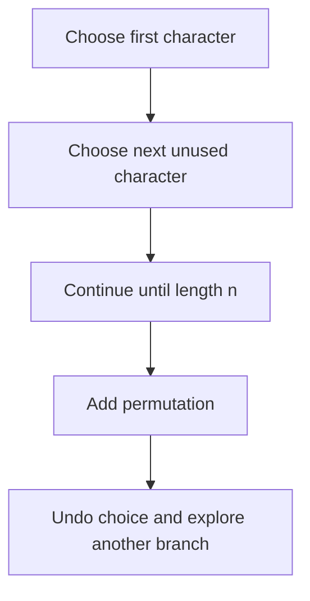
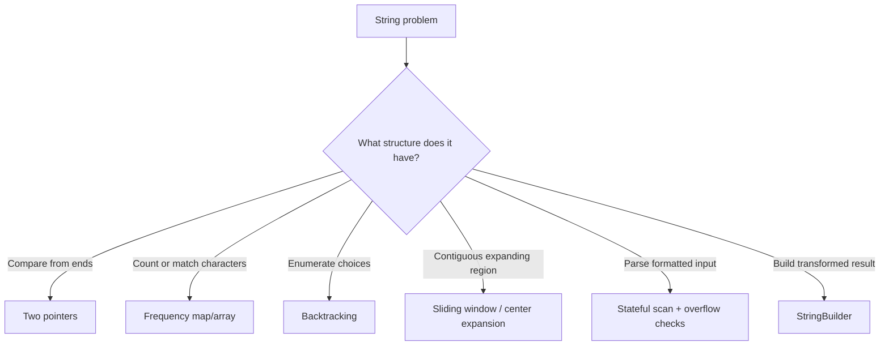

# Caelius Interview Preparation

## DSA Strings (Q121-Q135)

For every string problem, speak in this order:

```text
State -> Clarify -> Approach -> Code -> Complexity -> Optimize/Test
```

Important string clarifications:

- Is matching case-sensitive?
- Should spaces and punctuation be ignored?
- Is the input ASCII-only or full Unicode?
- May the input be empty or `null`?
- Can the input contain signs or overflow an integer?
- Should duplicate outputs be removed?

Java `char` represents a UTF-16 code unit, not necessarily one complete Unicode character. For many interview problems, clarify that the input is ASCII or simple English text. For full Unicode correctness, process code points.

---

# Q121. Reverse a String

## State

> Java strings are immutable, so I will create a character array, reverse it in place using two pointers, and construct the result.

## Clarify

- I will assume UTF-16 `char` reversal is acceptable.
- For full Unicode grapheme-cluster reversal, the solution would need a more advanced text-boundary approach.

## Approach

Swap characters from both ends while moving inward.

## Code

```java
public static String reverse(String value) {
    if (value == null) {
        throw new IllegalArgumentException("String cannot be null");
    }

    char[] characters = value.toCharArray();
    int left = 0;
    int right = characters.length - 1;

    while (left < right) {
        char temporary = characters[left];
        characters[left] = characters[right];
        characters[right] = temporary;
        left++;
        right--;
    }

    return new String(characters);
}
```

## Complexity

- Time: `O(n)`
- Extra space: `O(n)` because Java `String` is immutable and a result must be created

## Alternative

```java
return new StringBuilder(value).reverse().toString();
```

This is concise and production-friendly. The manual solution demonstrates the two-pointer logic.

---

# Q122. Check if a String Is a Palindrome

## State

> I will compare characters from both ends and move inward. I will assume exact, case-sensitive matching unless the interviewer asks to ignore punctuation and case.

## Code: exact palindrome

```java
public static boolean isPalindrome(String value) {
    if (value == null) {
        return false;
    }

    int left = 0;
    int right = value.length() - 1;

    while (left < right) {
        if (value.charAt(left) != value.charAt(right)) {
            return false;
        }
        left++;
        right--;
    }

    return true;
}
```

## Code: ignore non-alphanumeric characters and case

```java
public static boolean isNormalizedPalindrome(String value) {
    if (value == null) {
        return false;
    }

    int left = 0;
    int right = value.length() - 1;

    while (left < right) {
        while (
            left < right &&
            !Character.isLetterOrDigit(value.charAt(left))
        ) {
            left++;
        }

        while (
            left < right &&
            !Character.isLetterOrDigit(value.charAt(right))
        ) {
            right--;
        }

        if (
            Character.toLowerCase(value.charAt(left)) !=
            Character.toLowerCase(value.charAt(right))
        ) {
            return false;
        }

        left++;
        right--;
    }

    return true;
}
```

## Complexity

- Time: `O(n)`
- Extra space: `O(1)`

## Test

```text
"racecar" -> true
"RaceCar" -> false for exact, true for normalized
"A man, a plan, a canal: Panama" -> true for normalized
"" -> true
```

---

# Q123. Count Occurrences of a Character in a String

## State

> I will scan the string once and increment a counter whenever the target character appears.

## Code

```java
public static int countCharacter(String value, char target) {
    if (value == null) {
        throw new IllegalArgumentException("String cannot be null");
    }

    int count = 0;

    for (int index = 0; index < value.length(); index++) {
        if (value.charAt(index) == target) {
            count++;
        }
    }

    return count;
}
```

## Complexity

- Time: `O(n)`
- Extra space: `O(1)`

## Unicode follow-up

For a Unicode code point:

```java
public static long countCodePoint(String value, int targetCodePoint) {
    return value.codePoints()
        .filter(codePoint -> codePoint == targetCodePoint)
        .count();
}
```

## Clarification

Confirm whether matching should be case-sensitive:

```text
'A' and 'a' are different in the basic solution.
```

---

# Q124. Reverse Words in a Sentence

## State

> I will reverse the order of words, not the characters inside each word. I will normalize repeated whitespace to a single space in the result.

## Clarify

- Should original whitespace be preserved? I will assume no.
- Leading and trailing spaces should be removed.

## Approach

1. Trim surrounding whitespace.
2. Split on one-or-more whitespace characters.
3. Append words from right to left.

## Code

```java
public static String reverseWords(String sentence) {
    if (sentence == null) {
        throw new IllegalArgumentException("Sentence cannot be null");
    }

    String trimmed = sentence.trim();

    if (trimmed.isEmpty()) {
        return "";
    }

    String[] words = trimmed.split("\\s+");
    StringBuilder result = new StringBuilder(trimmed.length());

    for (int index = words.length - 1; index >= 0; index--) {
        result.append(words[index]);

        if (index > 0) {
            result.append(' ');
        }
    }

    return result.toString();
}
```

## Example

```text
"  build   reliable workflows  "
-> "workflows reliable build"
```

## Complexity

- Time: `O(n)`
- Extra space: `O(n)`

## Optimize

An in-place character-array solution is possible in languages with mutable strings: reverse the whole sentence, then reverse each word. Java still needs mutable/result storage.

---

# Q125. Check if Two Strings Are Anagrams

## State

> Two strings are anagrams if they contain the same characters with the same frequencies. I will use a frequency map so the solution works beyond lowercase English letters.

## Clarify

- Is matching case-sensitive?
- Should spaces and punctuation be ignored?
- I will show exact matching first.

## Code

```java
public static boolean areAnagrams(String first, String second) {
    if (first == null || second == null) {
        return false;
    }

    if (first.length() != second.length()) {
        return false;
    }

    Map<Character, Integer> frequencies = new HashMap<>();

    for (int index = 0; index < first.length(); index++) {
        char character = first.charAt(index);
        frequencies.merge(character, 1, Integer::sum);
    }

    for (int index = 0; index < second.length(); index++) {
        char character = second.charAt(index);
        Integer count = frequencies.get(character);

        if (count == null) {
            return false;
        }

        if (count == 1) {
            frequencies.remove(character);
        } else {
            frequencies.put(character, count - 1);
        }
    }

    return frequencies.isEmpty();
}
```

## Complexity

- Expected time: `O(n)`
- Extra space: `O(k)`, where `k` is distinct characters

## Optimize for lowercase English

Use an array of size 26:

```java
int[] frequencies = new int[26];
```

This uses `O(1)` bounded space but requires a strict input constraint.

## Alternative

Sort both character arrays:

- Time: `O(n log n)`
- Extra space: depends on sorting/conversion

---

# Q126. Find the First Non-Repeating Character

## State

> I need the first character whose total frequency is one. I will count frequencies in the first pass and scan the original string again to preserve order.

## Code

```java
public static Optional<Character> firstNonRepeating(
        String value) {
    if (value == null) {
        return Optional.empty();
    }

    Map<Character, Integer> frequencies = new HashMap<>();

    for (int index = 0; index < value.length(); index++) {
        frequencies.merge(
            value.charAt(index),
            1,
            Integer::sum
        );
    }

    for (int index = 0; index < value.length(); index++) {
        char character = value.charAt(index);

        if (frequencies.get(character) == 1) {
            return Optional.of(character);
        }
    }

    return Optional.empty();
}
```

## Complexity

- Expected time: `O(n)`
- Extra space: `O(k)`

## Alternative

Use `LinkedHashMap<Character, Integer>` to preserve insertion order, then scan map entries. The two-pass approach is often simpler and efficient.

## Follow-up

For a stream of incoming characters, maintain:

- Frequency map.
- Queue of candidates.

Remove queue-front characters once their frequency exceeds one.

---

# Q127. Find All Permutations of a String

## State

> I will generate permutations using backtracking. At each position, I choose one unused character, recurse, then undo the choice. If duplicate characters are possible, I will skip duplicate choices at each recursion level.

## Clarify

- Should duplicate permutations be removed? I will return unique permutations.
- Permutation count grows factorially, so the input must be small.

## Approach



## Code

```java
public static List<String> uniquePermutations(String value) {
    if (value == null) {
        throw new IllegalArgumentException("String cannot be null");
    }

    char[] characters = value.toCharArray();
    Arrays.sort(characters);

    List<String> result = new ArrayList<>();
    boolean[] used = new boolean[characters.length];

    buildPermutations(
        characters,
        used,
        new StringBuilder(),
        result
    );

    return result;
}

private static void buildPermutations(
        char[] characters,
        boolean[] used,
        StringBuilder current,
        List<String> result) {
    if (current.length() == characters.length) {
        result.add(current.toString());
        return;
    }

    for (int index = 0; index < characters.length; index++) {
        if (used[index]) {
            continue;
        }

        if (
            index > 0 &&
            characters[index] == characters[index - 1] &&
            !used[index - 1]
        ) {
            continue;
        }

        used[index] = true;
        current.append(characters[index]);

        buildPermutations(
            characters,
            used,
            current,
            result
        );

        current.deleteCharAt(current.length() - 1);
        used[index] = false;
    }
}
```

## Complexity

For `n` distinct characters:

- Number of outputs: `n!`
- Time: `O(n * n!)` to construct all strings
- Recursion/working space: `O(n)`, excluding output
- Output space: `O(n * n!)`

## Interview point

No algorithm can output all permutations faster than the output size itself.

---

# Q128. Check if a String Contains Only Digits

## State

> I will check every character and return false on the first non-digit. I will clarify whether Unicode digits are accepted or only ASCII digits `0-9`.

## Unicode-digit code

```java
public static boolean containsOnlyDigits(String value) {
    if (value == null || value.isEmpty()) {
        return false;
    }

    for (int index = 0; index < value.length(); index++) {
        if (!Character.isDigit(value.charAt(index))) {
            return false;
        }
    }

    return true;
}
```

## ASCII-only code

```java
public static boolean containsOnlyAsciiDigits(String value) {
    if (value == null || value.isEmpty()) {
        return false;
    }

    for (int index = 0; index < value.length(); index++) {
        char character = value.charAt(index);

        if (character < '0' || character > '9') {
            return false;
        }
    }

    return true;
}
```

## Complexity

- Time: `O(n)`
- Extra space: `O(1)`

## Why not regex by default?

```java
value.matches("\\d+")
```

It is concise, but a direct scan avoids regex overhead and makes the exact digit contract clearer.

---

# Q129. Convert a String to Integer: `atoi`

## State

> I will parse optional leading whitespace, an optional sign, and consecutive digits. I will stop at the first non-digit and clamp overflow to the integer range.

## Clarify

Expected behavior should be confirmed. I will follow common `atoi` behavior:

- Ignore leading spaces.
- Read optional `+` or `-`.
- Parse consecutive ASCII digits.
- Stop at the first non-digit.
- Clamp overflow.

## Code

```java
public static int parseAtoi(String value) {
    if (value == null) {
        return 0;
    }

    int index = 0;
    int length = value.length();

    while (
        index < length &&
        Character.isWhitespace(value.charAt(index))
    ) {
        index++;
    }

    int sign = 1;

    if (
        index < length &&
        (value.charAt(index) == '+' ||
         value.charAt(index) == '-')
    ) {
        sign = value.charAt(index) == '-' ? -1 : 1;
        index++;
    }

    long result = 0;

    while (index < length) {
        char character = value.charAt(index);

        if (character < '0' || character > '9') {
            break;
        }

        result = result * 10 + (character - '0');

        long signedResult = sign * result;

        if (signedResult > Integer.MAX_VALUE) {
            return Integer.MAX_VALUE;
        }

        if (signedResult < Integer.MIN_VALUE) {
            return Integer.MIN_VALUE;
        }

        index++;
    }

    return (int) (sign * result);
}
```

## Complexity

- Time: `O(n)`
- Extra space: `O(1)`

## Test

```text
"42" -> 42
"   -42abc" -> -42
"words 12" -> 0
"2147483648" -> 2147483647
"" -> 0
```

## Production note

For normal application parsing, prefer `Integer.parseInt()` and explicit validation. Implementing `atoi` is mainly an interview exercise about parsing and overflow.

---

# Q130. Find the Longest Palindromic Substring

## State

> I need the longest contiguous substring that reads the same forward and backward. I will expand around every possible center because every palindrome has either one center character or a center gap.

## Approach

For each index:

- Expand odd palindrome around `(index, index)`.
- Expand even palindrome around `(index, index + 1)`.
- Track the longest boundaries.

## Code

```java
public static String longestPalindromicSubstring(
        String value) {
    if (value == null || value.isEmpty()) {
        return "";
    }

    int bestStart = 0;
    int bestEnd = 0;

    for (int center = 0; center < value.length(); center++) {
        int oddLength = expandLength(value, center, center);
        int evenLength = expandLength(
            value,
            center,
            center + 1
        );

        int length = Math.max(oddLength, evenLength);

        if (length > bestEnd - bestStart + 1) {
            bestStart = center - (length - 1) / 2;
            bestEnd = center + length / 2;
        }
    }

    return value.substring(bestStart, bestEnd + 1);
}

private static int expandLength(
        String value,
        int left,
        int right) {
    while (
        left >= 0 &&
        right < value.length() &&
        value.charAt(left) == value.charAt(right)
    ) {
        left--;
        right++;
    }

    return right - left - 1;
}
```

## Complexity

- Time: `O(n^2)`
- Extra space: `O(1)`

## Alternatives

- Dynamic programming: `O(n^2)` time and `O(n^2)` space.
- Manacher's algorithm: `O(n)` time, but more complex.

For most interviews, center expansion gives the best clarity-performance balance.

---

# Q131. Check if One String Is a Rotation of Another

## State

> If two strings have equal length and one is a rotation of the other, the rotated string must appear inside the first string concatenated with itself.

## Example

```text
first = "waterbottle"
second = "erbottlewat"

first + first =
"waterbottlewaterbottle"
contains second -> true
```

## Code

```java
public static boolean isRotation(
        String first,
        String second) {
    if (first == null || second == null) {
        return false;
    }

    return first.length() == second.length() &&
        (first + first).contains(second);
}
```

## Complexity

Depending on substring-search implementation:

- Typical conceptual time: `O(n)`
- Extra space: `O(n)` for concatenation

For a strict complexity discussion, mention that substring-search behavior depends on the algorithm/library implementation. KMP can guarantee linear search.

## Edge case

```text
"" and "" -> true
```

They have equal length, and the empty string is considered a rotation of itself.

---

# Q132. Remove All Whitespace From a String

## State

> I will build a result containing only non-whitespace characters. I will use `Character.isWhitespace()` rather than removing only ordinary spaces.

## Code

```java
public static String removeWhitespace(String value) {
    if (value == null) {
        throw new IllegalArgumentException("String cannot be null");
    }

    StringBuilder result = new StringBuilder(value.length());

    for (int index = 0; index < value.length(); index++) {
        char character = value.charAt(index);

        if (!Character.isWhitespace(character)) {
            result.append(character);
        }
    }

    return result.toString();
}
```

## Complexity

- Time: `O(n)`
- Extra space: `O(n)` for result

## Regex alternative

```java
return value.replaceAll("\\s+", "");
```

The direct loop avoids regex overhead and makes whitespace behavior explicit.

## Clarification

Ask whether all whitespace or only ASCII spaces should be removed. These are different contracts.

---

# Q133. Count Vowels and Consonants

## State

> I will scan letters only, classify each as a vowel or consonant, and ignore digits, spaces, and punctuation.

## Code

```java
public static LetterCount countVowelsAndConsonants(
        String value) {
    if (value == null) {
        throw new IllegalArgumentException("String cannot be null");
    }

    int vowels = 0;
    int consonants = 0;

    for (int index = 0; index < value.length(); index++) {
        char character = Character.toLowerCase(
            value.charAt(index)
        );

        if (!Character.isLetter(character)) {
            continue;
        }

        if (
            character == 'a' ||
            character == 'e' ||
            character == 'i' ||
            character == 'o' ||
            character == 'u'
        ) {
            vowels++;
        } else {
            consonants++;
        }
    }

    return new LetterCount(vowels, consonants);
}

public record LetterCount(int vowels, int consonants) {
}
```

## Complexity

- Time: `O(n)`
- Extra space: `O(1)`

## Clarification

This vowel definition is English-focused. For multilingual text, vowel classification is language-specific and needs a different contract.

---

# Q134. String Compression: `aabccc -> a2b1c3`

## State

> I will perform run-length encoding by counting consecutive equal characters and appending each character with its run length.

## Clarify

- Compression is based on consecutive runs.
- Should I return the original string if compression is not shorter? I will show both choices.

## Code

```java
public static String compressRuns(String value) {
    if (value == null || value.isEmpty()) {
        return value;
    }

    StringBuilder compressed = new StringBuilder();
    int count = 1;

    for (int index = 1; index <= value.length(); index++) {
        if (
            index < value.length() &&
            value.charAt(index) == value.charAt(index - 1)
        ) {
            count++;
        } else {
            compressed
                .append(value.charAt(index - 1))
                .append(count);
            count = 1;
        }
    }

    return compressed.toString();
}
```

## Return only when shorter

```java
public static String compressIfShorter(String value) {
    String compressed = compressRuns(value);
    return compressed.length() < value.length()
        ? compressed
        : value;
}
```

## Complexity

- Time: `O(n)`
- Extra space: `O(n)`

## Ambiguity warning

If input characters may include digits, decoding `a12` can be ambiguous without a clear format. Production compression formats require escaping, delimiters, or binary framing.

---

# Q135. Longest Common Prefix Among an Array of Strings

## State

> I need the longest prefix shared by every string. I will take the first string as a candidate and shrink it whenever another string does not start with it.

## Clarify

- Empty array returns an empty prefix.
- A `null` string will be rejected in this implementation.

## Code

```java
public static String longestCommonPrefix(String[] values) {
    if (values == null || values.length == 0) {
        return "";
    }

    if (values[0] == null) {
        throw new IllegalArgumentException(
            "Strings cannot be null"
        );
    }

    String prefix = values[0];

    for (int index = 1; index < values.length; index++) {
        String value = values[index];

        if (value == null) {
            throw new IllegalArgumentException(
                "Strings cannot be null"
            );
        }

        while (!value.startsWith(prefix)) {
            if (prefix.isEmpty()) {
                return "";
            }

            prefix = prefix.substring(
                0,
                prefix.length() - 1
            );
        }
    }

    return prefix;
}
```

## Complexity

Let `S` be the total number of characters examined:

- Time: approximately `O(S)` conceptually
- Extra space: depends on substring allocations; result length is at most the shortest string

## Character-by-character alternative

Compare each character position across all strings until a mismatch. It avoids repeated prefix shrinking and gives a clear bound:

```java
public static String longestCommonPrefixVertical(
        String[] values) {
    if (values == null || values.length == 0) {
        return "";
    }

    for (int characterIndex = 0;
         characterIndex < values[0].length();
         characterIndex++) {
        char expected = values[0].charAt(characterIndex);

        for (int stringIndex = 1;
             stringIndex < values.length;
             stringIndex++) {
            if (
                characterIndex >= values[stringIndex].length() ||
                values[stringIndex].charAt(characterIndex) != expected
            ) {
                return values[0].substring(0, characterIndex);
            }
        }
    }

    return values[0];
}
```

## Alternative

Sort the array and compare only the first and last strings. This costs `O(n log n)` sorting and modifies/reorders the input unless copied.

---

# Reusable String Patterns



## Two pointers

Use for:

- Palindrome checks.
- In-place character-array reversal.
- Skipping punctuation from both ends.

## Frequency maps

Use for:

- Anagrams.
- First non-repeating character.
- Character counts.

If input is guaranteed lowercase English, an array of size 26 is faster and simpler.

## Backtracking

Use when generating:

- Permutations.
- Subsequences.
- Combinations.

Always discuss exponential/factorial output size.

## Expand around center

Use for palindromic substrings because every palindrome has an odd or even center.

## StringBuilder

Use for repeated construction. Avoid repeated immutable concatenation inside large loops.

---

# String Interview Testing Checklist

Test:

```text
null, if contract discusses it
empty string
single character
all same characters
all unique characters
leading/trailing/repeated whitespace
uppercase/lowercase
digits and punctuation
answer absent
answer is entire string
duplicate characters in permutation
integer overflow during parsing
non-ASCII characters, if required
```

## Communication example

> "Before coding, I want to confirm whether matching is case-sensitive and whether spaces or punctuation should be ignored. I will assume ASCII for the basic solution; if full Unicode correctness is required, I would process code points or grapheme clusters depending on the requirement."

---

# DSA Strings Revision Sheet

| Question | Optimal/common pattern | Time | Extra space |
|---|---|---:|---:|
| Reverse string | Character array + two pointers | `O(n)` | `O(n)` result |
| Palindrome | Two pointers | `O(n)` | `O(1)` |
| Count character | Linear scan | `O(n)` | `O(1)` |
| Reverse words | Split + reverse traversal | `O(n)` | `O(n)` |
| Anagrams | Frequency map/array | `O(n)` | `O(k)` |
| First non-repeating | Frequency count + ordered scan | `O(n)` | `O(k)` |
| All permutations | Backtracking | `O(n * n!)` | Output-dominated |
| Only digits | Linear validation | `O(n)` | `O(1)` |
| `atoi` | Stateful scan + overflow guard | `O(n)` | `O(1)` |
| Longest palindromic substring | Expand around center | `O(n^2)` | `O(1)` |
| String rotation | Concatenate + substring search | Typically `O(n)` | `O(n)` |
| Remove whitespace | StringBuilder scan | `O(n)` | `O(n)` |
| Vowels/consonants | Linear classification | `O(n)` | `O(1)` |
| String compression | Run-length scan | `O(n)` | `O(n)` |
| Longest common prefix | Vertical scan / shrinking prefix | `O(S)` | Small/result |

## Common interview mistakes

- Not clarifying case, whitespace, or punctuation rules.
- Assuming Java `char` always equals one user-visible Unicode character.
- Using repeated string concatenation in a loop.
- Returning duplicate permutations unintentionally.
- Ignoring overflow in `atoi`.
- Treating subsequence and substring as the same concept.
- Forgetting even-length palindrome centers.
- Saying all substring searches are guaranteed linear without naming the algorithm.
- Using an English-only vowel definition without stating the assumption.
