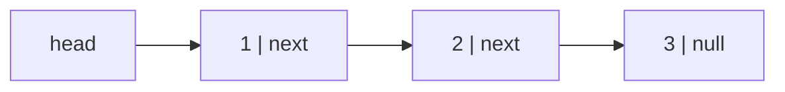
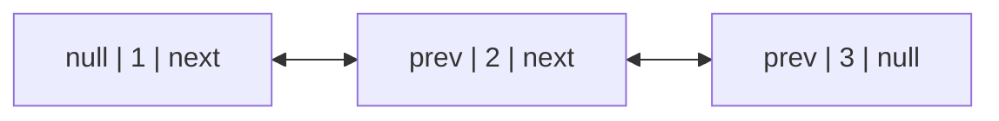
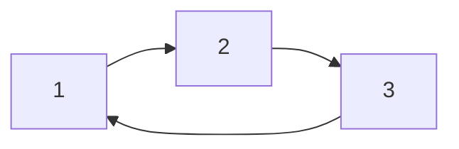
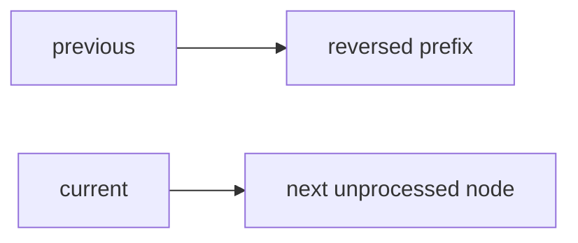
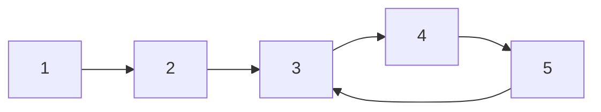
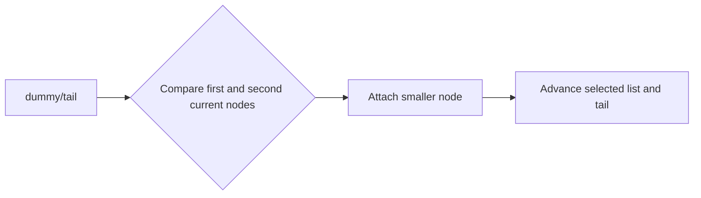
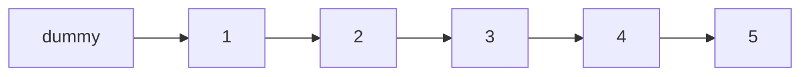
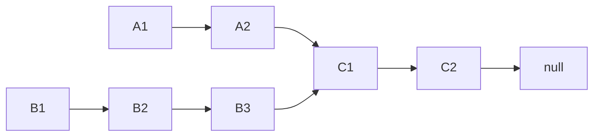
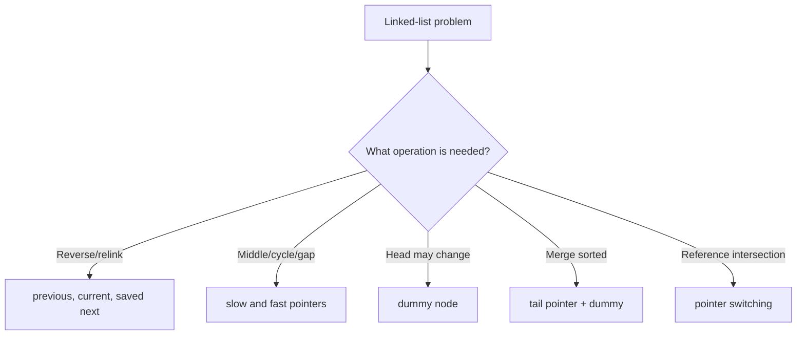

# Caelius Interview Preparation

## DSA Linked List (Q136-Q145)

For every linked-list problem, speak in this order:

```text
State -> Draw pointers -> State invariant -> Code -> Complexity -> Test edges
```

Before changing a link, preserve any node you still need. Most linked-list bugs come from losing the unprocessed remainder, mishandling the head, or accidentally creating a cycle.

---

# Shared Java Node Definitions

```java
public static final class ListNode {
    int value;
    ListNode next;

    ListNode(int value) {
        this.value = value;
    }

    ListNode(int value, ListNode next) {
        this.value = value;
        this.next = next;
    }
}

public static final class DoublyListNode {
    int value;
    DoublyListNode previous;
    DoublyListNode next;

    DoublyListNode(int value) {
        this.value = value;
    }
}
```

---

# Q136. What Is a Linked List? What Are Its Types?

## Interview answer

> A linked list is a linear data structure made of nodes, where each node stores a value and links to other nodes. Unlike an array, nodes do not need contiguous memory and indexed access is not constant time.

## Types

### Singly linked list



Each node points to the next node.

### Doubly linked list



Each node points forward and backward.

### Circular linked list



The last node links back to the first or another earlier node.

## Core characteristics

| Operation | Singly linked list |
|---|---:|
| Access by index | `O(n)` |
| Search | `O(n)` |
| Insert/remove at known head | `O(1)` |
| Insert/remove after known node | `O(1)` |
| Find tail without stored tail | `O(n)` |

## Real use cases

- LRU cache ordering with a doubly linked list plus hash map.
- Queues and deques.
- Adjacency lists.
- Undo/redo navigation.
- Memory structures where frequent known-position link changes matter.

## Important tradeoff

Linked lists use extra memory for links and have poor cache locality. Arrays/`ArrayList` are often faster for real workloads despite theoretically expensive middle insertions.

---

# Q137. Difference Between Array and Linked List

## Interview answer

> Arrays store elements contiguously and provide `O(1)` indexed access. Linked lists store nodes connected by references, so indexed access is `O(n)`, but insertion or deletion is `O(1)` when the relevant node position is already known.

## Comparison

| Concern | Array | Linked list |
|---|---|---|
| Memory layout | Contiguous | Separate linked nodes |
| Indexed access | `O(1)` | `O(n)` |
| Search unsorted | `O(n)` | `O(n)` |
| Insert/remove at front | `O(n)` shifting | `O(1)` |
| Insert/remove at known node | Requires shifting | Link change `O(1)` |
| Cache locality | Strong | Weak |
| Memory overhead | Low | Extra pointer fields |
| Binary search | Possible when sorted | Inefficient due to no indexed access |

## Important nuance

This statement is incomplete:

```text
"Linked-list insertion is O(1)."
```

Correct version:

> Insertion is `O(1)` only after the insertion position/node is already known. Searching for that position may cost `O(n)`.

## Selection example

Use an array/`ArrayList` for:

- Frequent indexed reads.
- Dense iteration.
- Better cache behavior.

Use a linked structure for:

- Frequent link changes at known nodes.
- LRU cache ordering.
- Queue/deque structures with stored endpoints.

## Project connection

A workflow graph is not normally stored as one linked list because nodes may branch to multiple next nodes. It is better represented using graph nodes and adjacency relationships.

---

# Q138. Reverse a Singly Linked List

## State

> I need to reverse every `next` pointer and return the old tail as the new head. Before changing a link, I must save the next unprocessed node.

## Invariant

```text
previous points to the already reversed prefix.
current points to the next node to process.
```

## Pointer flow



For each node:

```text
next = current.next
current.next = previous
previous = current
current = next
```

## Code

```java
public static ListNode reverse(ListNode head) {
    ListNode previous = null;
    ListNode current = head;

    while (current != null) {
        ListNode next = current.next;
        current.next = previous;
        previous = current;
        current = next;
    }

    return previous;
}
```

## Complexity

- Time: `O(n)`
- Extra space: `O(1)`

## Recursive alternative

```java
public static ListNode reverseRecursive(ListNode head) {
    if (head == null || head.next == null) {
        return head;
    }

    ListNode newHead = reverseRecursive(head.next);
    head.next.next = head;
    head.next = null;
    return newHead;
}
```

- Time: `O(n)`
- Call-stack space: `O(n)`

The iterative solution is safer for long lists.

## Test

```text
null
1
1 -> 2
1 -> 2 -> 3
```

---

# Q139. Detect a Cycle in a Linked List: Floyd's Algorithm

## State

> I will use Floyd's tortoise-and-hare algorithm. A slow pointer moves one step and a fast pointer moves two steps. If a cycle exists, they must eventually meet.

## Why it works

Inside a cycle, the fast pointer gains one node per iteration relative to the slow pointer, so it eventually catches it.



## Code

```java
public static boolean hasCycle(ListNode head) {
    ListNode slow = head;
    ListNode fast = head;

    while (fast != null && fast.next != null) {
        slow = slow.next;
        fast = fast.next.next;

        if (slow == fast) {
            return true;
        }
    }

    return false;
}
```

## Complexity

- Time: `O(n)`
- Extra space: `O(1)`

## Alternative

Use a `HashSet<ListNode>`:

- Time: `O(n)` expected
- Extra space: `O(n)`

## Follow-up: Find Cycle Entry

After slow and fast meet:

1. Move one pointer to head.
2. Move both one step at a time.
3. Their next meeting point is the cycle entry.

```java
public static ListNode cycleEntry(ListNode head) {
    ListNode slow = head;
    ListNode fast = head;

    do {
        if (fast == null || fast.next == null) {
            return null;
        }
        slow = slow.next;
        fast = fast.next.next;
    } while (slow != fast);

    slow = head;

    while (slow != fast) {
        slow = slow.next;
        fast = fast.next;
    }

    return slow;
}
```

---

# Q140. Find the Middle of a Linked List

## State

> I will use slow and fast pointers. Slow moves one step and fast moves two steps. When fast reaches the end, slow is at the middle.

## Clarify

For an even-length list, this implementation returns the second middle.

## Code

```java
public static ListNode middleNode(ListNode head) {
    ListNode slow = head;
    ListNode fast = head;

    while (fast != null && fast.next != null) {
        slow = slow.next;
        fast = fast.next.next;
    }

    return slow;
}
```

## Example

```text
1 -> 2 -> 3 -> 4 -> 5
middle = 3

1 -> 2 -> 3 -> 4
second middle = 3
```

## Complexity

- Time: `O(n)`
- Extra space: `O(1)`

## First-middle variation

To return the first middle for even length:

```java
while (fast.next != null && fast.next.next != null) {
    slow = slow.next;
    fast = fast.next.next;
}
```

Clarify the expected behavior before coding.

---

# Q141. Merge Two Sorted Linked Lists

## State

> I will reuse the existing nodes and build the merged list by repeatedly attaching the smaller current node. A dummy node removes special handling for the result head.

## Approach



## Code

```java
public static ListNode mergeSorted(
        ListNode first,
        ListNode second) {
    ListNode dummy = new ListNode(0);
    ListNode tail = dummy;

    while (first != null && second != null) {
        if (first.value <= second.value) {
            tail.next = first;
            first = first.next;
        } else {
            tail.next = second;
            second = second.next;
        }

        tail = tail.next;
    }

    tail.next = first != null ? first : second;
    return dummy.next;
}
```

## Complexity

- Time: `O(n + m)`
- Extra space: `O(1)` because nodes are reused

## Important contract

This mutates/relinks the input lists. If the original lists must remain unchanged, create copied nodes, costing `O(n + m)` extra space.

## Why dummy nodes help

The dummy node gives every appended node a predecessor, eliminating separate logic for the first result node.

---

# Q142. Remove the Nth Node From the End

## State

> I will use a dummy node and maintain a gap of `n + 1` links between fast and slow pointers. When fast reaches the end, slow is immediately before the node to remove.

## Clarify

- Assume `n` is one-based from the end.
- I will reject `n <= 0` or `n` larger than list length.

## Diagram



For `n = 2`, slow ends before node `4`.

## Code

```java
public static ListNode removeNthFromEnd(
        ListNode head,
        int n) {
    if (n <= 0) {
        throw new IllegalArgumentException("n must be positive");
    }

    ListNode dummy = new ListNode(0, head);
    ListNode fast = dummy;
    ListNode slow = dummy;

    for (int step = 0; step <= n; step++) {
        if (fast == null) {
            throw new IllegalArgumentException(
                "n exceeds list length"
            );
        }
        fast = fast.next;
    }

    while (fast != null) {
        fast = fast.next;
        slow = slow.next;
    }

    slow.next = slow.next.next;
    return dummy.next;
}
```

## Complexity

- Time: `O(n)` over list length
- Extra space: `O(1)`

## Why dummy node matters

It handles removing the original head without separate code.

## Alternative

Two passes:

1. Find length.
2. Remove node at position `length - n`.

It is simpler conceptually but scans the list twice.

---

# Q143. Delete a Node Without a Head Pointer

## State

> Without the head or previous node, I cannot unlink the current node directly. If the node is not the tail, I can copy the next node's value into it and bypass the next node.

## Code

```java
public static void deleteWithoutHead(ListNode node) {
    if (node == null || node.next == null) {
        throw new IllegalArgumentException(
            "Node must be non-null and not the tail"
        );
    }

    node.value = node.next.value;
    node.next = node.next.next;
}
```

## Example

```text
List: 1 -> 2 -> 3 -> 4
Given node containing 3

Copy 4 into given node, bypass old 4
Result: 1 -> 2 -> 4
```

## Complexity

- Time: `O(1)`
- Extra space: `O(1)`

## Important limitations

- Cannot delete the tail.
- The supplied node object's identity remains, but its value changes.
- External references to the next node may observe it being bypassed.
- This is unsuitable when node identity matters independently of value.

## Interview point

> This operation does not truly delete the given node object; it makes the list behave as if that logical value/node position was removed.

---

# Q144. Find the Intersection Point of Two Linked Lists

## State

> I need the node where two singly linked lists begin sharing the same node objects. I will use two pointers that switch to the other list's head after reaching the end, equalizing their total traveled distance.

## Clarify

Intersection means reference identity, not equal node values.

## Diagram



## Why switching works

Each pointer travels:

```text
length A + length B
```

So the unequal prefixes cancel. They either meet at the shared node or both become `null`.

## Code

```java
public static ListNode intersectionNode(
        ListNode first,
        ListNode second) {
    if (first == null || second == null) {
        return null;
    }

    ListNode pointerA = first;
    ListNode pointerB = second;

    while (pointerA != pointerB) {
        pointerA = pointerA == null
            ? second
            : pointerA.next;

        pointerB = pointerB == null
            ? first
            : pointerB.next;
    }

    return pointerA;
}
```

## Complexity

- Time: `O(n + m)`
- Extra space: `O(1)`

## Alternatives

- Hash set of nodes: `O(n + m)` time, `O(n)` space.
- Calculate lengths, advance the longer prefix, then move together.

## Assumption

This standard solution assumes acyclic lists. Cycles require additional reasoning.

---

# Q145. Check if a Linked List Is a Palindrome

## State

> I will find the middle, reverse the second half, compare both halves, and then restore the list so the input structure remains unchanged.

## Approach

1. Find end of first half using slow/fast pointers.
2. Reverse the second half.
3. Compare corresponding values.
4. Restore the second half.

## Code

```java
public static boolean isPalindrome(ListNode head) {
    if (head == null || head.next == null) {
        return true;
    }

    ListNode firstHalfEnd = endOfFirstHalf(head);
    ListNode secondHalfStart = reverse(firstHalfEnd.next);

    ListNode firstPointer = head;
    ListNode secondPointer = secondHalfStart;
    boolean palindrome = true;

    while (palindrome && secondPointer != null) {
        if (firstPointer.value != secondPointer.value) {
            palindrome = false;
        }

        firstPointer = firstPointer.next;
        secondPointer = secondPointer.next;
    }

    firstHalfEnd.next = reverse(secondHalfStart);
    return palindrome;
}

private static ListNode endOfFirstHalf(ListNode head) {
    ListNode slow = head;
    ListNode fast = head;

    while (fast.next != null && fast.next.next != null) {
        slow = slow.next;
        fast = fast.next.next;
    }

    return slow;
}
```

This uses the iterative `reverse()` method from Q138.

## Example

```text
1 -> 2 -> 3 -> 2 -> 1
first half:  1 -> 2
middle:      3
second half: 2 -> 1
reverse second half and compare
```

## Complexity

- Time: `O(n)`
- Extra space: `O(1)`

## Alternative

Copy values into an array and use two pointers:

- Time: `O(n)`
- Extra space: `O(n)`

It is simpler and avoids temporary mutation, but uses additional memory.

## Why restore?

Restoring avoids surprising callers. A method named `isPalindrome` should ideally not leave the list modified.

---

# Reusable Linked-List Patterns



## Save before rewiring

Before:

```java
current.next = previous;
```

Save:

```java
ListNode next = current.next;
```

Otherwise, the unprocessed remainder can be lost.

## Dummy node

Use when:

- Head may be removed.
- Building a merged list.
- Inserting before the head.

It removes special-case branching.

## Slow and fast pointers

Use for:

- Middle node.
- Cycle detection.
- Palindrome splitting.
- Nth node from end with a fixed gap.

## Reference identity

For intersection and cycles, compare nodes using:

```java
pointerA == pointerB
```

The question concerns the same node object, not equal values.

---

# Linked-List Interview Testing Checklist

Test:

```text
null head
single node
two nodes
odd length
even length
operation affects head
operation affects tail
all values equal
duplicate values but different node identities
cycle begins at head
cycle begins in middle
no intersection
intersection at head
intersection near tail
```

## Communication example

> "Before I change this pointer, I am saving the next node so I do not lose the remaining list. My invariant is that `previous` is already reversed and `current` is the next unprocessed node."

---

# DSA Linked List Revision Sheet

| Question | Optimal/common pattern | Time | Extra space |
|---|---|---:|---:|
| Linked-list types | Node/link model | - | - |
| Array vs linked list | Contiguous indexing vs linked nodes | - | - |
| Reverse list | Three pointers | `O(n)` | `O(1)` |
| Detect cycle | Floyd slow/fast | `O(n)` | `O(1)` |
| Find middle | Slow/fast | `O(n)` | `O(1)` |
| Merge sorted lists | Dummy + tail | `O(n+m)` | `O(1)` |
| Remove Nth from end | Dummy + fixed pointer gap | `O(n)` | `O(1)` |
| Delete without head | Copy next and bypass | `O(1)` | `O(1)` |
| Intersection point | Pointer switching | `O(n+m)` | `O(1)` |
| Palindrome list | Middle + reverse + compare + restore | `O(n)` | `O(1)` |

## Common interview mistakes

- Saying linked-list insertion is always `O(1)` without discussing position lookup.
- Losing the remaining list during reversal.
- Forgetting to return the new head.
- Comparing cycle/intersection nodes by value rather than reference.
- Forgetting even-length middle behavior.
- Omitting a dummy node and creating head-removal bugs.
- Trying to delete a tail node without a head/previous pointer.
- Not validating `n` in removal-from-end.
- Leaving the list modified after a palindrome check.
