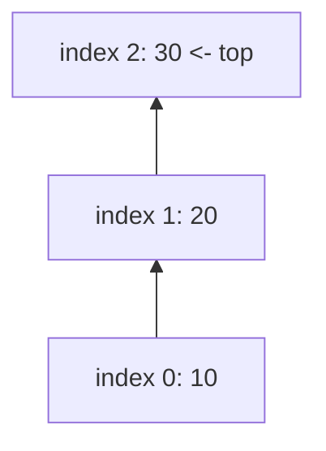
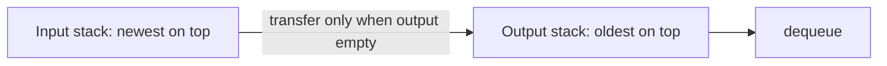
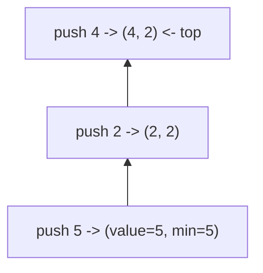
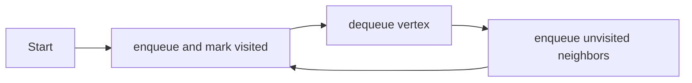
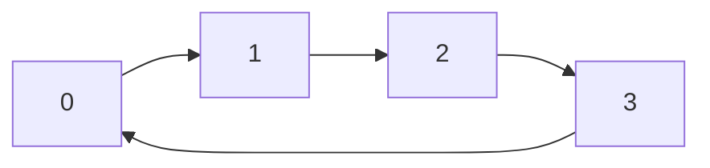
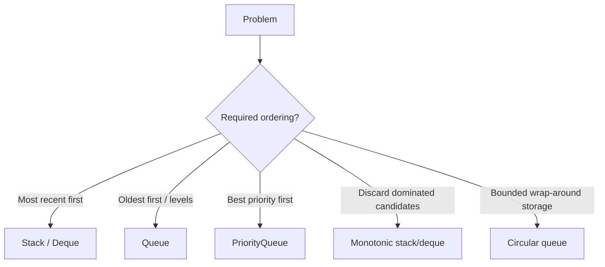

# Caelius Interview Preparation

## DSA Stack and Queue (Q146-Q155)

For every problem, speak in this order:

```text
State -> Define invariant -> Choose operations -> Code -> Complexity -> Test
```

Java guidance:

- Prefer `ArrayDeque` for stack and queue behavior.
- Avoid the legacy `Stack` class for new code.
- `ArrayDeque` does not permit `null`.
- For concurrent producer-consumer behavior, use a suitable `BlockingQueue`.

---

# Q146. Implement a Stack Using an Array

## State

> A stack follows LIFO: last in, first out. I will use a resizable array and a `size` field. The top element is stored at index `size - 1`.

## Invariant

```text
Valid stack elements occupy values[0 .. size - 1].
The next push position is values[size].
```

## Code

```java
public static final class IntArrayStack {
    private int[] values;
    private int size;

    public IntArrayStack(int initialCapacity) {
        if (initialCapacity < 1) {
            throw new IllegalArgumentException(
                "Initial capacity must be positive"
            );
        }

        values = new int[initialCapacity];
    }

    public void push(int value) {
        ensureCapacity();
        values[size] = value;
        size++;
    }

    public int pop() {
        ensureNotEmpty();
        size--;
        return values[size];
    }

    public int peek() {
        ensureNotEmpty();
        return values[size - 1];
    }

    public int size() {
        return size;
    }

    public boolean isEmpty() {
        return size == 0;
    }

    private void ensureCapacity() {
        if (size == values.length) {
            values = Arrays.copyOf(
                values,
                values.length * 2
            );
        }
    }

    private void ensureNotEmpty() {
        if (isEmpty()) {
            throw new NoSuchElementException("Stack is empty");
        }
    }
}
```

## Diagram



## Complexity

| Operation | Complexity |
|---|---:|
| `push` | Amortized `O(1)`, resize occasionally `O(n)` |
| `pop` | `O(1)` |
| `peek` | `O(1)` |
| Space | `O(n)` |

## Interview point

The occasional resize makes one push `O(n)`, but across many pushes the average, or amortized, cost is `O(1)`.

---

# Q147. Implement a Stack Using a Queue

## State

> I need LIFO behavior using FIFO operations. I will use one queue and rotate earlier elements behind the newly pushed element, making the queue front always represent the stack top.

## Approach

On push:

1. Add the new value.
2. Rotate all older values behind it.

```text
queue before push 3: [2, 1]
add 3:               [2, 1, 3]
rotate old elements: [3, 2, 1]
```

## Code

```java
public static final class StackUsingQueue {
    private final Queue<Integer> queue = new ArrayDeque<>();

    public void push(int value) {
        int previousSize = queue.size();
        queue.offer(value);

        for (int count = 0; count < previousSize; count++) {
            queue.offer(queue.remove());
        }
    }

    public int pop() {
        if (queue.isEmpty()) {
            throw new NoSuchElementException("Stack is empty");
        }
        return queue.remove();
    }

    public int peek() {
        if (queue.isEmpty()) {
            throw new NoSuchElementException("Stack is empty");
        }
        return queue.element();
    }

    public boolean isEmpty() {
        return queue.isEmpty();
    }
}
```

## Complexity

- `push`: `O(n)`
- `pop`: `O(1)`
- `peek`: `O(1)`
- Space: `O(n)`

## Alternative

Make push `O(1)` and pop `O(n)` by moving all but the last queue element during pop.

## Clarify

Ask which operation should be optimized. The tradeoff determines the implementation.

---

# Q148. Implement a Queue Using Stacks

## State

> A queue follows FIFO, while stacks are LIFO. I will use an input stack for enqueue and an output stack for dequeue. I transfer elements only when the output stack is empty.

## Invariant

```text
input stack stores newest elements.
output stack exposes oldest elements.
```

## Code

```java
public static final class QueueUsingStacks {
    private final Deque<Integer> input = new ArrayDeque<>();
    private final Deque<Integer> output = new ArrayDeque<>();

    public void offer(int value) {
        input.push(value);
    }

    public int poll() {
        moveIfNeeded();

        if (output.isEmpty()) {
            throw new NoSuchElementException("Queue is empty");
        }

        return output.pop();
    }

    public int peek() {
        moveIfNeeded();

        if (output.isEmpty()) {
            throw new NoSuchElementException("Queue is empty");
        }

        return output.peek();
    }

    public boolean isEmpty() {
        return input.isEmpty() && output.isEmpty();
    }

    private void moveIfNeeded() {
        if (output.isEmpty()) {
            while (!input.isEmpty()) {
                output.push(input.pop());
            }
        }
    }
}
```

## Flow



## Complexity

- Enqueue: `O(1)`
- Dequeue: Amortized `O(1)`
- Peek: Amortized `O(1)`
- Space: `O(n)`

## Why amortized `O(1)`?

Each element:

1. Enters the input stack once.
2. Moves to output once.
3. Leaves output once.

It is not repeatedly transferred back and forth.

---

# Q149. Valid Parentheses Problem

## State

> I need to verify that every closing bracket matches the most recent unmatched opening bracket. That LIFO requirement makes a stack appropriate.

## Clarify

- I will accept only bracket characters.
- Empty input is valid.

## Code

```java
public static boolean hasValidParentheses(String value) {
    if (value == null) {
        return false;
    }

    Deque<Character> expectedClosings = new ArrayDeque<>();

    for (int index = 0; index < value.length(); index++) {
        char character = value.charAt(index);

        switch (character) {
            case '(' -> expectedClosings.push(')');
            case '[' -> expectedClosings.push(']');
            case '{' -> expectedClosings.push('}');
            case ')', ']', '}' -> {
                if (
                    expectedClosings.isEmpty() ||
                    expectedClosings.pop() != character
                ) {
                    return false;
                }
            }
            default -> throw new IllegalArgumentException(
                "Input may contain only brackets"
            );
        }
    }

    return expectedClosings.isEmpty();
}
```

## Complexity

- Time: `O(n)`
- Extra space: `O(n)` in the worst case

## Tests

```text
"" -> true
"()[]{}" -> true
"([{}])" -> true
"(]" -> false
"(((" -> false
")" -> false
```

## Interview point

Storing expected closing brackets simplifies matching logic compared with storing openings and using a separate pair map.

---

# Q150. Next Greater Element Using a Stack

## State

> For each element, I need the first greater value to its right. I will scan from right to left using a decreasing monotonic stack, removing values that can never be the answer.

## Invariant

The stack contains candidate values greater than future elements, in decreasing order from bottom to top.

## Code

```java
public static int[] nextGreaterElements(int[] values) {
    if (values == null) {
        throw new IllegalArgumentException("Array cannot be null");
    }

    int[] result = new int[values.length];
    Deque<Integer> candidates = new ArrayDeque<>();

    for (int index = values.length - 1; index >= 0; index--) {
        while (
            !candidates.isEmpty() &&
            candidates.peek() <= values[index]
        ) {
            candidates.pop();
        }

        result[index] = candidates.isEmpty()
            ? -1
            : candidates.peek();

        candidates.push(values[index]);
    }

    return result;
}
```

## Example

```text
Input:  [4, 5, 2, 10]
Output: [5, 10, 10, -1]
```

## Why discarded values never return

If a candidate is less than or equal to the current value, the current value is closer and at least as large for all elements further left. The smaller candidate can never be the next greater answer.

## Complexity

- Time: `O(n)`
- Extra space: `O(n)`

Each element is pushed once and popped at most once.

## Follow-up

If the interviewer needs next-greater indices instead of values, store indices in the stack.

---

# Q151. Implement a Min Stack

## State

> I need normal stack operations plus retrieving the minimum in `O(1)`. I will store the current minimum alongside every pushed value.

## Code

```java
public static final class MinStack {
    private final Deque<Entry> entries = new ArrayDeque<>();

    public void push(int value) {
        int minimum = entries.isEmpty()
            ? value
            : Math.min(value, entries.peek().minimum());

        entries.push(new Entry(value, minimum));
    }

    public int pop() {
        ensureNotEmpty();
        return entries.pop().value();
    }

    public int peek() {
        ensureNotEmpty();
        return entries.peek().value();
    }

    public int minimum() {
        ensureNotEmpty();
        return entries.peek().minimum();
    }

    private void ensureNotEmpty() {
        if (entries.isEmpty()) {
            throw new NoSuchElementException("Stack is empty");
        }
    }

    private record Entry(int value, int minimum) {
    }
}
```

## Diagram



## Complexity

- `push`: `O(1)`
- `pop`: `O(1)`
- `peek`: `O(1)`
- `minimum`: `O(1)`
- Space: `O(n)`

## Alternative

Use two stacks:

- Value stack.
- Minimum stack containing minima.

Push duplicate minima too, or carefully track counts.

## Advanced alternative

Encode differences in one stack to reduce auxiliary storage, but it is more error-prone and may overflow. The entry approach is clearer.

---

# Q152. Evaluate a Postfix Expression

## State

> In postfix notation, an operator appears after its operands. I will scan tokens left to right, push numbers, and when I see an operator, pop the right operand first and the left operand second.

## Clarify

- Tokens are space-separated to support multi-digit numbers.
- Valid binary operators are `+`, `-`, `*`, and `/`.
- Integer division is used.

## Code

```java
public static int evaluatePostfix(String expression) {
    if (expression == null || expression.isBlank()) {
        throw new IllegalArgumentException(
            "Expression cannot be blank"
        );
    }

    Deque<Integer> values = new ArrayDeque<>();

    for (String token : expression.trim().split("\\s+")) {
        if (isOperator(token)) {
            if (values.size() < 2) {
                throw new IllegalArgumentException(
                    "Invalid postfix expression"
                );
            }

            int right = values.pop();
            int left = values.pop();
            values.push(apply(left, right, token));
        } else {
            values.push(Integer.parseInt(token));
        }
    }

    if (values.size() != 1) {
        throw new IllegalArgumentException(
            "Invalid postfix expression"
        );
    }

    return values.pop();
}

private static boolean isOperator(String token) {
    return token.equals("+") ||
        token.equals("-") ||
        token.equals("*") ||
        token.equals("/");
}

private static int apply(int left, int right, String operator) {
    return switch (operator) {
        case "+" -> left + right;
        case "-" -> left - right;
        case "*" -> left * right;
        case "/" -> {
            if (right == 0) {
                throw new ArithmeticException("Division by zero");
            }
            yield left / right;
        }
        default -> throw new IllegalArgumentException(
            "Unsupported operator"
        );
    };
}
```

## Example

```text
"2 3 4 * +" = 2 + (3 * 4) = 14
```

## Complexity

- Time: `O(t)`, where `t` is token count
- Extra space: `O(t)`

## Common mistake

Operand order matters:

```text
right = pop()
left = pop()
left operator right
```

For subtraction and division, reversing them gives a wrong answer.

---

# Q153. Breadth-First Search Using a Queue

## State

> BFS visits graph vertices level by level. A queue stores discovered vertices in the order they should be explored, and a visited set prevents repeated processing and infinite loops.

## Clarify

- The graph may be disconnected; this method traverses from one starting vertex.
- I will return visit order.

## Code

```java
public static List<Integer> breadthFirstSearch(
        Map<Integer, List<Integer>> graph,
        int start) {
    if (graph == null) {
        throw new IllegalArgumentException("Graph cannot be null");
    }

    List<Integer> order = new ArrayList<>();
    Set<Integer> visited = new HashSet<>();
    Queue<Integer> queue = new ArrayDeque<>();

    visited.add(start);
    queue.offer(start);

    while (!queue.isEmpty()) {
        int vertex = queue.remove();
        order.add(vertex);

        for (int neighbor : graph.getOrDefault(
            vertex,
            List.of()
        )) {
            if (visited.add(neighbor)) {
                queue.offer(neighbor);
            }
        }
    }

    return order;
}
```

## Flow



## Why mark visited when enqueuing?

If marked only when dequeued, multiple parents can enqueue the same vertex repeatedly.

## Complexity

Using adjacency lists:

- Time: `O(V + E)`
- Extra space: `O(V)`

## Uses

- Shortest path in an unweighted graph.
- Level-order tree traversal.
- Connected-component exploration.
- Minimum-step state-space problems.

---

# Q154. Implement a Circular Queue

## State

> A circular queue reuses an array by wrapping indices around with modulo arithmetic. I will track the head index and current size; the insertion index is `(head + size) % capacity`.

## Invariant

```text
head points to the first element.
size tracks the number of stored elements.
tail insertion index = (head + size) % capacity.
```

## Code

```java
public static final class CircularIntQueue {
    private final int[] values;
    private int head;
    private int size;

    public CircularIntQueue(int capacity) {
        if (capacity <= 0) {
            throw new IllegalArgumentException(
                "Capacity must be positive"
            );
        }
        values = new int[capacity];
    }

    public boolean offer(int value) {
        if (isFull()) {
            return false;
        }

        int tail = (head + size) % values.length;
        values[tail] = value;
        size++;
        return true;
    }

    public int poll() {
        if (isEmpty()) {
            throw new NoSuchElementException("Queue is empty");
        }

        int value = values[head];
        head = (head + 1) % values.length;
        size--;
        return value;
    }

    public int peek() {
        if (isEmpty()) {
            throw new NoSuchElementException("Queue is empty");
        }
        return values[head];
    }

    public boolean isEmpty() {
        return size == 0;
    }

    public boolean isFull() {
        return size == values.length;
    }

    public int size() {
        return size;
    }
}
```

## Diagram



## Complexity

- `offer`: `O(1)`
- `poll`: `O(1)`
- `peek`: `O(1)`
- Space: `O(capacity)`

## Why track size?

Without `size` or an intentionally unused slot, `head == tail` is ambiguous: it can represent either empty or full.

## Real use

Circular buffers are useful for bounded histories, streaming buffers, and backpressure-aware queues.

---

# Q155. Sliding Window Maximum Using a Deque

## State

> I need the maximum for every window of size `k`. I will use a decreasing monotonic deque of indices. The front always stores the index of the current window maximum.

## Clarify

- `1 <= k <= n`.
- Return one maximum for each complete window.

## Invariant

The deque stores indices:

- Inside the current window.
- In decreasing order of their values.

## Code

```java
public static int[] slidingWindowMaximum(
        int[] values,
        int k) {
    if (values == null) {
        throw new IllegalArgumentException("Array cannot be null");
    }

    if (k <= 0 || k > values.length) {
        throw new IllegalArgumentException(
            "k must be between 1 and array length"
        );
    }

    int[] result = new int[values.length - k + 1];
    Deque<Integer> candidates = new ArrayDeque<>();
    int write = 0;

    for (int index = 0; index < values.length; index++) {
        while (
            !candidates.isEmpty() &&
            candidates.peekFirst() <= index - k
        ) {
            candidates.removeFirst();
        }

        while (
            !candidates.isEmpty() &&
            values[candidates.peekLast()] <= values[index]
        ) {
            candidates.removeLast();
        }

        candidates.addLast(index);

        if (index >= k - 1) {
            result[write++] = values[candidates.peekFirst()];
        }
    }

    return result;
}
```

## Example

```text
values = [1, 3, -1, -3, 5, 3, 6, 7]
k = 3
result = [3, 3, 5, 5, 6, 7]
```

## Why remove smaller values from the back?

If a newer value is greater than or equal to an older value, the older one can never become a future window maximum before the newer one expires.

## Complexity

- Time: `O(n)`
- Extra space: `O(k)`

Each index enters and leaves the deque at most once.

## Brute force

Scan every window:

- Time: `O(nk)`
- Extra space: `O(1)` beyond result

The monotonic deque improves this to linear time.

---

# Reusable Stack and Queue Patterns



## Stack signals

- Matching nested structures.
- Undo/backtracking.
- Expression evaluation.
- Previous/next greater or smaller elements.
- DFS.

## Queue signals

- BFS.
- Level-order processing.
- Scheduling in arrival order.
- Producer-consumer systems.

## Monotonic structure signals

- Next greater/smaller.
- Sliding window maximum/minimum.
- Histogram and stock-span problems.

The key idea:

> Remove candidates that can no longer be useful.

---

# Stack and Queue Interview Testing Checklist

Test:

```text
empty structure
single element
repeated push/pop cycles
underflow
capacity boundary
circular wrap-around
k = 1
k = n
all equal values
strictly increasing/decreasing values
invalid expression
division by zero
graph with a cycle
disconnected graph
```

## Communication example

> "My deque stores indices rather than values because I need both the value ordering and the ability to remove elements that have left the current window."

---

# DSA Stack and Queue Revision Sheet

| Question | Optimal/common pattern | Time | Extra space |
|---|---|---:|---:|
| Stack using array | Resizable array + top/size | Amortized `O(1)` push | `O(n)` |
| Stack using queue | Rotate queue on push | `O(n)` push, `O(1)` pop | `O(n)` |
| Queue using stacks | Input/output stacks | Amortized `O(1)` | `O(n)` |
| Valid parentheses | Stack of expected closings | `O(n)` | `O(n)` |
| Next greater element | Monotonic stack | `O(n)` | `O(n)` |
| Min stack | Store value with current min | `O(1)` operations | `O(n)` |
| Evaluate postfix | Operand stack | `O(t)` | `O(t)` |
| BFS | Queue + visited set | `O(V+E)` | `O(V)` |
| Circular queue | Array + head + size | `O(1)` operations | `O(capacity)` |
| Sliding window maximum | Monotonic deque of indices | `O(n)` | `O(k)` |

## Common interview mistakes

- Using Java's legacy `Stack` instead of `Deque`.
- Forgetting stack/queue underflow.
- Saying queue-via-stacks dequeue is always worst-case `O(1)` instead of amortized.
- Reversing left and right operands in postfix evaluation.
- Marking BFS nodes visited only after dequeue.
- Storing values rather than indices for sliding-window maximum.
- Advancing circular indices without modulo.
- Not distinguishing full and empty circular queues.
- Saying monotonic-stack operations are nested-loop `O(n^2)` despite each element being pushed/popped once.
