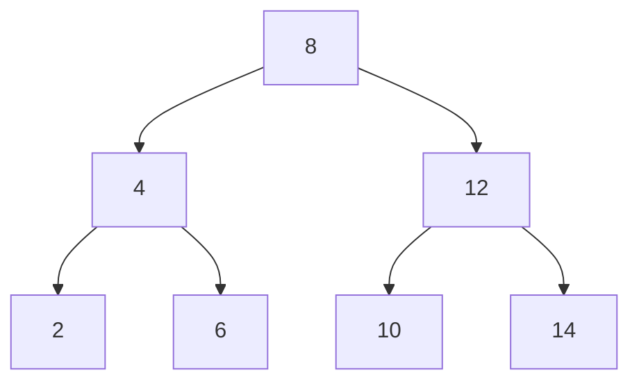
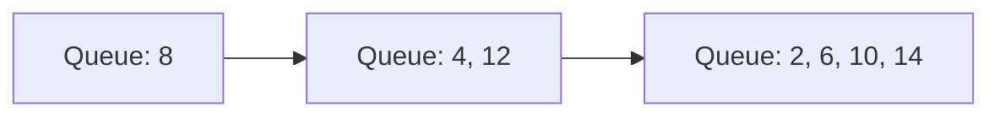
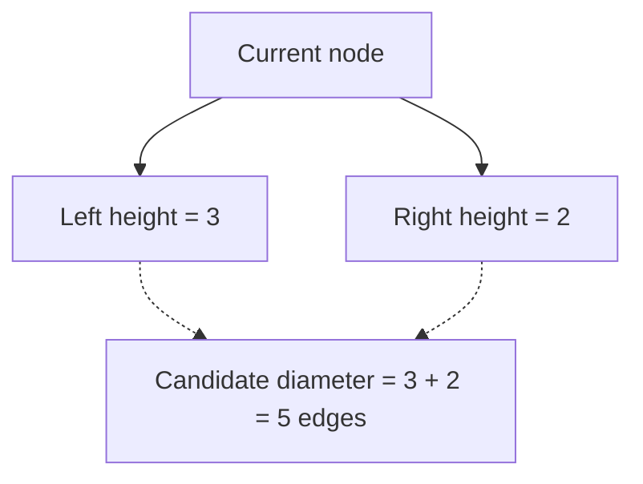
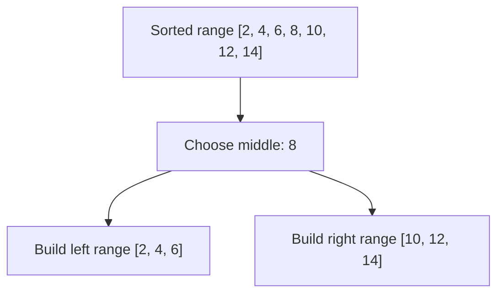
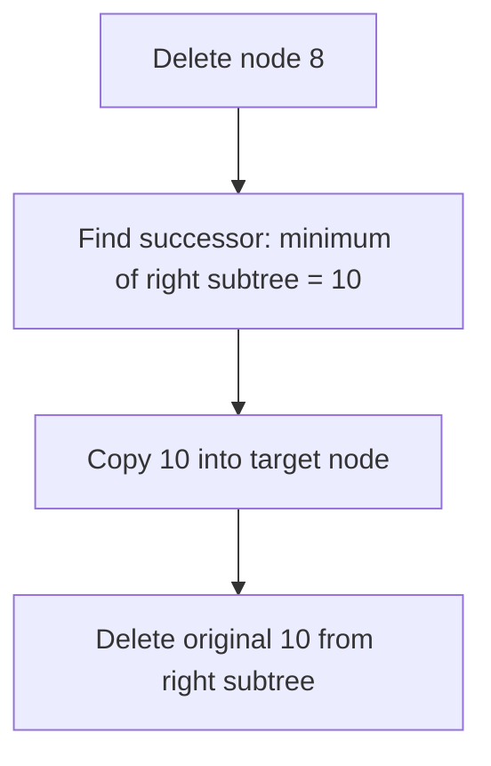
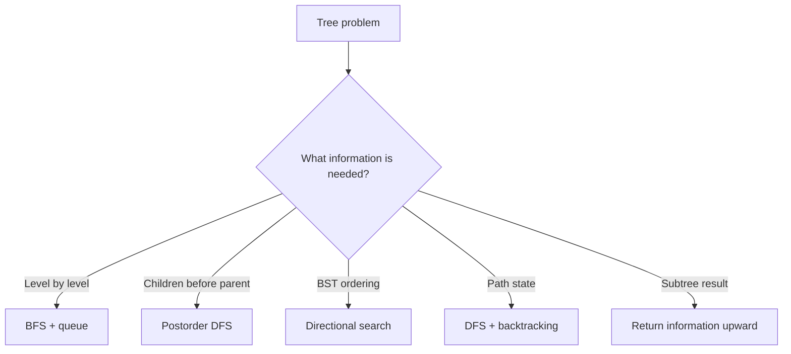

# Caelius Interview Preparation

## DSA Trees (Q156-Q170)

For tree problems, explain in this order:

```text
State -> Clarify tree properties -> Choose DFS/BFS -> Define recursion -> Code -> Complexity -> Test
```

Shared Java node:

```java
public static final class TreeNode {
    int value;
    TreeNode left;
    TreeNode right;

    TreeNode(int value) {
        this.value = value;
    }
}
```

Example tree used throughout:



---

# Q156. What Is a Binary Tree?

## Define

> A binary tree is a hierarchical data structure in which each node has at most two children, conventionally called `left` and `right`.

It is not necessarily sorted. A node may have zero, one, or two children.

## Important Terms

| Term | Meaning |
|---|---|
| Root | Topmost node |
| Leaf | Node with no children |
| Edge | Link between parent and child |
| Depth | Number of edges from root to a node |
| Height | Longest downward path from a node to a leaf |
| Subtree | A node together with all its descendants |

## Common Binary-Tree Types

| Type | Property |
|---|---|
| Full | Every node has either zero or two children |
| Complete | Every level is full except possibly the last, filled left to right |
| Perfect | Every internal node has two children and all leaves share a level |
| Balanced | Height stays logarithmic under the chosen balance rule |
| Skewed | Every node has only one child, behaving like a linked list |

## Real Use Case

Binary trees model hierarchical decisions, expression parsing, file-like structures, and search indexes. Heaps are complete binary trees; BSTs add an ordering rule.

## Interview Point

Do not say every binary tree supports `O(log n)` search. Without ordering or balance, search is `O(n)`.

---

# Q157. What Is a Binary Search Tree (BST)?

## Define

> A Binary Search Tree is a binary tree where every value in a node's left subtree is smaller and every value in its right subtree is larger, according to the chosen duplicate policy.

## Invariant

For every node:

```text
all(left subtree) < node.value < all(right subtree)
```

## Search

```java
public static TreeNode search(TreeNode root, int target) {
    TreeNode current = root;

    while (current != null) {
        if (target == current.value) {
            return current;
        }
        current = target < current.value
            ? current.left
            : current.right;
    }

    return null;
}
```

## Complexity

Let `h` be tree height:

- Search, insert, delete: `O(h)`
- Balanced BST: `O(log n)`
- Skewed BST: `O(n)`
- Extra search space: `O(1)` iteratively

## Real Use Case

BSTs are useful when data must remain ordered while supporting searches, predecessor/successor queries, and range queries. Java's `TreeMap` and `TreeSet` use a self-balancing Red-Black tree.

## Interview Point

Clarify how duplicates are handled: reject them, count occurrences, or consistently place them on one side.

---

# Q158. Inorder, Preorder, and Postorder Traversal

## State

> These are depth-first traversals. Their names describe when the current node is processed relative to its children.

```text
Inorder:   left -> node -> right
Preorder:  node -> left -> right
Postorder: left -> right -> node
```

For the example BST:

```text
Inorder:   2, 4, 6, 8, 10, 12, 14
Preorder:  8, 4, 2, 6, 12, 10, 14
Postorder: 2, 6, 4, 10, 14, 12, 8
```

## Recursive Code

```java
public static void inorder(TreeNode node, List<Integer> result) {
    if (node == null) {
        return;
    }
    inorder(node.left, result);
    result.add(node.value);
    inorder(node.right, result);
}

public static void preorder(TreeNode node, List<Integer> result) {
    if (node == null) {
        return;
    }
    result.add(node.value);
    preorder(node.left, result);
    preorder(node.right, result);
}

public static void postorder(TreeNode node, List<Integer> result) {
    if (node == null) {
        return;
    }
    postorder(node.left, result);
    postorder(node.right, result);
    result.add(node.value);
}
```

## Iterative Inorder

```java
public static List<Integer> inorderIterative(TreeNode root) {
    List<Integer> result = new ArrayList<>();
    Deque<TreeNode> stack = new ArrayDeque<>();
    TreeNode current = root;

    while (current != null || !stack.isEmpty()) {
        while (current != null) {
            stack.push(current);
            current = current.left;
        }

        current = stack.pop();
        result.add(current.value);
        current = current.right;
    }

    return result;
}
```

## Complexity

- Time: `O(n)` for every traversal
- Space: `O(h)` call stack or explicit stack
- Worst-case skewed tree: `O(n)` space

## Uses

- Inorder of a BST produces sorted order.
- Preorder is useful for copying or prefix serialization.
- Postorder is useful when children must be processed before the parent, such as deletion or directory-size calculation.

---

# Q159. Level-Order (BFS) Traversal

## State

> I will process the tree one level at a time with a queue. The queue contains discovered nodes whose children are not yet processed.

## Code

```java
public static List<List<Integer>> levelOrder(TreeNode root) {
    List<List<Integer>> levels = new ArrayList<>();
    if (root == null) {
        return levels;
    }

    Queue<TreeNode> queue = new ArrayDeque<>();
    queue.offer(root);

    while (!queue.isEmpty()) {
        int levelSize = queue.size();
        List<Integer> level = new ArrayList<>(levelSize);

        for (int i = 0; i < levelSize; i++) {
            TreeNode node = queue.poll();
            level.add(node.value);

            if (node.left != null) {
                queue.offer(node.left);
            }
            if (node.right != null) {
                queue.offer(node.right);
            }
        }

        levels.add(level);
    }

    return levels;
}
```

## Flow



## Complexity

- Time: `O(n)`
- Space: `O(w)`, where `w` is maximum tree width; worst case `O(n)`

## Interview Point

Capture `queue.size()` before processing a level. The queue changes as children are added.

---

# Q160. Height of a Binary Tree

## Clarify

Height has two common definitions:

- Number of nodes on the longest root-to-leaf path: empty tree `0`, leaf `1`.
- Number of edges on that path: empty tree `-1`, leaf `0`.

This answer uses the node-count definition.

## Approach

> The height of a node is one plus the greater height of its two children.

## Code

```java
public static int height(TreeNode root) {
    if (root == null) {
        return 0;
    }

    return 1 + Math.max(
        height(root.left),
        height(root.right)
    );
}
```

## Recurrence

```text
height(null) = 0
height(node) = 1 + max(height(left), height(right))
```

## Complexity

- Time: `O(n)` because every node is visited once
- Space: `O(h)` recursion stack

## Alternative

Level-order traversal can count levels iteratively. It is also `O(n)` time but uses `O(w)` queue space.

---

# Q161. Check If a Tree Is Balanced

## State

> A height-balanced tree requires the left and right subtree heights at every node to differ by at most one. I will compute height bottom-up and propagate a failure sentinel immediately.

## Why Not the Naive Approach?

Calling `height()` separately at every node repeatedly visits subtrees and can take `O(n^2)` on a skewed tree.

## Optimized Code

```java
public static boolean isBalanced(TreeNode root) {
    return balancedHeight(root) != -1;
}

private static int balancedHeight(TreeNode node) {
    if (node == null) {
        return 0;
    }

    int leftHeight = balancedHeight(node.left);
    if (leftHeight == -1) {
        return -1;
    }

    int rightHeight = balancedHeight(node.right);
    if (rightHeight == -1) {
        return -1;
    }

    if (Math.abs(leftHeight - rightHeight) > 1) {
        return -1;
    }

    return 1 + Math.max(leftHeight, rightHeight);
}
```

## Invariant

`balancedHeight(node)` returns:

- Actual subtree height if balanced.
- `-1` if any node in the subtree is unbalanced.

## Complexity

- Time: `O(n)`
- Space: `O(h)`

---

# Q162. Lowest Common Ancestor (LCA)

## Clarify

Ask whether the tree is:

1. A general binary tree.
2. A BST, where ordering enables a faster directional search.
3. Guaranteed to contain both target nodes.

## General Binary Tree

> If the current node is either target, I return it. If the left and right recursive searches both find a target, the current node is their lowest common ancestor.

```java
public static TreeNode lowestCommonAncestor(
        TreeNode root,
        TreeNode first,
        TreeNode second) {
    if (root == null || root == first || root == second) {
        return root;
    }

    TreeNode left = lowestCommonAncestor(root.left, first, second);
    TreeNode right = lowestCommonAncestor(root.right, first, second);

    if (left != null && right != null) {
        return root;
    }
    return left != null ? left : right;
}
```

## BST Optimization

```java
public static TreeNode lowestCommonAncestorBst(
        TreeNode root,
        int first,
        int second) {
    TreeNode current = root;

    while (current != null) {
        if (first < current.value && second < current.value) {
            current = current.left;
        } else if (first > current.value && second > current.value) {
            current = current.right;
        } else {
            return current;
        }
    }

    return null;
}
```

## Complexity

| Version | Time | Extra space |
|---|---:|---:|
| General tree | `O(n)` | `O(h)` |
| BST iterative | `O(h)` | `O(1)` |

## Interview Point

The general implementation assumes both nodes exist. If that is not guaranteed, separately verify presence or return a richer result containing found flags.

---

# Q163. Diameter of a Binary Tree

## Define

> The diameter is the length of the longest path between any two nodes. That path may or may not pass through the root.

Clarify whether length is measured in edges or nodes. This solution returns edges.

## Optimized Approach

At each node:

```text
path through node = left subtree height + right subtree height
```

Compute height and update the best diameter during the same postorder traversal.

## Code

```java
public static int diameter(TreeNode root) {
    int[] best = new int[1];
    diameterHeight(root, best);
    return best[0];
}

private static int diameterHeight(TreeNode node, int[] best) {
    if (node == null) {
        return 0;
    }

    int leftHeight = diameterHeight(node.left, best);
    int rightHeight = diameterHeight(node.right, best);

    best[0] = Math.max(best[0], leftHeight + rightHeight);
    return 1 + Math.max(leftHeight, rightHeight);
}
```

## Diagram



## Complexity

- Time: `O(n)`
- Space: `O(h)`

## Interview Point

Computing height independently for every node is `O(n^2)` in the worst case. Combine both calculations in one postorder traversal.

---

# Q164. Mirror or Invert a Binary Tree

## State

> Inverting a tree means swapping the left and right child of every node.

## Recursive Code

```java
public static TreeNode invert(TreeNode root) {
    if (root == null) {
        return null;
    }

    TreeNode originalLeft = root.left;
    root.left = invert(root.right);
    root.right = invert(originalLeft);
    return root;
}
```

## Iterative Code

```java
public static TreeNode invertIterative(TreeNode root) {
    if (root == null) {
        return null;
    }

    Queue<TreeNode> queue = new ArrayDeque<>();
    queue.offer(root);

    while (!queue.isEmpty()) {
        TreeNode node = queue.poll();
        TreeNode temporary = node.left;
        node.left = node.right;
        node.right = temporary;

        if (node.left != null) {
            queue.offer(node.left);
        }
        if (node.right != null) {
            queue.offer(node.right);
        }
    }

    return root;
}
```

## Complexity

- Time: `O(n)`
- Recursive space: `O(h)`
- Iterative space: `O(w)`

## Test Property

Inverting the same tree twice should restore the original structure.

---

# Q165. Check If Two Trees Are Identical

## State

> Two trees are identical when they have the same structure and equal values at every corresponding node.

## Code

```java
public static boolean areIdentical(TreeNode first, TreeNode second) {
    if (first == null && second == null) {
        return true;
    }
    if (first == null || second == null) {
        return false;
    }

    return first.value == second.value
        && areIdentical(first.left, second.left)
        && areIdentical(first.right, second.right);
}
```

## Complexity

- Time: `O(n)` when both trees contain `n` corresponding nodes
- Space: `O(h)` recursion stack

## Edge Cases

- Both roots are `null`: identical.
- Equal values but different structure: not identical.
- Same structure but one differing value: not identical.

---

# Q166. Path Sum Problem

## Clarify

The common version asks whether a **root-to-leaf** path sums to a target. A path ending at a non-leaf does not qualify.

## Approach

> I subtract each visited value from the remaining target. At a leaf, the path is valid only if the remaining target equals the leaf value.

## Code

```java
public static boolean hasPathSum(TreeNode root, long target) {
    if (root == null) {
        return false;
    }

    if (root.left == null && root.right == null) {
        return target == root.value;
    }

    long remaining = target - root.value;
    return hasPathSum(root.left, remaining)
        || hasPathSum(root.right, remaining);
}
```

## Complexity

- Time: `O(n)` worst case
- Space: `O(h)`

## Follow-Ups

- Return all matching paths: maintain a path list, copy it when a leaf matches, and backtrack.
- Count paths starting and ending anywhere: use prefix sums with a frequency map for `O(n)` time.

## Interview Point

Use `long` for the running target when node values or path lengths could overflow `int`.

---

# Q167. Count Leaf Nodes

## Define

> A leaf node has no left child and no right child.

## Recursive Code

```java
public static int countLeaves(TreeNode root) {
    if (root == null) {
        return 0;
    }
    if (root.left == null && root.right == null) {
        return 1;
    }

    return countLeaves(root.left) + countLeaves(root.right);
}
```

## Complexity

- Time: `O(n)`
- Space: `O(h)`

## Interview Point

A node with exactly one missing child is not a leaf.

---

# Q168. Serialize and Deserialize a Binary Tree

## State

> Serialization converts a tree into a storable string; deserialization reconstructs the same structure. Null markers are essential because values alone do not preserve shape.

This solution uses preorder traversal and `#` for null nodes.

## Example

```text
Tree:        1
            / \
           2   3

Serialized: 1,2,#,#,3,#,#
```

## Code

```java
public static String serialize(TreeNode root) {
    StringBuilder output = new StringBuilder();
    serializePreorder(root, output);
    return output.toString();
}

private static void serializePreorder(TreeNode node, StringBuilder output) {
    if (node == null) {
        output.append("#,");
        return;
    }

    output.append(node.value).append(',');
    serializePreorder(node.left, output);
    serializePreorder(node.right, output);
}

public static TreeNode deserialize(String data) {
    if (data == null || data.isBlank()) {
        return null;
    }

    Deque<String> tokens = new ArrayDeque<>(
        Arrays.asList(data.split(","))
    );
    return deserializePreorder(tokens);
}

private static TreeNode deserializePreorder(Deque<String> tokens) {
    if (tokens.isEmpty()) {
        throw new IllegalArgumentException("Invalid serialized tree");
    }

    String token = tokens.removeFirst();
    if ("#".equals(token)) {
        return null;
    }

    TreeNode node = new TreeNode(Integer.parseInt(token));
    node.left = deserializePreorder(tokens);
    node.right = deserializePreorder(tokens);
    return node;
}
```

## Complexity

- Serialize: `O(n)` time and `O(h)` recursion space
- Deserialize: `O(n)` time and `O(h)` recursion space
- Encoded output: `O(n)`

## Production Considerations

- Define escaping if values are strings.
- Validate malformed, missing, and extra tokens.
- Add versioning if the persisted format may evolve.
- For very deep trees, prefer an iterative format to avoid stack overflow.

---

# Q169. Convert a Sorted Array to a Balanced BST

## State

> Because the array is sorted, choosing the middle value as the root leaves approximately equal-sized ranges for the left and right subtrees, producing a height-balanced BST.

## Code

```java
public static TreeNode sortedArrayToBst(int[] values) {
    if (values == null) {
        throw new IllegalArgumentException("Values cannot be null");
    }
    return buildBalanced(values, 0, values.length - 1);
}

private static TreeNode buildBalanced(int[] values, int low, int high) {
    if (low > high) {
        return null;
    }

    int middle = low + (high - low) / 2;
    TreeNode root = new TreeNode(values[middle]);
    root.left = buildBalanced(values, low, middle - 1);
    root.right = buildBalanced(values, middle + 1, high);
    return root;
}
```

## Flow



## Complexity

- Time: `O(n)`
- Recursion space: `O(log n)` for the balanced result

## Interview Point

Use `low + (high - low) / 2` instead of `(low + high) / 2` to avoid integer overflow.

---

# Q170. Delete a Node From a BST

## State

> I first locate the node using BST ordering. Deletion then has three cases: no child, one child, or two children.

## Cases

```text
0 children: return null
1 child:    return the existing child
2 children: replace value with inorder successor, then delete successor
```

The inorder successor is the smallest value in the right subtree.

## Code

```java
public static TreeNode delete(TreeNode root, int target) {
    if (root == null) {
        return null;
    }

    if (target < root.value) {
        root.left = delete(root.left, target);
    } else if (target > root.value) {
        root.right = delete(root.right, target);
    } else {
        if (root.left == null) {
            return root.right;
        }
        if (root.right == null) {
            return root.left;
        }

        TreeNode successor = minimum(root.right);
        root.value = successor.value;
        root.right = delete(root.right, successor.value);
    }

    return root;
}

private static TreeNode minimum(TreeNode node) {
    TreeNode current = node;
    while (current.left != null) {
        current = current.left;
    }
    return current;
}
```

## Two-Child Case



## Complexity

- Time: `O(h)`
- Recursive space: `O(h)`
- Balanced BST: `O(log n)`
- Skewed BST: `O(n)`

## Interview Point

Returning and reassigning subtree roots is essential:

```java
root.left = delete(root.left, target);
```

Without reassignment, parent links may still reference a deleted node.

---

# Reusable Tree Patterns



## Choosing Traversal Order

| Need | Good starting point |
|---|---|
| Visit levels or shortest unweighted depth | BFS |
| Sorted BST values | Inorder |
| Copy/serialize root first | Preorder |
| Compute height, balance, diameter | Postorder |
| Search BST | Follow ordering, avoid full traversal |

## Recursion Design

Before coding, say what the helper returns:

```text
"This helper returns the height of the current subtree."
"This helper returns null when neither target exists below this node."
"This helper returns the reconstructed subtree root."
```

That return contract makes recursive code easier to verify.

---

# Tree Interview Testing Checklist

Test:

```text
empty tree
single-node tree
only left children
only right children
perfect balanced tree
incomplete tree
duplicate values if allowed
negative and extreme integer values
target at root
target absent
deep skewed tree
delete leaf
delete one-child node
delete two-child node
delete root
```

## Communication Example

> "I will use postorder because the parent result depends on both child results. My helper returns subtree height, and I will update the global diameter using the path that passes through the current node."

---

# DSA Trees Revision Sheet

| Question | Optimal/common pattern | Time | Extra space |
|---|---|---:|---:|
| Binary tree | Hierarchical node model | - | - |
| BST | Ordered directional search | `O(h)` | `O(1)` iterative |
| DFS traversals | Recursion or explicit stack | `O(n)` | `O(h)` |
| Level order | Queue BFS | `O(n)` | `O(w)` |
| Height | Postorder recursion | `O(n)` | `O(h)` |
| Balanced tree | Height with failure sentinel | `O(n)` | `O(h)` |
| LCA | Recursive split / BST ordering | `O(n)` / `O(h)` | `O(h)` / `O(1)` |
| Diameter | Height + best during postorder | `O(n)` | `O(h)` |
| Invert tree | Swap every node's children | `O(n)` | `O(h)` |
| Identical trees | Parallel DFS | `O(n)` | `O(h)` |
| Root-to-leaf path sum | DFS with remaining sum | `O(n)` | `O(h)` |
| Count leaves | DFS and leaf predicate | `O(n)` | `O(h)` |
| Serialize/deserialize | Preorder + null markers | `O(n)` | `O(n)` output |
| Sorted array to BST | Middle element recursively | `O(n)` | `O(log n)` |
| BST deletion | Search + three deletion cases | `O(h)` | `O(h)` |

## Common Interview Mistakes

- Assuming a binary tree is automatically a BST.
- Claiming BST operations are always `O(log n)` without discussing balance.
- Forgetting to clarify whether height or diameter counts nodes or edges.
- Recomputing subtree heights and creating an `O(n^2)` solution.
- Forgetting null markers during serialization.
- Treating a non-leaf prefix as a valid root-to-leaf path sum.
- Forgetting to reassign the subtree root after BST deletion.
- Using DFS when the question specifically needs levels or minimum unweighted depth.
- Ignoring recursion depth for a highly skewed tree.
