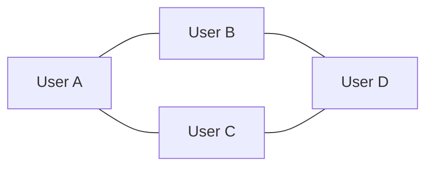
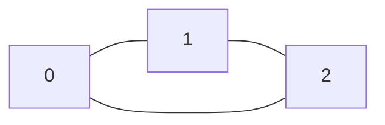
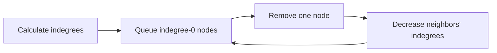
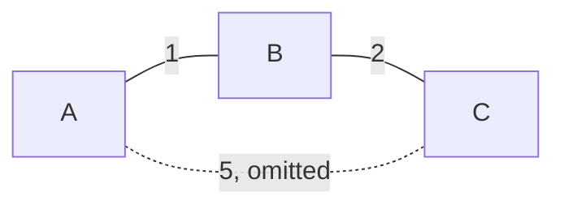
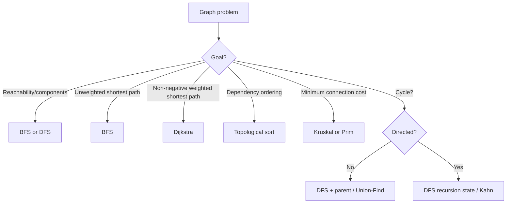

# Caelius Interview Preparation

## DSA Graphs (Q171-Q180)

For graph problems, speak in this order:

```text
State -> Clarify graph type -> Choose representation -> Choose traversal/algorithm -> Code -> Complexity -> Test
```

Always clarify:

- Directed or undirected?
- Weighted or unweighted?
- Can the graph be disconnected?
- Are negative edge weights possible?
- Is the input an edge list, adjacency list, or matrix?

---

# Q171. What Is a Graph? What Are Its Types?

## Define

> A graph is a set of vertices connected by edges. It models relationships where data is not restricted to a linear or hierarchical structure.

Mathematically:

```text
G = (V, E)
V = vertices
E = edges connecting vertices
```

## Common Types

| Type | Meaning |
|---|---|
| Undirected | Edge `u-v` can be traversed both ways |
| Directed | Edge `u -> v` has a direction |
| Weighted | Edges have costs, distances, or durations |
| Unweighted | Every edge is treated equally |
| Connected | Every vertex is reachable from every other vertex |
| Disconnected | Contains multiple separate components |
| Cyclic | Contains at least one cycle |
| Acyclic | Contains no cycle |
| DAG | Directed Acyclic Graph |

## Representations

### Adjacency List

```java
List<List<Integer>> graph = new ArrayList<>();
for (int i = 0; i < vertices; i++) {
    graph.add(new ArrayList<>());
}

graph.get(0).add(1);
graph.get(1).add(0); // Include for an undirected edge.
```

- Space: `O(V + E)`
- Best default for sparse graphs
- Efficient neighbor iteration

### Adjacency Matrix

```java
int[][] graph = new int[vertices][vertices];
graph[0][1] = 1;
graph[1][0] = 1;
```

- Space: `O(V^2)`
- Edge-existence lookup: `O(1)`
- Useful for dense graphs

## Diagram



## Real Use Case

Graphs model social networks, service dependencies, road networks, recommendations, web links, and workflow execution.

---

# Q172. Difference Between BFS and DFS

## Define

> BFS explores vertices level by level using a queue. DFS explores one path deeply before backtracking using recursion or a stack.

## Comparison

| Property | BFS | DFS |
|---|---|---|
| Core structure | Queue | Stack or recursion |
| Exploration | Level by level | Depth first |
| Unweighted shortest path | Yes | No guarantee |
| Typical uses | Minimum hops, levels | Cycles, components, backtracking |
| Space | `O(V)` | `O(V)` worst case |

## BFS Code

```java
public static List<Integer> bfs(
        List<List<Integer>> graph,
        int source) {
    boolean[] visited = new boolean[graph.size()];
    Queue<Integer> queue = new ArrayDeque<>();
    List<Integer> order = new ArrayList<>();

    visited[source] = true;
    queue.offer(source);

    while (!queue.isEmpty()) {
        int node = queue.poll();
        order.add(node);

        for (int neighbor : graph.get(node)) {
            if (!visited[neighbor]) {
                visited[neighbor] = true;
                queue.offer(neighbor);
            }
        }
    }

    return order;
}
```

## DFS Code

```java
public static List<Integer> dfs(
        List<List<Integer>> graph,
        int source) {
    boolean[] visited = new boolean[graph.size()];
    List<Integer> order = new ArrayList<>();
    dfsVisit(graph, source, visited, order);
    return order;
}

private static void dfsVisit(
        List<List<Integer>> graph,
        int node,
        boolean[] visited,
        List<Integer> order) {
    visited[node] = true;
    order.add(node);

    for (int neighbor : graph.get(node)) {
        if (!visited[neighbor]) {
            dfsVisit(graph, neighbor, visited, order);
        }
    }
}
```

## Complexity

With an adjacency list, both take:

- Time: `O(V + E)`
- Space: `O(V)`

## Interview Point

Mark a BFS node visited when enqueueing it, not when dequeueing it, to prevent duplicate queue entries.

---

# Q173. Detect a Cycle in an Undirected Graph

## State

> During DFS in an undirected graph, an edge back to the immediate parent is expected. A cycle exists when I reach an already visited neighbor that is not the current node's parent.

## Code

```java
public static boolean hasUndirectedCycle(
        List<List<Integer>> graph) {
    boolean[] visited = new boolean[graph.size()];

    for (int node = 0; node < graph.size(); node++) {
        if (!visited[node]
                && hasUndirectedCycleDfs(graph, node, -1, visited)) {
            return true;
        }
    }

    return false;
}

private static boolean hasUndirectedCycleDfs(
        List<List<Integer>> graph,
        int node,
        int parent,
        boolean[] visited) {
    visited[node] = true;

    for (int neighbor : graph.get(node)) {
        if (!visited[neighbor]) {
            if (hasUndirectedCycleDfs(graph, neighbor, node, visited)) {
                return true;
            }
        } else if (neighbor != parent) {
            return true;
        }
    }

    return false;
}
```

## Diagram



From node `2`, finding visited node `0` is not merely returning to parent `1`, so a cycle exists.

## Complexity

- Time: `O(V + E)`
- Space: `O(V)`

## Interview Point

The outer loop is required because the graph may be disconnected.

---

# Q174. Detect a Cycle in a Directed Graph

## State

> In a directed graph, a cycle exists when DFS reaches a node that is still on the current recursion path. A globally visited node that is no longer on the path does not prove a cycle.

## Three-State Approach

```text
0 = unvisited
1 = visiting, currently on DFS path
2 = fully processed
```

## Code

```java
public static boolean hasDirectedCycle(
        List<List<Integer>> graph) {
    int[] state = new int[graph.size()];

    for (int node = 0; node < graph.size(); node++) {
        if (state[node] == 0 && hasDirectedCycleDfs(graph, node, state)) {
            return true;
        }
    }

    return false;
}

private static boolean hasDirectedCycleDfs(
        List<List<Integer>> graph,
        int node,
        int[] state) {
    state[node] = 1;

    for (int neighbor : graph.get(node)) {
        if (state[neighbor] == 1) {
            return true;
        }
        if (state[neighbor] == 0
                && hasDirectedCycleDfs(graph, neighbor, state)) {
            return true;
        }
    }

    state[node] = 2;
    return false;
}
```

## Why Undirected Logic Does Not Work

A directed edge to a previously visited node might point to a fully completed branch. Only an edge to a node currently in the recursion path is a back edge proving a cycle.

## Complexity

- Time: `O(V + E)`
- Space: `O(V)`

---

# Q175. Topological Sort

## Define

> A topological ordering places every directed edge `u -> v` such that `u` appears before `v`. It exists only for a DAG.

## Kahn's Algorithm

> I will track each node's indegree, enqueue nodes with no remaining prerequisites, and remove their outgoing edges as they are processed.

## Code

```java
public static List<Integer> topologicalSort(
        List<List<Integer>> graph) {
    int vertices = graph.size();
    int[] indegree = new int[vertices];

    for (int node = 0; node < vertices; node++) {
        for (int neighbor : graph.get(node)) {
            indegree[neighbor]++;
        }
    }

    Queue<Integer> queue = new ArrayDeque<>();
    for (int node = 0; node < vertices; node++) {
        if (indegree[node] == 0) {
            queue.offer(node);
        }
    }

    List<Integer> order = new ArrayList<>(vertices);
    while (!queue.isEmpty()) {
        int node = queue.poll();
        order.add(node);

        for (int neighbor : graph.get(node)) {
            indegree[neighbor]--;
            if (indegree[neighbor] == 0) {
                queue.offer(neighbor);
            }
        }
    }

    if (order.size() != vertices) {
        throw new IllegalArgumentException("Graph contains a cycle");
    }

    return order;
}
```

## Flow



## Complexity

- Time: `O(V + E)`
- Space: `O(V)`

## Real Use Case

Topological sort schedules courses from prerequisites, deployment steps, build tasks, and dependent jobs.

## Interview Point

Multiple valid topological orders may exist.

---

# Q176. Shortest Path Using BFS

## State

> In an unweighted graph, BFS finds the shortest path by number of edges because it visits nodes in increasing distance from the source.

## Code

```java
public static int[] shortestDistances(
        List<List<Integer>> graph,
        int source) {
    int[] distance = new int[graph.size()];
    Arrays.fill(distance, -1);

    Queue<Integer> queue = new ArrayDeque<>();
    distance[source] = 0;
    queue.offer(source);

    while (!queue.isEmpty()) {
        int node = queue.poll();

        for (int neighbor : graph.get(node)) {
            if (distance[neighbor] == -1) {
                distance[neighbor] = distance[node] + 1;
                queue.offer(neighbor);
            }
        }
    }

    return distance;
}
```

## Reconstructing a Path

Store a `parent[]` value when first discovering each node. Starting at the destination, follow parents back to the source and reverse the result.

## Complexity

- Time: `O(V + E)`
- Space: `O(V)`

## Interview Point

BFS is not correct for arbitrary weighted edges. It is correct when all edges have equal cost.

---

# Q177. Dijkstra's Algorithm

## Define

> Dijkstra's algorithm finds shortest paths from one source in a weighted graph whose edge weights are non-negative.

## Approach

Use a min-priority queue containing the best known candidate distance. Relax an edge when traveling through the current node improves its neighbor's distance.

## Code

```java
public record Edge(int to, int weight) {}
public record NodeDistance(int node, long distance) {}

public static long[] dijkstra(
        List<List<Edge>> graph,
        int source) {
    long[] distance = new long[graph.size()];
    Arrays.fill(distance, Long.MAX_VALUE);

    PriorityQueue<NodeDistance> queue = new PriorityQueue<>(
        Comparator.comparingLong(NodeDistance::distance)
    );

    distance[source] = 0;
    queue.offer(new NodeDistance(source, 0));

    while (!queue.isEmpty()) {
        NodeDistance current = queue.poll();
        int node = current.node();

        if (current.distance() != distance[node]) {
            continue;
        }

        for (Edge edge : graph.get(node)) {
            if (edge.weight() < 0) {
                throw new IllegalArgumentException(
                    "Dijkstra requires non-negative weights"
                );
            }

            long candidate = distance[node] + edge.weight();
            if (candidate < distance[edge.to()]) {
                distance[edge.to()] = candidate;
                queue.offer(new NodeDistance(edge.to(), candidate));
            }
        }
    }

    return distance;
}
```

## Relaxation

```text
if distance[u] + weight(u, v) < distance[v]:
    distance[v] = distance[u] + weight(u, v)
```

## Complexity

Using an adjacency list and binary heap:

- Time: `O((V + E) log V)`, commonly written `O(E log V)`
- Space: `O(V + E)`

## Interview Point

Dijkstra fails with negative edge weights because a finalized shortest distance could later be improved. Use Bellman-Ford when negative weights are possible.

---

# Q178. What Is a Spanning Tree?

## Define

> A spanning tree of a connected, undirected graph includes every vertex, remains connected, and contains no cycle.

## Properties

For a graph with `V` vertices, every spanning tree:

- Has exactly `V - 1` edges.
- Is connected.
- Is acyclic.
- Becomes disconnected if any edge is removed.
- Gains a cycle if any extra graph edge is added.

## Minimum Spanning Tree

> A Minimum Spanning Tree (MST) is a spanning tree with the minimum total edge weight.

An MST connects all vertices cheaply; it does not necessarily give the shortest path between every pair.

## Diagram



The selected solid edges connect all three vertices with total weight `3`.

## Real Use Case

MSTs help design low-cost networks such as cables, roads, pipelines, and cluster connections.

---

# Q179. Kruskal's and Prim's Algorithms

## Define

Both find an MST of a connected, weighted, undirected graph.

| Kruskal | Prim |
|---|---|
| Selects globally cheapest safe edge | Grows one tree from a start vertex |
| Uses edge sorting + Union-Find | Uses adjacency list + priority queue |
| Often convenient for sparse edge-list input | Often convenient for connected adjacency-list input |

## Kruskal's Algorithm

```java
public record WeightedEdge(int from, int to, int weight) {}

public static long kruskalMst(
        int vertices,
        List<WeightedEdge> edges) {
    edges.sort(Comparator.comparingInt(WeightedEdge::weight));
    DisjointSet dsu = new DisjointSet(vertices);
    long total = 0;
    int selected = 0;

    for (WeightedEdge edge : edges) {
        if (dsu.union(edge.from(), edge.to())) {
            total += edge.weight();
            selected++;
            if (selected == vertices - 1) {
                break;
            }
        }
    }

    if (selected != vertices - 1) {
        throw new IllegalArgumentException("Graph is disconnected");
    }
    return total;
}

public static final class DisjointSet {
    private final int[] parent;
    private final int[] rank;

    DisjointSet(int size) {
        parent = new int[size];
        rank = new int[size];
        for (int i = 0; i < size; i++) {
            parent[i] = i;
        }
    }

    int find(int node) {
        if (parent[node] != node) {
            parent[node] = find(parent[node]);
        }
        return parent[node];
    }

    boolean union(int first, int second) {
        int rootA = find(first);
        int rootB = find(second);
        if (rootA == rootB) {
            return false;
        }

        if (rank[rootA] < rank[rootB]) {
            parent[rootA] = rootB;
        } else if (rank[rootA] > rank[rootB]) {
            parent[rootB] = rootA;
        } else {
            parent[rootB] = rootA;
            rank[rootA]++;
        }
        return true;
    }
}
```

## Prim's Algorithm

```java
public static long primMst(List<List<Edge>> graph) {
    if (graph.isEmpty()) {
        return 0;
    }

    boolean[] included = new boolean[graph.size()];
    PriorityQueue<NodeDistance> queue = new PriorityQueue<>(
        Comparator.comparingLong(NodeDistance::distance)
    );
    queue.offer(new NodeDistance(0, 0));

    long total = 0;
    int selected = 0;

    while (!queue.isEmpty()) {
        NodeDistance current = queue.poll();
        if (included[current.node()]) {
            continue;
        }

        included[current.node()] = true;
        total += current.distance();
        selected++;

        for (Edge edge : graph.get(current.node())) {
            if (!included[edge.to()]) {
                queue.offer(new NodeDistance(edge.to(), edge.weight()));
            }
        }
    }

    if (selected != graph.size()) {
        throw new IllegalArgumentException("Graph is disconnected");
    }
    return total;
}
```

## Complexity

- Kruskal: `O(E log E)` due to sorting
- Prim with binary heap: `O(E log V)`

## Interview Point

Kruskal prevents cycles using Union-Find. Prim prevents cycles by adding only vertices outside the growing tree.

---

# Q180. Connected Components in a Graph

## Define

> A connected component in an undirected graph is a maximal group of vertices where every pair is reachable through some path.

## Approach

> Each BFS or DFS started from an unvisited node discovers exactly one component.

## Code

```java
public static int countComponents(List<List<Integer>> graph) {
    boolean[] visited = new boolean[graph.size()];
    int components = 0;

    for (int node = 0; node < graph.size(); node++) {
        if (!visited[node]) {
            components++;
            markComponent(graph, node, visited);
        }
    }

    return components;
}

private static void markComponent(
        List<List<Integer>> graph,
        int start,
        boolean[] visited) {
    Deque<Integer> stack = new ArrayDeque<>();
    stack.push(start);
    visited[start] = true;

    while (!stack.isEmpty()) {
        int node = stack.pop();
        for (int neighbor : graph.get(node)) {
            if (!visited[neighbor]) {
                visited[neighbor] = true;
                stack.push(neighbor);
            }
        }
    }
}
```

## Complexity

- Time: `O(V + E)`
- Space: `O(V)`

## Follow-Up

For a directed graph:

- Weakly connected components ignore edge direction.
- Strongly connected components require mutual reachability; use Kosaraju's or Tarjan's algorithm.

---

# Reusable Graph Decision Guide



# Graph Interview Testing Checklist

Test:

```text
zero vertices
one isolated vertex
disconnected graph
self-loop
parallel edges if allowed
simple chain
cycle
complete graph
directed edge direction
unreachable destination
zero-weight edge
negative edge for Dijkstra rejection
multiple valid topological orders
disconnected input for MST
```

# DSA Graphs Revision Sheet

| Question | Optimal/common pattern | Time | Extra space |
|---|---|---:|---:|
| Graph representation | Adjacency list for sparse graph | - | `O(V+E)` |
| BFS vs DFS | Queue vs stack/recursion | `O(V+E)` | `O(V)` |
| Undirected cycle | DFS + parent | `O(V+E)` | `O(V)` |
| Directed cycle | DFS three-state tracking | `O(V+E)` | `O(V)` |
| Topological sort | Kahn's indegree BFS | `O(V+E)` | `O(V)` |
| Unweighted shortest path | BFS distance | `O(V+E)` | `O(V)` |
| Dijkstra | Min-heap + relaxation | `O(E log V)` | `O(V+E)` |
| Spanning tree | Connected, acyclic, `V-1` edges | - | - |
| Kruskal | Sort edges + Union-Find | `O(E log E)` | `O(V)` |
| Prim | Grow tree with min-heap | `O(E log V)` | `O(V+E)` |
| Connected components | Start traversal per unvisited node | `O(V+E)` | `O(V)` |

## Common Interview Mistakes

- Forgetting to clarify directed versus undirected.
- Running traversal only from vertex `0` when the graph may be disconnected.
- Using DFS to claim an unweighted shortest path.
- Treating an undirected parent edge as a cycle.
- Using only a visited set for directed cycle detection.
- Applying Dijkstra to negative weights.
- Confusing an MST with a shortest-path tree.
- Forgetting to detect a cycle when topological output contains fewer than `V` nodes.
