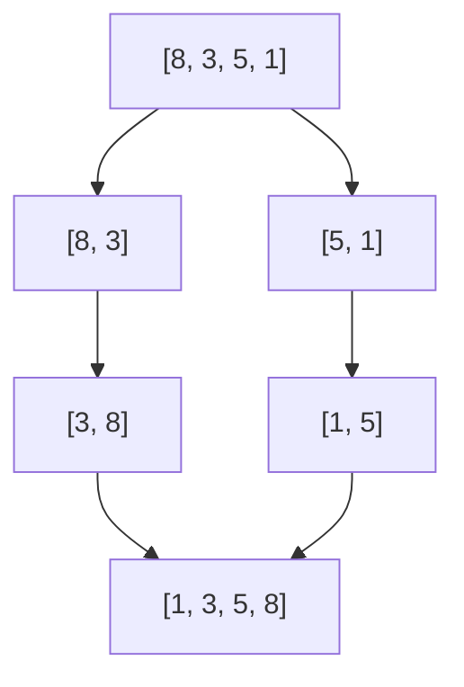
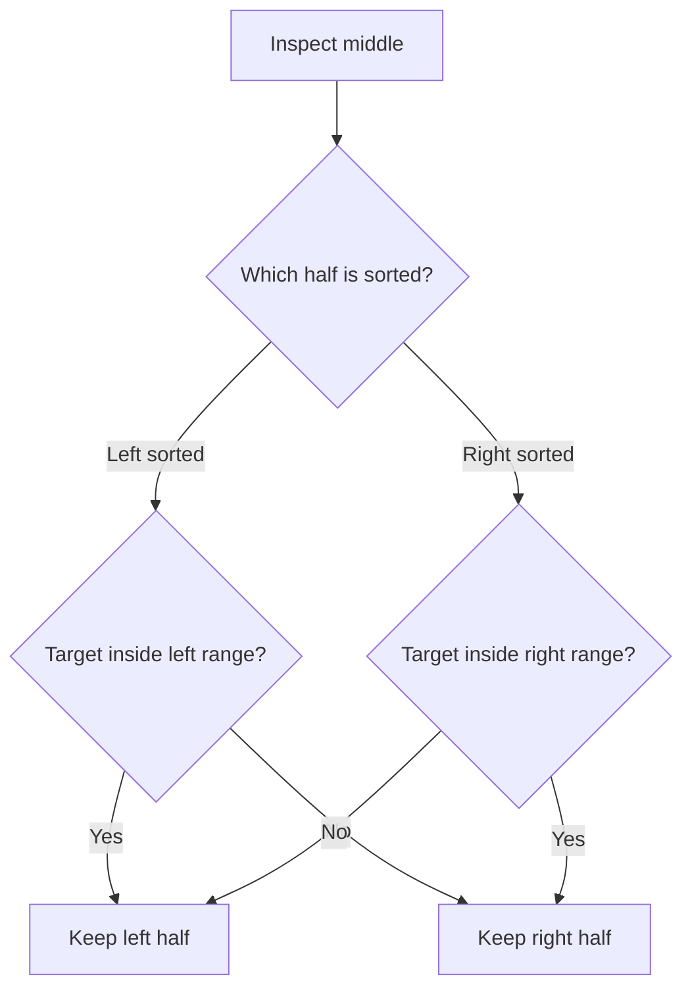
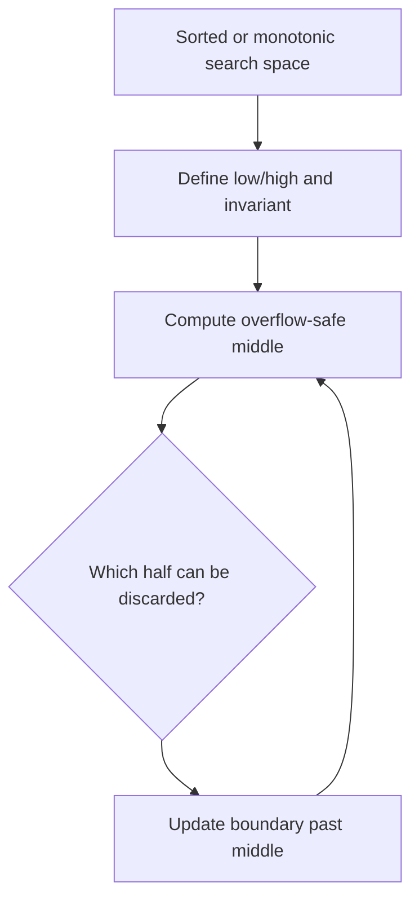

# Caelius Interview Preparation

## DSA Sorting and Searching (Q181-Q190)

For sorting and searching questions, speak in this order:

```text
State -> Identify invariant -> Explain one iteration -> Code -> Complexity -> Tradeoffs -> Test
```

Before choosing a sorting algorithm, clarify:

- Is the input already or nearly sorted?
- Must the algorithm be stable?
- Must it be in-place?
- Is worst-case performance important?
- Is the data stored in an array, linked list, or external file?

---

# Q181. Bubble Sort - Time Complexity and Code

## State

> Bubble sort repeatedly compares adjacent elements and swaps them when they are out of order. After each complete pass, the largest unsorted value reaches its final position.

## Invariant

After pass `p`, the final `p` elements are correctly sorted.

## Code

```java
public static void bubbleSort(int[] values) {
    if (values == null) {
        throw new IllegalArgumentException("Values cannot be null");
    }

    for (int end = values.length - 1; end > 0; end--) {
        boolean swapped = false;

        for (int i = 0; i < end; i++) {
            if (values[i] > values[i + 1]) {
                swap(values, i, i + 1);
                swapped = true;
            }
        }

        if (!swapped) {
            return;
        }
    }
}

private static void swap(int[] values, int first, int second) {
    int temporary = values[first];
    values[first] = values[second];
    values[second] = temporary;
}
```

## Trace

```text
[5, 1, 4, 2]
compare and swap adjacent values
[1, 4, 2, 5]  -> 5 is final
[1, 2, 4, 5]  -> sorted early
```

## Complexity

| Case | Time |
|---|---:|
| Best, with early-exit flag | `O(n)` |
| Average | `O(n^2)` |
| Worst | `O(n^2)` |
| Extra space | `O(1)` |

## Properties

- Stable: Yes, when swapping only strictly greater values.
- In-place: Yes.
- Practical use: Mostly educational; inefficient for large input.

---

# Q182. Selection Sort - Time Complexity and Code

## State

> Selection sort repeatedly finds the minimum value in the unsorted region and places it at the next sorted position.

## Invariant

Before iteration `i`, indices `0` through `i - 1` contain the smallest values in final sorted order.

## Code

```java
public static void selectionSort(int[] values) {
    if (values == null) {
        throw new IllegalArgumentException("Values cannot be null");
    }

    for (int i = 0; i < values.length - 1; i++) {
        int minimumIndex = i;

        for (int j = i + 1; j < values.length; j++) {
            if (values[j] < values[minimumIndex]) {
                minimumIndex = j;
            }
        }

        if (minimumIndex != i) {
            swap(values, i, minimumIndex);
        }
    }
}
```

## Complexity

| Case | Time |
|---|---:|
| Best | `O(n^2)` |
| Average | `O(n^2)` |
| Worst | `O(n^2)` |
| Extra space | `O(1)` |

## Properties

- Standard implementation is not stable.
- In-place.
- Performs at most `O(n)` swaps, useful when writes are expensive.

## Interview Point

Selection sort does not become asymptotically faster on sorted input because it still scans the unsorted suffix to confirm each minimum.

---

# Q183. Insertion Sort - Time Complexity and Code

## State

> Insertion sort grows a sorted prefix by taking the next value and shifting larger prefix elements right until the value reaches its correct position.

## Invariant

Before processing index `i`, the range `0` through `i - 1` is sorted.

## Code

```java
public static void insertionSort(int[] values) {
    if (values == null) {
        throw new IllegalArgumentException("Values cannot be null");
    }

    for (int i = 1; i < values.length; i++) {
        int current = values[i];
        int position = i - 1;

        while (position >= 0 && values[position] > current) {
            values[position + 1] = values[position];
            position--;
        }

        values[position + 1] = current;
    }
}
```

## Trace

```text
sorted prefix | current | unprocessed
[2, 5]        | 3       | [4]
shift 5 right
[2, 3, 5]     | 4
```

## Complexity

| Case | Time |
|---|---:|
| Best, already sorted | `O(n)` |
| Average | `O(n^2)` |
| Worst, reverse sorted | `O(n^2)` |
| Extra space | `O(1)` |

## Properties

- Stable.
- In-place.
- Adaptive and efficient for small or nearly sorted inputs.

## Real Use

Hybrid sorting algorithms often use insertion sort for small subarrays because its low overhead performs well at small sizes.

---

# Q184. Merge Sort - Time Complexity and Code

## State

> Merge sort divides the array into halves, recursively sorts each half, and merges the two sorted results.

## Approach



## Code

```java
public static void mergeSort(int[] values) {
    if (values == null) {
        throw new IllegalArgumentException("Values cannot be null");
    }

    int[] auxiliary = new int[values.length];
    mergeSort(values, auxiliary, 0, values.length - 1);
}

private static void mergeSort(
        int[] values,
        int[] auxiliary,
        int low,
        int high) {
    if (low >= high) {
        return;
    }

    int middle = low + (high - low) / 2;
    mergeSort(values, auxiliary, low, middle);
    mergeSort(values, auxiliary, middle + 1, high);
    merge(values, auxiliary, low, middle, high);
}

private static void merge(
        int[] values,
        int[] auxiliary,
        int low,
        int middle,
        int high) {
    System.arraycopy(values, low, auxiliary, low, high - low + 1);

    int left = low;
    int right = middle + 1;
    int destination = low;

    while (left <= middle && right <= high) {
        if (auxiliary[left] <= auxiliary[right]) {
            values[destination++] = auxiliary[left++];
        } else {
            values[destination++] = auxiliary[right++];
        }
    }

    while (left <= middle) {
        values[destination++] = auxiliary[left++];
    }
}
```

## Complexity

- Best, average, worst time: `O(n log n)`
- Array extra space: `O(n)`
- Recursion depth: `O(log n)`

## Properties

- Stable when equal left-side values are selected first.
- Not in-place for the standard array implementation.
- Predictable worst-case performance.

## Interview Point

The remaining right half does not need copying because it is already in its final positions.

---

# Q185. Quick Sort - Time Complexity and Code

## State

> Quick sort chooses a pivot, partitions values so smaller elements precede it and larger elements follow it, then recursively sorts both partitions.

## Lomuto Partition Code

```java
public static void quickSort(int[] values) {
    if (values == null) {
        throw new IllegalArgumentException("Values cannot be null");
    }
    quickSort(values, 0, values.length - 1);
}

private static void quickSort(int[] values, int low, int high) {
    if (low >= high) {
        return;
    }

    int pivotIndex = partition(values, low, high);
    quickSort(values, low, pivotIndex - 1);
    quickSort(values, pivotIndex + 1, high);
}

private static int partition(int[] values, int low, int high) {
    int pivot = values[high];
    int smallerEnd = low;

    for (int current = low; current < high; current++) {
        if (values[current] < pivot) {
            swap(values, smallerEnd, current);
            smallerEnd++;
        }
    }

    swap(values, smallerEnd, high);
    return smallerEnd;
}
```

## Partition Invariant

During partition:

```text
[values < pivot] [values >= pivot not finished] [pivot]
 low             current                       high
```

## Complexity

| Case | Time |
|---|---:|
| Best | `O(n log n)` |
| Average | `O(n log n)` |
| Worst, repeatedly poor pivots | `O(n^2)` |
| Expected recursion space | `O(log n)` |
| Worst recursion space | `O(n)` |

## Properties

- Usually in-place apart from recursion.
- Not stable in the standard implementation.
- Often faster than merge sort for arrays due to cache locality and low constants.

## Optimize

Randomize the pivot or use median-of-three to reduce the chance of repeated worst-case partitions. Three-way partitioning performs better when duplicates are common.

---

# Q186. When Is Merge Sort Preferred Over Quick Sort?

## Answer

> Prefer merge sort when stable ordering, guaranteed `O(n log n)` time, linked-list sorting, or external sorting matters more than array memory usage.

## Comparison

| Requirement | Prefer |
|---|---|
| Stable sorting | Merge sort |
| Guaranteed `O(n log n)` worst case | Merge sort |
| Sorting linked lists | Merge sort |
| Data too large for memory / external files | Merge sort |
| Fast general-purpose in-memory array sorting | Often quick sort |
| Minimal extra array space | Quick sort |
| Good cache locality | Often quick sort |

## Why Linked Lists Favor Merge Sort

Linked lists can split and merge by pointer rewiring without allocating an `O(n)` auxiliary array. Quick sort depends more heavily on efficient random access and partition swaps.

## Why External Sorting Favors Merge Sort

Large sorted runs can be created independently and then merged sequentially, which works well with disk access.

## Interview Point

Do not say one is universally better. State the workload and constraints driving the choice.

---

# Q187. What Is Heap Sort?

## Define

> Heap sort builds a max heap, repeatedly moves the maximum root to the end, and restores the heap property in the remaining prefix.

## Invariant

During extraction:

```text
[max heap of unsorted values] [sorted suffix]
```

## Code

```java
public static void heapSort(int[] values) {
    if (values == null) {
        throw new IllegalArgumentException("Values cannot be null");
    }

    for (int parent = values.length / 2 - 1; parent >= 0; parent--) {
        siftDown(values, parent, values.length);
    }

    for (int end = values.length - 1; end > 0; end--) {
        swap(values, 0, end);
        siftDown(values, 0, end);
    }
}

private static void siftDown(int[] values, int parent, int size) {
    while (true) {
        int left = 2 * parent + 1;
        int right = left + 1;
        int largest = parent;

        if (left < size && values[left] > values[largest]) {
            largest = left;
        }
        if (right < size && values[right] > values[largest]) {
            largest = right;
        }
        if (largest == parent) {
            return;
        }

        swap(values, parent, largest);
        parent = largest;
    }
}
```

## Complexity

- Build heap: `O(n)`
- Each of `n` extractions: `O(log n)`
- Total: `O(n log n)` in every case
- Extra space: `O(1)`

## Properties

- In-place.
- Not stable.
- Guaranteed worst-case `O(n log n)`.
- Usually poorer cache locality than quick sort.

## Interview Point

Building the heap bottom-up is `O(n)`, not `O(n log n)`.

---

# Q188. Binary Search - Iterative and Recursive

## State

> Binary search works on sorted data. At every step, I compare the target with the middle value and discard the half that cannot contain the target.

## Iterative Code

```java
public static int binarySearch(int[] values, int target) {
    int low = 0;
    int high = values.length - 1;

    while (low <= high) {
        int middle = low + (high - low) / 2;

        if (values[middle] == target) {
            return middle;
        }
        if (values[middle] < target) {
            low = middle + 1;
        } else {
            high = middle - 1;
        }
    }

    return -1;
}
```

## Recursive Code

```java
public static int binarySearchRecursive(
        int[] values,
        int target,
        int low,
        int high) {
    if (low > high) {
        return -1;
    }

    int middle = low + (high - low) / 2;
    if (values[middle] == target) {
        return middle;
    }

    if (values[middle] < target) {
        return binarySearchRecursive(values, target, middle + 1, high);
    }
    return binarySearchRecursive(values, target, low, middle - 1);
}
```

## Invariant

If the target exists, it remains inside the inclusive range `[low, high]`.

## Complexity

| Version | Time | Extra space |
|---|---:|---:|
| Iterative | `O(log n)` | `O(1)` |
| Recursive | `O(log n)` | `O(log n)` |

## Interview Point

Use `low + (high - low) / 2` to avoid overflow, and be consistent about inclusive versus exclusive boundaries.

---

# Q189. Search in a Rotated Sorted Array

## Clarify

This common version assumes distinct values. With duplicates, deciding which half is sorted can become ambiguous and worst-case time can degrade to `O(n)`.

## State

> At least one half around the middle is sorted. I will identify that sorted half and determine whether the target lies inside it.

## Code

```java
public static int searchRotated(int[] values, int target) {
    int low = 0;
    int high = values.length - 1;

    while (low <= high) {
        int middle = low + (high - low) / 2;
        if (values[middle] == target) {
            return middle;
        }

        if (values[low] <= values[middle]) {
            if (values[low] <= target && target < values[middle]) {
                high = middle - 1;
            } else {
                low = middle + 1;
            }
        } else {
            if (values[middle] < target && target <= values[high]) {
                low = middle + 1;
            } else {
                high = middle - 1;
            }
        }
    }

    return -1;
}
```

## Flow



## Complexity

- Time: `O(log n)` for distinct values
- Extra space: `O(1)`

## Interview Point

The sorted-half range checks must use carefully chosen inclusive and exclusive comparisons so boundaries do not overlap incorrectly.

---

# Q190. Find First and Last Position of an Element in a Sorted Array

## State

> I will run modified binary search twice: once biased left for the first occurrence and once biased right for the last occurrence.

## Code

```java
public static int[] firstAndLast(int[] values, int target) {
    return new int[] {
        boundary(values, target, true),
        boundary(values, target, false)
    };
}

private static int boundary(
        int[] values,
        int target,
        boolean findFirst) {
    int low = 0;
    int high = values.length - 1;
    int result = -1;

    while (low <= high) {
        int middle = low + (high - low) / 2;

        if (values[middle] == target) {
            result = middle;
            if (findFirst) {
                high = middle - 1;
            } else {
                low = middle + 1;
            }
        } else if (values[middle] < target) {
            low = middle + 1;
        } else {
            high = middle - 1;
        }
    }

    return result;
}
```

## Why Continue After Finding Target?

A normal binary search may return any matching index. Saving the match and continuing left or right finds the required boundary.

## Complexity

- Time: `O(log n)`
- Extra space: `O(1)`

## Related Pattern

Lower bound finds the first index with value greater than or equal to the target. Upper bound finds the first index with value greater than the target.

---

# Sorting Algorithm Comparison

| Algorithm | Best | Average | Worst | Extra space | Stable | In-place |
|---|---:|---:|---:|---:|---|---|
| Bubble | `O(n)` | `O(n^2)` | `O(n^2)` | `O(1)` | Yes | Yes |
| Selection | `O(n^2)` | `O(n^2)` | `O(n^2)` | `O(1)` | No | Yes |
| Insertion | `O(n)` | `O(n^2)` | `O(n^2)` | `O(1)` | Yes | Yes |
| Merge | `O(n log n)` | `O(n log n)` | `O(n log n)` | `O(n)` | Yes | No |
| Quick | `O(n log n)` | `O(n log n)` | `O(n^2)` | `O(log n)` expected | No | Usually |
| Heap | `O(n log n)` | `O(n log n)` | `O(n log n)` | `O(1)` | No | Yes |

# Reusable Binary Search Template



Ask:

```text
What does low mean?
What does high mean?
Are boundaries inclusive?
Can middle remain in the next range?
What answer should be returned when absent?
```

# Sorting and Searching Testing Checklist

Test:

```text
null input policy
empty array
single element
already sorted
reverse sorted
all equal
duplicate values
negative values
minimum and maximum integer values
target at first index
target at last index
target absent
rotation at index zero
rotation near end
```

# DSA Sorting and Searching Revision Sheet

| Question | Core pattern | Time | Extra space |
|---|---|---:|---:|
| Bubble sort | Swap adjacent inversions | `O(n^2)` | `O(1)` |
| Selection sort | Select minimum for prefix | `O(n^2)` | `O(1)` |
| Insertion sort | Insert into sorted prefix | `O(n^2)` | `O(1)` |
| Merge sort | Divide and merge | `O(n log n)` | `O(n)` |
| Quick sort | Partition around pivot | Average `O(n log n)` | Expected `O(log n)` |
| Merge vs quick | Stability/worst case vs memory/locality | - | - |
| Heap sort | Heapify and extract maximum | `O(n log n)` | `O(1)` |
| Binary search | Discard impossible half | `O(log n)` | `O(1)` iterative |
| Rotated search | Identify sorted half | `O(log n)` | `O(1)` |
| First and last position | Left/right biased searches | `O(log n)` | `O(1)` |

## Common Interview Mistakes

- Stating only average complexity and ignoring worst case.
- Saying a sort is stable without explaining equal-key behavior.
- Calling standard array merge sort in-place.
- Forgetting quick sort's `O(n^2)` worst case.
- Saying heap construction is `O(n log n)` instead of `O(n)`.
- Using binary search on unsorted data.
- Mixing inclusive and exclusive binary-search boundaries.
- Stopping at the first duplicate when a boundary is required.
- Ignoring duplicates in rotated-array search.
