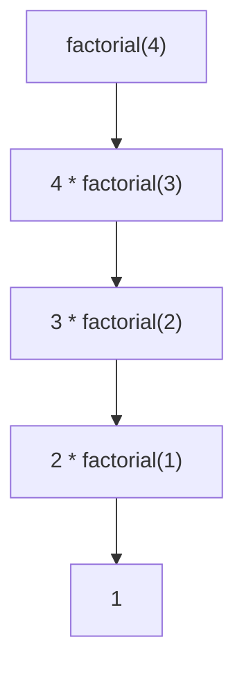
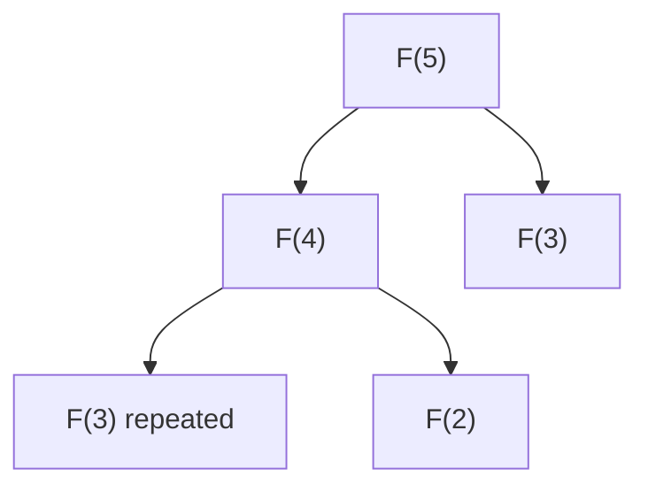
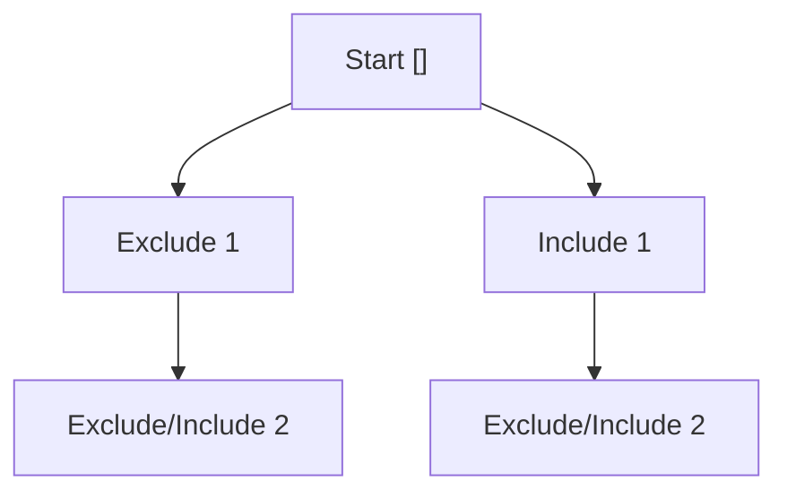
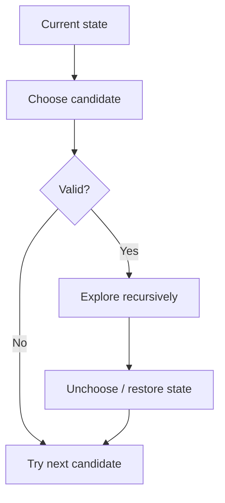

# Caelius Interview Preparation

## DSA Recursion and Backtracking (Q191-Q200)

For recursive problems, speak in this order:

```text
State -> Define helper contract -> Base case -> Recursive progress -> Complexity -> Test
```

For backtracking, add:

```text
Choose -> Explore -> Unchoose -> Prune invalid branches
```

## Core Difference

> Recursion is a control-flow technique where a function calls itself on a smaller problem. Backtracking uses recursion to explore choices and reverses each choice so other possibilities can be explored.

---

# Q191. Factorial Using Recursion

## Define

> The factorial of non-negative integer `n` is the product of all positive integers from `1` to `n`, with `0! = 1`.

## Recurrence

```text
factorial(0) = 1
factorial(n) = n * factorial(n - 1)
```

## Code

```java
public static long factorial(int n) {
    if (n < 0) {
        throw new IllegalArgumentException("n must be non-negative");
    }
    if (n <= 1) {
        return 1;
    }

    return n * factorial(n - 1);
}
```

## Call Flow



## Complexity

- Time: `O(n)`
- Recursion space: `O(n)`

## Interview Point

`long` overflows after `20!`. Use `BigInteger` when larger exact values are required. An iterative solution uses `O(1)` extra space and avoids stack depth.

---

# Q192. Fibonacci Using Recursion and Memoization

## Define

```text
F(0) = 0
F(1) = 1
F(n) = F(n - 1) + F(n - 2)
```

## Naive Recursion

```java
public static long fibonacciRecursive(int n) {
    if (n < 0) {
        throw new IllegalArgumentException("n must be non-negative");
    }
    if (n <= 1) {
        return n;
    }

    return fibonacciRecursive(n - 1) + fibonacciRecursive(n - 2);
}
```

The same subproblems are solved repeatedly:



## Memoized Code

```java
public static long fibonacciMemoized(int n) {
    if (n < 0) {
        throw new IllegalArgumentException("n must be non-negative");
    }

    long[] memo = new long[n + 1];
    Arrays.fill(memo, -1);
    return fibonacciMemoized(n, memo);
}

private static long fibonacciMemoized(int n, long[] memo) {
    if (n <= 1) {
        return n;
    }
    if (memo[n] != -1) {
        return memo[n];
    }

    memo[n] = fibonacciMemoized(n - 1, memo)
        + fibonacciMemoized(n - 2, memo);
    return memo[n];
}
```

## Complexity

| Approach | Time | Extra space |
|---|---:|---:|
| Naive recursion | `O(2^n)` | `O(n)` stack |
| Memoization | `O(n)` | `O(n)` |
| Iterative optimized | `O(n)` | `O(1)` |

## Interview Point

Memoization converts overlapping recursive subproblems into one computation per state.

---

# Q193. Tower of Hanoi

## State

> Move `n` disks from source to destination using an auxiliary rod. Only one disk moves at a time, and a larger disk may never be placed on a smaller disk.

## Recursive Strategy

1. Move `n - 1` disks from source to auxiliary.
2. Move the largest disk from source to destination.
3. Move `n - 1` disks from auxiliary to destination.

## Code

```java
public static List<String> towerOfHanoi(int disks) {
    if (disks < 0) {
        throw new IllegalArgumentException("Disk count cannot be negative");
    }

    List<String> moves = new ArrayList<>();
    moveDisks(disks, 'A', 'C', 'B', moves);
    return moves;
}

private static void moveDisks(
        int disks,
        char source,
        char destination,
        char auxiliary,
        List<String> moves) {
    if (disks == 0) {
        return;
    }

    moveDisks(disks - 1, source, auxiliary, destination, moves);
    moves.add(source + " -> " + destination);
    moveDisks(disks - 1, auxiliary, destination, source, moves);
}
```

## Recurrence and Complexity

```text
T(n) = 2T(n - 1) + 1
T(n) = 2^n - 1 moves
```

- Time: `O(2^n)`
- Recursion space: `O(n)`
- Output space: `O(2^n)` when storing every move

## Interview Point

The exponential number of moves is mathematically unavoidable under the problem's rules.

---

# Q194. Print All Subsets of a Set

## State

> For every element, a subset has two choices: include it or exclude it. I will explore both choices recursively.

## Code

```java
public static List<List<Integer>> subsets(int[] values) {
    List<List<Integer>> result = new ArrayList<>();
    buildSubsets(values, 0, new ArrayList<>(), result);
    return result;
}

private static void buildSubsets(
        int[] values,
        int index,
        List<Integer> current,
        List<List<Integer>> result) {
    if (index == values.length) {
        result.add(new ArrayList<>(current));
        return;
    }

    buildSubsets(values, index + 1, current, result);

    current.add(values[index]);
    buildSubsets(values, index + 1, current, result);
    current.remove(current.size() - 1);
}
```

## Decision Tree



## Complexity

- Number of subsets: `2^n`
- Time: `O(n * 2^n)` because each saved subset can contain `n` elements
- Recursion space: `O(n)`
- Output space: `O(n * 2^n)`

## Interview Point

Copy `current` when saving. Adding the same mutable list reference would make all results change together.

---

# Q195. N-Queens Problem

## State

> Place `n` queens on an `n x n` board so no two share a row, column, or diagonal. I will place exactly one queen per row and backtrack when a position is unsafe.

## Efficient Safety Tracking

For position `(row, column)`:

```text
main diagonal key     = row - column + n - 1
anti-diagonal key     = row + column
```

## Code

```java
public static List<List<String>> solveNQueens(int n) {
    List<List<String>> result = new ArrayList<>();
    char[][] board = new char[n][n];
    for (char[] row : board) {
        Arrays.fill(row, '.');
    }

    boolean[] columns = new boolean[n];
    boolean[] diagonals = new boolean[2 * n - 1];
    boolean[] antiDiagonals = new boolean[2 * n - 1];

    placeQueens(
        0,
        board,
        columns,
        diagonals,
        antiDiagonals,
        result
    );
    return result;
}

private static void placeQueens(
        int row,
        char[][] board,
        boolean[] columns,
        boolean[] diagonals,
        boolean[] antiDiagonals,
        List<List<String>> result) {
    int n = board.length;
    if (row == n) {
        List<String> solution = new ArrayList<>(n);
        for (char[] boardRow : board) {
            solution.add(new String(boardRow));
        }
        result.add(solution);
        return;
    }

    for (int column = 0; column < n; column++) {
        int diagonal = row - column + n - 1;
        int antiDiagonal = row + column;

        if (columns[column]
                || diagonals[diagonal]
                || antiDiagonals[antiDiagonal]) {
            continue;
        }

        board[row][column] = 'Q';
        columns[column] = true;
        diagonals[diagonal] = true;
        antiDiagonals[antiDiagonal] = true;

        placeQueens(
            row + 1,
            board,
            columns,
            diagonals,
            antiDiagonals,
            result
        );

        board[row][column] = '.';
        columns[column] = false;
        diagonals[diagonal] = false;
        antiDiagonals[antiDiagonal] = false;
    }
}
```

## Complexity

- Common upper bound: `O(n!)` search, excluding output copying
- Safety check: `O(1)`
- Recursion and tracking space: `O(n)`

## Interview Point

Placing one queen per row eliminates row conflicts automatically. Column and diagonal arrays avoid scanning the board for every choice.

---

# Q196. Rat in a Maze

## Clarify

This version finds whether a path exists from the top-left to bottom-right through cells containing `1`. It allows four directions and prevents revisiting a cell on the current path.

## Code

```java
private static final int[][] DIRECTIONS = {
    {1, 0},
    {0, 1},
    {-1, 0},
    {0, -1}
};

public static boolean findMazePath(
        int[][] maze,
        List<int[]> path) {
    if (maze == null
            || maze.length == 0
            || maze[0].length == 0
            || maze[0][0] == 0) {
        return false;
    }

    boolean[][] visited = new boolean[maze.length][maze[0].length];
    return searchMaze(maze, 0, 0, visited, path);
}

private static boolean searchMaze(
        int[][] maze,
        int row,
        int column,
        boolean[][] visited,
        List<int[]> path) {
    if (row < 0
            || row >= maze.length
            || column < 0
            || column >= maze[0].length
            || maze[row][column] == 0
            || visited[row][column]) {
        return false;
    }

    visited[row][column] = true;
    path.add(new int[] {row, column});

    if (row == maze.length - 1 && column == maze[0].length - 1) {
        return true;
    }

    for (int[] direction : DIRECTIONS) {
        if (searchMaze(
                maze,
                row + direction[0],
                column + direction[1],
                visited,
                path)) {
            return true;
        }
    }

    visited[row][column] = false;
    path.remove(path.size() - 1);
    return false;
}
```

## Complexity

- Worst-case time: exponential when exploring simple paths
- Visited/path space: `O(rows * columns)`
- Recursion depth: up to `O(rows * columns)`

## Interview Point

If only shortest path length is required, use BFS. Backtracking is appropriate when finding paths or exploring constrained possibilities.

---

# Q197. Generate All Permutations

## State

> A permutation chooses one unused value for each position. I will swap each candidate into the current position, recurse, and swap back.

## Code

```java
public static List<List<Integer>> permutations(int[] values) {
    List<List<Integer>> result = new ArrayList<>();
    permute(values, 0, result);
    return result;
}

private static void permute(
        int[] values,
        int position,
        List<List<Integer>> result) {
    if (position == values.length) {
        List<Integer> permutation = new ArrayList<>(values.length);
        for (int value : values) {
            permutation.add(value);
        }
        result.add(permutation);
        return;
    }

    for (int candidate = position; candidate < values.length; candidate++) {
        swap(values, position, candidate);
        permute(values, position + 1, result);
        swap(values, position, candidate);
    }
}
```

## Complexity

- Number of permutations: `n!`
- Time: `O(n * n!)` including result copying
- Recursion space: `O(n)`
- Output space: `O(n * n!)`

## Duplicate Follow-Up

If input contains duplicates, use a set of values tried at each recursion level or sort and skip duplicate choices.

---

# Q198. Word Search in a 2D Grid

## State

> I will start DFS from every cell matching the first character. During one candidate path, a cell may be used only once, so I temporarily mark it and restore it while backtracking.

## Code

```java
public static boolean wordExists(char[][] board, String word) {
    if (word == null) {
        return false;
    }
    if (word.isEmpty()) {
        return true;
    }
    if (board == null || board.length == 0 || board[0].length == 0) {
        return false;
    }

    for (int row = 0; row < board.length; row++) {
        for (int column = 0; column < board[0].length; column++) {
            if (searchWord(board, word, row, column, 0)) {
                return true;
            }
        }
    }
    return false;
}

private static boolean searchWord(
        char[][] board,
        String word,
        int row,
        int column,
        int index) {
    if (index == word.length()) {
        return true;
    }
    if (row < 0
            || row >= board.length
            || column < 0
            || column >= board[0].length
            || board[row][column] != word.charAt(index)) {
        return false;
    }

    char original = board[row][column];
    board[row][column] = '\0';

    boolean found = searchWord(board, word, row + 1, column, index + 1)
        || searchWord(board, word, row - 1, column, index + 1)
        || searchWord(board, word, row, column + 1, index + 1)
        || searchWord(board, word, row, column - 1, index + 1);

    board[row][column] = original;
    return found;
}
```

## Complexity

For `R x C` board and word length `L`:

- Worst-case time: `O(R * C * 3^L)` after the first move
- Recursion space: `O(L)`

## Interview Point

Restore the cell before returning, even when a word is found, so the caller's board is unchanged.

---

# Q199. Subset Sum Problem

## Clarify

This version asks whether any subset sums exactly to a target. For non-negative values, branches with a negative remaining target can be pruned.

## Memoized Code

```java
public static boolean hasSubsetSum(int[] values, int target) {
    Map<String, Boolean> memo = new HashMap<>();
    return hasSubsetSum(values, 0, target, memo);
}

private static boolean hasSubsetSum(
        int[] values,
        int index,
        int remaining,
        Map<String, Boolean> memo) {
    if (remaining == 0) {
        return true;
    }
    if (index == values.length) {
        return false;
    }

    String key = index + ":" + remaining;
    Boolean cached = memo.get(key);
    if (cached != null) {
        return cached;
    }

    boolean possible = hasSubsetSum(
        values,
        index + 1,
        remaining,
        memo
    ) || hasSubsetSum(
        values,
        index + 1,
        remaining - values[index],
        memo
    );

    memo.put(key, possible);
    return possible;
}
```

## Complexity

- Plain recursion: `O(2^n)` time
- Memoized: `O(n * S)` states when target/range is bounded by `S`
- Memoization space: `O(n * S)`

## Interview Point

Do not prune merely because `remaining < 0` when negative input values are allowed; later negative/positive choices could change it.

---

# Q200. Combination Sum Problem

## Clarify

The common version uses distinct positive candidate values, allows each candidate unlimited times, and asks for unique combinations totaling the target.

## State

> I will sort candidates, build combinations in non-decreasing index order to avoid reordered duplicates, and reuse the current index because a candidate may be selected repeatedly.

## Code

```java
public static List<List<Integer>> combinationSum(
        int[] candidates,
        int target) {
    if (target < 0) {
        return List.of();
    }

    Arrays.sort(candidates);
    List<List<Integer>> result = new ArrayList<>();
    buildCombinations(
        candidates,
        target,
        0,
        new ArrayList<>(),
        result
    );
    return result;
}

private static void buildCombinations(
        int[] candidates,
        int remaining,
        int start,
        List<Integer> current,
        List<List<Integer>> result) {
    if (remaining == 0) {
        result.add(new ArrayList<>(current));
        return;
    }

    for (int i = start; i < candidates.length; i++) {
        if (i > start && candidates[i] == candidates[i - 1]) {
            continue;
        }
        if (candidates[i] <= 0) {
            throw new IllegalArgumentException(
                "Candidates must be positive"
            );
        }
        if (candidates[i] > remaining) {
            break;
        }

        current.add(candidates[i]);
        buildCombinations(
            candidates,
            remaining - candidates[i],
            i,
            current,
            result
        );
        current.remove(current.size() - 1);
    }
}
```

## Why Recurse With `i`?

Using `i` allows the same candidate again. Using `i + 1` would allow each candidate at most once.

## Complexity

- Worst-case time: exponential, dependent on target and candidate values
- Recursion depth: up to `target / minimumCandidate`
- Output space: proportional to all returned combinations

## Interview Point

Positive candidates are necessary for this pruning and termination strategy. Zero or negative reusable candidates could create infinite recursion.

---

# Reusable Backtracking Template

```java
private static void backtrack(State state, List<Result> result) {
    if (isComplete(state)) {
        result.add(copyResult(state));
        return;
    }

    for (Choice choice : availableChoices(state)) {
        if (!isValid(state, choice)) {
            continue;
        }

        choose(state, choice);
        backtrack(state, result);
        unchoose(state, choice);
    }
}
```



## How to Explain Backtracking

> "My current list represents the choices on the active recursion path. Before returning to the caller, I remove the choice I added so sibling branches start from the correct state."

# Recursion and Backtracking Testing Checklist

Test:

```text
invalid negative input
zero input
empty candidates
single candidate
no solution
exact one-step solution
multiple solutions
duplicate candidates
deep recursion
state restored after failure
input unchanged after search
overflow boundaries
```

# DSA Recursion and Backtracking Revision Sheet

| Question | Core pattern | Time | Extra space |
|---|---|---:|---:|
| Factorial | One smaller recursive call | `O(n)` | `O(n)` |
| Fibonacci | Memoize overlapping states | `O(n)` memoized | `O(n)` |
| Tower of Hanoi | Move `n-1`, largest, `n-1` | `O(2^n)` | `O(n)` |
| All subsets | Include/exclude | `O(n * 2^n)` | `O(n)` stack |
| N-Queens | Place per row + prune conflicts | About `O(n!)` | `O(n)` tracking |
| Rat in maze | Grid path backtracking | Exponential worst case | `O(R*C)` |
| Permutations | Swap candidate into position | `O(n * n!)` | `O(n)` stack |
| Word search | Grid DFS + temporary mark | `O(R*C*3^L)` | `O(L)` |
| Subset sum | Include/exclude + memoization | `O(n*S)` | `O(n*S)` |
| Combination sum | Ordered choices + reuse + prune | Exponential | Depth `O(target/min)` |

## Common Interview Mistakes

- Writing recursion without a base case.
- Making a recursive call that does not reduce the problem.
- Forgetting to restore mutable state after exploring a choice.
- Adding the same mutable path object to every result.
- Ignoring duplicate-result handling.
- Giving only exponential complexity without noting unavoidable output size.
- Using backtracking for shortest unweighted paths instead of BFS.
- Pruning based on positivity when negative values are allowed.
- Mutating the caller's board or input without restoring it.
