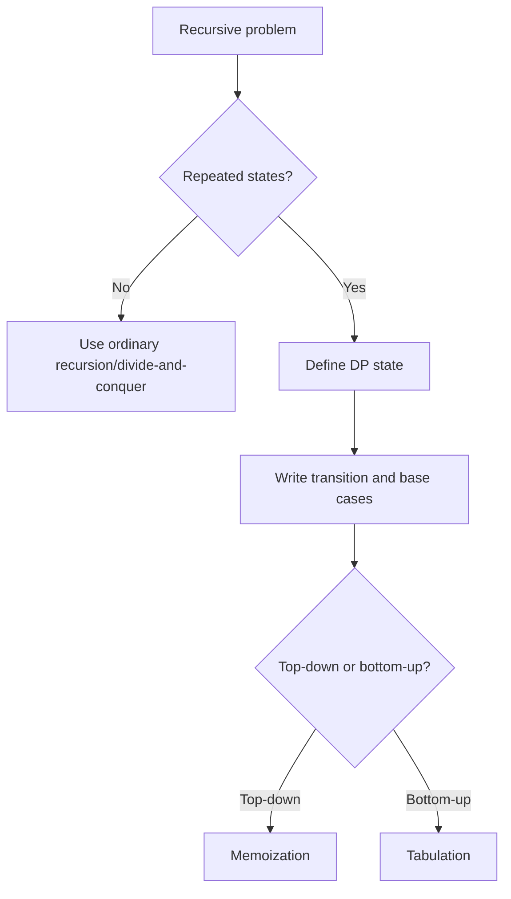
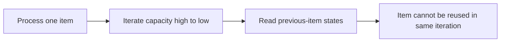
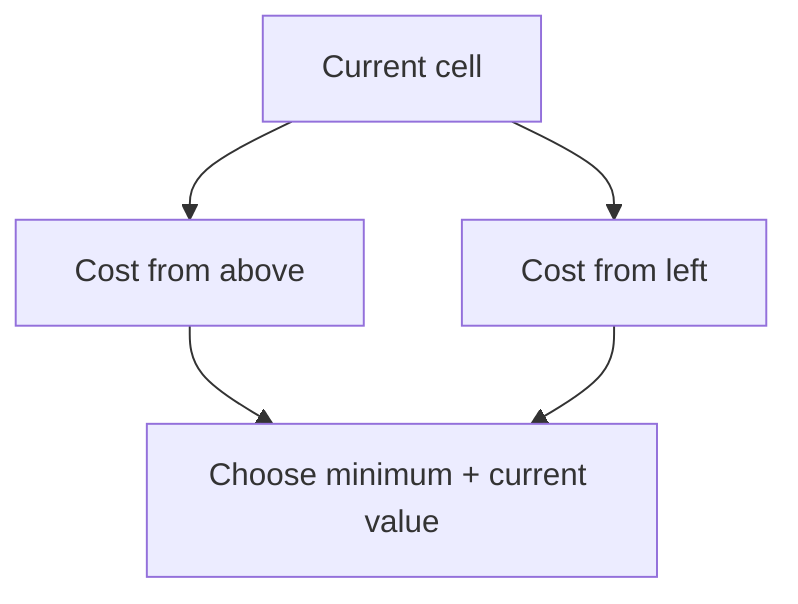
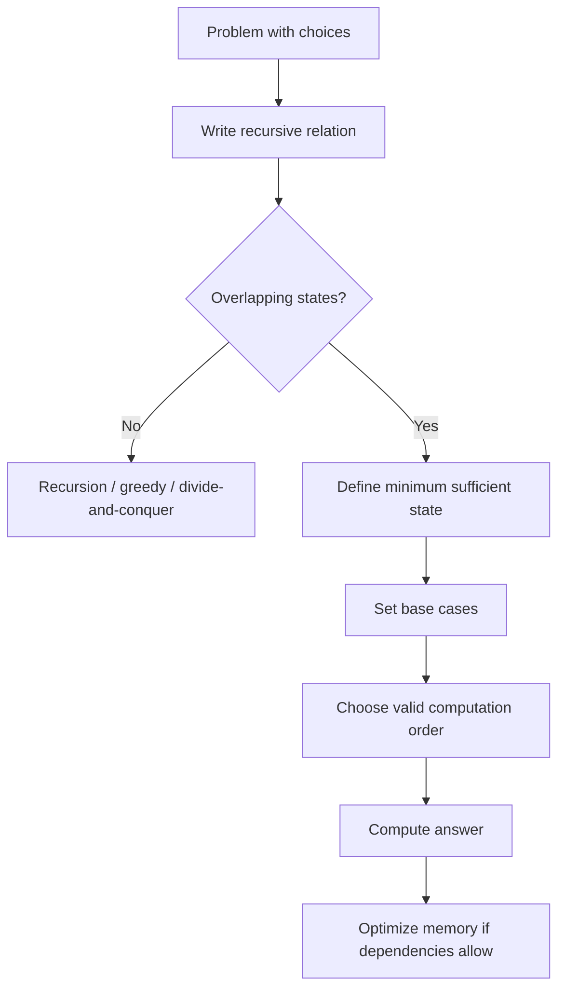

# Caelius Interview Preparation

## DSA Dynamic Programming (Q201-Q210)

For every dynamic-programming problem, speak in this order:

```text
State -> Recurrence -> Base case -> Computation order -> Code -> Complexity -> Optimize
```

Before coding, say:

> "I first see a recursive choice structure. Because the same states repeat, I will cache each state or compute them bottom-up so every state is solved once."

---

# Q201. What Is Dynamic Programming?

## Define

> Dynamic programming is an optimization technique that solves a problem by combining solutions to overlapping subproblems and storing each subproblem's result so it is not recomputed.

## When DP Applies

Look for two properties:

1. **Overlapping subproblems:** the same state is reached repeatedly.
2. **Optimal substructure:** an optimal solution can be constructed from optimal solutions to smaller states.

## DP Design Framework

```text
1. Define the state.
2. Write the recurrence or transition.
3. Define base cases.
4. Choose memoization or tabulation.
5. Determine the final state.
6. Optimize space if only recent states are needed.
```

## Example: Fibonacci

```text
State:      dp[i] = Fibonacci value at index i
Transition: dp[i] = dp[i - 1] + dp[i - 2]
Base:       dp[0] = 0, dp[1] = 1
Answer:     dp[n]
```

## Flow



## Real Use Cases

Dynamic programming appears in route optimization, text comparison, resource allocation, scheduling, recommendation ranking, and sequence analysis.

## Interview Point

DP is not simply recursion. The essential idea is solving each repeated state once and reusing its result.

---

# Q202. Memoization vs Tabulation

## Define

> Memoization is top-down DP: start from the requested answer and cache recursive states. Tabulation is bottom-up DP: compute smaller states first in an explicit order.

## Comparison

| Property | Memoization | Tabulation |
|---|---|---|
| Direction | Top-down | Bottom-up |
| Control flow | Recursion | Iteration |
| Computes | Usually only reached states | Usually all table states |
| Stack usage | Recursion stack | No recursion stack |
| Ease of deriving | Often close to recurrence | Requires valid computation order |
| Constant factors | Function-call/cache overhead | Often smaller |

## Memoized Fibonacci

```java
public static long fibonacciMemoized(int n) {
    long[] memo = new long[n + 1];
    Arrays.fill(memo, -1);
    return fibonacciMemoized(n, memo);
}

private static long fibonacciMemoized(int n, long[] memo) {
    if (n <= 1) {
        return n;
    }
    if (memo[n] != -1) {
        return memo[n];
    }

    memo[n] = fibonacciMemoized(n - 1, memo)
        + fibonacciMemoized(n - 2, memo);
    return memo[n];
}
```

## Tabulated Fibonacci

```java
public static long fibonacciTabulated(int n) {
    if (n <= 1) {
        return n;
    }

    long[] dp = new long[n + 1];
    dp[1] = 1;

    for (int i = 2; i <= n; i++) {
        dp[i] = dp[i - 1] + dp[i - 2];
    }
    return dp[n];
}
```

## Space-Optimized Fibonacci

```java
public static long fibonacciOptimized(int n) {
    if (n <= 1) {
        return n;
    }

    long previousTwo = 0;
    long previousOne = 1;

    for (int i = 2; i <= n; i++) {
        long current = previousOne + previousTwo;
        previousTwo = previousOne;
        previousOne = current;
    }
    return previousOne;
}
```

## Complexity

- Memoization: `O(n)` time, `O(n)` cache and stack
- Tabulation: `O(n)` time, `O(n)` table
- Optimized: `O(n)` time, `O(1)` space

## Interview Point

Prefer memoization when only a small subset of states may be reached or the recurrence is easier recursively. Prefer tabulation when recursion depth is risky or the computation order is clear.

---

# Q203. 0/1 Knapsack Problem

## State

> Each item can be selected at most once. For every item, I choose either to skip it or include it if its weight fits.

Given:

- `weights[i]`
- `values[i]`
- capacity `C`

maximize total value without exceeding capacity.

## State Definition

```text
dp[c] = maximum value achievable using processed items
        with capacity c
```

## Transition

For an item with weight `w` and value `v`:

```text
dp[c] = max(dp[c], v + dp[c - w])
```

## Space-Optimized Code

```java
public static int zeroOneKnapsack(
        int[] weights,
        int[] values,
        int capacity) {
    if (weights.length != values.length || capacity < 0) {
        throw new IllegalArgumentException("Invalid knapsack input");
    }

    int[] dp = new int[capacity + 1];

    for (int item = 0; item < weights.length; item++) {
        if (weights[item] < 0) {
            throw new IllegalArgumentException("Weight cannot be negative");
        }

        for (int currentCapacity = capacity;
                currentCapacity >= weights[item];
                currentCapacity--) {
            dp[currentCapacity] = Math.max(
                dp[currentCapacity],
                values[item] + dp[currentCapacity - weights[item]]
            );
        }
    }

    return dp[capacity];
}
```

## Why Iterate Capacity Backward?



Backward iteration ensures `dp[c - w]` still represents the state before processing the current item.

## Complexity

- Time: `O(n * C)`
- Extra space: `O(C)`

## Interview Point

This is pseudo-polynomial, not polynomial in the number of bits needed to represent capacity.

---

# Q204. Unbounded Knapsack

## State

> Unbounded knapsack allows each item to be selected any number of times. The state is similar to 0/1 knapsack, but capacity must be iterated forward so the current item can contribute repeatedly.

## Code

```java
public static int unboundedKnapsack(
        int[] weights,
        int[] values,
        int capacity) {
    if (weights.length != values.length || capacity < 0) {
        throw new IllegalArgumentException("Invalid knapsack input");
    }

    int[] dp = new int[capacity + 1];

    for (int item = 0; item < weights.length; item++) {
        if (weights[item] <= 0) {
            throw new IllegalArgumentException(
                "Weights must be positive"
            );
        }

        for (int currentCapacity = weights[item];
                currentCapacity <= capacity;
                currentCapacity++) {
            dp[currentCapacity] = Math.max(
                dp[currentCapacity],
                values[item] + dp[currentCapacity - weights[item]]
            );
        }
    }

    return dp[capacity];
}
```

## 0/1 vs Unbounded

| Problem | Capacity loop | Why |
|---|---|---|
| 0/1 knapsack | Backward | Prevent current item reuse |
| Unbounded knapsack | Forward | Allow current item reuse |

## Complexity

- Time: `O(n * C)`
- Extra space: `O(C)`

## Real Use Case

Unbounded knapsack models unlimited resource choices such as reusable package sizes, repeated cuts, or unlimited coin denominations.

---

# Q205. Longest Common Subsequence (LCS)

## Define

> A subsequence preserves relative order but does not need to be contiguous. LCS finds the maximum-length subsequence shared by two strings.

For `"abcde"` and `"ace"`, the LCS is `"ace"` with length `3`.

## State Definition

```text
dp[i][j] = LCS length between:
           first[0 .. i - 1] and second[0 .. j - 1]
```

## Transition

```text
if first[i - 1] == second[j - 1]:
    dp[i][j] = 1 + dp[i - 1][j - 1]
else:
    dp[i][j] = max(dp[i - 1][j], dp[i][j - 1])
```

## Code

```java
public static int longestCommonSubsequence(
        String first,
        String second) {
    int[][] dp = new int[first.length() + 1][second.length() + 1];

    for (int i = 1; i <= first.length(); i++) {
        for (int j = 1; j <= second.length(); j++) {
            if (first.charAt(i - 1) == second.charAt(j - 1)) {
                dp[i][j] = 1 + dp[i - 1][j - 1];
            } else {
                dp[i][j] = Math.max(dp[i - 1][j], dp[i][j - 1]);
            }
        }
    }

    return dp[first.length()][second.length()];
}
```

## Reconstruct an LCS

Start at `dp[m][n]`:

- Matching characters belong to the LCS; move diagonally.
- Otherwise move toward the larger of the top and left states.
- Reverse the collected characters.

## Complexity

- Time: `O(m * n)`
- Extra space: `O(m * n)`
- Length-only optimization: `O(min(m, n))` space

## Interview Point

Do not confuse subsequence with substring. A substring must be contiguous.

---

# Q206. Longest Increasing Subsequence (LIS)

## Define

> LIS finds the longest subsequence whose values are strictly increasing while preserving original order.

## `O(n^2)` DP State

```text
dp[i] = length of the longest increasing subsequence ending at i
```

```java
public static int longestIncreasingSubsequenceDp(int[] values) {
    if (values.length == 0) {
        return 0;
    }

    int[] dp = new int[values.length];
    Arrays.fill(dp, 1);
    int best = 1;

    for (int i = 0; i < values.length; i++) {
        for (int previous = 0; previous < i; previous++) {
            if (values[previous] < values[i]) {
                dp[i] = Math.max(dp[i], dp[previous] + 1);
            }
        }
        best = Math.max(best, dp[i]);
    }

    return best;
}
```

## Optimized `O(n log n)` Approach

Maintain `tails[length - 1]`, the smallest possible ending value for an increasing subsequence of that length.

```java
public static int longestIncreasingSubsequence(int[] values) {
    int[] tails = new int[values.length];
    int size = 0;

    for (int value : values) {
        int low = 0;
        int high = size;

        while (low < high) {
            int middle = low + (high - low) / 2;
            if (tails[middle] < value) {
                low = middle + 1;
            } else {
                high = middle;
            }
        }

        tails[low] = value;
        if (low == size) {
            size++;
        }
    }

    return size;
}
```

## Important Clarification

The `tails` array is not necessarily an actual subsequence from the input. It stores optimal tail values that preserve the best chance of extension.

## Complexity

| Approach | Time | Extra space |
|---|---:|---:|
| Classic DP | `O(n^2)` | `O(n)` |
| Binary-search tails | `O(n log n)` | `O(n)` |

## Interview Point

For strictly increasing LIS, find the first tail greater than or equal to the current value. For non-decreasing LIS, use the first tail strictly greater than it.

---

# Q207. Coin Change Problem

## Clarify

Coin change commonly asks one of two questions:

1. Minimum number of coins needed.
2. Number of combinations that make the amount.

This solution answers minimum coins with unlimited use of each positive denomination.

## State Definition

```text
dp[amount] = minimum coins needed to form amount
```

## Code

```java
public static int minimumCoins(int[] coins, int amount) {
    if (amount < 0) {
        return -1;
    }

    int unreachable = amount + 1;
    int[] dp = new int[amount + 1];
    Arrays.fill(dp, unreachable);
    dp[0] = 0;

    for (int current = 1; current <= amount; current++) {
        for (int coin : coins) {
            if (coin <= 0) {
                throw new IllegalArgumentException(
                    "Coin values must be positive"
                );
            }
            if (coin <= current) {
                dp[current] = Math.min(
                    dp[current],
                    1 + dp[current - coin]
                );
            }
        }
    }

    return dp[amount] == unreachable ? -1 : dp[amount];
}
```

## Complexity

- Time: `O(amount * numberOfCoins)`
- Extra space: `O(amount)`

## Count-Combinations Variation

To count combinations, initialize `dp[0] = 1`, process coins in the outer loop, and add:

```java
dp[current] += dp[current - coin];
```

Coin-first ordering avoids counting different orders of the same combination separately.

## Interview Point

A greedy strategy does not work for arbitrary denominations. For coins `[1, 3, 4]` and amount `6`, greedy chooses `4 + 1 + 1`, while optimal is `3 + 3`.

---

# Q208. Minimum Path Sum in a Grid

## Clarify

This version starts at the top-left, ends at the bottom-right, and allows movement only right or down.

## State Definition

```text
dp[column] = minimum path sum to the current row's cell at column
```

Before updating:

- `dp[column]` is the cost from above.
- `dp[column - 1]` is the updated cost from the left.

## Space-Optimized Code

```java
public static long minimumPathSum(int[][] grid) {
    if (grid == null || grid.length == 0 || grid[0].length == 0) {
        throw new IllegalArgumentException("Grid cannot be empty");
    }

    int columns = grid[0].length;
    long[] dp = new long[columns];

    dp[0] = grid[0][0];
    for (int column = 1; column < columns; column++) {
        dp[column] = dp[column - 1] + grid[0][column];
    }

    for (int row = 1; row < grid.length; row++) {
        dp[0] += grid[row][0];

        for (int column = 1; column < columns; column++) {
            dp[column] = grid[row][column]
                + Math.min(dp[column], dp[column - 1]);
        }
    }

    return dp[columns - 1];
}
```

## Flow



## Complexity

- Time: `O(rows * columns)`
- Extra space: `O(columns)`

## Interview Point

If four-direction movement is allowed, simple row-by-row DP no longer works because states can depend cyclically on each other. Use an appropriate shortest-path algorithm instead.

---

# Q209. Edit Distance

## Define

> Edit distance is the minimum number of insertions, deletions, and replacements required to transform one string into another.

## State Definition

```text
dp[i][j] = minimum operations to transform:
           first[0 .. i - 1] into second[0 .. j - 1]
```

## Transition

If the current characters match:

```text
dp[i][j] = dp[i - 1][j - 1]
```

Otherwise:

```text
dp[i][j] = 1 + min(
    dp[i][j - 1],     insertion
    dp[i - 1][j],     deletion
    dp[i - 1][j - 1]  replacement
)
```

## Code

```java
public static int editDistance(String first, String second) {
    int rows = first.length();
    int columns = second.length();
    int[][] dp = new int[rows + 1][columns + 1];

    for (int i = 0; i <= rows; i++) {
        dp[i][0] = i;
    }
    for (int j = 0; j <= columns; j++) {
        dp[0][j] = j;
    }

    for (int i = 1; i <= rows; i++) {
        for (int j = 1; j <= columns; j++) {
            if (first.charAt(i - 1) == second.charAt(j - 1)) {
                dp[i][j] = dp[i - 1][j - 1];
            } else {
                int insertion = dp[i][j - 1];
                int deletion = dp[i - 1][j];
                int replacement = dp[i - 1][j - 1];

                dp[i][j] = 1 + Math.min(
                    replacement,
                    Math.min(insertion, deletion)
                );
            }
        }
    }

    return dp[rows][columns];
}
```

## Complexity

- Time: `O(m * n)`
- Extra space: `O(m * n)`
- Distance-only optimization: `O(min(m, n))` space

## Real Use Case

Edit distance supports spell correction, fuzzy matching, DNA sequence comparison, and duplicate-text detection.

## Interview Point

Base row and column represent converting to or from the empty string.

---

# Q210. Climbing Stairs Problem

## State

> If I can climb one or two steps at a time, the final move to step `n` comes from step `n - 1` or `n - 2`. Therefore the number of ways is the sum of those two states.

## Recurrence

```text
ways(0) = 1
ways(1) = 1
ways(n) = ways(n - 1) + ways(n - 2)
```

`ways(0) = 1` represents one way to take no more steps after reaching the destination.

## Space-Optimized Code

```java
public static long climbStairs(int steps) {
    if (steps < 0) {
        return 0;
    }
    if (steps <= 1) {
        return 1;
    }

    long twoStepsBack = 1;
    long oneStepBack = 1;

    for (int step = 2; step <= steps; step++) {
        long current = oneStepBack + twoStepsBack;
        twoStepsBack = oneStepBack;
        oneStepBack = current;
    }

    return oneStepBack;
}
```

## Complexity

- Time: `O(n)`
- Extra space: `O(1)`

## Follow-Ups

- Allowed jumps `{1, 2, 3}`: sum the previous three states.
- Different cost per step: define `dp[i]` as minimum cost to reach step `i`.
- Broken/forbidden steps: set their number of ways to zero.
- Huge `n`: use matrix exponentiation in `O(log n)`.

## Interview Point

Climbing stairs is Fibonacci-shaped, but the base cases depend on the exact interpretation of starting and finishing.

---

# Reusable DP Design Guide



## State-Definition Examples

```text
dp[i]       = answer for prefix ending at i
dp[i][j]    = answer using prefixes of lengths i and j
dp[c]       = best answer for capacity c
dp[r][c]    = best answer reaching grid cell (r, c)
dp[index][remaining] = answer after choices before index
```

## Space Optimization Rule

Ask:

> "Which previous states does the current state actually read?"

If only the previous row is needed, use two rows. If only the immediately previous few values are needed, use variables.

# DP Interview Testing Checklist

Test:

```text
empty input
zero capacity or target
single item or character
no valid solution
all choices fit
choice too large
duplicate values
already matching strings
completely different strings
one-row or one-column grid
overflow for count-based answers
```

# DSA Dynamic Programming Revision Sheet

| Question | State / pattern | Time | Extra space |
|---|---|---:|---:|
| DP definition | Store overlapping subproblem results | - | - |
| Memoization vs tabulation | Top-down cache vs bottom-up table | State-dependent | State-dependent |
| 0/1 knapsack | Capacity DP, iterate backward | `O(n*C)` | `O(C)` |
| Unbounded knapsack | Capacity DP, iterate forward | `O(n*C)` | `O(C)` |
| LCS | Two-prefix DP | `O(m*n)` | `O(m*n)` |
| LIS | Minimum tail per length | `O(n log n)` | `O(n)` |
| Coin change | DP by amount | `O(amount*coins)` | `O(amount)` |
| Minimum path sum | Grid DP from top/left | `O(R*C)` | `O(C)` |
| Edit distance | Two-prefix operation DP | `O(m*n)` | `O(m*n)` |
| Climbing stairs | Previous two states | `O(n)` | `O(1)` |

## Common Interview Mistakes

- Writing a DP table before clearly defining what each state means.
- Forgetting base cases for empty prefixes or zero capacity.
- Using the wrong capacity-loop direction for knapsack.
- Confusing subsequence with substring.
- Claiming the optimized LIS `tails` array is necessarily an actual LIS.
- Applying greedy coin selection to arbitrary denominations.
- Giving pseudo-polynomial complexity as ordinary polynomial complexity.
- Optimizing space before first proving the recurrence.
- Ignoring overflow when counting paths or combinations.
