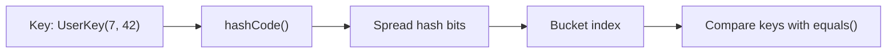
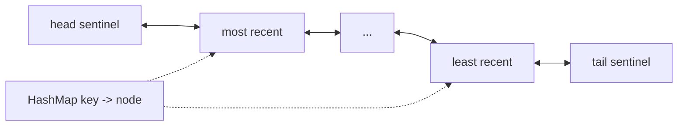
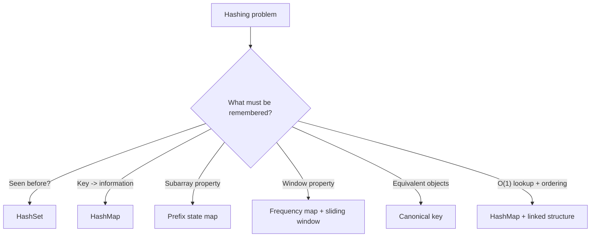

# Caelius Interview Preparation

## DSA Hashing (Q211-Q220)

For hashing problems, speak in this order:

```text
State -> Define map key/value meaning -> Explain lookup/update order -> Code -> Complexity -> Collision/edge cases
```

Before coding, say:

> "My map key represents ____, and its value represents ____. At each element, I first query/update it in this order because ____."

---

# Q211. What Is a Hash Function?

## Define

> A hash function deterministically converts a key into an integer hash value, which a hash table uses to choose a storage bucket.

Conceptually:

```text
key -> hash function -> hash value -> bucket index
```

The bucket index commonly uses a transformation such as:

```text
index = spread(hashCode) modulo capacity
```

## Good Hash-Function Properties

- Deterministic: equal keys produce equal hashes.
- Fast to compute.
- Distributes expected keys uniformly.
- Uses the meaningful parts of the key.
- Minimizes avoidable collisions.

## Java Contract

For Java objects used as `HashMap` or `HashSet` keys:

```text
if a.equals(b) is true, then a.hashCode() must equal b.hashCode()
```

Unequal objects may still have equal hash codes; that is a collision.

## Example Key

```java
public record UserKey(long tenantId, long userId) {}
```

Java records derive compatible `equals()` and `hashCode()` implementations from their components, making them convenient immutable keys.

## Diagram



## Interview Point

A hash function does not need to produce unique values. The table must correctly resolve collisions.

---

# Q212. What Is Collision Resolution? Techniques?

## Define

> A collision occurs when different keys map to the same bucket. Collision resolution is the strategy used to store and retrieve those keys correctly.

## Main Techniques

### Separate Chaining

Each bucket stores multiple entries, commonly in a linked structure or tree.

```text
bucket 3 -> (key A, value) -> (key B, value)
```

### Open Addressing

All entries live inside the table array. On collision, probe alternative slots.

Common probing strategies:

- Linear probing: try the next slots sequentially.
- Quadratic probing: increase probe distance quadratically.
- Double hashing: use a second hash to determine probe steps.

### Resizing

When load factor becomes too high, allocate a larger table and redistribute entries. This reduces collisions but makes one resize operation expensive.

## Load Factor

```text
load factor = number of stored entries / number of buckets
```

A high load factor saves space but generally increases collision cost.

## Complexity

- Expected lookup/insert/delete: `O(1)` with good distribution and controlled load.
- Worst case: `O(n)` when many keys collide.

## Interview Point

Collision handling is required even with a good hash function because the number of possible keys usually exceeds the number of buckets.

---

# Q213. Chaining vs Open Addressing

## Comparison

| Property | Separate chaining | Open addressing |
|---|---|---|
| Collision storage | Multiple entries per bucket | Alternative table slots |
| Extra objects/pointers | Usually yes | Usually no |
| Cache locality | Often weaker | Often stronger |
| Load factor | Can exceed `1` | Must remain below `1` |
| Deletion | Straightforward | Needs tombstones or careful repair |
| Clustering risk | Less direct | Depends on probing strategy |
| Resizing pressure | Lower at moderate load | Higher as table fills |

## Chaining Lookup

```text
1. Hash key to bucket.
2. Search entries in that bucket.
3. Compare candidate keys using equality.
```

## Open-Addressing Lookup

```text
1. Hash key to initial slot.
2. Follow the same probe sequence used during insertion.
3. Stop at the key or at a truly empty slot.
```

## Why Tombstones Matter

In open addressing, simply clearing a deleted slot can break the probe chain and make later keys unreachable. A tombstone marks the slot deleted while preserving lookup continuation.

## Java Context

`HashMap` uses separate buckets. Under heavy collisions, modern Java can treeify eligible buckets, improving worst-case lookup for comparable keys.

## Interview Point

Open addressing can be memory-efficient and cache-friendly, but performance degrades sharply as the table approaches full capacity.

---

# Q214. Two Sum Using HashMap

## State

> For each value, I need to know whether its required complement has already appeared. My map stores `value -> earlier index`.

## Code

```java
public static int[] twoSum(int[] values, int target) {
    Map<Integer, Integer> indexByValue = new HashMap<>();

    for (int i = 0; i < values.length; i++) {
        long complementLong = (long) target - values[i];

        if (complementLong >= Integer.MIN_VALUE
                && complementLong <= Integer.MAX_VALUE) {
            Integer earlierIndex = indexByValue.get((int) complementLong);
            if (earlierIndex != null) {
                return new int[] {earlierIndex, i};
            }
        }

        indexByValue.put(values[i], i);
    }

    return new int[] {-1, -1};
}
```

## Why Lookup Before Insert?

Looking up first prevents the same array element from being paired with itself. It still correctly handles duplicates such as `[3, 3]` for target `6`.

## Complexity

- Expected time: `O(n)`
- Extra space: `O(n)`

## Alternative

Sort values with original indices and use two pointers:

- Time: `O(n log n)`
- Additional care required to return original indices.

## Interview Point

Clarify whether one pair, all pairs, unique value pairs, or original indices are required.

---

# Q215. Group Anagrams Together

## State

> Anagrams contain identical character frequencies. I will generate a canonical key for each word and group words sharing that key.

## Frequency-Key Code

This version assumes lowercase English letters:

```java
public static List<List<String>> groupAnagrams(String[] words) {
    Map<String, List<String>> groups = new LinkedHashMap<>();

    for (String word : words) {
        int[] frequency = new int[26];
        for (int i = 0; i < word.length(); i++) {
            char character = word.charAt(i);
            if (character < 'a' || character > 'z') {
                throw new IllegalArgumentException(
                    "Only lowercase English letters are supported"
                );
            }
            frequency[character - 'a']++;
        }

        String key = frequencyKey(frequency);
        groups.computeIfAbsent(key, ignored -> new ArrayList<>())
            .add(word);
    }

    return new ArrayList<>(groups.values());
}

private static String frequencyKey(int[] frequency) {
    StringBuilder key = new StringBuilder();
    for (int count : frequency) {
        key.append('#').append(count);
    }
    return key.toString();
}
```

## Why Include Delimiters?

Without delimiters, counts such as `[1, 11]` and `[11, 1]` could produce ambiguous concatenated keys.

## Complexity

For `n` words with total `T` characters:

- Frequency-key approach: `O(T)` time for fixed alphabet
- Extra grouping/key space: `O(T)`

Sorting each word as its key takes approximately `O(T log L)`, where `L` is typical word length.

## Interview Point

Clarify case sensitivity, Unicode handling, punctuation, and whether group order must be deterministic.

---

# Q216. Subarray With Zero Sum

## State

> If the same prefix sum appears at two positions, the elements between those positions sum to zero. I will store prefix sums already seen.

## Mathematical Reason

```text
prefix[j] - prefix[i] = 0
therefore prefix[j] = prefix[i]
```

## Code

```java
public static boolean hasZeroSumSubarray(int[] values) {
    Set<Long> seenPrefixSums = new HashSet<>();
    seenPrefixSums.add(0L);

    long prefixSum = 0;
    for (int value : values) {
        prefixSum += value;

        if (!seenPrefixSums.add(prefixSum)) {
            return true;
        }
    }

    return false;
}
```

## Why Add Zero Initially?

If a prefix from index `0` through the current index sums to zero, its prefix sum repeats the virtual prefix sum before the array began.

## Complexity

- Expected time: `O(n)`
- Extra space: `O(n)`

## Follow-Up

To return indices, store `prefix sum -> earliest index`, initialize `0 -> -1`, and return the range after the earlier index.

## Interview Point

Use `long` for the running prefix sum to reduce integer-overflow risk.

---

# Q217. Longest Subarray With Equal 0s and 1s

## State

> I will treat each `0` as `-1` and each `1` as `+1`. A subarray has equal zeros and ones exactly when its transformed sum is zero.

The problem becomes finding the longest repeated-prefix-sum distance.

## Code

```java
public static int longestEqualZeroOneSubarray(int[] values) {
    Map<Integer, Integer> firstIndexByBalance = new HashMap<>();
    firstIndexByBalance.put(0, -1);

    int balance = 0;
    int longest = 0;

    for (int i = 0; i < values.length; i++) {
        if (values[i] == 0) {
            balance--;
        } else if (values[i] == 1) {
            balance++;
        } else {
            throw new IllegalArgumentException(
                "Array must contain only 0 and 1"
            );
        }

        Integer firstIndex = firstIndexByBalance.get(balance);
        if (firstIndex != null) {
            longest = Math.max(longest, i - firstIndex);
        } else {
            firstIndexByBalance.put(balance, i);
        }
    }

    return longest;
}
```

## Why Keep the Earliest Index?

For a repeated balance, the earliest occurrence produces the longest possible subarray ending at the current index.

## Complexity

- Expected time: `O(n)`
- Extra space: `O(n)`

## Reusable Pattern

Transform categories into numeric contributions, then use prefix states:

- Equal count of two categories: `+1` and `-1`.
- Subarray sum equals `k`: search for `prefix - k`.
- Count subarrays: store prefix frequencies rather than earliest indices.

---

# Q218. Count Distinct Elements in Every Window of Size K

## State

> I will maintain a frequency map for the active window. The number of map keys is the number of distinct elements.

## Code

```java
public static List<Integer> distinctCounts(int[] values, int windowSize) {
    if (windowSize <= 0 || windowSize > values.length) {
        throw new IllegalArgumentException("Invalid window size");
    }

    Map<Integer, Integer> frequency = new HashMap<>();
    List<Integer> result = new ArrayList<>();

    for (int i = 0; i < values.length; i++) {
        frequency.merge(values[i], 1, Integer::sum);

        if (i >= windowSize) {
            int outgoing = values[i - windowSize];
            int updated = frequency.get(outgoing) - 1;

            if (updated == 0) {
                frequency.remove(outgoing);
            } else {
                frequency.put(outgoing, updated);
            }
        }

        if (i >= windowSize - 1) {
            result.add(frequency.size());
        }
    }

    return result;
}
```

## Window Invariant

After removal, the map contains frequencies for exactly:

```text
values[i - windowSize + 1 .. i]
```

## Complexity

- Expected time: `O(n)`
- Extra space: `O(k)`

## Interview Point

Remove keys when their frequency becomes zero. Otherwise `frequency.size()` will overcount distinct values.

---

# Q219. First Recurring Character

## Clarify

This answer returns the first character encountered during a left-to-right scan that has appeared earlier.

For `"acbbac"`, it returns `'b'`, because the second `'b'` is the earliest repeated occurrence encountered.

## Code

```java
public static Optional<Character> firstRecurringCharacter(String value) {
    Set<Character> seen = new HashSet<>();

    for (int i = 0; i < value.length(); i++) {
        char character = value.charAt(i);
        if (!seen.add(character)) {
            return Optional.of(character);
        }
    }

    return Optional.empty();
}
```

## Complexity

- Expected time: `O(n)`
- Extra space: `O(u)`, where `u` is the number of unique characters

## Unicode Note

Java `char` represents a UTF-16 code unit, not always a complete Unicode code point. For full Unicode correctness, iterate using `value.codePoints()` and store integers.

## Interview Point

Clarify whether "first recurring" means earliest second occurrence or the first character in original order that repeats somewhere later. These definitions can produce different answers.

---

# Q220. Implement an LRU Cache

## Define

> An LRU cache evicts the least recently used entry when capacity is full. Both `get` and `put` should run in `O(1)` average time.

## Data Structures

- `HashMap<K, Node>` gives `O(1)` expected key lookup.
- Doubly linked list orders entries by recent use.
- Front is most recently used.
- Back is least recently used.

## Diagram



## Code

```java
public static final class LruCache<K, V> {
    private final int capacity;
    private final Map<K, Node<K, V>> nodes = new HashMap<>();
    private final Node<K, V> head = new Node<>(null, null);
    private final Node<K, V> tail = new Node<>(null, null);

    public LruCache(int capacity) {
        if (capacity <= 0) {
            throw new IllegalArgumentException("Capacity must be positive");
        }

        this.capacity = capacity;
        head.next = tail;
        tail.previous = head;
    }

    public V get(K key) {
        Node<K, V> node = nodes.get(key);
        if (node == null) {
            return null;
        }

        moveToFront(node);
        return node.value;
    }

    public void put(K key, V value) {
        Node<K, V> existing = nodes.get(key);
        if (existing != null) {
            existing.value = value;
            moveToFront(existing);
            return;
        }

        Node<K, V> created = new Node<>(key, value);
        nodes.put(key, created);
        addAfterHead(created);

        if (nodes.size() > capacity) {
            Node<K, V> leastRecent = removeBeforeTail();
            nodes.remove(leastRecent.key);
        }
    }

    private void moveToFront(Node<K, V> node) {
        remove(node);
        addAfterHead(node);
    }

    private void addAfterHead(Node<K, V> node) {
        node.previous = head;
        node.next = head.next;
        head.next.previous = node;
        head.next = node;
    }

    private void remove(Node<K, V> node) {
        node.previous.next = node.next;
        node.next.previous = node.previous;
    }

    private Node<K, V> removeBeforeTail() {
        Node<K, V> node = tail.previous;
        remove(node);
        return node;
    }

    private static final class Node<K, V> {
        private final K key;
        private V value;
        private Node<K, V> previous;
        private Node<K, V> next;

        private Node(K key, V value) {
            this.key = key;
            this.value = value;
        }
    }
}
```

## Invariants

```text
Every map entry points to exactly one linked-list node.
Every real list node is present in the map.
The node after head is most recently used.
The node before tail is least recently used.
```

## Complexity

- `get`: expected `O(1)`
- `put`: expected `O(1)`
- Space: `O(capacity)`

## Production Considerations

- This implementation is not thread-safe.
- Returning `null` cannot distinguish a missing key from a stored null value.
- Java's access-order `LinkedHashMap` can implement LRU more concisely.
- Real caches may also need expiration, size-based eviction, metrics, and persistence.

## Interview Point

A singly linked list cannot remove an arbitrary accessed node in `O(1)` without its predecessor. That is why the cache uses a doubly linked list.

---

# Reusable Hashing Patterns



## Common Map Meanings

```text
value -> index
prefix sum -> earliest index
prefix sum -> frequency
canonical representation -> grouped values
window value -> frequency
cache key -> linked-list node
```

# Hashing Interview Testing Checklist

Test:

```text
empty input
single value
duplicate values
all values equal
negative values
integer overflow in sums
collision-heavy custom keys
missing answer
window size one
window size equals array length
cache capacity one
update existing cache key
access changes eviction order
```

# DSA Hashing Revision Sheet

| Question | Core pattern | Expected time | Extra space |
|---|---|---:|---:|
| Hash function | Key to bucket distribution | `O(1)` typical | - |
| Collision resolution | Chaining or probing | `O(1)` expected | Table-dependent |
| Chaining vs open addressing | Bucket collection vs probe sequence | - | - |
| Two sum | Complement -> earlier index | `O(n)` | `O(n)` |
| Group anagrams | Canonical key -> group | `O(T)` fixed alphabet | `O(T)` |
| Zero-sum subarray | Repeated prefix sum | `O(n)` | `O(n)` |
| Equal 0s and 1s | Earliest transformed balance | `O(n)` | `O(n)` |
| Distinct per window | Sliding frequency map | `O(n)` | `O(k)` |
| First recurring character | Seen set | `O(n)` | `O(u)` |
| LRU cache | HashMap + doubly linked list | `O(1)` operations | `O(capacity)` |

## Common Interview Mistakes

- Saying hashes must be unique.
- Overriding `equals()` without compatible `hashCode()`.
- Claiming hash-table operations are guaranteed `O(1)`.
- Inserting before lookup in Two Sum and accidentally reusing one element.
- Using ambiguous anagram keys.
- Forgetting the initial zero prefix state.
- Overwriting the earliest prefix index needed for longest length.
- Leaving zero-frequency keys in a window map.
- Building an LRU cache with only a map or only a singly linked list.
- Forgetting that LRU access must update recency.
