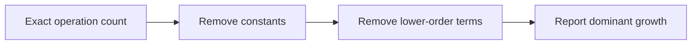
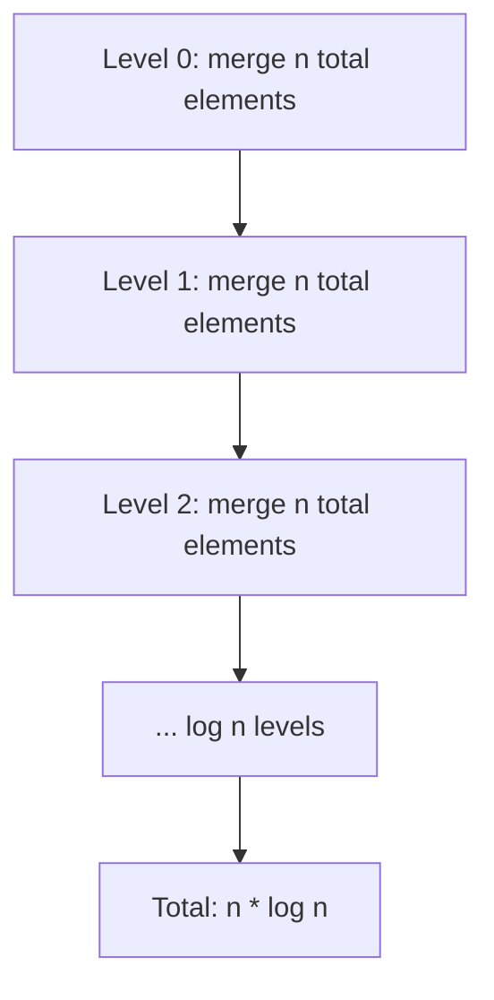
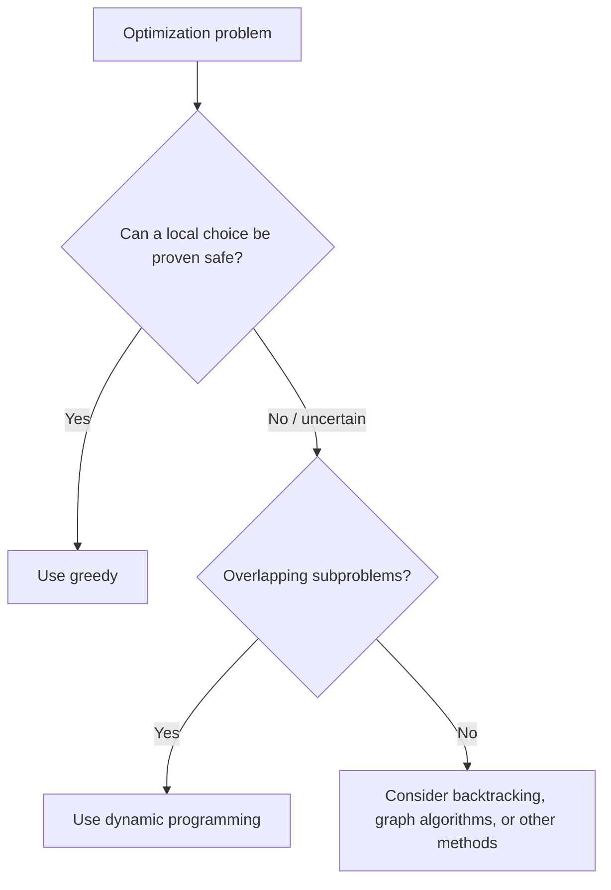

# Caelius Interview Preparation

## DSA Complexity Analysis (Q221-Q230)

For complexity questions, speak in this order:

```text
Define input size -> Count dominant operations -> State case/assumptions -> Give time -> Give auxiliary space
```

Strong interviewer phrasing:

> "Let `n` represent the number of input elements. I will count how the dominant operation grows as `n` increases, then ignore constant factors and lower-order terms."

---

# Q221. What Are Time Complexity and Space Complexity?

## Define

> Time complexity describes how an algorithm's number of operations grows with input size. Space complexity describes how its memory usage grows with input size.

They are growth models, not exact stopwatch time or exact byte counts.

## Example

```java
public static int sum(int[] values) {
    int total = 0;
    for (int value : values) {
        total += value;
    }
    return total;
}
```

Let `n = values.length`:

- The loop processes each element once: time `O(n)`.
- It uses a fixed number of variables: auxiliary space `O(1)`.

## Input Space vs Auxiliary Space

- Input space: memory needed to store the provided input.
- Auxiliary space: additional memory used by the algorithm.

Interview answers usually report auxiliary space unless stated otherwise.

## Recursive Space

```java
public static int sumRecursive(int[] values, int index) {
    if (index == values.length) {
        return 0;
    }
    return values[index] + sumRecursive(values, index + 1);
}
```

This still takes `O(n)` time, but also uses `O(n)` recursion-stack space.

## Interview Point

Always define what `n` means. For graph algorithms, use both `V` and `E`; for two strings, use `m` and `n`.

---

# Q222. What Is Big O Notation?

## Define

> Big O gives an asymptotic upper bound on how an algorithm's resource usage grows, ignoring constant factors and lower-order terms.

Informally, `f(n) = O(g(n))` means `f(n)` does not eventually grow faster than a constant multiple of `g(n)`.

## Simplification Examples

```text
3n + 10        -> O(n)
5n^2 + 2n + 8  -> O(n^2)
log2(n)        -> O(log n)
```

## Related Notations

| Notation | Meaning |
|---|---|
| Big O, `O(g(n))` | Asymptotic upper bound |
| Big Omega, `Omega(g(n))` | Asymptotic lower bound |
| Big Theta, `Theta(g(n))` | Tight asymptotic bound |

## Important Precision

If an operation always takes `3n + 10` steps, it is both `O(n)` and `Theta(n)`. Technically it is also `O(n^2)`, but `O(n)` is the more informative bound.

## Diagram



## Interview Point

Big O is not automatically worst case. It is an upper-bound notation that may describe worst, average, or best-case behavior when the case is explicitly stated.

---

# Q223. Explain Best, Average, and Worst Case

## Define

For all inputs of size `n`:

- Best case: minimum work performed.
- Average case: expected work under a defined input distribution.
- Worst case: maximum work performed.

## Example: Linear Search

```java
public static int linearSearch(int[] values, int target) {
    for (int i = 0; i < values.length; i++) {
        if (values[i] == target) {
            return i;
        }
    }
    return -1;
}
```

| Case | Scenario | Time |
|---|---|---:|
| Best | Target is first element | `O(1)` |
| Average | Target is typically around the middle | `O(n)` |
| Worst | Target is last or absent | `O(n)` |

## Why Worst Case Is Commonly Reported

Worst-case analysis:

- Gives a guaranteed upper limit.
- Does not require assumptions about input distribution.
- Matters for latency-sensitive and safety-critical systems.

## Average-Case Caution

Average case is meaningful only when the probability distribution is defined. "Average" should not mean an informal guess.

## Interview Point

Name the scenario that causes each case, not just the final complexity.

---

# Q224. Time Complexity of Binary Search

## State

> Binary search compares the target with the middle of a sorted search range and discards half of the remaining candidates each iteration.

## Derivation

After `k` iterations:

```text
remaining size = n / 2^k
```

Stop when:

```text
n / 2^k <= 1
2^k >= n
k >= log2(n)
```

Therefore:

- Best case: `O(1)` when the first middle value matches.
- Worst and average case: `O(log n)`.

## Iterative Code

```java
public static int binarySearch(int[] values, int target) {
    int low = 0;
    int high = values.length - 1;

    while (low <= high) {
        int middle = low + (high - low) / 2;
        if (values[middle] == target) {
            return middle;
        }
        if (values[middle] < target) {
            low = middle + 1;
        } else {
            high = middle - 1;
        }
    }

    return -1;
}
```

## Space Complexity

- Iterative: `O(1)` auxiliary space.
- Recursive: `O(log n)` stack space.

## Interview Point

Binary search requires a sorted or otherwise monotonic search space and efficient access to the middle. On a linked list, reaching each middle is not `O(1)`.

---

# Q225. Time Complexity of Merge Sort

## State

> Merge sort divides the input into two halves, sorts both recursively, and merges all `n` elements at each recursion level.

## Recurrence

```text
T(n) = 2T(n / 2) + O(n)
```

## Derivation

- Number of division levels: `log2(n)`.
- Total merge work at each level: `O(n)`.
- Total time: `O(n log n)`.



## Cases

| Case | Time |
|---|---:|
| Best | `O(n log n)` |
| Average | `O(n log n)` |
| Worst | `O(n log n)` |

Standard array merge sort:

- Auxiliary merge space: `O(n)`.
- Recursion stack: `O(log n)`.

## Interview Point

Even sorted input is recursively divided and merged in the standard implementation, so its best case remains `O(n log n)` unless extra optimizations are added.

---

# Q226. Time Complexity of HashMap Operations

## Expected Complexity

For a well-distributed hash function and controlled load factor:

| Operation | Expected time |
|---|---:|
| `get` | `O(1)` |
| `put` | `O(1)` amortized |
| `remove` | `O(1)` |
| `containsKey` | `O(1)` |
| Full iteration | `O(n + capacity)` implementation-dependent |

## Why `O(1)` Is Not Guaranteed

All keys could collide into one bucket. Searching that bucket may take:

- `O(n)` in a linear chain.
- Potentially `O(log n)` in a treeified bucket when implementation conditions permit.

## Why `put` Is Amortized `O(1)`

Most insertions are constant expected time. Occasionally, resizing allocates a larger table and redistributes entries, costing `O(n)`. Across many insertions, average cost per insertion remains constant.

## Key Complexity Matters

Hash-table complexity also depends on:

- Cost of computing `hashCode()`.
- Cost of `equals()` comparisons.
- Key mutability and distribution quality.

## Interview Point

Say "`O(1)` expected or amortized under good hashing," not "`O(1)` guaranteed."

---

# Q227. Explain O(1), O(log n), O(n), O(n log n), and O(n^2)

## Growth Comparison

| Complexity | Intuition | Typical example |
|---|---|---|
| `O(1)` | Work does not grow with input size | Array index access |
| `O(log n)` | Repeatedly shrink problem by a constant factor | Binary search |
| `O(n)` | Process every element once | Linear scan |
| `O(n log n)` | `log n` levels with `n` work per level | Merge sort |
| `O(n^2)` | Compare/process many pairs | Nested full loops |

## At `n = 1,000,000`

Approximate operation-growth comparison:

```text
O(1)       -> 1
O(log2 n)  -> about 20
O(n)       -> 1,000,000
O(n log n) -> about 20,000,000
O(n^2)     -> 1,000,000,000,000
```

## Code Shapes

```java
// O(1)
int first = values[0];

// O(log n)
for (int size = values.length; size > 1; size /= 2) {
    // Constant work
}

// O(n)
for (int value : values) {
    // Constant work
}

// O(n^2)
for (int firstIndex = 0; firstIndex < values.length; firstIndex++) {
    for (int secondIndex = 0; secondIndex < values.length; secondIndex++) {
        // Constant work
    }
}
```

## Important Caution

Nested loops are not automatically `O(n^2)`. Analyze how many total iterations occur. A two-pointer loop with nested-looking movement can still be `O(n)` if each pointer advances at most `n` times.

---

# Q228. Explain Amortized Time Complexity

## Define

> Amortized analysis spreads the cost of occasional expensive operations over a sequence of operations, providing a guaranteed average cost per operation for that sequence without assuming random inputs.

## Dynamic Array Example

Suppose an array doubles when full:

```text
capacities copied: 1 + 2 + 4 + 8 + ... < 2n
```

Across `n` appends:

- Normal appends cost `O(1)`.
- Occasional resize appends cost `O(current size)`.
- Total work remains `O(n)`.
- Amortized cost per append is `O(1)`.

## Code Sketch

```java
public void add(int value) {
    if (size == values.length) {
        values = Arrays.copyOf(values, values.length * 2);
    }
    values[size++] = value;
}
```

## Amortized vs Average Case

| Amortized | Average case |
|---|---|
| Analyzes a sequence of operations | Analyzes expected cost over an input distribution |
| Does not require probability | Requires probability assumptions |
| Gives sequence-level guarantee | Gives expectation |

## Other Examples

- `ArrayList.add()` at the end.
- Hash-table insertion with resizing.
- Stack operations in some multi-operation data structures.

## Interview Point

Amortized `O(1)` does not mean every individual operation is `O(1)`.

---

# Q229. What Makes an Algorithm Efficient?

## Answer

> An efficient algorithm satisfies the required correctness and system constraints while using time, memory, I/O, and implementation complexity appropriately for the expected workload.

## Evaluation Factors

### Asymptotic Scalability

- How do time and memory grow?
- What are worst-case guarantees?
- Does performance degrade under adversarial input?

### Real Workload

- Typical input size and distribution.
- Frequency of reads versus writes.
- Batch versus latency-sensitive execution.
- Online versus offline processing.

### System Behavior

- Cache locality.
- Disk and network I/O.
- Parallelism and contention.
- Allocation and garbage collection.

### Engineering Tradeoffs

- Correctness and maintainability.
- Simplicity versus sophistication.
- Stable and deterministic output.
- Ease of testing and observability.

## Example

For tiny arrays, insertion sort can outperform an asymptotically better sort because it has low overhead and good locality. For millions of elements, `O(n log n)` growth dominates.

## Interview Point

The asymptotically fastest algorithm is not always the best production choice. State constraints and justify the tradeoff.

---

# Q230. Difference Between Greedy and Dynamic Programming

## Define

> A greedy algorithm commits to the locally best choice at each step without revisiting it. Dynamic programming evaluates and reuses results for multiple states so it can compare combinations of choices.

## Comparison

| Property | Greedy | Dynamic programming |
|---|---|---|
| Choice behavior | Makes irrevocable local choice | Compares outcomes across states |
| Required proof | Greedy-choice property | Optimal substructure + overlapping subproblems |
| Typical speed/space | Often faster and smaller | Often more time and memory |
| Revisits alternatives | No | Yes, through stored states |
| Correctness | Problem-specific | Problem-specific recurrence |

## Coin Example

For denominations `[1, 3, 4]` and amount `6`:

```text
Greedy: 4 + 1 + 1 = 3 coins
Optimal: 3 + 3     = 2 coins
```

Greedy fails because choosing the largest immediate coin does not guarantee the globally smallest number of coins.

For standard activity selection, choosing the activity with earliest finishing time can be proven optimal, so greedy is appropriate.

## Decision Guide



## Interview Point

Never choose greedy only because it seems intuitive. Explain the exchange argument, cut property, or other proof showing the local choice is globally safe.

---

# Reusable Complexity Analysis Guide

## Sequential Work Adds

```text
O(n) + O(n^2) = O(n^2)
```

The dominant term wins.

## Nested Independent Work Multiplies

```text
n outer iterations * n inner iterations = O(n^2)
```

## Halving or Doubling Produces Logarithms

```text
n -> n/2 -> n/4 -> ... -> 1 = O(log n) steps
```

## Recursion Requires Two Questions

1. How many recursive calls or states exist?
2. How much non-recursive work occurs in each call/state?

## Data-Structure Operations Count Too

```text
n iterations * O(log n) TreeMap insertion = O(n log n)
n iterations * expected O(1) HashMap insertion = expected O(n)
```

# Complexity Interview Testing Checklist

Before stating complexity, verify:

```text
input-size definition
best/average/worst case
expected versus guaranteed
amortized versus per-operation
recursive stack space
output space versus auxiliary space
cost of library/data-structure operations
multiple independent input dimensions
integer size or numeric magnitude
```

# DSA Complexity Revision Sheet

| Question | Key answer |
|---|---|
| Time and space | Growth of operations and memory with input |
| Big O | Asymptotic upper bound |
| Best/average/worst | Minimum, expected, maximum work for size `n` |
| Binary search | `O(log n)` by halving |
| Merge sort | `O(n log n)` from `log n` levels of `n` work |
| HashMap | Expected `O(1)`, collision worst case higher |
| Growth rates | `1 < log n < n < n log n < n^2` |
| Amortized analysis | Spread rare expensive work over an operation sequence |
| Efficient algorithm | Meets workload constraints across resources |
| Greedy vs DP | Proven local choice vs stored state comparison |

## Common Interview Mistakes

- Giving complexity without defining input size.
- Treating Big O as exact runtime.
- Saying Big O always means worst case.
- Ignoring recursive stack space.
- Claiming all nested loops are quadratic.
- Calling expected HashMap lookup guaranteed `O(1)`.
- Confusing amortized analysis with average-case probability.
- Ignoring output size when an algorithm generates results.
- Choosing greedy without proving the local choice is safe.
