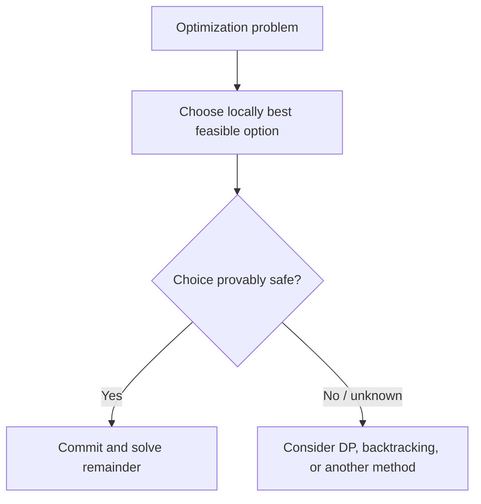
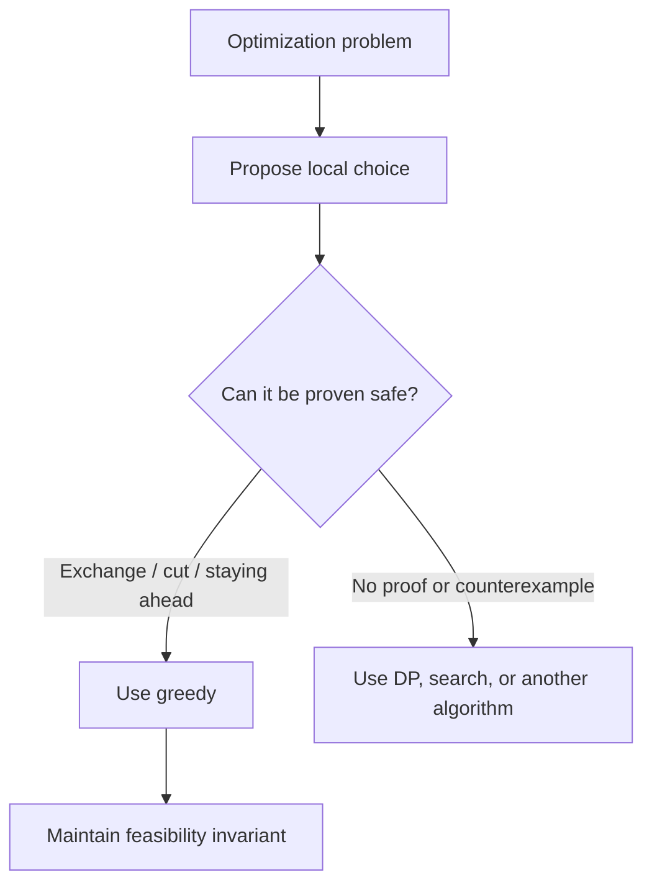

# Caelius Interview Preparation

## DSA Greedy Algorithms (Q231-Q240)

For greedy questions, speak in this order:

```text
State -> Define local choice -> Explain why it is safe -> Code -> Complexity -> Counterexample/limits
```

Strong interviewer phrasing:

> "I will make the locally best choice according to ____. The reason this is globally safe is ____. Once chosen, I do not need to revisit it."

---

# Q231. What Is a Greedy Algorithm?

## Define

> A greedy algorithm builds a solution one choice at a time, always taking the locally best available choice and never revisiting earlier decisions.

## When Greedy Is Correct

A problem generally needs:

1. **Greedy-choice property:** some globally optimal solution contains the locally optimal choice.
2. **Optimal substructure:** after making that choice, the remaining problem can also be solved optimally.

## Common Proof Styles

- Exchange argument: replace an optimal solution's first choice with the greedy choice without making it worse.
- Cut property: the cheapest safe edge crossing a cut belongs to some MST.
- Staying-ahead argument: show the greedy partial solution is never worse than alternatives.

## Greedy Framework

```java
public static Result greedy(List<Candidate> candidates) {
    candidates.sort(greedyOrder());
    Result result = new Result();

    for (Candidate candidate : candidates) {
        if (isFeasible(result, candidate)) {
            add(result, candidate);
        }
    }

    return result;
}
```

## Diagram



## Interview Point

Greedy is not correct merely because it is fast or intuitive. State the proof idea or a property that guarantees optimality.

---

# Q232. Activity Selection Problem

## Problem

Given activities with start and finish times, select the maximum number of mutually non-overlapping activities.

## Greedy Choice

> Select the compatible activity that finishes earliest. It leaves the greatest remaining time for future activities.

## Exchange Argument

Suppose an optimal schedule starts with a different compatible activity. Replacing it with the earliest-finishing activity cannot reduce the room available afterward, so an optimal schedule exists that begins with the greedy choice.

## Code

```java
public record Activity(int start, int finish) {}

public static List<Activity> selectActivities(List<Activity> activities) {
    List<Activity> sorted = new ArrayList<>(activities);
    sorted.sort(Comparator.comparingInt(Activity::finish));

    List<Activity> selected = new ArrayList<>();
    int previousFinish = Integer.MIN_VALUE;

    for (Activity activity : sorted) {
        if (activity.start() >= previousFinish) {
            selected.add(activity);
            previousFinish = activity.finish();
        }
    }

    return selected;
}
```

## Complexity

- Sorting: `O(n log n)`
- Selection scan: `O(n)`
- Extra space: `O(n)` for returned result and copied list

## Interview Point

Choosing the earliest-starting or shortest-duration activity is not generally optimal. Earliest finish is the provably safe criterion.

---

# Q233. Fractional Knapsack

## Problem

Items have weight and value. Fractions of items may be selected to maximize value within capacity.

## Greedy Choice

> Select available item mass in descending order of value-to-weight ratio.

Because fractions are allowed, replacing lower-ratio weight with higher-ratio weight can only improve the result.

## Code

```java
public record Item(double weight, double value) {}

public static double fractionalKnapsack(
        List<Item> items,
        double capacity) {
    if (capacity < 0) {
        throw new IllegalArgumentException("Capacity cannot be negative");
    }

    List<Item> sorted = new ArrayList<>(items);
    for (Item item : sorted) {
        if (item.weight() <= 0) {
            throw new IllegalArgumentException(
                "Item weights must be positive"
            );
        }
    }

    sorted.sort(
        Comparator.comparingDouble(
            item -> -item.value() / item.weight()
        )
    );

    double totalValue = 0;
    double remaining = capacity;

    for (Item item : sorted) {
        if (remaining == 0) {
            break;
        }

        double selectedWeight = Math.min(remaining, item.weight());
        totalValue += selectedWeight * item.value() / item.weight();
        remaining -= selectedWeight;
    }

    return totalValue;
}
```

## Complexity

- Time: `O(n log n)`
- Extra space: `O(n)` for copied/sorted input

## Critical Difference

Ratio-based greedy is optimal for **fractional knapsack**, but not for **0/1 knapsack**, where items cannot be split.

---

# Q234. Huffman Coding

## Define

> Huffman coding builds an optimal prefix-free binary code by repeatedly merging the two least-frequent symbols or subtrees.

Frequently occurring symbols receive shorter codes; rare symbols receive longer codes.

## Greedy Choice

The two least-frequent symbols can be placed as deepest siblings in some optimal prefix tree. Merge them and solve the smaller problem.

## Code

```java
public static final class HuffmanNode {
    final Character symbol;
    final long frequency;
    final HuffmanNode left;
    final HuffmanNode right;

    HuffmanNode(Character symbol, long frequency) {
        this(symbol, frequency, null, null);
    }

    HuffmanNode(
            Character symbol,
            long frequency,
            HuffmanNode left,
            HuffmanNode right) {
        this.symbol = symbol;
        this.frequency = frequency;
        this.left = left;
        this.right = right;
    }

    boolean isLeaf() {
        return left == null && right == null;
    }
}

public static Map<Character, String> huffmanCodes(
        Map<Character, Long> frequencies) {
    PriorityQueue<HuffmanNode> queue = new PriorityQueue<>(
        Comparator.comparingLong(node -> node.frequency)
    );

    for (Map.Entry<Character, Long> entry : frequencies.entrySet()) {
        if (entry.getValue() <= 0) {
            throw new IllegalArgumentException(
                "Frequencies must be positive"
            );
        }
        queue.offer(new HuffmanNode(entry.getKey(), entry.getValue()));
    }

    if (queue.isEmpty()) {
        return Map.of();
    }

    while (queue.size() > 1) {
        HuffmanNode first = queue.poll();
        HuffmanNode second = queue.poll();
        queue.offer(new HuffmanNode(
            null,
            first.frequency + second.frequency,
            first,
            second
        ));
    }

    Map<Character, String> codes = new HashMap<>();
    buildCodes(queue.poll(), "", codes);
    return codes;
}

private static void buildCodes(
        HuffmanNode node,
        String prefix,
        Map<Character, String> codes) {
    if (node.isLeaf()) {
        codes.put(node.symbol, prefix.isEmpty() ? "0" : prefix);
        return;
    }

    buildCodes(node.left, prefix + '0', codes);
    buildCodes(node.right, prefix + '1', codes);
}
```

## Complexity

For `k` distinct symbols:

- Tree construction: `O(k log k)`
- Code generation: `O(k + total code length)`
- Space: `O(k)`

## Interview Point

Huffman codes are prefix-free, so no symbol's code is the prefix of another. This enables unambiguous decoding without separators.

---

# Q235. Job Sequencing Problem

## Problem

Each unit-time job has a deadline and profit. Schedule at most one job per time slot to maximize total profit.

## Greedy Choice

> Process jobs from highest profit to lowest, placing each job in the latest free slot at or before its deadline.

Using the latest slot preserves earlier slots for jobs with tighter deadlines.

## Code

```java
public record Job(String id, int deadline, int profit) {}
public record JobSchedule(List<Job> jobs, long totalProfit) {}

public static JobSchedule scheduleJobs(List<Job> jobs) {
    List<Job> sorted = new ArrayList<>(jobs);
    sorted.sort(Comparator.comparingInt(Job::profit).reversed());

    int maximumDeadline = 0;
    for (Job job : sorted) {
        maximumDeadline = Math.max(maximumDeadline, job.deadline());
    }

    Job[] slots = new Job[maximumDeadline];
    long totalProfit = 0;

    for (Job job : sorted) {
        for (int slot = Math.min(job.deadline(), maximumDeadline) - 1;
                slot >= 0;
                slot--) {
            if (slots[slot] == null) {
                slots[slot] = job;
                totalProfit += job.profit();
                break;
            }
        }
    }

    List<Job> selected = new ArrayList<>();
    for (Job job : slots) {
        if (job != null) {
            selected.add(job);
        }
    }
    return new JobSchedule(selected, totalProfit);
}
```

## Complexity

- Sorting: `O(n log n)`
- Simple slot search: `O(n * D)`, where `D` is maximum deadline
- Extra space: `O(D)`

## Optimize

Use Disjoint Set Union to find the latest free slot in near-constant amortized time, making scheduling approximately `O(n log n)`.

## Interview Point

Clarify that each job takes exactly one unit of time. Different durations require a different model.

---

# Q236. Minimum Number of Coins

## State

> Greedy repeatedly takes the largest denomination not exceeding the remaining amount. This is optimal only for coin systems with a proven canonical property.

## Code

```java
public static List<Integer> greedyCoins(int[] denominations, int amount) {
    if (amount < 0) {
        throw new IllegalArgumentException("Amount cannot be negative");
    }

    int[] sorted = denominations.clone();
    Arrays.sort(sorted);
    List<Integer> selected = new ArrayList<>();

    int remaining = amount;
    for (int i = sorted.length - 1; i >= 0; i--) {
        if (sorted[i] <= 0) {
            throw new IllegalArgumentException(
                "Denominations must be positive"
            );
        }

        while (sorted[i] <= remaining) {
            selected.add(sorted[i]);
            remaining -= sorted[i];
        }
    }

    if (remaining != 0) {
        return List.of();
    }
    return selected;
}
```

## Counterexample

For denominations `[1, 3, 4]` and amount `6`:

```text
Greedy: 4 + 1 + 1 = 3 coins
Optimal: 3 + 3     = 2 coins
```

## Complexity

- Sorting: `O(k log k)` for `k` denominations
- Output-dependent selection time: `O(number of selected coins)`

## Correct Alternative

For arbitrary denominations, use dynamic programming:

- Time: `O(k * amount)`
- Space: `O(amount)`

## Interview Point

State the denomination assumptions before claiming greedy is optimal.

---

# Q237. Gas Station Problem

## Problem

Given circular arrays `gas[i]` and `cost[i]`, find a station from which a vehicle can complete the circuit, or return `-1`.

## Greedy Insight

If the running fuel becomes negative while traveling from candidate `start` through station `i`, no station from `start` through `i` can be a valid start. Reset the candidate to `i + 1`.

## Code

```java
public static int gasStationStart(int[] gas, int[] cost) {
    if (gas.length != cost.length) {
        throw new IllegalArgumentException("Lengths must match");
    }

    long totalBalance = 0;
    long currentBalance = 0;
    int start = 0;

    for (int i = 0; i < gas.length; i++) {
        long difference = (long) gas[i] - cost[i];
        totalBalance += difference;
        currentBalance += difference;

        if (currentBalance < 0) {
            start = i + 1;
            currentBalance = 0;
        }
    }

    return totalBalance >= 0 && start < gas.length ? start : -1;
}
```

## Why It Works

- If total gas is less than total cost, no solution exists.
- When a segment starting at `start` fails at `i`, any later station within that failed segment begins with less accumulated surplus and also fails before or at `i`.

## Complexity

- Time: `O(n)`
- Extra space: `O(1)`

## Interview Point

The global total determines existence; the local running balance determines the candidate start.

---

# Q238. Jump Game

## Problem

Each array value is the maximum jump length from that index. Determine whether the final index is reachable.

## Greedy Choice

> Track the farthest index reachable from all positions processed so far. If the current index is beyond it, the path is blocked.

## Code

```java
public static boolean canReachEnd(int[] jumps) {
    int farthest = 0;

    for (int index = 0; index < jumps.length; index++) {
        if (index > farthest) {
            return false;
        }

        farthest = Math.max(farthest, index + jumps[index]);
        if (farthest >= jumps.length - 1) {
            return true;
        }
    }

    return jumps.length == 0 || farthest >= jumps.length - 1;
}
```

## Invariant

After processing index `i`, `farthest` is the greatest index reachable using jumps starting from any reachable index at or before `i`.

## Complexity

- Time: `O(n)`
- Extra space: `O(1)`

## Follow-Up

Finding the minimum number of jumps uses a greedy level-range approach resembling BFS over reachable index ranges.

## Interview Point

Do not greedily jump to the position with the largest immediate jump value; track total reachable distance instead.

---

# Q239. Meeting Rooms Problem

## Clarify

Two common variants:

1. Can one person attend all meetings?
2. What is the minimum number of rooms needed?

This answer covers both.

## Can Attend All Meetings

```java
public record Interval(int start, int end) {}

public static boolean canAttendAll(List<Interval> meetings) {
    List<Interval> sorted = new ArrayList<>(meetings);
    sorted.sort(Comparator.comparingInt(Interval::start));

    for (int i = 1; i < sorted.size(); i++) {
        if (sorted.get(i).start() < sorted.get(i - 1).end()) {
            return false;
        }
    }
    return true;
}
```

## Minimum Rooms

> Process meetings by start time and reuse the room whose current meeting finishes earliest whenever possible.

```java
public static int minimumMeetingRooms(List<Interval> meetings) {
    List<Interval> sorted = new ArrayList<>(meetings);
    sorted.sort(Comparator.comparingInt(Interval::start));

    PriorityQueue<Integer> endingTimes = new PriorityQueue<>();
    int maximumRooms = 0;

    for (Interval meeting : sorted) {
        while (!endingTimes.isEmpty()
                && endingTimes.peek() <= meeting.start()) {
            endingTimes.poll();
        }

        endingTimes.offer(meeting.end());
        maximumRooms = Math.max(maximumRooms, endingTimes.size());
    }

    return maximumRooms;
}
```

## Complexity

- Attend-all check: `O(n log n)` time
- Minimum rooms: `O(n log n)` time, `O(n)` space

## Interview Point

Clarify whether a meeting ending at time `t` and another starting at `t` overlap. This solution treats them as non-overlapping.

---

# Q240. Minimum Spanning Tree - Greedy Approach

## Define

> A Minimum Spanning Tree connects every vertex of a weighted, connected, undirected graph with minimum total edge weight and no cycles.

Both Kruskal's and Prim's algorithms are greedy.

## Kruskal's Greedy Choice

Choose the globally lightest edge that connects two currently separate components.

```java
public record Edge(int from, int to, int weight) {}

public static long kruskalMst(int vertices, List<Edge> edges) {
    List<Edge> sorted = new ArrayList<>(edges);
    sorted.sort(Comparator.comparingInt(Edge::weight));

    DisjointSet dsu = new DisjointSet(vertices);
    long totalWeight = 0;
    int selected = 0;

    for (Edge edge : sorted) {
        if (dsu.union(edge.from(), edge.to())) {
            totalWeight += edge.weight();
            selected++;

            if (selected == vertices - 1) {
                return totalWeight;
            }
        }
    }

    throw new IllegalArgumentException("Graph is disconnected");
}

public static final class DisjointSet {
    private final int[] parent;
    private final int[] rank;

    DisjointSet(int size) {
        parent = new int[size];
        rank = new int[size];
        for (int i = 0; i < size; i++) {
            parent[i] = i;
        }
    }

    int find(int node) {
        if (parent[node] != node) {
            parent[node] = find(parent[node]);
        }
        return parent[node];
    }

    boolean union(int first, int second) {
        int rootA = find(first);
        int rootB = find(second);
        if (rootA == rootB) {
            return false;
        }

        if (rank[rootA] < rank[rootB]) {
            parent[rootA] = rootB;
        } else if (rank[rootA] > rank[rootB]) {
            parent[rootB] = rootA;
        } else {
            parent[rootB] = rootA;
            rank[rootA]++;
        }
        return true;
    }
}
```

## Why the Choice Is Safe

By the cut property, for any partition of vertices, a minimum-weight edge crossing that cut belongs to some MST. Kruskal selects such safe edges while preventing cycles.

## Kruskal vs Prim

| Kruskal | Prim |
|---|---|
| Sorts edges globally | Grows from a start vertex |
| Uses Union-Find | Uses visited set + min-priority queue |
| Often convenient for sparse edge lists | Often convenient for adjacency lists |

## Complexity

- Kruskal: `O(E log E)`
- Prim with binary heap: `O(E log V)`

## Interview Point

An MST minimizes total connection weight. It does not necessarily provide shortest paths from a source.

---

# Reusable Greedy Decision Guide



## Common Greedy Choices

```text
earliest finishing interval
highest value-to-weight ratio
two smallest frequencies
highest profit placed latest
farthest reachable index
lightest safe edge
```

# Greedy Interview Testing Checklist

Test:

```text
empty input
single candidate
all candidates compatible
all candidates conflict
ties in greedy ordering
zero or negative values
impossible solution
disconnected graph
counterexample to naive greedy choice
boundary-touching intervals
```

# DSA Greedy Revision Sheet

| Question | Greedy choice | Time |
|---|---|---:|
| Greedy definition | Locally best provably safe choice | Problem-dependent |
| Activity selection | Earliest finishing compatible activity | `O(n log n)` |
| Fractional knapsack | Highest value/weight ratio | `O(n log n)` |
| Huffman coding | Merge two least frequencies | `O(k log k)` |
| Job sequencing | Highest profit, latest available slot | `O(n*D)` simple |
| Minimum coins | Largest coin, only for canonical systems | Output-dependent |
| Gas station | Reset start after failed segment | `O(n)` |
| Jump game | Maintain farthest reachable index | `O(n)` |
| Meeting rooms | Reuse earliest-ending room | `O(n log n)` |
| MST | Lightest safe edge | `O(E log E)` Kruskal |

## Common Interview Mistakes

- Choosing greedy without a correctness argument.
- Using earliest-starting activity instead of earliest-finishing.
- Applying fractional-knapsack logic to 0/1 knapsack.
- Assuming largest-coin greedy works for arbitrary denominations.
- Losing job slots by placing a job earlier than necessary.
- Tracking the largest jump value instead of farthest reachable position.
- Confusing an MST with a shortest-path tree.
- Ignoring ties and boundary-overlap definitions.
