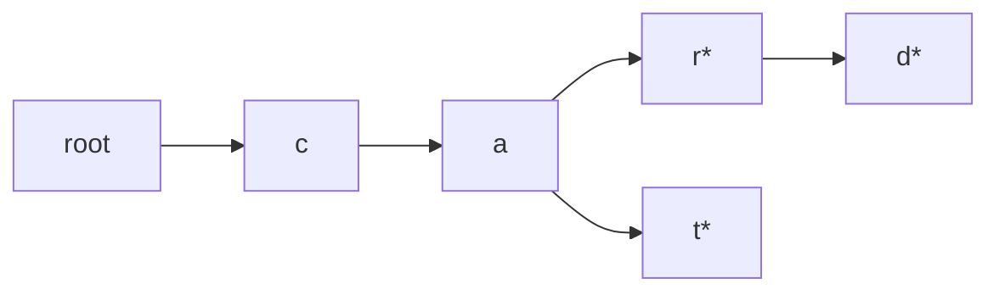
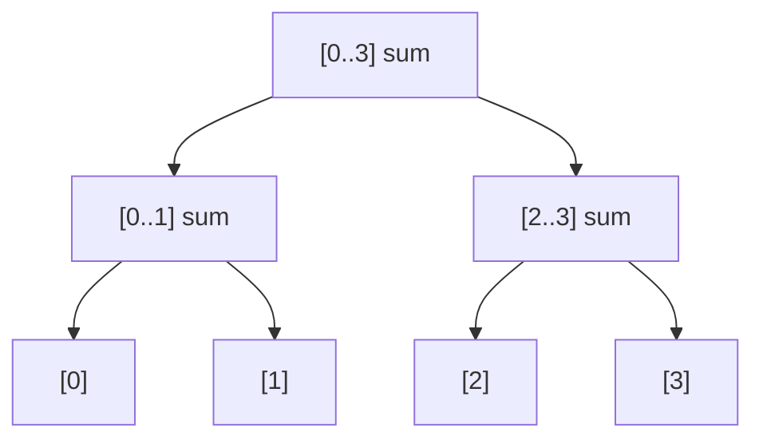
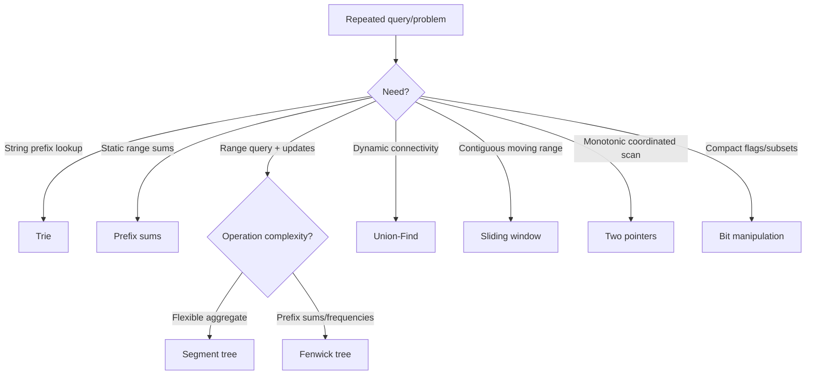

# Caelius Interview Preparation

## Miscellaneous DSA (Q241-Q250)

This section covers structures and techniques that often convert repeated expensive operations into efficient queries.

For each question, speak in this order:

```text
Define -> State invariant -> Explain operations -> Code/example -> Complexity -> Use case
```

---

# Q241. What Is a Trie? Use Cases?

## Define

> A trie, or prefix tree, stores strings character by character so strings sharing a prefix also share nodes.

Each path from the root represents a prefix. A terminal marker distinguishes a complete word from a prefix.

## Diagram

Words: `car`, `card`, `cat`



`*` marks a complete stored word.

## Core Invariant

At depth `d`, the current trie node represents the prefix containing the first `d` characters of the search word.

## Complexity

For a word of length `L`:

- Insert: `O(L)`
- Exact search: `O(L)`
- Prefix check: `O(L)`
- Space: proportional to total created prefix nodes

## Use Cases

- Autocomplete and search suggestions.
- Prefix filtering.
- Spell checking.
- Dictionary word search.
- IP routing with bitwise tries.
- Finding longest matching prefix.

## Tradeoff

Tries provide prefix operations independent of the number of stored words, but can consume more memory than hash-based storage.

---

# Q242. Insert and Search in a Trie

## State

> Insert follows or creates one node per character. Search follows existing nodes and succeeds only if the final node is marked as a complete word.

This implementation supports lowercase English letters.

## Code

```java
public static final class Trie {
    private final TrieNode root = new TrieNode();

    public void insert(String word) {
        TrieNode current = root;

        for (int i = 0; i < word.length(); i++) {
            int index = characterIndex(word.charAt(i));
            if (current.children[index] == null) {
                current.children[index] = new TrieNode();
            }
            current = current.children[index];
        }

        current.isWord = true;
    }

    public boolean contains(String word) {
        TrieNode node = findNode(word);
        return node != null && node.isWord;
    }

    public boolean startsWith(String prefix) {
        return findNode(prefix) != null;
    }

    private TrieNode findNode(String value) {
        TrieNode current = root;

        for (int i = 0; i < value.length(); i++) {
            int index = characterIndex(value.charAt(i));
            current = current.children[index];
            if (current == null) {
                return null;
            }
        }

        return current;
    }

    private static int characterIndex(char character) {
        if (character < 'a' || character > 'z') {
            throw new IllegalArgumentException(
                "Only lowercase English letters are supported"
            );
        }
        return character - 'a';
    }

    private static final class TrieNode {
        private final TrieNode[] children = new TrieNode[26];
        private boolean isWord;
    }
}
```

## Exact Search vs Prefix Search

If only `"card"` is inserted:

- `contains("car")` is false unless `"car"` was separately inserted.
- `startsWith("car")` is true.

## Complexity

- Insert/search/prefix: `O(L)`
- Each array-based node reserves 26 child references

## Optimize

For a large or sparse alphabet, use `Map<Character, TrieNode>` children to save space at the cost of hashing overhead.

---

# Q243. What Is a Segment Tree?

## Define

> A segment tree is a balanced binary tree that stores aggregate information for array ranges, supporting range queries and point updates in `O(log n)`.

Common aggregates:

- Sum
- Minimum or maximum
- Greatest common divisor
- Custom mergeable information

## Invariant

Each node stores the aggregate for one contiguous array segment. Its value is obtained by merging its two child segments.

## Diagram



## Range-Sum Implementation

```java
public static final class SegmentTree {
    private final int size;
    private final long[] tree;

    public SegmentTree(int[] values) {
        size = values.length;
        tree = new long[Math.max(1, 4 * size)];
        if (size > 0) {
            build(values, 1, 0, size - 1);
        }
    }

    public void update(int index, int value) {
        validateIndex(index);
        update(1, 0, size - 1, index, value);
    }

    public long rangeSum(int queryLeft, int queryRight) {
        if (queryLeft < 0 || queryRight >= size || queryLeft > queryRight) {
            throw new IllegalArgumentException("Invalid query range");
        }
        return rangeSum(1, 0, size - 1, queryLeft, queryRight);
    }

    private void build(int[] values, int node, int left, int right) {
        if (left == right) {
            tree[node] = values[left];
            return;
        }

        int middle = left + (right - left) / 2;
        build(values, node * 2, left, middle);
        build(values, node * 2 + 1, middle + 1, right);
        tree[node] = tree[node * 2] + tree[node * 2 + 1];
    }

    private void update(
            int node,
            int left,
            int right,
            int index,
            int value) {
        if (left == right) {
            tree[node] = value;
            return;
        }

        int middle = left + (right - left) / 2;
        if (index <= middle) {
            update(node * 2, left, middle, index, value);
        } else {
            update(node * 2 + 1, middle + 1, right, index, value);
        }

        tree[node] = tree[node * 2] + tree[node * 2 + 1];
    }

    private long rangeSum(
            int node,
            int left,
            int right,
            int queryLeft,
            int queryRight) {
        if (queryLeft <= left && right <= queryRight) {
            return tree[node];
        }
        if (right < queryLeft || queryRight < left) {
            return 0;
        }

        int middle = left + (right - left) / 2;
        return rangeSum(
            node * 2,
            left,
            middle,
            queryLeft,
            queryRight
        ) + rangeSum(
            node * 2 + 1,
            middle + 1,
            right,
            queryLeft,
            queryRight
        );
    }

    private void validateIndex(int index) {
        if (index < 0 || index >= size) {
            throw new IndexOutOfBoundsException(index);
        }
    }
}
```

## Complexity

- Build: `O(n)`
- Point update: `O(log n)`
- Range query: `O(log n)`
- Space: `O(n)`

## Follow-Up

Lazy propagation supports range updates while keeping queries and updates logarithmic.

---

# Q244. What Is a Fenwick Tree (Binary Indexed Tree)?

## Define

> A Fenwick tree is a compact array-based structure that supports prefix-sum queries and point updates in `O(log n)`.

It is simpler and uses less memory than a segment tree, but supports a narrower set of operations.

## Bit Insight

```text
lowbit(i) = i & -i
```

`lowbit(i)` identifies the range size represented by Fenwick index `i`.

## Code

```java
public static final class FenwickTree {
    private final long[] tree;

    public FenwickTree(int size) {
        if (size < 0) {
            throw new IllegalArgumentException("Size cannot be negative");
        }
        tree = new long[size + 1];
    }

    public void add(int zeroBasedIndex, long delta) {
        validateIndex(zeroBasedIndex);

        for (int index = zeroBasedIndex + 1;
                index < tree.length;
                index += index & -index) {
            tree[index] += delta;
        }
    }

    public long prefixSum(int zeroBasedIndex) {
        if (zeroBasedIndex < -1 || zeroBasedIndex >= tree.length - 1) {
            throw new IndexOutOfBoundsException(zeroBasedIndex);
        }

        long sum = 0;
        for (int index = zeroBasedIndex + 1;
                index > 0;
                index -= index & -index) {
            sum += tree[index];
        }
        return sum;
    }

    public long rangeSum(int left, int right) {
        if (left < 0 || right >= tree.length - 1 || left > right) {
            throw new IllegalArgumentException("Invalid range");
        }
        return prefixSum(right) - prefixSum(left - 1);
    }

    private void validateIndex(int index) {
        if (index < 0 || index >= tree.length - 1) {
            throw new IndexOutOfBoundsException(index);
        }
    }
}
```

## Complexity

- Point add: `O(log n)`
- Prefix sum: `O(log n)`
- Range sum: `O(log n)`
- Space: `O(n)`

## Segment Tree vs Fenwick Tree

| Segment tree | Fenwick tree |
|---|---|
| More flexible aggregates and updates | Simpler prefix-based operations |
| More code and memory | Compact and fast |
| Supports range min/max naturally | Best known for sums/frequencies |

## Interview Point

Fenwick trees use one-based indexing internally because `lowbit(0)` is zero and cannot advance.

---

# Q245. What Is a Disjoint Set (Union-Find)?

## Define

> Disjoint Set Union maintains a partition of elements into non-overlapping groups and efficiently answers whether two elements belong to the same group.

Core operations:

- `find(x)`: return the representative of `x`'s set.
- `union(a, b)`: merge the sets containing `a` and `b`.

## Optimizations

- Path compression flattens parent paths during `find`.
- Union by rank or size attaches the smaller/shallower tree under the larger/deeper one.

## Code

```java
public static final class DisjointSet {
    private final int[] parent;
    private final int[] size;
    private int components;

    public DisjointSet(int elements) {
        parent = new int[elements];
        size = new int[elements];
        components = elements;

        for (int i = 0; i < elements; i++) {
            parent[i] = i;
            size[i] = 1;
        }
    }

    public int find(int element) {
        if (parent[element] != element) {
            parent[element] = find(parent[element]);
        }
        return parent[element];
    }

    public boolean union(int first, int second) {
        int rootA = find(first);
        int rootB = find(second);

        if (rootA == rootB) {
            return false;
        }

        if (size[rootA] < size[rootB]) {
            int temporary = rootA;
            rootA = rootB;
            rootB = temporary;
        }

        parent[rootB] = rootA;
        size[rootA] += size[rootB];
        components--;
        return true;
    }

    public boolean connected(int first, int second) {
        return find(first) == find(second);
    }

    public int components() {
        return components;
    }
}
```

## Complexity

With both optimizations:

- Amortized per operation: `O(alpha(n))`
- `alpha(n)`, inverse Ackermann, grows so slowly it is effectively constant for practical input sizes.
- Space: `O(n)`

## Use Cases

- Kruskal's MST algorithm.
- Undirected cycle detection.
- Dynamic connectivity.
- Grouping accounts or components.

---

# Q246. Sliding Window Technique - Explain With Example

## Define

> Sliding window maintains information about a contiguous range while moving its boundaries, avoiding recomputation for each range.

## Fixed-Size Example

Find the maximum sum of any subarray of size `k`.

## Code

```java
public static long maximumWindowSum(int[] values, int windowSize) {
    if (windowSize <= 0 || windowSize > values.length) {
        throw new IllegalArgumentException("Invalid window size");
    }

    long current = 0;
    for (int i = 0; i < windowSize; i++) {
        current += values[i];
    }

    long best = current;
    for (int right = windowSize; right < values.length; right++) {
        current += values[right];
        current -= values[right - windowSize];
        best = Math.max(best, current);
    }

    return best;
}
```

## Invariant

After each update:

```text
current = sum of exactly the active window
```

## Complexity

- Time: `O(n)`
- Extra space: `O(1)`

The naive method recalculates each window in `O(k)`, taking `O(n * k)`.

## Variable-Size Window

Variable windows often:

1. Expand the right boundary.
2. Shrink the left boundary while a condition is violated.
3. Record the best valid window.

## Interview Point

Sliding window usually applies to contiguous data and depends on being able to update the window state efficiently when boundaries move.

---

# Q247. Two-Pointer Technique - Explain With Example

## Define

> Two pointers use two coordinated indices to scan data while discarding impossible candidates, often reducing a quadratic search to linear time.

## Example: Pair Sum in Sorted Array

```java
public static int[] pairWithSum(int[] sortedValues, int target) {
    int left = 0;
    int right = sortedValues.length - 1;

    while (left < right) {
        long sum = (long) sortedValues[left] + sortedValues[right];

        if (sum == target) {
            return new int[] {left, right};
        }
        if (sum < target) {
            left++;
        } else {
            right--;
        }
    }

    return new int[] {-1, -1};
}
```

## Why Movement Is Safe

Because the array is sorted:

- If sum is too small, keeping the smaller left value cannot help, so move `left`.
- If sum is too large, keeping the larger right value cannot help, so move `right`.

## Complexity

- Time: `O(n)`
- Extra space: `O(1)`

## Common Two-Pointer Forms

- Opposite ends of sorted input.
- Slow and fast pointer in linked lists.
- Read/write pointers for in-place compaction.
- Two arrays advancing independently during merge.

## Interview Point

Nested-looking pointer movement can still be `O(n)` when each pointer moves only forward or inward at most `n` times.

---

# Q248. Prefix Sum Array

## Define

> A prefix sum array stores cumulative sums so any static range sum can be answered in `O(1)` after `O(n)` preprocessing.

## Convention

Use a prefix array of length `n + 1`:

```text
prefix[0] = 0
prefix[i + 1] = values[0] + ... + values[i]
```

Then:

```text
sum(left..right) = prefix[right + 1] - prefix[left]
```

## Code

```java
public static long[] buildPrefixSums(int[] values) {
    long[] prefix = new long[values.length + 1];

    for (int i = 0; i < values.length; i++) {
        prefix[i + 1] = prefix[i] + values[i];
    }

    return prefix;
}

public static long rangeSum(long[] prefix, int left, int right) {
    if (left < 0 || right >= prefix.length - 1 || left > right) {
        throw new IllegalArgumentException("Invalid range");
    }
    return prefix[right + 1] - prefix[left];
}
```

## Complexity

- Build: `O(n)`
- Each range query: `O(1)`
- Extra space: `O(n)`

## Limits

Prefix sums are ideal for static arrays. Updates require rebuilding or additional structures. Use a Fenwick tree or segment tree for frequent updates and range queries.

## Interview Point

The leading zero simplifies range formulas and naturally handles ranges beginning at index `0`.

---

# Q249. What Is Bit Manipulation?

## Define

> Bit manipulation directly reads or changes the binary representation of integers using bitwise operators.

## Java Operators

| Operator | Meaning |
|---|---|
| `&` | Bitwise AND |
| `|` | Bitwise OR |
| `^` | Bitwise XOR |
| `~` | Bitwise NOT |
| `<<` | Left shift |
| `>>` | Signed right shift |
| `>>>` | Unsigned right shift |

## Common Operations

For zero-based bit position `k`:

```java
public static boolean isBitSet(int value, int k) {
    return (value & (1 << k)) != 0;
}

public static int setBit(int value, int k) {
    return value | (1 << k);
}

public static int clearBit(int value, int k) {
    return value & ~(1 << k);
}

public static int toggleBit(int value, int k) {
    return value ^ (1 << k);
}
```

## Useful Identities

```text
x ^ x = 0
x ^ 0 = x
x & (x - 1) removes the lowest set bit
x & -x isolates the lowest set bit
```

## Use Cases

- Flags and permissions.
- Compact subsets and DP masks.
- Low-level protocols.
- Fast parity and power-of-two checks.
- Fenwick trees.

## Interview Point

Java shift behavior and signed integers matter. Use `1L << k` for long masks or positions beyond the safe int range.

---

# Q250. Count Set Bits in an Integer

## Define

> A set bit is a binary digit equal to `1`. The task is also called population count or Hamming weight.

## Brian Kernighan's Algorithm

`value & (value - 1)` removes the lowest set bit each iteration.

```java
public static int countSetBits(int value) {
    int count = 0;

    while (value != 0) {
        value &= value - 1;
        count++;
    }

    return count;
}
```

## Trace

For `12`, binary `1100`:

```text
1100 -> 1000 -> 0000
count = 2
```

## Complexity

- Time: `O(s)`, where `s` is the number of set bits
- Worst case for Java `int`: at most 32 iterations, effectively `O(1)` for fixed-width integers
- Extra space: `O(1)`

## Java Built-In

```java
int count = Integer.bitCount(value);
```

## Important Detail

The algorithm also works for negative Java integers because they use a fixed 32-bit two's-complement representation; each iteration still removes one set bit.

---

# Reusable Technique Decision Guide



# Miscellaneous DSA Testing Checklist

Test:

```text
empty structure
single element
duplicate insertions
prefix that is not a full word
range covering one element
range covering full array
update first and last index
already-connected union
window size one
window size equals input length
negative integer bit patterns
bit position boundaries
```

# Miscellaneous DSA Revision Sheet

| Question | Core idea | Typical complexity |
|---|---|---:|
| Trie | Shared prefix paths | `O(L)` operation |
| Trie insert/search | Traverse/create one node per character | `O(L)` |
| Segment tree | Hierarchical range aggregates | `O(log n)` query/update |
| Fenwick tree | Lowbit-based prefix aggregates | `O(log n)` query/update |
| Union-Find | Component representatives | Amortized `O(alpha(n))` |
| Sliding window | Incrementally maintain contiguous range | Often `O(n)` |
| Two pointers | Monotonic coordinated movement | Often `O(n)` |
| Prefix sum | Cumulative preprocessing | `O(1)` static range query |
| Bit manipulation | Direct binary operations | Usually word-size constant |
| Count set bits | Remove lowest set bit | `O(number of set bits)` |

## Common Interview Mistakes

- Treating a trie prefix as automatically being a complete word.
- Claiming segment-tree range queries visit every node.
- Using zero-based Fenwick internals and getting stuck at index zero.
- Omitting path compression or union by size/rank.
- Applying sliding window to a non-contiguous selection problem.
- Moving two pointers without proving discarded candidates are impossible.
- Using prefix sums for frequently updated arrays.
- Forgetting integer sign and width in bit operations.
