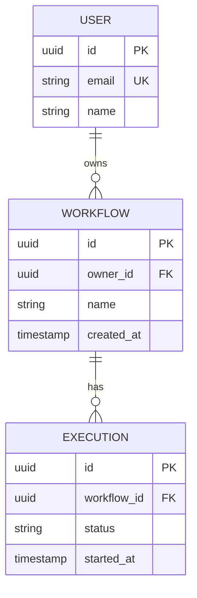
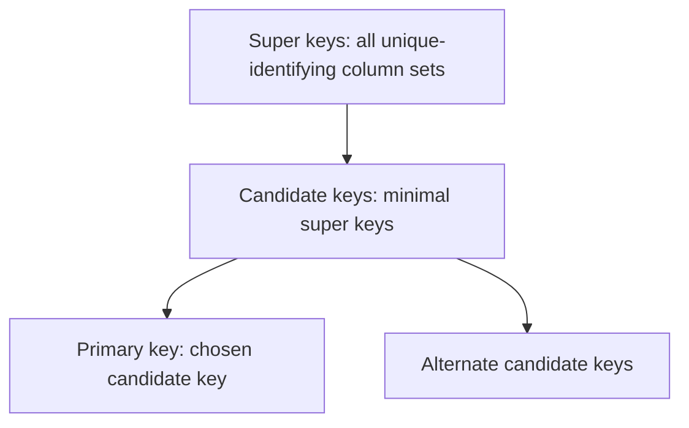
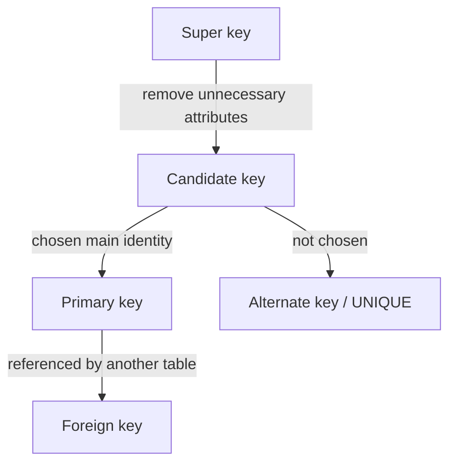

# Caelius Interview Preparation

## DBMS Basics (Q251-Q265)

For DBMS concept questions, speak in this order:

```text
Define -> Simple example -> Why it matters -> Real project connection
```

Shared example schema:



This resembles Nodeflowz, where PostgreSQL stores users, workflows, graph data, credentials, and execution records through Prisma.

---

# Q251. What Is a DBMS? Why Is It Used?

## Define

> A Database Management System, or DBMS, is software that lets applications define, store, query, update, secure, and recover structured data.

Examples include PostgreSQL, MySQL, Oracle Database, MongoDB, and SQLite.

## Why It Is Used

A DBMS provides:

- Persistent data storage.
- Efficient querying and indexing.
- Concurrent access by multiple users.
- Integrity constraints.
- Authentication and authorization.
- Transactions and recovery.
- Backup and restore capabilities.

## Simple Example

Instead of storing workflow records in unrelated files, an application can query:

```sql
SELECT id, name
FROM workflow
WHERE owner_id = 'user-123';
```

The DBMS finds matching records, enforces permissions through the application/database setup, and keeps the data persistent.

## Real Project Connection

> In Nodeflowz, PostgreSQL acts as the persistent source of truth for workflows and execution records. The DBMS is valuable because workflow saves involve related graph data that should remain consistent, and execution history must survive application restarts.

## Interview Point

A database is the organized data; the DBMS is the software that manages access to that data.

---

# Q252. Difference Between DBMS and RDBMS

## Define

> DBMS is the broad category of database-management software. An RDBMS is a DBMS based on the relational model, organizing data into relations, commonly represented as tables, and enforcing relationships through keys and constraints.

## Comparison

| DBMS | RDBMS |
|---|---|
| Broad category | Relational subtype of DBMS |
| May use documents, graphs, key-values, or tables | Uses relations/tables |
| Relationships may be application-managed | Relationships can be enforced with foreign keys |
| Query model varies | Commonly uses SQL |
| Constraint support varies | Strong relational integrity support |

## Example

- PostgreSQL and MySQL are RDBMS products.
- MongoDB is a document-oriented DBMS, not an RDBMS.
- Redis is a key-value data store, not an RDBMS.

## Real Project Connection

> Nodeflowz uses PostgreSQL because workflows, users, connections, and executions have structured relationships. CommentPulse also uses Redis for queue-oriented behavior, showing that different DBMS types serve different access patterns.

## Interview Point

Do not say an RDBMS is separate from a DBMS. Every RDBMS is a DBMS, but not every DBMS is relational.

---

# Q253. What Is a Database Schema?

## Define

> A database schema is the logical blueprint describing how database objects are structured and related.

It can define:

- Tables and columns.
- Data types.
- Primary and foreign keys.
- Constraints.
- Indexes.
- Views and relationships.

## Example

```sql
CREATE TABLE workflow (
    id UUID PRIMARY KEY,
    owner_id UUID NOT NULL REFERENCES app_user(id),
    name VARCHAR(200) NOT NULL,
    created_at TIMESTAMP NOT NULL DEFAULT CURRENT_TIMESTAMP
);
```

This schema states what a workflow row contains and that its owner must reference an existing user.

## Schema vs Data

```text
Schema: structure and rules
Data:   current stored values following those rules
```

Changing a workflow name changes data. Adding a `description` column changes the schema.

## Real Project Connection

> In Nodeflowz, Prisma models express the application-level schema and migrations translate schema changes into PostgreSQL changes. That keeps code and database structure synchronized.

---

# Q254. What Is a Table, Row, Column, and Cell?

## Define

| Term | Meaning |
|---|---|
| Table | Named collection of related rows with a defined structure |
| Row | One record or instance |
| Column | Named attribute with a data type |
| Cell | One row-column intersection containing a value |

## Example

`workflow` table:

| id | owner_id | name |
|---|---|---|
| `w-101` | `u-7` | `Daily Report` |
| `w-102` | `u-7` | `Comment Alert` |

- Table: `workflow`
- First row: the `Daily Report` workflow record
- Column: `name`
- Cell: `Comment Alert`

## Relational Terminology

In formal relational language:

- Table approximately corresponds to a relation.
- Row corresponds to a tuple.
- Column corresponds to an attribute.

## Interview Point

Rows have no guaranteed display order unless a query uses `ORDER BY`.

---

# Q255. What Is a Primary Key?

## Define

> A primary key is the selected column or column set that uniquely identifies every row in a table.

## Properties

- Unique for every row.
- Cannot be `NULL`.
- One primary-key constraint per table.
- Should be stable because other tables may reference it.

## Example

```sql
CREATE TABLE app_user (
    id UUID PRIMARY KEY,
    email VARCHAR(320) NOT NULL UNIQUE,
    name VARCHAR(200)
);
```

`id` is the primary key. Even if a user changes email, the stable ID remains the same.

## Natural vs Surrogate Key

| Natural key | Surrogate key |
|---|---|
| Has business meaning, such as email | Artificial identifier, such as UUID |
| May change with business rules | Usually stable |
| Can be wider/composite | Usually compact and simple |

## Real Project Connection

> For a workflow platform, a generated workflow ID is a good primary key because the workflow name is not unique and can change.

---

# Q256. What Is a Foreign Key?

## Define

> A foreign key is a column or column set whose values must reference an existing candidate key, usually a primary key, in another or the same table.

## Example

```sql
CREATE TABLE workflow (
    id UUID PRIMARY KEY,
    owner_id UUID NOT NULL,
    name VARCHAR(200) NOT NULL,
    CONSTRAINT fk_workflow_owner
        FOREIGN KEY (owner_id)
        REFERENCES app_user(id)
);
```

`workflow.owner_id` references `app_user.id`.

## Why It Matters

The constraint prevents an orphan workflow from referring to a user that does not exist.

## Referential Actions

Common actions when a referenced row changes:

```text
RESTRICT / NO ACTION
CASCADE
SET NULL
SET DEFAULT
```

Example:

```sql
FOREIGN KEY (workflow_id)
REFERENCES workflow(id)
ON DELETE CASCADE
```

## Interview Point

A foreign key does not need to be unique. Many workflows can reference the same owner.

---

# Q257. What Is a Unique Key?

## Define

> A unique key, expressed through a `UNIQUE` constraint, ensures that no two rows share the same value or value combination in the constrained columns.

## Example

```sql
CREATE TABLE app_user (
    id UUID PRIMARY KEY,
    email VARCHAR(320) NOT NULL UNIQUE
);
```

Both `id` and `email` uniquely identify a user, but only `id` is chosen as the primary key.

## Composite Unique Constraint

```sql
CREATE TABLE workflow (
    id UUID PRIMARY KEY,
    owner_id UUID NOT NULL,
    name VARCHAR(200) NOT NULL,
    UNIQUE (owner_id, name)
);
```

This allows different users to use the same workflow name but prevents one user from creating duplicate names.

## NULL Behavior

How `UNIQUE` treats multiple `NULL` values can depend on the database and constraint options. State the specific RDBMS behavior rather than assuming it is universal.

## Interview Point

A table may have multiple unique constraints but only one primary-key constraint.

---

# Q258. What Is a Composite Key?

## Define

> A composite key is a key formed from two or more columns whose combined values identify a row uniquely.

## Example

A workflow can contain each node once:

```sql
CREATE TABLE workflow_node (
    workflow_id UUID NOT NULL REFERENCES workflow(id),
    node_id UUID NOT NULL,
    node_type VARCHAR(100) NOT NULL,
    PRIMARY KEY (workflow_id, node_id)
);
```

Neither `workflow_id` nor `node_id` alone is necessarily sufficient under this model, but together they identify a row.

## Advantages

- Represents a natural multi-column identity.
- Can enforce business rules directly.
- Avoids unnecessary surrogate IDs in join tables.

## Tradeoffs

- Wider foreign keys and indexes.
- More columns needed in joins.
- More cumbersome if key components change.

## Interview Point

A composite key may be a primary, candidate, unique, or foreign key depending on how it is used.

---

# Q259. What Is a Candidate Key?

## Define

> A candidate key is a minimal column set that uniquely identifies every row.

`Minimal` means removing any column would make it no longer unique.

## Example

For:

```text
app_user(id, email, government_id, name)
```

If all three identifiers are guaranteed unique:

```text
Candidate keys: {id}, {email}, {government_id}
```

One candidate key is selected as the primary key. The others remain alternate candidate keys and are commonly protected with `UNIQUE`.

## Candidate vs Composite

A candidate key can contain:

- One column.
- Multiple columns, making it a composite candidate key.

## Interview Point

Every primary key is a candidate key, but not every candidate key is chosen as the primary key.

---

# Q260. What Is a Super Key?

## Define

> A super key is any column set that uniquely identifies rows, even if it contains unnecessary extra columns.

## Example

If `id` uniquely identifies a user:

```text
{id}                 -> super key and candidate key
{id, email}          -> super key, not candidate key
{id, email, name}    -> super key, not candidate key
```

The larger sets remain unique because they include `id`, but they are not minimal.

## Relationship



## Interview Point

The key distinction is minimality: candidate keys are minimal super keys.

---

# Q261. Difference Between Primary Key and Unique Key

## Comparison

| Primary key | Unique key |
|---|---|
| Chosen main row identifier | Enforces alternate uniqueness |
| Only one primary-key constraint per table | Multiple unique constraints allowed |
| Cannot contain `NULL` | NULL behavior depends on RDBMS/options |
| Common default target for foreign keys | Can also be referenced if it is a candidate key |
| Commonly used as stable identity | Commonly enforces business rules |

## Example

```sql
CREATE TABLE app_user (
    id UUID PRIMARY KEY,
    email VARCHAR(320) NOT NULL UNIQUE,
    username VARCHAR(100) NOT NULL UNIQUE
);
```

- `id`: primary key.
- `email` and `username`: alternate unique identifiers.

## Interview-Ready Answer

> Both enforce uniqueness. The primary key is the one candidate key selected as the table's main identity and is always non-null. Unique constraints protect other candidate keys or business rules, and a table can have several of them.

---

# Q262. What Is NULL in a Database?

## Define

> `NULL` represents missing, unknown, or not-applicable information. It is not zero, an empty string, or the text `"NULL"`.

## Three-Valued Logic

SQL comparisons involving `NULL` generally produce `UNKNOWN`, not true or false.

Incorrect:

```sql
SELECT *
FROM execution
WHERE finished_at = NULL;
```

Correct:

```sql
SELECT *
FROM execution
WHERE finished_at IS NULL;
```

## Example

An active execution may have:

```text
finished_at = NULL
```

because it has not finished yet.

## Important Behavior

- `COUNT(column)` ignores `NULL`.
- `COUNT(*)` counts rows.
- Arithmetic with `NULL` usually produces `NULL`.
- Use `COALESCE(value, fallback)` when an explicit fallback is needed.

## Interview Point

Use `NULL` deliberately. Excessive nullable columns can make constraints and application logic harder to reason about.

---

# Q263. What Is a Domain in DBMS?

## Define

> A domain is the permitted set of values for an attribute, determined by its data type and applicable constraints.

## Example

For an execution status:

```text
Domain = {"PENDING", "RUNNING", "SUCCEEDED", "FAILED"}
```

It can be enforced with a constraint:

```sql
CREATE TABLE execution (
    id UUID PRIMARY KEY,
    status VARCHAR(20) NOT NULL
        CHECK (status IN ('PENDING', 'RUNNING', 'SUCCEEDED', 'FAILED'))
);
```

## Domain Components

A domain may include:

- Data type.
- Allowed range.
- Format.
- Whether `NULL` is permitted.
- Business-valid values.

## Why It Matters

Domains prevent invalid states close to the data source instead of relying only on application validation.

## Interview Point

A data type is part of a domain, but a domain can be narrower than the type. `INTEGER` is a type; integers from `1` to `5` may be a business domain.

---

# Q264. What Is a Tuple in the Relational Model?

## Define

> A tuple is one record in a relation, represented in SQL systems as a table row.

## Example

For relation:

```text
WORKFLOW(id, owner_id, name)
```

One tuple is:

```text
('w-101', 'u-7', 'Daily Report')
```

It assigns one value from the appropriate domain to each attribute.

## Formal Properties

In the pure relational model:

- A relation is a set of tuples.
- Duplicate tuples do not exist.
- Tuple ordering has no meaning.
- Attribute values belong to declared domains.

SQL tables can behave differently unless constraints such as keys are applied, and query result order is undefined without `ORDER BY`.

## Interview Point

Use "row" for practical SQL discussion and "tuple" when explaining the relational model.

---

# Q265. What Is a Relation in DBMS?

## Define

> In the relational model, a relation is a set of tuples sharing the same attributes and domains. It is commonly represented as a table.

## Components

```text
Relation schema: WORKFLOW(id, owner_id, name)
Relation instance: the current set of workflow tuples
Degree: number of attributes/columns
Cardinality: number of tuples/rows
```

## Example

```text
WORKFLOW
------------------------------------------------
id      owner_id    name
w-101   u-7         Daily Report
w-102   u-7         Comment Alert
```

- Degree: `3`
- Cardinality: `2`

## Relation vs Relationship

- Relation: table-like set of tuples.
- Relationship: association between entities, such as a user owning workflows.

## Interview Point

In the formal relational model, a relation is a set, so tuple ordering and duplicates are not meaningful. SQL is based on the relational model but permits duplicates in many query results unless `DISTINCT` or constraints remove them.

---

# DBMS Key Relationship Guide



## Interview Example

> "For a user table, both generated ID and email may uniquely identify a row, so both are candidate keys. I would choose the stable generated ID as the primary key and enforce email with a unique constraint. A workflow's `owner_id` then becomes a foreign key referencing the user primary key."

# DBMS Basics Testing and Design Checklist

When designing a schema, ask:

```text
What uniquely identifies each row?
Which alternate values must remain unique?
Which relationships require foreign keys?
What should happen on referenced-row deletion?
Which columns can genuinely be NULL?
What domains and checks prevent invalid states?
Are business identifiers stable enough to be keys?
Does a composite key express the real identity?
```

# DBMS Basics Revision Sheet

| Question | Crisp answer |
|---|---|
| DBMS | Software for storing, querying, securing, and recovering data |
| DBMS vs RDBMS | Broad category vs relational DBMS subtype |
| Schema | Database structure and rules |
| Table/row/column/cell | Collection/record/attribute/value |
| Primary key | Chosen non-null unique row identifier |
| Foreign key | Reference enforcing relational integrity |
| Unique key | Constraint preventing duplicate values |
| Composite key | Key containing multiple columns |
| Candidate key | Minimal unique-identifying column set |
| Super key | Any unique-identifying column set |
| Primary vs unique | Main chosen identity vs alternate uniqueness |
| NULL | Missing, unknown, or not-applicable value |
| Domain | Permitted values for an attribute |
| Tuple | One relational record |
| Relation | Set of tuples with common attributes |

## Common Interview Mistakes

- Saying every DBMS is relational.
- Confusing schema with current data.
- Using a mutable business value as a primary key without discussing risk.
- Saying foreign keys must be unique.
- Calling every super key a candidate key.
- Comparing `NULL` with `=`.
- Treating `NULL` as zero or empty text.
- Confusing a relation with a relationship.
- Assuming rows have an inherent order.
