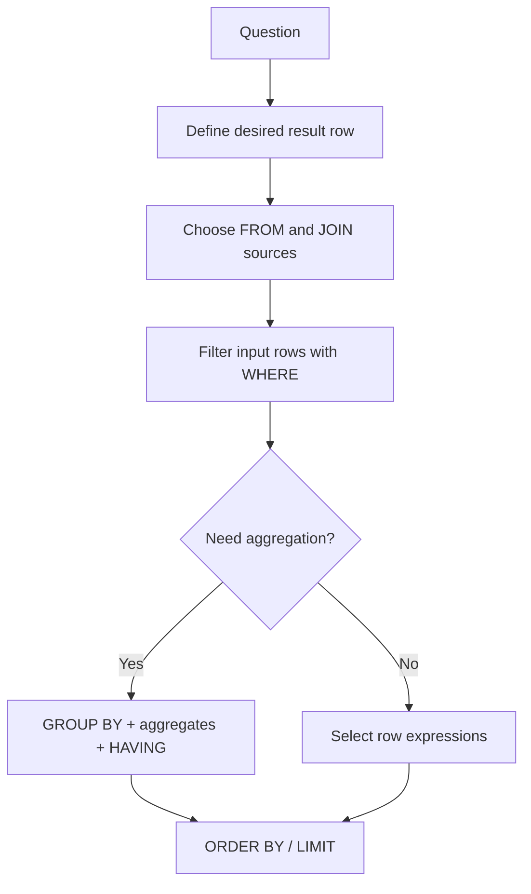

# Caelius Interview Preparation

## SQL Queries (Q266-Q285)

For SQL questions, speak in this order:

```text
Clarify expected rows -> Identify tables/relationships -> Build query -> Explain clauses -> Discuss duplicates/NULLs -> Optimize
```

Example schema used throughout:

```sql
CREATE TABLE department (
    id          BIGINT PRIMARY KEY,
    name        VARCHAR(100) NOT NULL UNIQUE
);

CREATE TABLE employee (
    id            BIGINT PRIMARY KEY,
    name          VARCHAR(150) NOT NULL,
    email         VARCHAR(320) NOT NULL UNIQUE,
    salary        NUMERIC(12, 2) NOT NULL,
    department_id BIGINT REFERENCES department(id),
    manager_id    BIGINT REFERENCES employee(id),
    joined_at     TIMESTAMP NOT NULL
);
```

The queries use PostgreSQL syntax unless stated otherwise.

---

# Q266. Write SELECT, INSERT, UPDATE, and DELETE Syntax

## Define

These are core Data Manipulation Language operations:

- `SELECT` reads rows.
- `INSERT` creates rows.
- `UPDATE` changes existing rows.
- `DELETE` removes rows.

## SELECT

```sql
SELECT id, name, salary
FROM employee
WHERE department_id = 10
ORDER BY salary DESC;
```

## INSERT

```sql
INSERT INTO employee (
    id,
    name,
    email,
    salary,
    department_id,
    manager_id,
    joined_at
)
VALUES (
    101,
    'Deepa Patel',
    'deepa@example.com',
    75000,
    10,
    NULL,
    CURRENT_TIMESTAMP
);
```

## UPDATE

```sql
UPDATE employee
SET salary = salary * 1.10
WHERE department_id = 10;
```

## DELETE

```sql
DELETE FROM employee
WHERE id = 101;
```

## Safety Rule

Before running an `UPDATE` or `DELETE`, test its predicate:

```sql
SELECT *
FROM employee
WHERE department_id = 10;
```

Then run the modification inside a transaction when appropriate.

## Interview Point

An `UPDATE` or `DELETE` without `WHERE` affects every row.

---

# Q267. What Is the WHERE Clause?

## Define

> `WHERE` filters individual rows before they are returned, grouped, updated, or deleted.

## Example

```sql
SELECT id, name, salary
FROM employee
WHERE salary >= 70000
  AND department_id = 10;
```

## Common Predicates

```sql
WHERE salary > 50000
WHERE department_id IN (10, 20)
WHERE manager_id IS NULL
WHERE joined_at >= CURRENT_DATE - INTERVAL '30 days'
```

## Logical Processing Position

Conceptually, SQL processes:

```text
FROM/JOIN -> WHERE -> GROUP BY -> HAVING -> SELECT -> ORDER BY -> LIMIT
```

This explains why `WHERE` cannot normally use aggregate results such as `COUNT(*)`.

## Optimization

Indexes on selective filter columns can reduce scanned rows, but the optimizer decides whether using an index is beneficial.

## Interview Point

`WHERE` filters rows before aggregation.

---

# Q268. Difference Between WHERE and HAVING

## Define

> `WHERE` filters rows before grouping. `HAVING` filters groups after aggregation.

## Example

Find departments where employees earning at least `50000` number more than five:

```sql
SELECT department_id, COUNT(*) AS employee_count
FROM employee
WHERE salary >= 50000
GROUP BY department_id
HAVING COUNT(*) > 5;
```

- `WHERE salary >= 50000` removes individual employees first.
- `HAVING COUNT(*) > 5` removes groups after counting.

## Comparison

| WHERE | HAVING |
|---|---|
| Filters rows | Filters grouped results |
| Runs before grouping | Runs after grouping |
| Usually cannot contain aggregate predicates | Commonly uses aggregates |
| Reduces input to aggregation | Reduces output groups |

## Interview Point

Use `WHERE` whenever a non-aggregate filter can be applied early; it is clearer and can reduce work before grouping.

---

# Q269. What Is GROUP BY? Give an Example

## Define

> `GROUP BY` combines rows sharing the same grouping values so aggregate functions can calculate one result per group.

## Example

```sql
SELECT
    department_id,
    COUNT(*) AS employee_count,
    AVG(salary) AS average_salary
FROM employee
GROUP BY department_id;
```

## Rule

In a grouped query, each selected expression must generally be:

- Included in `GROUP BY`, or
- Computed through an aggregate function.

Invalid:

```sql
SELECT department_id, name, COUNT(*)
FROM employee
GROUP BY department_id;
```

`name` is not a single well-defined value for each department group.

## Multiple Grouping Columns

```sql
SELECT department_id, manager_id, COUNT(*)
FROM employee
GROUP BY department_id, manager_id;
```

## Interview Point

Grouping changes row-level data into one result row per distinct grouping combination.

---

# Q270. What Is ORDER BY? ASC vs DESC

## Define

> `ORDER BY` sorts the final query result by one or more expressions.

- `ASC`: ascending order; usually the default.
- `DESC`: descending order.

## Example

```sql
SELECT id, name, salary
FROM employee
ORDER BY salary DESC, name ASC;
```

Employees are sorted by highest salary first. Equal salaries are sorted alphabetically.

## NULL Ordering

NULL ordering varies by database and direction. PostgreSQL allows explicit control:

```sql
ORDER BY manager_id ASC NULLS LAST;
```

## Important Rule

Without `ORDER BY`, row order is not guaranteed, even if results often appear consistent during testing.

## Pagination Stability

Use a deterministic tie-breaker:

```sql
ORDER BY joined_at DESC, id DESC;
```

## Interview Point

`ORDER BY` is the only standard way to request a defined result order.

---

# Q271. What Is the DISTINCT Keyword?

## Define

> `DISTINCT` removes duplicate rows from the selected result expressions.

## Example

```sql
SELECT DISTINCT department_id
FROM employee;
```

This returns each represented department ID once.

## Multiple Columns

```sql
SELECT DISTINCT department_id, manager_id
FROM employee;
```

Uniqueness applies to the complete selected pair, not each column independently.

## DISTINCT vs GROUP BY

For simple deduplication, these may produce equivalent results:

```sql
SELECT DISTINCT department_id
FROM employee;
```

```sql
SELECT department_id
FROM employee
GROUP BY department_id;
```

Use `GROUP BY` when calculating aggregates; use `DISTINCT` when expressing result deduplication.

## Performance

Removing duplicates may require sorting or hashing. Do not use `DISTINCT` merely to hide an incorrect join that creates unwanted duplicates.

---

# Q272. What Are Aggregate Functions?

## Define

> Aggregate functions calculate one value from multiple input rows.

Common functions:

| Function | Purpose |
|---|---|
| `SUM` | Total numeric values |
| `AVG` | Average numeric value |
| `COUNT` | Count rows or non-null values |
| `MAX` | Greatest value |
| `MIN` | Smallest value |

## Example

```sql
SELECT
    COUNT(*) AS total_employees,
    COUNT(manager_id) AS employees_with_manager,
    SUM(salary) AS salary_total,
    AVG(salary) AS average_salary,
    MAX(salary) AS highest_salary,
    MIN(salary) AS lowest_salary
FROM employee;
```

## NULL Behavior

- Most aggregates ignore `NULL` inputs.
- `COUNT(*)` counts rows.
- `COUNT(column)` counts non-null column values.

## Conditional Aggregation

```sql
SELECT
    department_id,
    COUNT(*) AS total,
    COUNT(*) FILTER (WHERE salary >= 100000) AS high_earners
FROM employee
GROUP BY department_id;
```

## Interview Point

Aggregates without `GROUP BY` produce one result group for the entire filtered input.

---

# Q273. What Are LIMIT and OFFSET?

## Define

> `LIMIT` restricts the number of returned rows. `OFFSET` skips a number of rows before returning results.

## Example

```sql
SELECT id, name, joined_at
FROM employee
ORDER BY joined_at DESC, id DESC
LIMIT 20
OFFSET 40;
```

This returns the third page when page size is `20`.

## Important Requirements

- Use `ORDER BY` for deterministic pagination.
- Large offsets can be slow because the database may still scan and discard preceding rows.

## Keyset Pagination

For large datasets, continue after the previous page's final key:

```sql
SELECT id, name, joined_at
FROM employee
WHERE (joined_at, id) < (:last_joined_at, :last_id)
ORDER BY joined_at DESC, id DESC
LIMIT 20;
```

## Dialect Note

Syntax varies: SQL Server commonly uses `OFFSET ... FETCH`, while MySQL and PostgreSQL support `LIMIT`.

## Interview Point

Offset pagination is simple; keyset pagination is usually more stable and scalable for deep pages.

---

# Q274. What Is the LIKE Operator? What Are Its Wildcards?

## Define

> `LIKE` performs pattern matching on text.

Wildcards:

- `%`: zero or more characters.
- `_`: exactly one character.

## Examples

```sql
-- Names beginning with "De"
SELECT *
FROM employee
WHERE name LIKE 'De%';

-- Exactly four-character names beginning with "A"
SELECT *
FROM employee
WHERE name LIKE 'A___';
```

## Case Sensitivity

Behavior depends on database and collation. PostgreSQL provides `ILIKE` for case-insensitive matching:

```sql
WHERE name ILIKE 'deepa%';
```

## Escaping Wildcards

If `%` or `_` should be literal, use an escape character:

```sql
WHERE name LIKE '100\%' ESCAPE '\';
```

## Performance

A pattern beginning with `%`, such as `'%patel'`, often cannot use a normal B-tree index efficiently.

## Interview Point

Clarify case sensitivity and whether the search pattern can begin with a wildcard.

---

# Q275. What Are IN, NOT IN, BETWEEN, and IS NULL?

## IN

Matches any value in a list or subquery:

```sql
SELECT *
FROM employee
WHERE department_id IN (10, 20, 30);
```

## NOT IN

Excludes listed values:

```sql
SELECT *
FROM employee
WHERE department_id NOT IN (10, 20);
```

Be careful: if a `NOT IN` subquery returns `NULL`, SQL's unknown logic can cause no rows to match. `NOT EXISTS` is often safer.

## BETWEEN

`BETWEEN` is inclusive at both ends:

```sql
SELECT *
FROM employee
WHERE salary BETWEEN 50000 AND 80000;
```

For timestamp ranges, a half-open interval is often safer:

```sql
WHERE joined_at >= TIMESTAMP '2026-01-01'
  AND joined_at <  TIMESTAMP '2027-01-01';
```

## IS NULL

```sql
SELECT *
FROM employee
WHERE manager_id IS NULL;
```

Use `IS NULL`, not `= NULL`.

---

# Q276. Find the Second Highest Salary

## Clarify

Ask whether "second highest" means:

- Second distinct salary.
- Employee in the second sorted row, even if salaries tie.

Usually the interviewer means the second distinct salary.

## Window-Function Solution

```sql
WITH ranked_salaries AS (
    SELECT
        salary,
        DENSE_RANK() OVER (ORDER BY salary DESC) AS salary_rank
    FROM employee
)
SELECT MAX(salary) AS second_highest_salary
FROM ranked_salaries
WHERE salary_rank = 2;
```

`DENSE_RANK` gives equal salaries the same rank without gaps.

## Simpler Aggregate Solution

```sql
SELECT MAX(salary) AS second_highest_salary
FROM employee
WHERE salary < (
    SELECT MAX(salary)
    FROM employee
);
```

## Interview Point

The aggregate version is concise for exactly second highest; the window-function pattern generalizes better.

---

# Q277. Find the Nth Highest Salary

## Window-Function Solution

```sql
WITH ranked_salaries AS (
    SELECT
        salary,
        DENSE_RANK() OVER (ORDER BY salary DESC) AS salary_rank
    FROM employee
)
SELECT DISTINCT salary
FROM ranked_salaries
WHERE salary_rank = :n;
```

## Return Employees at the Nth Salary

```sql
WITH ranked_employees AS (
    SELECT
        e.*,
        DENSE_RANK() OVER (ORDER BY salary DESC) AS salary_rank
    FROM employee e
)
SELECT *
FROM ranked_employees
WHERE salary_rank = :n;
```

## Ranking Choice

| Function | Tie behavior |
|---|---|
| `ROW_NUMBER` | Every row receives a different number |
| `RANK` | Ties share rank, leaving gaps |
| `DENSE_RANK` | Ties share rank, no gaps |

## Interview Point

Clarify tie semantics before selecting a ranking function.

---

# Q278. Delete Duplicate Rows While Keeping One

## Clarify

Define which columns determine duplicates and which row should be kept. This example treats equal emails as duplicates and keeps the smallest `id`.

## Window-Function Solution

Preview duplicates first:

```sql
WITH marked AS (
    SELECT
        id,
        email,
        ROW_NUMBER() OVER (
            PARTITION BY email
            ORDER BY id
        ) AS duplicate_number
    FROM employee
)
SELECT *
FROM marked
WHERE duplicate_number > 1;
```

Then delete:

```sql
WITH marked AS (
    SELECT
        id,
        ROW_NUMBER() OVER (
            PARTITION BY email
            ORDER BY id
        ) AS duplicate_number
    FROM employee
)
DELETE FROM employee
WHERE id IN (
    SELECT id
    FROM marked
    WHERE duplicate_number > 1
);
```

## Production Safety

1. Back up or run inside a transaction.
2. Preview rows.
3. Delete duplicates.
4. Add a `UNIQUE` constraint to prevent recurrence.

```sql
ALTER TABLE employee
ADD CONSTRAINT uk_employee_email UNIQUE (email);
```

## Interview Point

Deleting duplicates repairs existing data; a unique constraint prevents the issue from returning.

---

# Q279. Find Employees Earning More Than Average Salary

## Company-Wide Average

```sql
SELECT id, name, salary
FROM employee
WHERE salary > (
    SELECT AVG(salary)
    FROM employee
);
```

The scalar subquery calculates one company-wide average.

## Department Average Follow-Up

```sql
SELECT id, name, department_id, salary
FROM (
    SELECT
        e.*,
        AVG(salary) OVER (
            PARTITION BY department_id
        ) AS department_average
    FROM employee e
) ranked
WHERE salary > department_average;
```

## Interview Point

Clarify whether the comparison is against the whole company or each employee's department average.

---

# Q280. Find Departments With More Than Five Employees

## Query

```sql
SELECT
    d.id,
    d.name,
    COUNT(e.id) AS employee_count
FROM department d
JOIN employee e
    ON e.department_id = d.id
GROUP BY d.id, d.name
HAVING COUNT(e.id) > 5;
```

## Explanation

- Join departments to employees.
- Group rows per department.
- Count employee IDs.
- Filter groups using `HAVING`.

## Without Department Details

```sql
SELECT department_id, COUNT(*) AS employee_count
FROM employee
GROUP BY department_id
HAVING COUNT(*) > 5;
```

## Interview Point

Use `HAVING`, not `WHERE`, for the aggregate count predicate.

---

# Q281. Find Employees Who Joined in the Last 30 Days

## PostgreSQL Query

```sql
SELECT id, name, joined_at
FROM employee
WHERE joined_at >= CURRENT_TIMESTAMP - INTERVAL '30 days'
ORDER BY joined_at DESC;
```

## Date vs Timestamp Semantics

- `CURRENT_DATE` starts at today's midnight.
- `CURRENT_TIMESTAMP` includes the current time.

Choose based on whether "last 30 days" means a rolling 30-day period or calendar dates.

## Indexing

An index can help:

```sql
CREATE INDEX idx_employee_joined_at
ON employee(joined_at);
```

## Interview Point

Avoid applying a function to the indexed column when a direct range predicate can express the same requirement.

---

# Q282. Count Employees per Department

## Include Departments With Zero Employees

```sql
SELECT
    d.id,
    d.name,
    COUNT(e.id) AS employee_count
FROM department d
LEFT JOIN employee e
    ON e.department_id = d.id
GROUP BY d.id, d.name
ORDER BY d.name;
```

## Why COUNT(e.id)?

For a department without employees, the `LEFT JOIN` still produces one department row with null employee columns:

- `COUNT(*)` would count that joined row as `1`.
- `COUNT(e.id)` ignores the null employee ID and returns `0`.

## Only Departments That Have Employees

```sql
SELECT department_id, COUNT(*) AS employee_count
FROM employee
GROUP BY department_id;
```

## Interview Point

Clarify whether empty departments must appear.

---

# Q283. Find Departments With No Employees

## NOT EXISTS Solution

```sql
SELECT d.id, d.name
FROM department d
WHERE NOT EXISTS (
    SELECT 1
    FROM employee e
    WHERE e.department_id = d.id
);
```

## LEFT JOIN Solution

```sql
SELECT d.id, d.name
FROM department d
LEFT JOIN employee e
    ON e.department_id = d.id
WHERE e.id IS NULL;
```

## Why Prefer NOT EXISTS?

`NOT EXISTS` directly expresses an anti-join: return departments for which no matching employee exists. It also avoids `NOT IN` surprises involving `NULL`.

## Interview Point

`SELECT 1` inside `EXISTS` is conventional because only existence matters, not selected values.

---

# Q284. Get Top Three Salaries From Each Department

## Clarify Ties

This query returns every employee whose distinct salary is among the top three in their department. Ties may produce more than three employees.

## Query

```sql
WITH ranked AS (
    SELECT
        e.*,
        DENSE_RANK() OVER (
            PARTITION BY department_id
            ORDER BY salary DESC
        ) AS salary_rank
    FROM employee e
)
SELECT
    id,
    name,
    department_id,
    salary
FROM ranked
WHERE salary_rank <= 3
ORDER BY department_id, salary DESC, id;
```

## Exactly Three Rows per Department

Use `ROW_NUMBER()` with a deterministic tie-breaker:

```sql
ROW_NUMBER() OVER (
    PARTITION BY department_id
    ORDER BY salary DESC, id
)
```

## Interview Point

Window functions rank rows within each department without collapsing them like `GROUP BY`.

---

# Q285. Find All Employees Who Are Also Managers

## EXISTS Solution

```sql
SELECT e.id, e.name
FROM employee e
WHERE EXISTS (
    SELECT 1
    FROM employee report
    WHERE report.manager_id = e.id
);
```

## Self-Join Solution

```sql
SELECT DISTINCT manager.id, manager.name
FROM employee manager
JOIN employee report
    ON report.manager_id = manager.id;
```

## Why DISTINCT in the Self-Join?

A manager with several direct reports appears once per matching report unless duplicates are removed.

## Indexing

```sql
CREATE INDEX idx_employee_manager_id
ON employee(manager_id);
```

This supports finding reports for a manager efficiently.

## Interview Point

This is a self-referencing relationship: `employee.manager_id` points to another row in `employee`.

---

# SQL Query Construction Guide



## Logical Query Processing Order

```text
FROM / JOIN
WHERE
GROUP BY
HAVING
SELECT
DISTINCT
ORDER BY
LIMIT / OFFSET
```

# SQL Query Interview Checklist

Before finalizing a query, ask:

```text
What should one result row represent?
Can joins create duplicates?
How should NULL values behave?
Should empty parent groups appear?
How should ties be ranked?
Is ordering deterministic?
Is the date boundary inclusive or exclusive?
Can a filter use an index?
Is the modification safe to run?
Does SQL dialect affect syntax?
```

# SQL Queries Revision Sheet

| Question | Core pattern |
|---|---|
| CRUD syntax | `SELECT`, `INSERT`, `UPDATE`, `DELETE` |
| WHERE | Filter rows before grouping |
| WHERE vs HAVING | Row filter vs group filter |
| GROUP BY | Aggregate per distinct group |
| ORDER BY | Define result ordering |
| DISTINCT | Remove duplicate selected rows |
| Aggregates | Calculate values across rows |
| LIMIT/OFFSET | Restrict/skip ordered results |
| LIKE | Text pattern matching |
| IN/BETWEEN/IS NULL | Membership, inclusive range, null test |
| Second/Nth salary | `DENSE_RANK` |
| Delete duplicates | `ROW_NUMBER` then delete |
| Above average | Scalar subquery or window average |
| Groups over threshold | `GROUP BY` + `HAVING` |
| Recent rows | Sargable timestamp range |
| Count per parent | `LEFT JOIN` + `COUNT(child.id)` |
| Parents without children | `NOT EXISTS` |
| Top N per group | Partitioned ranking window |
| Employees also managers | Self-reference + `EXISTS` |

## Common Interview Mistakes

- Running `UPDATE` or `DELETE` without validating the predicate.
- Using `HAVING` for filters that belong in `WHERE`.
- Selecting non-grouped, non-aggregated columns.
- Assuming results are ordered without `ORDER BY`.
- Using `DISTINCT` to hide an incorrect join.
- Forgetting `COUNT(column)` ignores `NULL`.
- Using `NOT IN` with a nullable subquery.
- Ignoring tie semantics for Nth-highest queries.
- Deleting duplicates without defining which row to keep.
- Using `COUNT(*)` after a `LEFT JOIN` when zero-child groups are needed.
