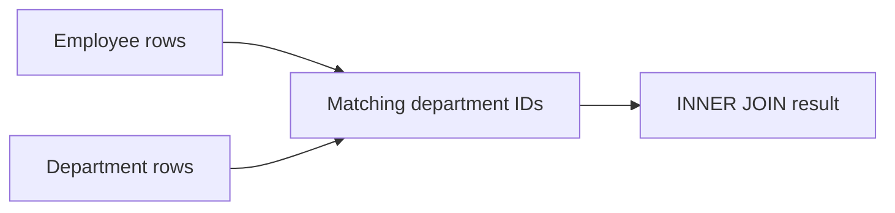
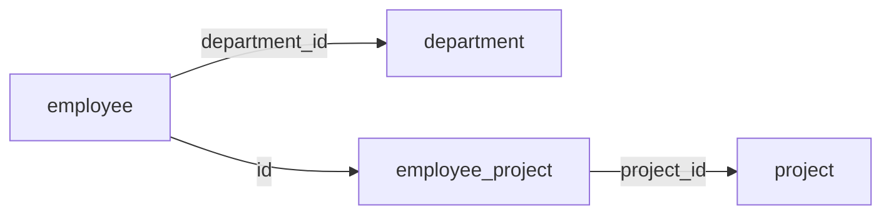
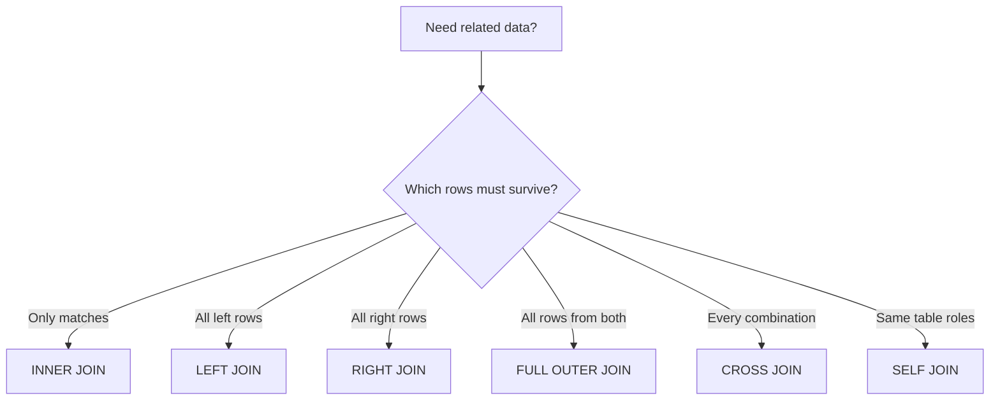

# Caelius Interview Preparation

## SQL Joins and Subqueries (Q286-Q300)

For joins and subqueries, first define what one output row should represent.

```text
Clarify result grain -> Identify relationships -> Choose join/subquery -> Handle missing matches -> Check duplicates -> Optimize
```

Example schema:

```sql
CREATE TABLE department (
    id   BIGINT PRIMARY KEY,
    name VARCHAR(100) NOT NULL UNIQUE
);

CREATE TABLE employee (
    id            BIGINT PRIMARY KEY,
    name          VARCHAR(150) NOT NULL,
    salary        NUMERIC(12, 2) NOT NULL,
    department_id BIGINT REFERENCES department(id),
    manager_id    BIGINT REFERENCES employee(id)
);

CREATE TABLE project (
    id   BIGINT PRIMARY KEY,
    name VARCHAR(150) NOT NULL
);

CREATE TABLE employee_project (
    employee_id BIGINT REFERENCES employee(id),
    project_id  BIGINT REFERENCES project(id),
    role        VARCHAR(100) NOT NULL,
    PRIMARY KEY (employee_id, project_id)
);
```

---

# Q286. What Is JOIN? Why Is It Used?

## Define

> A `JOIN` combines rows from two or more data sources according to a relationship condition.

Relational schemas split entities into separate tables to reduce redundancy and preserve integrity. Joins reconstruct the related view needed by a query.

## Example

```sql
SELECT
    e.name AS employee_name,
    d.name AS department_name
FROM employee e
JOIN department d
    ON d.id = e.department_id;
```

## Join Condition

The `ON` clause describes how rows correspond:

```text
department.id = employee.department_id
```

## Why Joins Matter

- Retrieve related normalized data.
- Compare rows within or across tables.
- Find matches and missing relationships.
- Aggregate across entities.

## Result-Grain Warning

If one department has ten employees, joining department to employee produces ten result rows for that department. Joins can multiply rows according to relationship cardinality.

## Interview Point

Always explain the relationship and expected output grain before writing the join.

---

# Q287. Explain INNER JOIN With Example

## Define

> `INNER JOIN` returns only row combinations that satisfy the join condition on both sides.

## Query

```sql
SELECT
    e.id,
    e.name,
    d.name AS department_name
FROM employee e
INNER JOIN department d
    ON d.id = e.department_id;
```

Employees with `NULL` department IDs or invalid/unmatched department IDs do not appear.

## Diagram



## Equivalent Keyword

In SQL, plain `JOIN` normally means `INNER JOIN`:

```sql
FROM employee e
JOIN department d ON d.id = e.department_id
```

## Interview Point

An inner join keeps matches, not all rows from either input.

---

# Q288. Explain LEFT JOIN With Example

## Define

> `LEFT JOIN` returns every row from the left table and matching rows from the right table. When no right-side match exists, right-side columns are `NULL`.

## Query

```sql
SELECT
    d.id,
    d.name,
    COUNT(e.id) AS employee_count
FROM department d
LEFT JOIN employee e
    ON e.department_id = d.id
GROUP BY d.id, d.name;
```

This includes departments with zero employees.

## Predicate Placement Trap

This preserves departments without highly paid employees:

```sql
SELECT d.name, e.name
FROM department d
LEFT JOIN employee e
    ON e.department_id = d.id
   AND e.salary >= 100000;
```

Moving `e.salary >= 100000` to `WHERE` removes null-extended rows and effectively changes the result toward an inner join:

```sql
WHERE e.salary >= 100000
```

## Interview Point

Filters on the optional right side often belong in `ON` when unmatched left rows must remain.

---

# Q289. Explain RIGHT JOIN With Example

## Define

> `RIGHT JOIN` returns every row from the right table and matching rows from the left table, using `NULL` for missing left-side values.

## Query

```sql
SELECT
    e.name AS employee_name,
    d.name AS department_name
FROM employee e
RIGHT JOIN department d
    ON d.id = e.department_id;
```

This includes every department, even those without employees.

## Equivalent LEFT JOIN

The same result can usually be written more naturally by swapping table order:

```sql
SELECT
    e.name AS employee_name,
    d.name AS department_name
FROM department d
LEFT JOIN employee e
    ON e.department_id = d.id;
```

## Practical Guidance

Many teams prefer `LEFT JOIN` because reading from the preserved table first is easier to follow. Some database products also have limited support for right joins.

## Interview Point

`LEFT` and `RIGHT` describe which input is preserved, not the visual location of columns in the result.

---

# Q290. Explain FULL OUTER JOIN With Example

## Define

> `FULL OUTER JOIN` returns matched row combinations plus unmatched rows from both sides.

## Example

Suppose imported employee records and directory accounts must be reconciled:

```sql
SELECT
    e.email AS employee_email,
    a.email AS account_email
FROM imported_employee e
FULL OUTER JOIN directory_account a
    ON a.email = e.email;
```

Interpretation:

- Both values present: matched record.
- Only employee value present: missing directory account.
- Only account value present: account without imported employee.

## Find Only Mismatches

```sql
SELECT
    e.email AS employee_email,
    a.email AS account_email
FROM imported_employee e
FULL OUTER JOIN directory_account a
    ON a.email = e.email
WHERE e.email IS NULL
   OR a.email IS NULL;
```

## Dialect Note

PostgreSQL supports `FULL OUTER JOIN`; MySQL does not support it directly and commonly emulates it with unions.

## Interview Point

Full outer joins are useful for reconciliation and difference reporting.

---

# Q291. What Is SELF JOIN? Give an Example

## Define

> A self join joins a table to another logical instance of itself using aliases.

## Employee-Manager Example

```sql
SELECT
    employee.name AS employee_name,
    manager.name AS manager_name
FROM employee employee
LEFT JOIN employee manager
    ON manager.id = employee.manager_id;
```

The same `employee` table plays two roles:

- `employee`: the report.
- `manager`: the referenced manager.

## Find Employees Sharing a Department

```sql
SELECT
    first_employee.name,
    second_employee.name
FROM employee first_employee
JOIN employee second_employee
    ON second_employee.department_id = first_employee.department_id
   AND second_employee.id > first_employee.id;
```

The ID inequality prevents self-pairs and mirrored duplicates.

## Interview Point

Aliases are essential in a self join because each table instance represents a different role.

---

# Q292. What Is CROSS JOIN?

## Define

> `CROSS JOIN` returns the Cartesian product: every row from the first input paired with every row from the second input.

If input sizes are `m` and `n`, the result contains `m * n` rows.

## Example

Generate all size-color combinations:

```sql
SELECT
    s.size_name,
    c.color_name
FROM product_size s
CROSS JOIN product_color c;
```

## Useful Cases

- Generate every combination of independent dimensions.
- Build calendars or test datasets.
- Pair every entity with every configuration.

## Accidental Cross Join

Missing a join condition can create an enormous unintended Cartesian product:

```sql
SELECT *
FROM employee e, department d;
```

## Interview Point

State the expected row count before using a cross join.

---

# Q293. Difference Between JOIN and Subquery - When to Use Which?

## Define

- A join combines related rows into one result.
- A subquery supplies a value set, scalar value, existence test, or derived table to another query.

## Prefer a JOIN When

- Returning columns from multiple related tables.
- Combining one-to-one or one-to-many data.
- The relationship is central to the result.

```sql
SELECT e.name, d.name
FROM employee e
JOIN department d
    ON d.id = e.department_id;
```

## Prefer a Subquery When

- Testing existence without returning child columns.
- Comparing with an aggregate.
- Expressing a logically isolated intermediate result.

```sql
SELECT e.*
FROM employee e
WHERE e.salary > (
    SELECT AVG(salary)
    FROM employee
);
```

## Existence Example

```sql
SELECT d.*
FROM department d
WHERE EXISTS (
    SELECT 1
    FROM employee e
    WHERE e.department_id = d.id
);
```

This avoids multiplying department rows by employee matches.

## Performance Guidance

Modern optimizers can transform equivalent joins and subqueries. Choose the clearest correct expression, then inspect the execution plan for performance-critical queries.

## Interview Point

Do not claim joins are always faster than subqueries. Semantics and optimizer behavior matter.

---

# Q294. Write a Query Using Multiple Joins

## Requirement

Return each employee's department, assigned project, and project role.

## Query

```sql
SELECT
    e.id AS employee_id,
    e.name AS employee_name,
    d.name AS department_name,
    p.name AS project_name,
    ep.role AS project_role
FROM employee e
JOIN department d
    ON d.id = e.department_id
JOIN employee_project ep
    ON ep.employee_id = e.id
JOIN project p
    ON p.id = ep.project_id
ORDER BY e.name, p.name;
```

## Relationship Flow



## Result Grain

One result row represents one employee-project assignment. An employee assigned to three projects appears three times.

## Include Employees Without Projects

Use left joins for optional assignments:

```sql
FROM employee e
JOIN department d ON d.id = e.department_id
LEFT JOIN employee_project ep ON ep.employee_id = e.id
LEFT JOIN project p ON p.id = ep.project_id
```

## Interview Point

Explain the join path and output grain; multiple joins are easier to verify one relationship at a time.

---

# Q295. What Is a NATURAL JOIN?

## Define

> `NATURAL JOIN` automatically joins tables using every same-named column in both inputs.

## Example

If both tables contain `department_id`:

```sql
SELECT *
FROM employee
NATURAL JOIN department_assignment;
```

## Why It Is Risky

The join condition changes implicitly when schema columns are added or renamed. An unrelated same-named column can silently alter results.

Prefer explicit joins:

```sql
SELECT *
FROM employee e
JOIN department_assignment da
    ON da.department_id = e.department_id;
```

## NATURAL JOIN vs USING

`USING` explicitly names shared join columns:

```sql
SELECT *
FROM employee
JOIN department_assignment USING (department_id);
```

It is clearer than `NATURAL JOIN`, though many teams still prefer explicit `ON`.

## Interview Point

Natural joins are concise but fragile because the schema, rather than the query, implicitly defines the condition.

---

# Q296. What Is a Subquery?

## Define

> A subquery is a query nested inside another SQL statement whose result is consumed by the outer statement.

## Common Forms

### Scalar Subquery

Returns one value:

```sql
SELECT *
FROM employee
WHERE salary > (
    SELECT AVG(salary)
    FROM employee
);
```

### Set Subquery

Returns a value set:

```sql
SELECT *
FROM employee
WHERE department_id IN (
    SELECT id
    FROM department
    WHERE name LIKE 'Engineering%'
);
```

### Derived Table

Appears in `FROM`:

```sql
SELECT department_id, average_salary
FROM (
    SELECT department_id, AVG(salary) AS average_salary
    FROM employee
    GROUP BY department_id
) department_stats;
```

## Interview Point

Know the expected cardinality. A scalar subquery that returns multiple rows causes an error.

---

# Q297. Correlated vs Non-Correlated Subquery

## Non-Correlated Subquery

> A non-correlated subquery does not reference the outer query and can be evaluated independently.

```sql
SELECT *
FROM employee
WHERE salary > (
    SELECT AVG(salary)
    FROM employee
);
```

## Correlated Subquery

> A correlated subquery references columns from the current outer row.

Find employees earning above their department average:

```sql
SELECT e.*
FROM employee e
WHERE e.salary > (
    SELECT AVG(peer.salary)
    FROM employee peer
    WHERE peer.department_id = e.department_id
);
```

## Comparison

| Non-correlated | Correlated |
|---|---|
| Independent of outer row | Depends on outer row |
| Logically evaluated once | Logically evaluated per outer row |
| Often simpler to optimize | May be more expensive |

## Alternative Window Function

```sql
SELECT *
FROM (
    SELECT
        e.*,
        AVG(salary) OVER (PARTITION BY department_id) AS department_average
    FROM employee e
) compared
WHERE salary > department_average;
```

## Interview Point

The optimizer may decorrelate a correlated subquery, but its logical dependency remains important.

---

# Q298. What Is EXISTS vs IN?

## EXISTS

> `EXISTS` returns true when its subquery produces at least one row.

```sql
SELECT d.*
FROM department d
WHERE EXISTS (
    SELECT 1
    FROM employee e
    WHERE e.department_id = d.id
);
```

## IN

> `IN` checks whether a value equals any value in a list or single-column subquery.

```sql
SELECT *
FROM employee
WHERE department_id IN (
    SELECT id
    FROM department
    WHERE name LIKE 'Engineering%'
);
```

## Comparison

| EXISTS | IN |
|---|---|
| Naturally expresses existence | Naturally expresses membership |
| Commonly correlated | Commonly non-correlated |
| Stops logically after a match | Compares with returned value set |
| Safe anti-form: `NOT EXISTS` | `NOT IN` has NULL pitfalls |

## NULL Trap

If a `NOT IN` subquery returns `NULL`, comparisons may become unknown:

```sql
WHERE id NOT IN (1, 2, NULL)
```

Use `NOT EXISTS` for nullable anti-joins.

## Interview Point

Choose based on semantics; modern optimizers often produce similar plans for equivalent cases.

---

# Q299. What Is a CTE (Common Table Expression)?

## Define

> A CTE is a named temporary result set defined with `WITH` and used by the statement that immediately follows it.

## Example

```sql
WITH department_stats AS (
    SELECT
        department_id,
        COUNT(*) AS employee_count,
        AVG(salary) AS average_salary
    FROM employee
    GROUP BY department_id
)
SELECT
    d.name,
    s.employee_count,
    s.average_salary
FROM department_stats s
JOIN department d
    ON d.id = s.department_id;
```

## Benefits

- Breaks complex logic into named steps.
- Improves readability.
- Can be referenced multiple times in the statement.
- Supports recursive queries.
- Can help structure updates and deletes.

## Scope

A CTE exists only for the single statement following its `WITH` clause. It is not a persistent table or view.

## Performance Note

Materialization and optimization behavior depends on the database and version. A CTE is primarily a query-structuring tool, not automatically a performance optimization.

---

# Q300. Write a Query Using a CTE

## Requirement

Find departments whose average salary is above the company-wide average, including employee counts.

## Query

```sql
WITH department_stats AS (
    SELECT
        department_id,
        COUNT(*) AS employee_count,
        AVG(salary) AS average_salary
    FROM employee
    GROUP BY department_id
),
company_stats AS (
    SELECT AVG(salary) AS average_salary
    FROM employee
)
SELECT
    d.id,
    d.name,
    ds.employee_count,
    ds.average_salary
FROM department_stats ds
CROSS JOIN company_stats cs
JOIN department d
    ON d.id = ds.department_id
WHERE ds.average_salary > cs.average_salary
ORDER BY ds.average_salary DESC;
```

## Explanation

- `department_stats` produces one row per department.
- `company_stats` produces one scalar row.
- `CROSS JOIN` makes the company average available to each department row.
- The final query adds department names and filters above-average departments.

## Interview Point

Each CTE should have a clear result grain and descriptive name. This makes multi-step SQL easier to verify and discuss.

---

# Join Selection Guide



# SQL Joins and Subqueries Checklist

Before finalizing, ask:

```text
What does one output row represent?
Can this relationship multiply rows?
Which table's unmatched rows must remain?
Should an optional-side filter be in ON or WHERE?
Could NULL affect IN or NOT IN?
Does a scalar subquery return exactly one row?
Would EXISTS express the requirement more directly?
Would a CTE make the logic easier to verify?
Are join keys indexed?
```

# SQL Joins and Subqueries Revision Sheet

| Question | Core answer |
|---|---|
| JOIN | Combine related rows using a condition |
| INNER JOIN | Keep matching combinations |
| LEFT JOIN | Keep all left rows |
| RIGHT JOIN | Keep all right rows |
| FULL OUTER JOIN | Keep matches and both sides' unmatched rows |
| SELF JOIN | Join table to another role of itself |
| CROSS JOIN | Cartesian product |
| JOIN vs subquery | Combine rows vs supply values/existence/derived result |
| Multiple joins | Follow relationship path and define result grain |
| NATURAL JOIN | Implicitly joins all same-named columns |
| Subquery | Nested query consumed by outer statement |
| Correlated subquery | References current outer row |
| EXISTS vs IN | Existence test vs membership test |
| CTE | Statement-scoped named result |
| Query using CTE | Compose named logical query steps |

## Common Interview Mistakes

- Writing joins without defining result grain.
- Forgetting that one-to-many joins multiply rows.
- Filtering optional right-side rows in `WHERE` and losing left rows.
- Treating `RIGHT JOIN` as fundamentally different from swapped `LEFT JOIN`.
- Accidentally producing a Cartesian product.
- Using `DISTINCT` to hide an incorrect join.
- Using fragile `NATURAL JOIN` in production SQL.
- Using `NOT IN` with nullable values.
- Assuming correlated subqueries always execute literally once per row.
- Treating CTEs as persistent tables or automatic performance improvements.
