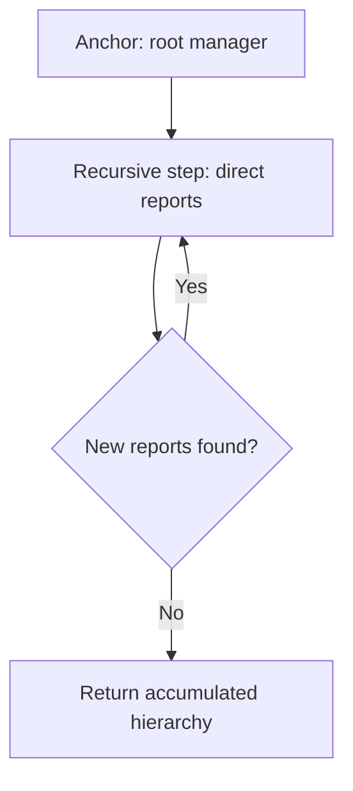
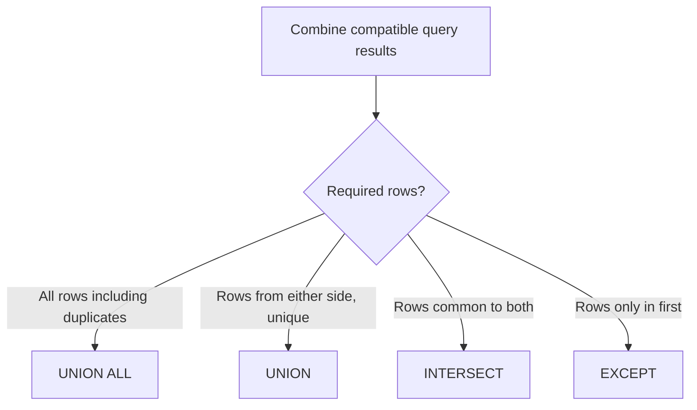

# Caelius Interview Preparation

## SQL Subqueries and CTEs (Q301-Q305)

For these questions, explain:

```text
Result shape -> Evaluation dependency -> Duplicate semantics -> NULL behavior -> Readability/performance tradeoff
```

The examples use PostgreSQL-oriented SQL.

---

# Q301. Difference Between CTE and Subquery

## Define

> A subquery is a query nested directly inside another SQL clause. A CTE is a named, statement-scoped result defined with `WITH` and referenced by the following statement.

## Equivalent Examples

### Subquery

```sql
SELECT department_id, average_salary
FROM (
    SELECT
        department_id,
        AVG(salary) AS average_salary
    FROM employee
    GROUP BY department_id
) department_stats
WHERE average_salary > 80000;
```

### CTE

```sql
WITH department_stats AS (
    SELECT
        department_id,
        AVG(salary) AS average_salary
    FROM employee
    GROUP BY department_id
)
SELECT department_id, average_salary
FROM department_stats
WHERE average_salary > 80000;
```

## Comparison

| CTE | Subquery |
|---|---|
| Named result | Nested inline result |
| Often easier to read in multi-step logic | Concise for small local expressions |
| Can be referenced multiple times in one statement | Repetition may duplicate query text |
| Supports recursive queries | Does not directly express recursion |
| Statement-scoped | Nested within its containing clause |

## Performance

Do not assume one is automatically faster. Optimizers may inline, rewrite, or materialize a CTE or subquery depending on the database, version, query, and explicit options.

Use execution plans for performance-critical decisions:

```sql
EXPLAIN ANALYZE
WITH department_stats AS (...)
SELECT ...;
```

## Interview Point

> I use a subquery when the logic is short and local. I use a CTE when naming intermediate result sets makes a multi-step query easier to verify or when recursion is required.

---

# Q302. What Is a Recursive CTE?

## Define

> A recursive CTE repeatedly applies a recursive query to rows produced by an initial anchor query until no new rows are produced.

It is commonly used for:

- Organizational hierarchies.
- Category trees.
- Graph reachability.
- Bill-of-materials expansion.
- Sequence generation.

## Structure

```sql
WITH RECURSIVE cte_name AS (
    -- Anchor query
    SELECT ...

    UNION ALL

    -- Recursive query referencing cte_name
    SELECT ...
    FROM ...
    JOIN cte_name ON ...
)
SELECT *
FROM cte_name;
```

## Employee Hierarchy Example

Assume `employee.manager_id` references `employee.id`.

```sql
WITH RECURSIVE organization AS (
    SELECT
        id,
        name,
        manager_id,
        0 AS depth,
        ARRAY[id] AS path
    FROM employee
    WHERE id = :root_manager_id

    UNION ALL

    SELECT
        employee.id,
        employee.name,
        employee.manager_id,
        organization.depth + 1,
        organization.path || employee.id
    FROM employee
    JOIN organization
        ON employee.manager_id = organization.id
    WHERE NOT employee.id = ANY(organization.path)
)
SELECT id, name, manager_id, depth
FROM organization
ORDER BY depth, id;
```

## Flow



## Termination and Cycles

A recursive CTE must make progress toward termination. Hierarchical data can contain accidental cycles, so production queries should use a path, visited set, depth limit, or database-specific cycle detection.

## Complexity

Complexity depends on:

- Number of visited rows and edges.
- Indexes supporting recursive joins.
- Duplicate elimination choice.
- Cycle-detection strategy.

An index on `employee(manager_id)` supports finding each manager's direct reports.

## Interview Point

The anchor creates the initial rows; the recursive member expands from previously discovered rows.

---

# Q303. What Is UNION vs UNION ALL?

## Define

> Both combine vertically compatible query results. `UNION` removes duplicate rows; `UNION ALL` keeps every row.

## Example

```sql
SELECT email
FROM customer

UNION

SELECT email
FROM newsletter_subscriber;
```

Returns each email once.

```sql
SELECT email
FROM customer

UNION ALL

SELECT email
FROM newsletter_subscriber;
```

Returns every row, including repeated emails.

## Compatibility Rules

Each query must return:

- The same number of columns.
- Corresponding columns with compatible data types.

Final column names generally come from the first query.

## Comparison

| UNION | UNION ALL |
|---|---|
| Removes duplicates | Preserves duplicates |
| Set-like result | Bag/multiset result |
| Requires deduplication work | Usually faster |
| Use when uniqueness is required | Use when duplicates are valid or impossible |

## ORDER BY

Apply final ordering after the combined result:

```sql
SELECT email FROM customer
UNION ALL
SELECT email FROM newsletter_subscriber
ORDER BY email;
```

## Interview Point

Prefer `UNION ALL` unless duplicate removal is part of the requirement. Avoid paying for deduplication accidentally.

---

# Q304. What Are INTERSECT and EXCEPT?

## INTERSECT

> `INTERSECT` returns rows present in both query results.

Find employees who are also project leads:

```sql
SELECT employee_id
FROM employee_project

INTERSECT

SELECT lead_employee_id
FROM project;
```

## EXCEPT

> `EXCEPT` returns rows present in the first query result but absent from the second.

Find employees with no project assignment:

```sql
SELECT id
FROM employee

EXCEPT

SELECT employee_id
FROM employee_project;
```

## Set Semantics

Standard `INTERSECT` and `EXCEPT` remove duplicates. Some databases support `INTERSECT ALL` and `EXCEPT ALL` to preserve multiplicities.

## Alternatives

Intersection with `EXISTS`:

```sql
SELECT e.id
FROM employee e
WHERE EXISTS (
    SELECT 1
    FROM employee_project ep
    WHERE ep.employee_id = e.id
);
```

Difference with `NOT EXISTS`:

```sql
SELECT e.id
FROM employee e
WHERE NOT EXISTS (
    SELECT 1
    FROM employee_project ep
    WHERE ep.employee_id = e.id
);
```

## Dialect Note

Support and names vary. PostgreSQL supports both; Oracle uses `MINUS` instead of `EXCEPT`; MySQL support depends on version and operation.

## Interview Point

`EXCEPT` is directional: `A EXCEPT B` is not the same as `B EXCEPT A`.

---

# Q305. Write a Query to Find Duplicate Rows

## Clarify

First define which columns determine duplication. Rows may have unique primary keys while still duplicating a business identity such as normalized email.

## Find Duplicate Business Keys

```sql
SELECT
    LOWER(TRIM(email)) AS normalized_email,
    COUNT(*) AS duplicate_count
FROM employee
GROUP BY LOWER(TRIM(email))
HAVING COUNT(*) > 1;
```

This returns duplicate groups, not every duplicate row.

## Return All Rows Belonging to Duplicate Groups

```sql
WITH duplicate_emails AS (
    SELECT LOWER(TRIM(email)) AS normalized_email
    FROM employee
    GROUP BY LOWER(TRIM(email))
    HAVING COUNT(*) > 1
)
SELECT e.*
FROM employee e
JOIN duplicate_emails d
    ON d.normalized_email = LOWER(TRIM(e.email))
ORDER BY d.normalized_email, e.id;
```

## Mark One Row to Keep

```sql
SELECT
    e.*,
    ROW_NUMBER() OVER (
        PARTITION BY LOWER(TRIM(email))
        ORDER BY id
    ) AS duplicate_number
FROM employee e;
```

- `duplicate_number = 1`: row to keep.
- `duplicate_number > 1`: extra duplicate rows.

## Prevent Recurrence

After cleaning existing data, enforce uniqueness:

```sql
CREATE UNIQUE INDEX uk_employee_normalized_email
ON employee (LOWER(TRIM(email)));
```

## NULL Consideration

`GROUP BY` places `NULL` values into one group. Decide whether multiple missing values should count as business duplicates.

## Interview Point

> Finding duplicates is a two-step reasoning problem: define the business key, then use `GROUP BY ... HAVING COUNT(*) > 1` or a partitioned window function depending on whether groups or full rows are needed.

---

# Set Operation Guide



# Subquery and CTE Interview Checklist

Before finalizing, ask:

```text
What shape does the inner result return?
Can a scalar subquery return multiple rows?
Does recursion have a valid anchor?
How does recursion terminate?
Can hierarchy data contain cycles?
Are duplicate rows meaningful?
Does the database support this set operator?
Should NULL values count as duplicates?
Would a unique constraint prevent recurrence?
```

# SQL Subqueries and CTEs Revision Sheet

| Question | Core answer |
|---|---|
| CTE vs subquery | Named statement-scoped result vs nested inline query |
| Recursive CTE | Anchor plus repeated recursive expansion |
| UNION vs UNION ALL | Deduplicated combination vs all rows |
| INTERSECT and EXCEPT | Common rows and first-only rows |
| Find duplicates | Group business key and filter count above one |

## Common Interview Mistakes

- Claiming CTEs are always faster than subqueries.
- Writing recursive CTEs without termination or cycle handling.
- Using `UNION` when duplicate preservation is required.
- Paying for `UNION` deduplication unnecessarily.
- Forgetting set-operation column compatibility.
- Treating `EXCEPT` as symmetric.
- Finding duplicates using a primary key that is already unique.
- Deleting duplicates before defining which row to keep.
