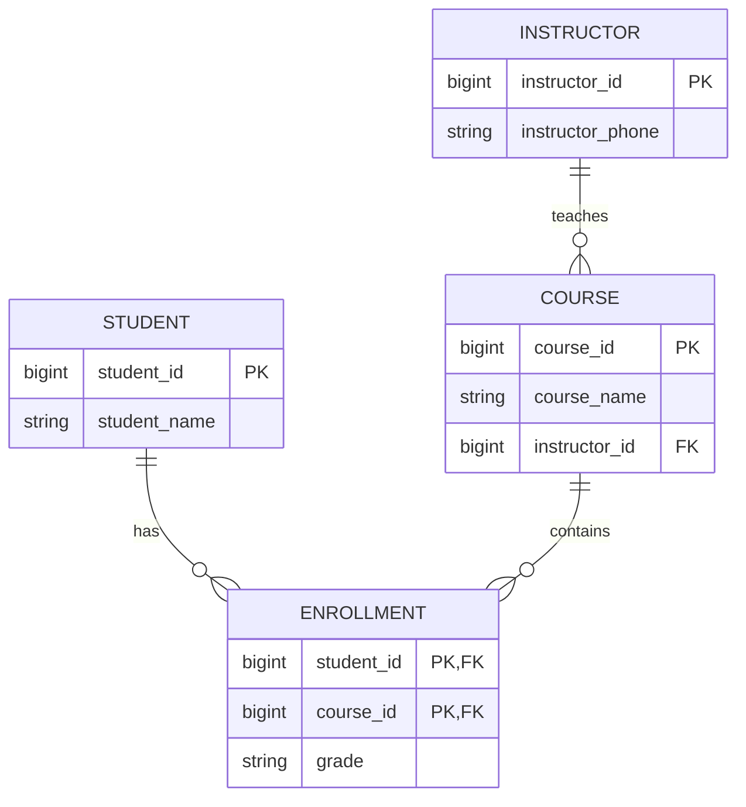
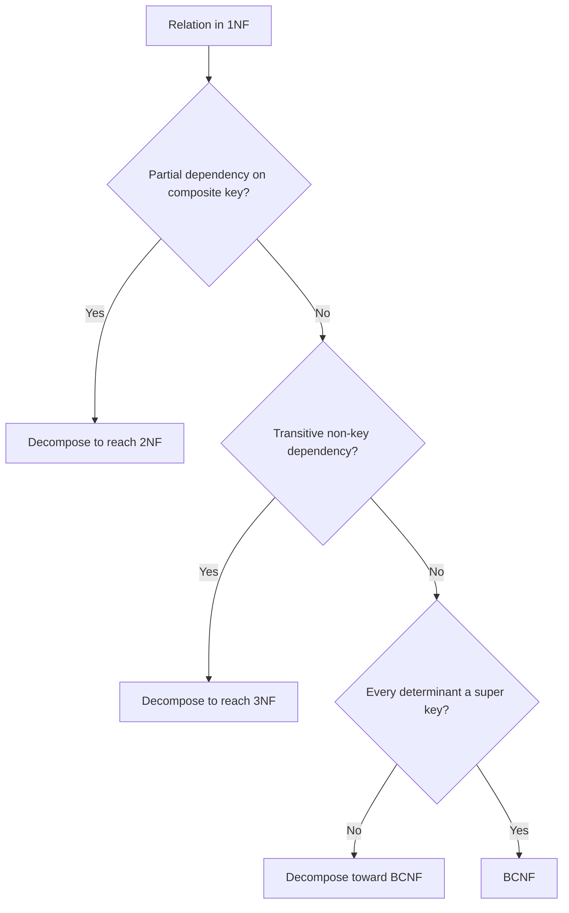

# Caelius Interview Preparation

## Database Normalization (Q306-Q315)

For normalization questions, speak in this order:

```text
Identify candidate keys -> Write functional dependencies -> Name anomaly -> Decompose -> Explain preserved constraints
```

Running example:

```text
ENROLLMENT(
    student_id,
    student_name,
    course_id,
    course_name,
    instructor_id,
    instructor_phone,
    grade
)
```

Assumptions:

```text
(student_id, course_id) -> grade
student_id              -> student_name
course_id               -> course_name, instructor_id
instructor_id           -> instructor_phone
```

The candidate key is `(student_id, course_id)`.

---

# Q306. What Is Normalization and Why Is It Needed?

## Define

> Normalization is the process of structuring relational data into well-designed tables based on dependencies, reducing unnecessary duplication and preventing modification anomalies.

## Problems in the Running Example

The unnormalized design repeats:

- A student's name for every enrolled course.
- A course name for every enrolled student.
- An instructor's phone number for every student in that instructor's courses.

## Anomalies

### Update Anomaly

Changing an instructor phone number requires updating many enrollment rows. Missing one creates inconsistent data.

### Insert Anomaly

A new course cannot be stored until a student enrolls if course information exists only in `ENROLLMENT`.

### Delete Anomaly

Deleting the final enrollment for a course may accidentally delete the only stored course and instructor details.

## Normalized Design



## Benefits

- Reduces redundant storage.
- Improves data consistency.
- Makes constraints clearer.
- Prevents update, insertion, and deletion anomalies.

## Tradeoff

More normalized schemas often require more joins. The goal is appropriate structure, not blindly maximizing normal form.

---

# Q307. What Is 1NF? When Is a Table in 1NF?

## Define

> A relation is in First Normal Form when every attribute contains one atomic value from its domain and repeating groups are removed.

## Violation

```text
STUDENT(
    student_id,
    name,
    phone_numbers = "111-1111, 222-2222"
)
```

`phone_numbers` stores multiple values in one cell, making validation and querying difficult.

## 1NF Design

```sql
CREATE TABLE student (
    student_id BIGINT PRIMARY KEY,
    name       VARCHAR(150) NOT NULL
);

CREATE TABLE student_phone (
    student_id BIGINT NOT NULL REFERENCES student(student_id),
    phone      VARCHAR(30) NOT NULL,
    PRIMARY KEY (student_id, phone)
);
```

## Important Meaning of Atomic

Atomicity is relative to the intended operations. A full address might be one value if never queried by components, but should be split if city, postal code, and country need independent constraints or searches.

## 1NF Checklist

- One value per cell.
- No repeating column groups such as `phone1`, `phone2`, `phone3`.
- Each row can be identified.
- Values follow defined domains.

## Interview Point

1NF removes repeating groups; it does not remove all redundancy.

---

# Q308. What Is 2NF?

## Define

> A relation is in Second Normal Form when it is in 1NF and every non-key attribute depends on the whole of every candidate key, not only part of a composite key.

## Partial Dependencies in ENROLLMENT

Candidate key:

```text
(student_id, course_id)
```

Dependencies:

```text
student_id -> student_name
course_id  -> course_name, instructor_id
```

These attributes depend on only part of the composite key, violating 2NF.

## Decomposition

```text
STUDENT(student_id, student_name)
COURSE(course_id, course_name, instructor_id, instructor_phone)
ENROLLMENT(student_id, course_id, grade)
```

Now:

```text
(student_id, course_id) -> grade
```

`grade` depends on the whole enrollment key.

## Key Detail

If every candidate key contains only one attribute, partial dependency is impossible, so a 1NF relation is automatically in 2NF.

## Interview Point

2NF specifically targets partial dependencies on composite candidate keys.

---

# Q309. What Is 3NF?

## Define

> A relation is in Third Normal Form when it is in 2NF and non-key attributes do not depend transitively on candidate keys through other non-key attributes.

## Transitive Dependency

In:

```text
COURSE(course_id, course_name, instructor_id, instructor_phone)
```

Dependencies:

```text
course_id     -> instructor_id
instructor_id -> instructor_phone
```

Therefore:

```text
course_id -> instructor_phone
```

indirectly through a non-key attribute.

## Decomposition

```text
COURSE(course_id, course_name, instructor_id)
INSTRUCTOR(instructor_id, instructor_phone)
```

## Formal 3NF Rule

For every non-trivial functional dependency `X -> A`, at least one is true:

- `X` is a super key, or
- `A` is a prime attribute, meaning it belongs to some candidate key.

## Interview-Ready Shortcut

> "In 3NF, non-key attributes depend on the key, the whole key, and nothing but the key."

This phrase is useful, but explain dependencies if asked for precision.

---

# Q310. What Is BCNF?

## Define

> A relation is in Boyce-Codd Normal Form when, for every non-trivial functional dependency `X -> Y`, `X` is a super key.

BCNF is stricter than 3NF.

## Example That Is 3NF but Not BCNF

Consider:

```text
TEACHING(student, course, instructor)
```

Assume:

```text
(student, course) -> instructor
instructor        -> course
```

Candidate keys:

```text
(student, course)
(student, instructor)
```

`instructor -> course` violates BCNF because `instructor` is not a super key.

It can satisfy 3NF because `course` is a prime attribute: it appears in a candidate key.

## BCNF Decomposition

```text
INSTRUCTOR_COURSE(instructor, course)
STUDENT_INSTRUCTOR(student, instructor)
```

## Tradeoff

A BCNF decomposition is lossless when performed correctly, but may not preserve every functional dependency for direct enforcement.

## Interview Point

BCNF requires every determinant to be a super key.

---

# Q311. What Is Denormalization?

## Define

> Denormalization intentionally introduces controlled redundancy into a normalized design to improve read performance, simplify queries, or support reporting workloads.

## Example

Normalized:

```text
ORDER(id)
ORDER_ITEM(order_id, quantity, unit_price)
```

Denormalized:

```text
ORDER(id, total_amount)
```

`total_amount` can be stored even though it is derivable from items, avoiding recalculation on frequent reads.

## Common Forms

- Store precomputed totals.
- Duplicate frequently joined descriptive fields.
- Build summary tables or materialized views.
- Maintain read models optimized for specific queries.

## Benefits

- Faster reads.
- Fewer joins.
- Simpler analytics queries.

## Risks

- More storage.
- Update complexity.
- Stale or inconsistent duplicated values.
- Harder constraints and recovery.

## Real Project Connection

> In an analytics-heavy system like CommentPulse, precomputed sentiment summaries can make dashboards fast. The raw comments remain the source of truth, while derived aggregates must be refreshed reliably.

## Interview Point

Denormalize only after identifying a measured read-performance need and defining how consistency will be maintained.

---

# Q312. What Is a Functional Dependency?

## Define

> A functional dependency `X -> Y` means that whenever two rows agree on attribute set `X`, they must also agree on attribute set `Y`.

`X` is the determinant; `Y` is functionally dependent on `X`.

## Examples

```text
student_id  -> student_name
course_id   -> course_name
employee_id -> employee_email, employee_name
```

If `student_id = 7` appears in multiple rows, every such row must have the same `student_name`.

## Non-Example

```text
department_id -> employee_name
```

This is generally false because one department can contain many employee names.

## Trivial Dependency

```text
(student_id, course_id) -> student_id
```

This is trivial because the right side is already part of the left side.

## Why It Matters

Functional dependencies help identify:

- Candidate keys.
- Redundancy.
- Normal-form violations.
- Correct decompositions.

## Interview Point

Dependencies come from business rules, not merely from patterns observed in today's sample data.

---

# Q313. What Is a Transitive Dependency?

## Define

> A transitive dependency exists when a key determines a non-key attribute through another non-key attribute.

Pattern:

```text
K -> A
A -> B
therefore K -> B
```

where `A` and `B` are non-key attributes.

## Example

```text
employee_id   -> department_id
department_id -> department_name
```

Therefore:

```text
employee_id -> department_name
```

Storing `department_name` in `EMPLOYEE` repeats it for every employee in that department.

## Fix

```text
EMPLOYEE(employee_id, department_id, ...)
DEPARTMENT(department_id, department_name)
```

## Why It Causes Problems

Changing a department name would require updating every employee row, creating an update anomaly.

## Interview Point

3NF removes problematic transitive dependencies from keys to non-key attributes.

---

# Q314. What Is a Partial Dependency?

## Define

> A partial dependency occurs when a non-key attribute depends on only part of a composite candidate key.

## Example

```text
ENROLLMENT(student_id, course_id, student_name, grade)
```

Candidate key:

```text
(student_id, course_id)
```

Dependencies:

```text
student_id              -> student_name
(student_id, course_id) -> grade
```

`student_name` depends on only `student_id`, part of the composite key.

## Fix

```text
STUDENT(student_id, student_name)
ENROLLMENT(student_id, course_id, grade)
```

## Partial vs Transitive

| Partial dependency | Transitive dependency |
|---|---|
| Depends on part of composite key | Depends through another non-key attribute |
| Addressed by 2NF | Addressed by 3NF |

## Interview Point

Partial dependencies require a composite candidate key; they cannot occur relative to a single-column key.

---

# Q315. Difference Between 3NF and BCNF

## Core Difference

For every non-trivial dependency `X -> A`:

- 3NF allows it if `X` is a super key **or** `A` is a prime attribute.
- BCNF allows it only if `X` is a super key.

## Comparison

| 3NF | BCNF |
|---|---|
| Less strict | More strict |
| Allows certain non-super-key determinants when dependent attribute is prime | Every determinant must be a super key |
| Always achievable with lossless, dependency-preserving decomposition | Correct decomposition is lossless, but may lose dependency preservation |
| Removes most practical anomalies | Removes more redundancy/anomalies |

## Example

For:

```text
TEACHING(student, course, instructor)
```

with:

```text
(student, course) -> instructor
instructor        -> course
```

`instructor -> course`:

- Can satisfy 3NF because `course` is prime.
- Violates BCNF because `instructor` is not a super key.

## Interview-Ready Answer

> BCNF is stricter than 3NF. 3NF permits a dependency whose determinant is not a super key when the dependent attribute belongs to a candidate key. BCNF does not permit that exception.

---

# Normalization Decision Flow



# Normalization Interview Checklist

Before decomposing, identify:

```text
all candidate keys
prime and non-prime attributes
functional dependencies from business rules
partial dependencies
transitive dependencies
update, insert, and delete anomalies
lossless join requirement
dependency preservation requirement
measured reasons for denormalization
```

# Database Normalization Revision Sheet

| Question | Core answer |
|---|---|
| Normalization | Structure relations to reduce redundancy and anomalies |
| 1NF | Atomic values and no repeating groups |
| 2NF | 1NF plus no partial dependency |
| 3NF | 2NF plus restricted transitive dependencies |
| BCNF | Every determinant is a super key |
| Denormalization | Intentional controlled redundancy for read performance |
| Functional dependency | `X` values determine `Y` values |
| Transitive dependency | Key determines non-key through another non-key |
| Partial dependency | Non-key depends on part of composite key |
| 3NF vs BCNF | BCNF removes 3NF's prime-attribute exception |

## Common Interview Mistakes

- Normalizing without first identifying candidate keys.
- Treating sample-data coincidence as a functional dependency.
- Saying 1NF removes all redundancy.
- Discussing 2NF without a composite key.
- Confusing partial and transitive dependencies.
- Saying 3NF and BCNF are identical.
- Decomposing without considering lossless joins.
- Denormalizing before measuring a performance need.
