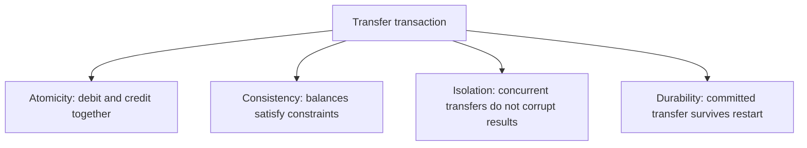
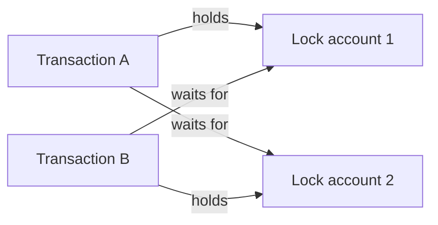
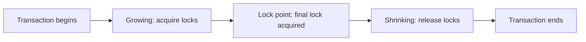
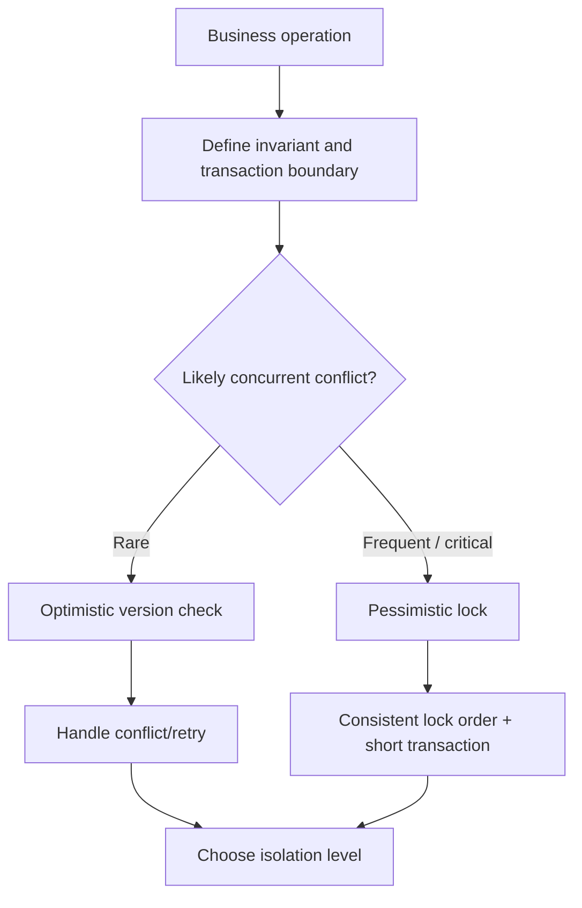

# Caelius Interview Preparation

## Transactions and ACID (Q316-Q330)

For transaction questions, speak in this order:

```text
Business invariant -> Transaction boundary -> Concurrent failure risk -> Database guarantee -> Recovery/retry strategy
```

Running example:

```sql
CREATE TABLE account (
    id      BIGINT PRIMARY KEY,
    balance NUMERIC(14, 2) NOT NULL CHECK (balance >= 0),
    version BIGINT NOT NULL DEFAULT 0
);
```

Business invariant:

```text
A transfer must debit one account and credit the other as one logical unit.
Total transferred money must not disappear or be created.
```

---

# Q316. What Is a Transaction in DBMS?

## Define

> A transaction is a sequence of database operations treated as one logical unit of work that either completes successfully or has its effects undone.

## Transfer Example

```sql
BEGIN;

UPDATE account
SET balance = balance - 100
WHERE id = 1;

UPDATE account
SET balance = balance + 100
WHERE id = 2;

COMMIT;
```

Both updates belong to one transaction. If the credit fails, the debit must not remain committed.

## Transaction Boundaries

```text
BEGIN / START TRANSACTION
SQL operations
COMMIT or ROLLBACK
```

Many database clients use autocommit by default, meaning each statement becomes its own transaction unless an explicit transaction is opened.

## Why Transactions Matter

- Preserve business invariants.
- Group dependent writes.
- Control concurrent access.
- Support failure recovery.

## Real Project Connection

> In Nodeflowz, saving related workflow graph data should be transactional. If nodes save but connections fail, the workflow becomes inconsistent. A transaction ensures the graph update succeeds or fails as a unit.

## Interview Point

The correct transaction boundary follows the business operation, not merely an individual SQL statement.

---

# Q317. What Are ACID Properties?

## Define

> ACID describes four key transaction guarantees: Atomicity, Consistency, Isolation, and Durability.

## Summary

| Property | Core guarantee |
|---|---|
| Atomicity | All transaction operations commit or none do |
| Consistency | Valid invariants hold before and after commit |
| Isolation | Concurrent transactions behave according to an isolation contract |
| Durability | Committed changes survive failures |

## Transfer Mapping



## Important Nuance

ACID does not mean:

- Every application invariant is automatically known by the database.
- Transactions never block or fail.
- All isolation levels behave like serial execution.
- Backups are unnecessary.

## Interview Point

Explain each property using one connected business operation rather than giving four disconnected definitions.

---

# Q318. Explain Atomicity

## Define

> Atomicity guarantees that a transaction's changes are committed together or rolled back together.

## Failure Example

Without a transaction:

```text
1. Debit account A.
2. Application crashes.
3. Account B is never credited.
```

With atomicity, the database rolls back the uncommitted debit.

## SQL Example

```sql
BEGIN;

UPDATE account
SET balance = balance - 100
WHERE id = 1
  AND balance >= 100;

-- Application verifies exactly one row was updated.

UPDATE account
SET balance = balance + 100
WHERE id = 2;

COMMIT;
```

If an error occurs:

```sql
ROLLBACK;
```

## How Databases Support It

Implementations commonly use transaction logs, undo information, or multi-version storage to discard uncommitted work.

## Interview Point

Atomicity is about all-or-nothing transaction effects, not whether a single SQL statement can be divided physically during execution.

---

# Q319. Explain Consistency

## Define

> Consistency means a successful transaction moves the database from one valid state to another valid state, preserving declared constraints and required business invariants.

## Database-Enforced Rules

```sql
balance NUMERIC(14, 2) NOT NULL CHECK (balance >= 0)
```

Other database constraints include:

- Primary and foreign keys.
- Unique constraints.
- Check constraints.
- Data types.

## Application-Enforced Rules

The database does not automatically understand every business rule. For example:

```text
An account may transfer at most 10,000 per day.
```

This must be correctly modeled and enforced through application logic, stored procedures, triggers, constraints, or a combination.

## ACID Consistency vs CAP Consistency

ACID consistency means preserving invariants within transaction semantics. CAP consistency refers to distributed-system replicas presenting a single up-to-date view. They are related words with different meanings.

## Interview Point

Consistency is a shared responsibility: the database enforces declared rules, while developers must correctly define the transaction and business invariants.

---

# Q320. Explain Isolation

## Define

> Isolation controls how concurrent transactions observe and interfere with one another.

The strongest conceptual model is serial execution: transactions behave as if they ran one after another. Weaker isolation levels permit more concurrency but may allow specific anomalies.

## Lost-Update Example

```text
Initial balance = 100

Transaction A reads 100
Transaction B reads 100
Transaction A writes 80
Transaction B writes 70

One update is lost.
```

## Safer Atomic Update

```sql
UPDATE account
SET balance = balance - 20
WHERE id = 1
  AND balance >= 20;
```

This lets the database perform the read-modify-write operation atomically.

## Isolation Tools

- Isolation levels.
- Row and table locks.
- Multi-Version Concurrency Control (MVCC).
- Optimistic version checks.
- Serializable transaction retries.

## Interview Point

Isolation is not simply "transactions cannot see each other." It defines which concurrent observations and anomalies are permitted.

---

# Q321. Explain Durability

## Define

> Durability guarantees that once a transaction commits successfully, its changes survive subsequent process crashes or system restarts.

## Typical Mechanism

Databases commonly use write-ahead logging:

```text
1. Record change in durable transaction log.
2. Confirm commit.
3. Write modified data pages later.
4. Replay committed log records during recovery if needed.
```

## Important Limits

Durability depends on configuration and infrastructure:

- Synchronous versus asynchronous commit.
- Storage guarantees.
- Replication mode.
- Hardware failure scope.

Durability does not replace:

- Backups.
- Point-in-time recovery.
- Disaster recovery.
- Tested restore procedures.

## Interview Point

A successful commit acknowledges durable persistence according to the database's configured durability contract.

---

# Q322. What Is a Deadlock in DBMS?

## Define

> A deadlock occurs when transactions form a cycle of waiting for locks, so none can continue without intervention.

## Example Timeline

```text
Transaction A locks account 1.
Transaction B locks account 2.
Transaction A waits for account 2.
Transaction B waits for account 1.
```



## Detection

Databases can build a wait-for graph. A cycle indicates a deadlock. The database chooses a victim transaction to roll back, allowing the other transaction to proceed.

## Deadlock vs Blocking

- Blocking: one transaction waits, and the holder can eventually release the lock.
- Deadlock: transactions wait in a cycle; rollback is required to break it.

## Application Responsibility

Deadlock errors are expected under contention. Applications should:

- Roll back the failed transaction.
- Retry the entire business operation when safe.
- Use bounded retries and backoff.

## Interview Point

Deadlocks are not necessarily database bugs; they can occur naturally when valid concurrent transactions acquire locks in conflicting orders.

---

# Q323. How Can Deadlocks Be Prevented or Reduced?

## Consistent Lock Ordering

Lock resources in a globally consistent order:

```sql
SELECT id, balance
FROM account
WHERE id IN (:first_id, :second_id)
ORDER BY id
FOR UPDATE;
```

If every transfer locks the smaller account ID first, circular wait becomes less likely.

## Keep Transactions Short

- Avoid user interaction inside transactions.
- Move network calls outside lock-holding periods.
- Commit or roll back promptly.

## Access Only Required Rows

- Use selective predicates.
- Add appropriate indexes.
- Avoid unnecessarily broad locks.

## Other Strategies

- Use lower-contention data models.
- Set lock timeouts where appropriate.
- Use optimistic concurrency when conflicts are rare.
- Retry deadlock victims safely.

## Prevention vs Handling

It is difficult to eliminate all deadlocks in complex systems. Good design reduces frequency, while retry logic handles remaining cases.

## Interview Point

The most important practical rule is consistent resource-access order plus short transaction duration.

---

# Q324. What Are COMMIT and ROLLBACK?

## COMMIT

> `COMMIT` successfully ends the transaction and makes its changes durable and visible according to isolation rules.

```sql
BEGIN;

UPDATE account
SET balance = balance - 100
WHERE id = 1;

UPDATE account
SET balance = balance + 100
WHERE id = 2;

COMMIT;
```

## ROLLBACK

> `ROLLBACK` aborts the current transaction and undoes its uncommitted changes.

```sql
BEGIN;

UPDATE account
SET balance = balance - 100
WHERE id = 1;

-- Validation or later operation fails.
ROLLBACK;
```

## Application Pattern

```text
begin transaction
try:
    perform all operations
    validate outcomes
    commit
catch:
    rollback
    propagate or retry
```

## Important Rule

After commit, a normal rollback cannot undo the transaction. Reversal requires a new compensating transaction or recovery process.

## Interview Point

Commit is the transaction's success boundary; rollback is the failure path for uncommitted work.

---

# Q325. What Is a SAVEPOINT?

## Define

> A savepoint marks a position inside a transaction so later operations can be rolled back without aborting the entire transaction.

## Example

```sql
BEGIN;

INSERT INTO purchase_order (id, customer_id)
VALUES (1001, 77);

SAVEPOINT before_optional_discount;

UPDATE customer_discount
SET remaining_uses = remaining_uses - 1
WHERE customer_id = 77
  AND remaining_uses > 0;

-- If the optional discount step fails:
ROLLBACK TO SAVEPOINT before_optional_discount;

INSERT INTO order_audit (order_id, message)
VALUES (1001, 'Order created without optional discount');

COMMIT;
```

## Commands

```sql
SAVEPOINT savepoint_name;
ROLLBACK TO SAVEPOINT savepoint_name;
RELEASE SAVEPOINT savepoint_name;
```

## Use Cases

- Recover from optional sub-operation failure.
- Support nested transaction-like application behavior.
- Partially retry a larger unit of work.

## Caution

Savepoints do not make every external side effect reversible. A sent email or external API call cannot be rolled back by the database.

## Interview Point

A savepoint provides partial rollback within one transaction, while `ROLLBACK` without a target aborts the whole transaction.

---

# Q326. What Are Transaction Isolation Levels?

## Define

> An isolation level specifies which concurrency anomalies a transaction must be protected from.

Standard SQL levels:

| Isolation level | Dirty reads | Non-repeatable reads | Phantoms |
|---|---|---|---|
| Read Uncommitted | May occur | May occur | May occur |
| Read Committed | Prevented | May occur | May occur |
| Repeatable Read | Prevented | Prevented | Standard permits phantoms |
| Serializable | Prevented | Prevented | Prevented |

Actual behavior depends on the database's implementation. PostgreSQL, for example, maps Read Uncommitted to Read Committed and provides stronger snapshot behavior for Repeatable Read.

## Set Isolation

```sql
BEGIN TRANSACTION ISOLATION LEVEL SERIALIZABLE;

-- Transaction operations

COMMIT;
```

## Tradeoff

Stronger isolation:

- Simplifies reasoning.
- Prevents more anomalies.
- May increase blocking, aborts, and retries.

Weaker isolation:

- Improves concurrency.
- Requires careful application design.

## Interview Point

Choose the weakest level that still preserves the operation's required invariants, and handle retries where the database can abort conflicting transactions.

---

# Q327. What Are Dirty Read, Non-Repeatable Read, and Phantom Read?

## Dirty Read

> A transaction reads another transaction's uncommitted change.

```text
T1 updates salary to 90000 but has not committed.
T2 reads 90000.
T1 rolls back.
T2 used a value that never became real.
```

## Non-Repeatable Read

> Reading the same row twice returns different committed values because another transaction updated or deleted it between reads.

```text
T1 reads employee 7 salary = 80000.
T2 updates it to 85000 and commits.
T1 reads employee 7 again and sees 85000.
```

## Phantom Read

> Repeating a predicate query returns a different set of rows because another transaction inserted, deleted, or changed rows matching that predicate.

```text
T1 counts employees where salary > 100000: 5.
T2 inserts another matching employee and commits.
T1 repeats query and counts 6.
```

## Comparison

| Anomaly | What changes? |
|---|---|
| Dirty read | Reads uncommitted data |
| Non-repeatable read | Existing row's observed value/presence changes |
| Phantom read | Set of rows matching a predicate changes |

## Interview Point

Non-repeatable reads concern a specific row; phantoms concern a query's matching set.

---

# Q328. What Is Optimistic vs Pessimistic Locking?

## Optimistic Concurrency

> Optimistic concurrency assumes conflicts are uncommon. It performs work without holding a long-lived lock and verifies at update time that the row has not changed.

Version-column example:

```sql
UPDATE account
SET
    balance = :new_balance,
    version = version + 1
WHERE id = :id
  AND version = :expected_version;
```

If zero rows update, another transaction changed the record. Reload, reject, or retry.

## Pessimistic Locking

> Pessimistic locking assumes conflicts are likely and locks data before modifying it.

```sql
BEGIN;

SELECT id, balance
FROM account
WHERE id = 1
FOR UPDATE;

UPDATE account
SET balance = balance - 100
WHERE id = 1;

COMMIT;
```

## Comparison

| Optimistic | Pessimistic |
|---|---|
| Detect conflict at write time | Prevent competing writes using locks |
| Good for low contention | Good for high-contention critical sections |
| Requires version/conflict handling | Can block and deadlock |
| Avoids long lock waits | Gives stronger immediate control |

## Interview Point

Optimistic locking does not mean no concurrency control; it means conflicts are detected instead of prevented upfront.

---

# Q329. What Is a Lock in DBMS?

## Define

> A lock is concurrency-control metadata that restricts incompatible operations on a database resource while a transaction is using it.

## Common Lock Modes

- Shared/read lock: multiple readers can coexist.
- Exclusive/write lock: blocks incompatible readers or writers depending on database behavior.
- Intent locks: indicate planned lower-level locks.

## Lock Granularity

```text
database
table
page
row
key range / predicate
```

Fine-grained locks allow more concurrency but require more lock-management overhead. Coarse locks are simpler but block more work.

## Row Lock Example

```sql
SELECT id, balance
FROM account
WHERE id = 1
FOR UPDATE;
```

## MVCC Nuance

Databases using MVCC may let readers view an earlier committed row version while a writer holds a lock. Lock behavior varies by database and isolation level.

## Interview Point

Locks preserve correctness under concurrency, but holding too many locks or holding them too long reduces throughput and increases deadlock risk.

---

# Q330. What Is Two-Phase Locking?

## Define

> Two-Phase Locking, or 2PL, is a concurrency-control protocol where a transaction first acquires locks and later releases them, without acquiring new locks after releasing one.

## Phases

```text
Growing phase:   acquire locks, release none
Shrinking phase: release locks, acquire none
```



## Guarantees

Basic 2PL ensures conflict-serializable schedules.

## Strict Two-Phase Locking

> Strict 2PL holds exclusive/write locks until commit or rollback.

This prevents other transactions from reading or overwriting uncommitted writes and simplifies recovery.

## Tradeoffs

- Provides strong correctness guarantees.
- Can cause blocking and deadlocks.
- Requires deadlock detection, prevention, or timeout handling.

## 2PL vs Two-Phase Commit

- Two-Phase Locking: concurrency-control protocol.
- Two-Phase Commit: distributed transaction commit protocol.

They are unrelated despite similar names.

## Interview Point

2PL guarantees serializability through lock-acquisition rules, but it does not prevent deadlocks.

---

# Transaction Concurrency Decision Guide



# Transactions and ACID Interview Checklist

Before implementing, ask:

```text
What is the business invariant?
Which operations must commit together?
What concurrent anomaly can violate the invariant?
Which isolation level is required?
Should rows be locked or version-checked?
Can the operation be safely retried?
Are external side effects inside the transaction?
Are locks acquired in a consistent order?
Is the transaction kept short?
What happens after a deadlock or serialization failure?
```

# Transactions and ACID Revision Sheet

| Question | Core answer |
|---|---|
| Transaction | Logical all-or-nothing unit of database work |
| ACID | Atomicity, Consistency, Isolation, Durability |
| Atomicity | Commit all effects or none |
| Consistency | Preserve declared invariants |
| Isolation | Control concurrent visibility and interference |
| Durability | Committed changes survive failures |
| Deadlock | Cyclic lock waiting |
| Deadlock reduction | Consistent order, short transactions, retry |
| COMMIT/ROLLBACK | Finalize success / undo uncommitted work |
| SAVEPOINT | Partial rollback marker |
| Isolation levels | Contracts preventing different anomalies |
| Read anomalies | Dirty, non-repeatable, phantom |
| Optimistic/pessimistic | Detect conflict later / prevent with locks |
| Lock | Concurrency-control restriction on a resource |
| Two-phase locking | Acquire phase followed by release phase |

## Common Interview Mistakes

- Choosing transaction boundaries around statements instead of business operations.
- Assuming ACID consistency automatically enforces every business rule.
- Saying isolation means transactions never interact.
- Treating durability as a replacement for backups.
- Confusing blocking with deadlock.
- Trying to eliminate all deadlocks instead of also handling retries.
- Holding transactions open during network calls or user interaction.
- Confusing optimistic locking with no locking/concurrency control.
- Confusing two-phase locking with two-phase commit.
