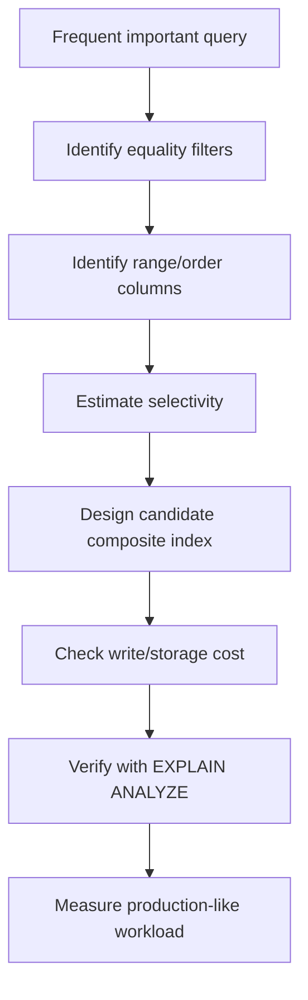

# Caelius Interview Preparation

## DBMS Indexes, Views, and Database Objects (Q331-Q345)

For index and optimization questions, speak in this order:

```text
Query pattern -> Selectivity/order requirement -> Candidate structure -> Read benefit -> Write/storage cost -> Verify with execution plan
```

Example table:

```sql
CREATE TABLE workflow_execution (
    id          BIGINT PRIMARY KEY,
    workflow_id BIGINT NOT NULL,
    status      VARCHAR(30) NOT NULL,
    started_at  TIMESTAMP NOT NULL,
    finished_at TIMESTAMP,
    duration_ms BIGINT
);
```

---

# Q331. What Is an Index? Why Is It Used?

## Define

> An index is an auxiliary data structure that helps the database locate or order rows without scanning the entire table.

An index commonly stores indexed key values plus row locators or enough information to retrieve matching rows.

## Example

```sql
CREATE INDEX idx_execution_workflow_started
ON workflow_execution (workflow_id, started_at DESC);
```

This can support:

```sql
SELECT id, status, started_at
FROM workflow_execution
WHERE workflow_id = 42
ORDER BY started_at DESC
LIMIT 20;
```

## Why It Helps

Without a useful index, the database may scan many or all table rows and sort matches. With an appropriate index, it may navigate directly to workflow `42` and read rows in the required order.

## Costs

- Additional storage.
- More work for `INSERT`, `UPDATE`, and `DELETE`.
- Maintenance and vacuum/rebuild overhead.
- Poor indexes can be ignored by the optimizer.

## Real Project Connection

> In Nodeflowz, querying recent executions by workflow is a natural composite-index pattern: filter by workflow ID, then order by execution time. I would validate the final index with the real query plan and workload.

## Interview Point

Indexes are not copies of the whole table by definition; they are access structures optimized for particular query patterns.

---

# Q332. What Are the Types of Indexes?

## Common Index Categories

### B-Tree Index

- Common default in relational databases.
- Supports equality, range filters, and ordered retrieval.
- Good for `<`, `>`, `BETWEEN`, and prefix columns of composite keys.

```sql
CREATE INDEX idx_execution_started
ON workflow_execution (started_at);
```

### Hash Index

- Optimized for equality lookups.
- Does not naturally support range scans or ordering.
- Availability and behavior depend on database.

### Composite Index

Contains multiple columns:

```sql
CREATE INDEX idx_execution_workflow_status
ON workflow_execution (workflow_id, status);
```

Column order matters.

### Unique Index

Enforces uniqueness while supporting lookup:

```sql
CREATE UNIQUE INDEX uk_user_email
ON app_user (email);
```

### Partial or Filtered Index

Indexes only rows matching a predicate:

```sql
CREATE INDEX idx_running_execution
ON workflow_execution (workflow_id, started_at)
WHERE status = 'RUNNING';
```

### Expression/Functional Index

Indexes a computed expression:

```sql
CREATE INDEX idx_user_lower_email
ON app_user (LOWER(email));
```

### Specialized Indexes

Depending on the DBMS:

- Full-text indexes.
- Spatial indexes.
- PostgreSQL GIN/GiST/BRIN.
- Bitmap indexes in analytics-oriented systems.

## Interview Point

Name the database and access pattern before recommending a specialized index.

---

# Q333. Clustered vs Non-Clustered Index

## Define

> A clustered index determines or closely controls the physical row-storage order. A non-clustered index is a separate structure containing keys and row locators.

## Comparison

| Clustered | Non-clustered |
|---|---|
| Data rows stored in index order or leaf level | Separate from table rows |
| Usually one physical ordering per table | Multiple can exist |
| Efficient for ordered range retrieval | Efficient for targeted lookups |
| Inserts may cause page movement/splits | Adds lookup hop unless covering |

## SQL Server Context

In SQL Server:

- A clustered index's leaf level contains data rows.
- A table without one is a heap.
- Non-clustered indexes reference clustered keys or heap row identifiers.

## PostgreSQL Context

PostgreSQL indexes are separate from heap storage. `CLUSTER` can physically reorder a table using an index, but PostgreSQL does not continuously maintain that physical order as a SQL Server clustered index does.

## Example Query

Rows frequently queried by a date range can benefit from physical locality:

```sql
SELECT *
FROM workflow_execution
WHERE started_at >= :from_time
  AND started_at < :to_time;
```

## Interview Point

Clustered-index behavior is database-specific. Do not present one product's implementation as a universal SQL rule.

---

# Q334. What Is a Covering Index?

## Define

> A covering index contains all columns needed to satisfy a query, allowing the database to avoid or reduce visits to the base table.

## Example

Query:

```sql
SELECT status, started_at, duration_ms
FROM workflow_execution
WHERE workflow_id = 42
ORDER BY started_at DESC
LIMIT 20;
```

PostgreSQL index with included columns:

```sql
CREATE INDEX idx_execution_recent_covering
ON workflow_execution (workflow_id, started_at DESC)
INCLUDE (status, duration_ms);
```

## Key Columns vs Included Columns

- Key columns participate in navigation and ordering.
- Included columns are stored for retrieval but do not define index ordering.

## Benefit

The engine may use an index-only scan when visibility and database conditions allow.

## Costs

- Larger index.
- More write and maintenance work.
- Included values can reduce cache efficiency.

## Interview Point

A covering index is query-specific. The same index may cover one query but not another.

---

# Q335. When Should You Not Use an Index?

## Avoid or Reconsider an Index When

### The Table Is Small

A sequential scan may be cheaper than navigating an index and fetching rows.

### The Column Has Low Selectivity

An index on a two-value column such as `is_active` may not help broad queries, though a partial index can still be useful for a rare value.

### The Table Is Write-Heavy

Every index adds work to inserts, updates, and deletes.

### The Indexed Column Changes Frequently

Frequent updates cause index maintenance and potentially more page churn.

### The Query Returns a Large Portion of the Table

Scanning the table can be cheaper than many random row lookups.

### An Existing Index Already Covers the Pattern

Redundant indexes waste space and write effort.

## Example of Better Partial Index

Instead of indexing every status:

```sql
CREATE INDEX idx_failed_execution_recent
ON workflow_execution (started_at DESC)
WHERE status = 'FAILED';
```

This can be useful if failed rows are rare and frequently queried.

## Interview Point

Index decisions should be based on query plans and workload measurements, not a rule that every filter column needs an index.

---

# Q336. What Is a View?

## Define

> A view is a named stored query that presents data like a virtual table.

## Example

```sql
CREATE VIEW failed_execution_summary AS
SELECT
    id,
    workflow_id,
    started_at,
    duration_ms
FROM workflow_execution
WHERE status = 'FAILED';
```

Query it like a table:

```sql
SELECT *
FROM failed_execution_summary
WHERE workflow_id = 42;
```

## Uses

- Simplify repeated complex queries.
- Present a stable interface over tables.
- Restrict exposed rows or columns.
- Centralize common business logic.

## Important Behavior

A normal view usually stores the query definition, not a separate copy of its result. Querying it reads current underlying data.

## Security Note

Views can support controlled data exposure, but permissions, ownership, and database-specific security behavior must be configured correctly.

## Interview Point

A normal view is a virtual table backed by a query.

---

# Q337. Difference Between View and Table

## Comparison

| Table | View |
|---|---|
| Stores rows physically | Usually stores a query definition |
| Primary source of persisted data | Presents data from tables/views |
| Has independent storage | Normal view usually has no result storage |
| Direct write support | Update support depends on view/query/DBMS |
| Holds constraints and indexes directly | Often relies on underlying objects |

## Example

Table:

```sql
SELECT *
FROM workflow_execution;
```

View:

```sql
CREATE VIEW active_execution AS
SELECT *
FROM workflow_execution
WHERE status IN ('PENDING', 'RUNNING');
```

## Updatable Views

Simple single-table views may be updatable. Views involving aggregation, grouping, set operations, or complex joins are generally not directly updatable without database-specific mechanisms.

## Interview Point

A table owns stored rows; a normal view exposes a query-derived representation.

---

# Q338. What Is a Materialized View?

## Define

> A materialized view stores the result of a query physically and must be refreshed to reflect changes in underlying data.

## Example

```sql
CREATE MATERIALIZED VIEW daily_execution_metrics AS
SELECT
    DATE(started_at) AS execution_date,
    status,
    COUNT(*) AS execution_count,
    AVG(duration_ms) AS average_duration_ms
FROM workflow_execution
GROUP BY DATE(started_at), status;
```

Refresh:

```sql
REFRESH MATERIALIZED VIEW daily_execution_metrics;
```

## View vs Materialized View

| Normal view | Materialized view |
|---|---|
| Reads current underlying data | Reads stored snapshot |
| Query work happens on access | Query work happens on refresh |
| No stale result by design | Can become stale |
| No separate result storage | Uses storage |

## Use Cases

- Expensive dashboards.
- Reporting aggregates.
- Repeated complex joins.
- Read-heavy analytics with acceptable freshness delay.

## Real Project Connection

> CommentPulse-style analytics can benefit from materialized summaries when dashboards repeatedly calculate expensive sentiment aggregates. The refresh strategy must match the required freshness.

## Interview Point

Materialized views trade freshness and refresh work for faster reads.

---

# Q339. What Is a Stored Procedure?

## Define

> A stored procedure is a named program stored and executed inside the database, commonly used to perform multi-step data operations and business workflows.

## PostgreSQL Example

```sql
CREATE OR REPLACE PROCEDURE mark_stale_executions_failed(
    cutoff_time TIMESTAMP
)
LANGUAGE SQL
AS $$
    UPDATE workflow_execution
    SET
        status = 'FAILED',
        finished_at = CURRENT_TIMESTAMP
    WHERE status = 'RUNNING'
      AND started_at < cutoff_time;
$$;
```

Call it:

```sql
CALL mark_stale_executions_failed(
    CURRENT_TIMESTAMP - INTERVAL '2 hours'
);
```

## Benefits

- Executes close to data.
- Reuses controlled database logic.
- Can reduce client-server round trips.
- Can enforce a consistent operation interface.

## Tradeoffs

- Database-specific language and deployment.
- Logic can become hidden from application developers.
- Testing, versioning, and observability require discipline.
- Can increase database coupling and load.

## Interview Point

Use procedures for data-centric operations with clear ownership, not automatically for all business logic.

---

# Q340. Difference Between Stored Procedure and Function

## General Comparison

| Stored procedure | Function |
|---|---|
| Invoked as a command such as `CALL` | Invoked as an expression or table source |
| Commonly performs actions/workflows | Commonly computes and returns a value/table |
| Transaction-control support may be broader | Often restricted in transaction control |
| Return behavior varies | Must return a declared result |

## Function Example

```sql
CREATE OR REPLACE FUNCTION execution_duration_seconds(
    started TIMESTAMP,
    finished TIMESTAMP
)
RETURNS NUMERIC
LANGUAGE SQL
IMMUTABLE
AS $$
    SELECT EXTRACT(EPOCH FROM finished - started);
$$;
```

Use in a query:

```sql
SELECT
    id,
    execution_duration_seconds(started_at, finished_at)
FROM workflow_execution;
```

## Dialect Warning

Procedure/function capabilities differ significantly across PostgreSQL, SQL Server, Oracle, and MySQL. Mention the target database in a precise interview answer.

## Interview Point

A function participates in expressions and returns a value; a procedure is called to perform an operation. Exact rules are DBMS-specific.

---

# Q341. What Is a Trigger in SQL?

## Define

> A trigger is database code that automatically runs when a specified event occurs on a table, view, or database object.

Common events:

- `INSERT`
- `UPDATE`
- `DELETE`
- Sometimes DDL or database events

## Audit Example

```sql
CREATE TABLE execution_status_audit (
    execution_id BIGINT NOT NULL,
    old_status   VARCHAR(30),
    new_status   VARCHAR(30) NOT NULL,
    changed_at   TIMESTAMP NOT NULL DEFAULT CURRENT_TIMESTAMP
);
```

PostgreSQL trigger function:

```sql
CREATE OR REPLACE FUNCTION audit_execution_status()
RETURNS TRIGGER
LANGUAGE plpgsql
AS $$
BEGIN
    IF OLD.status IS DISTINCT FROM NEW.status THEN
        INSERT INTO execution_status_audit (
            execution_id,
            old_status,
            new_status
        )
        VALUES (
            NEW.id,
            OLD.status,
            NEW.status
        );
    END IF;

    RETURN NEW;
END;
$$;
```

Trigger:

```sql
CREATE TRIGGER trg_execution_status_audit
AFTER UPDATE OF status
ON workflow_execution
FOR EACH ROW
EXECUTE FUNCTION audit_execution_status();
```

## Benefits and Risks

Triggers centralize automatic integrity or auditing behavior, but can hide side effects, complicate debugging, and slow writes.

## Interview Point

Use triggers sparingly for database-owned invariants or auditing, and document their side effects clearly.

---

# Q342. What Are the Types of Triggers?

## By Timing

- `BEFORE`: runs before the triggering operation.
- `AFTER`: runs after the operation.
- `INSTEAD OF`: replaces an operation, commonly on views.

## By Granularity

- Row-level: executes once per affected row.
- Statement-level: executes once per SQL statement.

## By Event

- DML triggers: `INSERT`, `UPDATE`, `DELETE`.
- DDL triggers: schema changes such as `CREATE` or `DROP`, where supported.
- Database/system triggers: login, startup, or other events, depending on DBMS.

## Examples

Use `BEFORE` to validate or modify incoming row data:

```text
BEFORE INSERT OR UPDATE
```

Use `AFTER` to record a completed change:

```text
AFTER UPDATE
```

Use `INSTEAD OF` to make a complex view accept controlled writes.

## Important Cautions

- Recursive trigger execution.
- Trigger ordering.
- Multi-row statement behavior.
- Error propagation and transaction rollback.

## Interview Point

Always specify timing, event, and row-versus-statement scope when describing a trigger.

---

# Q343. What Is a Cursor in SQL?

## Define

> A cursor represents a query result that can be fetched and processed incrementally, often one row at a time.

## Conceptual Example

```sql
BEGIN;

DECLARE execution_cursor CURSOR FOR
SELECT id
FROM workflow_execution
WHERE status = 'FAILED'
ORDER BY id;

FETCH NEXT FROM execution_cursor;

CLOSE execution_cursor;

COMMIT;
```

## When Cursors Help

- Streaming a very large result without loading it all at once.
- Procedural operations that genuinely require ordered row-by-row handling.
- Database APIs that expose result fetching through cursors.

## Why Cursors Are Often Avoided

Row-by-row processing is usually slower and more complex than set-based SQL.

Prefer:

```sql
UPDATE workflow_execution
SET status = 'ARCHIVED'
WHERE status = 'FAILED'
  AND finished_at < CURRENT_TIMESTAMP - INTERVAL '90 days';
```

over looping and updating rows individually.

## Interview Point

Use set-based SQL by default; use cursors only when incremental procedural processing is truly necessary.

---

# Q344. What Is Query Optimization?

## Define

> Query optimization is the process of selecting an efficient execution plan for a SQL query from multiple logically equivalent strategies.

## Optimizer Decisions

- Join order.
- Join algorithm: nested loop, hash join, merge join.
- Sequential scan versus index scan.
- Aggregation strategy.
- Sort and parallel execution.
- Predicate pushdown.

## Inputs to the Optimizer

- Table and index statistics.
- Estimated row counts and selectivity.
- Available indexes and constraints.
- Query predicates and joins.
- Memory and cost settings.

## Developer Responsibilities

- Write correct, clear, sargable queries.
- Select only required columns.
- Add evidence-based indexes.
- Keep statistics current.
- Inspect actual execution plans.
- Measure representative workloads.

## Sargable Example

Less index-friendly:

```sql
WHERE DATE(started_at) = DATE '2026-06-15'
```

More index-friendly:

```sql
WHERE started_at >= TIMESTAMP '2026-06-15 00:00:00'
  AND started_at <  TIMESTAMP '2026-06-16 00:00:00'
```

## Interview Point

Optimization is not just adding indexes; it is helping the optimizer estimate and execute the required work efficiently.

---

# Q345. What Are EXPLAIN and EXPLAIN ANALYZE in SQL?

## EXPLAIN

> `EXPLAIN` shows the execution plan selected by the optimizer without normally executing the query.

```sql
EXPLAIN
SELECT id, status, started_at
FROM workflow_execution
WHERE workflow_id = 42
ORDER BY started_at DESC
LIMIT 20;
```

## EXPLAIN ANALYZE

> `EXPLAIN ANALYZE` executes the query and reports actual timing and row counts alongside estimates.

```sql
EXPLAIN (ANALYZE, BUFFERS)
SELECT id, status, started_at
FROM workflow_execution
WHERE workflow_id = 42
ORDER BY started_at DESC
LIMIT 20;
```

## What to Inspect

- Scan type.
- Estimated versus actual rows.
- Join strategy and order.
- Sort operations.
- Loops.
- Execution time.
- Buffer/cache activity.

## Estimation Problem Example

```text
estimated rows: 10
actual rows:    100,000
```

A large mismatch can cause poor join or scan choices and may indicate stale statistics, correlated columns, or a predicate the estimator cannot model well.

## Critical Safety Warning

`EXPLAIN ANALYZE` executes the statement. Using it on `UPDATE`, `DELETE`, or `INSERT` changes data unless safely wrapped and rolled back:

```sql
BEGIN;
EXPLAIN ANALYZE
UPDATE ...;
ROLLBACK;
```

## Interview Point

Use `EXPLAIN` to inspect the planned strategy and `EXPLAIN ANALYZE` to compare estimates with actual execution.

---

# Index Selection Guide



# Indexes and Views Interview Checklist

Before creating a database object, ask:

```text
Which exact query or invariant does it serve?
How selective are the predicates?
Does composite column order match query access?
Can an existing index already serve it?
What write and storage cost does it add?
Does a view expose current data or stored data?
How will a materialized view be refreshed?
Are procedure/trigger side effects observable?
Can set-based SQL replace a cursor?
Do actual rows match optimizer estimates?
```

# Indexes and Views Revision Sheet

| Question | Core answer |
|---|---|
| Index | Auxiliary access structure that speeds selected reads |
| Index types | B-tree, hash, composite, unique, partial, expression, specialized |
| Clustered vs non-clustered | Physical row ordering vs separate locator structure |
| Covering index | Contains all columns required by a query |
| Avoid index | Low benefit or excessive write/storage cost |
| View | Named virtual-table query |
| View vs table | Query-derived representation vs stored rows |
| Materialized view | Physically stored query result requiring refresh |
| Stored procedure | Database-resident operation/program |
| Procedure vs function | Called operation vs value-returning expression |
| Trigger | Automatic code on database events |
| Trigger types | Timing, event, and granularity categories |
| Cursor | Incremental result traversal |
| Query optimization | Choose efficient equivalent execution plan |
| EXPLAIN/ANALYZE | Planned strategy / actual execution statistics |

## Common Interview Mistakes

- Adding an index for every filter column.
- Ignoring index write and storage costs.
- Assuming clustered-index behavior is identical across databases.
- Calling a normal view stored result data.
- Ignoring materialized-view staleness.
- Moving too much application logic into stored procedures.
- Using triggers with hidden or undocumented side effects.
- Using cursors where one set-based statement is sufficient.
- Optimizing without inspecting an execution plan.
- Forgetting that `EXPLAIN ANALYZE` executes the statement.
