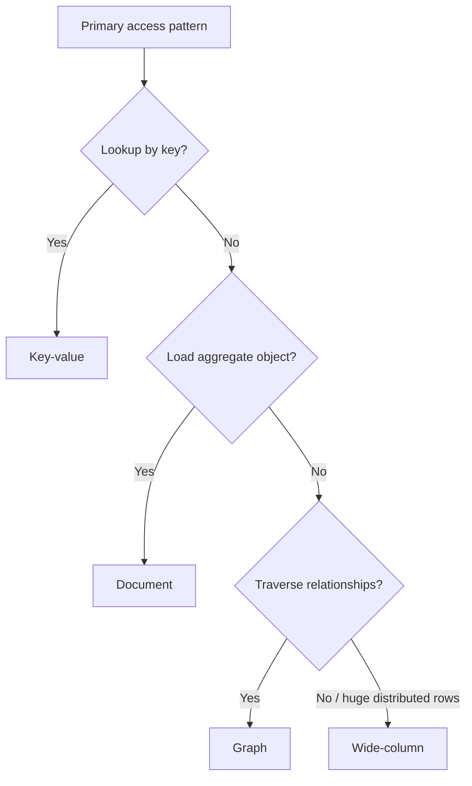
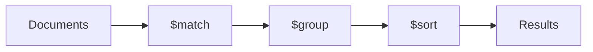
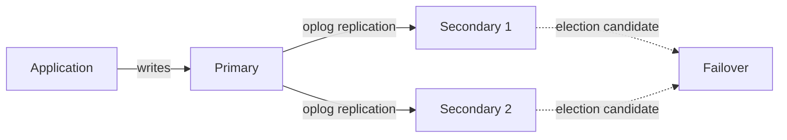
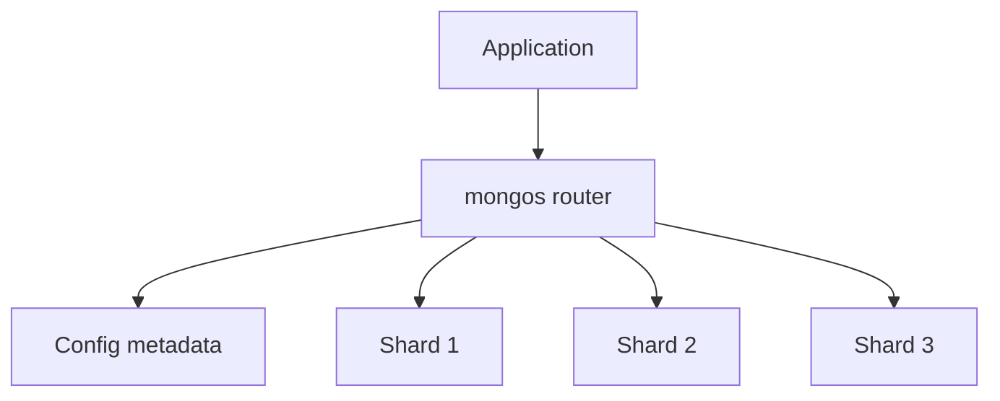
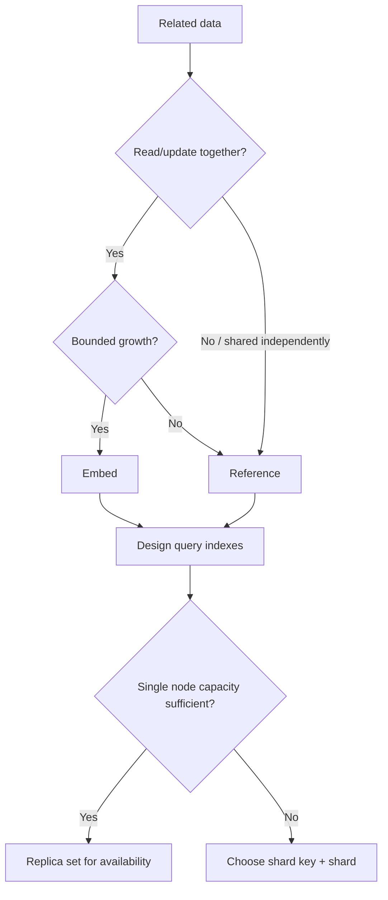

# Caelius Interview Preparation

## NoSQL and MongoDB (Q346-Q360)

For database-choice questions, speak in this order:

```text
Access pattern -> Data relationships -> Consistency needs -> Scale/availability needs -> Operational tradeoffs
```

For MongoDB modeling:

```text
Define document boundary -> Embed or reference -> Query pattern -> Index -> Growth and consistency limits
```

Example workflow document:

```javascript
{
  _id: ObjectId("..."),
  ownerId: "user-42",
  name: "Daily Comment Summary",
  status: "ACTIVE",
  tags: ["youtube", "sentiment"],
  nodes: [
    { id: "n1", type: "webhook", position: { x: 20, y: 40 } },
    { id: "n2", type: "sentiment", position: { x: 240, y: 40 } }
  ],
  createdAt: ISODate("2026-06-15T08:00:00Z")
}
```

---

# Q346. What Is NoSQL? When Should You Use It Over SQL?

## Define

> NoSQL is a broad category of databases that use non-relational or flexible data models such as documents, key-values, wide columns, or graphs.

NoSQL does **not** mean "no queries" or "no schema." It commonly means "not only SQL."

## Use NoSQL When

- Data naturally fits a document, graph, key-value, or wide-column model.
- Access patterns require very high horizontal scale.
- Flexible or rapidly evolving fields are important.
- Low-latency key-based access dominates.
- Denormalized read models are acceptable.
- Availability or geographic distribution requirements favor the chosen system.

## Prefer Relational SQL When

- Data has rich relationships and frequent joins.
- Strong multi-row constraints are central.
- Ad hoc querying and analytics are important.
- Transactions span multiple entities.
- A normalized model naturally represents the domain.

## Example Decision

Workflow definitions can be stored as documents because users often load and save the entire graph together. However, Nodeflowz uses PostgreSQL because ownership, credentials, executions, and graph records benefit from relational integrity and transactions.

## Interview-Ready Answer

> I choose NoSQL based on the access pattern and consistency model, not because the data is "big" or because schema design can be skipped. If relationships and transactional invariants dominate, I prefer an RDBMS. If aggregate documents or horizontally distributed key access dominate, a NoSQL model may be better.

---

# Q347. What Are the Types of NoSQL Databases?

## Main Categories

| Type | Model | Typical use |
|---|---|---|
| Key-value | Key maps to opaque/structured value | Cache, sessions, counters |
| Document | JSON-like documents | Content, catalogs, flexible aggregates |
| Wide-column | Sparse distributed rows grouped by column families | Large-scale event/time-series workloads |
| Graph | Vertices and edges | Relationship traversal, fraud, recommendations |

## Examples

- Key-value: Redis, Amazon DynamoDB in common usage patterns.
- Document: MongoDB, Couchbase.
- Wide-column: Apache Cassandra, HBase.
- Graph: Neo4j, Amazon Neptune.

## Choosing the Type



## Important Nuance

Products can support multiple models. MongoDB has aggregation and lookup features; Redis supports more than simple strings; relational databases can store JSON and graphs through extensions.

## Interview Point

Choose from the dominant access pattern and operational requirements, not only the database category label.

---

# Q348. What Is MongoDB?

## Define

> MongoDB is a document-oriented database that stores BSON documents in collections and supports flexible schemas, indexes, aggregation pipelines, replication, sharding, and transactions.

## Core Concepts

```text
Database -> Collection -> Document -> Fields
```

## Characteristics

- JSON-like document model using BSON.
- Flexible document fields.
- Embedded objects and arrays.
- Rich queries and aggregation pipelines.
- Replica sets for high availability.
- Sharding for horizontal distribution.

## Example Use

A product catalog can store category-specific attributes in the same collection:

```javascript
{ name: "Laptop", ramGb: 32, cpu: "..." }
{ name: "Shirt", size: "M", color: "Blue" }
```

## Important Nuance

Flexible schema does not mean validation is unnecessary. MongoDB supports schema validation, and applications should define document contracts.

## Interview Point

MongoDB is suitable when document aggregates and access patterns align with the document model, not as an automatic replacement for relational databases.

---

# Q349. What Is a Document in MongoDB?

## Define

> A document is MongoDB's primary record unit: a BSON object containing field-value pairs, nested objects, and arrays.

## Example

```javascript
{
  _id: ObjectId("..."),
  name: "Comment Analysis",
  owner: {
    id: "user-42",
    displayName: "Deepa"
  },
  tags: ["youtube", "ml"],
  metrics: {
    positive: 120,
    neutral: 35,
    negative: 18
  }
}
```

## Document Benefits

- Stores related aggregate data together.
- Supports nested structures naturally.
- One document read can return a complete application object.
- Document updates are atomic at the single-document level.

## Limits and Risks

- MongoDB documents have a size limit.
- Unbounded arrays can grow badly.
- Duplicated embedded data can become inconsistent.
- Cross-document relationships need references, transactions, or application logic.

## Embed vs Reference

Embed when data:

- Is owned by the parent.
- Is read together.
- Has bounded growth.

Reference when data:

- Is shared.
- Changes independently.
- Has unbounded cardinality.

## Interview Point

The document boundary is a consistency and access-pattern decision, not merely a way to mirror object classes.

---

# Q350. What Is a Collection in MongoDB?

## Define

> A collection is a named group of MongoDB documents, roughly analogous to a relational table but without requiring every document to have identical fields.

## Example

```javascript
db.workflows.insertMany([
  {
    name: "Daily Summary",
    status: "ACTIVE",
    schedule: "0 9 * * *"
  },
  {
    name: "Manual Review",
    status: "DRAFT",
    reviewConfig: { requiredApprovals: 2 }
  }
]);
```

Both documents can coexist in `workflows` despite different fields.

## Collection Responsibilities

- Groups related documents.
- Owns indexes.
- Can enforce document validation.
- Participates in sharding configuration.

## Schema Validation Example

```javascript
db.createCollection("workflows", {
  validator: {
    $jsonSchema: {
      bsonType: "object",
      required: ["name", "status"],
      properties: {
        name: { bsonType: "string" },
        status: { enum: ["DRAFT", "ACTIVE", "PAUSED"] }
      }
    }
  }
});
```

## Interview Point

Collections permit flexible document shapes, but intentional validation prevents invalid states.

---

# Q351. Difference Between SQL and NoSQL

## Comparison

| SQL / relational | NoSQL |
|---|---|
| Tables and relations | Documents, key-values, graphs, wide columns |
| Schema-first with strong constraints | Often flexible or application-shaped schema |
| Joins and normalization common | Embedding/denormalization common |
| Strong transactional capabilities | Capabilities vary; many support transactions |
| Powerful ad hoc SQL querying | Query APIs vary by product |
| Scale-up and scale-out options | Many designed for horizontal distribution |

## Important Corrections

Avoid outdated absolutes:

- SQL databases can scale horizontally.
- NoSQL databases can support schemas and transactions.
- Relational databases can store JSON.
- NoSQL does not automatically provide better performance.

## Decision Example

Use PostgreSQL for:

- Workflow ownership.
- Credentials.
- Execution records with relational constraints.

Consider MongoDB for:

- Aggregate documents loaded as a whole.
- Flexible product/content records.
- Access patterns aligned with document boundaries.

## Interview Point

The real comparison is between specific products and workloads, not "SQL is rigid" versus "NoSQL is scalable."

---

# Q352. What Is BSON in MongoDB?

## Define

> BSON, or Binary JSON, is MongoDB's binary document representation that extends JSON-like data with additional types and metadata.

## BSON Types

Examples include:

- String.
- Boolean.
- 32-bit and 64-bit integers.
- Double and decimal.
- Date.
- Binary data.
- ObjectId.
- Embedded document.
- Array.
- Regular expression.

## Example

Mongo shell representation:

```javascript
{
  _id: ObjectId("..."),
  createdAt: ISODate("2026-06-15T08:00:00Z"),
  retryCount: NumberInt(3),
  amount: NumberDecimal("19.99")
}
```

Plain JSON does not natively distinguish all these types.

## Why BSON

- Efficient machine parsing.
- Rich type system.
- Supports traversable document fields.

## Tradeoff

BSON can use more storage than compact plain JSON because it includes field names and type/length metadata.

## Interview Point

BSON is a binary, typed document format; the shell displays it in a readable JSON-like form.

---

# Q353. What Is ObjectId in MongoDB?

## Define

> `ObjectId` is MongoDB's common default `_id` value type: a 12-byte identifier designed to be unique across distributed clients and roughly ordered by creation time.

## Properties

- Automatically generated when `_id` is absent.
- Contains a timestamp component.
- Compact compared with many text UUID representations.
- Unique enough for normal distributed generation.

## Example

```javascript
const id = new ObjectId();

db.workflows.findOne({ _id: id });
```

String conversion:

```javascript
id.toString();
```

Timestamp extraction:

```javascript
id.getTimestamp();
```

## Important Nuance

- `_id` can use types other than ObjectId.
- ObjectId's timestamp has limited precision and should not replace a real `createdAt` field when exact business timestamps are needed.
- Convert string IDs to ObjectId before querying an ObjectId field.

## Interview Point

ObjectId is a common MongoDB identifier, but `_id` is the actual required unique key field.

---

# Q354. How Do You Insert a Document in MongoDB?

## Insert One

```javascript
db.workflows.insertOne({
  ownerId: "user-42",
  name: "Daily Summary",
  status: "ACTIVE",
  createdAt: new Date()
});
```

Result includes an inserted ID:

```javascript
{
  acknowledged: true,
  insertedId: ObjectId("...")
}
```

## Insert Many

```javascript
db.workflows.insertMany([
  {
    ownerId: "user-42",
    name: "Daily Summary",
    status: "ACTIVE"
  },
  {
    ownerId: "user-42",
    name: "Failure Alert",
    status: "DRAFT"
  }
]);
```

## Application Example

Node.js MongoDB driver:

```javascript
const result = await workflows.insertOne({
  ownerId,
  name,
  status: "DRAFT",
  createdAt: new Date()
});
```

## Safety and Integrity

- Validate input before insertion.
- Use collection schema validation.
- Create unique indexes for business uniqueness.
- Handle duplicate-key and write errors.
- Decide whether bulk writes should be ordered.

## Interview Point

Flexible documents still require validation, uniqueness rules, and error handling.

---

# Q355. How Do You Query in MongoDB?

## Equality Query

```javascript
db.workflows.find({ ownerId: "user-42" });
```

## Comparison Operators

```javascript
db.executions.find({
  durationMs: { $gte: 1000, $lt: 10000 }
});
```

## Logical Query

```javascript
db.workflows.find({
  ownerId: "user-42",
  status: { $in: ["ACTIVE", "PAUSED"] }
});
```

## Nested Field

```javascript
db.workflows.find({
  "settings.retryCount": { $gt: 0 }
});
```

## Array Query

```javascript
db.workflows.find({
  tags: "sentiment"
});
```

## Projection, Sort, and Limit

```javascript
db.workflows
  .find(
    { ownerId: "user-42" },
    { name: 1, status: 1, createdAt: 1 }
  )
  .sort({ createdAt: -1, _id: -1 })
  .limit(20);
```

## Interview Point

Design indexes from the complete frequent query pattern: filters, sort, projection, and expected selectivity.

---

# Q356. What Is find() vs findOne()?

## `find()`

> `find()` returns a cursor representing all matching documents.

```javascript
const cursor = db.workflows.find({ ownerId: "user-42" });
```

The cursor supports iteration, sorting, limiting, and projection.

## `findOne()`

> `findOne()` returns the first matching document or `null`.

```javascript
const workflow = db.workflows.findOne({ _id: workflowId });
```

## Comparison

| `find()` | `findOne()` |
|---|---|
| Returns cursor | Returns one document or null |
| Multiple matches | Single required match |
| Supports chained cursor operations | Simpler one-document lookup |
| Must iterate/materialize results | Direct result |

## Determinism

If multiple documents match and a particular one is required, define ordering explicitly rather than relying on natural order:

```javascript
db.workflows.find({ ownerId: "user-42" })
  .sort({ createdAt: -1, _id: -1 })
  .limit(1);
```

## Interview Point

Use `findOne()` when one document is semantically expected, ideally through a unique key. Use `find()` for result sets.

---

# Q357. What Is an Aggregation Pipeline in MongoDB?

## Define

> An aggregation pipeline processes documents through ordered stages, where each stage transforms, filters, groups, joins, or reshapes the stream.

## Example

Count executions and average duration per workflow for successful executions:

```javascript
db.executions.aggregate([
  {
    $match: {
      status: "SUCCEEDED",
      startedAt: {
        $gte: ISODate("2026-06-01T00:00:00Z")
      }
    }
  },
  {
    $group: {
      _id: "$workflowId",
      executionCount: { $sum: 1 },
      averageDurationMs: { $avg: "$durationMs" }
    }
  },
  {
    $sort: {
      executionCount: -1
    }
  }
]);
```

## Common Stages

- `$match`: filter.
- `$project`: reshape/select fields.
- `$group`: aggregate.
- `$sort`: order.
- `$limit`: restrict.
- `$unwind`: expand array values.
- `$lookup`: join-like collection lookup.
- `$facet`: run multiple sub-pipelines.

## Pipeline Flow



## Optimization

Put selective `$match` stages early when semantics allow, project away unnecessary fields, and support filters/sorts with indexes.

## Interview Point

Each stage receives documents from the previous stage; stage order changes both semantics and performance.

---

# Q358. What Are Indexes in MongoDB?

## Define

> MongoDB indexes are auxiliary data structures that support efficient query filtering and sorting at the cost of storage and write overhead.

## Single-Field Index

```javascript
db.workflows.createIndex({ ownerId: 1 });
```

## Compound Index

```javascript
db.workflows.createIndex({
  ownerId: 1,
  status: 1,
  createdAt: -1
});
```

This can support queries filtering owner and status, then sorting recent first.

## Other Index Types

- Unique.
- Multikey for arrays.
- Text.
- Geospatial.
- Hashed.
- TTL.
- Partial and sparse.
- Wildcard.

## ESR Guideline

For many compound indexes, consider:

```text
Equality fields -> Sort fields -> Range fields
```

Actual optimal order depends on query shape and selectivity.

## Explain Query

```javascript
db.workflows
  .find({ ownerId: "user-42", status: "ACTIVE" })
  .sort({ createdAt: -1 })
  .explain("executionStats");
```

## Interview Point

MongoDB indexes speed selected reads but slow writes and consume memory/storage. Verify them with real query plans.

---

# Q359. What Is Replication in MongoDB?

## Define

> Replication maintains copies of data on multiple MongoDB servers to improve availability and support failure recovery.

MongoDB commonly uses a replica set:

- One primary accepts writes.
- Secondary members replicate the primary's operation log.
- An election can choose a new primary after failure.

## Diagram



## Read and Write Concerns

- Write concern controls how many acknowledgments are required.
- Read concern controls consistency/visibility guarantees.
- Read preference controls which members can serve reads.

## Tradeoffs

- Replication improves availability and redundancy.
- It does not automatically prevent logical deletion or corruption.
- Stronger acknowledgment and read guarantees can add latency.
- Secondary reads may be stale depending on configuration.

## Interview Point

Replication copies data for availability; it does not partition data for capacity. That is sharding.

---

# Q360. What Is Sharding in MongoDB?

## Define

> Sharding distributes a collection's documents across multiple shards so storage and workload can scale horizontally.

## Components

- Shards store subsets of data.
- Config servers store cluster metadata.
- `mongos` routers direct client operations.
- A shard key determines document distribution and query routing.

## Diagram



## Shard-Key Importance

A good shard key:

- Distributes writes and storage evenly.
- Has enough cardinality.
- Supports common query routing.
- Avoids hot spots.

Poor examples can include monotonically increasing keys when they concentrate new writes on one shard, unless an appropriate strategy mitigates the issue.

## Targeted vs Scatter-Gather Query

- Query containing the shard key can route to relevant shard(s).
- Query without it may need to contact all shards.

## Replication vs Sharding

| Replication | Sharding |
|---|---|
| Copies the same data | Partitions different data |
| Improves availability | Improves horizontal capacity |
| Replica-set election | Shard-key routing and balancing |

Shards are commonly replica sets, combining both capabilities.

## Interview Point

Shard-key choice is a long-term architectural decision driven by query routing, write distribution, and growth.

---

# MongoDB Modeling Decision Guide



# NoSQL and MongoDB Interview Checklist

Before choosing or modeling, ask:

```text
What are the dominant reads and writes?
What must be updated atomically?
Which data is owned versus shared?
Can arrays or documents grow without bound?
What consistency and staleness are acceptable?
Which query requires which compound index?
How will schema validation be enforced?
What failure does replication handle?
What workload requires sharding?
Does the shard key distribute load and support routing?
```

# NoSQL and MongoDB Revision Sheet

| Question | Core answer |
|---|---|
| NoSQL | Non-relational/flexible database models chosen by workload |
| NoSQL types | Key-value, document, wide-column, graph |
| MongoDB | BSON document database with querying, aggregation, replication, sharding |
| Document | BSON record and atomic aggregate boundary |
| Collection | Named group of related documents |
| SQL vs NoSQL | Relational constraints/joins vs varied workload-shaped models |
| BSON | Binary typed JSON-like format |
| ObjectId | Common 12-byte default `_id` type |
| Insert | `insertOne` / `insertMany` with validation |
| Query | Filter documents with operators and projections |
| find vs findOne | Cursor/result set vs one document |
| Aggregation pipeline | Ordered document-processing stages |
| Indexes | Query access structures with write/storage cost |
| Replication | Copy data for availability |
| Sharding | Partition data for horizontal capacity |

## Common Interview Mistakes

- Choosing NoSQL only because data volume is large.
- Saying NoSQL has no schema or transactions.
- Embedding shared or unbounded data without considering growth.
- Treating ObjectId as the only possible `_id` type.
- Querying an ObjectId field with an unconverted string.
- Ignoring projection, sort, and indexes in query design.
- Treating aggregation stage order as irrelevant.
- Adding indexes without considering write costs.
- Confusing replication with sharding.
- Choosing a shard key without analyzing routing and hot spots.
