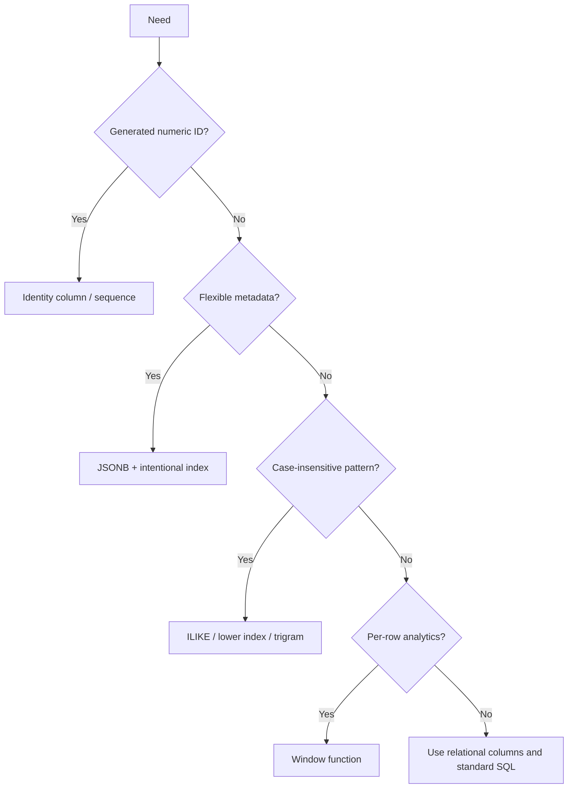

# Caelius Interview Preparation

## PostgreSQL (Q361-Q370)

For PostgreSQL-specific questions, explain:

```text
Define feature -> Show PostgreSQL syntax -> Explain why it matters -> Compare alternatives -> Connect to project
```

Example tables:

```sql
CREATE TABLE workflow (
    id         BIGINT GENERATED ALWAYS AS IDENTITY PRIMARY KEY,
    owner_id   UUID NOT NULL,
    name       TEXT NOT NULL,
    metadata   JSONB NOT NULL DEFAULT '{}'::JSONB,
    created_at TIMESTAMPTZ NOT NULL DEFAULT CURRENT_TIMESTAMP
);

CREATE TABLE workflow_execution (
    id          BIGINT GENERATED ALWAYS AS IDENTITY PRIMARY KEY,
    workflow_id BIGINT NOT NULL REFERENCES workflow(id),
    status      TEXT NOT NULL,
    duration_ms BIGINT,
    started_at  TIMESTAMPTZ NOT NULL DEFAULT CURRENT_TIMESTAMP
);
```

---

# Q361. What Is PostgreSQL?

## Define

> PostgreSQL is an open-source object-relational database management system known for standards-oriented SQL, strong transactions, extensibility, and advanced data types and query features.

## Important Capabilities

- ACID transactions and MVCC.
- Rich SQL, joins, CTEs, and window functions.
- Constraints and referential integrity.
- JSON and JSONB.
- Arrays, ranges, enums, and custom types.
- Full-text search.
- Extensible indexes and extensions.
- Stored functions, procedures, and triggers.
- Replication and partitioning capabilities.

## Why It Is Used

PostgreSQL works well when an application needs relational integrity while also benefiting from flexible data types and advanced querying.

## Real Project Connection

> Nodeflowz uses PostgreSQL through Prisma. It is a strong fit because users, workflows, nodes, connections, credentials, and execution records have structured relationships and need transactional consistency.

## Interview Point

PostgreSQL is not merely a basic SQL store; it combines relational rigor with extensibility and advanced data features.

---

# Q362. Difference Between PostgreSQL and MySQL

## Comparison

| PostgreSQL | MySQL |
|---|---|
| Object-relational, highly extensible | Relational database with broad adoption |
| Strong advanced SQL feature set | Strong common web/application workload support |
| Rich custom types, operators, extensions | Simpler operational familiarity for many teams |
| JSONB and extensible indexing | JSON support and multiple storage-engine history |
| Often chosen for complex queries/data models | Often chosen for common transactional web workloads |

## Important Nuance

Both support:

- ACID transactions with appropriate engines/configuration.
- Replication.
- JSON.
- Indexes.
- Window functions and CTEs in modern versions.

Differences depend on exact versions, configuration, workload, tooling, and team expertise.

## PostgreSQL Strength Examples

- PostGIS spatial extension.
- Rich JSONB operators and GIN indexes.
- Range types.
- Extensible operator classes.
- Strong standards-oriented SQL behavior.

## Choosing

> I would compare the workload, operational environment, query complexity, extensions, cloud support, and team expertise. I would not claim one is universally faster.

## Interview Point

Compare specific features and workload needs instead of repeating outdated generalizations.

---

# Q363. What Is a Sequence in PostgreSQL?

## Define

> A sequence is a database object that generates numeric values, commonly used for surrogate identifiers.

## Create and Use

```sql
CREATE SEQUENCE workflow_number_seq
START WITH 1000
INCREMENT BY 1;
```

Get the next value:

```sql
SELECT nextval('workflow_number_seq');
```

Get the most recently obtained value in the current session:

```sql
SELECT currval('workflow_number_seq');
```

Set a value:

```sql
SELECT setval('workflow_number_seq', 5000);
```

## Important Behavior

Sequence values are designed for concurrency, not gap-free numbering:

- Rolled-back transactions do not necessarily return used values.
- Cached values can create gaps after restart.
- Concurrent sessions safely obtain distinct values.

## Example Default

```sql
CREATE TABLE workflow (
    id BIGINT PRIMARY KEY DEFAULT nextval('workflow_number_seq'),
    name TEXT NOT NULL
);
```

## Interview Point

Sequences provide unique numeric generation efficiently, but should not be used when legal or business numbering must be gap-free.

---

# Q364. What Is the SERIAL Data Type?

## Define

> `SERIAL` is PostgreSQL shorthand that creates an integer column, an associated sequence, and a default calling `nextval()` on that sequence.

## Example

```sql
CREATE TABLE workflow (
    id SERIAL PRIMARY KEY,
    name TEXT NOT NULL
);
```

Conceptually, PostgreSQL creates:

```text
integer column
owned sequence
DEFAULT nextval(sequence)
```

Variants:

- `SMALLSERIAL`
- `SERIAL`
- `BIGSERIAL`

## Modern Alternative: Identity Columns

```sql
CREATE TABLE workflow (
    id BIGINT GENERATED ALWAYS AS IDENTITY PRIMARY KEY,
    name TEXT NOT NULL
);
```

Or:

```sql
id BIGINT GENERATED BY DEFAULT AS IDENTITY
```

Identity columns follow the SQL standard more closely and make generation behavior more explicit.

## Important Clarification

`SERIAL` is not a true data type; the column's actual type is integer/bigint, with sequence-backed default behavior.

## Interview Point

For new PostgreSQL schemas, I generally prefer identity columns while understanding `SERIAL` because it remains common in existing systems.

---

# Q365. What Are Schemas in PostgreSQL?

## Define

> A PostgreSQL schema is a named namespace inside a database that organizes objects such as tables, views, functions, and types.

## Example

```sql
CREATE SCHEMA analytics;

CREATE TABLE analytics.daily_execution_metrics (
    metric_date DATE PRIMARY KEY,
    execution_count BIGINT NOT NULL
);
```

Reference with a qualified name:

```sql
SELECT *
FROM analytics.daily_execution_metrics;
```

## Benefits

- Organize objects by domain or application.
- Avoid naming conflicts.
- Apply permissions at a namespace level.
- Separate internal, public, and reporting objects.

## Search Path

PostgreSQL uses `search_path` to resolve unqualified object names:

```sql
SHOW search_path;
SET search_path TO analytics, public;
```

## Security Consideration

Carelessly trusting writable schemas in `search_path` can allow object-shadowing risks. Production systems should qualify sensitive object references and manage schema permissions.

## Schema vs Database

- Database: larger isolated container with separate connections.
- Schema: namespace within one PostgreSQL database.

## Interview Point

PostgreSQL schemas organize and secure objects inside a database; they are not the same as the overall database design definition.

---

# Q366. What Is the RETURNING Clause in PostgreSQL?

## Define

> `RETURNING` returns values from rows modified by `INSERT`, `UPDATE`, `DELETE`, or `MERGE`, avoiding a separate follow-up query.

## INSERT RETURNING

```sql
INSERT INTO workflow (owner_id, name)
VALUES (:owner_id, 'Daily Summary')
RETURNING id, created_at;
```

## UPDATE RETURNING

```sql
UPDATE workflow_execution
SET status = 'SUCCEEDED'
WHERE id = :execution_id
RETURNING id, status, duration_ms;
```

## DELETE RETURNING

```sql
DELETE FROM workflow
WHERE id = :workflow_id
RETURNING id, name;
```

## Why It Matters

- Reduces client-server round trips.
- Returns generated IDs/default values.
- Returns the exact rows modified.
- Supports atomic modification-and-read patterns.

## Concurrency Benefit

A separate select after an update can observe later changes from another transaction. `RETURNING` reports values from the modification itself.

## Interview Point

`RETURNING` is a concise PostgreSQL feature for retrieving generated or changed values directly from a write statement.

---

# Q367. What Is ILIKE in PostgreSQL?

## Define

> `ILIKE` is PostgreSQL's case-insensitive pattern-matching operator.

Like `LIKE`, it uses:

- `%` for zero or more characters.
- `_` for exactly one character.

## Examples

```sql
SELECT *
FROM workflow
WHERE name ILIKE 'daily%';
```

```sql
SELECT *
FROM app_user
WHERE email ILIKE '%@example.com';
```

## LIKE vs ILIKE

```text
LIKE  -> case-sensitive according to collation behavior
ILIKE -> case-insensitive according to locale/collation behavior
```

## Indexing Consideration

A regular B-tree index may not help arbitrary `ILIKE` patterns, especially with a leading wildcard.

For normalized equality:

```sql
CREATE INDEX idx_user_lower_email
ON app_user (LOWER(email));

SELECT *
FROM app_user
WHERE LOWER(email) = LOWER(:email);
```

For substring search, PostgreSQL's trigram extension can help:

```sql
CREATE EXTENSION IF NOT EXISTS pg_trgm;

CREATE INDEX idx_workflow_name_trgm
ON workflow USING GIN (name gin_trgm_ops);
```

## Interview Point

`ILIKE` is convenient for case-insensitive patterns, but index strategy depends on the pattern shape.

---

# Q368. What Is a JSON/JSONB Column?

## Define

PostgreSQL supports:

- `JSON`: stores validated JSON text.
- `JSONB`: stores parsed binary JSON optimized for querying and indexing.

## Comparison

| JSON | JSONB |
|---|---|
| Preserves input text formatting/key order | Normalizes parsed representation |
| Faster raw input in some cases | Faster field access and processing |
| Limited indexing | Rich GIN and expression indexing |
| Retains duplicate keys in text | Keeps one effective value per duplicate key |

## Example

```sql
CREATE TABLE workflow (
    id       BIGINT GENERATED ALWAYS AS IDENTITY PRIMARY KEY,
    name     TEXT NOT NULL,
    metadata JSONB NOT NULL DEFAULT '{}'::JSONB
);
```

Insert:

```sql
INSERT INTO workflow (name, metadata)
VALUES (
    'Comment Alert',
    '{"priority":"high","tags":["youtube","sentiment"]}'::JSONB
);
```

Query:

```sql
SELECT *
FROM workflow
WHERE metadata @> '{"priority":"high"}'::JSONB;
```

Index:

```sql
CREATE INDEX idx_workflow_metadata_gin
ON workflow USING GIN (metadata);
```

## Modeling Guidance

Use relational columns for stable, constrained, frequently joined fields. Use JSONB for flexible metadata whose query patterns and validation are intentionally designed.

## Real Project Connection

> A workflow's variable node configuration can fit JSONB, while workflow ownership, IDs, and execution relationships remain relational. This hybrid approach keeps flexible configuration without giving up core constraints.

## Interview Point

JSONB is powerful, but it should not become an excuse to avoid relational modeling.

---

# Q369. What Are Window Functions in PostgreSQL?

## Define

> A window function calculates a value across a related set of rows while preserving each input row in the result.

Unlike `GROUP BY`, window functions do not collapse rows.

## Example

```sql
SELECT
    workflow_id,
    id AS execution_id,
    duration_ms,
    AVG(duration_ms) OVER (
        PARTITION BY workflow_id
    ) AS workflow_average_duration
FROM workflow_execution;
```

Each execution row remains visible while also showing its workflow's average.

## Window Components

```text
OVER (
    PARTITION BY ...
    ORDER BY ...
    ROWS/RANGE frame ...
)
```

## Running Total

```sql
SELECT
    workflow_id,
    started_at,
    duration_ms,
    SUM(duration_ms) OVER (
        PARTITION BY workflow_id
        ORDER BY started_at, id
        ROWS BETWEEN UNBOUNDED PRECEDING AND CURRENT ROW
    ) AS cumulative_duration
FROM workflow_execution;
```

## Common Window Functions

- `ROW_NUMBER`, `RANK`, `DENSE_RANK`.
- `LAG`, `LEAD`.
- `FIRST_VALUE`, `LAST_VALUE`.
- Aggregates such as `SUM`, `AVG`, and `COUNT` with `OVER`.

## Interview Point

Use window functions when you need group-level or neighboring-row calculations without losing row-level detail.

---

# Q370. What Are ROW_NUMBER(), RANK(), and DENSE_RANK()?

## Define

All three assign ordering numbers within a window, but they handle ties differently.

## Example Query

```sql
SELECT
    workflow_id,
    id,
    duration_ms,
    ROW_NUMBER() OVER (
        PARTITION BY workflow_id
        ORDER BY duration_ms DESC, id
    ) AS row_number,
    RANK() OVER (
        PARTITION BY workflow_id
        ORDER BY duration_ms DESC
    ) AS rank,
    DENSE_RANK() OVER (
        PARTITION BY workflow_id
        ORDER BY duration_ms DESC
    ) AS dense_rank
FROM workflow_execution;
```

## Tie Example

For ordered values:

```text
100, 90, 90, 80
```

| Value | ROW_NUMBER | RANK | DENSE_RANK |
|---:|---:|---:|---:|
| 100 | 1 | 1 | 1 |
| 90 | 2 | 2 | 2 |
| 90 | 3 | 2 | 2 |
| 80 | 4 | 4 | 3 |

## Use Cases

- `ROW_NUMBER`: exactly one unique position per row; deduplication and exact top N rows.
- `RANK`: competition ranking with gaps after ties.
- `DENSE_RANK`: ranking distinct values without gaps.

## Determinism

`ROW_NUMBER` should use a deterministic tie-breaker such as primary key when stable results matter:

```sql
ORDER BY duration_ms DESC, id
```

## Interview Point

Clarify whether ties should share rank and whether gaps are expected before choosing the function.

---

# PostgreSQL Feature Decision Guide



# PostgreSQL Interview Checklist

Before recommending a feature, ask:

```text
Is the behavior PostgreSQL-specific?
Would identity be clearer than SERIAL?
Can sequence gaps occur?
Which schema/search_path resolves the object?
Can RETURNING remove a round trip?
What pattern must ILIKE support?
Should data be relational columns or JSONB?
Which JSONB operator needs which index?
Does the window require partitioning, ordering, or an explicit frame?
How should ranking ties behave?
```

# PostgreSQL Revision Sheet

| Question | Core answer |
|---|---|
| PostgreSQL | Extensible open-source object-relational DBMS |
| PostgreSQL vs MySQL | Compare specific workload/features, not absolutes |
| Sequence | Concurrent numeric-value generator |
| SERIAL | Sequence-backed integer-column shorthand |
| Schemas | Namespaces inside a PostgreSQL database |
| RETURNING | Return rows/values directly from writes |
| ILIKE | Case-insensitive pattern matching |
| JSON/JSONB | Text JSON vs parsed/indexable binary JSON |
| Window functions | Cross-row calculations without collapsing rows |
| Ranking functions | Unique positions vs tied ranks with/without gaps |

## Common Interview Mistakes

- Claiming PostgreSQL is universally better or faster than MySQL.
- Expecting sequence values to be gap-free.
- Calling `SERIAL` a true standalone data type.
- Confusing PostgreSQL schemas with databases.
- Running an extra select when `RETURNING` can provide changed values.
- Assuming `ILIKE '%text%'` uses a normal B-tree efficiently.
- Storing all application data in JSONB.
- Confusing window functions with `GROUP BY`.
- Using ranking functions without defining tie behavior.
- Omitting deterministic tie-breakers for `ROW_NUMBER`.
