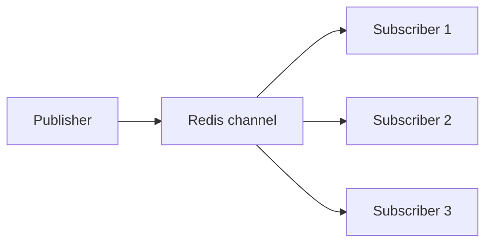
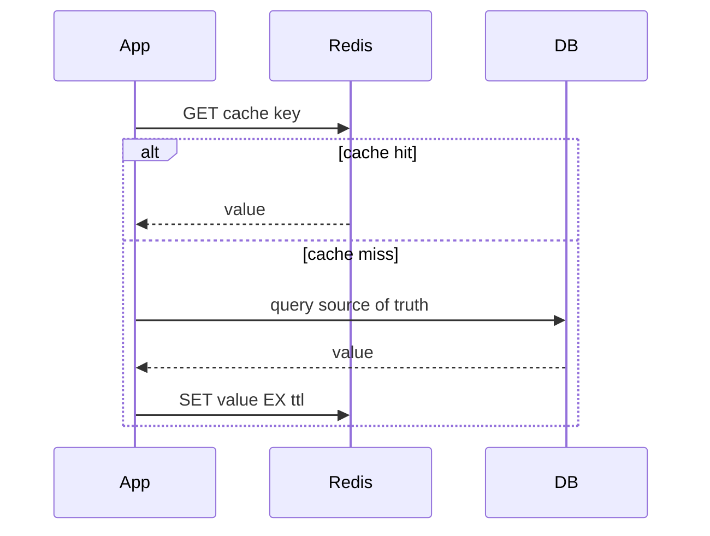
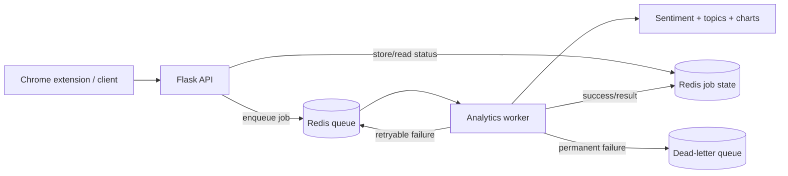
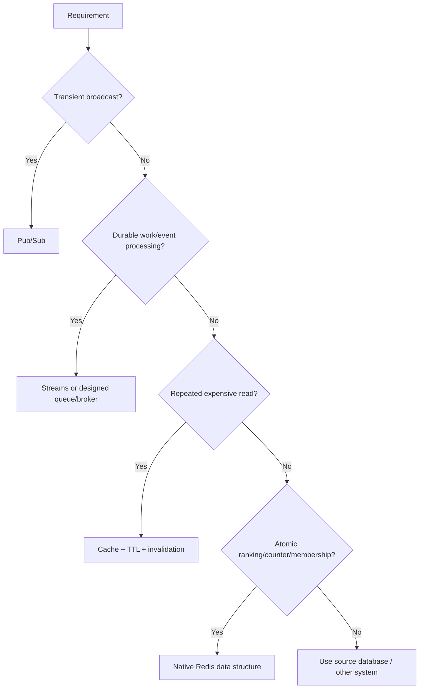

# Caelius Interview Preparation

## Redis (Q371-Q380)

For Redis questions, speak in this order:

```text
Workload -> Redis data structure -> Atomic operation -> Expiry/persistence -> Failure behavior -> Production tradeoff
```

For project questions:

```text
Problem -> Why Redis -> Exact architecture -> Reliability behavior -> Limitation -> Improvement
```

---

# Q371. What Is Redis?

## Define

> Redis is an in-memory data-structure server commonly used for caching, queues, counters, sessions, rate limiting, pub/sub, streams, and other low-latency workloads.

Redis stores keys mapped to typed values and provides atomic commands over those data structures.

## Example Commands

```text
SET user:42:name "Deepa"
GET user:42:name

INCR api:requests:2026-06-15

LPUSH analytics:jobs '{"jobId":"j-101"}'
BRPOP analytics:jobs 5
```

## Important Capabilities

- In-memory access.
- Strings, hashes, lists, sets, sorted sets, streams, and more.
- Key expiration.
- Atomic commands and server-side scripts.
- Replication and high-availability options.
- Persistence options.
- Cluster-based horizontal scaling.

## Important Nuance

Redis is often called an in-memory database, but it can persist data. Its durability and consistency depend on configuration and architecture.

## Real Project Connection

> CommentPulse uses Redis in scaled mode as shared infrastructure between the Flask API and a separate analytics worker. The API submits heavy jobs, Redis stores queue/job state, and the worker processes jobs with retries and dead-letter handling.

## Interview Point

Redis is more than a cache; choose it when its data structures and low-latency atomic operations fit the workload.

---

# Q372. What Makes Redis Fast?

## Main Reasons

### In-Memory Data Access

Most active data is served from RAM, avoiding disk seek latency on the request path.

### Efficient Data Structures

Redis implements optimized structures and commands such as:

- Hash lookup.
- List push/pop.
- Set membership.
- Sorted-set ranking.
- Atomic counters.

### Event-Driven Command Processing

Redis traditionally executes commands primarily through a single-threaded command path, reducing lock contention and synchronization overhead. Modern Redis versions may use additional threads for I/O and background work.

### Simple Protocol

RESP is lightweight and efficient to parse.

### Pipelining

Clients can send multiple commands before waiting for replies, reducing network round trips.

```text
Without pipeline: request -> response -> request -> response
With pipeline:    requests together -> responses together
```

## Important Limits

- Network latency can dominate small commands.
- Long-running commands can block other work.
- Large keys and unbounded structures hurt latency.
- Persistence, replication, and durability settings add cost.

## Interview Point

Redis is fast because of in-memory operations and efficient command execution, but production latency still depends on command complexity, network, data size, and durability configuration.

---

# Q373. What Data Structures Does Redis Support?

## Core Structures

| Structure | Example use |
|---|---|
| String | Cache value, counter, lock token |
| Hash | Object-like fields |
| List | Simple queue/deque |
| Set | Unique membership |
| Sorted set | Leaderboard, priority/time ordering |
| Stream | Durable event/message log with consumer groups |
| Bitmap | Compact boolean flags |
| HyperLogLog | Approximate unique count |
| Geospatial | Location-radius queries |

## Examples

### String Counter

```text
INCR rate:user-42
EXPIRE rate:user-42 60
```

### Hash

```text
HSET job:j-101 status QUEUED attempts 0
HGETALL job:j-101
```

### List Queue

```text
LPUSH analytics:queue '{"jobId":"j-101"}'
BRPOP analytics:queue 5
```

### Sorted-Set Scheduling

```text
ZADD retry:schedule 1718448000 j-101
ZRANGEBYSCORE retry:schedule -inf 1718448000
```

### Stream

```text
XADD analytics:stream * jobId j-101 type topic-analysis
```

## Interview Point

Do not serialize every use case into a plain string. Choose the Redis structure whose atomic operations match the requirement.

---

# Q374. What Is Redis Used for in Production?

## Common Uses

### Cache

Store expensive query or computation results:

```text
cache:workflow:42
```

### Session Store

Share sessions across stateless application instances.

### Rate Limiting

Use atomic counters and expirations.

### Queue and Background Jobs

Decouple APIs from slow processing.

### Pub/Sub and Event Delivery

Broadcast ephemeral messages to active subscribers.

### Streams

Support durable event consumption and consumer groups.

### Counters and Leaderboards

Use atomic increments and sorted sets.

### Distributed Coordination

Locks, idempotency keys, and deduplication, when carefully implemented.

## Production Questions

Before using Redis, define:

- What happens if data is lost?
- Is stale data acceptable?
- What durability is required?
- Can the operation be retried?
- Is memory bounded?
- How are hot keys handled?
- Is Redis the source of truth?

## Interview Point

Redis is best used for a clearly defined low-latency role with explicit failure and durability behavior.

---

# Q375. What Is a Redis Key Expiry (TTL)?

## Define

> TTL, or time to live, is the remaining duration before Redis automatically expires and removes a key.

## Commands

```text
SET verification:token:abc "user-42" EX 600

TTL verification:token:abc

EXPIRE cache:workflow:42 300

PERSIST cache:workflow:42
```

## Common Uses

- Cache entries.
- Sessions.
- Verification tokens.
- Rate-limit windows.
- Idempotency records.
- Temporary job results.

## Expiration Behavior

Redis removes expired keys through:

- Lazy expiration when accessed.
- Active background expiration sampling.

A key may not be physically removed at the exact millisecond its TTL reaches zero, but it is treated as expired.

## Atomic Set With Expiry

Prefer one atomic command:

```text
SET cache:key value EX 300
```

instead of separate `SET` and `EXPIRE`, which could leave a non-expiring key if the client fails between commands.

## Important Cautions

- Updating a key may preserve or remove TTL depending on command/options.
- TTL should include jitter for large cache populations to reduce synchronized expiry spikes.
- Expiration is not a durable scheduling guarantee.

## Interview Point

TTL bounds data lifetime and memory use, but expiration semantics must match the workload.

---

# Q376. What Is Pub/Sub in Redis?

## Define

> Redis Pub/Sub provides ephemeral one-to-many message broadcasting: publishers send messages to channels, and currently connected subscribers receive them.

## Commands

Subscriber:

```text
SUBSCRIBE execution:status
```

Publisher:

```text
PUBLISH execution:status '{"id":"j-101","status":"SUCCEEDED"}'
```

## Flow



## Characteristics

- Low-latency broadcast.
- No message history.
- No acknowledgment.
- Disconnected subscribers miss messages.
- Subscribers should not assume delivery.

## Pub/Sub vs Queue/Streams

| Pub/Sub | Queue / Redis Streams |
|---|---|
| Broadcast to active subscribers | Work/event consumption |
| Ephemeral | Can retain messages |
| No acknowledgment | Can support acknowledgment |
| Missed when disconnected | Consumers can resume depending on design |

## Interview Point

Use Pub/Sub for transient notifications, not for work that must be processed reliably.

---

# Q377. What Is a Redis Caching Strategy?

## Define

> A caching strategy defines how data enters the cache, how reads and writes interact with the source of truth, and how stale or missing data is handled.

## Cache-Aside

The application manages the cache:

```text
1. Read cache.
2. On miss, read database.
3. Store result with TTL.
4. Return result.
```



## Other Strategies

- Read-through: cache layer loads missing data.
- Write-through: update cache and source synchronously.
- Write-behind/write-back: cache accepts writes and persists later.
- Refresh-ahead: refresh before expiry.

## Cache-Key Design

Include identity and version/context:

```text
workflow:v2:owner:user-42:id:99
```

## Reliability Techniques

- TTL with jitter.
- Request coalescing/single-flight to prevent stampede.
- Negative caching for safe misses.
- Memory limits and eviction policy.
- Metrics for hit rate, latency, and stale data.

## Interview Point

Caching improves performance only when invalidation, source-of-truth ownership, and failure behavior are designed together.

---

# Q378. What Is Cache Invalidation?

## Define

> Cache invalidation is the process of removing or updating cached data when it may no longer match the source of truth.

## Common Approaches

### TTL-Based Expiration

Simple and bounds staleness, but stale values remain until expiry.

### Explicit Invalidation

After updating the database:

```text
DEL cache:workflow:42
```

The next read repopulates it.

### Update Cache on Write

Write-through-like behavior keeps cache fresh but adds coupling and failure cases.

### Versioned Keys

Use a new version prefix after schema or semantic changes:

```text
workflow:v3:42
```

## Race Example

```text
Reader misses cache and reads old database value.
Writer updates database and deletes cache.
Reader stores old value after deletion.
```

Solutions may include short TTLs, version tokens, write ordering, event-based invalidation, or avoiding caching highly contentious data.

## Famous Difficulty

The hard part is not deleting a key; it is ensuring correctness across concurrent reads, writes, failures, and multiple cache entries derived from the same source data.

## Interview Point

State the acceptable staleness and source of truth before choosing an invalidation strategy.

---

# Q379. Redis vs Memcached

## Comparison

| Redis | Memcached |
|---|---|
| Rich data structures | Primarily simple key-value cache |
| Optional persistence | In-memory cache only |
| Replication, clustering, streams, pub/sub | Simpler distributed caching |
| Atomic structure-specific operations | Basic get/set/increment operations |
| More features and operational choices | Simpler operational model |

## Use Redis When

- Need hashes, lists, sets, sorted sets, or streams.
- Need counters, queues, pub/sub, or coordination.
- Need optional persistence or richer high-availability options.

## Use Memcached When

- Need a straightforward ephemeral distributed cache.
- Simple key-value semantics are sufficient.
- Operational simplicity and multi-threaded cache throughput fit the workload.

## Important Nuance

Performance depends on value sizes, concurrency, clients, network, and deployment. Do not claim one is universally faster.

## Interview Point

Memcached is focused on simple caching; Redis is a broader data-structure platform that can also cache.

---

# Q380. How Did You Use Redis in the CommentPulse Project?

## Problem

Heavy analytics such as topic extraction, word clouds, sentiment trends, and local insights can take longer than a user-facing HTTP request should wait.

## Why Redis

> I used Redis to decouple the Flask API from heavy analytics execution. Redis provides a simple shared queue and job-state store that both the API and a separate worker process can access.

## Architecture



## Exact Flow

1. The API accepts a heavy analytics request.
2. It creates a job message and stores initial queued state.
3. It pushes the message to a Redis-backed queue.
4. A separate worker pops and processes the job.
5. The worker updates job status and result.
6. Retryable failures are requeued up to a bounded attempt count.
7. Permanently failed jobs move to a dead-letter queue.

Conceptual queue operations:

```python
client.rpush(queue_name, json.dumps(message))

message = client.blpop(queue_name, timeout=5)

client.rpush(dead_letter_queue_name, json.dumps(message))
```

## Result

- The API remains responsive while analytics runs asynchronously.
- API and worker workloads can be separated.
- Job state is shared across processes.
- Retries and dead-letter handling make failure behavior explicit.
- A local in-process fallback keeps development simple without Redis.

## Honest Limitations

- A simple list-backed queue does not provide every durability and acknowledgment guarantee of a specialized broker or Redis Streams.
- Production improvements include stronger load testing, queue dashboards, and UI-based dead-letter replay.

## Interview-Ready Answer

> In CommentPulse, I use Redis in the scaled deployment mode as a queue and shared job-state store between the Flask API and a separate analytics worker. Heavy jobs are submitted asynchronously, processed with bounded retries, and moved to a dead-letter queue after permanent failure. I also kept an in-process fallback for local development. The tradeoff is that the Redis architecture improves separation and recovery but adds deployment and operational complexity.

---

# Redis Production Decision Guide



# Redis Interview Checklist

Before using Redis, ask:

```text
Is Redis a cache, queue, coordination store, or source of truth?
Which native data structure matches the operation?
What durability and delivery guarantees are required?
Can messages or cached values be lost?
What happens when Redis is unavailable?
How is memory bounded?
What TTL and invalidation strategy is used?
Can hot keys or cache stampedes occur?
Are retries idempotent?
How are failed jobs observed and replayed?
```

# Redis Revision Sheet

| Question | Core answer |
|---|---|
| Redis | In-memory data-structure server |
| Why fast | RAM, efficient structures, event-driven execution, pipelining |
| Data structures | Strings, hashes, lists, sets, sorted sets, streams, more |
| Production uses | Cache, sessions, queues, rate limits, counters, coordination |
| TTL | Automatic key expiry |
| Pub/Sub | Ephemeral broadcast to active subscribers |
| Caching strategy | Defined read/write/source-of-truth interaction |
| Cache invalidation | Remove/update stale cached values |
| Redis vs Memcached | Rich platform vs simple cache |
| CommentPulse usage | Queue + shared job state + worker + retries + dead letter |

## Common Interview Mistakes

- Calling Redis only a cache.
- Saying Redis is fast only because it is single-threaded.
- Using strings when a native atomic data structure fits better.
- Treating Pub/Sub as reliable queued delivery.
- Setting cache values without TTL or invalidation strategy.
- Ignoring stampedes, hot keys, and memory limits.
- Treating replication as backup.
- Assuming queue retries are safe without idempotency.
- Overstating a simple Redis-list queue's delivery guarantees.
