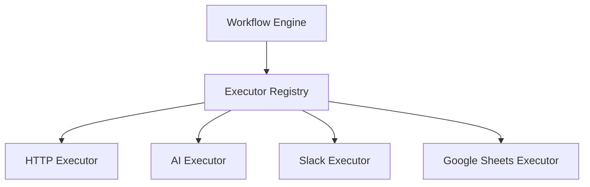
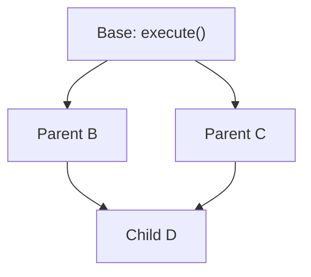
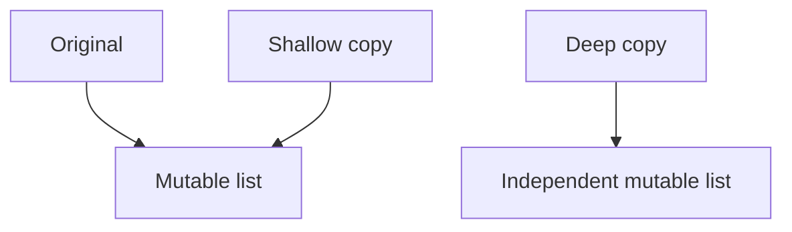
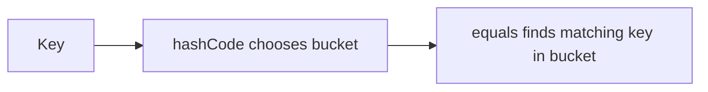
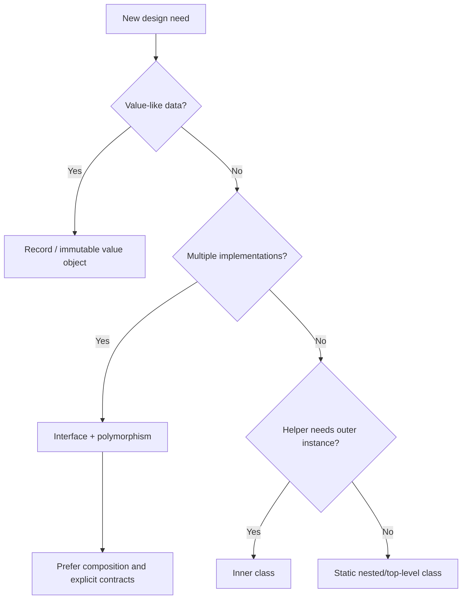

# Caelius Interview Preparation

## OOPs Deep Dive (Q381-Q400)

For OOP concept questions, speak in this order:

```text
One-line definition -> Simple Java example -> Design reason -> Real project connection
```

The goal is not to recite terminology. Explain how the concept protects change, correctness, or maintainability.

---

# Q381. Explain OOPs With a Real Project Example From Your Resume

## Define

> Object-Oriented Programming organizes software around objects that combine state and behavior behind clear contracts.

The four common pillars are:

- Encapsulation.
- Abstraction.
- Inheritance.
- Polymorphism.

## Real Project Example: Nodeflowz Executor Registry

Nodeflowz contains multiple workflow node types such as HTTP, AI, Slack, Discord, and Google Sheets actions. Each node requires different execution logic, but the workflow engine needs one consistent way to invoke them.

Conceptually:

```java
public interface NodeExecutor {
    ExecutionContext execute(NodeData data, ExecutionContext context);
}

public final class HttpNodeExecutor implements NodeExecutor {
    @Override
    public ExecutionContext execute(
            NodeData data,
            ExecutionContext context) {
        // Perform an HTTP request and add result to context.
        return context;
    }
}

public final class SlackNodeExecutor implements NodeExecutor {
    @Override
    public ExecutionContext execute(
            NodeData data,
            ExecutionContext context) {
        // Send a Slack message.
        return context;
    }
}
```

## OOP Mapping

| Principle | Project interpretation |
|---|---|
| Encapsulation | Each executor owns provider-specific behavior |
| Abstraction | Workflow engine invokes a common executor contract |
| Polymorphism | Different executors respond to the same execute operation |
| Composition | Workflow engine uses executor objects rather than becoming every executor |

## Architecture



## Interview-Ready Answer

> In Nodeflowz, every workflow node type has specialized execution behavior, but the workflow engine interacts through a common executor contract. That is abstraction and polymorphism. Each executor encapsulates provider-specific details, and the engine composes those executors through a registry. This keeps the central workflow runner stable when new node types are added.

---

# Q382. What Is a Class vs Object?

## Define

> A class is a blueprint defining state and behavior. An object is a runtime instance of that class with its own identity and state.

## Example

```java
public final class Workflow {
    private final long id;
    private String name;

    public Workflow(long id, String name) {
        this.id = id;
        this.name = name;
    }

    public void rename(String newName) {
        name = newName;
    }
}
```

Create objects:

```java
Workflow dailySummary = new Workflow(1, "Daily Summary");
Workflow failureAlert = new Workflow(2, "Failure Alert");
```

- `Workflow` is the class.
- `dailySummary` and `failureAlert` reference separate objects.
- Each object has independent state.

## Class Members

A class can define:

- Fields.
- Constructors.
- Methods.
- Nested types.
- Static members shared at class level.

## Interview Point

A reference variable is not the object itself; it stores a reference to an object or `null`.

---

# Q383. What Is a Constructor? Types of Constructors?

## Define

> A constructor initializes a new object and establishes its valid starting state. It has the class name and no return type.

## No-Argument Constructor

```java
public final class RetryPolicy {
    private int maxAttempts;

    public RetryPolicy() {
        maxAttempts = 3;
    }
}
```

## Parameterized Constructor

```java
public RetryPolicy(int maxAttempts) {
    if (maxAttempts < 1) {
        throw new IllegalArgumentException("Attempts must be positive");
    }
    this.maxAttempts = maxAttempts;
}
```

## Copy Constructor Pattern

```java
public RetryPolicy(RetryPolicy source) {
    this.maxAttempts = source.maxAttempts;
}
```

Java does not have a special copy-constructor language feature; it is a normal constructor taking another object.

## Default Constructor

If a class declares no constructor, the compiler supplies a default no-argument constructor. Once any constructor is declared, that automatic constructor is not supplied.

## Interview Point

Constructors should establish invariants so invalid objects are not created.

---

# Q384. What Is Constructor Chaining?

## Define

> Constructor chaining is when one constructor invokes another constructor to reuse initialization logic.

## Same-Class Chaining With `this()`

```java
public final class RetryPolicy {
    private final int maxAttempts;
    private final long delayMs;

    public RetryPolicy() {
        this(3, 1_000);
    }

    public RetryPolicy(int maxAttempts) {
        this(maxAttempts, 1_000);
    }

    public RetryPolicy(int maxAttempts, long delayMs) {
        if (maxAttempts < 1 || delayMs < 0) {
            throw new IllegalArgumentException("Invalid retry policy");
        }
        this.maxAttempts = maxAttempts;
        this.delayMs = delayMs;
    }
}
```

## Parent Chaining With `super()`

```java
public class IntegrationException extends RuntimeException {
    public IntegrationException(String message, Throwable cause) {
        super(message, cause);
    }
}
```

## Rules

- `this(...)` or `super(...)` must be the first constructor statement.
- A constructor cannot call both directly.
- Chaining cycles are illegal.
- If no explicit parent constructor call appears, Java inserts `super()` when possible.

## Interview Point

Constructor chaining centralizes validation and initialization instead of duplicating it across overloads.

---

# Q385. What Is a Copy Constructor?

## Define

> A copy constructor is a constructor that creates a new object from an existing object of the same or related type.

## Example

```java
public final class WorkflowConfig {
    private final String name;
    private final List<String> tags;

    public WorkflowConfig(String name, List<String> tags) {
        this.name = name;
        this.tags = List.copyOf(tags);
    }

    public WorkflowConfig(WorkflowConfig source) {
        this(source.name, source.tags);
    }
}
```

The constructor creates an independent immutable copy of the tags list using `List.copyOf`.

## Benefits Over `clone()`

- Explicit and type-safe.
- Can validate input.
- Can perform deep or defensive copying deliberately.
- Can copy from an interface or subtype.
- Does not rely on `Cloneable`'s unusual mechanism.

## Copy Factory Alternative

```java
public static WorkflowConfig copyOf(WorkflowConfig source) {
    return new WorkflowConfig(source);
}
```

## Interview Point

State whether the copy is shallow or deep for every referenced mutable field.

---

# Q386. What Is a Method Signature?

## Define

> In Java, a method signature consists of the method name and parameter types in order.

## Example

```java
void execute(String workflowId)
void execute(String workflowId, boolean dryRun)
void execute(long workflowId)
```

These have different signatures.

## Not Part of the Signature

The following do not distinguish overloaded methods:

- Return type.
- Parameter names.
- `throws` clause.
- Access modifier.

Invalid:

```java
int find(String id)
String find(String id) // Same signature; return type alone differs.
```

## Override Context

An overriding method uses the same signature as the inherited method, subject to Java's overriding rules and possible covariant return type.

## Interview Point

For overloading, Java selects methods using the name and compile-time parameter types, not the return type.

---

# Q387. Can We Have Two Methods With the Same Name and Same Parameters?

## Answer

> Not in the same class when their signatures are identical. Changing only the return type, access modifier, parameter names, or `throws` clause does not create a valid overload.

## Invalid Example

```java
public int status(String workflowId) {
    return 1;
}

public String status(String workflowId) {
    return "RUNNING";
}
```

The compiler cannot choose based on the expected return type in a reliable, general way.

## Valid Override

A subclass can declare a method with the same signature to override inherited behavior:

```java
public class BaseExecutor {
    public String execute(String input) {
        return input;
    }
}

public class HttpExecutor extends BaseExecutor {
    @Override
    public String execute(String input) {
        return "HTTP: " + input;
    }
}
```

## Valid Overload

```java
public String execute(String input)
public String execute(String input, boolean dryRun)
```

## Interview Point

Same signature in one class is duplicate declaration; same signature in a subclass can be overriding.

---

# Q388. What Is the Diamond Problem?

## Define

> The diamond problem is ambiguity that can occur with multiple inheritance when a class inherits the same method implementation through two different parent paths.

## Shape



If both parents provide different `execute()` implementations, which one should the child inherit?

## Why It Is Difficult

Multiple class inheritance can create:

- Method-resolution ambiguity.
- Duplicate inherited state.
- Complex constructor order.
- Fragile inheritance hierarchies.

## Java Position

Java does not allow a class to extend multiple classes:

```java
// Illegal:
class D extends B, C {}
```

Java allows multiple interfaces, with explicit rules for conflicting default methods.

## Interview Point

The diamond problem is primarily about ambiguous inherited implementation, not merely implementing multiple interfaces.

---

# Q389. How Does Java Solve the Diamond Problem?

## Class Inheritance

Java prevents the classic class diamond by allowing a class to extend only one class.

## Interface Default-Method Conflict

If two interfaces provide the same default method, the implementing class must resolve the conflict explicitly:

```java
interface SlackNotifier {
    default String channel() {
        return "slack";
    }
}

interface EmailNotifier {
    default String channel() {
        return "email";
    }
}

final class AlertNotifier implements SlackNotifier, EmailNotifier {
    @Override
    public String channel() {
        return SlackNotifier.super.channel()
            + "+"
            + EmailNotifier.super.channel();
    }
}
```

## Resolution Rules

1. Class methods win over interface default methods.
2. A more specific interface wins over a less specific parent interface.
3. Unrelated conflicting defaults require an explicit override.

## Interview Point

Java avoids multiple class implementation inheritance and requires explicit resolution for ambiguous interface defaults.

---

# Q390. What Is Covariant Return Type?

## Define

> A covariant return type allows an overriding method to return a more specific reference type than the method declared in the parent.

## Example

```java
class ExecutionResult {
}

class HttpExecutionResult extends ExecutionResult {
}

class Executor {
    public ExecutionResult execute() {
        return new ExecutionResult();
    }
}

class HttpExecutor extends Executor {
    @Override
    public HttpExecutionResult execute() {
        return new HttpExecutionResult();
    }
}
```

`HttpExecutionResult` is a subtype of `ExecutionResult`, so the override is valid.

## Benefit

Callers using the subtype can receive a specific result without casting:

```java
HttpExecutionResult result = new HttpExecutor().execute();
```

## Limitation

Covariant returns apply to reference types, not unrelated return types or primitive-type changes.

## Interview Point

The parameter signature remains the same; only the overridden return type becomes more specific.

---

# Q391. What Is an Inner Class?

## Define

> An inner class is a non-static nested class declared inside another class and associated with an instance of the enclosing class.

## Example

```java
public final class Workflow {
    private final String id;

    public Workflow(String id) {
        this.id = id;
    }

    public final class Execution {
        public String description() {
            return "Execution for workflow " + id;
        }
    }
}
```

Create it:

```java
Workflow workflow = new Workflow("wf-42");
Workflow.Execution execution = workflow.new Execution();
```

## Key Property

The inner-class object holds an implicit reference to its enclosing `Workflow` instance and can access its private members.

## Use Cases

- Helper behavior tightly coupled to one outer instance.
- Iterators.
- Event handlers.

## Caution

The implicit outer reference can increase coupling or accidentally retain the outer object. Prefer a static nested class when outer-instance access is unnecessary.

---

# Q392. What Are the Types of Inner Classes in Java?

## Common Nested-Class Categories

### Member Inner Class

A non-static class declared at class level:

```java
class Outer {
    class Inner {
    }
}
```

### Local Inner Class

Declared inside a method or block:

```java
void process() {
    class LocalValidator {
    }
}
```

### Anonymous Inner Class

Unnamed class declared and instantiated in one expression:

```java
Runnable task = new Runnable() {
    @Override
    public void run() {
        System.out.println("Running");
    }
};
```

### Static Nested Class

Declared with `static`:

```java
class Outer {
    static class Nested {
    }
}
```

Technically, a static nested class is nested but not an inner class because it has no implicit enclosing instance.

## Selection Guide

| Type | Use |
|---|---|
| Member inner | Needs enclosing object state |
| Local inner | Helper scoped to one method |
| Anonymous | One-off implementation |
| Static nested | Related helper without outer-instance access |

## Interview Point

Clarify that static nested classes are commonly listed with nested-class types but are not technically inner classes.

---

# Q393. What Is an Anonymous Class?

## Define

> An anonymous class is an unnamed class declared and instantiated at the same time for a one-off implementation or subclass.

## Example

```java
Comparator<String> byLength = new Comparator<>() {
    @Override
    public int compare(String first, String second) {
        return Integer.compare(first.length(), second.length());
    }
};
```

## Lambda Alternative

Because `Comparator` is a functional interface:

```java
Comparator<String> byLength =
    (first, second) -> Integer.compare(first.length(), second.length());
```

## When Anonymous Classes Still Help

- Need to override multiple methods.
- Need fields or initializer behavior in the one-off class.
- Extending an abstract/concrete class.
- Need an object with behavior beyond one functional method.

## Limitations

- No explicit constructor.
- Can become unreadable when large.
- Creates a distinct anonymous class.

## Interview Point

Use lambdas for concise functional-interface behavior; use anonymous classes when a richer one-off class body is required.

---

# Q394. What Is an Enum in Java?

## Define

> An enum is a type representing a fixed set of named instances.

## Basic Example

```java
public enum ExecutionStatus {
    QUEUED,
    RUNNING,
    SUCCEEDED,
    FAILED,
    DEAD_LETTER
}
```

## Enum With State and Behavior

```java
public enum ExecutionStatus {
    QUEUED(false),
    RUNNING(false),
    SUCCEEDED(true),
    FAILED(true),
    DEAD_LETTER(true);

    private final boolean terminal;

    ExecutionStatus(boolean terminal) {
        this.terminal = terminal;
    }

    public boolean isTerminal() {
        return terminal;
    }
}
```

## Benefits

- Type-safe fixed values.
- Can define fields, methods, and constructors.
- Works naturally with `switch`.
- Prevents arbitrary invalid strings.

## Persistence Caution

When storing enums, prefer stable names or explicit codes over ordinal positions. Reordering enum constants changes ordinals.

## Real Project Connection

> CommentPulse job states such as queued, running, succeeded, failed, and dead-letter naturally form an enum-like finite state model.

## Interview Point

Enums are full classes with a controlled fixed instance set, not just integer constants.

---

# Q395. What Is a Record in Java?

## Define

> A Java record is a concise class form for transparent, shallowly immutable data carriers.

## Example

```java
public record ExecutionRequest(
        String workflowId,
        String userId,
        boolean dryRun) {

    public ExecutionRequest {
        Objects.requireNonNull(workflowId);
        Objects.requireNonNull(userId);
    }
}
```

The compiler provides:

- Private final component fields.
- Accessor methods named after components.
- Canonical constructor.
- `equals()`.
- `hashCode()`.
- `toString()`.

## Shallow Immutability

```java
public record WorkflowData(List<String> tags) {
    public WorkflowData {
        tags = List.copyOf(tags);
    }
}
```

Without defensive copying, the final reference could still point to a mutable list.

## Limitations

- Records implicitly extend `java.lang.Record` and cannot extend another class.
- They can implement interfaces.
- They are intended for value-like data, not mutable identity-rich entities.

## Interview Point

A record reduces data-carrier boilerplate but does not automatically make mutable component objects deeply immutable.

---

# Q396. What Is Immutability? How Do You Create an Immutable Class?

## Define

> An immutable object's observable state cannot change after construction.

## Immutable-Class Rules

- Make the class final or prevent unsafe subclassing.
- Make fields private and final.
- Initialize all state in the constructor.
- Provide no mutating methods.
- Validate constructor input.
- Defensively copy mutable inputs and outputs.

## Example

```java
public final class WorkflowSnapshot {
    private final String id;
    private final List<String> nodeIds;
    private final Map<String, String> metadata;

    public WorkflowSnapshot(
            String id,
            List<String> nodeIds,
            Map<String, String> metadata) {
        this.id = Objects.requireNonNull(id);
        this.nodeIds = List.copyOf(nodeIds);
        this.metadata = Map.copyOf(metadata);
    }

    public String id() {
        return id;
    }

    public List<String> nodeIds() {
        return nodeIds;
    }

    public Map<String, String> metadata() {
        return metadata;
    }
}
```

## Benefits

- Easier reasoning.
- Naturally safer sharing between threads.
- Reliable map/set keys when equality is stable.
- No accidental state changes.

## Important Nuance

`final` prevents reference reassignment; it does not freeze the referenced object.

## Interview Point

Immutability requires controlling the complete reachable mutable state, not only declaring fields `final`.

---

# Q397. Difference Between Deep Copy and Shallow Copy

## Define

> A shallow copy creates a new outer object while sharing referenced nested objects. A deep copy recursively creates independent copies of mutable nested state.

## Example

```java
public final class Workflow {
    String name;
    List<String> nodes;
}
```

### Shallow Copy

```java
Workflow copy = new Workflow();
copy.name = original.name;
copy.nodes = original.nodes;
```

Both objects reference the same node list.

### Deeper Copy

```java
Workflow copy = new Workflow();
copy.name = original.name;
copy.nodes = new ArrayList<>(original.nodes);
```

The list is independent, though its element objects would still be shared if mutable.

## Diagram



## Tradeoff

- Shallow copies are faster and cheaper but share mutation.
- Deep copies isolate state but cost more and need explicit semantics for cycles/shared references.

## Interview Point

Deep versus shallow is about the full object graph, not just whether the top-level object is new.

---

# Q398. What Is Object Cloning in Java?

## Define

> Object cloning creates another object based on an existing object's field state, traditionally using `Object.clone()`.

## Traditional Example

```java
public class RetryPolicy implements Cloneable {
    private int maxAttempts;

    @Override
    public RetryPolicy clone() {
        try {
            return (RetryPolicy) super.clone();
        } catch (CloneNotSupportedException exception) {
            throw new AssertionError(exception);
        }
    }
}
```

## Important Behavior

`Object.clone()` performs a field-by-field shallow copy:

- Primitive fields are copied.
- References are copied, so nested mutable objects are shared unless manually copied.
- Constructors are not called in the normal way.

## Why It Is Often Avoided

- Unusual checked-exception and marker-interface mechanism.
- Shallow-copy surprises.
- Inheritance complicates correct cloning.
- Constructors/factories are clearer and more controllable.

## Preferred Alternatives

- Copy constructor.
- Static copy factory.
- Immutable value objects.
- Explicit mapping method.

## Interview Point

Cloning is available, but explicit copying is usually safer and clearer in modern Java.

---

# Q399. What Is the Cloneable Interface?

## Define

> `Cloneable` is a marker interface indicating that `Object.clone()` may make a field-for-field copy of an object instead of throwing `CloneNotSupportedException`.

## Marker Behavior

`Cloneable` declares no methods:

```java
public interface Cloneable {
}
```

`clone()` is defined as protected in `Object`, so a class normally exposes it by overriding with public visibility.

## Example

```java
public final class Point implements Cloneable {
    private int x;
    private int y;

    @Override
    public Point clone() {
        try {
            return (Point) super.clone();
        } catch (CloneNotSupportedException exception) {
            throw new AssertionError(exception);
        }
    }
}
```

## Important Limitations

- `Cloneable` does not define a public cloning contract.
- It does not guarantee deep copying.
- It does not specify how subclass fields should be handled.
- Arrays support cloning directly.

## Interview Point

`Cloneable` only changes `Object.clone()` behavior; it does not provide a complete, type-safe copying abstraction.

---

# Q400. What Is the equals() and hashCode() Contract?

## `equals()` Contract

For non-null references:

- Reflexive: `x.equals(x)` is true.
- Symmetric: `x.equals(y)` equals `y.equals(x)`.
- Transitive: if `x` equals `y` and `y` equals `z`, then `x` equals `z`.
- Consistent: repeated calls stay consistent while relevant state is unchanged.
- Non-null: `x.equals(null)` is false.

## `hashCode()` Contract

- Equal objects must have equal hash codes.
- Repeated calls must be consistent while equality state is unchanged.
- Unequal objects may have equal hash codes.

## Example

```java
public final class WorkflowKey {
    private final String ownerId;
    private final String workflowName;

    public WorkflowKey(String ownerId, String workflowName) {
        this.ownerId = ownerId;
        this.workflowName = workflowName;
    }

    @Override
    public boolean equals(Object other) {
        if (this == other) {
            return true;
        }
        if (!(other instanceof WorkflowKey that)) {
            return false;
        }
        return Objects.equals(ownerId, that.ownerId)
            && Objects.equals(workflowName, that.workflowName);
    }

    @Override
    public int hashCode() {
        return Objects.hash(ownerId, workflowName);
    }
}
```

## Hash-Based Collection Behavior



## Mutability Warning

Do not mutate fields used by `equals()` and `hashCode()` while an object is stored as a `HashMap` key or `HashSet` member. It may become unreachable in the expected bucket.

## Interview Point

`hashCode()` narrows the search bucket; `equals()` confirms logical equality. Equal objects must always produce equal hash codes.

---

# OOP Design Decision Guide



# OOP Deep Dive Interview Checklist

Before answering, ask:

```text
Is this identity-based or value-based?
What state must be protected?
What is the public contract?
Does inheritance genuinely model substitutability?
Can composition reduce coupling?
Is copying shallow or deep?
Are nested mutable values defensively copied?
Do equals and hashCode use stable fields?
Would a record or enum express the concept better?
Is this a real project example or only a proposed design?
```

# OOP Deep Dive Revision Sheet

| Question | Core answer |
|---|---|
| OOP project example | Common contract with encapsulated polymorphic implementations |
| Class vs object | Blueprint vs runtime instance |
| Constructor | Establishes initial valid object state |
| Constructor chaining | Reuse initialization through `this`/`super` |
| Copy constructor | Explicit constructor copying another object |
| Method signature | Name plus ordered parameter types |
| Same name/parameters | Duplicate in class; override in subclass |
| Diamond problem | Ambiguous inherited implementation |
| Java diamond solution | Single class inheritance + explicit default resolution |
| Covariant return | Override returns a more specific reference type |
| Inner class | Non-static nested class tied to outer instance |
| Inner-class types | Member, local, anonymous; static nested is distinct |
| Anonymous class | One-off unnamed implementation/subclass |
| Enum | Fixed set of type-safe instances |
| Record | Concise shallowly immutable data carrier |
| Immutability | Observable state cannot change after construction |
| Deep vs shallow copy | Independent nested state vs shared references |
| Object cloning | Traditional field-copy mechanism through `clone()` |
| Cloneable | Marker enabling `Object.clone()` behavior |
| equals/hashCode contract | Logical equality plus compatible hashing |

## Common Interview Mistakes

- Describing OOP only as classes and objects.
- Using inheritance where composition is clearer.
- Saying constructors have a return type.
- Treating copy constructors as a special Java language feature.
- Including return type in a Java method signature.
- Saying Java has no diamond issue at all despite interface defaults.
- Calling a static nested class an inner class without qualification.
- Assuming records are deeply immutable.
- Calling `final` references immutable objects.
- Assuming `Object.clone()` creates a deep copy.
- Overriding `equals()` without compatible `hashCode()`.
