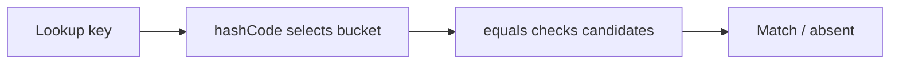
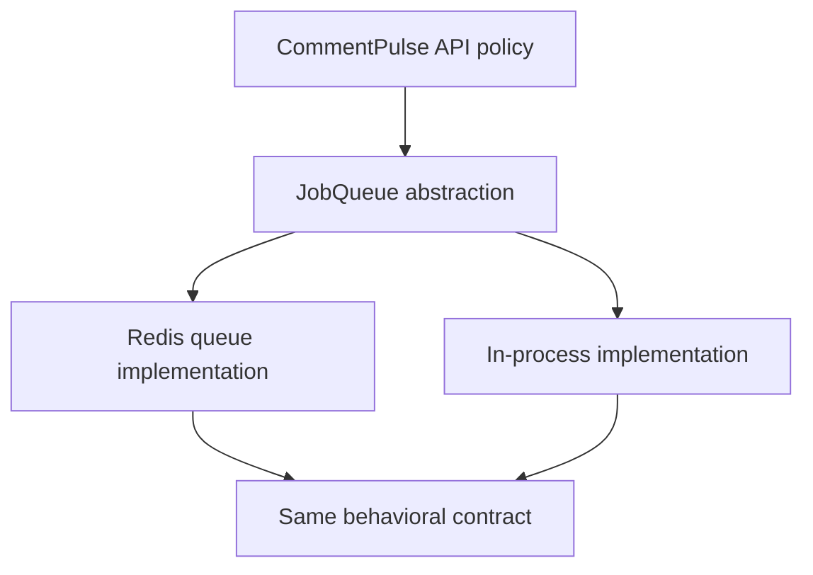
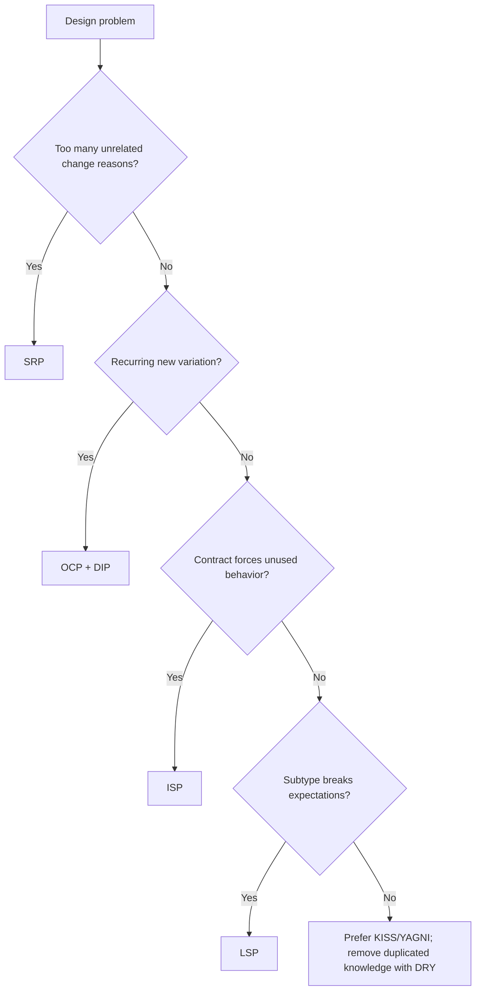

# Caelius Interview Preparation

## OOP and SOLID Principles (Q401-Q410)

For design-principle questions, speak in this order:

```text
One-line principle -> Violation -> Improved design -> Tradeoff -> Project connection
```

Design principles are guidelines, not laws. Apply them when they reduce real change risk, coupling, or confusion.

---

# Q401. Why Must You Override hashCode() When You Override equals()?

## Define

> Equal objects must produce the same hash code. If `equals()` is overridden without a compatible `hashCode()`, hash-based collections may place logically equal objects in different buckets.

## Broken Example

```java
public final class WorkflowKey {
    private final String ownerId;
    private final String workflowName;

    public WorkflowKey(String ownerId, String workflowName) {
        this.ownerId = ownerId;
        this.workflowName = workflowName;
    }

    @Override
    public boolean equals(Object other) {
        if (this == other) {
            return true;
        }
        if (!(other instanceof WorkflowKey that)) {
            return false;
        }
        return Objects.equals(ownerId, that.ownerId)
            && Objects.equals(workflowName, that.workflowName);
    }
}
```

Two equal `WorkflowKey` objects still inherit identity-based hash codes from `Object`, so this can fail:

```java
Set<WorkflowKey> keys = new HashSet<>();
keys.add(new WorkflowKey("user-1", "Daily Summary"));

boolean found = keys.contains(
    new WorkflowKey("user-1", "Daily Summary")
);
```

## Correct Implementation

```java
@Override
public int hashCode() {
    return Objects.hash(ownerId, workflowName);
}
```

## How a Hash Collection Looks Up a Key



## Important Rules

- Equal objects must have equal hash codes.
- Unequal objects may collide.
- Use the same stable fields in both methods.
- Do not mutate equality fields while used as map/set keys.

## Interview Point

`hashCode()` chooses where to search; `equals()` confirms the match. Violating their contract breaks hash-based lookup behavior.

---

# Q402. What Is the Liskov Substitution Principle?

## Define

> The Liskov Substitution Principle, or LSP, says a subtype must be usable wherever its base type is expected without breaking the base type's promised behavior.

## Violation Example

```java
public interface JobQueue {
    void submit(Job job);
    Job take();
}

public final class ReadOnlyJobQueue implements JobQueue {
    @Override
    public void submit(Job job) {
        throw new UnsupportedOperationException();
    }

    @Override
    public Job take() {
        return null;
    }
}
```

If callers expect every `JobQueue` to accept jobs, `ReadOnlyJobQueue` violates that contract.

## Better Design

Split contracts:

```java
public interface JobSubmitter {
    void submit(Job job);
}

public interface JobConsumer {
    Job take();
}
```

## Behavioral Requirements

Subtypes should not:

- Strengthen preconditions unexpectedly.
- Weaken promised postconditions.
- Break invariants.
- Throw unsupported-operation errors for required behavior.
- Change semantics callers rely upon.

## Project Connection

> CommentPulse keeps local in-process execution and Redis-backed worker execution behind a common job interface. For substitution to be valid, both implementations must honor the same submit/status/failure contract even though their deployment behavior differs.

## Interview Point

Inheritance is correct only when the subtype preserves the behavioral contract, not merely when code can be reused.

---

# Q403. What Is the Open/Closed Principle?

## Define

> The Open/Closed Principle says software entities should be open for extension but closed for modification: new behavior should often be addable without repeatedly changing stable core logic.

## Violation

```java
public void execute(Node node) {
    if (node.type() == NodeType.HTTP) {
        executeHttp(node);
    } else if (node.type() == NodeType.SLACK) {
        executeSlack(node);
    } else if (node.type() == NodeType.GEMINI) {
        executeGemini(node);
    }
}
```

Every new node type modifies the central method.

## Improved Design

```java
public interface NodeExecutor {
    ExecutionContext execute(Node node, ExecutionContext context);
}

public final class ExecutorRegistry {
    private final Map<NodeType, NodeExecutor> executors;

    public ExecutorRegistry(Map<NodeType, NodeExecutor> executors) {
        this.executors = Map.copyOf(executors);
    }

    public NodeExecutor executorFor(NodeType type) {
        NodeExecutor executor = executors.get(type);
        if (executor == null) {
            throw new IllegalArgumentException(
                "Unsupported node type: " + type
            );
        }
        return executor;
    }
}
```

Add a new executor implementation and register it without rewriting execution orchestration.

## Project Connection

> Nodeflowz's executor registry reflects this idea. The workflow runner stays stable while provider-specific node executors can be added or changed independently.

## Tradeoff

Do not create extension abstractions for hypothetical variation. Open/closed design is valuable around real, recurring change points.

## Interview Point

Closed for modification does not mean code is never edited; it means stable behavior is protected from every new variation.

---

# Q404. What Is the Single Responsibility Principle?

## Define

> The Single Responsibility Principle, or SRP, says a module should have one focused responsibility and therefore one primary reason to change.

## Violation

```java
public final class AnalyticsService {
    public Report analyze(List<String> comments) {
        // Preprocess text.
        // Run sentiment model.
        // Generate charts.
        // Save files.
        // Send email.
        // Update job state.
        return new Report();
    }
}
```

This class changes for ML, visualization, persistence, notification, and job-lifecycle reasons.

## Improved Responsibilities

```java
public interface SentimentAnalyzer {
    SentimentResult analyze(List<String> comments);
}

public interface ReportRenderer {
    Report render(SentimentResult result);
}

public interface JobStateStore {
    void markSucceeded(String jobId, Report report);
}
```

## Project Connection

> AcadAI uses specialized stages such as reasoning, tutor generation, critique, and grounding checks. Each stage has a distinct responsibility, which makes the controlled pipeline easier to evaluate and improve.

## Important Nuance

SRP does not mean every class has one method. It means its behavior coheres around one responsibility and change reason.

## Interview Point

Ask, "Which stakeholder or requirement change would cause this module to change?" Too many unrelated answers indicate mixed responsibility.

---

# Q405. What Is the Interface Segregation Principle?

## Define

> The Interface Segregation Principle, or ISP, says clients should not be forced to depend on methods they do not use.

## Violation

```java
public interface Integration {
    void sendMessage(String message);
    void appendSpreadsheetRow(List<String> row);
    HttpResponse makeHttpRequest(HttpRequest request);
}
```

A Slack integration must implement unrelated spreadsheet and HTTP methods.

## Improved Design

```java
public interface MessageSender {
    void sendMessage(String message);
}

public interface SpreadsheetAppender {
    void appendRow(List<String> row);
}

public interface HttpCaller {
    HttpResponse execute(HttpRequest request);
}
```

Implementations depend only on relevant capabilities.

## Benefits

- Smaller, clearer contracts.
- Easier testing and mocking.
- Fewer unsupported operations.
- Lower coupling between unrelated clients.

## Project Connection

> Nodeflowz has node executors with specialized provider behavior. A capability-focused contract is cleaner than forcing every executor to expose methods for all integration types.

## Interview Point

Prefer cohesive client-specific interfaces over one large "god interface."

---

# Q406. What Is the Dependency Inversion Principle?

## Define

> The Dependency Inversion Principle, or DIP, says high-level policy should not depend directly on low-level implementation details; both should depend on abstractions.

## Violation

```java
public final class AnalyticsApi {
    private final RedisJobQueue queue = new RedisJobQueue();

    public void submit(Job job) {
        queue.submit(job);
    }
}
```

The API is tightly coupled to Redis and difficult to run without it.

## Improved Design

```java
public interface JobQueue {
    void submit(Job job);
}

public final class AnalyticsApi {
    private final JobQueue queue;

    public AnalyticsApi(JobQueue queue) {
        this.queue = queue;
    }

    public void submit(Job job) {
        queue.submit(job);
    }
}
```

Implementations:

```java
public final class RedisJobQueue implements JobQueue {
    @Override
    public void submit(Job job) {
        // Push to Redis.
    }
}

public final class InProcessJobQueue implements JobQueue {
    @Override
    public void submit(Job job) {
        // Submit locally.
    }
}
```

## Project Connection

> CommentPulse keeps an in-process executor and a Redis-backed worker path behind a common job interface. That gives the API a stable dependency while allowing local and scaled deployment implementations.

## Dependency Injection

Constructor injection is one way to supply an abstraction's implementation. Dependency injection supports DIP, but the principle is about dependency direction, not a framework.

## Interview Point

High-level business flow should own the abstraction; infrastructure implementations plug into it.

---

# Q407. What Is SOLID?

## Define

> SOLID is a set of five object-oriented design principles that help software remain understandable and adaptable as requirements change.

## The Five Principles

| Letter | Principle | Core question |
|---|---|---|
| S | Single Responsibility | Does this module have one focused reason to change? |
| O | Open/Closed | Can likely variation be extended without destabilizing core logic? |
| L | Liskov Substitution | Can every subtype safely replace its base type? |
| I | Interface Segregation | Are clients forced to depend only on relevant methods? |
| D | Dependency Inversion | Does policy depend on abstractions instead of infrastructure details? |

## Connected Project Example



- SRP: API submission and worker analytics have separate responsibilities.
- OCP: another queue implementation can be added.
- LSP: queue implementations must honor the same behavior.
- ISP: the API depends only on submission operations it needs.
- DIP: API policy depends on a queue abstraction.

## Tradeoff

Over-applying SOLID can produce excessive interfaces and indirection. Apply it around meaningful variation and complex responsibilities.

## Interview Point

SOLID is valuable because it directs dependencies and responsibilities toward safer change, not because every class must mechanically satisfy a checklist.

---

# Q408. What Is the DRY Principle?

## Define

> DRY, or Don't Repeat Yourself, says each important piece of knowledge or business rule should have one authoritative representation.

## Harmful Duplication

```java
if (attempts >= 3) {
    moveToDeadLetter(job);
}
```

If the retry limit is repeated independently across API, worker, tests, and dashboards, those copies can drift.

## Better Design

```java
public record RetryPolicy(int maxAttempts) {
    public RetryPolicy {
        if (maxAttempts < 1) {
            throw new IllegalArgumentException();
        }
    }

    public boolean exhausted(int attempts) {
        return attempts >= maxAttempts;
    }
}
```

## What DRY Does Not Mean

Similar-looking code is not always the same knowledge. Prematurely combining unrelated behavior can create a misleading abstraction.

## Rule of Three

Small duplication can be clearer until a stable common concept appears. Abstract when duplication represents the same reason to change.

## Project Connection

> In Nodeflowz, a shared executor lookup mechanism avoids repeating node-type selection logic throughout workflow execution. Provider-specific behavior remains separate because it represents different knowledge.

## Interview Point

DRY targets duplicated knowledge, not every repeated line of code.

---

# Q409. What Is the KISS Principle?

## Define

> KISS, or Keep It Simple, encourages choosing the simplest design that correctly satisfies current requirements and remains understandable.

## Example

For a straightforward background analytics lifecycle:

```text
submit -> queued -> running -> succeeded/failed -> retry/dead-letter
```

A simple Redis-backed worker can be appropriate. Introducing a complex distributed orchestration platform may add more operational burden than value if jobs do not require durable multi-step workflows.

## Project Connection

> CommentPulse uses a simpler Redis queue and worker for analytics jobs because the lifecycle is submit, process, poll, retry, and dead-letter. Nodeflowz uses Inngest because workflow nodes require richer durable step orchestration. KISS means matching complexity to the problem, not always choosing the smallest technology.

## Practical KISS Questions

- Can one clear module solve this?
- Is this abstraction hiding or adding complexity?
- Can a standard library feature replace custom infrastructure?
- Will another engineer understand failure behavior?

## Important Nuance

Simple does not mean naive, insecure, or untested. Reliability requirements are part of the necessary design.

## Interview Point

The simplest correct design is context-dependent; removing necessary reliability is not simplicity.

---

# Q410. What Is the YAGNI Principle?

## Define

> YAGNI, or You Aren't Gonna Need It, says do not build speculative features or abstractions before there is a real requirement.

## Example

Suppose the current workflow executor runs nodes sequentially and no measured workload requires parallel branch execution.

Premature work might include:

- Distributed branch scheduler.
- Complex dependency-aware concurrency limits.
- Cross-region execution coordination.
- Dynamic worker autoscaling logic.

Those may be useful later, but building them now adds risk without validated value.

## Better Approach

1. Keep interfaces that do not block likely evolution.
2. Implement the current requirement simply.
3. Instrument performance and failure behavior.
4. Add complexity when evidence justifies it.

## Project Connection

> Nodeflowz currently executes sorted nodes sequentially, which is deterministic and simple. Parallel execution of independent branches is a valid future improvement, but implementing it should follow a measured need and a clear concurrency model.

## YAGNI vs Extensibility

YAGNI does not mean designing carelessly. It means avoiding implementation of hypothetical features while keeping current code maintainable.

## Interview Point

Build for today's validated requirements and leave evidence-driven room for tomorrow, rather than paying every future complexity cost upfront.

---

# Principle Selection Guide



# OOP Principles Interview Checklist

Before applying a principle, ask:

```text
What concrete change or bug risk exists?
Is this duplication truly the same knowledge?
What behavior does the base contract promise?
Which clients use which interface methods?
Does high-level policy depend on infrastructure?
Is the proposed abstraction solving current variation?
Does simplification preserve reliability?
Is the future feature validated or speculative?
What tradeoff does the principle introduce?
```

# OOP Principles Revision Sheet

| Question | Core answer |
|---|---|
| Override hashCode with equals | Equal keys must reach the same hash bucket |
| LSP | Subtypes preserve base behavioral contracts |
| OCP | Extend likely variation without repeatedly changing stable core |
| SRP | One focused responsibility/reason to change |
| ISP | Clients depend only on relevant methods |
| DIP | Policy and details depend on abstractions |
| SOLID | Five principles for safer responsibilities and dependencies |
| DRY | One authoritative representation of knowledge |
| KISS | Simplest correct design for the context |
| YAGNI | Do not implement speculative requirements |

## Common Interview Mistakes

- Treating hash collisions as contract violations.
- Defining LSP only as "child is-a parent."
- Creating an interface for every class in the name of OCP/DIP.
- Interpreting SRP as one method per class.
- Building large interfaces that force unsupported operations.
- Confusing dependency injection frameworks with DIP itself.
- Removing every duplicated line without checking whether knowledge is shared.
- Calling an unreliable shortcut "simple."
- Using YAGNI to avoid basic maintainability or observability.
