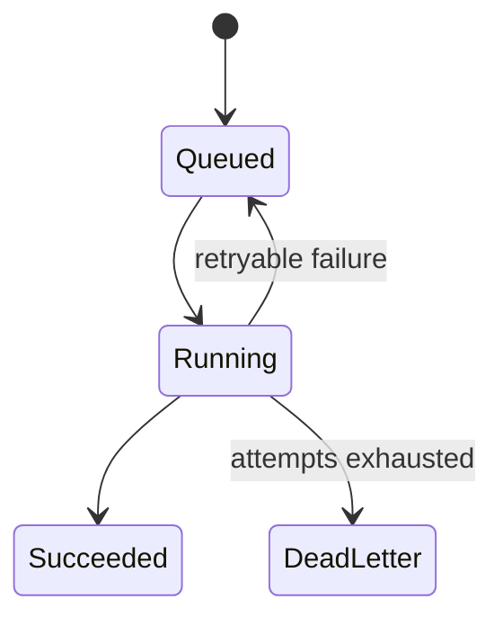
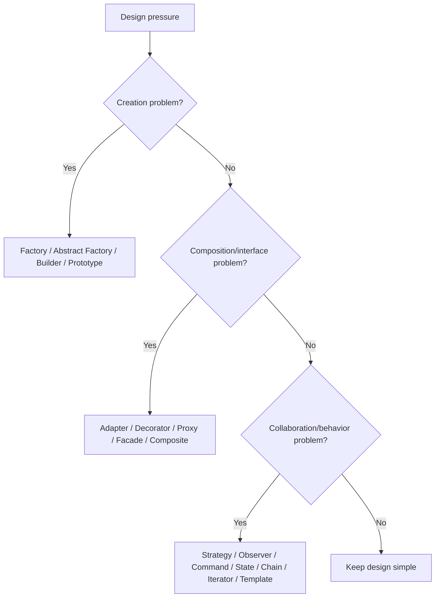

# Caelius Interview Preparation

## Design Patterns (Q411-Q430)

For design-pattern questions, speak in this order:

```text
Problem -> Pattern intent -> Roles/structure -> Compact example -> Tradeoff -> Real use
```

Do not force patterns into simple code. A pattern is useful when it names a recurring design problem and its tradeoffs.

---

# Q411. What Is a Design Pattern?

## Define

> A design pattern is a reusable, named design approach for a recurring software-structure problem in a particular context.

A pattern is not:

- A complete application.
- A library that can simply be imported.
- An algorithm for computing an answer.
- A rule that must always be used.

## What a Pattern Communicates

- Intent: what problem it solves.
- Context: when it applies.
- Participants: classes/objects and their roles.
- Collaboration: how participants interact.
- Consequences: benefits and tradeoffs.

## Example

The Strategy pattern says:

```text
When one operation has interchangeable algorithms,
place each algorithm behind a common contract,
and let the context use the selected implementation.
```

## Why Patterns Help

- Give teams a shared vocabulary.
- Make proven tradeoffs explicit.
- Improve communication during design reviews.
- Avoid repeatedly inventing the same structure.

## Interview Point

A pattern is valuable when its intent and consequences fit the problem, not merely because the class diagram resembles it.

---

# Q412. Creational vs Structural vs Behavioral Patterns

## Define

The classic design-pattern categories focus on different design concerns:

| Category | Focus | Examples |
|---|---|---|
| Creational | How objects are created | Factory, Builder, Prototype, Singleton |
| Structural | How objects/classes are composed | Adapter, Decorator, Proxy, Facade, Composite |
| Behavioral | How objects collaborate and vary behavior | Strategy, Observer, Command, State, Iterator |

## Simple Comparison

```text
Creational:  "How should I obtain this object?"
Structural:  "How should these parts fit together?"
Behavioral:  "How should these objects communicate or vary?"
```

## Example

For workflow node execution:

- Factory chooses the correct executor to create/return.
- Decorator adds metrics around an executor.
- Strategy allows different execution algorithms.
- Command represents a requested execution.

## Important Nuance

Some patterns can be viewed through more than one lens, and real systems often combine them.

## Interview Point

Name the design pressure first; the category helps organize patterns but does not determine correctness.

---

# Q413. Singleton Pattern - Thread-Safe Implementation

## Define

> Singleton ensures a class has one instance within a defined scope and provides a global access point to it.

## Preferred Java Implementation: Enum Singleton

```java
public enum MetricsRegistry {
    INSTANCE;

    private final ConcurrentMap<String, LongAdder> counters =
        new ConcurrentHashMap<>();

    public void increment(String name) {
        counters.computeIfAbsent(name, ignored -> new LongAdder())
            .increment();
    }
}
```

Benefits:

- Thread-safe initialization.
- Serialization-safe.
- Resistant to reflection-based duplicate construction in normal use.

## Initialization-on-Demand Holder

```java
public final class Configuration {
    private Configuration() {
    }

    private static final class Holder {
        private static final Configuration INSTANCE = new Configuration();
    }

    public static Configuration instance() {
        return Holder.INSTANCE;
    }
}
```

Class initialization provides thread-safe lazy creation.

## Tradeoffs

- Global state hides dependencies.
- Makes testing and replacement harder.
- "One instance" may mean one per JVM/class loader, not globally across distributed services.

## Better Alternative

Often create one instance in the application's composition root and inject it where needed.

## Interview Point

Use Singleton only when one scoped instance is a real invariant, not merely as a shortcut for global access.

---

# Q414. Factory Pattern - When to Use?

## Define

> Factory centralizes object creation and returns an implementation through a common abstraction, hiding selection or construction details from callers.

## Example

```java
public interface NodeExecutor {
    void execute(Node node);
}

public final class ExecutorFactory {
    public NodeExecutor create(NodeType type) {
        return switch (type) {
            case HTTP -> new HttpNodeExecutor();
            case SLACK -> new SlackNodeExecutor();
            case GEMINI -> new GeminiNodeExecutor();
        };
    }
}
```

Caller:

```java
NodeExecutor executor = factory.create(node.type());
executor.execute(node);
```

## Use When

- Creation depends on runtime type/configuration.
- Construction is complex.
- Callers should depend on an abstraction.
- Creation logic would otherwise be duplicated.

## Project Connection

> Nodeflowz's executor registry/factory-like lookup selects the correct executor for each node type while keeping workflow orchestration independent of provider-specific implementation.

## Tradeoff

A giant switch-based factory still requires modification for every new type. Registration maps or dependency-injection containers can improve extensibility when variation is frequent.

## Interview Point

Factory separates the decision of what to create from the code that uses the created object.

---

# Q415. Abstract Factory Pattern

## Define

> Abstract Factory creates families of related objects without exposing their concrete classes.

## Example Problem

An integration may need matching authentication and request-sending components for each provider.

```java
public interface Authenticator {
    String token();
}

public interface MessageClient {
    void send(String message);
}

public interface IntegrationFactory {
    Authenticator authenticator();
    MessageClient messageClient();
}
```

Concrete family:

```java
public final class SlackIntegrationFactory implements IntegrationFactory {
    @Override
    public Authenticator authenticator() {
        return new SlackAuthenticator();
    }

    @Override
    public MessageClient messageClient() {
        return new SlackMessageClient();
    }
}
```

## Factory vs Abstract Factory

- Factory creates one product type.
- Abstract Factory creates a compatible family of product types.

## Use When

- Products must be used together.
- Multiple provider/platform families exist.
- Client code should avoid concrete classes.

## Tradeoff

Adding a new product kind to every family can be expensive because all concrete factories must change.

## Interview Point

Abstract Factory enforces compatibility across a family, such as provider-specific clients and authenticators.

---

# Q416. Builder Pattern - When to Use?

## Define

> Builder constructs a complex object step by step, especially when many optional parameters or validation rules make constructors unclear.

## Example

```java
public final class ExecutionRequest {
    private final String workflowId;
    private final String userId;
    private final boolean dryRun;
    private final int maxAttempts;

    private ExecutionRequest(Builder builder) {
        workflowId = Objects.requireNonNull(builder.workflowId);
        userId = Objects.requireNonNull(builder.userId);
        dryRun = builder.dryRun;
        maxAttempts = builder.maxAttempts;
    }

    public static Builder builder(String workflowId, String userId) {
        return new Builder(workflowId, userId);
    }

    public static final class Builder {
        private final String workflowId;
        private final String userId;
        private boolean dryRun;
        private int maxAttempts = 3;

        private Builder(String workflowId, String userId) {
            this.workflowId = workflowId;
            this.userId = userId;
        }

        public Builder dryRun(boolean value) {
            dryRun = value;
            return this;
        }

        public Builder maxAttempts(int value) {
            maxAttempts = value;
            return this;
        }

        public ExecutionRequest build() {
            if (maxAttempts < 1) {
                throw new IllegalStateException("Invalid attempts");
            }
            return new ExecutionRequest(this);
        }
    }
}
```

## Use When

- Many optional parameters exist.
- Construction has multiple steps.
- Immutable result is desired.
- Validation should happen at build time.

## Tradeoff

Builder adds code and is unnecessary for a simple object with two clear required fields.

## Interview Point

Builder improves readable construction and prevents telescoping constructors.

---

# Q417. Prototype Pattern

## Define

> Prototype creates new objects by copying an existing configured object rather than constructing each one from scratch.

## Example

```java
public final class WorkflowTemplate {
    private final String name;
    private final List<NodeConfig> nodes;

    public WorkflowTemplate(String name, List<NodeConfig> nodes) {
        this.name = name;
        this.nodes = List.copyOf(nodes);
    }

    public WorkflowTemplate copyWithName(String newName) {
        return new WorkflowTemplate(newName, nodes);
    }
}
```

## Use Cases

- Clone a configured template.
- Creation is expensive.
- Runtime types/configurations vary.
- Users duplicate an existing object as a starting point.

## Copy Semantics

The pattern requires explicit shallow/deep-copy decisions. If `NodeConfig` is mutable, copying only the list still shares node objects.

## Java Guidance

Prototype does not require `Object.clone()`. Copy constructors or explicit copy methods are usually clearer.

## Project Connection

> A future Nodeflowz "duplicate workflow" feature could use prototype-style copying, but it must regenerate IDs and deliberately copy credentials/connections rather than blindly cloning the persisted graph.

## Interview Point

Prototype is about creation from an example object; correct copy semantics are the hard part.

---

# Q418. Adapter Pattern

## Define

> Adapter converts one interface into another interface expected by the client.

## Example

Application contract:

```java
public interface TextGenerator {
    String generate(String prompt);
}
```

Third-party SDK:

```java
public final class GeminiSdk {
    public GeminiResponse complete(GeminiRequest request) {
        return new GeminiResponse();
    }
}
```

Adapter:

```java
public final class GeminiTextGeneratorAdapter implements TextGenerator {
    private final GeminiSdk sdk;

    public GeminiTextGeneratorAdapter(GeminiSdk sdk) {
        this.sdk = sdk;
    }

    @Override
    public String generate(String prompt) {
        GeminiResponse response = sdk.complete(new GeminiRequest(prompt));
        return response.text();
    }
}
```

## Use When

- Integrating incompatible third-party APIs.
- Migrating legacy code.
- Standardizing multiple providers behind one application contract.

## Project Connection

> Nodeflowz integrates different AI and messaging providers. Adapter-style wrappers can translate each provider SDK into the executor's expected contract.

## Adapter vs Facade

- Adapter changes an interface.
- Facade simplifies access to a subsystem.

## Interview Point

Adapter lets existing components collaborate without changing either component's core contract.

---

# Q419. Decorator Pattern

## Define

> Decorator wraps an object implementing the same contract to add behavior dynamically without changing the wrapped object.

## Example

```java
public interface NodeExecutor {
    ExecutionResult execute(Node node);
}

public final class MetricsExecutorDecorator implements NodeExecutor {
    private final NodeExecutor delegate;
    private final Metrics metrics;

    public MetricsExecutorDecorator(NodeExecutor delegate, Metrics metrics) {
        this.delegate = delegate;
        this.metrics = metrics;
    }

    @Override
    public ExecutionResult execute(Node node) {
        long start = System.nanoTime();
        try {
            return delegate.execute(node);
        } finally {
            metrics.recordDuration(
                node.type(),
                System.nanoTime() - start
            );
        }
    }
}
```

## Use Cases

- Logging.
- Metrics.
- Retry.
- Authorization.
- Compression/encryption streams.

## Benefits

- Compose optional behavior.
- Avoid subclass explosion.
- Preserve the same interface.

## Tradeoff

Many nested decorators can make execution order and debugging harder.

## Interview Point

Decorator adds responsibilities while remaining substitutable for the wrapped component.

---

# Q420. Observer Pattern

## Define

> Observer defines a one-to-many dependency where observers are notified when a subject's state or event changes.

## Example

```java
public interface ExecutionObserver {
    void onStatusChanged(String executionId, ExecutionStatus status);
}

public final class ExecutionTracker {
    private final List<ExecutionObserver> observers = new ArrayList<>();

    public void subscribe(ExecutionObserver observer) {
        observers.add(observer);
    }

    public void updateStatus(String id, ExecutionStatus status) {
        for (ExecutionObserver observer : List.copyOf(observers)) {
            observer.onStatusChanged(id, status);
        }
    }
}
```

## Use Cases

- UI event listeners.
- Domain events.
- Status notifications.
- Metrics/audit subscribers.

## Project Connection

> Nodeflowz publishes real-time node status to the UI during workflow execution. Conceptually, the UI observes execution-status events, though the exact transport is event-driven rather than an in-memory Java observer list.

## Tradeoffs

- Notification ordering.
- Failure handling.
- Memory leaks from forgotten subscriptions.
- Eventual consistency in distributed versions.

## Interview Point

Observer decouples event producers from interested consumers, but delivery semantics must be explicit.

---

# Q421. Strategy Pattern

## Define

> Strategy encapsulates interchangeable algorithms behind a common contract so the client can select or receive one at runtime.

## Example

```java
public interface RetryStrategy {
    Duration nextDelay(int attempt);
}

public final class FixedDelayStrategy implements RetryStrategy {
    private final Duration delay;

    public FixedDelayStrategy(Duration delay) {
        this.delay = delay;
    }

    @Override
    public Duration nextDelay(int attempt) {
        return delay;
    }
}

public final class ExponentialBackoffStrategy implements RetryStrategy {
    @Override
    public Duration nextDelay(int attempt) {
        return Duration.ofSeconds(1L << Math.min(attempt, 10));
    }
}
```

Context:

```java
public final class RetryRunner {
    private final RetryStrategy strategy;

    public RetryRunner(RetryStrategy strategy) {
        this.strategy = strategy;
    }
}
```

## Use When

- Multiple algorithms solve the same operation.
- Conditional logic selects behavior.
- Behavior should be testable independently.

## Project Connection

> AcadAI's retrieval/reranking stages combine different scoring approaches. Strategy-style contracts are useful when selecting or comparing ranking algorithms, though the current project uses a controlled pipeline rather than claiming a formal pattern everywhere.

## Interview Point

Strategy varies an algorithm while keeping the context stable.

---

# Q422. Template Method Pattern

## Define

> Template Method defines an algorithm's fixed skeleton in a base class while allowing subclasses to customize selected steps.

## Example

```java
public abstract class AnalyticsJob {
    public final Report run(List<String> comments) {
        List<String> cleaned = preprocess(comments);
        Analysis result = analyze(cleaned);
        validate(result);
        return render(result);
    }

    protected List<String> preprocess(List<String> comments) {
        return comments.stream()
            .map(String::trim)
            .toList();
    }

    protected abstract Analysis analyze(List<String> comments);

    protected void validate(Analysis result) {
    }

    protected abstract Report render(Analysis result);
}
```

## Use When

- Overall process order must remain fixed.
- A few steps vary by subtype.
- Shared steps belong in a base implementation.

## Strategy vs Template Method

- Strategy uses composition to replace an algorithm.
- Template Method uses inheritance to customize steps.

## Tradeoff

Template Method couples behavior through inheritance. Prefer composition when variants should change independently or dynamically.

## Interview Point

The template method is normally final so subclasses cannot break the required algorithm order.

---

# Q423. Command Pattern

## Define

> Command encapsulates a request as an object, separating the requester from the object that performs the work.

## Example

```java
public interface Command {
    void execute();
}

public final class ExecuteWorkflowCommand implements Command {
    private final WorkflowService service;
    private final String workflowId;

    public ExecuteWorkflowCommand(
            WorkflowService service,
            String workflowId) {
        this.service = service;
        this.workflowId = workflowId;
    }

    @Override
    public void execute() {
        service.execute(workflowId);
    }
}
```

## Use Cases

- Queues and background jobs.
- Undo/redo.
- Scheduling.
- Audit logs.
- Retryable operations.

## Project Connection

> A Nodeflowz execution event or CommentPulse analytics job conceptually represents a command: it captures what should be executed and can be queued separately from the requester.

## Tradeoff

Command objects add indirection and must carry enough information for reliable execution and idempotency.

## Interview Point

Command turns an operation request into data that can be queued, logged, retried, or composed.

---

# Q424. Proxy Pattern

## Define

> Proxy provides a stand-in with the same interface as a real object and controls access to it.

## Example

```java
public interface AiClient {
    String generate(String prompt);
}

public final class RateLimitedAiClientProxy implements AiClient {
    private final AiClient delegate;
    private final RateLimiter limiter;

    public RateLimitedAiClientProxy(AiClient delegate, RateLimiter limiter) {
        this.delegate = delegate;
        this.limiter = limiter;
    }

    @Override
    public String generate(String prompt) {
        limiter.acquire();
        return delegate.generate(prompt);
    }
}
```

## Common Proxy Types

- Protection proxy: authorization.
- Remote proxy: represents a remote service.
- Virtual proxy: delays expensive creation.
- Caching proxy.
- Logging/monitoring proxy.

## Proxy vs Decorator

- Proxy primarily controls access.
- Decorator primarily adds responsibility.

Their structures can look similar; intent distinguishes them.

## Project Connection

> External AI provider clients in Nodeflowz or AcadAI can be wrapped with proxies for rate limits, credentials, retries, or remote-call control.

## Interview Point

Pattern identity comes from intent, not just from wrapping another object.

---

# Q425. Facade Pattern

## Define

> Facade provides a simplified, unified interface to a complex subsystem.

## Example

```java
public final class WorkflowExecutionFacade {
    private final WorkflowRepository repository;
    private final GraphSorter sorter;
    private final ExecutorRegistry registry;
    private final ExecutionRecorder recorder;

    public ExecutionResult execute(String workflowId) {
        Workflow workflow = repository.load(workflowId);
        List<Node> ordered = sorter.sort(workflow);
        ExecutionResult result = executeNodes(ordered, registry);
        recorder.save(result);
        return result;
    }
}
```

Callers use one operation without coordinating every subsystem directly.

## Benefits

- Simplifies common use.
- Reduces client coupling.
- Defines a clear subsystem entry point.

## Tradeoff

A facade can become a god object if it absorbs all logic rather than coordinating cohesive services.

## Project Connection

> The Nodeflowz workflow execution entry point acts conceptually like a facade over loading, topological sorting, executor selection, context propagation, and execution recording.

## Interview Point

Facade simplifies a subsystem's interface; it does not necessarily hide or replace all lower-level interfaces.

---

# Q426. Iterator Pattern

## Define

> Iterator provides sequential access to elements of a collection without exposing its internal representation.

## Java Example

```java
List<String> nodeIds = List.of("n1", "n2", "n3");
Iterator<String> iterator = nodeIds.iterator();

while (iterator.hasNext()) {
    String nodeId = iterator.next();
}
```

Enhanced `for` uses the `Iterable`/`Iterator` mechanism:

```java
for (String nodeId : nodeIds) {
}
```

## Custom Iterable

```java
public final class ExecutionHistory implements Iterable<Execution> {
    private final List<Execution> executions;

    @Override
    public Iterator<Execution> iterator() {
        return executions.iterator();
    }
}
```

## Benefits

- Hides storage details.
- Standardizes traversal.
- Allows different traversal strategies.

## Caution

Concurrent modification behavior depends on the collection/iterator. Some iterators fail fast; concurrent collections may provide weakly consistent iteration.

## Interview Point

Iterator separates traversal logic from collection representation.

---

# Q427. State Pattern

## Define

> State lets an object change behavior when its internal state changes by delegating state-specific behavior to state objects.

## Example

```java
public interface JobState {
    JobState start();
    JobState succeed();
    JobState fail(boolean retryable);
    String name();
}
```

One state:

```java
public final class QueuedState implements JobState {
    @Override
    public JobState start() {
        return new RunningState();
    }

    @Override
    public JobState succeed() {
        throw new IllegalStateException("Queued job cannot succeed");
    }

    @Override
    public JobState fail(boolean retryable) {
        return retryable ? this : new DeadLetterState();
    }

    @Override
    public String name() {
        return "QUEUED";
    }
}
```

## Project Connection

CommentPulse job states form a clear transition model:



The current implementation may represent transitions procedurally; State pattern is useful when state-specific behavior grows complex.

## State vs Strategy

- State changes behavior based on lifecycle state, often transitioning itself.
- Strategy selects an algorithm, usually independently of lifecycle.

## Interview Point

Use State when conditionals around lifecycle transitions become difficult to maintain.

---

# Q428. Composite Pattern

## Define

> Composite represents individual objects and groups of objects through the same interface, allowing clients to treat both uniformly.

## Example

```java
public interface WorkflowComponent {
    ExecutionResult execute(ExecutionContext context);
}

public final class ActionNode implements WorkflowComponent {
    @Override
    public ExecutionResult execute(ExecutionContext context) {
        return new ExecutionResult();
    }
}

public final class WorkflowGroup implements WorkflowComponent {
    private final List<WorkflowComponent> children;

    @Override
    public ExecutionResult execute(ExecutionContext context) {
        ExecutionResult result = new ExecutionResult();
        for (WorkflowComponent child : children) {
            result = child.execute(context);
        }
        return result;
    }
}
```

## Use Cases

- File/folder trees.
- UI component trees.
- Organization hierarchies.
- Nested expressions.
- Composite workflows.

## Tradeoff

Uniform treatment can make it harder to restrict operations that only make sense for leaves or groups.

## Project Connection

> Nodeflowz currently models a graph rather than claiming a Composite hierarchy. Composite would become relevant if workflows supported nested reusable sub-workflows treated like individual nodes.

## Interview Point

Composite is for part-whole trees where leaves and containers share a useful common contract.

---

# Q429. Chain of Responsibility Pattern

## Define

> Chain of Responsibility passes a request through a sequence of handlers until handlers process, modify, reject, or forward it.

## Example

```java
public interface RequestHandler {
    void handle(Request request, HandlerChain chain);
}

public final class HandlerChain {
    private final List<RequestHandler> handlers;
    private int index;

    public void next(Request request) {
        if (index < handlers.size()) {
            handlers.get(index++).handle(request, this);
        }
    }
}
```

Handlers:

```text
authentication -> authorization -> validation -> rate limiting -> endpoint
```

## Use Cases

- Web middleware.
- Validation pipelines.
- Logging filters.
- Approval chains.
- Exception handling.

## Tradeoffs

- Request may go unhandled.
- Handler order matters.
- Debugging control flow can be difficult.

## Project Connection

> API middleware around Nodeflowz or CommentPulse can be understood as a chain: authentication, validation, rate limiting, and request handling each perform one step and pass control onward.

## Interview Point

Chain of Responsibility decouples the sender from a specific receiver and makes handler order configurable.

---

# Q430. MVC vs MVP vs MVVM

## Define

These are presentation-architecture patterns that separate UI rendering, state, and application behavior.

## Comparison

| Pattern | Main coordinator | View relationship |
|---|---|---|
| MVC | Controller handles input and updates model/view | View may observe/read model |
| MVP | Presenter coordinates model and passive view | Presenter calls view interface |
| MVVM | ViewModel exposes state/commands | View binds/reacts to ViewModel |

## MVC

```text
User -> Controller -> Model
Model/View -> Render response
```

Common in server-side web frameworks.

## MVP

Presenter contains presentation logic and controls a passive view through an interface, making it testable without the UI.

## MVVM

ViewModel provides observable state and actions:

```text
View <-> data binding/reactive state <-> ViewModel -> Model
```

Common in reactive and desktop/mobile UI ecosystems.

## Modern Frontend Nuance

React/Next.js applications do not always map cleanly to one classic pattern. Components, hooks, server actions, state stores, and API layers can distribute these roles.

## Project Connection

> Nodeflowz's React Flow canvas consumes workflow state and invokes backend operations, but I would describe its actual component/state architecture rather than force it into a pure MVC label.

## Interview Point

The shared goal is separation of presentation from domain/data behavior; the difference is where presentation coordination and state binding live.

---

# Design Pattern Selection Guide



# Design Patterns Interview Checklist

Before naming a pattern, ask:

```text
What recurring problem is being solved?
What roles participate?
Is the pattern intent really present?
Could simpler composition solve it?
What coupling does it reduce?
What new indirection does it add?
Is the project connection implemented or only a future fit?
How are failures, ordering, and lifecycle handled?
```

# Design Patterns Revision Sheet

| Pattern/question | Core intent |
|---|---|
| Design pattern | Named reusable design approach |
| Pattern categories | Creation, composition, collaboration |
| Singleton | One scoped instance/global access |
| Factory | Centralize implementation creation/selection |
| Abstract Factory | Create compatible product families |
| Builder | Step-by-step complex object construction |
| Prototype | Create from an existing example |
| Adapter | Convert incompatible interface |
| Decorator | Add responsibility through wrapping |
| Observer | Notify many interested consumers |
| Strategy | Swap algorithm through composition |
| Template Method | Fixed skeleton with customizable steps |
| Command | Represent request as an object |
| Proxy | Control access through a stand-in |
| Facade | Simplify a complex subsystem |
| Iterator | Traverse without exposing representation |
| State | Delegate lifecycle-specific behavior |
| Composite | Treat leaves and groups uniformly |
| Chain of Responsibility | Pass request through handlers |
| MVC/MVP/MVVM | Separate presentation, state, and coordination |

## Common Interview Mistakes

- Naming a pattern without explaining its problem or tradeoff.
- Using Singleton as convenient global state.
- Confusing Factory with Abstract Factory.
- Using Builder for trivial objects.
- Implementing Prototype with unsafe shallow copies.
- Confusing Adapter, Decorator, Proxy, and Facade intents.
- Calling every callback Observer without considering subscription semantics.
- Confusing State with Strategy.
- Claiming a project uses a formal pattern when it only resembles one conceptually.
- Forcing modern frontend architecture into a pure classic UI pattern.
