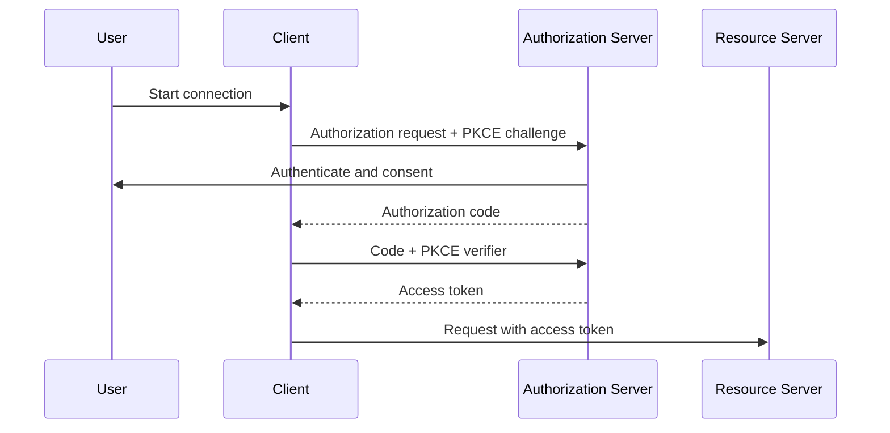
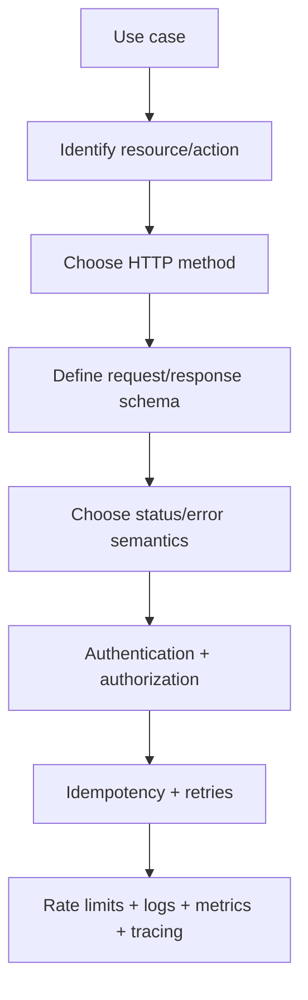

# Caelius Interview Preparation

## REST APIs (Q431-Q450)

For API questions, speak in this order:

```text
Resource/use case -> Request contract -> Response contract -> Failure cases -> Security -> Reliability/observability
```

Example resource model:

```text
POST   /api/v1/workflows
GET    /api/v1/workflows/{workflowId}
PATCH  /api/v1/workflows/{workflowId}
DELETE /api/v1/workflows/{workflowId}
POST   /api/v1/workflows/{workflowId}/executions
GET    /api/v1/executions/{executionId}
```

---

# Q431. What Is REST? What Are Its Principles?

## Define

> REST, or Representational State Transfer, is an architectural style for networked systems where clients interact with resources through uniform, stateless operations and exchange resource representations.

## REST Constraints

### Client-Server

UI/client concerns are separated from server data and behavior.

### Stateless

Each request contains enough context for the server to process it; application session state is not required from a previous request.

### Cacheable

Responses declare whether they can be reused.

### Uniform Interface

Resources are identified consistently and manipulated through representations and standard semantics.

### Layered System

Clients can communicate through gateways, proxies, and load balancers without needing to know every internal layer.

### Code on Demand, Optional

The server may provide executable code, though most JSON APIs do not use this constraint.

## Example

```http
GET /api/v1/workflows/42 HTTP/1.1
Host: example.com
Authorization: Bearer <token>
Accept: application/json
```

```http
HTTP/1.1 200 OK
Content-Type: application/json
ETag: "workflow-42-v7"

{
  "id": "42",
  "name": "Daily Summary",
  "status": "ACTIVE"
}
```

## Project Connection

> CommentPulse exposes Flask HTTP endpoints for synchronous predictions, asynchronous jobs, health checks, metrics, and admin replay. Nodeflowz uses tRPC over HTTP for typed application procedures and also integrates with REST-style external APIs and webhooks.

## Interview Point

REST is an architectural style, not simply "JSON over HTTP."

---

# Q432. What Is an API?

## Define

> An API, or Application Programming Interface, is a defined contract that allows one software component to request capabilities or data from another.

## API Contract Includes

- Available operations/endpoints.
- Inputs and validation rules.
- Output formats.
- Error behavior.
- Authentication and authorization.
- Versioning and compatibility expectations.
- Rate limits and reliability guarantees.

## Types

- Library API.
- Operating-system API.
- Web API.
- Database API.
- Internal service API.

## Web API Example

```http
POST /api/v1/analytics/jobs
Content-Type: application/json

{
  "comments": ["Great video", "Not helpful"]
}
```

```http
HTTP/1.1 202 Accepted
Content-Type: application/json

{
  "jobId": "job-101",
  "status": "QUEUED"
}
```

## Project Connection

> In CommentPulse, the Chrome extension is an API client and the Flask service exposes the API contract. In Nodeflowz, each external integration also depends on another provider's API contract.

## Interview Point

An API is the contract; its implementation can change as long as compatibility promises are preserved.

---

# Q433. Difference Between REST and SOAP

## Comparison

| REST | SOAP |
|---|---|
| Architectural style | Formal messaging protocol |
| Commonly uses HTTP resource semantics | Often uses XML envelopes and WSDL contracts |
| Usually JSON, but format is not fixed | XML-based message format |
| Lightweight and common for web/mobile APIs | Rich enterprise standards such as WS-Security |
| HTTP status/method semantics commonly used | Operations represented in SOAP messages |
| Flexible contract tooling such as OpenAPI | Strong formal contract through WSDL |

## REST Example

```http
GET /api/v1/customers/42
Accept: application/json
```

## SOAP Shape

```xml
<soap:Envelope>
  <soap:Body>
    <GetCustomer>
      <CustomerId>42</CustomerId>
    </GetCustomer>
  </soap:Body>
</soap:Envelope>
```

## When SOAP May Be Chosen

- Existing enterprise integration ecosystem.
- Formal WS-* standards are required.
- Strong contract and tooling expectations.
- Legacy systems already expose SOAP services.

## When REST Is Common

- Public web/mobile APIs.
- Resource-oriented CRUD/integration APIs.
- Lightweight JSON interoperability.

## Interview Point

Do not claim REST is always better. Choose based on ecosystem, contract, security, and interoperability requirements.

---

# Q434. What Are HTTP Methods?

## Core Methods

| Method | Typical meaning | Safe? | Idempotent? |
|---|---|---|---|
| `GET` | Retrieve representation | Yes | Yes |
| `POST` | Create/process/trigger action | No | Not inherently |
| `PUT` | Replace/create resource at known URI | No | Yes |
| `PATCH` | Partially modify resource | No | Depends on operation |
| `DELETE` | Remove resource | No | Yes by intended semantics |

## Examples

```http
GET /api/v1/workflows/42
```

```http
POST /api/v1/workflows
Content-Type: application/json

{ "name": "Daily Summary" }
```

```http
PUT /api/v1/workflows/42
Content-Type: application/json

{ "name": "Daily Summary", "status": "ACTIVE" }
```

```http
PATCH /api/v1/workflows/42
Content-Type: application/merge-patch+json

{ "status": "PAUSED" }
```

```http
DELETE /api/v1/workflows/42
```

## Safe vs Idempotent

- Safe means intended not to change server state.
- Idempotent means repeating the same request has the same intended effect as sending it once.

## Interview Point

Method semantics communicate intent to clients, gateways, caches, retries, and monitoring.

---

# Q435. Difference Between PUT and PATCH

## Define

> `PUT` typically replaces the complete resource representation at a known URI. `PATCH` applies a partial modification.

## PUT Example

```http
PUT /api/v1/workflows/42
Content-Type: application/json

{
  "name": "Daily Summary",
  "status": "ACTIVE",
  "tags": ["daily"]
}
```

Missing fields may be reset or rejected according to the contract.

## PATCH Example

```http
PATCH /api/v1/workflows/42
Content-Type: application/merge-patch+json

{
  "status": "PAUSED"
}
```

Only `status` changes.

## Idempotency

`PUT` is idempotent by semantics. `PATCH` can be idempotent:

```json
{ "status": "PAUSED" }
```

or non-idempotent:

```json
{ "operation": "incrementRetryCount" }
```

## Concurrency

Use conditional requests to prevent lost updates:

```http
If-Match: "workflow-42-v7"
```

The server can reject stale updates with `412 Precondition Failed`.

## Interview Point

The exact replacement/patch behavior must be documented; method name alone does not define field-level rules.

---

# Q436. What Are HTTP Status Codes?

## Categories

```text
1xx informational
2xx successful
3xx redirection
4xx client/request problem
5xx server problem
```

## Common Codes

| Code | Meaning | Example |
|---:|---|---|
| `200 OK` | Successful request with response | Retrieve/update result |
| `201 Created` | Resource successfully created | New workflow |
| `202 Accepted` | Accepted for asynchronous processing | Analytics job queued |
| `204 No Content` | Successful with no body | Successful delete |
| `400 Bad Request` | Invalid request syntax/data | Malformed JSON |
| `401 Unauthorized` | Missing/invalid authentication | Expired token |
| `403 Forbidden` | Authenticated but not permitted | Other tenant's workflow |
| `404 Not Found` | Resource absent/hidden | Unknown workflow |
| `409 Conflict` | Request conflicts with current state | Duplicate unique name |
| `422 Unprocessable Content` | Semantically invalid input | Invalid graph structure |
| `429 Too Many Requests` | Rate limit exceeded | Request quota exhausted |
| `500 Internal Server Error` | Unexpected server failure | Unhandled exception |
| `503 Service Unavailable` | Temporarily unavailable | Dependency outage |

## Error Body

```json
{
  "type": "https://example.com/problems/invalid-workflow",
  "title": "Workflow validation failed",
  "status": 422,
  "detail": "The workflow graph contains a cycle.",
  "traceId": "trace-abc"
}
```

## Interview Point

Choose the status code that best describes the protocol-level outcome and provide a consistent machine-readable error body.

---

# Q437. What Is Idempotency?

## Define

> An operation is idempotent when repeating the same request has the same intended effect as performing it once.

## Naturally Idempotent Examples

```text
GET /workflows/42
PUT /workflows/42 with the same representation
DELETE /workflows/42
```

The second delete may return a different status, but the resource remains deleted.

## Non-Idempotent Risk

```http
POST /api/v1/workflows/42/executions
```

If a client times out and retries, two executions may start.

## Idempotency-Key Pattern

```http
POST /api/v1/workflows/42/executions
Idempotency-Key: 3fcb4ac2-...
```

Server behavior:

1. Atomically reserve the key for the caller/operation.
2. Process once.
3. Store outcome.
4. Return the same outcome for a safe retry.

## Project Honesty

> Idempotency is a key reliability concern in Nodeflowz, especially for webhooks and external side effects. The project documentation identifies webhook deduplication/signature validation as an improvement, so I would not claim all trigger paths are fully idempotent today.

## Interview Point

Retries are safe only when the operation is idempotent or deduplicated and external side effects are handled consistently.

---

# Q438. What Is Statelessness in REST?

## Define

> Statelessness means each request contains the information necessary to process it; the server does not rely on conversational client state stored from previous requests.

## Example

```http
GET /api/v1/workflows/42
Authorization: Bearer <token>
```

The request carries authentication context and resource identity.

## Benefits

- Any server instance can handle a request.
- Easier horizontal scaling.
- Simpler recovery and load balancing.
- Clear request boundaries.

## What Stateless Does Not Mean

The server can still store:

- Workflows.
- Users.
- Executions.
- Idempotency records.
- Cache entries.

The constraint concerns client session/conversation state required between requests.

## Sessions

Cookie-based sessions can still support stateless application servers if shared/session storage is externalized, though token-based requests often make statelessness more explicit.

## Project Connection

> CommentPulse asynchronous job APIs can accept a job request, return a job ID, and let any API instance answer later status requests from shared job state.

## Interview Point

REST statelessness means no hidden dependency on a previous request's conversational state.

---

# Q439. What Is JSON? What Is Its Structure?

## Define

> JSON, or JavaScript Object Notation, is a text format for representing structured data using objects, arrays, strings, numbers, booleans, and null.

## Example

```json
{
  "id": "workflow-42",
  "name": "Daily Summary",
  "active": true,
  "retryCount": 3,
  "tags": ["youtube", "sentiment"],
  "schedule": null,
  "owner": {
    "id": "user-7",
    "name": "Deepa"
  }
}
```

## JSON Values

- Object: `{ "key": value }`
- Array: `[value1, value2]`
- String.
- Number.
- Boolean.
- `null`.

## Important Rules

- Object keys are strings in double quotes.
- No comments in standard JSON.
- No trailing commas.
- Dates and binary values need conventions, commonly ISO-8601 text and Base64.
- JSON numbers do not inherently preserve every language-specific numeric type.

## Security

Validate parsed JSON against an API schema. Successful parsing does not mean the data is semantically valid.

## Interview Point

JSON is a transport representation; the API still needs a documented schema and validation rules.

---

# Q440. XML vs JSON

## Comparison

| JSON | XML |
|---|---|
| Lightweight object/array data notation | Markup language with elements/attributes |
| Natural fit for web/mobile data | Strong document and namespace capabilities |
| Common with REST APIs | Common in SOAP and enterprise/document systems |
| Schema options such as JSON Schema/OpenAPI | Mature XSD and related standards |
| Less verbose for typical API payloads | Can represent mixed-content documents well |

## JSON

```json
{
  "customerId": 42,
  "name": "Deepa"
}
```

## XML

```xml
<customer>
  <customerId>42</customerId>
  <name>Deepa</name>
</customer>
```

## Security Considerations

XML parsers must be configured safely against risks such as external entity processing. JSON inputs also require size limits, schema validation, and injection-safe downstream handling.

## Choosing

- JSON is common for modern web APIs.
- XML remains useful for SOAP, document formats, namespaces, and established enterprise contracts.

## Interview Point

Choose from ecosystem and contract requirements, not only payload verbosity.

---

# Q441. What Are Request and Response Headers?

## Define

> HTTP headers are metadata fields sent with requests and responses that describe representation, authentication, caching, tracing, cookies, and protocol behavior.

## Request Example

```http
GET /api/v1/workflows/42 HTTP/1.1
Host: api.example.com
Authorization: Bearer <token>
Accept: application/json
If-None-Match: "workflow-42-v7"
X-Request-ID: req-123
```

## Response Example

```http
HTTP/1.1 200 OK
Content-Type: application/json
Cache-Control: private, max-age=60
ETag: "workflow-42-v8"
X-Request-ID: req-123
```

## Common Headers

| Request | Response |
|---|---|
| `Authorization` | `WWW-Authenticate` |
| `Accept` | `Content-Type` |
| `Content-Type` | `Cache-Control` |
| `If-Match` / `If-None-Match` | `ETag` |
| `Origin` | CORS headers |
| Trace/request ID | Trace/request ID |

## Interview Point

Headers communicate metadata and protocol control; the body carries the primary representation.

---

# Q442. What Is the Content-Type Header?

## Define

> `Content-Type` declares the media type and optional parameters of the message body.

## Examples

```http
Content-Type: application/json
```

```http
Content-Type: application/xml
```

```http
Content-Type: multipart/form-data; boundary=...
```

```http
Content-Type: text/plain; charset=utf-8
```

## Request Behavior

The server uses request `Content-Type` to choose how to parse the body.

Unsupported media type:

```http
HTTP/1.1 415 Unsupported Media Type
```

## Content-Type vs Accept

- `Content-Type`: what format this body uses.
- `Accept`: what response formats the client can handle.

## Security

- Validate the declared and actual body format.
- Set explicit response content types.
- Apply upload size limits.

## Interview Point

`Content-Type` describes the body being sent; `Accept` negotiates the desired response type.

---

# Q443. Authentication vs Authorization

## Define

> Authentication verifies who the caller is. Authorization determines what that authenticated caller is allowed to do.

## Example Flow

```text
Authentication: "This request belongs to user 42."
Authorization:  "User 42 owns workflow 99 and may execute it."
```

## HTTP Outcomes

- `401 Unauthorized`: authentication is missing or invalid.
- `403 Forbidden`: identity is known but lacks permission.

Some APIs return `404` instead of `403` to avoid revealing another tenant's resource existence.

## Authorization Models

- Role-Based Access Control (RBAC).
- Attribute-Based Access Control (ABAC).
- Ownership/tenant checks.
- Scope/permission-based access.

## Project Connection

> Nodeflowz's protected procedures validate session identity and workflow ownership before operations. That separates authentication from resource-level authorization.

> CommentPulse documentation identifies stronger authentication and tenant isolation as a production improvement, so I would not claim its current API has complete enterprise authorization.

## Interview Point

Authentication happens before authorization, but a secure endpoint needs both.

---

# Q444. What Is JWT?

## Define

> A JWT, or JSON Web Token, is a compact signed token format containing claims. It is commonly used to convey authenticated identity and authorization context.

## Structure

```text
base64url(header).base64url(payload).base64url(signature)
```

Example claims:

```json
{
  "sub": "user-42",
  "iss": "https://auth.example.com",
  "aud": "workflow-api",
  "exp": 1781500000,
  "scope": "workflow:read workflow:execute"
}
```

## Important Properties

- Signed JWTs provide integrity/authenticity, not confidentiality.
- Anyone holding the token may read unencrypted claims.
- Server verifies signature and claims.

## Validation Checklist

- Allowed algorithm.
- Signature.
- Issuer.
- Audience.
- Expiration and not-before.
- Required claims/scopes.
- Key rotation.

## Risks

- Long-lived stolen tokens.
- Sensitive data placed in payload.
- Weak validation.
- Difficult immediate revocation without additional mechanisms.

## Interview Point

JWT is a token format, not an authentication protocol by itself.

---

# Q445. What Is OAuth 2.0?

## Define

> OAuth 2.0 is an authorization framework that lets a client obtain limited access to a resource server on behalf of a user or itself without receiving the user's password.

## Roles

- Resource owner.
- Client.
- Authorization server.
- Resource server.

## Authorization Code With PKCE



## Tokens

- Access token: short-lived resource access.
- Refresh token: obtain new access tokens, if issued.
- ID token: belongs to OpenID Connect, conveying identity claims.

## Project Connection

> Nodeflowz integrations with services such as Google Sheets or Slack conceptually require delegated authorization. OAuth lets users grant limited provider access without sharing provider passwords with Nodeflowz.

## Security Practices

- Use Authorization Code with PKCE for public clients.
- Validate redirect URIs.
- Store tokens securely.
- Request minimum scopes.
- Rotate/revoke refresh tokens.

## Interview Point

OAuth 2.0 handles delegated authorization. OpenID Connect adds a standardized identity layer.

---

# Q446. What Is API Versioning?

## Define

> API versioning manages incompatible contract changes while allowing existing clients time to continue working or migrate.

## Common Approaches

### URL Versioning

```text
/api/v1/workflows
/api/v2/workflows
```

### Header/Media-Type Versioning

```http
Accept: application/vnd.example.workflow-v2+json
```

### Query Parameter

```text
/api/workflows?version=2
```

## What Requires a New Version?

Usually breaking changes:

- Removing/renaming required fields.
- Changing field meaning/type.
- Changing authentication behavior.
- Changing operation semantics.

Additive optional fields may be backward compatible if clients tolerate them.

## Versioning Strategy

- Prefer backward-compatible evolution.
- Publish deprecation timelines.
- Measure old-version usage.
- Provide migration documentation.
- Sunset versions deliberately.

## Project Connection

> Across the projects, API versioning is an important production concern. The current systems demonstrate API integration, but a mature public API would need explicit compatibility and deprecation policies.

## Interview Point

Versioning is not only choosing `/v1`; it is managing contract compatibility and client migration.

---

# Q447. What Is Rate Limiting?

## Define

> Rate limiting controls how many requests or operations a caller may perform within a period to protect capacity, fairness, cost, and security.

## Algorithms

- Fixed window.
- Sliding window.
- Token bucket.
- Leaky bucket.

## Token Bucket Intuition

```text
Tokens refill at a steady rate.
Each request consumes a token.
Requests are allowed while tokens remain.
Bursting is allowed up to bucket capacity.
```

## Response

```http
HTTP/1.1 429 Too Many Requests
Retry-After: 30
RateLimit-Limit: 100
RateLimit-Remaining: 0
```

## Dimensions

Limit by:

- User.
- API key.
- IP address.
- Tenant.
- Endpoint.
- Expensive provider operation.

## Distributed Implementation

Redis atomic counters/scripts or gateway-level rate limiting can coordinate limits across server instances.

## Project Connection

> Nodeflowz calls external providers whose quotas and costs differ. Provider-level rate-limit-aware scheduling and circuit breakers are identified improvements, rather than something I would claim is fully implemented today.

## Interview Point

Rate limits need a key, algorithm, capacity, refill/window rule, and clear retry response.

---

# Q448. What Is CORS? How Do You Handle It?

## Define

> CORS, or Cross-Origin Resource Sharing, is a browser-enforced mechanism that lets a server declare which origins may access its resources from frontend JavaScript.

Origin consists of:

```text
scheme + host + port
```

## Simple Request

Browser sends:

```http
Origin: https://app.example.com
```

Server may respond:

```http
Access-Control-Allow-Origin: https://app.example.com
```

## Preflight

For certain methods/headers, the browser sends:

```http
OPTIONS /api/v1/workflows/42
Origin: https://app.example.com
Access-Control-Request-Method: PATCH
Access-Control-Request-Headers: authorization, content-type
```

Server returns allowed origin, methods, and headers.

## Secure Handling

- Allow only trusted origins.
- Configure methods and headers narrowly.
- Handle preflight requests.
- Use `Vary: Origin` when dynamically reflecting allowed origins.
- When credentials are allowed, do not use wildcard origin.

## Important Distinction

CORS is not authentication and does not prevent non-browser clients from calling the API.

## Interview Point

CORS controls browser cross-origin access; authorization must still protect the endpoint.

---

# Q449. What Is a REST Endpoint Naming Convention?

## Principles

Use resource-oriented nouns:

```text
GET /api/v1/workflows
GET /api/v1/workflows/{workflowId}
GET /api/v1/workflows/{workflowId}/executions
```

Avoid CRUD verbs:

```text
/getWorkflows
/createWorkflow
/deleteWorkflow
```

HTTP methods already communicate those operations.

## Subresources and Actions

Nested resources:

```text
GET /api/v1/workflows/42/executions
```

Domain action that is not natural CRUD:

```text
POST /api/v1/workflows/42/executions
POST /api/v1/executions/99/replay
```

## Consistency Rules

- Use plural resource names consistently.
- Use lowercase path segments.
- Keep nesting shallow.
- Put filters/sorts/pagination in query parameters.
- Use stable opaque identifiers.

Example:

```text
GET /api/v1/executions?status=FAILED&limit=20
```

## Interview Point

Name endpoints around resources and domain operations, then use HTTP methods and status codes consistently.

---

# Q450. What Is Pagination in APIs?

## Define

> Pagination returns a large result set in bounded pages so responses remain fast, predictable, and manageable.

## Offset Pagination

```http
GET /api/v1/executions?limit=20&offset=40
```

Response:

```json
{
  "items": [],
  "limit": 20,
  "offset": 40,
  "total": 1250
}
```

Benefits:

- Simple.
- Supports direct page numbers.

Costs:

- Deep offsets can be slow.
- Concurrent inserts/deletes can shift pages.

## Cursor/Keyset Pagination

```http
GET /api/v1/executions?limit=20&after=eyJzdGFydGVkQXQiOi...
```

Database concept:

```sql
WHERE (started_at, id) < (:last_started_at, :last_id)
ORDER BY started_at DESC, id DESC
LIMIT 20;
```

Benefits:

- Stable and efficient for sequential navigation.
- Avoids scanning/discarding deep offsets.

Tradeoff:

- No arbitrary page jump.
- Cursor design must preserve sort/filter context.

## Response Shape

```json
{
  "items": [],
  "nextCursor": "...",
  "hasMore": true
}
```

## Interview Point

Pagination requires deterministic ordering with a unique tie-breaker. Choose offset for simplicity and cursor/keyset for large changing datasets.

---

# REST API Design Flow



# REST API Interview Checklist

Before finalizing an endpoint, ask:

```text
What resource or action is represented?
Is the chosen method safe/idempotent?
What status codes and error schema apply?
How are request bodies validated?
Who is authenticated and what are they authorized to access?
Can clients safely retry?
How is concurrent modification handled?
What are pagination and ordering rules?
What rate limits and CORS policy apply?
How is compatibility/versioning managed?
What logs, metrics, and trace IDs exist?
```

# REST APIs Revision Sheet

| Question | Core answer |
|---|---|
| REST | Stateless resource-oriented architectural style |
| API | Defined software interaction contract |
| REST vs SOAP | Architectural style vs formal XML messaging protocol |
| HTTP methods | Standard operation semantics |
| PUT vs PATCH | Complete replacement vs partial modification |
| Status codes | Protocol-level outcome categories |
| Idempotency | Same intended effect after retries |
| Statelessness | No hidden conversational dependency between requests |
| JSON | Text structured-data representation |
| XML vs JSON | Markup/document strengths vs lightweight object data |
| Headers | HTTP metadata and control |
| Content-Type | Media type of the current body |
| Authn vs authz | Who you are vs what you may do |
| JWT | Signed claims token format |
| OAuth 2.0 | Delegated authorization framework |
| API versioning | Manage breaking contract evolution |
| Rate limiting | Bound caller operations over time |
| CORS | Browser cross-origin permission mechanism |
| Endpoint naming | Consistent resource-oriented paths |
| Pagination | Bounded ordered result retrieval |

## Common Interview Mistakes

- Defining REST as only JSON over HTTP.
- Using `POST` for every operation.
- Confusing safe and idempotent methods.
- Treating `401` and `403` as interchangeable.
- Retrying side-effecting operations without idempotency.
- Saying stateless APIs store no data.
- Treating JWT payloads as encrypted.
- Saying OAuth is authentication without mentioning OpenID Connect.
- Treating CORS as API security/authentication.
- Paginating without deterministic ordering.
