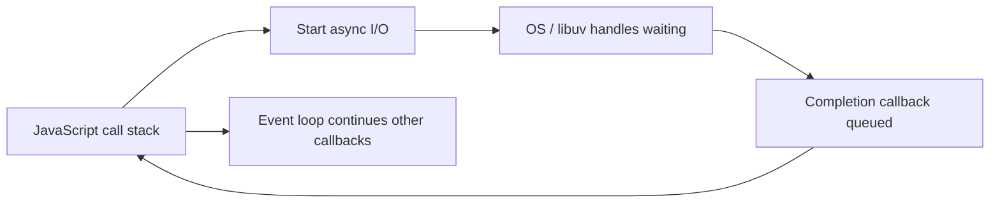
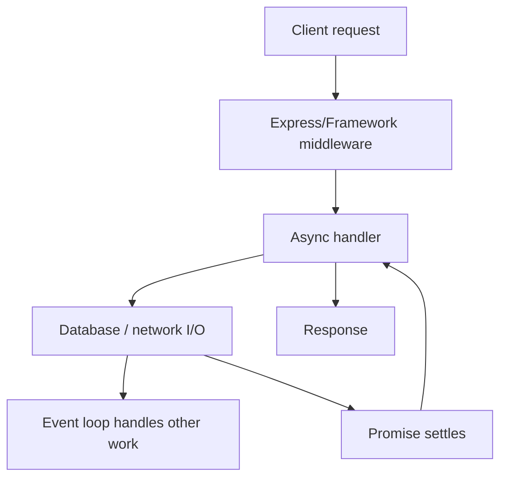

# Caelius Interview Preparation

## Node.js and Express (Q451-Q460)

For Node.js backend questions, speak in this order:

```text
Runtime behavior -> Request/I/O flow -> Async contract -> Error handling -> Scaling/production tradeoff
```

Project honesty:

> Nodeflowz uses the Node.js runtime through Next.js and tRPC. It demonstrates asynchronous JavaScript/TypeScript backend behavior, but it is not an Express application. Express examples below explain the requested framework concepts separately.

---

# Q451. What Is Node.js?

## Define

> Node.js is a JavaScript runtime built on the V8 engine that lets JavaScript run outside the browser, commonly for servers, command-line tools, automation, and build tooling.

## Key Characteristics

- Executes JavaScript/TypeScript output on the server.
- Uses event-driven, asynchronous I/O APIs.
- Provides modules for networking, files, processes, streams, and more.
- Uses the npm ecosystem.
- Commonly handles many concurrent I/O-bound operations efficiently.

## Basic HTTP Server

```javascript
import http from "node:http";

const server = http.createServer((request, response) => {
  response.writeHead(200, { "Content-Type": "application/json" });
  response.end(JSON.stringify({ status: "ok" }));
});

server.listen(3000);
```

## Good Fits

- APIs and web backends.
- Real-time/event-driven services.
- Integration services.
- I/O-heavy applications.
- Shared JavaScript/TypeScript across frontend and backend.

## Important Limitation

CPU-heavy synchronous work blocks the main JavaScript thread. Move it to worker threads, separate services/jobs, or optimized native/external processing.

## Project Connection

> Nodeflowz uses Next.js and tRPC on the Node.js runtime. External-provider calls and database operations are asynchronous, while long workflow execution is moved to Inngest instead of blocking the user-facing request.

## Interview Point

Node.js is the runtime; Express, Next.js, and tRPC are frameworks/libraries that run on it.

---

# Q452. What Is the Event Loop in Node.js?

## Define

> The event loop coordinates JavaScript callbacks and asynchronous completion events, allowing Node.js to keep processing work while I/O operations wait outside the main JavaScript call stack.

## Simplified Flow



## Important Queues

- Timers.
- I/O callbacks.
- Poll/check phases.
- Promise microtasks.
- `process.nextTick` queue.

Simplified ordering example:

```javascript
console.log("start");

setTimeout(() => console.log("timer"), 0);

Promise.resolve().then(() => console.log("promise"));

console.log("end");
```

Typical output:

```text
start
end
promise
timer
```

Promise microtasks run after the current stack before the timer callback.

## Blocking Example

```javascript
const end = Date.now() + 5_000;
while (Date.now() < end) {
  // Blocks request handling and timer callbacks.
}
```

## Interview Point

The event loop enables concurrency for waiting operations, but JavaScript callbacks still need to avoid blocking the event-loop thread.

---

# Q453. What Is Non-Blocking I/O?

## Define

> Non-blocking I/O starts an operation and lets the current thread continue other work instead of waiting idle for the operation to finish.

## Blocking Style

```javascript
import fs from "node:fs";

const content = fs.readFileSync("report.json", "utf8");
console.log(content);
```

The JavaScript thread waits until the file read completes.

## Non-Blocking Style

```javascript
import fs from "node:fs/promises";

const content = await fs.readFile("report.json", "utf8");
console.log(content);
```

`await` pauses this async function, but Node.js can process other work while the file operation waits.

## Server Example

```javascript
app.get("/workflows/:id", async (req, res, next) => {
  try {
    const workflow = await repository.findById(req.params.id);
    res.json(workflow);
  } catch (error) {
    next(error);
  }
});
```

## Non-Blocking Does Not Mean Parallel JavaScript

I/O waits can overlap. CPU-heavy JavaScript still blocks unless moved elsewhere.

## Project Connection

> Nodeflowz calls databases and external APIs asynchronously. Slow multi-step workflow execution is delegated to background orchestration, which keeps request handling responsive.

## Interview Point

Non-blocking I/O improves concurrency during waiting; it does not make CPU-bound work free.

---

# Q454. What Is Express.js?

## Define

> Express is a minimal Node.js web framework that provides routing, middleware composition, request/response helpers, and HTTP application structure.

## Example

```javascript
import express from "express";

const app = express();

app.use(express.json());

app.get("/api/v1/health", (req, res) => {
  res.json({ status: "ok" });
});

app.post("/api/v1/jobs", async (req, res, next) => {
  try {
    const job = await submitJob(req.body);
    res.status(202).json(job);
  } catch (error) {
    next(error);
  }
});

app.listen(3000);
```

## Express Provides

- Routing.
- Middleware pipeline.
- Request/response abstractions.
- Error-handling middleware.
- Large middleware ecosystem.

## Express Does Not Automatically Provide

- Database layer.
- Authentication strategy.
- Validation.
- Background jobs.
- Strong application architecture.
- Complete security configuration.

## Project Honesty

> I have used the Node.js ecosystem through Nodeflowz's Next.js/tRPC backend. Express is a separate minimalist HTTP framework; I would explain its middleware and routing model without claiming Nodeflowz is built on Express.

## Interview Point

Express provides flexible HTTP primitives; application structure and production controls remain the developer's responsibility.

---

# Q455. What Is Middleware in Express?

## Define

> Express middleware is a function in the request-response pipeline that can inspect or modify the request/response, end the response, or pass control to the next handler.

## Example Middleware

```javascript
function requestLogger(req, res, next) {
  const startedAt = Date.now();

  res.on("finish", () => {
    console.log({
      method: req.method,
      path: req.path,
      status: res.statusCode,
      durationMs: Date.now() - startedAt
    });
  });

  next();
}

app.use(requestLogger);
```

## Common Middleware Uses

- Request logging.
- Authentication.
- Authorization.
- Input parsing.
- Validation.
- CORS.
- Rate limiting.
- Error handling.

## Ordering Matters

```javascript
app.use(requestId);
app.use(requestLogger);
app.use(authentication);
app.use("/api/v1", routes);
app.use(notFoundHandler);
app.use(errorHandler);
```

## Failure Risks

- Forgetting `next()` leaves requests hanging.
- Calling `next()` after sending a response can cause double handling.
- Incorrect ordering can bypass security or error handling.

## Interview Point

Middleware is a Chain of Responsibility: each function handles part of the request and decides whether to continue.

---

# Q456. What Are req, res, and next in Express?

## `req`

> `req` is the request object containing HTTP input and middleware-added context.

Examples:

```javascript
req.params.id
req.query.status
req.body
req.headers.authorization
req.user
```

## `res`

> `res` is the response object used to set status, headers, and body.

```javascript
res.status(201).json({ id: "job-101" });
res.set("Cache-Control", "no-store");
res.sendStatus(204);
```

## `next`

> `next` passes control to the next matching middleware or route handler. `next(error)` transfers control to error-handling middleware.

```javascript
function requireUser(req, res, next) {
  if (!req.user) {
    return res.status(401).json({ error: "Authentication required" });
  }
  next();
}
```

## Error Middleware Signature

```javascript
function errorHandler(error, req, res, next) {
  console.error(error);
  res.status(500).json({
    error: "Internal server error"
  });
}
```

## Important Rule

Return after sending a response when later code must not run:

```javascript
return res.status(400).json({ error: "Invalid input" });
```

## Interview Point

`req` represents input, `res` builds output, and `next` controls movement through the middleware chain.

---

# Q457. What Is async/await in JavaScript?

## Define

> `async/await` is syntax built on Promises that makes asynchronous control flow read more like sequential code.

## Example

```javascript
async function loadWorkflow(workflowId) {
  const workflow = await repository.findById(workflowId);

  if (!workflow) {
    throw new Error("Workflow not found");
  }

  return workflow;
}
```

An `async` function always returns a Promise:

```javascript
const promise = loadWorkflow("wf-42");
```

## Error Handling

```javascript
try {
  const workflow = await loadWorkflow("wf-42");
  console.log(workflow);
} catch (error) {
  console.error(error);
}
```

## Sequential vs Concurrent Await

Sequential:

```javascript
const user = await loadUser();
const workflow = await loadWorkflow();
```

Concurrent independent operations:

```javascript
const [user, workflow] = await Promise.all([
  loadUser(),
  loadWorkflow()
]);
```

## Important Nuance

`await` does not block the whole Node.js event loop; it pauses the current async function until the Promise settles.

## Project Connection

> Nodeflowz's TypeScript backend uses `async`/`await` around Prisma, Inngest steps, and external integrations to express asynchronous workflows clearly.

## Interview Point

Use `Promise.all` only when operations are independent and the desired failure behavior is understood.

---

# Q458. What Is a Promise in JavaScript?

## Define

> A Promise is an object representing the eventual fulfillment or rejection of an asynchronous operation.

## States

```text
pending -> fulfilled
pending -> rejected
```

Once settled, a Promise does not change state again.

## Example

```javascript
function delay(milliseconds) {
  return new Promise((resolve) => {
    setTimeout(resolve, milliseconds);
  });
}

delay(500)
  .then(() => console.log("done"))
  .catch((error) => console.error(error))
  .finally(() => console.log("finished"));
```

## Promise Composition

| Method | Behavior |
|---|---|
| `Promise.all` | Fulfill all; reject on first rejection |
| `Promise.allSettled` | Report every outcome |
| `Promise.race` | Settle with first settled Promise |
| `Promise.any` | Fulfill with first fulfillment |

## Error Propagation

Thrown errors inside `.then()` reject the resulting Promise:

```javascript
fetchData()
  .then((data) => {
    throw new Error("Invalid data");
  })
  .catch(handleError);
```

## Interview Point

Promises make asynchronous outcomes composable; `async/await` is syntax for consuming and composing them.

---

# Q459. What Is Callback Hell?

## Define

> Callback hell is deeply nested asynchronous callback code that becomes difficult to read, reason about, and handle errors in.

## Example

```javascript
loadUser(userId, (userError, user) => {
  if (userError) {
    return handle(userError);
  }

  loadWorkflow(user, (workflowError, workflow) => {
    if (workflowError) {
      return handle(workflowError);
    }

    executeWorkflow(workflow, (executionError, result) => {
      if (executionError) {
        return handle(executionError);
      }

      saveResult(result, handle);
    });
  });
});
```

## Problems

- Deep indentation.
- Repeated error handling.
- Difficult sequencing and parallelism.
- Harder testing and reuse.
- Inversion of control.

## Promise/async Rewrite

```javascript
async function processWorkflow(userId) {
  const user = await loadUser(userId);
  const workflow = await loadWorkflow(user);
  const result = await executeWorkflow(workflow);
  await saveResult(result);
  return result;
}
```

## Other Improvements

- Extract named functions.
- Use Promises.
- Use `async/await`.
- Separate orchestration from individual operations.
- Use queues/workflow engines for durable long-running processes.

## Interview Point

Callback hell is primarily a maintainability/control-flow problem, not a claim that callbacks are always bad.

---

# Q460. What Is npm?

## Define

> npm is the Node.js package ecosystem and command-line tool used to install, publish, version, and run JavaScript packages and project scripts.

## `package.json`

```json
{
  "name": "workflow-api",
  "version": "1.0.0",
  "scripts": {
    "dev": "node --watch src/server.js",
    "test": "node --test",
    "start": "node src/server.js"
  },
  "dependencies": {
    "express": "^5.0.0"
  },
  "devDependencies": {
    "typescript": "^5.0.0"
  }
}
```

## Common Commands

```text
npm install
npm install express
npm install --save-dev typescript
npm run test
npm audit
```

## Lock File

`package-lock.json` records resolved dependency versions and integrity data for reproducible installations.

Use in CI:

```text
npm ci
```

It installs from the lock file and expects it to match `package.json`.

## Semantic Version Ranges

```text
1.2.3   exact
^1.2.3  compatible minor/patch updates before 2.0.0
~1.2.3  compatible patch updates
```

## Security and Reliability

- Commit lock files for applications.
- Review dependency updates.
- Use trusted packages and minimal dependencies.
- Run audits, but evaluate findings rather than blindly applying breaking fixes.
- Keep secrets out of package metadata/scripts.

## Project Connection

> Nodeflowz uses the JavaScript/TypeScript package ecosystem for Next.js, React Flow, tRPC, Prisma, and related tooling.

## Interview Point

npm is both a package registry ecosystem and a CLI for dependency and script management.

---

# Node.js Request Flow



# Node.js and Express Interview Checklist

Before designing a backend path, ask:

```text
Is the work I/O-bound or CPU-bound?
Can any synchronous operation block the event loop?
Are independent operations awaited concurrently?
How do Promise rejections reach error handling?
Does middleware ordering protect the route?
Can a handler send more than one response?
Should long-running work move to a queue/orchestrator?
Are dependencies locked and reviewed?
What is framework-specific versus Node.js runtime behavior?
```

# Node.js and Express Revision Sheet

| Question | Core answer |
|---|---|
| Node.js | V8-based JavaScript runtime outside browser |
| Event loop | Coordinates callbacks and async completions |
| Non-blocking I/O | Continue work while I/O waits |
| Express | Minimal Node.js routing/middleware framework |
| Middleware | Request-response pipeline function |
| req/res/next | Input, output, pipeline continuation |
| async/await | Promise-based asynchronous syntax |
| Promise | Eventual async fulfillment/rejection |
| Callback hell | Hard-to-maintain nested callback control flow |
| npm | Node package ecosystem, CLI, scripts, dependency management |

## Common Interview Mistakes

- Calling Node.js a programming language or framework.
- Saying Node.js is fully single-threaded without qualification.
- Confusing concurrent I/O with parallel CPU execution.
- Assuming `await` blocks the whole event loop.
- Forgetting to handle Promise rejections.
- Running independent awaits sequentially without reason.
- Forgetting `next()` or sending multiple responses in Express.
- Calling Next.js/tRPC an Express project.
- Treating `npm install` without a lock file as fully reproducible.
