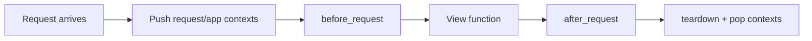
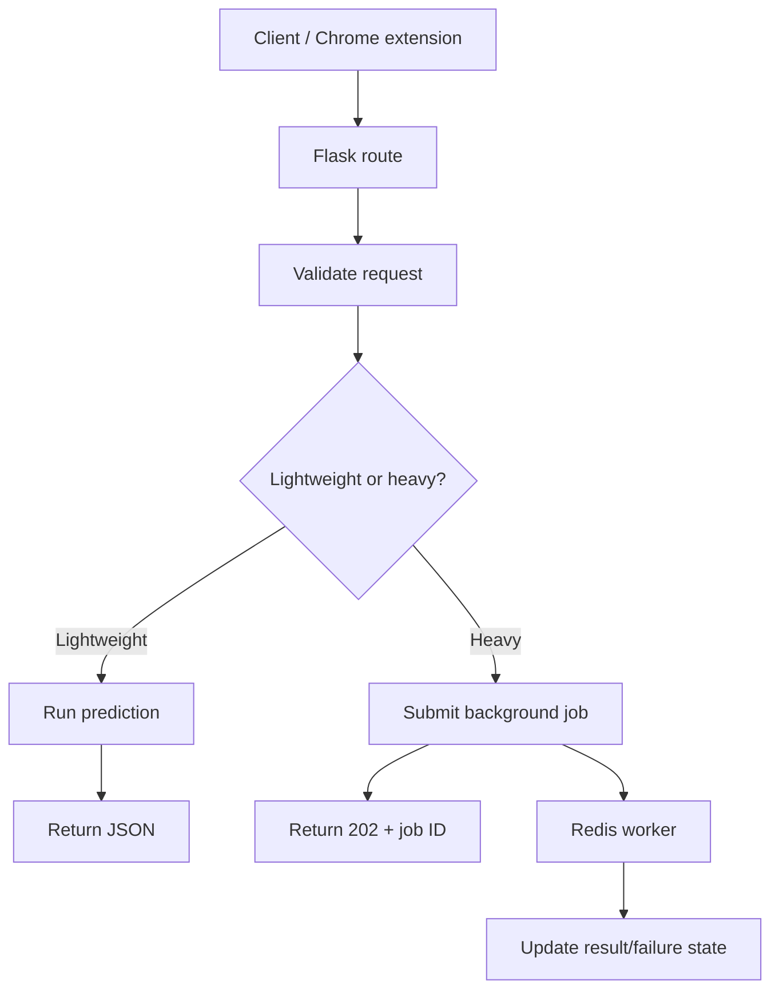

# Caelius Interview Preparation

## Flask (Q461-Q470)

For Flask questions, speak in this order:

```text
Define framework feature -> Show route/request flow -> Explain lifecycle/error behavior -> Production concern -> Project connection
```

Project honesty:

> CommentPulse is implemented with a Flask API and exposes synchronous prediction, asynchronous analytics jobs, health/readiness, metrics, model-card, and admin replay capabilities. Generic Flask features below are explained accurately without claiming every extension or structure is currently used in CommentPulse.

---

# Q461. What Is Flask?

## Define

> Flask is a lightweight Python web framework that provides routing, request/response handling, templating integration, and extensibility while leaving many architectural choices to the developer.

## Minimal Application

```python
from flask import Flask, jsonify

app = Flask(__name__)


@app.get("/health")
def health():
    return jsonify(status="ok")
```

Run for development:

```text
flask --app app run --debug
```

## Flask Provides

- URL routing.
- Request and application contexts.
- Request/response objects.
- Error handlers.
- Jinja templating.
- Extension integration.

## Flask Does Not Automatically Provide

- ORM.
- Authentication system.
- Admin site.
- Background job system.
- Prescribed project architecture.

## Project Connection

> CommentPulse uses Flask as the API layer around sentiment inference and analytics. Lightweight predictions can return synchronously, while heavy analytics are submitted as background jobs to keep API requests responsive.

## Production Note

The Flask development server is not the production deployment server. Production commonly uses a WSGI server such as Gunicorn behind a reverse proxy or managed platform.

## Interview Point

Flask is intentionally lightweight: it provides HTTP application primitives while letting the team choose supporting components.

---

# Q462. Flask vs Django - Key Differences

## Comparison

| Flask | Django |
|---|---|
| Lightweight and flexible | Batteries-included full-stack framework |
| Choose extensions/components | Built-in ORM, admin, auth, forms, migrations |
| Minimal conventions | Strong project conventions |
| Easy for focused APIs/services | Strong for feature-rich web applications |
| Architecture selected by team | Integrated ecosystem and structure |

## Flask Is a Good Fit When

- Building a focused API or microservice.
- Integrating ML inference.
- Wanting control over libraries and architecture.
- Application scope is small or specialized.

## Django Is a Good Fit When

- Rapidly building a data-driven web application.
- Built-in admin/auth/ORM are valuable.
- Strong conventions help a larger team.
- Many common web features are required.

## Project Connection

> Flask fits CommentPulse because the core need is a focused inference and analytics API, not a server-rendered application with a built-in admin and ORM-heavy domain. A larger product with extensive user management and administration could justify Django.

## Important Nuance

Both can build APIs and large applications. The better choice depends on requirements, ecosystem, and team expertise.

## Interview Point

Flask optimizes for flexibility; Django optimizes for an integrated, convention-driven development experience.

---

# Q463. What Is a Flask Route?

## Define

> A Flask route maps an HTTP method and URL rule to a Python view function that produces a response.

## Example

```python
from flask import Flask, jsonify, request

app = Flask(__name__)


@app.post("/api/v1/sentiment")
def predict_sentiment():
    payload = request.get_json()
    result = analyze_comments(payload["comments"])
    return jsonify(result), 200
```

## Dynamic Route

```python
@app.get("/api/v1/jobs/<string:job_id>")
def get_job(job_id):
    job = job_store.get(job_id)
    if job is None:
        return jsonify(error="Job not found"), 404
    return jsonify(job), 200
```

## Route Components

- URL rule.
- HTTP method(s).
- Path converters/parameters.
- Endpoint name.
- View function.

## Project Connection

> CommentPulse routes include synchronous prediction-style operations, asynchronous job submission and status, health/readiness, metrics, and replay-oriented administration.

## Interview Point

A route is the mapping; the view function contains or delegates the request-handling behavior.

---

# Q464. What Is the @app.route() Decorator?

## Define

> `@app.route()` is a decorator that registers a view function with Flask's URL map for one or more HTTP methods.

## Example

```python
@app.route("/api/v1/jobs", methods=["POST"])
def submit_job():
    return {"status": "QUEUED"}, 202
```

Equivalent method-specific shortcut:

```python
@app.post("/api/v1/jobs")
def submit_job():
    return {"status": "QUEUED"}, 202
```

## Route Options

```python
@app.route(
    "/api/v1/jobs/<uuid:job_id>",
    methods=["GET"],
    endpoint="get_job"
)
def get_job(job_id):
    ...
```

## How Decorator Registration Works

At import/application setup time, the decorator associates:

```text
URL rule + method + endpoint name -> view function
```

## Important Caution

Routes must be imported/registered during application setup. Circular imports and hidden side-effect imports can make route registration fragile; application factories and Blueprints help structure larger apps.

## Interview Point

The decorator registers the function as an endpoint; it does not execute the function until a matching request arrives.

---

# Q465. What Is a Blueprint in Flask?

## Define

> A Blueprint groups related routes, error handlers, and other application behavior so they can be registered on a Flask application.

## Example Blueprint

```python
from flask import Blueprint, jsonify

jobs_blueprint = Blueprint(
    "jobs",
    __name__,
    url_prefix="/api/v1/jobs"
)


@jobs_blueprint.get("/<string:job_id>")
def get_job(job_id):
    return jsonify(id=job_id, status="QUEUED")
```

Register:

```python
from flask import Flask


def create_app():
    app = Flask(__name__)
    app.register_blueprint(jobs_blueprint)
    return app
```

## Benefits

- Organizes routes by domain.
- Supports application factories.
- Reduces one-file applications.
- Allows URL prefixes and Blueprint-specific behavior.
- Improves testability and modularity.

## Blueprint vs Application

A Blueprint is not a standalone Flask application. It records operations that are applied when registered on an app.

## Project Guidance

> As CommentPulse grows, Blueprints are a natural way to separate prediction, analytics jobs, health/metrics, and admin replay APIs. I would verify the repository structure before claiming every route is currently Blueprint-based.

## Interview Point

Blueprints modularize application behavior and are registered into an application.

---

# Q466. What Is Request Context in Flask?

## Define

> Flask's request context makes request-specific objects such as `request` and `session` available during one request without passing them through every function.

## Context-Local Proxies

Common objects:

- `request`: current incoming HTTP request.
- `session`: current client session data.
- `g`: request-scoped storage.

Application context objects:

- `current_app`: current Flask application.
- `g`: also available through application context.

## Example

```python
from flask import g, request


@app.before_request
def assign_request_id():
    g.request_id = request.headers.get("X-Request-ID", "generated-id")


@app.get("/api/v1/debug")
def debug():
    return {
        "requestId": g.request_id,
        "method": request.method
    }
```

## Lifecycle



## Outside a Context

Accessing `request` without an active request raises an error. Tests can create a context:

```python
with app.test_request_context("/test"):
    assert request.path == "/test"
```

## Important Caution

Do not use request-context objects inside background workers after the request has ended. Pass required data explicitly.

## Interview Point

Request context safely scopes request-specific data to the active request.

---

# Q467. How Do You Return JSON From Flask?

## `jsonify`

```python
from flask import jsonify


@app.get("/api/v1/health")
def health():
    return jsonify(status="ok"), 200
```

## Return a Dictionary

Modern Flask can automatically JSON-serialize dictionaries:

```python
@app.get("/api/v1/health")
def health():
    return {"status": "ok"}, 200
```

## Explicit Response

```python
response = jsonify(
    id="job-101",
    status="QUEUED"
)
response.status_code = 202
response.headers["Location"] = "/api/v1/jobs/job-101"
return response
```

## Serialization Considerations

Standard JSON does not directly support every Python type:

- Datetime needs a defined representation.
- Decimal needs policy.
- Model objects need mapping.
- Binary data needs encoding or separate transport.

## API Contract

Return consistent response shapes:

```json
{
  "data": {
    "id": "job-101",
    "status": "QUEUED"
  }
}
```

and consistent errors:

```json
{
  "error": {
    "code": "INVALID_REQUEST",
    "message": "comments must not be empty"
  }
}
```

## Interview Point

Returning JSON includes choosing status, headers, serialization policy, and a stable schema, not only converting a dictionary.

---

# Q468. What Is Flask-RESTful?

## Define

> Flask-RESTful is an extension that helps structure REST-style APIs around resource classes, request parsing, and API routing.

## Example

```python
from flask import Flask
from flask_restful import Api, Resource

app = Flask(__name__)
api = Api(app)


class JobResource(Resource):
    def get(self, job_id):
        return {"id": job_id, "status": "QUEUED"}, 200


api.add_resource(JobResource, "/api/v1/jobs/<string:job_id>")
```

## Potential Benefits

- Resource-oriented class structure.
- Method-to-HTTP-verb mapping.
- Convenient API registration.
- Extension ecosystem patterns.

## Tradeoffs

- Adds another abstraction.
- Plain Flask routes may be sufficient.
- Validation and schema tooling may be better served by other libraries depending on requirements.
- Extension maintenance/compatibility should be assessed.

## Project Honesty

> CommentPulse uses Flask as its API framework. Flask-RESTful is a possible organization approach, but I would not claim it is used unless verified in the repository.

## Interview Point

Flask-RESTful structures APIs on top of Flask; it is not required to build REST APIs with Flask.

---

# Q469. What Is jsonify() in Flask?

## Define

> `jsonify()` creates a Flask response containing JSON and sets the response content type appropriately.

## Example

```python
from flask import jsonify


@app.get("/api/v1/model-card")
def model_card():
    return jsonify(
        model="sentiment-classifier",
        status="prototype-grade",
        metrics={
            "macroF1": 0.0
        }
    )
```

## Why Use It?

- Serializes supported Python values.
- Produces a Flask `Response`.
- Sets `Content-Type: application/json`.
- Allows status/header customization.

```python
response = jsonify(error="Not found")
response.status_code = 404
return response
```

## `jsonify()` vs `json.dumps()`

```python
json.dumps({"status": "ok"})
```

returns a string. It does not itself create a complete Flask response or set headers.

Modern Flask's JSON provider powers both automatic dict responses and `jsonify`.

## Interview Point

`jsonify()` returns an HTTP response, while `json.dumps()` only serializes Python data to JSON text.

---

# Q470. How Do You Handle Errors in Flask?

## Define

> Flask errors can be handled locally in view functions or centrally through registered error handlers, producing consistent status codes, response schemas, logs, and trace IDs.

## Custom Exception

```python
class ApiError(Exception):
    def __init__(self, status_code, code, message):
        self.status_code = status_code
        self.code = code
        self.message = message
```

## Global Error Handler

```python
from flask import g, jsonify


@app.errorhandler(ApiError)
def handle_api_error(error):
    return jsonify(
        error={
            "code": error.code,
            "message": error.message,
            "requestId": getattr(g, "request_id", None)
        }
    ), error.status_code
```

## Unexpected Error Handler

```python
@app.errorhandler(Exception)
def handle_unexpected_error(error):
    app.logger.exception("Unhandled request failure")
    return jsonify(
        error={
            "code": "INTERNAL_ERROR",
            "message": "Internal server error",
            "requestId": getattr(g, "request_id", None)
        }
    ), 500
```

Do not expose stack traces or secrets to clients.

## Validation Example

```python
payload = request.get_json(silent=True)
if not payload or not payload.get("comments"):
    raise ApiError(
        400,
        "INVALID_COMMENTS",
        "comments must be a non-empty list"
    )
```

## Background Job Errors

For CommentPulse, heavy analytics errors should not only become HTTP `500` responses:

```text
queued -> running -> retryable failure -> queued
running -> attempts exhausted -> dead-letter
```

The worker records failure state, retries bounded attempts, and exposes a recovery path.

## Project Connection

> CommentPulse includes retries and dead-letter handling for asynchronous analytics, plus health/readiness and metrics endpoints. This separates request errors from background-processing failures and makes recovery observable.

## Interview Point

Good error handling maps known failures to stable client responses, logs unexpected failures with context, and never hides asynchronous job failures.

---

# Flask API Flow



# Flask Interview Checklist

Before finalizing an endpoint, ask:

```text
Is the route registered and method-specific?
Should logic live in the view or a service?
How is input validated?
What JSON schema/status code is returned?
What belongs in request context?
Could background work outlive the request?
Are routes modularized appropriately?
How are known and unexpected errors handled?
Are stack traces and secrets hidden?
How are readiness, metrics, and job failures observed?
```

# Flask Revision Sheet

| Question | Core answer |
|---|---|
| Flask | Lightweight extensible Python web framework |
| Flask vs Django | Flexible minimal core vs integrated full-stack framework |
| Flask route | URL/method mapping to a view function |
| `@app.route()` | Decorator registering endpoint behavior |
| Blueprint | Modular group registered on an app |
| Request context | Request-scoped proxies and data |
| Return JSON | Dict/`jsonify` response with status/schema |
| Flask-RESTful | Optional resource-oriented Flask extension |
| `jsonify()` | JSON Flask response creator |
| Error handling | Central stable responses, logs, and async failure state |

## Common Interview Mistakes

- Treating Flask's development server as production-ready.
- Claiming Flask cannot build large applications.
- Putting all business logic directly in route functions.
- Confusing a Blueprint with a standalone app.
- Accessing request context from a background worker.
- Returning JSON without consistent status/error contracts.
- Claiming Flask-RESTful is required for REST APIs.
- Exposing internal exceptions or stack traces to clients.
- Treating asynchronous worker failures only as HTTP errors.
