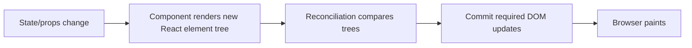
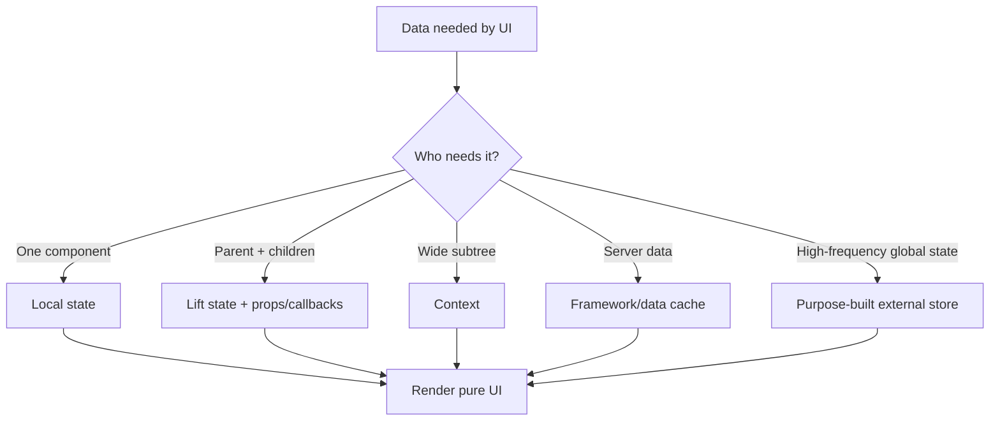

# Caelius Interview Preparation

## Next.js and React (Q471-Q480)

For React/Next.js questions, speak in this order:

```text
UI problem -> Component/state ownership -> Render behavior -> Side effects/data flow -> Performance/accessibility tradeoff
```

Project connection:

> Nodeflowz uses Next.js, React, and React Flow for an interactive workflow canvas. Users add and connect nodes, save graph state through tRPC, and receive execution-status updates.

---

# Q471. What Is React.js?

## Define

> React is a JavaScript library for building user interfaces from declarative, reusable components.

Developers describe the UI for the current state, and React updates the rendered interface when state changes.

## Example

```tsx
type WorkflowCardProps = {
  name: string;
  status: "DRAFT" | "ACTIVE" | "PAUSED";
};

export function WorkflowCard({ name, status }: WorkflowCardProps) {
  return (
    <article>
      <h2>{name}</h2>
      <span>{status}</span>
    </article>
  );
}
```

## Core Ideas

- Declarative rendering.
- Component composition.
- One-way data flow.
- State-driven UI.
- Hooks for state, effects, and reusable logic.
- Reconciliation to update the rendered UI.

## React Is Not

- A complete backend framework.
- A database.
- Automatically performant without thoughtful state design.
- A replacement for HTML semantics/accessibility.

## Project Connection

> In Nodeflowz, React drives the visual workflow editor. The UI represents nodes and connections as state, React Flow renders the canvas, and user actions update that graph state.

## Interview Point

React's core value is composing declarative components whose output follows state.

---

# Q472. What Is a Component in React?

## Define

> A React component is a reusable unit that accepts inputs called props and returns React elements describing part of the UI.

## Function Component

```tsx
type NodeCardProps = {
  label: string;
  selected: boolean;
  onDelete: () => void;
};

export function NodeCard({
  label,
  selected,
  onDelete
}: NodeCardProps) {
  return (
    <section aria-selected={selected}>
      <strong>{label}</strong>
      <button type="button" onClick={onDelete}>
        Delete
      </button>
    </section>
  );
}
```

## Good Component Design

- Has a focused responsibility.
- Receives explicit props.
- Owns only state that belongs locally.
- Composes smaller components.
- Exposes events through callback props.
- Preserves accessible HTML semantics.

## Component Composition

```tsx
function WorkflowEditor() {
  return (
    <EditorLayout>
      <NodePalette />
      <WorkflowCanvas />
      <PropertiesPanel />
    </EditorLayout>
  );
}
```

## Project Connection

> A Nodeflowz editor naturally decomposes into the React Flow canvas, node palette, configuration panels, execution controls, and status displays. Component boundaries keep those responsibilities manageable.

## Interview Point

A component is not only reusable markup; it is a unit of UI behavior, data flow, and responsibility.

---

# Q473. What Are State and Props in React?

## Props

> Props are read-only inputs passed from a parent component to a child.

```tsx
<WorkflowCard
  name="Daily Summary"
  status="ACTIVE"
/>
```

The child should not mutate props.

## State

> State is data owned by a component that can change over time and trigger re-rendering.

```tsx
function WorkflowNameEditor() {
  const [name, setName] = useState("Daily Summary");

  return (
    <input
      value={name}
      onChange={(event) => setName(event.target.value)}
    />
  );
}
```

## Comparison

| Props | State |
|---|---|
| Passed from parent | Owned by component/hook/store |
| Read-only to receiver | Updated through setter/reducer |
| Configure/reuse component | Represents changing UI data |
| Changes can trigger render | Changes trigger render |

## State Ownership

Place state in the closest common owner that needs to coordinate it:

```text
Node list + connections -> workflow editor/canvas owner
Temporary input focus   -> local input component
Server workflow data    -> data-fetching/cache layer
```

## Project Connection

> In Nodeflowz, nodes and edges are editor state passed to React Flow as props. User interactions update state, and saving sends the current graph to the backend.

## Interview Point

Props flow down; events usually flow up; state should have one clear owner.

---

# Q474. What Is the Virtual DOM?

## Define

> The virtual DOM is React's in-memory representation of UI elements. React compares render results and reconciles changes into the actual host environment, such as the browser DOM.

## Simplified Flow



## Why It Helps

- Declarative programming model.
- React coordinates efficient updates.
- Component tree and keys help preserve identity.
- Multiple rendering targets are possible.

## Key Importance

```tsx
{nodes.map((node) => (
  <NodeCard key={node.id} node={node} />
))}
```

Stable keys help React match previous and next list items. Avoid array indexes when items can be reordered, inserted, or removed.

## Important Nuance

The virtual DOM does not guarantee every React app is fast. Performance depends on state location, render frequency, computation, list size, effects, and browser work.

## Interview Point

React reconciliation decides which host updates are required; the virtual DOM is a means to that declarative model, not magic automatic optimization.

---

# Q475. What Are useState and useEffect?

## `useState`

> `useState` adds local state to a function component.

```tsx
const [selectedNodeId, setSelectedNodeId] =
  useState<string | null>(null);
```

Functional update when based on previous state:

```tsx
setAttempts((current) => current + 1);
```

## `useEffect`

> `useEffect` synchronizes a component with an external system after rendering.

```tsx
useEffect(() => {
  const unsubscribe = executionEvents.subscribe(
    executionId,
    setExecutionStatus
  );

  return unsubscribe;
}, [executionId]);
```

## Dependency Behavior

```tsx
useEffect(() => {
  // Runs after every committed render.
});

useEffect(() => {
  // Runs on mount and cleans up on unmount.
}, []);

useEffect(() => {
  // Re-runs when executionId changes.
}, [executionId]);
```

## What Effects Are For

- Subscriptions.
- Timers.
- Browser APIs.
- Network synchronization when framework/data layer does not manage it.
- Integrating imperative libraries.

## Avoid Unnecessary Effects

Derived render data usually should not be stored through an effect:

```tsx
const visibleNodes = nodes.filter(matchesFilter);
```

instead of setting derived state in an effect.

## Project Connection

> In Nodeflowz, local selection/editing can use state, while execution-status subscriptions or imperative React Flow integration are appropriate effect-like synchronization concerns.

## Interview Point

`useState` stores changing local data; `useEffect` synchronizes with systems outside React's render calculation.

---

# Q476. What Is useContext?

## Define

> `useContext` reads the nearest matching React context value, allowing data to pass through a component subtree without manually forwarding props through every level.

## Example

```tsx
type EditorContextValue = {
  readonlyMode: boolean;
  selectedWorkflowId: string | null;
};

const EditorContext = createContext<EditorContextValue | null>(null);

export function useEditorContext() {
  const value = useContext(EditorContext);
  if (!value) {
    throw new Error("EditorContext provider is missing");
  }
  return value;
}
```

Provider:

```tsx
<EditorContext.Provider
  value={{
    readonlyMode,
    selectedWorkflowId
  }}
>
  <WorkflowCanvas />
</EditorContext.Provider>
```

## Appropriate Uses

- Theme.
- Locale.
- Auth/session view.
- Shared editor configuration.
- Stable service clients.

## Tradeoffs

- Context value changes re-render consumers.
- Overusing one large context creates broad coupling.
- Context is not automatically a complete state-management solution.

## Optimize

- Split contexts by responsibility.
- Keep values stable where useful.
- Store state close to consumers.
- Use specialized external stores for complex/high-frequency state.

## Interview Point

Context solves prop passing across a subtree; use it for genuinely shared data, not every state value.

---

# Q477. What Is the React Lifecycle?

## Define

> The React lifecycle describes how a component is created, rendered, committed, updated, and removed.

## Function-Component Mental Model

```text
Render phase:
  React calls components to calculate UI.

Commit phase:
  React applies host/DOM updates.

Effects:
  Effects synchronize external systems after commit.

Cleanup:
  Effect cleanup runs before re-run and on unmount.
```

## Effect Lifecycle Example

```tsx
useEffect(() => {
  const connection = connect(executionId);

  return () => {
    connection.disconnect();
  };
}, [executionId]);
```

Timeline:

```text
mount with id A -> connect A
id changes to B -> disconnect A -> connect B
unmount         -> disconnect B
```

## Class Lifecycle Mapping

Older/class-component concepts:

- `componentDidMount`.
- `componentDidUpdate`.
- `componentWillUnmount`.

Hooks express synchronization by dependency rather than splitting related logic across those methods.

## Strict Mode Development Behavior

React development Strict Mode may intentionally run certain logic/effect setup and cleanup extra times to reveal unsafe side effects. Effects should be resilient and clean up correctly.

## Interview Point

Rendering must stay pure; external synchronization belongs in effects with correct cleanup.

---

# Q478. What Is Next.js?

## Define

> Next.js is a React framework that provides routing, server and client rendering capabilities, data-fetching patterns, backend/server features, optimization, and production build tooling.

## Capabilities

- File-system routing.
- Server Components and Client Components in the App Router.
- Server-side rendering and static generation.
- Route handlers/server actions depending on architecture.
- Image/font optimization.
- Metadata and streaming.
- Bundling and deployment tooling.

## App Router Example

```tsx
// app/workflows/[workflowId]/page.tsx
export default async function WorkflowPage({
  params
}: {
  params: Promise<{ workflowId: string }>;
}) {
  const { workflowId } = await params;
  const workflow = await loadWorkflow(workflowId);

  return <WorkflowEditor workflow={workflow} />;
}
```

## Client Component

Interactive browser behavior requires a client boundary:

```tsx
"use client";

export function WorkflowEditor() {
  // Hooks and browser interaction.
}
```

## Project Connection

> Nodeflowz uses Next.js for the full-stack application shell and React Flow canvas, while tRPC connects typed frontend calls to protected backend procedures.

## Interview Point

React is the UI library; Next.js adds application framework capabilities around routing, rendering, server behavior, and production delivery.

---

# Q479. SSR vs CSR vs SSG in Next.js

## CSR: Client-Side Rendering

The browser receives a minimal shell and JavaScript renders/fetches data.

Good for:

- Highly interactive authenticated interfaces.
- Browser-only behavior.

Tradeoffs:

- More client JavaScript.
- Slower initial content on weak clients/connections.

## SSR: Server-Side Rendering

HTML is generated on the server for a request.

Good for:

- Request-specific or frequently changing content.
- Personalized pages.
- Fast first content and discoverability.

Tradeoffs:

- Server work per request.
- Caching complexity.

## SSG: Static Site Generation

HTML is generated at build time or through framework-managed static generation and served as static content.

Good for:

- Documentation.
- Marketing pages.
- Content that changes infrequently.

Tradeoffs:

- Staleness until rebuild/revalidation.
- Not ideal for fully request-specific data.

## Comparison

| Mode | Render time | Best fit |
|---|---|---|
| CSR | Browser/runtime | Highly interactive client UI |
| SSR | Request time | Dynamic/request-specific page |
| SSG | Build/static generation time | Stable cacheable content |

## Modern Next.js Nuance

Next.js can mix server-rendered/static content with client-interactive islands and supports revalidation/caching options. Rendering is often chosen per route/component/data request, not once for the whole app.

## Project Connection

> Nodeflowz's workflow editor is highly interactive and needs client-side behavior, while public or informational pages can use server/static rendering where appropriate.

## Interview Point

Choose rendering from freshness, personalization, SEO/initial-content, caching, and interaction needs.

---

# Q480. What Is File-Based Routing in Next.js?

## Define

> File-based routing maps files and folders in a Next.js routing directory to application URL routes.

## App Router Example

```text
app/
  page.tsx                         -> /
  workflows/
    page.tsx                       -> /workflows
    [workflowId]/
      page.tsx                     -> /workflows/:workflowId
      executions/
        page.tsx                   -> /workflows/:workflowId/executions
  api/
    health/
      route.ts                     -> /api/health
```

## Special Files

Common App Router files:

- `page.tsx`: route UI.
- `layout.tsx`: shared layout.
- `loading.tsx`: loading UI.
- `error.tsx`: error boundary UI.
- `not-found.tsx`: not-found UI.
- `route.ts`: HTTP route handler.

## Dynamic and Catch-All Segments

```text
[workflowId]    dynamic segment
[...slug]       catch-all segment
[[...slug]]     optional catch-all segment
```

## Benefits

- Route structure visible in filesystem.
- Nested layouts.
- Colocation of route-specific behavior.
- Reduced manual routing configuration.

## Caution

Routing conventions differ between the older Pages Router and newer App Router. Explain which architecture the project uses before discussing details.

## Interview Point

File-based routing turns filesystem conventions into URL and layout structure.

---

# React State and Rendering Guide



# Next.js and React Interview Checklist

Before implementing UI behavior, ask:

```text
Which component owns the state?
Can data be derived during render?
Is an effect synchronizing an external system?
Does the effect clean up correctly?
Are list keys stable?
Would context cause broad re-renders?
Does the component need to be a Client Component?
Should the route use static, server, or client rendering?
Is routing behavior App Router or Pages Router specific?
Are loading, error, and accessibility states handled?
```

# Next.js and React Revision Sheet

| Question | Core answer |
|---|---|
| React | Declarative component-based UI library |
| Component | Reusable UI behavior and rendering unit |
| State vs props | Owned changing data vs read-only inputs |
| Virtual DOM | In-memory render representation used in reconciliation |
| useState/useEffect | Local state and external-system synchronization |
| useContext | Read shared subtree context |
| React lifecycle | Render, commit, effects, cleanup |
| Next.js | React application framework |
| SSR/CSR/SSG | Request, client, and static rendering strategies |
| File-based routing | Files/folders define routes and layouts |

## Common Interview Mistakes

- Calling React a complete framework without context.
- Mutating props or state directly.
- Storing every derived value in state.
- Using effects for pure calculations.
- Omitting effect cleanup.
- Using unstable array-index keys for reorderable lists.
- Putting all state into one context.
- Assuming the virtual DOM guarantees performance.
- Treating an entire Next.js app as only SSR or only CSR.
- Mixing Pages Router and App Router conventions without clarification.
