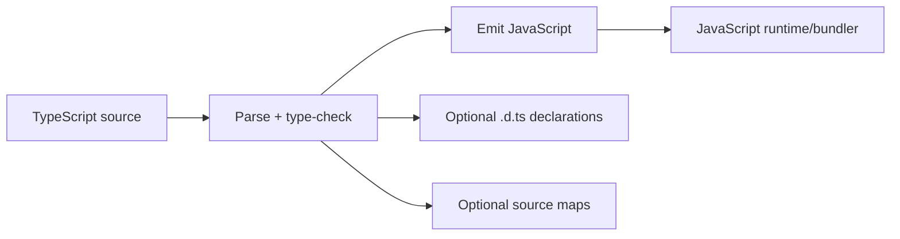
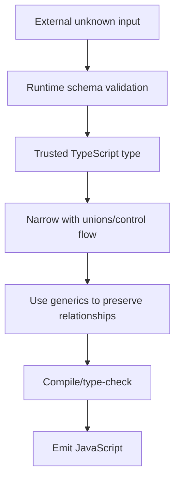

# Caelius Interview Preparation

## TypeScript (Q481-Q490)

For TypeScript questions, speak in this order:

```text
Compile-time problem -> Type construct -> Narrowing/safety -> Runtime limitation -> Project use
```

Project connection:

> Nodeflowz uses TypeScript across its Next.js/tRPC stack. Types help connect workflow-node data, protected procedures, Prisma results, and executor contracts, but external inputs still require runtime validation.

---

# Q481. What Is TypeScript?

## Define

> TypeScript is a statically typed superset of JavaScript that adds compile-time type checking and language tooling, then emits JavaScript for execution.

## Example

```typescript
type WorkflowStatus = "DRAFT" | "ACTIVE" | "PAUSED";

interface Workflow {
  id: string;
  name: string;
  status: WorkflowStatus;
}

function activate(workflow: Workflow): Workflow {
  return {
    ...workflow,
    status: "ACTIVE"
  };
}
```

The compiler catches:

```typescript
activate({
  id: "wf-42",
  name: "Daily Summary",
  status: "UNKNOWN" // Compile-time error.
});
```

## Benefits

- Finds many mistakes before runtime.
- Improves editor autocomplete and refactoring.
- Documents contracts.
- Supports gradual typing.
- Enables advanced type modeling.

## Runtime Limitation

Type information is generally erased during compilation:

```typescript
const payload: Workflow = JSON.parse(requestBody);
```

The annotation does not validate the incoming JSON. Use runtime schema validation at trust boundaries.

## Project Connection

> In Nodeflowz, TypeScript helps keep frontend node types, tRPC procedure inputs/outputs, Prisma data, and executor selection aligned across the full-stack application.

## Interview Point

TypeScript improves JavaScript development through compile-time checks; it does not replace runtime validation.

---

# Q482. TypeScript vs JavaScript - Key Differences

## Comparison

| TypeScript | JavaScript |
|---|---|
| Adds static type system | Dynamically typed language |
| Compiles/transpiles to JavaScript | Runs directly in JavaScript runtimes |
| Type errors found during development/build | Many type errors appear at runtime |
| Supports interfaces, generics, type aliases | No TypeScript type syntax |
| Strong editor/refactoring support | Tooling infers types dynamically |

## JavaScript

```javascript
function add(left, right) {
  return left + right;
}

add(1, "2"); // Returns "12".
```

## TypeScript

```typescript
function add(left: number, right: number): number {
  return left + right;
}

add(1, "2"); // Compile-time error.
```

## Important Nuance

- TypeScript is structurally typed.
- JavaScript code can often be adopted gradually.
- TypeScript cannot prevent every runtime error.
- Type assertions can suppress safety.
- The emitted program is JavaScript.

## Choosing

TypeScript is especially valuable for larger codebases, shared contracts, complex domain models, and team refactoring. Small scripts may not need the same type overhead.

## Interview Point

TypeScript adds compile-time guarantees and tooling while preserving JavaScript runtime semantics.

---

# Q483. What Are Types and Interfaces in TypeScript?

## Types

Type annotations describe allowed values:

```typescript
const workflowId: string = "wf-42";
const attemptCount: number = 3;
const active: boolean = true;
```

Type aliases name any type:

```typescript
type NodeId = string;
type NodeType = "HTTP" | "SLACK" | "GEMINI";

type ExecutionResult = {
  status: "SUCCEEDED" | "FAILED";
  output: unknown;
};
```

## Interfaces

Interfaces commonly describe object/class contracts:

```typescript
interface NodeExecutor {
  execute(
    input: unknown,
    context: ExecutionContext
  ): Promise<ExecutionContext>;
}
```

Extension:

```typescript
interface RetriableExecutor extends NodeExecutor {
  maxAttempts: number;
}
```

## Structural Typing

An object satisfies an interface when it has the required compatible shape:

```typescript
const executor = {
  async execute(input: unknown, context: ExecutionContext) {
    return context;
  }
};

const typedExecutor: NodeExecutor = executor;
```

## Runtime Limitation

Neither type aliases nor interfaces exist as runtime validation objects after compilation.

## Interview Point

Types can describe any TypeScript type expression; interfaces are especially useful for extensible object contracts.

---

# Q484. What Is a Union Type?

## Define

> A union type allows a value to be one of several possible types.

## Simple Union

```typescript
type Identifier = string | number;
```

## Literal Union

```typescript
type ExecutionStatus =
  | "QUEUED"
  | "RUNNING"
  | "SUCCEEDED"
  | "FAILED";
```

## Discriminated Union

```typescript
type WorkflowNode =
  | {
      type: "HTTP";
      url: string;
      method: "GET" | "POST";
    }
  | {
      type: "SLACK";
      channel: string;
      message: string;
    }
  | {
      type: "GEMINI";
      prompt: string;
      model: string;
    };
```

Narrowing:

```typescript
function describeNode(node: WorkflowNode): string {
  switch (node.type) {
    case "HTTP":
      return `${node.method} ${node.url}`;
    case "SLACK":
      return `Slack channel ${node.channel}`;
    case "GEMINI":
      return `Gemini model ${node.model}`;
  }
}
```

## Exhaustiveness Check

```typescript
function assertNever(value: never): never {
  throw new Error(`Unexpected value: ${value}`);
}
```

## Project Connection

> Nodeflowz node types naturally fit a discriminated union because each node type has different configuration fields while sharing a common `type` discriminator.

## Interview Point

Union types model alternatives; discriminated unions make safe narrowing and exhaustive handling practical.

---

# Q485. What Is any vs unknown?

## `any`

> `any` disables type checking for a value and allows nearly every operation.

```typescript
let payload: any = JSON.parse(body);
payload.nonexistent.deep.call(); // Compiles, may fail at runtime.
```

## `unknown`

> `unknown` accepts any value but requires narrowing or validation before use.

```typescript
let payload: unknown = JSON.parse(body);

if (
  typeof payload === "object"
  && payload !== null
  && "name" in payload
) {
  // Still narrow carefully before using name.
}
```

## Runtime Schema Validation

```typescript
const workflowInput = workflowSchema.parse(JSON.parse(body));
```

After validation, `workflowInput` has a trusted inferred type.

## Comparison

| `any` | `unknown` |
|---|---|
| Opts out of checking | Preserves safety |
| Operations allowed immediately | Must narrow before operations |
| Spreads unsafety through code | Good for external/untrusted values |
| Useful mainly at controlled escape hatches | Preferred at trust boundaries |

## Project Connection

> Workflow node context and external-provider responses can be dynamic. Using `unknown` plus validation is safer than allowing `any` to leak through every executor.

## Interview Point

Use `unknown` when the value can be anything but must be checked; use `any` only as a deliberate, contained escape hatch.

---

# Q486. What Are Generics in TypeScript?

## Define

> Generics let types and functions work with multiple value types while preserving relationships between inputs and outputs.

## Generic Function

```typescript
function first<T>(values: readonly T[]): T | undefined {
  return values[0];
}

const firstId = first(["wf-1", "wf-2"]); // string | undefined
const firstCount = first([1, 2, 3]);      // number | undefined
```

## Generic Interface

```typescript
interface Repository<T, TId> {
  findById(id: TId): Promise<T | null>;
  save(entity: T): Promise<T>;
}
```

## Generic Constraint

```typescript
function identifierOf<T extends { id: string }>(value: T): string {
  return value.id;
}
```

## Key-Based Generic

```typescript
function getProperty<T, K extends keyof T>(
  value: T,
  key: K
): T[K] {
  return value[key];
}
```

## Benefit

Without generics, code often loses type information with `any` or duplicates implementations for each type.

## Tradeoff

Overly complex generics can make APIs unreadable. Use them when they preserve a meaningful type relationship.

## Interview Point

Generics make reusable code type-safe by carrying type information through an operation.

---

# Q487. What Is type vs interface in TypeScript?

## Shared Capabilities

Both can describe object shapes:

```typescript
type WorkflowType = {
  id: string;
  name: string;
};

interface WorkflowInterface {
  id: string;
  name: string;
}
```

## Key Differences

| `type` | `interface` |
|---|---|
| Can alias unions, primitives, tuples, mapped/conditional types | Primarily declares object/class contracts |
| Composes with intersections | Extends with `extends` |
| Cannot be reopened/merged | Supports declaration merging |
| Strong for expressive type operations | Strong for public extensible object contracts |

## Type Union

```typescript
type Result =
  | { ok: true; value: string }
  | { ok: false; error: Error };
```

Interfaces cannot directly express this union.

## Interface Declaration Merging

```typescript
interface RequestContext {
  requestId: string;
}

interface RequestContext {
  userId?: string;
}
```

The declarations merge.

## Practical Guidance

- Use interfaces for clear extensible object contracts.
- Use type aliases for unions, mapped types, tuples, and expressive composition.
- Follow the codebase convention when either works.

## Interview Point

There is significant overlap; choose based on required type features and intended extensibility.

---

# Q488. What Is an Enum in TypeScript?

## Define

> A TypeScript enum defines a named set of constants and usually emits a runtime JavaScript object.

## String Enum

```typescript
enum ExecutionStatus {
  Queued = "QUEUED",
  Running = "RUNNING",
  Succeeded = "SUCCEEDED",
  Failed = "FAILED"
}
```

Use:

```typescript
const status: ExecutionStatus = ExecutionStatus.Queued;
```

## Literal-Union Alternative

```typescript
const executionStatuses = [
  "QUEUED",
  "RUNNING",
  "SUCCEEDED",
  "FAILED"
] as const;

type ExecutionStatus = typeof executionStatuses[number];
```

## Comparison

| Enum | Literal union |
|---|---|
| Runtime object generated | Usually type-only |
| Named member access | Simple string/value compatibility |
| Useful for runtime enumeration | Often lighter and easier with JSON APIs |
| Numeric enums have reverse mapping behavior | No numeric reverse mapping surprises |

## Runtime Validation

Neither an enum annotation nor union type validates external input automatically. Validate that a received string belongs to the allowed set.

## Project Connection

> Node and execution status values can use enums or literal unions. Literal discriminants are particularly useful for JSON-like node configurations and exhaustive switches.

## Interview Point

TypeScript enums exist at runtime; literal unions are often a lighter alternative for API/domain string values.

---

# Q489. What Is Strict Mode in TypeScript?

## Define

> TypeScript's `strict` compiler option enables a family of stronger type-checking rules that catch more unsafe assumptions.

## Configuration

```json
{
  "compilerOptions": {
    "strict": true
  }
}
```

## Important Strict Checks

- `strictNullChecks`.
- `noImplicitAny`.
- `strictFunctionTypes`.
- `strictPropertyInitialization`.
- `useUnknownInCatchVariables`.
- Other strict-family checks depending on compiler version.

## Example

Without careful null handling:

```typescript
function workflowName(workflow: Workflow | null): string {
  return workflow.name; // Error with strict null checks.
}
```

Correct:

```typescript
function workflowName(workflow: Workflow | null): string {
  if (!workflow) {
    return "Unknown workflow";
  }
  return workflow.name;
}
```

## Benefits

- Finds null/undefined mistakes.
- Prevents accidental implicit `any`.
- Makes contracts more honest.
- Improves refactoring confidence.

## Adoption

Legacy projects can enable stricter options gradually, but new projects benefit from starting strict.

## Interview Point

Strict mode increases compile-time safety; it does not perform runtime validation or guarantee bug-free code.

---

# Q490. What Is TypeScript Compilation?

## Define

> TypeScript compilation parses TypeScript, checks types, transforms syntax as configured, and emits JavaScript and optional declaration/source-map files.

## Flow



## Example

TypeScript:

```typescript
const status: "ACTIVE" | "PAUSED" = "ACTIVE";
```

Emitted JavaScript:

```javascript
const status = "ACTIVE";
```

The union type is erased.

## `tsconfig.json`

Controls options such as:

```json
{
  "compilerOptions": {
    "target": "ES2022",
    "module": "ESNext",
    "strict": true,
    "noEmit": true
  }
}
```

Frameworks/bundlers may transpile files while `tsc --noEmit` performs type checking separately.

## Type Errors and Emit

Behavior depends on configuration/toolchain. Use build/CI settings that fail on type errors rather than assuming every transpiler performs full type checking.

## Runtime Validation Reminder

Because most types disappear:

```typescript
interface WorkflowInput {
  name: string;
}
```

does not validate network JSON. Runtime schema validation remains required.

## Project Connection

> In Nodeflowz, TypeScript provides compile-time contracts across frontend and backend code, while tools such as tRPC and runtime input schemas help connect those contracts safely across network boundaries.

## Interview Point

TypeScript compilation produces JavaScript; its type system primarily protects development/build time, not runtime inputs.

---

# TypeScript Safety Flow



# TypeScript Interview Checklist

Before finalizing a contract, ask:

```text
Is this value trusted or external?
Should the boundary type be unknown?
What runtime schema validates it?
Can a discriminated union model alternatives?
Is the switch exhaustive?
Would a generic preserve a useful relationship?
Should this be a type alias or interface?
Is an enum runtime object actually needed?
Is strict mode enabled?
Does CI run full type checking?
```

# TypeScript Revision Sheet

| Question | Core answer |
|---|---|
| TypeScript | Typed superset that emits JavaScript |
| TS vs JS | Compile-time types/tooling vs dynamic runtime language |
| Types/interfaces | Value descriptions and object contracts |
| Union type | Value may be one of multiple alternatives |
| any vs unknown | Disable checking vs require narrowing |
| Generics | Reuse while preserving type relationships |
| type vs interface | Expressive alias vs extensible object declaration |
| Enum | Named constants with runtime representation |
| Strict mode | Family of stronger type checks |
| Compilation | Type-check/transform TypeScript into JavaScript |

## Common Interview Mistakes

- Claiming TypeScript types validate runtime JSON.
- Treating TypeScript as a separate runtime from JavaScript.
- Using `any` for every uncertain value.
- Failing to narrow union types.
- Writing generics that do not preserve meaningful relationships.
- Claiming `type` or `interface` is universally better.
- Forgetting enums usually emit runtime code.
- Saying strict mode prevents all runtime errors.
- Assuming transpilation always includes full type checking.
