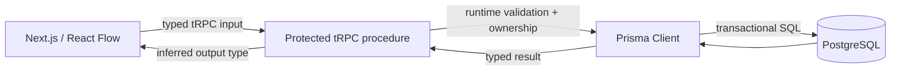

# Caelius Interview Preparation

## tRPC and Prisma (Q491-Q500)

For tRPC/Prisma questions, speak in this order:

```text
Problem -> Type/data contract -> Runtime validation/transaction -> Generated tooling -> Tradeoff -> Nodeflowz use
```

Project connection:

> Nodeflowz uses Next.js, TypeScript, tRPC, Prisma, and PostgreSQL. The frontend calls protected typed procedures, Prisma persists relational workflow data, and graph replacement is performed transactionally.

---

# Q491. What Is tRPC?

## Define

> tRPC is a TypeScript framework for building end-to-end type-safe APIs by sharing procedure type inference between a TypeScript server and TypeScript client without manually generating a separate API schema.

## Server Router Example

```typescript
import { z } from "zod";

export const workflowRouter = router({
  byId: protectedProcedure
    .input(z.object({
      workflowId: z.string().min(1)
    }))
    .query(async ({ ctx, input }) => {
      return ctx.prisma.workflow.findFirstOrThrow({
        where: {
          id: input.workflowId,
          userId: ctx.session.user.id
        }
      });
    })
});
```

## Client Use

```typescript
const workflow = trpc.workflow.byId.useQuery({
  workflowId
});
```

The client infers the input and output types from the server router.

## Core Concepts

- Routers group procedures.
- Queries read data.
- Mutations change data.
- Subscriptions/streaming depend on setup/version.
- Context carries request-scoped dependencies.
- Middleware implements reusable concerns.
- Runtime validators validate untrusted input.

## Important Boundary

tRPC type safety exists when client and server share TypeScript contracts. It does not automatically create a language-neutral public API for non-TypeScript consumers.

## Project Connection

> Nodeflowz uses protected tRPC procedures between the React/Next.js frontend and backend. That gives fast full-stack iteration with inferred types while still allowing runtime input validation and ownership checks.

## Interview Point

tRPC reduces manual client/server contract duplication, but runtime validation and authorization remain essential.

---

# Q492. Why Did You Use tRPC in Nodeflowz Instead of REST?

## Problem

Nodeflowz is a TypeScript full-stack application where the frontend and backend evolve together. Workflow graphs contain typed node and connection data, and many operations are internal product procedures rather than a public multi-language API.

## Why tRPC Fit

- End-to-end input/output type inference.
- Less manual DTO/client generation.
- Refactoring errors appear during development/build.
- Natural integration with Next.js and TypeScript.
- Routers and protected procedures organize internal API behavior.

## Example Benefit

If a procedure changes:

```typescript
type WorkflowInput = {
  workflowId: string;
  nodes: WorkflowNode[];
  connections: Connection[];
};
```

frontend callers receive type errors until updated.

## Why Not Claim REST Is Inferior?

REST is often better when:

- External/non-TypeScript clients consume the API.
- OpenAPI contracts and broad ecosystem tooling are required.
- HTTP resource semantics and independent service evolution dominate.
- Public APIs need stable language-neutral contracts.

## Runtime and Security Still Matter

tRPC does not replace:

- Input validation.
- Authentication/authorization.
- Versioning strategy.
- Rate limiting.
- Idempotency.
- Observability.

## Interview-Ready Answer

> I used tRPC because Nodeflowz is a TypeScript monorepo-style full-stack product where the frontend and backend change together. End-to-end inferred procedure types reduced contract duplication and made graph/API refactoring safer. I would prefer REST or another language-neutral contract for external integrations or independently evolving services.

---

# Q493. What Is Prisma ORM?

## Define

> Prisma is a TypeScript/JavaScript database toolkit that provides a declarative data model, migrations, and a generated type-safe database client.

## Main Parts

- Prisma schema.
- Prisma Client.
- Prisma Migrate.
- Prisma CLI/tooling.

## Query Example

```typescript
const workflow = await prisma.workflow.findUniqueOrThrow({
  where: {
    id: workflowId
  },
  include: {
    nodes: true,
    connections: true
  }
});
```

## Benefits

- Generated typed queries.
- Autocomplete/refactoring support.
- Clear model and relation definitions.
- Migration workflow.
- Protection from many manual query-shape mistakes.

## Limitations

- Abstraction does not remove database design responsibilities.
- Complex/DB-specific queries may require raw SQL or other approaches.
- Query performance still requires indexes and execution-plan awareness.
- Generated types do not validate arbitrary external input.

## Project Connection

> Nodeflowz uses Prisma with PostgreSQL to persist workflows, nodes, connections, credentials, and execution records. The generated client makes relation-aware application queries type-safe.

## Interview Point

Prisma is a typed database toolkit/ORM, not a replacement for SQL, transactions, constraints, or query optimization knowledge.

---

# Q494. What Is an ORM?

## Define

> An Object-Relational Mapper maps application-level objects/models and operations to relational database tables, rows, relationships, and SQL.

## Conceptual Mapping

```text
Application model Workflow
    ->
Table workflow

workflow.nodes relation
    ->
workflow.id joined to node.workflow_id
```

## ORM Example

```typescript
const workflows = await prisma.workflow.findMany({
  where: {
    userId
  },
  orderBy: {
    updatedAt: "desc"
  }
});
```

The ORM produces and executes appropriate SQL.

## Benefits

- Less repetitive CRUD SQL.
- Typed/composable query APIs.
- Relation handling.
- Migration/tooling integration.
- Faster common application development.

## Risks

- N+1 queries.
- Hidden inefficient SQL.
- Over-fetching.
- Leaky abstractions.
- Database-specific capabilities being ignored.

## Interview Point

An ORM improves application productivity, but engineers still need relational modeling, constraints, indexes, transactions, and SQL performance knowledge.

---

# Q495. What Is a Prisma Schema?

## Define

> A Prisma schema is the declarative configuration file that defines the database connection, generated client, application data models, fields, constraints, and relations.

## Example

```prisma
generator client {
  provider = "prisma-client-js"
}

datasource db {
  provider = "postgresql"
  url      = env("DATABASE_URL")
}

model Workflow {
  id          String       @id @default(cuid())
  name        String
  userId      String
  nodes       Node[]
  connections Connection[]
  createdAt   DateTime     @default(now())
  updatedAt   DateTime     @updatedAt

  @@index([userId, updatedAt])
}

model Node {
  id         String   @id @default(cuid())
  workflowId String
  type       String
  data       Json
  workflow   Workflow @relation(
    fields: [workflowId],
    references: [id],
    onDelete: Cascade
  )

  @@index([workflowId])
}
```

## Schema Responsibilities

- Model names and fields.
- Database mappings.
- IDs/defaults.
- Unique constraints/indexes.
- Relations and referential actions.
- Provider/generator configuration.

## Important Nuance

The Prisma schema represents Prisma's application data model and maps to the database schema. Some database-specific features may require custom SQL migrations or unsupported-feature handling.

## Project Connection

> In Nodeflowz, the Prisma schema expresses relational ownership between workflows, nodes, connections, users, credentials, and execution data.

## Interview Point

The schema is the declarative source used by Prisma tooling, but the database remains the runtime source of truth for stored data and constraints.

---

# Q496. What Is prisma migrate?

## Define

> Prisma Migrate manages database schema changes through versioned migration files derived from Prisma schema changes and applied to target databases.

## Development Workflow

```text
npx prisma migrate dev --name add_execution_status
```

This commonly:

- Detects schema changes.
- Creates a migration.
- Applies it to the development database.
- Regenerates Prisma Client.

## Production Deployment

```text
npx prisma migrate deploy
```

This applies pending committed migrations without creating new ones.

## Why Migrations Matter

- Version database changes with application code.
- Review generated SQL.
- Reproduce environments.
- Deploy schema changes deliberately.

## Production Safety

Schema changes may require more than generated SQL:

- Backfill data.
- Avoid long table locks.
- Add nullable column, migrate data, then enforce non-null.
- Coordinate old/new application versions.
- Test rollback/forward-recovery strategy.

## Important Commands

```text
prisma migrate dev
prisma migrate deploy
prisma migrate status
```

`prisma db push` synchronizes schema without the same migration-history workflow and is generally not the production migration substitute.

## Interview Point

Migrations are deployment artifacts that evolve persisted data safely, not merely a local code-generation step.

---

# Q497. What Is prisma generate?

## Define

> `prisma generate` reads the Prisma schema and runs configured generators, most commonly producing Prisma Client and its TypeScript types.

## Command

```text
npx prisma generate
```

## What It Produces

Based on the schema:

- Typed model/query APIs.
- Input/output types.
- Relation query types.
- Generator-specific artifacts.

## Example

After defining:

```prisma
model Workflow {
  id   String @id
  name String
}
```

generated client supports:

```typescript
const workflow = await prisma.workflow.findUnique({
  where: { id: workflowId }
});
```

## Generate vs Migrate

| `prisma generate` | `prisma migrate` |
|---|---|
| Generates code/artifacts | Changes database schema |
| Does not apply DB migrations | Creates/applies migration history |
| Needed after schema/client changes | Needed for persisted schema evolution |

## CI/Build Consideration

Ensure generated client version/schema stay aligned. Many projects generate during install/build or commit appropriate artifacts according to their setup.

## Interview Point

`generate` updates the application client; it does not update the database.

---

# Q498. What Is a Relation in Prisma?

## Define

> A Prisma relation models an association between records, using relation fields in Prisma and scalar foreign-key fields in relational databases.

## One-to-Many Example

```prisma
model Workflow {
  id    String @id @default(cuid())
  nodes Node[]
}

model Node {
  id         String   @id @default(cuid())
  workflowId String
  workflow   Workflow @relation(
    fields: [workflowId],
    references: [id],
    onDelete: Cascade
  )
}
```

Meaning:

- One workflow has many nodes.
- Each node belongs to one workflow.
- `workflowId` is the database foreign key.
- `workflow` and `nodes` are Prisma relation fields.

## Relation Types

- One-to-one.
- One-to-many.
- Many-to-many, implicit or explicit join model.

## Query Relation

```typescript
const workflow = await prisma.workflow.findUniqueOrThrow({
  where: { id: workflowId },
  include: {
    nodes: true
  }
});
```

## Explicit Join Model

Use an explicit relation model when the relationship has fields:

```prisma
model WorkflowMember {
  workflowId String
  userId     String
  role       String

  @@id([workflowId, userId])
}
```

## Interview Point

Prisma relation fields make associations convenient in application code, while scalar relation fields and database foreign keys enforce persistence relationships.

---

# Q499. How Does Prisma Handle Transactions?

## Define

> Prisma supports transactions so multiple database operations commit or roll back as one unit.

## Sequential Batch Transaction

```typescript
const [deletedConnections, deletedNodes] =
  await prisma.$transaction([
    prisma.connection.deleteMany({
      where: { workflowId }
    }),
    prisma.node.deleteMany({
      where: { workflowId }
    })
  ]);
```

Useful when operations are known upfront and do not depend on intermediate results.

## Interactive Transaction

```typescript
await prisma.$transaction(async (tx) => {
  const workflow = await tx.workflow.findFirstOrThrow({
    where: {
      id: workflowId,
      userId
    }
  });

  await tx.connection.deleteMany({
    where: { workflowId: workflow.id }
  });

  await tx.node.deleteMany({
    where: { workflowId: workflow.id }
  });

  await tx.node.createMany({
    data: nodes
  });

  await tx.connection.createMany({
    data: connections
  });

  await tx.workflow.update({
    where: { id: workflow.id },
    data: { updatedAt: new Date() }
  });
});
```

## Nodeflowz Reason

> Saving a workflow replaces related nodes and connections. Without a transaction, a failure after deleting old graph data but before inserting the new graph could leave a partially saved workflow. The Prisma transaction makes graph replacement atomic.

## Transaction Guidance

- Keep transactions short.
- Avoid slow network calls inside them.
- Validate expected affected rows.
- Choose isolation/retry behavior for concurrency risks.
- Ensure external side effects are handled separately/idempotently.

## Interview Point

Use interactive transactions when operations depend on intermediate results; use batch transactions for independent known operations.

---

# Q500. What Is Prisma Client?

## Define

> Prisma Client is the generated type-safe query client used by TypeScript/JavaScript applications to access the configured database through the Prisma data model.

## Create Client

```typescript
import { PrismaClient } from "@prisma/client";

const prisma = new PrismaClient();
```

## Query Examples

```typescript
const workflow = await prisma.workflow.findUniqueOrThrow({
  where: {
    id: workflowId
  },
  include: {
    nodes: true,
    connections: true
  }
});
```

```typescript
const executions = await prisma.execution.findMany({
  where: {
    workflowId,
    status: "FAILED"
  },
  orderBy: {
    startedAt: "desc"
  },
  take: 20
});
```

## Benefits

- Generated model/query types.
- Autocomplete.
- Relation-aware queries.
- Transaction API.
- Safer refactoring.

## Lifecycle Concern

Do not create a new client per request in long-running applications. Reuse an appropriately scoped client so connection pooling/resources are managed correctly. Development hot reload may require a singleton-style module pattern.

## Query Performance

Prisma Client does not make every query efficient automatically:

- Select only required fields.
- Avoid N+1 patterns.
- Add indexes from query patterns.
- Use pagination.
- Inspect generated SQL/execution plans when necessary.

## Project Connection

> Nodeflowz uses Prisma Client in tRPC procedures and background execution to load workflow graphs, persist execution state, and perform transactional graph updates.

## Interview Point

Prisma Client is generated from the schema and provides a typed query API, but database performance and correctness still require engineering judgment.

---

# Nodeflowz Typed Data Flow



# tRPC and Prisma Interview Checklist

Before implementing a procedure, ask:

```text
Is the client internal TypeScript or public/multi-language?
What runtime schema validates input?
What authentication and ownership checks apply?
Which Prisma model/relation represents the data?
Does the database need a migration?
Has Prisma Client been regenerated?
Which operations must be transactional?
Can external calls be kept outside the transaction?
Could the query over-fetch or create N+1 behavior?
Which database indexes support the query?
```

# tRPC and Prisma Revision Sheet

| Question | Core answer |
|---|---|
| tRPC | End-to-end inferred TypeScript API procedures |
| Why tRPC | Internal TS full-stack contract with low duplication |
| Prisma | Typed ORM/database toolkit |
| ORM | Maps application operations/models to relational data |
| Prisma schema | Declarative models, relations, datasource, generators |
| Prisma Migrate | Versioned database schema evolution |
| prisma generate | Generate Prisma Client/artifacts |
| Prisma relation | Application relation fields backed by keys/relations |
| Prisma transactions | Atomic batch or interactive operations |
| Prisma Client | Generated typed database query API |

## Common Interview Mistakes

- Claiming tRPC removes runtime validation or authorization.
- Treating tRPC as ideal for every public/multi-language API.
- Assuming ORM knowledge replaces SQL/database knowledge.
- Confusing Prisma schema with current stored data.
- Using `db push` as a universal production migration process.
- Confusing `prisma generate` with database migration.
- Ignoring database foreign keys behind Prisma relations.
- Performing external API calls inside long transactions.
- Creating a Prisma Client per request.
- Assuming generated type safety guarantees efficient queries.
